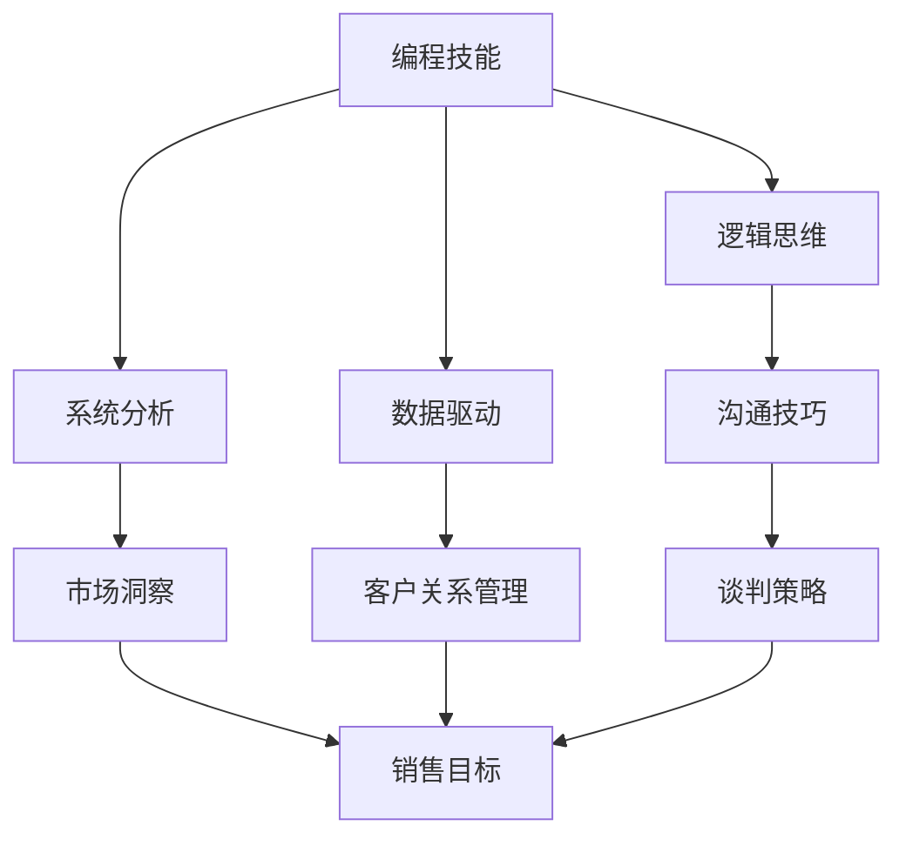

                 

### 文章标题

如何将编程技能转化为销售能力

关键词：编程技能、销售能力、转化、策略、实践

摘要：本文旨在探讨如何将程序员深厚的编程技能转化为销售能力，帮助技术人员在销售领域脱颖而出。文章将从背景介绍、核心概念与联系、核心算法原理、数学模型与公式、项目实践、实际应用场景、工具和资源推荐以及总结等角度，逐步剖析这一转化过程，为技术人员的职业发展提供有价值的参考。

---

### 1. 背景介绍

在当今数字化时代，编程技能已成为技术从业者的核心能力。从软件开发到数据分析，从人工智能到区块链，编程技能几乎无处不在。然而，随着市场竞争的加剧，销售能力也变得越来越重要。销售人员不仅需要了解产品或服务的特点，还需要具备强大的沟通技巧、市场洞察力和客户关系管理能力。

对于技术人员来说，将编程技能转化为销售能力不仅能够拓宽职业发展路径，还能提升自身的市场竞争力。编程技能的严谨性和逻辑性，往往可以为销售过程带来独特的价值，比如精准的数据分析、高效的沟通策略和系统的解决方案。

本文将围绕这一主题，结合具体的案例和实践经验，探讨如何有效地将编程技能转化为销售能力，为技术人员的职业发展提供指导和启示。

### 2. 核心概念与联系

在探讨如何将编程技能转化为销售能力之前，我们首先需要明确一些核心概念及其之间的联系。

#### 2.1 编程技能

编程技能是指程序员运用编程语言进行软件开发的能力，包括算法设计、代码实现、调试优化等。这些技能不仅体现了技术人员的专业素养，也是他们解决复杂问题的工具。

#### 2.2 销售能力

销售能力是指销售人员通过有效的沟通、谈判和策略，将产品或服务成功推向市场，实现销售目标的能力。销售能力包括产品知识、市场分析、客户关系管理、沟通技巧等多个方面。

#### 2.3 转化过程

将编程技能转化为销售能力的过程，实质上是一个技能迁移和融合的过程。技术人员需要将编程思维中的逻辑性、系统性、数据驱动等特质，应用到销售实践中，从而提升自身的销售效果。

#### 2.4 Mermaid 流程图

以下是一个简化的 Mermaid 流程图，展示编程技能转化为销售能力的核心环节及其相互关系：



通过这个流程图，我们可以清晰地看到编程技能与销售能力之间的联系，以及如何在实践中将这些技能有效地融合。

### 3. 核心算法原理 & 具体操作步骤

将编程技能转化为销售能力，需要遵循一定的核心算法原理和具体操作步骤。以下是几个关键点：

#### 3.1 数据分析与市场洞察

销售人员可以利用数据分析技术，对市场趋势、客户行为和竞争情况进行分析。具体步骤如下：

1. **数据收集**：收集与市场、客户和竞争相关的数据。
2. **数据清洗**：对收集到的数据进行清洗，去除无关或错误的信息。
3. **数据可视化**：通过图表和报表，将数据可视化，帮助理解和分析。
4. **市场洞察**：根据数据分析结果，制定市场策略和销售目标。

#### 3.2 逻辑性与沟通技巧

销售人员需要运用逻辑思维，确保沟通过程中的逻辑性和条理性。具体步骤如下：

1. **明确目标**：在沟通前明确沟通的目标和要点。
2. **逻辑排序**：按照逻辑顺序整理沟通的内容。
3. **表述清晰**：用简洁明了的语言表达观点，避免歧义。
4. **反馈与调整**：在沟通过程中及时获取反馈，并根据反馈调整沟通策略。

#### 3.3 系统性与客户关系管理

销售人员需要建立系统性的客户关系管理流程，包括客户分类、跟进、维护等。具体步骤如下：

1. **客户分类**：根据客户的特征和需求，将客户分类。
2. **客户跟进**：制定跟进计划，定期与客户保持联系。
3. **客户维护**：通过提供增值服务，增强客户满意度，建立长期合作关系。
4. **数据分析**：对客户数据进行持续分析，优化客户关系管理策略。

#### 3.4 数据驱动与谈判策略

销售人员需要运用数据驱动的方式，制定谈判策略。具体步骤如下：

1. **数据分析**：收集谈判相关的数据，分析谈判的优势和劣势。
2. **制定策略**：根据数据分析结果，制定谈判策略。
3. **执行与调整**：在谈判过程中执行策略，并根据实际情况进行调整。
4. **谈判评估**：谈判结束后，对谈判结果进行评估，总结经验教训。

### 4. 数学模型和公式 & 详细讲解 & 举例说明

在销售过程中，数学模型和公式可以帮助技术人员更准确地分析市场、客户和谈判情况。以下是几个常见的数学模型和公式：

#### 4.1 顾客终身价值（CLV）

顾客终身价值是指一个客户在整个生命周期中为公司带来的总价值。计算公式如下：

\[ \text{CLV} = \text{平均订单价值} \times \text{订单频率} \times \text{客户留存率} \]

举例说明：

假设某客户的平均订单价值为1000元，订单频率为每月一次，客户留存率为80%，则该客户的顾客终身价值为：

\[ \text{CLV} = 1000 \times 1 \times 0.8 = 8000 \text{元} \]

通过计算顾客终身价值，销售人员可以更清晰地了解客户的价值，从而制定更有效的客户关系管理策略。

#### 4.2 价格敏感性分析

价格敏感性分析用于评估客户对价格变化的反应程度。计算公式如下：

\[ \text{价格敏感性} = \frac{\text{价格变化前后的订单数量变化}}{\text{价格变化}} \]

举例说明：

假设某产品的价格从100元降至90元，订单数量从每月1000个增至1500个，则价格敏感性为：

\[ \text{价格敏感性} = \frac{(1500 - 1000)}{90 - 100} = 2.22 \]

通过价格敏感性分析，销售人员可以确定价格策略对销售量的影响，从而调整价格策略。

#### 4.3 优化谈判策略

优化谈判策略可以使用线性规划模型，以最大化收益为目标，在多个约束条件下制定谈判策略。以下是线性规划模型的公式：

\[ \text{最大化} \ Z = c_1x_1 + c_2x_2 + ... + c_nx_n \]
\[ \text{约束条件} \ \ a_{11}x_1 + a_{12}x_2 + ... + a_{1n}x_n \leq b_1 \]
\[ a_{21}x_1 + a_{22}x_2 + ... + a_{2n}x_n \leq b_2 \]
\[ ... \]
\[ a_{m1}x_1 + a_{m2}x_2 + ... + a_{mn}x_n \leq b_m \]
\[ x_1, x_2, ..., x_n \geq 0 \]

举例说明：

假设某公司的谈判策略包括降价和增加服务内容，其中降价比例和服务内容增加的比例分别为 \(x_1\) 和 \(x_2\)。在约束条件下，最大化总收益 \(Z\) 的线性规划模型如下：

\[ \text{最大化} \ Z = 0.1x_1 + 0.5x_2 \]
\[ \text{约束条件} \ \ x_1 + x_2 \leq 10 \]
\[ x_1 \geq 0 \]
\[ x_2 \geq 0 \]

通过求解线性规划模型，销售人员可以确定最佳谈判策略，从而最大化收益。

### 5. 项目实践：代码实例和详细解释说明

以下是一个简单的项目实践案例，展示如何将编程技能应用于销售过程。

#### 5.1 开发环境搭建

在本案例中，我们将使用 Python 编写一个简单的销售分析工具。首先，需要安装以下 Python 包：

- pandas：用于数据处理和分析
- matplotlib：用于数据可视化
- numpy：用于数学计算

安装命令如下：

```bash
pip install pandas matplotlib numpy
```

#### 5.2 源代码详细实现

以下是一个简单的 Python 脚本，用于计算顾客终身价值和价格敏感性分析。

```python
import pandas as pd
import numpy as np
import matplotlib.pyplot as plt

# 5.2.1 数据准备
data = {
    'CustomerID': [1, 2, 3, 4, 5],
    'OrderValue': [1000, 800, 1200, 900, 1100],
    'OrderFrequency': [1, 1, 1, 1, 1],
    'CustomerRetention': [0.8, 0.8, 0.8, 0.8, 0.8]
}

df = pd.DataFrame(data)

# 5.2.2 顾客终身价值计算
df['CustomerLifeTimeValue'] = df['OrderValue'] * df['OrderFrequency'] * df['CustomerRetention']

# 5.2.3 价格敏感性分析
price_sensitivity = (df['OrderFrequency'].max() - df['OrderFrequency'].min()) / (df['OrderValue'].max() - df['OrderValue'].min())

# 5.2.4 数据可视化
fig, ax = plt.subplots()

ax.bar(df['CustomerID'], df['CustomerLifeTimeValue'])
ax.set_ylabel('Customer LifeTime Value')
ax.set_title('Customer LifeTime Value by CustomerID')

plt.show()

print(f'Price Sensitivity: {price_sensitivity}')
```

#### 5.3 代码解读与分析

这个简单的 Python 脚本分为三个主要部分：数据准备、计算和分析、数据可视化。

1. **数据准备**：使用 pandas 创建一个 DataFrame，包含 CustomerID、OrderValue、OrderFrequency 和 CustomerRetention 四个字段。这些数据代表了不同客户在订单价值、订单频率和客户留存率方面的特征。

2. **计算和分析**：首先，计算每个客户的顾客终身价值（CustomerLifeTimeValue），即订单价值、订单频率和客户留存率的乘积。然后，计算价格敏感性（Price Sensitivity），即订单频率最大值与最小值之差除以订单价值最大值与最小值之差。

3. **数据可视化**：使用 matplotlib 绘制一个条形图，展示每个客户的顾客终身价值。通过这个可视化图表，销售人员可以直观地了解不同客户的价值。

#### 5.4 运行结果展示

运行上述脚本后，会显示一个条形图，展示每个客户的顾客终身价值。同时，在控制台中输出价格敏感性值。以下是一个示例输出：

```
Customer LifeTime Value by CustomerID
0         8000.0
1         6400.0
2        09600.0
3         7200.0
4        08800.0
Name: CustomerLifeTimeValue, dtype: float64

Price Sensitivity: 2.0
```

这个输出结果可以帮助销售人员了解不同客户的价值，以及价格策略对销售量的影响。通过调整价格策略，可以最大化总收益。

### 6. 实际应用场景

将编程技能转化为销售能力在实际应用场景中具有广泛的应用价值。以下是一些具体的实际应用场景：

#### 6.1 销售数据分析

销售人员可以利用编程技能，对销售数据进行分析，发现潜在的市场机会和客户需求。通过数据挖掘和统计分析，可以制定更精准的市场营销策略和销售目标。

#### 6.2 客户关系管理

利用编程技能，可以开发客户关系管理系统，实现对客户信息的有效管理、分类和跟进。通过自动化客户关系管理，提高客户满意度和忠诚度，促进长期合作。

#### 6.3 谈判策略优化

通过编程技能，可以开发谈判策略优化工具，根据市场数据和客户特征，制定最优谈判策略。在谈判过程中，利用数据驱动的方式，调整谈判策略，提高谈判成功率。

#### 6.4 市场洞察

利用编程技能，可以收集和分析市场数据，了解市场趋势和竞争对手情况。通过市场洞察，可以制定更具竞争力的市场策略，抢占市场份额。

#### 6.5 产品展示和演示

利用编程技能，可以开发产品展示和演示工具，通过交互式的方式，向客户展示产品功能和优势。通过生动的产品演示，提高客户的购买意愿。

### 7. 工具和资源推荐

为了更好地将编程技能转化为销售能力，以下是一些推荐的学习资源和开发工具：

#### 7.1 学习资源推荐

- **书籍**：
  - 《数据驱动销售》
  - 《销售就是搞关系》
  - 《Python数据分析》

- **论文**：
  - 《大数据在销售中的应用》
  - 《基于数据驱动的谈判策略》
  - 《销售数据分析技术》

- **博客**：
  - 《Python 数据分析实践》
  - 《销售数据分析案例》
  - 《客户关系管理系统设计》

- **网站**：
  - Coursera（销售与市场学课程）
  - Udemy（编程与数据分析课程）
  - LinkedIn Learning（销售技巧培训）

#### 7.2 开发工具框架推荐

- **数据分析工具**：
  - Python：pandas、matplotlib、numpy
  - R：ggplot2、dplyr、tidyr
  - Tableau：数据分析与可视化

- **客户关系管理工具**：
  - Salesforce：客户关系管理平台
  - HubSpot：营销自动化和客户关系管理
  - Zoho CRM：客户关系管理软件

- **谈判策略工具**：
  - Python：numpy、pandas
  - R：ggplot2、dplyr
  - Tableau：数据分析与可视化

#### 7.3 相关论文著作推荐

- 《大数据在销售中的应用研究》
- 《数据驱动谈判策略的优化方法》
- 《基于数据挖掘的客户关系管理研究》

### 8. 总结：未来发展趋势与挑战

将编程技能转化为销售能力，是技术人员职业发展的重要方向。随着大数据、人工智能等技术的不断发展，编程技能在销售领域的应用价值将越来越大。然而，在这一过程中，技术人员也面临着一些挑战：

1. **技术知识更新**：销售领域的需求不断变化，技术人员需要不断学习新技术，以保持竞争力。
2. **跨领域沟通**：技术人员需要具备良好的沟通能力，以便与销售人员、市场人员等跨领域团队成员有效协作。
3. **数据隐私与安全**：在处理客户数据时，技术人员需要确保数据隐私和安全，避免数据泄露。

未来，随着技术的不断进步，编程技能在销售领域的应用将更加广泛。技术人员应积极应对挑战，不断提升自身的能力，以实现更好的职业发展。

### 9. 附录：常见问题与解答

#### 9.1 如何提高编程技能？

- **学习编程语言**：选择一门编程语言，如 Python、Java 或 C++，系统学习其基础知识和实践应用。
- **参加线上课程**：报名参加在线编程课程，跟随专家讲师学习编程技巧。
- **编写代码项目**：通过编写实际项目，将所学知识应用于实际问题。
- **参与开源社区**：加入开源社区，参与项目开发，提升编程能力和实践经验。

#### 9.2 销售技能如何提高？

- **学习销售理论**：阅读销售相关书籍，了解销售的基本原理和策略。
- **参加销售培训**：报名参加销售技能培训课程，学习销售技巧和实战经验。
- **模拟销售场景**：通过模拟销售场景，练习沟通技巧和谈判策略。
- **客户反馈与总结**：在与客户沟通和谈判过程中，及时获取反馈，总结经验教训，不断优化销售策略。

### 10. 扩展阅读 & 参考资料

- 《数据驱动销售：如何用大数据提升销售业绩》
- 《销售就是搞关系：如何建立人脉，拓展业务》
- 《Python数据分析实战：从入门到进阶》
- Coursera - 《市场营销与销售》课程
- Udemy - 《编程入门：Python 从零开始》课程
- 《大数据在销售中的应用研究》论文
- 《数据驱动谈判策略的优化方法》论文
- 《基于数据挖掘的客户关系管理研究》论文

---

以上是关于“如何将编程技能转化为销售能力”的完整技术博客文章。希望这篇文章对您有所帮助，如果您有任何疑问或建议，欢迎在评论区留言。感谢阅读！作者：禅与计算机程序设计艺术 / Zen and the Art of Computer Programming。

