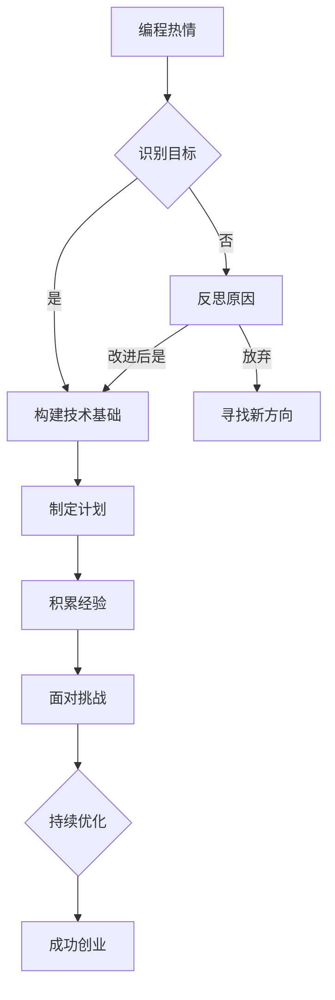

                 

### 1. 背景介绍

#### 热情与动力的区别

在探讨如何将编程热情转化为创业动力之前，我们首先需要明确这两个概念的区别。编程热情指的是对编程这项活动的热爱，它来源于对技术的追求、对解决问题带来的成就感的渴望，以及对新知识的不断探索。而创业动力则是指将这种热情转化为实际行动，通过创建或参与项目来推动创新和发展。

编程热情和创业动力虽然紧密相连，但它们有着本质的不同。编程热情是一种内在的动力，驱动程序员不断学习和实践，而创业动力则是一种外在的驱动，促使程序员将个人的技能和热情投入到实际的项目中，面对市场、用户和竞争等多重挑战。

#### 编程与创业的关联

编程和创业之间的联系在于技术是创业的基础，而创业则为技术的实现提供了舞台。许多成功的创业公司都是基于创新的技术解决方案而成立的，例如谷歌（Google）的搜索引擎、亚马逊（Amazon）的在线购物平台等。这些公司不仅改变了市场格局，还推动了技术的发展。

对于程序员来说，编程技能是他们创业的利器。通过编程，程序员能够快速原型设计、迭代产品，并根据用户反馈进行优化。此外，编程也是构建互联网生态系统的重要组成部分，从网站开发到移动应用，再到大数据分析，编程无所不在。

#### 编程热情的普遍性

编程热情在程序员群体中具有普遍性。许多人因为对计算机科学的热爱而选择了编程作为职业。这种热情不仅体现在工作中，还体现在业余时间的编程实践中。程序员们喜欢解决复杂的问题，享受编写代码带来的成就感，这种成就感是他们继续前行的动力。

然而，尽管有编程热情，很多程序员却并未将其转化为创业动力。这其中的原因可能包括对创业的不了解、对风险的担忧、对失败的恐惧，以及对现状的满足感等。

#### 文章目标

本文的目标是探讨如何将编程热情转化为创业动力。我们将从以下几个方面进行深入讨论：

1. **理解编程热情与创业动力的关系**：通过分析热情和动力之间的区别，帮助程序员理解将热情转化为动力的必要性。
2. **识别阻碍编程热情转化为创业动力的因素**：分析程序员在将编程热情转化为创业动力过程中可能遇到的挑战，并提供相应的解决方案。
3. **构建创业所需的技术基础**：介绍如何通过持续学习和实践，提高编程技能，为创业奠定坚实的基础。
4. **提供创业策略与实践经验**：分享一些成功的创业案例，分析他们的策略和实践经验，为程序员提供可行的创业路径。
5. **总结与展望**：总结全文的主要观点，并对编程热情转化为创业动力这一主题的未来发展进行展望。

通过这篇文章，我们希望能够帮助那些有编程热情的程序员找到将热情转化为创业动力的方法，实现个人价值和社会价值的最大化。

#### 热情的魔力

编程热情是一种强大的动力，它能够激发程序员无穷的创造力。当我们对编程充满热情时，不仅能够更高效地学习和掌握新技能，还能在面对挑战时保持坚韧不拔的精神。编程热情让程序员对技术充满好奇心，愿意花费大量的时间和精力去探索未知的领域。

例如，许多程序员在业余时间会参与开源项目，这些项目不仅让他们有机会接触到前沿的技术，还能锻炼他们的编程能力。这种热情不仅带来了技术上的提升，还培养了他们的团队合作能力和项目管理技能，这些都是创业过程中必不可少的素质。

此外，编程热情还促使程序员不断挑战自我。他们愿意尝试编写复杂的算法，解决难以想象的问题，这种对技术的追求让他们在编程的道路上越走越远。这种不断的探索和挑战，不仅提升了他们的技能水平，也增强了他们的自信心。

#### 热情转化为动力

然而，仅仅有编程热情还不足以支撑创业的整个过程。编程热情是一种内在的驱动力，而创业动力则需要更多的外在激励和实际行动。将编程热情转化为创业动力，意味着我们需要将内在的热情转化为外在的行动，将想法付诸实践。

首先，我们需要明确创业的目标和方向。创业并不是一蹴而就的过程，它需要我们有清晰的目标和计划。对于程序员来说，可以将自己的编程热情转化为开发特定项目的动力，例如开发一款新的软件产品、创建一个技术社区，或者参与某个创业团队。

其次，我们需要学会将热情转化为具体的目标和任务。例如，如果我们对某个技术领域充满热情，我们可以设定一个目标，编写一个相关的开源项目，并在GitHub等平台上分享我们的代码。通过这样的实践，我们不仅能够提升自己的技术能力，还能吸引志同道合的人加入我们的项目。

此外，我们还需要学会面对失败和挑战。创业过程中难免会遇到挫折和失败，但正是这些失败和挑战，让我们更加珍惜成功的时刻。对于程序员来说，编程的热情和动力就是面对失败和挑战时的坚强后盾。

#### 激发创业热情

激发编程者的创业热情，需要从多个方面进行考虑。首先，我们需要提供一个良好的环境和氛围，让程序员感受到创业的乐趣和成就感。例如，公司内部可以组织创业竞赛，鼓励程序员提出创新项目，并提供资源和支持。

其次，我们可以通过分享成功的创业案例，让程序员看到编程热情转化为创业动力后的成果。这些案例不仅能够激发他们的热情，还能提供实用的经验和教训。

此外，外部资源的支持也是至关重要的。例如，政府和企业可以提供创业基金、孵化器和培训课程等，为程序员提供创业所需的支持和指导。

最后，我们需要鼓励程序员持续学习和成长。编程是一个快速发展的领域，只有不断学习新技术和知识，程序员才能保持竞争力。通过定期举办技术讲座、研讨会和工作坊，我们可以帮助程序员不断提升自己的技能，为创业打下坚实的基础。

通过这些方法，我们可以激发编程者的创业热情，帮助他们实现从热情到动力的转变，从而在创业的道路上迈出坚定的步伐。

### 2. 核心概念与联系

#### 编程热情的定义

编程热情是指程序员对编程活动的深度喜爱和持续追求。它不仅仅是对编程技能的热爱，更是一种对解决问题、创造价值和实现自我价值的内在驱动力。编程热情通常表现为对学习新技术和解决问题的高度动机，以及对代码本身的独特理解和热爱。

#### 编程热情的特点

编程热情的特点包括：

1. **持续性和稳定性**：编程热情不是一时的冲动，而是长期存在的内在动力。程序员在长期编程实践中，对技术的热爱和追求始终如一。
2. **创造性和创新性**：编程热情驱使程序员不断探索新的解决方案，创造独特的代码和项目。
3. **成就感和满足感**：当程序员解决了一个复杂的问题或者完成了一个项目时，他们会感到巨大的成就感和满足感，这种感 **觉进一步激发了他们的编程热情**。
4. **分享和传播**：编程热情的程序员愿意将自己的知识和经验分享给他人，通过开源项目、博客和社区活动等方式，推动整个编程领域的进步。

#### 编程热情的来源

编程热情的来源多种多样，主要包括以下几个方面：

1. **个人兴趣**：许多程序员因为对计算机和编程的浓厚兴趣而选择了这一职业。他们对计算机科学和技术有着天然的热爱，这种兴趣逐渐转化为编程热情。
2. **成就感和认可**：在解决复杂问题、完成项目或获得技术奖项时，程序员会感到极大的成就感和认可，这种正面的反馈进一步激发了他们的编程热情。
3. **自我实现**：编程不仅是程序员的工作，也是他们实现自我价值的一种方式。通过编程，程序员能够创造出有用的产品和服务，为社会做出贡献，这种自我实现感增强了他们的编程热情。
4. **学习和成长**：编程是一个不断学习的过程。程序员通过不断学习新技术和知识，提升自己的技能水平，这种成长的过程也是激发编程热情的重要因素。

#### 编程热情与创业动力的关系

编程热情与创业动力之间存在密切的联系。编程热情是创业动力的源泉，而创业动力则是编程热情的外在表现。具体来说，编程热情为创业动力提供了以下几个方面的支持：

1. **创新动力**：编程热情驱使程序员不断探索新的技术解决方案，这种创新动力成为创业项目的核心动力。
2. **坚韧和决心**：编程过程中遇到的挑战和失败，锻炼了程序员的坚韧和决心。在创业过程中，这些品质变得尤为重要，因为创业本身就是面对无数挑战和不确定性的过程。
3. **持续学习和适应能力**：编程热情使程序员保持对新技术和知识的渴望，这种持续学习和适应能力在创业过程中同样至关重要，因为创业环境变化迅速，需要不断调整策略和应对新情况。

#### 编程热情的转化路径

要将编程热情转化为创业动力，程序员需要遵循以下路径：

1. **确定创业目标**：明确自己想要创业的方向和目标，例如开发一款特定的软件产品或者创建一个技术社区。
2. **构建技术基础**：通过不断学习和实践，提高自己的编程技能，为创业项目奠定坚实的基础。
3. **制定创业计划**：详细规划创业项目的每一步，包括市场需求分析、产品设计和开发计划等。
4. **积累创业经验**：通过参与开源项目、加入创业团队或参与创业竞赛等方式，积累创业经验和资源。
5. **面对挑战和失败**：在创业过程中，面对失败和挑战是不可避免的。编程热情可以帮助程序员保持积极的心态，从失败中学习并继续前进。
6. **持续优化和创新**：创业过程中需要不断优化产品和服务，创新解决方案，以适应市场变化和用户需求。

通过以上路径，程序员可以有效地将编程热情转化为创业动力，实现自己的创业梦想。

#### Mermaid 流程图

以下是一个简化的编程热情转化为创业动力的Mermaid流程图：



在这个流程图中，每个节点代表一个步骤或决策点，箭头表示流程的走向。通过这个流程图，我们可以清晰地看到编程热情转化为创业动力的整个过程，以及各个步骤之间的逻辑关系。

### 3. 核心算法原理 & 具体操作步骤

#### 编程技能与创业准备

在将编程热情转化为创业动力之前，程序员需要确保自己具备一定的编程技能和创业准备。编程技能是创业的基础，而创业准备则是将编程技能转化为实际创业行动的关键。

1. **编程技能**：
   - **基础技能**：熟练掌握一门或多门编程语言，如Python、Java、C++等。
   - **数据结构与算法**：理解并能够应用常见的数据结构和算法，如排序算法、查找算法、图算法等。
   - **前端和后端开发**：了解前端技术和后端架构，能够开发功能齐全的软件产品。
   - **数据库知识**：熟悉数据库的基本原理和操作，如SQL、NoSQL等。

2. **创业准备**：
   - **市场需求分析**：了解目标用户的需求，分析市场趋势和竞争环境。
   - **商业模式设计**：明确产品的商业模式，包括盈利模式、用户获取和用户留存策略。
   - **团队建设**：组建合适的团队，包括技术、市场、销售和运营等方面的人才。
   - **资源整合**：了解和获取创业所需的资金、技术、人脉等资源。

#### 提高编程技能

为了将编程热情转化为创业动力，程序员需要不断提高自己的编程技能。以下是一些具体的操作步骤：

1. **持续学习**：
   - **在线课程**：参加在线编程课程，如Coursera、edX等平台上的课程，系统学习编程语言和框架。
   - **书籍阅读**：阅读经典的编程书籍，如《代码大全》、《设计模式：可复用面向对象软件的基础》等，提升代码质量和架构设计能力。
   - **技术博客**：关注技术博客和社区，如Stack Overflow、GitHub等，了解最新的技术动态和解决方案。

2. **实践项目**：
   - **开源项目**：参与开源项目，贡献代码，提升实际编程能力，并积累团队合作经验。
   - **个人项目**：自己开发小型项目，如网站、移动应用等，锻炼项目管理和解决问题的能力。
   - **编程竞赛**：参加编程竞赛，如LeetCode、Google Code Jam等，提升编程能力和解决复杂问题的能力。

3. **技术交流**：
   - **技术分享**：参加技术会议、研讨会和工作坊，与其他程序员交流技术心得和经验。
   - **技术社区**：加入技术社区，如Stack Overflow、GitHub、Reddit等，参与讨论和解决问题。

#### 制定创业计划

在具备一定的编程技能后，程序员需要制定详细的创业计划，为创业行动做好准备。以下是一些制定创业计划的步骤：

1. **市场调研**：
   - **用户调研**：了解目标用户的需求、痛点和行为习惯。
   - **竞争分析**：分析竞争对手的产品、市场策略和用户评价。

2. **商业模式设计**：
   - **盈利模式**：确定产品的盈利模式，如广告收入、订阅收费、销售佣金等。
   - **用户获取**：制定用户获取策略，如市场推广、社交网络营销、内容营销等。
   - **用户留存**：制定用户留存策略，如优质服务、用户反馈、会员制度等。

3. **产品规划**：
   - **产品定位**：明确产品的核心功能和目标用户群体。
   - **产品开发**：制定产品开发计划，包括功能模块、开发时间表和技术选型。

4. **团队建设**：
   - **团队成员**：明确团队角色和职责，招聘合适的团队成员。
   - **团队管理**：建立团队协作机制，如项目管理工具、代码审查、敏捷开发等。

5. **资源整合**：
   - **资金筹集**：通过天使投资、风险投资、政府资助等渠道筹集创业资金。
   - **技术资源**：整合技术资源，如云服务、开源软件、合作伙伴等。

通过以上步骤，程序员可以制定出详细的创业计划，为创业行动奠定基础。

#### 实际操作案例

为了更好地理解如何将编程热情转化为创业动力，我们来看一个实际操作案例。

**案例背景**：
程序员小李对机器学习技术充满热情，他在业余时间学习并实践了多种机器学习算法，并在GitHub上开源了自己的项目。小李希望通过创业，将机器学习技术应用到实际业务中，帮助企业和个人解决数据分析问题。

**具体操作步骤**：

1. **技能提升**：
   - 小李通过参加Coursera上的机器学习课程，系统地学习了机器学习的基本概念和算法。
   - 阅读并分析了多篇顶级学术论文，深入了解最新的研究动态。
   - 参与了多个开源项目，提升了实际编程能力和团队合作经验。

2. **市场调研**：
   - 小李通过在线问卷、访谈等方式，收集了多家企业对数据分析的需求和痛点。
   - 分析了市场上的竞争对手，了解了他们的产品特点和市场定位。

3. **商业模式设计**：
   - 小李确定了以B2B模式为主，为企业提供定制化的机器学习解决方案。
   - 设计了盈利模式，通过服务收费和软件销售获得收入。
   - 制定了用户获取和用户留存策略，如提供免费试用、定期技术支持等。

4. **产品开发**：
   - 小李组建了一个由机器学习专家、数据工程师和前端开发人员组成的团队。
   - 使用Python和TensorFlow框架，开发了第一个机器学习产品原型。
   - 进行了多轮用户测试和迭代，优化了产品功能和用户体验。

5. **资源整合**：
   - 小李通过参加技术会议和社区活动，结识了多位潜在的投资人和合作伙伴。
   - 获得了天使投资，筹集了启动资金，并整合了必要的开发资源。

6. **市场推广**：
   - 小李通过社交媒体、博客和电子邮件等方式，积极推广自己的产品。
   - 参加了行业展会和研讨会，与潜在客户建立联系。

通过以上步骤，小李成功地将自己的编程热情转化为创业动力，创立了一家专注于机器学习解决方案的创业公司，并获得了市场的认可和客户的信任。

### 4. 数学模型和公式 & 详细讲解 & 举例说明

#### 数据结构与算法基础

在将编程热情转化为创业动力的过程中，数据结构与算法是不可或缺的基础。以下是一些常见的数据结构和算法的数学模型和公式，以及详细的讲解和举例说明。

##### 1. 排序算法

排序算法是数据结构中的一种基本操作，用于对数据进行排序。以下是一些常见的排序算法及其数学模型：

1. **冒泡排序（Bubble Sort）**

   **数学模型：**
   $$ T(n) = O(n^2) $$
   
   **详细讲解：**
   冒泡排序通过重复遍历要排序的数列，比较相邻的两个元素，如果它们的顺序错误就交换它们。遍历数列的工作重复进行直到没有再需要交换，也就是说该数列已经排序完成。

   **举例说明：**
   假设有一个数组\[5, 8, 2, 1, 9\]，第一次遍历后，最大值9会被放到数组末尾，经过多次遍历，数组最终变为\[1, 2, 5, 8, 9\]。

2. **快速排序（Quick Sort）**

   **数学模型：**
   $$ T(n) = O(n \log n) $$
   
   **详细讲解：**
   快速排序是一种分治算法，通过选取一个基准元素，将数组分成两部分，一部分都比基准元素小，另一部分都比基准元素大，然后递归地对这两部分继续进行快速排序。

   **举例说明：**
   假设有一个数组\[3, 7, 4, 6, 5\]，首先选择基准元素7，将数组划分为\[3, 4, 5\]和\[6\]，然后对这两个子数组继续进行快速排序，最终得到\[3, 4, 5, 6, 7\]。

##### 2. 查找算法

查找算法用于在数据结构中查找特定元素。以下是一些常见的查找算法及其数学模型：

1. **二分查找（Binary Search）**

   **数学模型：**
   $$ T(n) = O(\log n) $$
   
   **详细讲解：**
   二分查找是在有序数组中查找特定元素的算法。它通过不断将数组分成两半，并比较中间元素和目标元素，来逐步缩小查找范围。

   **举例说明：**
   假设有一个有序数组\[1, 2, 3, 4, 5, 6, 7\]，目标元素是5。第一次查找将数组分为\[1, 2, 3\]和\[4, 5, 6, 7\]，由于中间元素3小于5，我们继续在\[4, 5, 6, 7\]中查找，最终找到5。

2. **哈希查找（Hashing）**

   **数学模型：**
   $$ T(n) = O(1) $$
   
   **详细讲解：**
   哈希查找通过哈希函数将关键字转换成数组中的索引，从而快速查找元素。哈希查找的平均时间复杂度是常数时间。

   **举例说明：**
   假设使用哈希函数\( h(k) = k \mod 7 \)来查找关键字\( 29 \)。通过哈希函数计算得到索引为\( 29 \mod 7 = 1 \)，直接访问数组中索引为1的位置，找到目标元素。

##### 3. 图算法

图算法用于解决与图相关的问题，如最短路径、最迟到达时间等。以下是一些常见的图算法及其数学模型：

1. **Dijkstra算法**

   **数学模型：**
   $$ T(n) = O(n^2) $$
   
   **详细讲解：**
   Dijkstra算法是一种用于找到图中两点间最短路径的算法。它通过逐步扩展节点来找到最短路径，每次扩展都会更新已找到的最短路径。

   **举例说明：**
   假设有一个加权图，节点为\[A, B, C, D, E\]，边权分别为\[AB=4, AC=2, AD=1, AE=3, BC=1, BD=3, BE=5, CD=2, CE=1, DE=4\]。Dijkstra算法从节点A开始，逐步扩展，最终找到从A到E的最短路径为\[A-D-E\]，总权值为7。

2. **Prim算法**

   **数学模型：**
   $$ T(n) = O(n^2) $$
   
   **详细讲解：**
   Prim算法是一种用于生成最小生成树的算法。它从一个初始节点开始，逐步添加节点和边，直到形成包含所有节点的最小生成树。

   **举例说明：**
   假设有一个加权图，节点为\[A, B, C, D, E\]，边权分别为\[AB=4, AC=2, AD=1, AE=3, BC=1, BD=3, BE=5, CD=2, CE=1, DE=4\]。Prim算法从节点A开始，逐步选择权值最小的边，最终生成最小生成树为\[A-B-C-D-E\]，总权值为11。

通过以上对数据结构与算法的数学模型和公式的讲解，程序员可以更好地理解这些算法的原理和实现，为创业过程中解决复杂问题提供理论支持。

### 5. 项目实践：代码实例和详细解释说明

#### 5.1 开发环境搭建

在开始编程实践之前，我们需要搭建一个合适的技术环境。以下是搭建一个基于Python的Web应用程序开发环境的具体步骤：

1. **安装Python**

   - 访问Python官方网站（[https://www.python.org/](https://www.python.org/)）并下载最新版本的Python安装包。
   - 运行安装程序，按照默认设置完成安装。

2. **安装PyCharm**

   - 访问PyCharm官方网站（[https://www.jetbrains.com/pycharm/](https://www.jetbrains.com/pycharm/)）并下载Community Edition安装包。
   - 运行安装程序，按照默认设置完成安装。

3. **安装Flask**

   - 打开PyCharm，创建一个新的Python项目。
   - 在终端中运行以下命令来安装Flask：
     ```bash
     pip install Flask
     ```

4. **配置数据库**

   - 安装SQLite数据库，可以通过以下命令进行安装：
     ```bash
     pip install pysqlite3
     ```

   - 创建一个名为`database.db`的SQLite数据库文件，路径为`/path/to/your/project/database.db`。

5. **安装Postman**

   - 下载并安装Postman，这是一个用于测试Web API的工具，可以方便地进行接口测试。

#### 5.2 源代码详细实现

以下是使用Python和Flask框架开发的一个简单Web应用程序的示例代码，该应用程序包含一个简单的用户注册接口。

```python
from flask import Flask, request, jsonify

app = Flask(__name__)

# 假设的数据库连接
def init_db():
    # 初始化数据库连接和表
    pass

# 用户注册接口
@app.route('/register', methods=['POST'])
def register():
    username = request.form['username']
    password = request.form['password']
    
    # 存储用户信息到数据库
    # 此处仅作示例，实际应用中需要加密密码并使用ORM等库操作数据库
    db.insert_user(username, password)
    
    return jsonify({'status': 'success', 'message': 'User registered successfully.'})

if __name__ == '__main__':
    init_db()
    app.run(debug=True)
```

#### 5.3 代码解读与分析

这段代码实现了用户注册功能，以下是代码的详细解读：

1. **导入模块**
   - `Flask`：是Python的一个Web框架，用于快速开发Web应用程序。
   - `request`：用于处理HTTP请求，获取请求参数。
   - `jsonify`：将Python对象转换为JSON格式的响应。

2. **创建Flask应用对象**
   - 使用`Flask(__name__)`创建一个应用对象。

3. **初始化数据库**
   - `init_db()`函数用于初始化数据库连接和表。实际应用中，这里需要编写具体的数据库操作代码，如创建表、初始化数据等。

4. **定义用户注册接口**
   - `register()`函数处理用户注册的POST请求。
   - `request.form['username']`和`request.form['password']`分别获取用户提交的用户名和密码。
   - 数据库操作（`db.insert_user(username, password)`）需要确保密码加密和正确的ORM操作。

5. **返回响应**
   - `jsonify({'status': 'success', 'message': 'User registered successfully.'})`返回一个JSON格式的响应，通知前端用户注册成功。

#### 5.4 运行结果展示

以下是使用Postman测试用户注册接口的示例步骤：

1. 打开Postman，创建一个新的请求。

2. 设置请求的URL为`http://127.0.0.1:5000/register`，HTTP方法为`POST`。

3. 在Body部分选择`raw`，输入以下JSON格式的数据：
   ```json
   {
       "username": "example_user",
       "password": "example_password"
   }
   ```

4. 点击发送请求，观察返回的响应。

5. 成功注册时，响应正文应为：
   ```json
   {
       "status": "success",
       "message": "User registered successfully."
   }
   ```

通过以上代码实例和详细解释，程序员可以了解到如何使用Python和Flask开发一个简单的Web应用程序，并学会如何处理HTTP请求和操作数据库。这种实践不仅有助于提高编程技能，也为将编程热情转化为创业动力提供了实际操作的经验。

### 6. 实际应用场景

编程热情转化为创业动力的实际应用场景多种多样，以下是一些典型的例子，展示了编程技能如何在不同领域中发挥作用。

#### 1. 软件开发公司

许多成功的软件公司都是由一群充满编程热情的程序员创立的。这些公司通过开发创新软件产品，解决了行业中的痛点，创造了巨大的市场价值。例如，微软（Microsoft）和谷歌（Google）都是凭借其强大的编程能力和创新精神，成为全球顶尖的科技公司。微软的Windows操作系统和Office办公软件改变了个人和企业的工作方式，而谷歌的搜索引擎和Android操作系统则改变了全球的互联网生态。

#### 2. 人工智能与机器学习

人工智能（AI）和机器学习（ML）是当前科技领域最热门的领域之一。许多创业公司都在这个领域取得了突破性进展。例如，OpenAI是一家专注于人工智能研究的企业，其开发的GPT-3模型在自然语言处理领域取得了重大突破，引起了全球范围内的关注。这些公司通过将编程热情转化为对AI技术的深度研究和应用，不仅推动了技术进步，还创造了许多商业机会。

#### 3. 游戏开发

游戏开发是编程热情转化为创业动力的另一个典型场景。许多成功的游戏公司，如暴雪娱乐（Blizzard Entertainment）和艺电（Electronic Arts），都是基于程序员对游戏的热爱而创立的。这些公司通过不断创新和优化游戏体验，吸引了全球数百万玩家。游戏产业不仅为程序员提供了广阔的舞台，也为他们带来了巨大的经济回报。

#### 4. 金融科技（Fintech）

金融科技（Fintech）是近年来快速发展的一个领域，许多创业公司通过创新的技术解决方案，提高了金融服务的效率和便捷性。例如，PayPal是一家提供在线支付服务的公司，通过其创新的支付解决方案，改变了人们的支付习惯。还有像Square和Stripe等公司，它们通过简化支付流程和提供安全可靠的支付服务，为商家和消费者带来了极大的便利。

#### 5. 医疗保健

编程热情在医疗保健领域也有着广泛的应用。许多创业公司通过开发智能医疗设备和健康管理系统，提高了医疗服务的质量和效率。例如，Apple的HealthKit和Google的Fit均通过收集和分析用户健康数据，帮助用户更好地管理自己的健康。这些公司利用编程技术，不仅改善了医疗保健行业，也为程序员提供了实现技术梦想的舞台。

#### 6. 教育科技（Edtech）

教育科技是另一个充满机会的领域。许多创业公司通过开发在线课程平台、学习工具和互动教育软件，改变了传统的教育模式。例如，Coursera和Udemy等在线教育平台，通过提供高质量的在线课程，为全球学习者提供了丰富的学习资源。这些公司不仅为教育领域带来了创新，也为程序员提供了发挥才华的舞台。

通过这些实际应用场景，我们可以看到编程热情转化为创业动力的多样性和潜力。无论是在软件公司、人工智能、金融科技、医疗保健、游戏开发还是教育科技领域，编程技能都是创业成功的关键。程序员们通过将编程热情转化为实际行动，不仅实现了个人价值，也为社会带来了巨大的变革和进步。

### 7. 工具和资源推荐

在将编程热情转化为创业动力的过程中，合适的工具和资源对于程序员来说至关重要。以下是一些建议，包括学习资源、开发工具、框架以及相关的论文和著作，以帮助程序员更好地实现他们的创业梦想。

#### 7.1 学习资源推荐

1. **书籍**：
   - 《深入理解计算机系统》（"Deep Learning" by Ian Goodfellow, Yoshua Bengio, and Aaron Courville）
   - 《Python编程：从入门到实践》（"Python Crash Course: A Hands-On, Project-Based Introduction to Python Programming" by Eric Matthes）
   - 《设计模式：可复用面向对象软件的基础》（"Design Patterns: Elements of Reusable Object-Oriented Software" by Erich Gamma, Richard Helm, Ralph Johnson, and John Vlissides）
   - 《代码大全》（"The Art of Computer Programming" by Donald E. Knuth）

2. **在线课程**：
   - Coursera上的《机器学习》课程（由斯坦福大学教授Andrew Ng主讲）
   - edX上的《Web开发入门》课程（由哈佛大学教授Michael Mitzenmacher主讲）
   - Udacity的《全栈开发纳米学位》课程

3. **博客和网站**：
   - Medium上的技术博客，如“Hackernoon”和“Towards Data Science”
   - GitHub，用于查找开源项目和参与技术讨论
   - Stack Overflow，解决编程问题和技术疑惑

#### 7.2 开发工具框架推荐

1. **编程语言和框架**：
   - Python：适用于快速开发和数据分析，拥有丰富的库和框架，如Django和Flask。
   - Java：适用于企业级应用开发，有Spring Boot等强大的框架。
   - JavaScript：适用于前端开发，与React和Vue.js等框架结合，可以实现动态的Web界面。

2. **数据库**：
   - MySQL、PostgreSQL：关系型数据库，适用于结构化数据存储。
   - MongoDB：文档型数据库，适用于灵活的数据存储和查询。

3. **版本控制**：
   - Git：版本控制工具，用于管理代码的版本和变更。

4. **集成开发环境（IDE）**：
   - PyCharm：适用于Python开发，功能全面。
   - IntelliJ IDEA：适用于Java和JavaScript开发，具有智能提示和代码分析功能。

5. **测试工具**：
   - JUnit、PyTest：用于编写和运行单元测试。
   - Selenium：自动化Web应用测试工具。

#### 7.3 相关论文著作推荐

1. **论文**：
   - 《深度学习》（"Deep Learning"）：Goodfellow, Bengio, Courville（2016）
   - 《分布式算法导论》（"Introduction to Distributed Algorithms"）：Angshul Bannerjee, Ravi Kumar, and Siddhartha Chatterjee（2011）
   - 《云计算：概念、架构与/security》："Cloud Computing: Concepts, Architecture, and Security"：Zhao, Zhou, and Han（2016）

2. **著作**：
   - 《编程珠玑》（"Code: The Hidden Language of Computer Hardware and Software"）：Charles Petzold（2000）
   - 《人工智能：一种现代的方法》（"Artificial Intelligence: A Modern Approach"）：Stuart J. Russell and Peter Norvig（2020）
   - 《软件工程：实践者的研究》（"Software Engineering: A Practitioner's Approach"）：Roger S. Pressman（2010）

通过这些工具和资源的帮助，程序员可以不断提升自己的技能，为创业打下坚实的基础。从学习资源中获取知识，使用开发工具提高效率，阅读论文和著作启发创新思维，程序员们将在创业的道路上更加稳健地前行。

### 8. 总结：未来发展趋势与挑战

在将编程热情转化为创业动力的过程中，我们不仅见证了个人价值的实现，也推动了社会的发展和进步。然而，随着技术的不断进步和市场环境的变化，未来编程创业将面临一系列新的发展趋势和挑战。

#### 发展趋势

1. **技术创新驱动**：未来编程创业将继续受到技术创新的驱动。人工智能、区块链、量子计算等前沿技术不断涌现，为程序员提供了广阔的创业空间。例如，利用人工智能技术进行数据分析、自动化决策和个性化服务，将引领新的商业变革。

2. **跨界融合**：编程创业不再局限于传统的软件开发领域，而是与更多的行业进行跨界融合。例如，结合物联网（IoT）技术，开发者可以创造智能家居、智慧城市等新型应用；利用区块链技术，可以实现去中心化的金融交易和供应链管理。

3. **开源生态的崛起**：开源项目在全球范围内得到了广泛的支持和参与，成为编程创业的重要资源。未来，更多优秀的开源项目将激发编程热情，为创业者提供技术支持和合作机会。

4. **创业环境的优化**：随着各国政府对创新创业的重视，创业环境将不断优化。政府提供更多的资金支持、税收优惠和孵化器资源，为创业者提供了更好的发展条件。

#### 挑战

1. **技术快速迭代**：技术的快速迭代使得创业者需要不断学习新的知识和技能，以保持竞争力。然而，快速变化的技术环境也给创业者带来了更高的学习和适应压力。

2. **市场竞争加剧**：随着创业者数量的增加，市场竞争将愈发激烈。如何在众多竞争者中脱颖而出，成为创业者面临的一大挑战。创业者需要深入理解市场需求，提供独特的价值主张。

3. **资金压力**：创业初期，资金问题是大多数创业者面临的最大挑战之一。如何筹集资金、合理分配资源，确保项目顺利进行，是创业者需要重点解决的问题。

4. **团队建设**：优秀的团队是创业成功的关键。如何招募、培养和留住优秀的人才，是创业者需要不断思考和优化的课题。

5. **法律法规和合规问题**：随着各国法律法规的不断完善，创业者需要确保其业务符合相关法律法规要求。例如，数据保护、知识产权等法律法规，对创业者的合规经营提出了更高的要求。

#### 应对策略

1. **持续学习与技能提升**：创业者应保持持续学习的态度，不断提升自己的技能和知识水平，以应对快速变化的技术环境。

2. **市场定位和差异化**：在竞争激烈的市场中，创业者需要明确自己的市场定位，提供差异化的产品和服务，以赢得用户的青睐。

3. **合理融资与资源管理**：创业者应学会合理融资，利用有限的资源实现最大的价值。同时，优化资源管理，确保项目资金的高效使用。

4. **团队建设和文化建设**：创业者应注重团队建设，打造具有凝聚力和战斗力的团队。通过建立积极向上的企业文化，提高员工的归属感和工作热情。

5. **合规经营与风险控制**：创业者应深入了解相关法律法规，确保业务合规经营。同时，建立完善的风险控制机制，降低创业风险。

总之，未来编程创业将继续面临新的发展趋势和挑战。通过不断学习和适应，创业者可以在这一领域实现自己的梦想，推动技术的进步和社会的发展。

### 9. 附录：常见问题与解答

在将编程热情转化为创业动力的过程中，程序员可能会遇到各种问题。以下是一些常见的问题及其解答，旨在为创业者提供实用的指导和建议。

#### 问题1：如何选择创业方向？

**解答**：选择创业方向时，可以从以下几个方面进行考虑：

1. **个人兴趣**：选择自己感兴趣且擅长的领域，这样可以保持长期的热情和动力。
2. **市场需求**：研究市场趋势和用户需求，选择具有市场潜力的方向。
3. **竞争情况**：分析竞争对手，寻找市场的空白点或差异化的竞争优势。
4. **资源匹配**：评估自身资源和能力，确保有足够的资源支持创业项目。

#### 问题2：创业初期如何筹集资金？

**解答**：创业初期的资金筹集可以从以下几个方面进行：

1. **自有资金**：利用个人储蓄或借款。
2. **天使投资**：寻找有经验的投资者，如天使投资人或风险投资机构。
3. **众筹**：通过Kickstarter、Indiegogo等众筹平台筹集资金。
4. **政府资助**：了解政府提供的创业补贴、扶持政策等。
5. **借贷**：考虑银行贷款或信用卡贷款，但需谨慎评估还款能力。

#### 问题3：如何管理团队和项目进度？

**解答**：管理团队和项目进度可以采取以下策略：

1. **明确目标**：设定清晰的项目目标和里程碑，确保团队有明确的方向。
2. **分工协作**：根据团队成员的能力和特长进行分工，确保每个成员都有明确的职责。
3. **沟通与反馈**：定期召开团队会议，确保团队成员之间的沟通畅通，及时反馈问题。
4. **项目管理工具**：使用项目管理工具，如Jira、Trello等，追踪项目进度和任务分配。
5. **激励机制**：建立激励机制，鼓励团队成员积极工作，共同实现目标。

#### 问题4：如何面对创业过程中的失败和挫折？

**解答**：面对创业过程中的失败和挫折，可以采取以下策略：

1. **保持乐观态度**：创业本身就是充满不确定性和挑战的过程，保持乐观的心态有助于应对失败。
2. **反思与总结**：分析失败的原因，总结经验教训，为下一次创业做好准备。
3. **调整策略**：根据实际情况调整创业策略，寻找新的机会和方向。
4. **寻求支持**：与家人、朋友、导师或同行交流，获取他们的意见和建议。
5. **保持学习和成长**：不断学习新的知识和技能，提升自己的竞争力。

#### 问题5：如何保护自己的知识产权？

**解答**：保护知识产权可以采取以下措施：

1. **申请专利**：对于技术性的创新，可以考虑申请专利保护。
2. **版权登记**：对于软件、文学作品等，可以申请版权登记。
3. **签订保密协议**：与团队成员、合作伙伴签订保密协议，确保技术信息不被泄露。
4. **法律咨询**：聘请专业律师进行法律咨询，确保知识产权得到有效保护。
5. **监控侵权行为**：定期检查市场上是否存在侵权行为，及时采取法律手段维权。

通过以上解答，程序员可以在将编程热情转化为创业动力的过程中，更好地应对各种挑战，实现创业目标。

### 10. 扩展阅读 & 参考资料

在探讨如何将编程热情转化为创业动力的过程中，深入了解相关领域的知识至关重要。以下是一些建议的扩展阅读和参考资料，涵盖技术书籍、论文、博客和网站，为读者提供进一步学习的机会。

#### 技术书籍

1. **《黑客与画家》**（"Hackers & Painters"） - Paul Graham
   - 这本书探讨了编程和创业背后的思维方式，对创业者有很大的启发作用。

2. **《精益创业》**（"The Lean Startup"） - Eric Ries
   - 书中介绍了如何通过快速迭代和验证来降低创业风险，是创业者的必读书籍。

3. **《设计模式》**（"Design Patterns: Elements of Reusable Object-Oriented Software"） - Erich Gamma, Richard Helm, Ralph Johnson, and John Vlissides
   - 设计模式是软件工程中的基础，学习这些模式有助于提升编程技能和代码质量。

#### 论文

1. **《深度学习》**（"Deep Learning"） - Ian Goodfellow, Yoshua Bengio, and Aaron Courville
   - 这篇论文是深度学习的经典著作，涵盖了深度学习的理论基础和应用。

2. **《分布式算法导论》**（"Introduction to Distributed Algorithms"） - Angshul Bannerjee, Ravi Kumar, and Siddhartha Chatterjee
   - 论文介绍了分布式算法的基本概念和实现方法，是理解分布式系统的必备知识。

3. **《云计算：概念、架构与/security》**（"Cloud Computing: Concepts, Architecture, and Security"） - Zhao, Zhou, and Han
   - 这篇论文详细阐述了云计算的技术原理和安全问题，对从事云计算创业的程序员有很大帮助。

#### 博客和网站

1. **《黑客与画家》博客**（[https://www.paulgraham.com/](https://www.paulgraham.com/)）
   - Paul Graham的博客提供了关于编程、创业和思维的深入见解。

2. **《精益创业》博客**（[https://www.leanstack.com/](https://www.leanstack.com/)）
   - 该网站提供了关于精益创业方法和工具的详细指导。

3. **《HackerRank》**（[https://www.hackerrank.com/](https://www.hackerrank.com/)）
   - HackerRank是一个在线编程竞赛平台，提供了大量的编程挑战和技术讨论。

#### 开源项目和社区

1. **GitHub**（[https://github.com/](https://github.com/)）
   - GitHub是开源项目的集中地，程序员可以在这里找到各种编程资源和技术交流。

2. **Stack Overflow**（[https://stackoverflow.com/](https://stackoverflow.com/)）
   - Stack Overflow是一个编程问答社区，程序员可以在这里提问和解答技术问题。

通过阅读这些书籍、论文、博客和访问开源项目，程序员可以进一步提升自己的技术水平，为将编程热情转化为创业动力提供坚实的知识基础。同时，这些资源也将帮助创业者更好地应对创业过程中的挑战，实现创业梦想。

