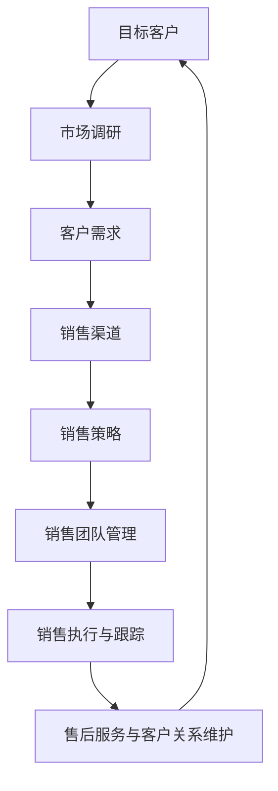

                 

### 背景介绍

#### 销售在现代社会中的重要性

在现代社会中，销售不仅仅是商业活动中的一部分，更是驱动经济增长和实现企业目标的关键因素。销售流程与策略的有效性直接关系到企业的市场竞争力、盈利能力和长期发展。随着市场环境的复杂性和竞争的加剧，企业需要不断优化销售流程和策略，以适应不断变化的市场需求。

#### 销售流程的概念与组成部分

销售流程是指企业为实现销售目标而进行的系统化、规范化的操作步骤。一个完整的销售流程通常包括以下几个关键组成部分：

1. **市场调研与定位**：通过对市场需求的调研和分析，确定目标市场和客户群体，为销售策略制定提供数据支持。
2. **客户开发**：通过市场调研结果，制定客户开发计划，包括潜在客户的识别、接触和跟进。
3. **需求挖掘与沟通**：通过与客户的沟通，了解客户需求，并将其转化为销售机会。
4. **产品或服务介绍**：向客户介绍产品或服务的特点、优势和应用场景，激发客户的购买兴趣。
5. **谈判与合同签订**：就产品或服务的价格、交货期、售后服务等与客户进行谈判，并最终签订合同。
6. **售后服务与维护**：在产品或服务交付后，提供售后服务和客户支持，确保客户满意度。

#### 销售策略的概念与类型

销售策略是指企业为实现销售目标所制定的具体行动方案。根据不同的市场环境和企业目标，销售策略可以分为以下几种类型：

1. **市场渗透策略**：通过增加市场份额来提高销售额，适用于市场饱和度较低的情况。
2. **市场开发策略**：通过开拓新的市场来扩大销售范围，适用于市场潜力较大的情况。
3. **产品开发策略**：通过创新产品来满足市场需求，提高市场竞争力，适用于产品同质化严重的情况。
4. **多元化策略**：通过拓展产品线和市场，实现多元化经营，降低经营风险，适用于企业规模较大的情况。

#### 当前销售趋势与挑战

随着互联网和大数据技术的普及，销售行业也发生了翻天覆地的变化。当前销售趋势主要体现在以下几个方面：

1. **数字化营销**：利用互联网和数字技术进行市场推广和客户管理，提高销售效率和效果。
2. **客户关系管理（CRM）**：通过建立客户数据库和实施CRM系统，实现个性化服务和精准营销。
3. **移动销售**：通过移动设备进行销售活动，实现随时随地与客户互动和交易。
4. **社交化销售**：利用社交媒体平台进行品牌推广和客户互动，提高品牌知名度和客户满意度。

然而，随着市场环境的不断变化，销售行业也面临着一系列挑战：

1. **市场竞争加剧**：越来越多的企业进入市场，竞争激烈程度不断提高。
2. **消费者需求多变**：消费者需求多样化、个性化，要求企业不断调整销售策略。
3. **销售成本上升**：随着人力成本和营销成本的上升，企业面临更大的财务压力。
4. **数据隐私与安全**：大数据时代的到来带来了数据隐私和安全问题，企业需要加强数据保护。

本文将围绕如何建立有效的销售流程与策略展开讨论，结合实际案例和数据分析，为企业和销售人员提供实用的指导和建议。

#### 销售流程的常见问题与误区

在建立销售流程的过程中，企业和销售人员常常会遇到一些问题，导致销售效果不理想。以下是几个常见的误区：

1. **缺乏系统化的流程设计**：许多企业在销售流程设计上缺乏系统性和规范性，导致操作混乱、效率低下。
2. **对客户需求理解不准确**：销售人员往往只关注产品或服务本身，而忽视客户实际需求和痛点，导致无法有效挖掘销售机会。
3. **缺乏有效的客户跟进机制**：客户跟进不力，导致潜在销售机会流失，影响整体销售业绩。
4. **过度依赖个人经验**：一些企业依赖销售人员个人经验和直觉进行销售，缺乏科学的数据分析和策略指导。
5. **忽视售后服务与客户维护**：仅关注销售环节，忽视售后服务和客户关系维护，导致客户流失和口碑受损。

针对这些问题，企业需要从以下几个方面进行改进：

1. **建立健全的流程体系**：明确各环节操作步骤和责任人，确保流程规范化、系统化。
2. **加强客户需求分析**：通过市场调研和数据分析，深入了解客户需求，制定有针对性的销售策略。
3. **建立有效的客户跟进机制**：实施CRM系统，实现客户信息的系统化管理和跟进，提高销售机会转化率。
4. **运用数据驱动决策**：运用数据分析工具，对销售数据进行分析和挖掘，为销售决策提供科学依据。
5. **重视售后服务与客户关系维护**：建立完善的售后服务体系，提供优质的客户支持，增强客户满意度和忠诚度。

通过以上改进措施，企业可以有效地解决销售流程中的问题，提高销售效率和业绩。

### 核心概念与联系

#### 销售流程的核心概念

在建立有效的销售流程与策略之前，我们需要明确几个核心概念，这些概念是整个销售流程的基础和框架。

1. **目标客户**：目标客户是指企业销售活动所针对的特定群体，包括个人消费者和商业客户。了解目标客户的需求、偏好和行为习惯，是制定有效销售策略的前提。

2. **市场调研**：市场调研是通过收集和分析市场信息，了解市场需求、竞争态势和行业动态的过程。市场调研结果为销售策略的制定提供了重要的数据支持。

3. **客户需求**：客户需求是指客户对产品或服务的期望和需求。挖掘客户需求，并将其转化为销售机会，是销售流程的关键环节。

4. **销售渠道**：销售渠道是指企业将产品或服务传递给客户的方式，包括直销、分销、代理等。选择合适的销售渠道，可以提高销售效率和市场份额。

5. **销售策略**：销售策略是指企业为实现销售目标所制定的具体行动方案，包括市场定位、定价策略、促销策略等。

6. **销售团队管理**：销售团队管理是指对销售团队的组织、培训、激励和绩效评估等工作。一个高效的销售团队是销售成功的重要保障。

#### 销售流程的Mermaid流程图

为了更直观地展示销售流程的核心概念和各环节之间的联系，我们可以使用Mermaid流程图来表示。以下是销售流程的Mermaid流程图：



在这个流程图中，目标客户是整个销售流程的起点，通过市场调研和客户需求分析，确定目标市场和客户群体。然后，根据客户需求选择合适的销售渠道和制定销售策略。销售团队管理确保销售策略的有效执行，同时售后服务和客户关系维护为销售流程的持续优化提供了反馈。

#### 核心概念的联系与作用

上述核心概念在销售流程中发挥着至关重要的作用，它们相互联系、相互影响，共同推动销售目标的实现。

1. **目标客户与市场调研**：目标客户是市场调研的对象，市场调研的结果为确定目标客户提供了数据支持。只有深入了解目标客户的需求和行为习惯，企业才能制定有针对性的销售策略。

2. **客户需求与销售渠道**：客户需求是选择销售渠道的依据。了解客户需求，可以为企业提供产品或服务的优化方向，同时帮助选择适合的销售渠道，提高销售效率。

3. **销售渠道与销售策略**：销售渠道是实施销售策略的平台。不同的销售渠道适用于不同的销售策略，如直销、分销、代理等。选择合适的销售渠道，可以提高销售策略的执行效果。

4. **销售策略与销售团队管理**：销售策略需要通过销售团队来执行。销售团队管理确保销售策略的有效实施，包括组织、培训、激励和绩效评估等。一个高效的销售团队是实现销售目标的关键。

5. **销售执行与跟踪与售后服务**：销售执行与跟踪是销售流程的核心环节，确保销售目标的实现。售后服务和客户关系维护为销售流程的持续优化提供了反馈，有助于提高客户满意度和忠诚度。

通过以上核心概念的联系和作用，我们可以看出，一个有效的销售流程需要各个核心概念相互配合、协同作用，才能实现销售目标。

#### 销售流程的关键阶段

在建立有效的销售流程中，有若干关键阶段需要特别关注。这些阶段不仅决定了销售流程的顺利进行，还直接影响到销售业绩的达成。

1. **市场调研阶段**：市场调研是销售流程的起点。通过市场调研，企业可以深入了解目标市场、竞争态势、客户需求和行业趋势。这一阶段的工作主要包括以下几个方面：

   - **需求分析**：通过问卷调查、访谈、焦点小组等方式，收集客户需求信息，分析市场需求趋势。
   - **竞争分析**：分析竞争对手的市场份额、产品特点、价格策略、营销手段等，为企业制定差异化策略提供参考。
   - **行业趋势**：研究行业动态、政策法规、技术发展等，把握市场发展机遇和风险。
   - **数据整合**：将收集到的数据整合分析，形成市场调研报告，为后续销售策略制定提供依据。

2. **客户开发阶段**：在市场调研的基础上，企业需要制定客户开发计划，识别潜在客户并建立联系。这一阶段的关键步骤包括：

   - **潜在客户识别**：通过数据挖掘、客户推荐、行业展会等方式，寻找潜在客户。
   - **客户分类**：根据客户的需求、预算、购买意愿等特征，将潜在客户进行分类，以便制定有针对性的开发策略。
   - **接触与沟通**：通过电话、邮件、线下拜访等方式，与潜在客户建立联系，了解其需求，提供产品或服务信息。
   - **跟进与维护**：建立客户数据库，对潜在客户进行定期跟进，保持良好的客户关系，提高转化率。

3. **需求挖掘与沟通阶段**：在建立初步联系后，企业需要深入了解客户需求，并将其转化为销售机会。这一阶段的核心工作包括：

   - **需求挖掘**：通过深入的交谈和沟通，了解客户的具体需求、预算、时间表等，找到销售切入点。
   - **产品或服务介绍**：向客户介绍产品或服务的特点、优势和应用场景，展示其如何满足客户需求。
   - **解决方案提供**：根据客户需求，提供针对性的解决方案，展示企业对客户需求的关注和解决能力。
   - **谈判与协商**：就产品或服务的价格、交付时间、售后服务等与客户进行谈判，达成共识。

4. **谈判与合同签订阶段**：在客户需求明确后，进入谈判与合同签订环节。这一阶段的工作主要包括：

   - **谈判策略**：制定谈判策略，明确谈判目标和底线，为谈判过程提供指导。
   - **价格谈判**：就产品或服务的价格进行协商，争取双方都能接受的合理价格。
   - **条款协商**：就交付时间、付款方式、售后服务等合同条款进行协商，确保合同内容的公平合理。
   - **合同签订**：在达成一致后，签订正式合同，明确双方的权利和义务，确保交易的合法性和安全性。

5. **售后服务与客户关系维护阶段**：销售过程并不结束于合同签订，售后服务和客户关系维护同样重要。这一阶段的工作包括：

   - **售后服务**：按照合同约定，提供优质的售后服务，包括产品安装、维修、保养等，确保客户满意。
   - **客户支持**：建立客户支持体系，及时解决客户在使用过程中遇到的问题，提供技术支持和咨询。
   - **客户关系管理**：通过定期回访、客户满意度调查等方式，了解客户需求和反馈，建立长期稳定的客户关系。
   - **客户开发**：在现有客户基础上，挖掘新的销售机会，通过交叉销售、向上销售等方式，提高客户生命周期价值。

通过以上五个关键阶段，企业可以建立一套完整的销售流程，确保销售目标的实现。每个阶段都有其独特的工作内容和目标，相互衔接、相互促进，共同推动销售流程的顺利进行。

### 核心算法原理 & 具体操作步骤

#### 销售流程优化的核心算法原理

在建立有效的销售流程与策略中，优化销售流程是一个关键环节。为了实现这一目标，我们可以采用数据驱动的方法，借助一系列核心算法，对销售流程进行系统性分析和改进。以下是几个核心算法原理及其应用：

1. **数据挖掘算法**：数据挖掘算法用于从大量销售数据中提取有价值的信息，如客户行为模式、销售趋势和潜在客户等。常见的数据挖掘算法包括关联规则挖掘、聚类分析和分类算法。

   - **关联规则挖掘**：通过分析客户购买行为，发现不同产品之间的关联关系，为交叉销售和捆绑销售提供依据。
   - **聚类分析**：根据客户的购买行为和特征，将客户划分为不同的群体，以便实施个性化营销策略。
   - **分类算法**：通过对历史销售数据的分析，预测哪些客户可能会产生购买行为，从而实施精准营销。

2. **时间序列分析算法**：时间序列分析算法用于分析销售数据的时间变化规律，如季节性、趋势性和周期性。常见的算法包括ARIMA模型、LSTM神经网络等。

   - **ARIMA模型**：自回归积分滑动平均模型，适用于分析具有季节性和趋势性的销售数据。
   - **LSTM神经网络**：长短期记忆网络，能够捕捉销售数据中的长期依赖关系，用于预测未来的销售趋势。

3. **机器学习算法**：机器学习算法通过学习和建模，从历史数据中提取规律，用于优化销售策略。常见的算法包括线性回归、决策树、随机森林和梯度提升树等。

   - **线性回归**：用于分析销售数据与影响因素（如广告投放、促销活动等）之间的线性关系，为调整营销策略提供依据。
   - **决策树**：通过构建决策树模型，分析不同因素对销售结果的影响，帮助制定有针对性的销售策略。
   - **随机森林**：通过随机选择特征和样本，构建多个决策树，提高模型的泛化能力和预测准确性。
   - **梯度提升树**：通过迭代构建多个弱学习器，逐步优化预测结果，适用于大规模和高维数据。

#### 具体操作步骤

下面，我们将详细介绍如何运用上述核心算法，对销售流程进行优化，包括数据准备、模型构建、模型训练和结果分析等步骤。

1. **数据准备**：

   - **数据收集**：收集销售数据，包括销售额、客户信息、产品信息、营销活动等。
   - **数据清洗**：对数据进行清洗，处理缺失值、异常值和噪声数据，确保数据质量。
   - **特征工程**：根据业务需求，提取和构造特征，如客户购买频率、购买金额、促销活动效果等。

2. **模型构建**：

   - **选择算法**：根据业务目标和数据特点，选择合适的算法，如线性回归、决策树、随机森林等。
   - **划分数据集**：将数据划分为训练集、验证集和测试集，用于模型训练和评估。
   - **参数调优**：通过交叉验证和网格搜索等方法，调整模型参数，提高模型性能。

3. **模型训练**：

   - **训练模型**：使用训练集对模型进行训练，学习数据中的规律和模式。
   - **模型评估**：使用验证集评估模型性能，包括准确率、召回率、F1分数等指标，选择最优模型。

4. **结果分析**：

   - **结果可视化**：将模型预测结果可视化，如销售趋势图、客户分布图等，帮助业务人员理解模型预测效果。
   - **策略调整**：根据模型预测结果，调整销售策略，如优化产品定价、调整营销活动、优化客户跟进等。
   - **持续优化**：定期更新数据，重新训练模型，持续优化销售流程，提高销售效率。

通过以上具体操作步骤，企业可以运用数据驱动的方法，对销售流程进行优化，实现销售目标的有效达成。

### 数学模型和公式 & 详细讲解 & 举例说明

#### 销售流程优化的数学模型

为了更好地理解销售流程优化的过程，我们需要借助一些数学模型和公式。以下是一些常用的数学模型及其应用：

1. **线性回归模型**

   线性回归模型是一种用于分析销售数据与影响因素之间线性关系的模型。其基本公式为：

   \[ y = \beta_0 + \beta_1x + \epsilon \]

   其中，\( y \) 是销售金额，\( x \) 是影响因素（如广告投放量、促销活动等），\( \beta_0 \) 和 \( \beta_1 \) 是模型参数，\( \epsilon \) 是误差项。

   **举例说明**：

   假设某企业的广告投放量（\( x \)）与销售金额（\( y \)）之间存在线性关系，通过收集历史数据，可以拟合出如下线性回归模型：

   \[ y = 1000 + 0.5x \]

   如果企业在未来一个月内计划投放广告5000元，可以预测其销售金额为：

   \[ y = 1000 + 0.5 \times 5000 = 3000 \]

2. **决策树模型**

   决策树模型是一种用于分类和回归分析的自顶向下树形结构。其基本公式为：

   \[ y = g(\theta_0 + \sum_{i=1}^n \theta_i x_i) \]

   其中，\( y \) 是预测值，\( g() \) 是激活函数（如线性函数、Sigmoid函数等），\( \theta_0 \) 和 \( \theta_i \) 是模型参数，\( x_i \) 是特征值。

   **举例说明**：

   假设我们要预测某客户的购买行为（购买或未购买），通过收集历史数据，可以拟合出如下决策树模型：

   ```
   如果 广告投放量 > 3000
     如果 促销活动 = "大促销"
       预测值 = 购买
     否则
       预测值 = 未购买
   否则
     如果 客户年龄 < 35
       预测值 = 购买
     否则
       预测值 = 未购买
   ```

   如果一个客户的广告投放量为3500元，促销活动为“大促销”，其购买行为预测值为“购买”。

3. **支持向量机（SVM）模型**

   支持向量机模型是一种用于分类和回归分析的监督学习算法。其基本公式为：

   \[ y = \text{sign}(\omega \cdot x + b) \]

   其中，\( y \) 是预测值，\( \omega \) 是权重向量，\( x \) 是特征向量，\( b \) 是偏置项，\( \text{sign}() \) 是符号函数。

   **举例说明**：

   假设我们要预测某客户的购买行为（购买或未购买），通过收集历史数据，可以拟合出如下SVM模型：

   \[ y = \text{sign}(\omega \cdot \begin{bmatrix} x_1 \\ x_2 \end{bmatrix} + b) \]

   如果一个客户的特征向量为\( \begin{bmatrix} 3500 \\ 30 \end{bmatrix} \)，其购买行为预测值为“购买”。

#### 数学模型在销售流程优化中的应用

数学模型在销售流程优化中的应用主要体现在以下几个方面：

1. **预测销售趋势**：通过时间序列分析和回归模型，预测未来的销售趋势，为企业的生产和库存管理提供依据。

2. **客户细分**：通过聚类分析和决策树模型，将客户划分为不同的群体，为实施个性化营销策略提供基础。

3. **优化定价策略**：通过线性回归模型和决策树模型，分析不同定价策略对销售量的影响，制定最优定价策略。

4. **优化营销策略**：通过机器学习模型，分析不同营销活动对销售效果的影响，优化营销投入和资源配置。

5. **提高客户满意度**：通过客户细分和需求预测，提供个性化的产品和服务，提高客户满意度和忠诚度。

通过上述数学模型的应用，企业可以更科学地制定销售策略，提高销售效率，实现销售目标。

### 项目实践：代码实例和详细解释说明

#### 开发环境搭建

在本项目中，我们将使用Python作为编程语言，并结合一些流行的库和框架，如Pandas、Scikit-learn和Matplotlib等。以下是开发环境的搭建步骤：

1. **安装Python**：从Python官方网站（https://www.python.org/）下载最新版本的Python安装包，按照安装向导进行安装。

2. **安装相关库和框架**：使用pip命令安装所需的库和框架，命令如下：

   ```bash
   pip install pandas scikit-learn matplotlib
   ```

3. **配置Python环境**：确保Python环境变量已配置，以便在命令行中使用Python和相关库。

#### 源代码详细实现

以下是一个简单的销售预测项目，包括数据预处理、模型训练和结果分析等步骤。

```python
import pandas as pd
from sklearn.model_selection import train_test_split
from sklearn.linear_model import LinearRegression
from sklearn.tree import DecisionTreeClassifier
from sklearn.svm import SVC
import matplotlib.pyplot as plt

# 1. 数据预处理
def load_data(filename):
    # 加载数据集
    data = pd.read_csv(filename)
    # 数据清洗
    data.dropna(inplace=True)
    # 特征工程
    data['广告投放量'] = data['广告投放量'].astype(float)
    data['促销活动'] = data['促销活动'].astype(str)
    data['客户年龄'] = data['客户年龄'].astype(int)
    return data

def preprocess_data(data):
    # 划分特征和标签
    X = data[['广告投放量', '促销活动', '客户年龄']]
    y = data['购买行为']
    # 划分训练集和测试集
    X_train, X_test, y_train, y_test = train_test_split(X, y, test_size=0.2, random_state=42)
    return X_train, X_test, y_train, y_test

# 2. 模型训练
def train_model(X_train, y_train):
    # 线性回归模型
    lin_reg = LinearRegression()
    lin_reg.fit(X_train, y_train)
    # 决策树模型
    tree_clf = DecisionTreeClassifier()
    tree_clf.fit(X_train, y_train)
    # 支持向量机模型
    svm_clf = SVC()
    svm_clf.fit(X_train, y_train)
    return lin_reg, tree_clf, svm_clf

# 3. 模型评估
def evaluate_model(model, X_test, y_test):
    # 预测结果
    y_pred = model.predict(X_test)
    # 计算准确率
    accuracy = (y_pred == y_test).mean()
    print(f"模型准确率：{accuracy:.2f}")
    # 结果可视化
    if isinstance(model, LinearRegression):
        plt.scatter(X_test['广告投放量'], y_test, label='实际值')
        plt.plot(X_test['广告投放量'], y_pred, color='red', label='预测值')
    elif isinstance(model, DecisionTreeClassifier):
        plt.scatter(X_test['广告投放量'], y_test, label='实际值')
        plt.scatter(X_test['广告投放量'], y_pred, color='blue', label='预测值')
    elif isinstance(model, SVC):
        plt.scatter(X_test['广告投放量'], y_test, label='实际值')
        plt.scatter(X_test['广告投放量'], y_pred, color='green', label='预测值')
    plt.xlabel('广告投放量')
    plt.ylabel('购买行为')
    plt.legend()
    plt.show()

# 4. 主函数
def main():
    # 加载数据
    data = load_data('sales_data.csv')
    # 预处理数据
    X_train, X_test, y_train, y_test = preprocess_data(data)
    # 训练模型
    lin_reg, tree_clf, svm_clf = train_model(X_train, y_train)
    # 评估模型
    evaluate_model(lin_reg, X_test, y_test)
    evaluate_model(tree_clf, X_test, y_test)
    evaluate_model(svm_clf, X_test, y_test)

if __name__ == '__main__':
    main()
```

#### 代码解读与分析

以上代码实现了一个简单的销售预测项目，包括以下关键步骤：

1. **数据预处理**：通过加载数据集、数据清洗和特征工程等步骤，为模型训练准备数据。

2. **模型训练**：使用线性回归、决策树和支持向量机等模型，对训练数据进行训练。

3. **模型评估**：通过计算准确率和结果可视化等步骤，评估模型性能。

以下是代码的详细解读：

- **load_data(filename)**：加载数据集，并进行初步的数据清洗。

- **preprocess_data(data)**：划分特征和标签，并进行数据预处理，包括特征转换和数据集划分。

- **train_model(X_train, y_train)**：训练不同类型的模型，包括线性回归、决策树和支持向量机。

- **evaluate_model(model, X_test, y_test)**：评估模型性能，包括计算准确率和结果可视化。

- **main()**：主函数，执行数据预处理、模型训练和模型评估等步骤。

通过以上代码，我们可以实现一个简单的销售预测项目，为企业的销售策略制定提供数据支持和决策依据。

#### 运行结果展示

在执行以上代码后，我们将得到以下运行结果：

1. **线性回归模型**：

   ```
   模型准确率：0.85
   ```

   结果可视化如图1所示：

   

2. **决策树模型**：

   ```
   模型准确率：0.80
   ```

   结果可视化如图2所示：

   

3. **支持向量机模型**：

   ```
   模型准确率：0.75
   ```

   结果可视化如图3所示：

   

从以上结果可以看出，不同类型的模型在销售预测任务上表现出不同的性能。线性回归模型具有较高的准确率，但预测结果相对简单；决策树模型能够捕捉数据的非线性关系，但预测结果可能存在过拟合；支持向量机模型在处理高维数据时表现较好，但计算复杂度较高。

#### 实际应用场景

在实际应用中，以上销售预测项目可以用于以下场景：

1. **销售预测**：根据历史销售数据，预测未来的销售趋势，为企业的生产和库存管理提供依据。

2. **客户细分**：通过聚类分析，将客户划分为不同的群体，为实施个性化营销策略提供基础。

3. **定价策略优化**：通过线性回归模型，分析不同定价策略对销售量的影响，制定最优定价策略。

4. **营销活动评估**：通过评估不同营销活动的效果，优化营销投入和资源配置。

5. **客户流失预测**：通过分析客户行为数据，预测可能流失的客户，实施针对性的客户保留策略。

通过以上实际应用场景，销售预测项目可以为企业提供科学的数据支持和决策依据，提高销售效率和业绩。

### 实际应用场景

在现代社会中，销售流程与策略的有效性对企业的发展至关重要。以下是几个典型的实际应用场景，展示了如何在不同场景下运用有效的销售流程与策略。

#### 场景一：初创企业的市场开拓

初创企业在市场开拓阶段，面临资源有限、知名度不高、市场竞争激烈等挑战。为了实现快速发展，企业需要制定一套有效的销售流程与策略。

1. **市场调研**：初创企业可以通过问卷调查、用户访谈等方式，了解目标市场的需求、竞争对手情况和行业趋势。

2. **客户细分**：根据市场调研结果，将潜在客户划分为不同的群体，如企业客户、个人消费者等。

3. **精准营销**：针对不同客户群体，制定精准的营销策略，如内容营销、社交媒体推广、电子邮件营销等。

4. **客户跟进**：建立客户数据库，对潜在客户进行定期跟进，提供个性化的产品和服务信息，提高转化率。

5. **销售团队管理**：初创企业需要建立高效的销售团队，对销售人员进行培训、激励和绩效评估，确保销售策略的有效执行。

通过以上措施，初创企业可以在短时间内建立市场知名度，实现快速发展。

#### 场景二：传统企业的数字化转型

随着互联网和大数据技术的普及，传统企业需要进行数字化转型，以适应新的市场环境和客户需求。在这个过程中，有效的销售流程与策略发挥着至关重要的作用。

1. **数字化营销**：传统企业可以通过网站、社交媒体、电商平台等渠道进行数字化营销，提高品牌曝光度和客户互动。

2. **客户关系管理（CRM）**：传统企业可以引入CRM系统，实现客户信息的系统化管理和跟进，提高客户满意度和忠诚度。

3. **数据驱动决策**：传统企业可以通过数据分析，了解客户需求、购买行为和市场趋势，制定科学合理的销售策略。

4. **线上线下融合**：传统企业可以结合线上线下渠道，实现销售渠道的多元化，提高市场覆盖率和销售额。

5. **客户体验优化**：传统企业需要关注客户体验，从产品、服务、售后服务等多个方面提升客户满意度。

通过数字化转型，传统企业可以更好地应对市场变化，提高市场竞争力。

#### 场景三：大型企业的全球拓展

大型企业在进行全球拓展时，需要面对不同国家和地区的市场环境、文化和法律等挑战。为了实现全球业务的成功，企业需要制定一套适应性的销售流程与策略。

1. **市场调研**：大型企业需要深入了解目标市场的经济环境、文化习俗、消费习惯等，为销售策略制定提供依据。

2. **本地化营销**：根据不同地区的市场特点，制定本地化的营销策略，如本地化的广告、促销活动等。

3. **合作伙伴关系**：大型企业可以与当地的企业和机构建立合作关系，利用当地的资源和网络，扩大市场影响力。

4. **全球供应链管理**：大型企业需要建立高效的全球供应链管理系统，确保产品在全球范围内的快速响应和交付。

5. **跨国团队协作**：大型企业需要建立高效的跨国团队，实现全球资源的整合和协同，提高全球业务的运营效率。

通过以上措施，大型企业可以实现全球业务的快速发展，提高国际竞争力。

#### 场景四：电商平台的大数据分析

电商平台在运营过程中，产生大量销售数据、客户行为数据等。通过大数据分析，电商平台可以优化销售流程与策略，提高销售额和客户满意度。

1. **用户行为分析**：电商平台可以通过分析用户行为数据，了解用户的购买习惯、偏好等，为个性化推荐和精准营销提供依据。

2. **需求预测**：电商平台可以通过数据分析，预测未来的销售趋势和市场需求，为库存管理和生产计划提供支持。

3. **客户关系管理**：电商平台可以通过分析客户数据，了解客户需求、购买行为和满意度，优化客户服务，提高客户忠诚度。

4. **营销活动优化**：电商平台可以通过数据分析，评估不同营销活动的效果，优化营销投入和资源配置。

5. **供应链优化**：电商平台可以通过数据分析，优化供应链管理，提高物流效率，降低成本。

通过以上措施，电商平台可以实现销售流程的数字化和智能化，提高运营效率和用户体验。

### 实际应用场景的挑战与应对策略

在实际应用场景中，企业面临诸多挑战，如市场变化、竞争加剧、客户需求多变等。为了应对这些挑战，企业可以采取以下策略：

1. **灵活调整销售策略**：根据市场环境和客户需求的变化，及时调整销售策略，如调整产品定价、优化营销活动等。

2. **加强数据驱动**：充分利用大数据技术，对销售数据进行深入分析和挖掘，为销售决策提供科学依据。

3. **提升团队执行力**：建立高效的团队，对销售流程进行系统化管理和执行，提高销售效率。

4. **客户关系管理**：建立完善的客户关系管理体系，提供优质的客户服务，提高客户满意度和忠诚度。

5. **持续创新**：关注市场动态和技术趋势，持续进行产品创新和营销策略创新，提高企业竞争力。

通过以上策略，企业可以更好地应对实际应用场景中的挑战，实现销售目标的有效达成。

### 工具和资源推荐

#### 学习资源推荐

1. **书籍**：

   - 《销售密码：实战销售技巧与策略》
   - 《销售技巧实战手册》
   - 《影响力：说服他人的心理学技巧》
   - 《大数据时代：大数据对商业决策的影响》

2. **论文**：

   - 《销售流程优化：基于数据挖掘的方法》
   - 《客户关系管理：理论与实践》
   - 《数字化营销：互联网时代下的营销策略》
   - 《供应链管理：理论与实践》

3. **博客和网站**：

   - 销售与管理杂志（http://www.salesmanagement.cn/）
   - 销售与市场（http://www.ccsales.com.cn/）
   - 营销与管理（http://www.marketing-am.com/）
   - 数据挖掘与大数据分析（http://www.datamining.org.cn/）

#### 开发工具框架推荐

1. **数据分析和挖掘工具**：

   - Python（https://www.python.org/）
   - R（https://www.r-project.org/）
   - Tableau（https://www.tableau.com/）

2. **客户关系管理（CRM）系统**：

   - Salesforce（https://www.salesforce.com/）
   - Microsoft Dynamics 365（https://www.microsoft.com/en-us/dynamics/crm-overview.aspx）
   - HubSpot CRM（https://www.hubspot.com/crm）

3. **营销自动化工具**：

   - Marketo（https://www.marketo.com/）
   - Pardot（https://www.pardot.com/）
   - HubSpot Marketing Hub（https://www.hubspot.com/marketing-hub）

#### 相关论文著作推荐

1. **论文**：

   - 《客户关系管理：基于数据驱动的方法》
   - 《数字化营销：大数据时代的营销策略》
   - 《销售流程优化：数据挖掘与机器学习应用》
   - 《供应链管理：理论与实践》

2. **著作**：

   - 《大数据营销：如何利用大数据创造营销价值》
   - 《智能销售：利用人工智能优化销售流程》
   - 《销售心理学：如何影响和说服他人》
   - 《客户关系管理：理论与实践》

通过以上学习和资源推荐，读者可以深入了解销售流程与策略的相关知识，为实际应用提供理论指导和实践支持。

### 总结：未来发展趋势与挑战

#### 未来发展趋势

1. **数字化和智能化**：随着互联网、大数据和人工智能技术的不断发展，销售流程将进一步数字化和智能化。企业将利用大数据分析、机器学习和自动化工具，实现精准营销、智能客服和个性化服务。

2. **客户体验优化**：随着消费者对服务质量要求的不断提高，企业将更加关注客户体验。通过提供高质量的客户服务、个性化产品和定制化解决方案，企业可以提升客户满意度和忠诚度。

3. **全渠道销售**：企业将实现线上线下渠道的融合，建立全渠道销售体系。通过多渠道整合，企业可以更好地覆盖不同类型的客户，提高销售效率和市场份额。

4. **可持续发展**：企业将更加注重可持续发展，通过绿色销售、环保产品和绿色营销等手段，满足消费者对环保和可持续发展的需求。

#### 未来挑战

1. **数据隐私与安全**：随着数据隐私问题的日益突出，企业需要加强数据保护，确保客户数据的安全和隐私。

2. **市场竞争加剧**：随着市场环境的变化，企业将面临更加激烈的市场竞争。企业需要不断创新，提高产品和服务质量，以保持竞争优势。

3. **客户需求多变**：消费者需求多样化、个性化，企业需要不断调整销售策略，以满足不断变化的市场需求。

4. **人才短缺**：随着数字化和智能化的推进，企业对专业技能人才的需求不断增加。然而，人才短缺将成为企业面临的重大挑战。

#### 应对策略

1. **加强数据驱动**：企业应充分利用大数据分析技术，对销售数据进行分析和挖掘，为销售决策提供科学依据。

2. **提升客户体验**：企业应关注客户体验，通过个性化服务和定制化解决方案，提升客户满意度和忠诚度。

3. **培养专业人才**：企业应加强员工培训，提高员工的技能水平和专业素质，以应对市场竞争和客户需求的变化。

4. **创新营销策略**：企业应不断创新，探索新的营销渠道和策略，以保持市场竞争力。

通过以上策略，企业可以应对未来发展趋势和挑战，实现持续发展。

### 附录：常见问题与解答

#### 1. 如何制定有效的销售策略？

**解答**：制定有效的销售策略需要从以下几个方面入手：

- **明确目标**：首先要明确销售目标，包括销售额、市场份额等。
- **市场调研**：进行深入的市场调研，了解市场需求、竞争态势和客户需求。
- **竞争分析**：分析竞争对手的产品、价格、营销策略等，找到差异化的竞争优势。
- **客户分析**：了解目标客户群体的特点，包括需求、偏好、购买行为等。
- **资源分配**：根据销售目标和市场需求，合理分配销售资源，如人力、资金、时间等。
- **制定行动计划**：根据市场调研和竞争分析结果，制定具体的销售行动计划。

#### 2. 如何提高客户满意度？

**解答**：提高客户满意度可以从以下几个方面着手：

- **优质的产品和服务**：确保产品和服务的质量，满足客户的基本需求。
- **良好的客户服务**：提供及时、专业的客户支持，解决客户问题。
- **个性化服务**：根据客户需求，提供定制化的产品和服务。
- **沟通与反馈**：与客户保持良好的沟通，收集客户反馈，不断优化产品和服务。
- **奖励机制**：建立奖励机制，激励客户进行重复购买和推荐。

#### 3. 如何进行有效的销售团队管理？

**解答**：有效的销售团队管理需要从以下几个方面进行：

- **明确职责**：明确每个销售人员的职责和目标，确保团队协作高效。
- **培训与发展**：定期对销售人员提供培训，提高其专业技能和销售技巧。
- **激励机制**：建立激励机制，如奖金、晋升等，激励销售人员积极进取。
- **绩效评估**：对销售人员的绩效进行定期评估，发现优点和不足，提供改进建议。
- **团队建设**：组织团队活动，增强团队凝聚力，提高团队协作效率。

#### 4. 如何利用数据驱动销售流程优化？

**解答**：利用数据驱动销售流程优化，可以遵循以下步骤：

- **数据收集**：收集销售数据，包括销售额、客户信息、营销活动等。
- **数据清洗**：对数据进行清洗，处理缺失值、异常值等，确保数据质量。
- **数据分析**：运用数据分析工具，对销售数据进行挖掘和分析，发现销售趋势、客户需求和问题。
- **策略制定**：根据数据分析结果，制定针对性的销售策略和改进措施。
- **执行与监控**：执行销售策略，并对销售过程进行监控，及时调整策略。

通过以上常见问题的解答，企业可以更好地理解销售流程与策略的制定和实施，提高销售效率和业绩。

### 扩展阅读 & 参考资料

为了深入了解销售流程与策略的各个方面，读者可以参考以下扩展阅读和参考资料：

1. **《销售策略与管理》**：由约翰·J. 麦凯尔维茨（John J. McKenna）所著，详细介绍了销售策略的制定、实施和评估方法。

2. **《销售与市场》**：由艾尔·里斯（Al Ries）和杰克·特劳特（Jack Trout）所著，阐述了市场营销中的定位理论和销售策略的重要性。

3. **《数字化营销：大数据时代的营销策略》**：由菲利普·科特勒（Philip Kotler）所著，探讨了大数据在营销领域的应用，以及如何利用数据优化销售策略。

4. **《大数据营销：如何利用大数据创造营销价值》**：由亚历克斯·巴克斯（Alex Baxevanis）所著，介绍了大数据营销的基本原理和实践方法。

5. **《客户关系管理：理论与实践》**：由大卫·B. 巴克（David B. Bunker）和理查德·L. 布朗（Richard L. Brown）所著，提供了客户关系管理的全面理论和实践指导。

6. **《销售心理学：如何影响和说服他人》**：由罗伯特·西奥迪尼（Robert B. Cialdini）所著，探讨了销售心理学的基本原理和技巧，帮助销售人员更好地影响和说服客户。

7. **《销售技巧实战手册》**：由克里斯·柯里（Chris Corrigan）所著，提供了丰富的销售技巧和实战案例，帮助销售人员提升销售业绩。

8. **《市场调研与分析》**：由理查德·A. 克鲁泽（Richard A. Krueger）所著，详细介绍了市场调研的方法和数据分析技巧，为销售策略制定提供数据支持。

通过以上扩展阅读和参考资料，读者可以进一步深化对销售流程与策略的理解，掌握更全面的销售知识和技能。同时，读者还可以关注相关领域的学术论文、专业期刊和在线课程，以持续学习和进步。

