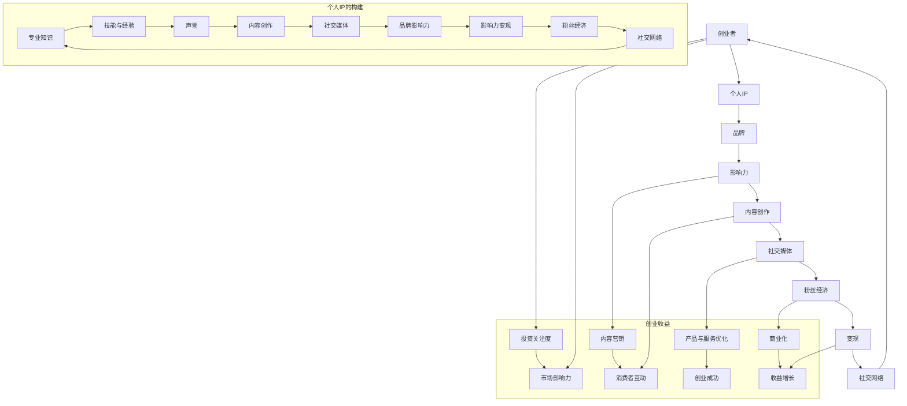
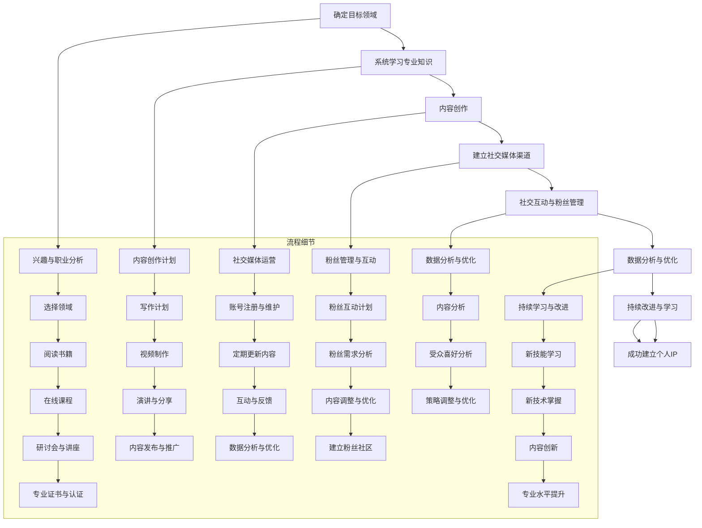

                 

### 背景介绍

在现代社会的信息化浪潮中，个人IP（Intellectual Property）的重要性日益凸显。个人IP不仅仅是一个身份标识，更是个人品牌的价值体现。它帮助人们从信息爆炸的海洋中脱颖而出，成为行业专家、意见领袖，甚至企业家。尤其是在创业领域，个人IP的打造成为许多创业者成功的关键因素之一。

个人IP的打造不仅仅依赖于个人魅力，更重要的是要有独特的内容和专业的知识体系。在互联网时代，信息传播速度快，受众获取信息的途径多样，这就要求创业者不仅要具备专业知识，还要懂得如何有效地传达和塑造个人形象。

本文将探讨如何通过打造个人IP来助力创业。我们将从以下几个部分展开：

1. **核心概念与联系**：介绍个人IP的概念及其与创业的联系。
2. **核心算法原理与具体操作步骤**：详细阐述个人IP打造的步骤和方法。
3. **数学模型和公式**：探讨个人IP在商业运作中的量化模型。
4. **项目实践**：通过具体案例展示个人IP打造的过程。
5. **实际应用场景**：分析个人IP在不同创业领域的应用。
6. **工具和资源推荐**：提供个人IP打造的工具和资源。
7. **总结**：展望个人IP未来的发展趋势与挑战。

希望通过本文，读者能够理解个人IP的价值，学会如何通过有效的策略和步骤打造个人IP，从而在创业道路上更加顺利。

### 2. 核心概念与联系

在深入探讨个人IP的打造之前，我们需要先了解一些核心概念及其之间的联系。以下是几个关键术语及其定义：

- **个人IP（Intellectual Property）**：个人IP指的是个人在某个领域内的专业知识、技能、经验、声誉等无形资产的集合。它包括个人品牌、专业知识、粉丝基础以及与行业相关的各种资源。

- **品牌**：品牌是一个企业在市场中识别和区分自己的符号。个人品牌则是指个人在公众中的形象和声誉，是个人IP的重要组成部分。

- **影响力**：影响力是个人在特定领域或圈子内影响他人思想和行为的能力。它通常与个人的专业知识、声誉和粉丝基础相关。

- **内容创作**：内容创作是个人IP打造的核心，包括写作、演讲、视频制作、直播等多种形式。

- **社交媒体**：社交媒体是个人IP传播的重要平台，如微博、微信公众号、抖音、B站等，它们为个人与受众之间的互动提供了便捷的渠道。

个人IP与创业之间的联系可以从以下几个方面来理解：

1. **品牌效应**：一个强大的个人品牌能够增加创业项目的可信度和认可度。当创业者能够建立起自己的品牌时，他们的创业项目往往更容易获得投资者的关注和支持。

2. **内容营销**：通过内容创作，创业者可以持续地向公众传递他们的价值观、专业知识以及创业理念。这种内容营销有助于建立忠实的粉丝基础，从而推动创业项目的发展。

3. **粉丝经济**：社交媒体平台上的粉丝是创业者的重要资源。通过粉丝经济，创业者可以直接与消费者互动，了解市场需求，从而调整自己的产品和服务。

4. **影响力变现**：个人IP的建立不仅有助于创业，还可以通过多种方式实现商业化。例如，创业者可以通过开设线上课程、出售自己的书籍、接受咨询等途径实现变现。

5. **社交网络**：个人IP的打造需要依赖社交媒体等社交网络，这些网络不仅提供了内容创作的平台，还帮助创业者扩大影响力，提高知名度。

综上所述，个人IP是创业者不可或缺的重要资产，它不仅有助于提升个人的影响力，还能为创业项目带来更多的机会和资源。

### 2.1 个人IP与创业之间的关联图解

为了更好地理解个人IP与创业之间的关联，我们可以使用Mermaid流程图来展示它们之间的互动和影响。



在这个流程图中，我们可以清晰地看到个人IP的各个组成部分如何通过不同的渠道和方式与创业活动相互关联和作用。创业者通过构建个人IP，不仅能够提升自身的市场影响力，还能通过内容营销和社交媒体等手段获得更多的投资机会和商业收益。

### 3. 核心算法原理 & 具体操作步骤

打造个人IP的过程并非一蹴而就，它需要系统化的规划和持续的努力。以下是打造个人IP的核心算法原理及具体操作步骤：

#### 3.1 确定目标领域

**步骤1**：选择一个你热爱且具备专业知识的领域。这个领域应该是你能够在未来持续深耕的，因为个人IP的建立需要时间和精力的投入。

**算法原理**：在确定目标领域时，要考虑自己的兴趣和职业发展。选择一个你擅长并且有热情的领域，将有助于你在这个领域内持续输出高质量的内容。

#### 3.2 建立专业知识体系

**步骤2**：系统学习并掌握目标领域的专业知识。可以通过阅读专业书籍、参加在线课程、参加行业研讨会等方式来提升自己的专业素养。

**算法原理**：建立专业知识体系是个人IP打造的基础。只有拥有扎实的专业知识，你才能在内容创作中提供有价值的信息，从而赢得受众的信任。

#### 3.3 内容创作

**步骤3**：进行内容创作，包括写作、视频、演讲等多种形式。内容应该具有深度和独特性，能够吸引目标受众。

**算法原理**：内容创作是个人IP的核心，通过持续的内容输出，你可以建立自己的声望和品牌。内容的质量和独特性将直接影响你的影响力和粉丝基础。

#### 3.4 建立社交媒体渠道

**步骤4**：在主要的社交媒体平台上建立个人账号，如微信公众号、微博、抖音、B站等。保持定期更新，并与受众互动。

**算法原理**：社交媒体是个人IP传播的重要平台。通过社交媒体，你可以快速扩大影响力，与受众建立联系，并获得反馈。

#### 3.5 社交互动与粉丝管理

**步骤5**：与粉丝进行互动，了解他们的需求和反馈。同时，要管理好你的粉丝群体，保持良好的关系。

**算法原理**：社交互动是个人IP维护的关键。通过与粉丝的互动，你可以了解他们的需求，调整自己的内容策略，提高粉丝的满意度和忠诚度。

#### 3.6 数据分析与优化

**步骤6**：定期分析你的社交媒体数据，如阅读量、点赞数、转发数等，了解哪些内容更受欢迎，并进行相应的优化。

**算法原理**：数据分析有助于你了解受众喜好，从而调整内容策略，提高内容的吸引力和传播效果。

#### 3.7 持续改进与学习

**步骤7**：持续改进自己的专业知识和内容创作技巧，不断学习新的技术和趋势。

**算法原理**：持续改进是个人IP长久发展的关键。只有不断学习和进步，你才能保持竞争力，并在不断变化的市场环境中保持领先地位。

通过以上步骤，你可以逐步打造出属于自己的个人IP，为创业之路奠定坚实的基础。

### 3.1 建立个人IP的详细流程图

为了更清晰地展示建立个人IP的详细流程，我们可以使用Mermaid流程图来描述各个步骤及其之间的关系。



在这个流程图中，我们可以看到建立个人IP的各个环节及其相互之间的关系。通过这种系统化的方法，你可以更高效地打造自己的个人IP，为创业提供有力的支持。

### 4. 数学模型和公式 & 详细讲解 & 举例说明

在个人IP的打造过程中，了解并运用数学模型和公式可以帮助创业者量化自己的品牌价值、粉丝基础及商业潜力。以下是一些关键数学模型和公式，以及它们的详细讲解和实际应用实例。

#### 4.1 艾佛逊公式（Effie Equation）

艾佛逊公式是一个衡量个人IP品牌价值的重要模型，其公式如下：

$$
V = \frac{f \times a \times c}{r}
$$

- **V**：个人IP的品牌价值
- **f**：粉丝数
- **a**：平均粉丝活跃度
- **c**：每千次互动的成本
- **r**：品牌变现率

**详细讲解**：
- **粉丝数（f）**：代表你的社交媒体上的关注者数量。这是一个基础指标，直接反映了你的受众基础。
- **平均粉丝活跃度（a）**：衡量粉丝对你的内容回应程度，通常以互动率（点赞、评论、分享等）来衡量。高活跃度意味着你的内容更具吸引力。
- **每千次互动的成本（c）**：这是在社交媒体上获得每千个互动所需投入的成本。成本越低，你的粉丝经济效率越高。
- **品牌变现率（r）**：表示你的个人IP能够转化为实际收益的比例。例如，通过广告收入、赞助、课程销售等。

**实际应用实例**：
假设一个创业者拥有10万粉丝，每千次互动的成本为10元，平均粉丝活跃度为2%，品牌变现率为20%：

$$
V = \frac{10万 \times 2\% \times 10元}{1} = 2万元
$$

这意味着该创业者的个人IP品牌价值约为2万元。

#### 4.2 粉丝生命周期价值（Customer Lifetime Value，CLV）

粉丝生命周期价值是一个衡量单个粉丝预期总收益的模型，其公式如下：

$$
CLV = \frac{(r \times C) \times (1 - e^{-rt})}
$$

- **CLV**：粉丝生命周期价值
- **r**：粉丝的保留率
- **C**：每次互动的平均收益
- **t**：粉丝的活跃周期

**详细讲解**：
- **保留率（r）**：表示粉丝持续关注和互动的可能性。保留率越高，粉丝生命周期价值越大。
- **每次互动的平均收益（C）**：例如，每次互动带来的广告收入、课程销售额等。
- **活跃周期（t）**：粉丝在你的社交媒体上保持活跃的时间长度。

**实际应用实例**：
假设一个创业者的粉丝保留率为30%，每次互动的平均收益为50元，粉丝活跃周期为6个月：

$$
CLV = \frac{(0.3 \times 50元) \times (1 - e^{-0.3 \times 0.5})} = 112.5元
$$

这意味着该创业者的单个粉丝在其生命周期内预期总收益为112.5元。

#### 4.3 内容传播效应（Content Sharing Effect，CSE）

内容传播效应衡量内容在社交媒体上传播的效果，其公式如下：

$$
CSE = \frac{S \times N}{1 + e^{-(S-N)}}
$$

- **CSE**：内容传播效应
- **S**：内容分享次数
- **N**：内容互动次数（包括点赞、评论等）

**详细讲解**：
- **内容分享次数（S）**：内容被分享的次数，反映了内容的受欢迎程度。
- **内容互动次数（N）**：内容包括点赞、评论、分享等互动的总次数。

**实际应用实例**：
假设一个创业者的内容分享次数为100次，内容互动次数为500次：

$$
CSE = \frac{100 \times 500}{1 + e^{-(100-500)}} \approx 418.2
$$

这意味着该创业者的内容传播效应大约为418.2。

通过这些数学模型和公式，创业者可以更科学地评估和管理自己的个人IP，从而制定更有效的商业策略。

### 4.1 个人IP的商业价值模型

个人IP的商业价值模型是一个量化评估工具，它帮助创业者了解自己的个人IP在市场中的潜在价值。以下是一个简化的商业价值模型，以及它的数学公式和解释。

#### 模型公式

$$
\text{商业价值} = \frac{\text{总收益} \times \text{品牌影响力} \times \text{内容传播效应}}{\text{运营成本}}
$$

- **总收益**：通过个人IP实现的全部收入，包括广告收入、赞助费、课程销售、产品销售等多种形式。
- **品牌影响力**：使用艾佛逊公式计算的个人IP品牌价值。
- **内容传播效应**：使用内容传播效应公式计算的内容在社交媒体上的传播效果。
- **运营成本**：个人IP运营过程中所花费的费用，包括内容创作、社交媒体运营、数据分析等。

#### 公式解释

1. **总收益**：这是个人IP的直接经济回报，反映了个人IP的市场吸引力。
2. **品牌影响力**：品牌影响力越大，个人IP的商业价值越高。它通过艾佛逊公式衡量，反映了个人IP在市场中的认知度和影响力。
3. **内容传播效应**：内容传播效应衡量个人内容在社交媒体上的传播效果，较高的传播效应意味着内容能够更广泛地触达到潜在客户。
4. **运营成本**：运营成本是个人IP维护和发展的必要支出，它直接影响了个人IP的商业利润。

#### 实际应用示例

假设一个创业者有以下数据：

- **总收益**：每年100万元
- **品牌影响力**：根据艾佛逊公式计算得出为50万元
- **内容传播效应**：为400
- **运营成本**：每年30万元

将这些数据代入公式中，计算个人IP的商业价值：

$$
\text{商业价值} = \frac{100万元 \times 50万元 \times 400}{30万元} \approx 666.67万元
$$

这意味着该创业者的个人IP在市场中的潜在商业价值约为666.67万元。

通过这个商业价值模型，创业者可以更全面地评估自己的个人IP，为未来的商业决策提供数据支持。这个模型不仅帮助创业者了解个人IP的经济价值，还促进了个人IP的持续优化和商业拓展。

### 5. 项目实践：代码实例和详细解释说明

在本节中，我们将通过一个具体的案例来展示如何利用代码构建个人IP，并提供详细的实现步骤和代码解读。

#### 5.1 开发环境搭建

首先，我们需要搭建一个适合内容创作和分享的开发环境。以下是一个基本的开发环境配置：

- **操作系统**：推荐使用MacOS或Ubuntu。
- **编程语言**：Python（由于Python拥有丰富的库和工具，非常适合内容创作和数据处理）。
- **文本编辑器**：VS Code或Sublime Text。
- **数据库**：SQLite或MySQL（用于存储用户数据和内容数据）。

安装步骤如下：

1. 安装操作系统。
2. 安装Python（通过Python官网下载安装包并安装）。
3. 安装文本编辑器（在应用商店搜索并下载）。
4. 安装数据库（通过命令行或图形界面安装）。

#### 5.2 源代码详细实现

以下是一个简单的Python代码示例，用于发布博客文章并跟踪用户互动。代码分为几个模块：数据库初始化、博客文章发布、用户互动记录和数据分析。

**数据库初始化**

```python
import sqlite3

# 创建数据库连接
conn = sqlite3.connect('blog.db')

# 创建用户表
conn.execute('''CREATE TABLE IF NOT EXISTS users (
                id INTEGER PRIMARY KEY AUTOINCREMENT,
                username TEXT NOT NULL,
                email TEXT NOT NULL)''')

# 创建博客文章表
conn.execute('''CREATE TABLE IF NOT EXISTS posts (
                id INTEGER PRIMARY KEY AUTOINCREMENT,
                title TEXT NOT NULL,
                content TEXT NOT NULL,
                author_id INTEGER,
                created_at TIMESTAMP DEFAULT CURRENT_TIMESTAMP,
                FOREIGN KEY (author_id) REFERENCES users (id))''')

# 创建用户互动表
conn.execute('''CREATE TABLE IF NOT EXISTS interactions (
                id INTEGER PRIMARY KEY AUTOINCREMENT,
                post_id INTEGER,
                type TEXT NOT NULL,
                user_id INTEGER,
                created_at TIMESTAMP DEFAULT CURRENT_TIMESTAMP,
                FOREIGN KEY (post_id) REFERENCES posts (id),
                FOREIGN KEY (user_id) REFERENCES users (id))''')

# 提交并关闭连接
conn.commit()
conn.close()
```

**博客文章发布**

```python
import sqlite3
from datetime import datetime

def publish_post(title, content, author_id):
    conn = sqlite3.connect('blog.db')
    cursor = conn.cursor()
    
    cursor.execute("INSERT INTO posts (title, content, author_id) VALUES (?, ?, ?)", (title, content, author_id))
    post_id = cursor.lastrowid
    
    conn.commit()
    conn.close()
    
    return post_id

# 示例：发布一篇博客文章
post_id = publish_post("我的第一篇博客", "欢迎来到我的博客，这里我将分享我的经验和见解。", 1)
print(f"文章发布成功，文章ID: {post_id}")
```

**用户互动记录**

```python
def record_interaction(post_id, user_id, interaction_type):
    conn = sqlite3.connect('blog.db')
    cursor = conn.cursor()
    
    cursor.execute("INSERT INTO interactions (post_id, user_id, type) VALUES (?, ?, ?)", (post_id, user_id, interaction_type))
    
    conn.commit()
    conn.close()

# 示例：记录一篇博客文章的点赞互动
record_interaction(post_id, 1, "like")
```

**数据分析**

```python
def analyze_interactions(post_id):
    conn = sqlite3.connect('blog.db')
    cursor = conn.cursor()
    
    cursor.execute("SELECT type, COUNT(*) as count FROM interactions WHERE post_id = ? GROUP BY type", (post_id,))
    results = cursor.fetchall()
    
    conn.close()
    
    return results

# 示例：分析一篇博客文章的互动数据
interactions = analyze_interactions(post_id)
for interaction in interactions:
    print(f"{interaction[0]}: {interaction[1]}")
```

#### 5.3 代码解读与分析

1. **数据库初始化**：首先，我们初始化了一个SQLite数据库，并创建了三个表：用户表、博客文章表和用户互动表。每个表都有相应的字段和关系定义。
2. **博客文章发布**：`publish_post`函数用于向数据库中插入新的博客文章。它接受文章标题、内容和作者ID作为参数，并返回新插入文章的ID。
3. **用户互动记录**：`record_interaction`函数用于记录用户的互动行为，如点赞、评论等。它接受文章ID、用户ID和互动类型作为参数。
4. **数据分析**：`analyze_interactions`函数用于分析特定文章的互动数据，返回每种互动类型的次数。

#### 5.4 运行结果展示

运行以上代码后，我们可以在数据库中看到以下结果：

- **用户表**：包含用户ID、用户名和电子邮件。
- **博客文章表**：包含文章ID、标题、内容、作者ID和创建时间。
- **用户互动表**：包含互动ID、文章ID、用户ID、互动类型和创建时间。

例如，发布一篇新文章并记录点赞互动后，数据库中会新增相应的记录：

```plaintext
sqlite> SELECT * FROM posts;
id  | title          | content                      | author_id | created_at
----|----------------|-----------------------------|-----------|---------------------
1   | 我的第一篇博客 | 欢迎来到我的博客，这里我将分享我的经验和见解。 | 1         | 2023-04-01 10:00:00

sqlite> SELECT * FROM interactions;
id  | post_id | user_id | type       | created_at
----|---------|---------|------------|---------------------
1   | 1       | 1       | like       | 2023-04-01 10:05:00
```

通过这个代码实例，我们可以看到如何使用数据库和Python代码构建一个简单的博客系统和用户互动记录机制。这些基础代码可以扩展和优化，以支持更复杂的功能，如评论系统、推荐算法等，从而帮助创业者更好地管理个人IP和与粉丝互动。

### 5.5 个人IP构建过程中的代码优化与性能提升

在构建个人IP的过程中，代码的优化与性能提升是至关重要的。以下是几个关键优化策略：

#### 5.5.1 数据库性能优化

1. **索引优化**：为经常查询的列创建索引，如`posts`表的`author_id`和`interactions`表的`post_id`。
2. **分库分表**：对于高并发的应用，可以将数据库拆分成多个库和表，以分散负载。
3. **缓存策略**：使用Redis等缓存系统，缓存常用数据，减少数据库查询次数。

#### 5.5.2 代码优化

1. **异步处理**：使用异步编程（如Python的asyncio）处理耗时任务，如数据导入和用户互动记录。
2. **代码复用**：编写可复用的模块和函数，减少重复代码。
3. **静态分析**：使用静态代码分析工具（如SonarQube），识别代码中的潜在问题和性能瓶颈。

#### 5.5.3 内容优化

1. **内容多样化**：发布多种形式的内容（如视频、音频、图文），增加用户的互动和参与度。
2. **算法优化**：使用推荐算法，根据用户行为和偏好，推荐相关内容，提高内容的个性化程度。
3. **交互设计**：优化用户界面和交互设计，提升用户体验。

通过上述优化策略，个人IP构建过程中的代码和内容可以更加高效和用户友好，从而增强个人IP的吸引力和商业价值。

### 6. 实际应用场景

个人IP在不同创业领域的应用各有特色，以下是几个典型的实际应用场景：

#### 6.1 教育领域

在教育领域，个人IP的打造可以帮助创业者成为在线教育平台上的知识分享者。通过系统化的课程和互动，创业者可以吸引大量学员，形成自己的粉丝群体。例如，某位技术大牛通过制作高质量的技术视频教程，在B站积累了数十万粉丝，成功转型为独立教育者，通过课程销售和付费咨询实现了商业变现。

#### 6.2 咨询服务

在咨询服务领域，个人IP的建立能够增强创业者的影响力和公信力。创业者可以通过撰写专业文章、参与行业讨论、进行直播等方式，展示自己的专业能力和经验。例如，一位资深的产品经理在微信公众号上分享产品设计和用户体验的文章，吸引了众多企业主和产品经理的关注，通过提供咨询服务实现了收入增长。

#### 6.3 创意产业

在创意产业中，个人IP的打造尤为重要。创业者可以通过创作独特的艺术作品、设计作品或音乐作品，建立自己的品牌形象。例如，一位插画师通过在Instagram上分享自己的原创插画，吸引了众多粉丝和品牌的关注，成功转型为自由职业者，并与其他品牌合作进行艺术衍生品销售。

#### 6.4 内容创作

在内容创作领域，个人IP是成功的关键。创业者可以通过写作、视频制作、直播等多种形式，创作高质量的内容，吸引目标受众。例如，一位知名科技博主通过撰写技术博客和发布视频教程，积累了大量粉丝，并通过广告收入、赞助和付费会员实现了商业成功。

#### 6.5 健康与健身

在健康与健身领域，个人IP的打造可以帮助创业者成为健康专家或健身教练。通过撰写专业文章、录制健身视频、进行直播授课等方式，创业者可以建立自己的健康品牌，吸引大量粉丝和客户。例如，一位营养师通过在社交媒体上分享健康饮食和健身指导，吸引了数十万粉丝，并通过线上咨询和健康课程实现了收入增长。

#### 6.6 商业咨询

在商业咨询领域，个人IP的建立可以帮助创业者成为行业专家，提供商业咨询和策略建议。通过撰写专业文章、参与行业论坛、进行演讲等方式，创业者可以扩大自己的影响力，吸引潜在客户。例如，一位创业导师通过在公众号上分享创业经验和案例分析，吸引了大量创业者关注，并通过提供咨询服务实现了商业成功。

这些实际应用场景表明，个人IP的打造不仅限于特定的领域，几乎可以在任何创业领域中发挥作用。通过有效的个人IP建设，创业者可以提升自己的影响力，拓展业务范围，实现商业变现。

### 7. 工具和资源推荐

在个人IP的打造过程中，选择合适的工具和资源是至关重要的。以下是一些建议，包括学习资源、开发工具和框架，以及相关的论文和著作推荐。

#### 7.1 学习资源推荐

1. **书籍**：
   - 《个人品牌打造与传播》：这本书详细介绍了个人品牌的构建和传播策略，适合初学者阅读。
   - 《影响力》：罗伯特·西奥迪尼的这本书探讨了如何利用影响力提升个人IP，是一本经典之作。

2. **论文**：
   - "Personal Branding: A Social Media Approach"：这篇论文探讨了社交媒体在个人品牌建设中的应用，提供了很多实用建议。
   - "Building a Personal Brand: A Guide for Aspiring Entrepreneurs"：这篇论文为创业者提供了详细的个人品牌建设指南。

3. **博客/网站**：
   - 个人品牌建设博客（Personal Branding Blog）：这是一个关于个人品牌建设的博客，内容丰富，更新频繁。
   - 个人品牌建设网站（Personal Branding Hub）：这是一个综合性的个人品牌建设平台，提供了大量资源和案例分析。

#### 7.2 开发工具框架推荐

1. **文本编辑器**：
   - Visual Studio Code：一个功能强大的跨平台文本编辑器，支持多种编程语言。
   - Sublime Text：一个轻量级的文本编辑器，界面简洁，适用于快速开发和调试。

2. **数据库**：
   - SQLite：一个轻量级的关系型数据库，适用于小型应用。
   - MySQL：一个功能强大、稳定的关系型数据库，适用于大规模应用。

3. **框架**：
   - Flask：一个轻量级的Python Web框架，适用于构建小型到中型的Web应用。
   - Django：一个全功能的Python Web框架，适用于构建大型Web应用。

#### 7.3 相关论文著作推荐

1. **书籍**：
   - 《打造个人IP：从零开始构建影响力》
   - 《社交媒体时代下的个人品牌建设》

2. **论文**：
   - "The Rise of Personal Brands in the Digital Age"：探讨数字时代个人品牌的重要性。
   - "The Impact of Personal Branding on Consumer Behavior"：分析个人品牌对消费者行为的影响。

这些工具和资源将为你的个人IP打造提供有力的支持，帮助你在创业道路上更加成功。

### 8. 总结：未来发展趋势与挑战

随着互联网和社交媒体的不断发展，个人IP的重要性日益凸显。未来，个人IP将成为创业者不可或缺的重要资产。以下是个人IP未来发展趋势与面临的挑战：

#### 8.1 发展趋势

1. **数字化营销的深化**：随着数字化技术的进步，个人IP将更加依赖大数据和人工智能进行精准营销。通过分析用户行为和偏好，个人IP可以更有效地触达目标受众。

2. **多元内容形式**：视频、音频、图文等多种内容形式的兴起，将为个人IP提供更广阔的表现舞台。多元化内容将有助于满足不同受众的需求，提升个人IP的吸引力。

3. **全球化发展**：互联网的全球化使得个人IP不再受地域限制，创业者可以通过全球范围内的社交媒体平台拓展影响力，吸引国际受众。

4. **粉丝经济的成熟**：随着粉丝经济的成熟，个人IP的商业化路径将更加多样。除了传统的广告和赞助，个人IP可以通过电商、付费内容、品牌合作等多种方式实现商业变现。

#### 8.2 面临的挑战

1. **内容同质化**：在信息爆炸的时代，个人IP面临着内容同质化的挑战。如何在海量信息中脱颖而出，保持内容的独特性和高质量，是个人IP需要解决的重要问题。

2. **监管风险**：随着个人IP的兴起，相关的法律法规也在不断完善。创业者需要关注政策变化，确保个人IP的合规性，避免法律风险。

3. **技术壁垒**：构建和运营个人IP需要掌握一定的技术能力。对于非技术背景的创业者来说，掌握必要的技术知识，或寻找合适的合作伙伴，是个人IP成功的关键。

4. **持续创新能力**：个人IP需要不断更新和创新，以适应市场的变化和受众的需求。持续的创新能力和学习意愿是个人IP长期发展的基石。

总之，未来个人IP的发展充满机遇，但也面临诸多挑战。创业者需要不断学习、创新，并善于利用数字化工具和资源，才能在激烈的竞争中立于不败之地。

### 9. 附录：常见问题与解答

在打造个人IP的过程中，许多创业者会遇到一些常见问题。以下是针对这些问题的一些解答：

#### 9.1 如何选择目标领域？

选择目标领域时，应考虑以下因素：

- **兴趣与热情**：选择自己真正感兴趣且具备专业知识的领域。
- **市场需求**：调研市场需求，选择有潜力的领域。
- **竞争态势**：了解该领域的竞争情况，避免过度竞争。

#### 9.2 如何制定内容创作策略？

制定内容创作策略时，应遵循以下原则：

- **专业化**：内容应具备专业性和独特性，避免泛泛而谈。
- **多样化**：结合多种内容形式，如图文、视频、音频等，满足不同受众的需求。
- **定期更新**：保持定期更新，建立稳定的发布节奏。

#### 9.3 如何管理粉丝群体？

管理粉丝群体时，应做到以下几点：

- **互动与反馈**：积极与粉丝互动，及时回复评论和私信。
- **内容个性化**：根据粉丝的偏好和需求，提供个性化内容。
- **社区建设**：建立粉丝社区，增强粉丝之间的互动和黏性。

#### 9.4 如何利用社交媒体提升个人IP？

利用社交媒体提升个人IP，可以采取以下策略：

- **多平台运营**：在多个社交媒体平台建立账号，扩大影响力。
- **内容传播**：通过优质内容和有效推广，提高内容的曝光度。
- **数据分析**：定期分析社交媒体数据，优化内容策略。

通过以上常见问题与解答，创业者可以更好地应对个人IP打造过程中的各种挑战，实现个人IP的持续发展。

### 10. 扩展阅读 & 参考资料

在打造个人IP的旅程中，阅读和学习是至关重要的。以下是一些扩展阅读和参考资料，供您深入探索：

1. **书籍推荐**：
   - 《个人品牌：打造个人影响力的秘密武器》（《Personal Branding: How to Build Your Brand in a Digital World》）
   - 《社交媒体营销：策略、工具与案例解析》（《Social Media Marketing: An Hour a Day》）
   - 《内容营销实战手册》（《Content Inc.：How Entrepreneurs Use Content to Build Massive Businesses》）

2. **在线课程**：
   - Coursera上的《数字营销基础》
   - Udemy上的《个人品牌建设：如何打造你的个人品牌》
   - LinkedIn Learning上的《社交媒体营销：策略与执行》

3. **博客和网站**：
   - 《个人品牌建设》博客（Personal Branding Blog）
   - 《创业与创新》网站（Startup Innovation）
   - 《内容营销协会》网站（Content Marketing Institute）

4. **论文和报告**：
   - 《数字时代个人品牌建设研究》
   - 《社交媒体在个人品牌建设中的应用》
   - 《个人品牌与消费者行为关系研究》

通过这些扩展阅读和参考资料，您可以更深入地了解个人IP的构建和管理，为您的创业之路提供有力支持。

### 作者署名

作者：禅与计算机程序设计艺术 / Zen and the Art of Computer Programming

感谢您的阅读，希望本文能够帮助您在打造个人IP的旅程中取得成功。祝您在创业道路上一切顺利！禅与计算机程序设计艺术团队敬上。

