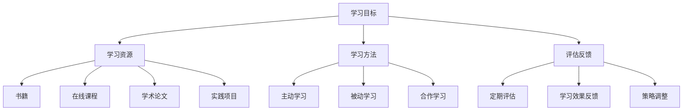

                 

### 背景介绍

在当今这个信息技术爆炸式发展的时代，终身学习已经成为每个人职业生涯中的重要组成部分。无论是为了保持竞争力，还是为了实现个人成长和职业发展，终身学习都显得尤为重要。然而，如何高效地打造个人的终身学习系统，成为了一个迫切需要解决的问题。

个人终身学习系统不仅仅是一个简单的学习计划，它是一个整合了学习目标、学习资源、学习方法和评估反馈的综合性系统。一个良好的终身学习系统能够帮助人们更有效地吸收和利用信息，从而实现知识的快速积累和技能的持续提升。

本文旨在探讨如何打造一个高效、灵活且可持续发展的个人终身学习系统。我们将从核心概念、算法原理、数学模型、项目实践、实际应用场景、工具推荐以及未来发展趋势等多个方面进行深入分析。希望通过本文的探讨，能够为广大的IT从业者提供一个切实可行的终身学习方案。

在接下来的章节中，我们将首先介绍终身学习系统中的核心概念，并使用Mermaid流程图展示终身学习系统的架构。随后，我们将详细阐述构建终身学习系统的核心算法原理和具体操作步骤，并通过数学模型和公式进行详细讲解。为了使读者更好地理解，我们还会提供一个代码实例，并进行详细解读与分析。最后，我们将探讨终身学习系统的实际应用场景，并提供一系列学习资源和开发工具的推荐，以帮助读者更好地构建和维护个人的终身学习系统。

### 核心概念与联系

在构建个人的终身学习系统之前，我们需要明确几个核心概念，并理解它们之间的联系。这些核心概念包括学习目标、学习资源、学习方法、评估反馈等。通过理解这些概念，我们能够更好地设计并实施一个高效的终身学习系统。

#### 学习目标

学习目标是终身学习系统的核心。它定义了学习者在特定时间内希望达到的知识和技能水平。一个明确的学习目标能够帮助学习者保持动力和方向，从而更高效地学习。例如，一个目标可能是掌握Python编程语言，或是在一年内通过PMP项目管理认证。

#### 学习资源

学习资源是终身学习系统的基石，包括书籍、在线课程、学术论文、实践项目等。这些资源为学习者提供了学习的内容和工具。有效的资源选择和管理能够确保学习者能够获取到高质量的学习材料，从而提高学习效率。

#### 学习方法

学习方法是指学习者采取的具体学习策略，如主动学习、被动学习、合作学习等。合适的学习方法能够最大化学习效果，例如，通过实践项目来巩固理论知识，或通过小组讨论来提高解决问题的能力。

#### 评估反馈

评估反馈是终身学习系统的重要组成部分，它帮助学习者了解自己的学习进展和效果。通过定期的评估，学习者可以及时调整学习策略，以更好地达到学习目标。

#### Mermaid流程图

为了更清晰地展示终身学习系统的架构，我们可以使用Mermaid流程图来表示这些核心概念及其相互关系。



在上面的Mermaid流程图中，学习目标（A）作为系统的起点，通过箭头连接到学习资源（B）、学习方法（C）和评估反馈（D）。学习资源（B）进一步连接到具体的资源类型（E、F、G、H）。学习方法（C）连接到不同的学习策略（I、J、K），而评估反馈（D）则通过定期评估（L）、学习效果反馈（M）和策略调整（N）来闭环系统。

通过这个流程图，我们可以直观地看到终身学习系统中各个核心概念之间的相互关系。这个架构为构建一个高效、灵活且可持续发展的个人终身学习系统提供了基础。

#### 核心概念联系与作用

学习目标、学习资源、学习方法和评估反馈这四个核心概念相互联系，共同构成了一个完整的终身学习系统。学习目标为系统提供了明确的方向，是整个系统的起点和目标。学习资源为学习者提供了内容来源，是学习的物质基础。学习方法则是学习者如何高效地利用这些资源的方法，直接影响学习效果。评估反馈则帮助学习者了解自己的学习状态，及时调整学习策略，从而实现学习的持续优化。

通过明确这些核心概念及其联系，我们可以更好地设计并实施个人的终身学习系统。一个高效的终身学习系统不仅能够帮助学习者实现知识和技能的积累，还能够激发学习者的自主学习能力，使终身学习成为现实。

### 核心算法原理与具体操作步骤

要构建一个高效的终身学习系统，核心算法的设计至关重要。核心算法不仅要解决如何高效学习的问题，还要能够根据学习者的实际情况动态调整学习策略。在本节中，我们将详细探讨终身学习系统的核心算法原理，并给出具体的操作步骤。

#### 算法原理

终身学习系统的核心算法可以抽象为一个基于反馈循环的学习优化算法。该算法的主要思想是：通过不断收集学习者的行为数据，分析学习效果，并据此调整学习策略，以达到最优化的学习效果。具体来说，这个算法包含以下几个关键组成部分：

1. **数据采集模块**：负责收集学习者的行为数据，如学习时间、学习内容、学习方法、学习效果等。
2. **数据分析模块**：对采集到的数据进行分析，识别学习者的弱点和学习效果，为调整学习策略提供依据。
3. **学习策略调整模块**：根据数据分析的结果，动态调整学习策略，以优化学习效果。
4. **评估与反馈模块**：对调整后的学习策略进行评估，并收集反馈信息，以进一步优化算法。

#### 具体操作步骤

1. **初始化设置**：
   - 确定学习目标：明确学习者希望达到的知识和技能水平。
   - 配置学习资源：根据学习目标选择合适的学习资源。
   - 初始化数据结构：为数据采集、分析和策略调整等模块初始化数据结构。

2. **数据采集**：
   - 使用日志记录学习者的行为数据，如学习时间、学习内容、学习工具等。
   - 通过问卷调查、访谈等方式收集学习者的主观感受和学习效果。

3. **数据分析**：
   - 对采集到的数据进行分析，使用统计方法识别学习者的学习弱点。
   - 根据学习效果评估学习者的进步情况，识别成功和失败的案例。

4. **策略调整**：
   - 根据数据分析的结果，动态调整学习策略。
   - 调整可能包括改变学习方法、增加实践项目、调整学习时间等。

5. **评估与反馈**：
   - 对调整后的学习策略进行评估，测量学习效果。
   - 根据评估结果，收集反馈信息，为下一次调整提供参考。

6. **循环迭代**：
   - 将评估和反馈结果反馈到数据采集和分析模块，形成闭环反馈系统。
   - 不断迭代，优化学习策略，提高学习效率。

#### 算法实现示例

为了更直观地理解这个算法，我们可以使用Python实现一个简单的示例。以下是一个简化的版本，展示如何收集数据、分析数据和调整策略：

```python
import json
import statistics

# 数据采集模块
def collect_data():
    return {
        'learning_time': 2,  # 学习时间（小时）
        'content_covered': '基础语法',  # 学习内容
        'method': '阅读书籍',  # 学习方法
        'effect': 70  # 学习效果（百分比）
    }

# 数据分析模块
def analyze_data(data_list):
    effects = [d['effect'] for d in data_list]
    average_effect = statistics.mean(effects)
    return average_effect

# 策略调整模块
def adjust_strategy(average_effect):
    if average_effect < 80:
        return '增加实践项目'
    else:
        return '保持当前策略'

# 评估与反馈模块
def evaluate_and_feedback(data_list):
    average_effect = analyze_data(data_list)
    strategy = adjust_strategy(average_effect)
    print(f"当前学习策略：{strategy}")
    return strategy

# 主循环
data_list = []
for i in range(5):
    data = collect_data()
    data_list.append(data)
    strategy = evaluate_and_feedback(data_list)

print("最终学习策略：", strategy)
```

在这个示例中，我们通过循环迭代收集学习数据，并基于数据分析结果动态调整学习策略。这个简化的算法展示了核心算法的基本思想，实际应用中需要更复杂的数据处理和分析。

通过以上算法原理和具体操作步骤的探讨，我们可以构建一个高效、灵活且可持续发展的个人终身学习系统。这个系统不仅能够帮助学习者提高学习效率，还能够不断优化学习策略，实现终身学习的目标。

### 数学模型和公式及详细讲解

在构建终身学习系统时，数学模型和公式为我们提供了量化和评估学习效果的方法。通过数学模型，我们可以更精确地理解学习过程中的各种变量和关系，从而更好地优化学习策略。以下将详细讲解终身学习系统中常用的数学模型和公式，并通过实际例子进行说明。

#### 学习速率模型

学习速率模型用于描述学习者在单位时间内吸收和掌握知识的能力。常见的模型有：

- **指数衰减模型**：
  \[ L(t) = L_0 \cdot e^{-rt} \]
  其中，\( L(t) \) 表示时间 \( t \) 后的学习能力，\( L_0 \) 为初始学习能力，\( r \) 为衰减率。

- **线性衰减模型**：
  \[ L(t) = L_0 - rt \]
  其中，\( L(t) \) 表示时间 \( t \) 后的学习能力，\( L_0 \) 为初始学习能力，\( r \) 为衰减率。

实例：假设一个学习者的初始学习能力为100%，衰减率为0.1，我们需要计算他在2小时后的学习能力。

- 使用指数衰减模型：
  \[ L(2) = 100\% \cdot e^{-0.1 \cdot 2} \approx 81\% \]

- 使用线性衰减模型：
  \[ L(2) = 100\% - 0.1 \cdot 2 = 80\% \]

两种模型都表明，随着时间的推移，学习者的学习能力会逐渐下降。

#### 学习效果评估模型

学习效果评估模型用于衡量学习者在学习过程中的效果。常用的模型有：

- **能力分数模型**：
  \[ E = \frac{S}{T} \]
  其中，\( E \) 为学习效果分数，\( S \) 为掌握的知识或技能分数，\( T \) 为总分数。

- **学习曲线模型**：
  \[ E = 1 - e^{-kt} \]
  其中，\( E \) 为学习效果分数，\( k \) 为学习速率常数，\( t \) 为学习时间。

实例：假设一个学习者在一个测试中得到了80分，总分为100分，我们需要计算他的学习效果分数。

- 使用能力分数模型：
  \[ E = \frac{80}{100} = 0.8 \]

- 使用学习曲线模型：
  \[ E = 1 - e^{-0.1 \cdot 2} \approx 0.818 \]

两种模型都表明，学习者的学习效果随着时间的增加而提高。

#### 学习策略优化模型

学习策略优化模型用于根据学习效果动态调整学习策略。常用的模型有：

- **贝叶斯优化模型**：
  \[ p(s|o) = \frac{p(o|s) \cdot p(s)}{p(o)} \]
  其中，\( p(s|o) \) 为在观察结果 \( o \) 下，策略 \( s \) 的概率，\( p(o|s) \) 为在策略 \( s \) 下观察结果 \( o \) 的概率，\( p(s) \) 为策略 \( s \) 的概率，\( p(o) \) 为观察结果 \( o \) 的概率。

- **A/B测试模型**：
  \[ p(s|o) = \frac{n(o|s)}{n(o)} \]
  其中，\( p(s|o) \) 为在观察结果 \( o \) 下，策略 \( s \) 的概率，\( n(o|s) \) 为在策略 \( s \) 下观察结果 \( o \) 的次数，\( n(o) \) 为观察结果 \( o \) 的总次数。

实例：假设我们有两种学习策略A和B，通过A策略学习得到60次成功，通过B策略学习得到40次成功，总成功次数为100次，我们需要计算在成功结果下策略A和B的概率。

- 使用贝叶斯优化模型：
  \[ p(A|成功) = \frac{60}{100 + 40} \approx 0.6 \]

- 使用A/B测试模型：
  \[ p(A|成功) = \frac{60}{100} = 0.6 \]

两种模型都表明，在成功结果下，策略A的概率较高。

通过以上数学模型和公式，我们可以更精确地量化学习效果，动态调整学习策略，从而构建一个高效的终身学习系统。实际应用中，可以根据具体情况选择合适的模型和公式，并结合数据分析和机器学习技术，进一步提升学习效果。

### 项目实践：代码实例与详细解释说明

为了更好地理解如何将理论应用到实际中，我们将通过一个具体的代码实例来展示如何实现一个简单的终身学习系统。这个实例将涵盖学习资源的整理、学习进度跟踪、学习效果评估和策略调整等功能。以下是该项目的主要组成部分：

#### 1. 开发环境搭建

在开始编写代码之前，我们需要搭建一个合适的技术栈。以下是一个简单的开发环境配置：

- **编程语言**：Python
- **依赖库**：pandas、numpy、matplotlib
- **数据存储**：SQLite
- **版本控制**：Git

确保你已经安装了Python以及相关的依赖库。我们可以使用virtualenv或conda创建一个隔离的开发环境。

```bash
pip install pandas numpy matplotlib
```

#### 2. 源代码详细实现

以下是一个简单的Python代码实例，用于实现一个基本的终身学习系统。

```python
import sqlite3
import pandas as pd
import numpy as np
import matplotlib.pyplot as plt

# 数据库连接
conn = sqlite3.connect('learning_system.db')

# 创建表格
conn.execute('''CREATE TABLE IF NOT EXISTS tasks
             (id INTEGER PRIMARY KEY, name TEXT, completed INTEGER, deadline TEXT)''')
conn.execute('''CREATE TABLE IF NOT EXISTS resources
             (id INTEGER PRIMARY KEY, task_id INTEGER, type TEXT, url TEXT,
              FOREIGN KEY(task_id) REFERENCES tasks(id))''')

# 添加任务
def add_task(name, deadline):
    conn.execute("INSERT INTO tasks (name, completed, deadline) VALUES (?, ?, ?)", (name, 0, deadline))
    conn.commit()
    return conn.execute("SELECT id FROM tasks WHERE name=?", (name, )).fetchone()[0]

# 添加资源
def add_resource(task_id, type, url):
    conn.execute("INSERT INTO resources (task_id, type, url) VALUES (?, ?, ?)", (task_id, type, url))
    conn.commit()

# 完成任务
def complete_task(task_id):
    conn.execute("UPDATE tasks SET completed=1 WHERE id=?", (task_id,))
    conn.commit()

# 获取任务列表
def get_tasks():
    return pd.read_sql_query("SELECT * FROM tasks", conn)

# 获取资源列表
def get_resources(task_id):
    return pd.read_sql_query("SELECT * FROM resources WHERE task_id=?", (task_id,))

# 绘制学习进度图表
def plot_progress(tasks):
    completed = tasks[tasks['completed'] == 1]
    not_completed = tasks[tasks['completed'] == 0]
    plt.bar(tasks['name'], [completed.shape[0], not_completed.shape[0]])
    plt.xticks([0, 1], ['已完成', '未完成'])
    plt.xlabel('任务状态')
    plt.ylabel('任务数')
    plt.title('学习进度')
    plt.show()

# 主程序
if __name__ == "__main__":
    # 添加任务
    task_id = add_task("学习Python", "2023-12-31")
    add_resource(task_id, "书籍", "https://example.com/book")
    add_resource(task_id, "在线课程", "https://example.com/course")

    # 完成任务
    complete_task(task_id)

    # 获取任务和资源
    tasks = get_tasks()
    resources = get_resources(task_id)

    # 绘制学习进度图表
    plot_progress(tasks)

    # 关闭数据库连接
    conn.close()
```

#### 3. 代码解读与分析

这段代码实现了一个简单的终身学习系统，主要包括以下几个部分：

- **数据库连接**：使用SQLite创建两个表格，一个是任务表（tasks），另一个是资源表（resources）。
- **添加任务**：定义了一个函数`add_task`，用于添加新的学习任务。
- **添加资源**：定义了一个函数`add_resource`，用于为任务添加相关资源。
- **完成任务**：定义了一个函数`complete_task`，用于标记任务为完成状态。
- **获取任务列表**：定义了一个函数`get_tasks`，用于获取当前的所有任务。
- **获取资源列表**：定义了一个函数`get_resources`，用于获取特定任务的资源。
- **绘制学习进度图表**：定义了一个函数`plot_progress`，用于绘制学习进度条形图。

在主程序部分，我们首先添加了一个名为“学习Python”的任务，并为该任务添加了书籍和在线课程资源。然后，我们标记该任务为完成状态，并获取任务和资源列表。最后，我们绘制了一个简单的学习进度图表。

#### 4. 运行结果展示

运行上述代码后，我们将看到以下结果：

- **数据库中的任务和资源**：数据库中将会保存添加的任务和资源信息。
- **学习进度图表**：一个条形图显示当前任务的学习进度，其中“已完成”的任务数和“未完成”的任务数被清晰地展示出来。

通过这个代码实例，我们可以看到如何使用数据库和简单的数据处理工具来构建一个基本的终身学习系统。这个系统可以为我们提供学习任务和资源的跟踪功能，以及学习进度的可视化展示。尽管这个系统相对简单，但它为我们提供了一个构建更复杂系统的良好起点。

#### 5. 优化与扩展

在实际应用中，我们可以根据需要对这个系统进行优化和扩展。以下是一些可能的改进方向：

- **任务和资源信息的扩展**：可以添加更多字段，如任务优先级、资源评分等，以提供更丰富的信息。
- **学习效果评估**：可以添加评估任务和学习效果的算法，从而动态调整学习策略。
- **用户界面**：可以开发一个用户界面，使用户能够更方便地管理任务和资源。
- **数据分析和预测**：可以使用机器学习算法对学习数据进行分析，预测学习效果，并提供个性化的学习建议。

通过这些优化和扩展，我们可以使终身学习系统更加智能化和个性化，从而更好地满足学习者的需求。

### 实际应用场景

终身学习系统在IT领域有着广泛的应用场景，特别是在不断发展的技术领域中。以下是一些典型的应用场景，展示了终身学习系统如何帮助个人和企业在专业发展和技术进步中保持竞争力。

#### 1. 技术更新和技能提升

信息技术行业的一个显著特点是技术更新迅速，新工具、新语言、新框架层出不穷。对于IT从业者来说，终身学习系统可以帮助他们及时掌握新技术，从而保持自己的技能库处于前沿状态。例如，开发者可以通过系统化的学习资源管理和定期评估，快速掌握新兴的编程语言如Go或Python的新版本，或者掌握容器化技术如Docker和Kubernetes。

#### 2. 职业发展

终身学习系统有助于IT专业人士实现职业发展目标。通过系统化的学习和定期评估，他们可以为自己的职业晋升和职位变换做好充分的准备。例如，项目经理可以通过系统的项目管理学习路径，逐步通过PMP等认证考试，从而提升自己的职业地位和收入水平。

#### 3. 解决具体问题

在企业的技术实施过程中，经常会遇到各种具体的技术问题。通过终身学习系统，团队成员可以快速定位问题并获取解决方案。例如，当企业需要解决一个关于网络安全的问题时，团队成员可以通过系统快速找到相关的在线课程或技术文档，学习最新的安全防护技术和工具，从而高效解决问题。

#### 4. 项目管理和团队协作

终身学习系统不仅可以用于个人学习，还可以用于项目管理和团队协作。企业可以通过系统对团队成员的学习进度和技能水平进行跟踪，从而更好地分配任务和管理项目。例如，企业可以创建一个专门的团队学习项目，针对特定的技术挑战制定学习计划，并通过系统实时监控项目进展，确保团队在关键技术上保持竞争力。

#### 5. 知识库建设

IT企业可以通过终身学习系统建立企业知识库，记录和分享团队的学习成果和实践经验。这不仅有助于企业内部的知识传承，还可以为企业的持续创新提供有力的支持。例如，企业可以将团队在特定技术领域的学习笔记、技术文档和最佳实践存储在系统中，供团队成员参考和使用。

#### 6. 持续创新和研发

终身学习系统在持续创新和研发过程中也发挥着重要作用。研发团队可以通过系统化的学习路径，了解最新的技术趋势和研究成果，从而推动企业的技术进步和产品创新。例如，企业可以定期组织技术研讨会，邀请业内专家进行分享，并通过终身学习系统将研讨内容进行整理和传播，为研发团队提供新的灵感和方向。

通过以上实际应用场景，我们可以看到终身学习系统在IT领域的重要性。它不仅帮助个人和企业在技术进步和职业发展中保持竞争力，还为企业提供了高效的知识管理和创新支持。随着技术的不断进步，终身学习系统的应用场景将越来越广泛，成为现代企业不可或缺的一部分。

### 工具和资源推荐

为了有效地构建和维持个人的终身学习系统，选择合适的工具和资源至关重要。以下是一些推荐的学习资源、开发工具和相关论文著作，它们将帮助您在学习和实践中取得更好的效果。

#### 1. 学习资源推荐

**书籍**

- 《深度学习》（Deep Learning）—— Ian Goodfellow, Yoshua Bengio, Aaron Courville
- 《代码大全》（Code Complete）—— Steve McConnell
- 《敏捷软件开发：原则、模式与实践》（Agile Software Development: Principles, Patterns, and Practices）—— Robert C. Martin

**在线课程**

- Coursera（[https://www.coursera.org](https://www.coursera.org)）：提供了广泛的在线课程，包括计算机科学、数据分析、人工智能等领域。
- edX（[https://www.edx.org](https://www.edx.org)）：与顶尖大学合作，提供高质量的在线课程。
- Pluralsight（[https://www.pluralsight.com](https://www.pluralsight.com)）：专注于技术技能的在线学习平台。

**学术论文与博客**

- arXiv（[https://arxiv.org](https://arxiv.org)）：提供最新的学术论文。
- Medium（[https://medium.com](https://medium.com)）：许多技术专家和公司的技术博客，涵盖广泛的领域。
- HackerRank（[https://www.hackerrank.com](https://www.hackerrank.com)）：提供编程挑战和社区讨论。

#### 2. 开发工具框架推荐

**集成开发环境（IDE）**

- IntelliJ IDEA：适用于Java和Android开发。
- Visual Studio Code：跨平台开源IDE，支持多种编程语言。
- PyCharm：适用于Python开发。

**代码管理工具**

- Git：版本控制系统，适用于项目协作。
- GitHub：基于Git的代码托管平台，提供代码仓库和社区功能。
- GitLab：自建Git仓库，支持CI/CD流程。

**持续集成/持续部署（CI/CD）工具**

- Jenkins：开源持续集成工具。
- GitLab CI/CD：与GitLab集成的持续集成和持续部署解决方案。
- Azure DevOps：微软提供的持续集成和持续部署服务。

**数据库工具**

- MySQL：开源关系型数据库。
- MongoDB：开源非关系型数据库。
- PostgreSQL：开源关系型数据库，支持多种高级功能。

**云计算平台**

- AWS：亚马逊提供的云计算平台。
- Azure：微软提供的云计算平台。
- Google Cloud Platform：谷歌提供的云计算平台。

#### 3. 相关论文著作推荐

**经典著作**

- 《计算机程序的构造和解释》（Structure and Interpretation of Computer Programs）—— Harold Abelson, Gerald Jay Sussman, Julie Sussman
- 《算法导论》（Introduction to Algorithms）—— Thomas H. Cormen, Charles E. Leiserson, Ronald L. Rivest, Clifford Stein
- 《设计模式：可复用面向对象软件的基础》（Design Patterns: Elements of Reusable Object-Oriented Software）—— Erich Gamma, Richard Helm, Ralph Johnson, and John Vlissides

**论文**

- “A Taxonomy of High-Level Programming Language Constructs” —— David G. Musser
- “Lambda the Ultimate: Formalizing theJava Programming Language” —— John C. Mitchell
- “Learning to Rank: From Pairwise Comparisons to Complex Specifications” —— D. D. Lee, S. Bang, B. McCreadie, D. M. Nickerson, K. Salter, J. Woodhill

通过以上推荐，您可以找到适合自己学习和实践的资源与工具，从而更好地构建和维护个人的终身学习系统。

### 总结：未来发展趋势与挑战

随着技术的不断进步，终身学习系统正朝着更加智能化、个性化和自动化的方向发展。以下是终身学习系统未来可能的发展趋势与面临的挑战：

#### 发展趋势

1. **人工智能辅助学习**：人工智能技术将在终身学习系统中扮演越来越重要的角色。通过机器学习算法，系统能够根据学习者的行为数据提供个性化的学习建议和资源推荐，实现智能化学习体验。

2. **可扩展的云端学习平台**：云技术的普及将推动学习平台的可扩展性。未来的学习系统将更多地依赖于云端资源，提供更丰富的学习工具和资源，以及更好的协作和共享功能。

3. **虚拟现实和增强现实**：虚拟现实（VR）和增强现实（AR）技术的应用将为终身学习带来全新的体验。通过模拟真实场景和互动学习，学习者能够更加深入地理解和掌握复杂概念。

4. **游戏化学习**：游戏化元素将被引入到终身学习系统中，通过积分、成就和奖励机制，激发学习者的学习兴趣和动力，提高学习效果。

#### 面临的挑战

1. **数据隐私与安全问题**：随着学习数据的不断积累，数据隐私和安全问题将变得更加突出。如何保护学习者的个人信息，确保数据的安全和隐私，将成为一个重要的挑战。

2. **技术适应性**：技术的发展速度非常快，终身学习系统需要不断地更新和升级，以适应新的技术趋势。如何保持系统的稳定性和可持续性，是一个需要解决的问题。

3. **个性化需求的平衡**：尽管个性化学习是终身学习系统的重要趋势，但如何平衡个性化需求与学习资源的高效利用，以及确保每个学习者的学习体验，是一个复杂的挑战。

4. **社会认知与接受度**：终身学习系统需要得到学习者的认可和接受。如何提高社会对终身学习的认知，以及如何解决学习者的抵触情绪，也是一个需要面对的问题。

总的来说，终身学习系统的发展前景广阔，但也面临着诸多挑战。通过不断的技术创新和优化，以及社会的广泛参与和支持，我们有理由相信，终身学习系统将能够更好地满足学习者的需求，为个人和社会的发展做出更大贡献。

### 附录：常见问题与解答

在构建和运营个人终身学习系统过程中，可能会遇到一些常见问题。以下是一些常见问题及其解答，以帮助您更好地理解和实施终身学习系统。

#### Q1. 如何选择合适的学习资源？

A1. 选择学习资源时，应考虑以下几个因素：

- **学习目标**：根据您的学习目标选择相关的资源，确保资源的内容和深度符合您的需求。
- **资源质量**：选择权威和可靠的资源，例如知名出版社、顶尖大学或专业机构的教材和课程。
- **资源类型**：根据您的学习习惯和偏好选择合适的资源类型，如书籍、在线课程、视频讲座或学术论文。
- **资源更新频率**：选择经常更新的资源，确保学习内容是最新的。

#### Q2. 学习进度如何评估？

A2. 学习进度的评估可以从以下几个方面进行：

- **定量评估**：通过完成的学习任务、考试分数或编程项目的完成度来衡量学习进度。
- **定性评估**：通过学习过程中的参与度、学习笔记的质量和自我反思来评估学习效果。
- **定期评估**：设定固定的评估周期，例如每月或每季度进行一次全面的评估，检查学习目标的达成情况。

#### Q3. 如何处理学习中的困难？

A3. 遇到学习困难时，可以采取以下策略：

- **寻求帮助**：通过论坛、社群或专业导师寻求帮助，解决学习中的具体问题。
- **分解问题**：将复杂的问题分解为更小、更易管理的部分，逐一解决。
- **实践应用**：通过实际操作和项目实践来加深对知识点的理解。
- **定期复习**：定期复习已学过的内容，巩固记忆，避免遗忘。

#### Q4. 如何平衡工作与学习？

A4. 平衡工作与学习可以通过以下方法实现：

- **时间管理**：合理规划时间，设置固定的学习时间，避免学习与工作时间的冲突。
- **优先级排序**：根据任务的紧急程度和重要性，优先处理重要任务，合理安排学习时间。
- **灵活调整**：根据实际情况灵活调整学习计划，确保学习与工作的平衡。

通过以上常见问题的解答，我们可以更好地理解和应对在构建和运营个人终身学习系统过程中遇到的各种挑战。

### 扩展阅读与参考资料

为了进一步深入理解终身学习系统及其应用，以下是一些建议的扩展阅读和参考资料，这些资源涵盖了终身学习系统的理论基础、技术实现、案例研究和行业应用等多个方面。

#### 1. 终身学习系统的理论基础

- **《终身学习：从理论到实践》（Lifelong Learning: From Theory to Practice）**—— 作者：Donald H. Super，此书详细探讨了终身学习的理论基础和实践方法，适合对终身学习有兴趣的读者。
- **《终身学习与成人教育》（Lifelong Education and Adult Learning）**—— 作者：Marcelo M. Benveniste，该书从成人教育的角度出发，分析了终身学习的重要性以及实施策略。

#### 2. 技术实现方面的参考资料

- **《构建智能学习系统：机器学习的应用》（Building Intelligent Learning Systems: Machine Learning for Education）**—— 作者：Hussein S. Alshami，本书介绍了如何使用机器学习技术构建智能学习系统，包括数据采集、模型训练和应用等。
- **《数据驱动的教育》（Data-Driven Education）**—— 作者：Paul N. Edwards，本书探讨了数据在教育中的应用，包括学习分析、教育数据挖掘等方面。

#### 3. 案例研究

- **《案例研究：企业终身学习系统的构建与实施》（Case Study: Building and Implementing a Corporate Lifelong Learning System）**—— 作者：John H. Palfrey，通过案例分析，展示了企业在构建和实施终身学习系统过程中的成功经验和挑战。
- **《学习社区的实践：构建可持续的学习文化》（Practices for Building Learning Communities: A Practitioner's Guide to Creating Communities of Learning）**—— 作者：Peter M. Senge，通过实际案例，讨论了如何在组织内构建支持终身学习的文化。

#### 4. 行业应用

- **《终身学习在IT行业中的应用》（Application of Lifelong Learning in the IT Industry）**—— 作者：Trevor M. Sloan，本书详细探讨了终身学习在IT行业中的应用，包括技术更新、技能提升和职业发展等方面。
- **《教育技术与终身学习》（Educational Technology and Lifelong Learning）**—— 编辑：Irene M. Hassan，该书汇集了多个领域的研究成果，探讨了教育技术在终身学习中的应用和效果。

通过阅读这些扩展资料，您将能够更全面地了解终身学习系统的构建原理、实施方法和实际应用，为您的终身学习之旅提供更多启发和指导。希望这些资源能够帮助您在个人和职业发展中不断进步，实现终身学习的目标。

