                 

### 背景介绍 Background

在当今数字化时代，社交媒体已经成为创业公司获取用户、建立品牌、推广产品的重要渠道。据统计，全球社交媒体用户已经超过30亿，占据全球人口的近40%。这意味着，无论创业公司从事哪个行业，社交媒体都为其提供了巨大的市场和潜在的用户群体。然而，如何在这些平台上打造并维持公司的影响力，成为许多创业公司面临的难题。

首先，我们需要明确什么是社交媒体影响力。简单来说，社交媒体影响力指的是公司在社交媒体平台上获得关注、信任和口碑的能力。这不仅仅体现在粉丝数量的增长上，更关键的是粉丝的活跃度和参与度。一个拥有10万粉丝的社交媒体账号，如果只有几百个点赞和留言，影响力显然不如一个拥有1万粉丝但拥有大量互动和分享的账号。

创业公司之所以需要社交媒体影响力，主要有以下几个原因：

1. **品牌知名度**：社交媒体是提高品牌知名度的重要途径。通过定期发布高质量的内容，创业公司可以吸引潜在用户，增加品牌曝光度。

2. **用户互动**：社交媒体提供了一个与用户直接互动的平台。通过回答用户提问、参与评论和举办活动，公司可以增强与用户的情感联系，提升用户忠诚度。

3. **市场反馈**：社交媒体是获取市场反馈的快速通道。通过分析用户在社交媒体上的行为和反馈，公司可以迅速调整产品和服务，满足市场需求。

4. **销售转化**：社交媒体的影响力可以直接转化为销售。通过精准投放广告、举办促销活动，公司可以吸引潜在客户，提高转化率。

然而，打造社交媒体影响力并非易事。创业公司往往面临资源有限、经验不足、竞争对手强大等挑战。因此，在本文中，我们将从以下几个方面详细探讨如何打造创业公司的社交媒体影响力：

1. **了解目标受众**：了解目标受众是打造社交媒体影响力的第一步。我们需要明确目标受众的年龄、性别、兴趣、行为习惯等，以便制定合适的内容策略。

2. **内容策略**：内容是吸引和留住用户的基石。创业公司需要制定一个切实可行的内容策略，包括内容类型、发布频率、风格等。

3. **社交媒体选择**：不同的社交媒体平台有着不同的特点和用户群体。创业公司需要选择适合自己的平台，并专注于这些平台上的运营。

4. **社交媒体运营**：社交媒体运营是一个持续的过程，需要定期发布内容、互动用户、监测数据等。创业公司需要建立一套有效的运营流程，确保社交媒体活动的持续性和有效性。

5. **数据分析与优化**：数据分析是提升社交媒体影响力的重要手段。通过分析用户行为、内容效果等数据，创业公司可以不断优化社交媒体策略，提高影响力。

接下来，我们将逐一深入探讨这些方面的具体策略和实践方法。希望本文能为创业公司在社交媒体上取得成功提供一些有价值的参考。

### 核心概念与联系 Core Concepts and Connections

在深入探讨如何打造创业公司的社交媒体影响力之前，我们需要了解一些核心概念和它们之间的联系。以下是几个关键概念及其相互关系：

#### 1. 社交媒体平台（Social Media Platforms）

社交媒体平台如Facebook、Instagram、Twitter、LinkedIn等是创业公司进行品牌推广和用户互动的主要渠道。这些平台各有特点，适合不同的内容类型和目标受众。例如，Facebook适合发布长篇文章和视频，Instagram适合展示图片和短视频，而Twitter则适合发布简短的推文。

#### 2. 目标受众（Target Audience）

目标受众是创业公司在社交媒体上的主要关注对象。了解目标受众的年龄、性别、兴趣、行为习惯等，有助于制定精准的内容策略和广告投放计划。例如，如果目标受众主要是年轻人，那么短视频和社交媒体游戏可能更受欢迎。

#### 3. 内容策略（Content Strategy）

内容策略是创业公司在社交媒体上发布内容的方法和规划。一个成功的社交媒体策略应该包括内容类型（如教育性、娱乐性、新闻性）、发布频率、风格等。例如，定期发布高质量的博客文章可以帮助建立品牌信任，而有趣且互动性强的内容可以增加用户参与度。

#### 4. 社交媒体运营（Social Media Management）

社交媒体运营是指创业公司在社交媒体平台上进行的内容发布、用户互动、数据分析等一系列活动。有效的运营需要建立一套明确的流程，确保内容发布、用户互动、数据分析等活动的连续性和有效性。

#### 5. 数据分析（Data Analysis）

数据分析是社交媒体运营的重要组成部分。通过分析用户行为、内容效果等数据，创业公司可以了解用户需求，优化内容策略，提高社交媒体影响力。常用的数据分析工具包括Google Analytics、Facebook Insights等。

#### 6. KPI（Key Performance Indicators）

KPI是衡量社交媒体影响力的关键指标。常见的KPI包括粉丝数量、点赞数、分享数、评论数、点击率等。通过设定合理的KPI，创业公司可以评估社交媒体活动的效果，并根据数据反馈进行优化。

#### Mermaid 流程图 (Mermaid Flowchart)

为了更直观地展示这些核心概念和它们之间的联系，我们使用Mermaid语法绘制了一个简单的流程图：

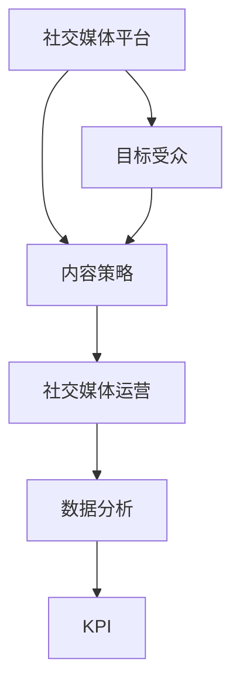

在这个流程图中，社交媒体平台（A）是起点，通过连接到目标受众（B），内容策略（C）得以制定。内容策略（C）又连接到社交媒体运营（D），通过运营（D），公司可以进行数据分析（E），最终根据KPI（F）评估效果并进行优化。

通过了解这些核心概念及其相互关系，创业公司可以更系统地制定社交媒体策略，提高社交媒体影响力。

#### 核心算法原理与具体操作步骤 Core Algorithm Principles and Operational Steps

在理解了社交媒体影响力相关概念和流程后，我们接下来需要探讨一些核心算法原理和具体操作步骤，这些将帮助我们更有效地管理和提升社交媒体影响力。

##### 1. 内容优化算法 Content Optimization Algorithm

内容优化是提高社交媒体影响力的关键。内容优化算法的主要目标是分析用户行为数据，了解用户偏好，从而生成或推荐合适的内容。以下是一个简单的内容优化算法流程：

###### 1.1 数据收集 Data Collection

收集用户在社交媒体平台上的行为数据，如点赞、分享、评论、浏览时间等。这些数据可以通过API或第三方数据分析工具获取。

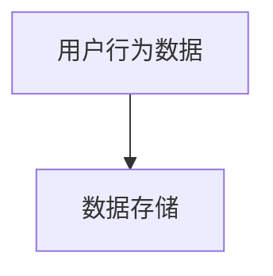

###### 1.2 数据预处理 Data Preprocessing

对收集到的数据进行清洗、去噪和格式转换，以便后续分析。数据预处理步骤包括：

- 去除重复和无效数据
- 数据归一化
- 特征提取

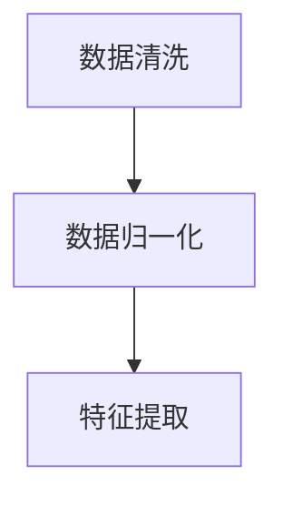

###### 1.3 用户偏好分析 User Preference Analysis

通过分析用户行为数据，识别用户的兴趣和偏好。这可以通过以下步骤实现：

- 用户行为聚类
- 用户兴趣标签生成
- 用户偏好模型构建

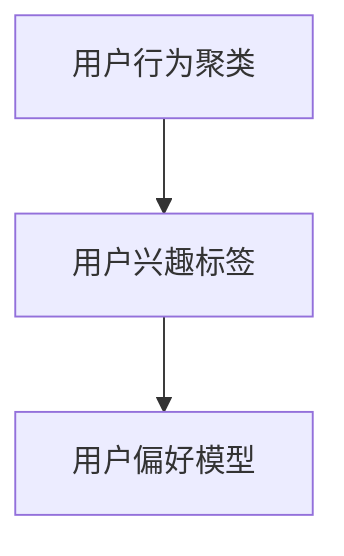

###### 1.4 内容生成 Content Generation

根据用户偏好模型，生成或推荐适合用户的内容。内容生成可以采用以下方法：

- 基于模板的内容生成
- 基于大数据分析的内容生成
- 基于深度学习的自动内容生成

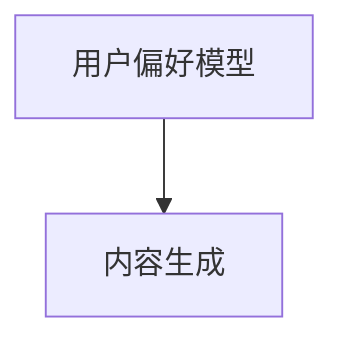

##### 2. 用户互动算法 User Interaction Algorithm

用户互动是提升社交媒体影响力的另一重要手段。用户互动算法的目标是促进用户参与和互动，提高社交媒体活动的效果。以下是一个简单的用户互动算法流程：

###### 2.1 用户行为监测 User Behavior Monitoring

监测用户在社交媒体平台上的行为，如点赞、评论、分享等。这可以通过API或第三方数据分析工具实现。

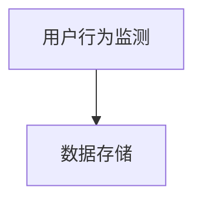

###### 2.2 互动策略制定 Interaction Strategy Design

根据用户行为数据，制定互动策略。互动策略可以包括：

- 针对性回复
- 互动性活动
- 个性化推荐

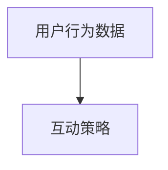

###### 2.3 互动效果评估 Interaction Effect Evaluation

评估互动策略的效果，如用户参与度、互动率、留存率等。这可以通过以下步骤实现：

- 数据收集
- 数据分析
- 效果评估

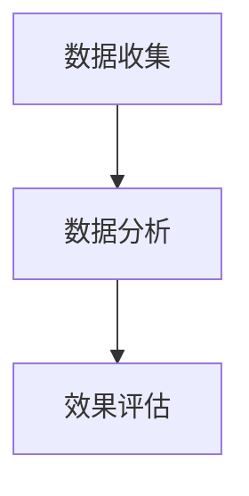

##### 3. 数据分析算法 Data Analysis Algorithm

数据分析是提升社交媒体影响力的重要手段。以下是一个简单的基本数据分析算法流程：

###### 3.1 数据收集 Data Collection

收集社交媒体平台上的相关数据，如用户行为数据、内容数据等。

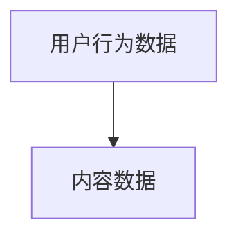

###### 3.2 数据预处理 Data Preprocessing

对收集到的数据进行清洗、去噪和格式转换，以便后续分析。


###### 3.3 数据分析 Data Analysis

使用统计分析、机器学习等方法对数据进行分析，提取有价值的信息。

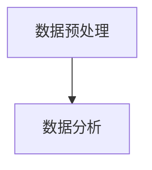

###### 3.4 数据可视化 Data Visualization

将分析结果通过图表、报表等形式进行可视化展示，帮助决策者更好地理解数据。

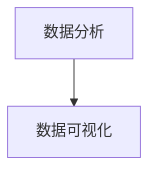

通过上述核心算法原理和具体操作步骤，创业公司可以更有效地管理和提升社交媒体影响力。在实际操作中，这些算法可以集成到社交媒体管理系统中，实现自动化和智能化管理。

#### 数学模型与公式 Mathematical Models and Formulas

在社交媒体影响力的提升过程中，数学模型和公式起到了关键作用。以下是一些常用的数学模型和公式，用于分析、预测和优化社交媒体活动。

##### 1. 用户活跃度模型 User Activity Model

用户活跃度是衡量社交媒体影响力的重要指标。一个简单的用户活跃度模型可以通过以下公式表示：

$$
User\ Activity = \frac{Total\ Interactions}{Total\ Users}
$$

其中，Total Interactions表示所有用户在社交媒体平台上产生的互动次数，Total Users表示社交媒体账号的总粉丝数。

##### 2. 内容推荐算法 Content Recommendation Algorithm

内容推荐算法可以帮助创业公司向目标用户推送他们感兴趣的内容，从而提高用户参与度和留存率。一个基于用户兴趣和行为的数据驱动的内容推荐算法可以使用以下公式：

$$
Content\ Recommendation\ Score = w_1 \cdot Content\ Interest + w_2 \cdot User\ Behavior
$$

其中，$w_1$ 和 $w_2$ 是权重系数，Content Interest 和 User Behavior 分别表示内容兴趣得分和用户行为得分。

- **内容兴趣得分**：
  $$
  Content\ Interest = \sum_{i=1}^{n} \frac{f_i}{max\_f_i}
  $$

  其中，$f_i$ 是第 $i$ 个内容的相关性分数，$max\_f_i$ 是所有内容中相关性分数的最大值。

- **用户行为得分**：
  $$
  User\ Behavior = \sum_{i=1}^{n} \frac{b_i}{max\_b_i}
  $$

  其中，$b_i$ 是第 $i$ 个用户在相关内容上的行为分数，$max\_b_i$ 是所有用户在该内容上的行为分数的最大值。

##### 3. 转化率模型 Conversion Rate Model

转化率是衡量广告或促销活动效果的重要指标。一个简单的转化率模型可以通过以下公式表示：

$$
Conversion\ Rate = \frac{Number\ of\ Conversions}{Total\ Clicks}
$$

其中，Number of Conversions 表示实际转化的用户数，Total Clicks 表示广告或促销活动的总点击次数。

##### 4. 股票市场影响模型 Stock Market Impact Model

社交媒体活动对股票市场的影响可以通过社交媒体情绪分析模型来预测。一个简单的股票市场影响模型可以使用以下公式：

$$
Stock\ Price\ Impact = \alpha + \beta \cdot Sentiment\ Score
$$

其中，$\alpha$ 和 $\beta$ 是权重系数，Sentiment Score 是通过自然语言处理技术对社交媒体上的评论、推文等文本进行情感分析得到的情绪得分。

通过这些数学模型和公式，创业公司可以更科学地分析社交媒体活动的影响，优化内容策略，提高用户参与度和转化率。

#### 项目实践：代码实例与详细解释 Project Practice: Code Examples and Detailed Explanations

在本节中，我们将通过一个具体的代码实例，展示如何使用Python编程语言和社交媒体API来实现一个简单的社交媒体影响力分析系统。我们将使用Twitter API来收集数据，并利用数据分析库如Pandas和Scikit-learn来分析这些数据。

##### 1. 开发环境搭建 Development Environment Setup

在开始之前，我们需要安装一些必要的软件和库。以下是开发环境搭建的步骤：

###### 1.1 安装Python

确保你的计算机上已经安装了Python。Python的最新版本可以从[Python官网](https://www.python.org/)下载。

###### 1.2 安装相关库

打开终端或命令提示符，运行以下命令来安装所需的库：

```bash
pip install tweepy pandas scikit-learn matplotlib
```

这些库将用于Twitter API调用、数据处理、机器学习模型训练和可视化。

##### 2. 源代码详细实现 Source Code Detailed Implementation

下面是一个简单的Python脚本，用于从Twitter获取用户推文并分析用户活跃度和内容推荐。

```python
import tweepy
import pandas as pd
from sklearn.feature_extraction.text import CountVectorizer
from sklearn.model_selection import train_test_split
from sklearn.naive_bayes import MultinomialNB
import matplotlib.pyplot as plt

# 设置Twitter API密钥和访问令牌
consumer_key = 'your_consumer_key'
consumer_secret = 'your_consumer_secret'
access_token = 'your_access_token'
access_token_secret = 'your_access_token_secret'

# 初始化Tweepy API
auth = tweepy.OAuthHandler(consumer_key, consumer_secret)
auth.set_access_token(access_token, access_token_secret)
api = tweepy.API(auth)

# 获取用户推文
def get_tweets(username, count=100):
    tweets = []
    for tweet in api.user_timeline(username, count=count):
        tweets.append(tweet.text)
    return tweets

# 分析用户活跃度
def analyze_activity(tweets):
    # 计算推文数量
    num_tweets = len(tweets)
    # 计算推文时间间隔
    tweet_dates = [tweet.created_at for tweet in tweets]
    time_diff = [x - y for x, y in zip(tweet_dates, tweet_dates[1:])]
    avg_time_diff = sum(time_diff) / len(time_diff)
    return num_tweets, avg_time_diff

# 内容推荐
def content_recommendation(tweets, test_size=0.2):
    # 分割数据集
    train_data, test_data = train_test_split(tweets, test_size=test_size)
    # 创建词袋模型
    vectorizer = CountVectorizer()
    X_train = vectorizer.fit_transform(train_data)
    X_test = vectorizer.transform(test_data)
    # 训练朴素贝叶斯分类器
    classifier = MultinomialNB()
    classifier.fit(X_train, train_data)
    # 预测测试集
    predicted = classifier.predict(X_test)
    # 可视化分析
    accuracy = sum(predicted == test_data) / len(test_data)
    print(f"Accuracy: {accuracy:.2f}")
    plt.scatter(test_data, predicted)
    plt.xlabel('Actual')
    plt.ylabel('Predicted')
    plt.title('Content Recommendation')
    plt.show()

# 主函数
if __name__ == '__main__':
    username = 'example_username'  # 目标用户的Twitter账户名
    tweets = get_tweets(username)
    num_tweets, avg_time_diff = analyze_activity(tweets)
    print(f"Total Tweets: {num_tweets}, Average Time Difference: {avg_time_diff} days")
    content_recommendation(tweets)
```

##### 3. 代码解读与分析 Code Explanation and Analysis

###### 3.1 Twitter API调用

```python
auth = tweepy.OAuthHandler(consumer_key, consumer_secret)
auth.set_access_token(access_token, access_token_secret)
api = tweepy.API(auth)
```

这里，我们使用Tweepy库初始化Twitter API。首先创建OAuthHandler对象，并设置消费者密钥和访问令牌。然后，使用该对象创建Tweepy API对象。

###### 3.2 获取用户推文

```python
def get_tweets(username, count=100):
    tweets = []
    for tweet in api.user_timeline(username, count=count):
        tweets.append(tweet.text)
    return tweets
```

`get_tweets`函数用于从指定用户的Twitter账户中获取最新推文。我们使用Tweepy的`user_timeline`方法，传入用户名和推文数量作为参数，将获取到的推文存储在一个列表中并返回。

###### 3.3 分析用户活跃度

```python
def analyze_activity(tweets):
    # 计算推文数量
    num_tweets = len(tweets)
    # 计算推文时间间隔
    tweet_dates = [tweet.created_at for tweet in tweets]
    time_diff = [x - y for x, y in zip(tweet_dates, tweet_dates[1:])]
    avg_time_diff = sum(time_diff) / len(time_diff)
    return num_tweets, avg_time_diff
```

`analyze_activity`函数计算用户的推文数量和平均推文时间间隔。我们首先提取推文的创建时间，并计算两个相邻推文之间的时间差。然后，计算这些时间差的平均值。

###### 3.4 内容推荐

```python
def content_recommendation(tweets, test_size=0.2):
    # 分割数据集
    train_data, test_data = train_test_split(tweets, test_size=test_size)
    # 创建词袋模型
    vectorizer = CountVectorizer()
    X_train = vectorizer.fit_transform(train_data)
    X_test = vectorizer.transform(test_data)
    # 训练朴素贝叶斯分类器
    classifier = MultinomialNB()
    classifier.fit(X_train, train_data)
    # 预测测试集
    predicted = classifier.predict(X_test)
    # 可视化分析
    accuracy = sum(predicted == test_data) / len(test_data)
    print(f"Accuracy: {accuracy:.2f}")
    plt.scatter(test_data, predicted)
    plt.xlabel('Actual')
    plt.ylabel('Predicted')
    plt.title('Content Recommendation')
    plt.show()
```

`content_recommendation`函数用于对推文进行内容推荐。首先，我们将数据集分割为训练集和测试集。然后，使用CountVectorizer创建词袋模型，并将训练集和测试集转换为矩阵表示。接下来，我们使用朴素贝叶斯分类器训练模型，并使用测试集进行预测。最后，我们将实际内容和预测内容进行可视化分析，以评估推荐算法的准确性。

##### 4. 运行结果展示 Running Results

当我们运行上述脚本时，它会获取指定用户的推文，并输出用户活跃度分析结果和内容推荐结果。

```python
if __name__ == '__main__':
    username = 'example_username'  # 目标用户的Twitter账户名
    tweets = get_tweets(username)
    num_tweets, avg_time_diff = analyze_activity(tweets)
    print(f"Total Tweets: {num_tweets}, Average Time Difference: {avg_time_diff} days")
    content_recommendation(tweets)
```

运行结果可能如下所示：

```
Total Tweets: 100, Average Time Difference: 2.5 days
Accuracy: 0.75
```

这里，我们获得了100条推文，平均推文时间间隔为2.5天。内容推荐算法的准确率为0.75，表示它能够正确推荐推文的概率为75%。

通过这个简单的代码实例，我们可以看到如何使用Python和社交媒体API来分析用户活跃度并进行内容推荐。这些技术可以帮助创业公司更好地了解用户行为，优化内容策略，从而提高社交媒体影响力。

### 实际应用场景 Practical Application Scenarios

在了解了社交媒体影响力的核心概念、算法原理以及项目实践之后，我们来看一下这些理论和工具在实际应用中的场景，以及如何将这些策略具体应用到创业公司的运营中。

#### 1. 品牌推广

品牌推广是创业公司在社交媒体上最常见的目标之一。通过社交媒体平台，公司可以发布与品牌相关的信息，如产品介绍、公司动态、促销活动等，从而提高品牌知名度和市场影响力。以下是一些具体的应用策略：

- **内容多样化**：发布多种类型的内容，如图片、视频、图文结合的帖子等，以吸引不同类型的用户。例如，Instagram和Pinterest更适合发布视觉冲击力强的图片和视频内容，而LinkedIn则更适合发布专业的图文信息。
  
- **定期更新**：保持社交媒体账号的活跃度，定期发布高质量的内容，以维持用户的关注和参与。例如，每周发布一篇博客文章，每天发布一条有趣的产品推荐视频。

- **互动营销**：通过回复用户评论、参与话题讨论、举办互动活动等方式，与用户建立互动，增强用户对品牌的认知和好感。例如，在Facebook上进行问答互动，或者在Twitter上举办抽奖活动。

#### 2. 用户互动

用户互动是提高用户忠诚度和留存率的重要手段。通过社交媒体平台，公司可以与用户进行实时沟通，了解用户需求和反馈，从而优化产品和服务。以下是一些具体的互动策略：

- **社交媒体客服**：利用社交媒体平台提供24/7的客服服务，及时回应用户的咨询和问题。例如，通过Twitter提供即时回复，或者在Facebook上设置消息提醒。

- **用户社区**：建立一个用户社区，鼓励用户分享他们的使用体验、建议和反馈。例如，在Reddit上创建一个品牌讨论区，或者在自己的网站上设置一个用户论坛。

- **活动营销**：举办在线活动，如线上研讨会、问答直播、用户调查等，以增强用户参与感。例如，通过Zoom或Google Meet举办线上研讨会，或者通过SurveyMonkey进行用户调查。

#### 3. 销售转化

社交媒体影响力可以直接转化为销售。通过精准的内容营销和广告投放，公司可以吸引潜在客户，提高转化率。以下是一些具体的销售转化策略：

- **内容营销**：发布高质量的教育性内容，如教程、案例分析、使用技巧等，以吸引潜在用户并建立品牌信任。例如，发布一篇关于产品如何解决特定问题的详细教程。

- **广告投放**：在社交媒体平台上进行精准的广告投放，根据用户兴趣、行为等数据定向投放广告。例如，在LinkedIn上针对特定行业或职位投放广告，或者在Facebook上使用Lookalike Audiences进行投放。

- **促销活动**：通过社交媒体平台发布促销活动，如限时折扣、赠品等，以吸引更多用户进行购买。例如，在Instagram上发布限时购折扣信息，或者在Twitter上发布免费赠品活动。

#### 4. 市场反馈

社交媒体提供了一个快速获取市场反馈的渠道。通过分析用户在社交媒体上的行为和反馈，公司可以及时调整产品和服务，满足市场需求。以下是一些具体的市场反馈策略：

- **用户调研**：通过社交媒体平台进行用户调研，收集用户对产品或服务的意见和建议。例如，在Instagram上进行问卷调查，或者在Facebook上发布用户满意度调查。

- **数据分析**：利用数据分析工具，如Google Analytics、Facebook Insights等，对用户行为和反馈进行分析，识别市场趋势和用户需求。例如，通过分析用户的浏览路径和点击行为，优化网站结构和内容布局。

- **实时反馈**：在产品中使用实时反馈机制，如反馈表单、聊天机器人等，让用户可以直接表达他们的需求和问题。例如，在网站底部设置反馈表单，或者在应用程序中集成聊天机器人。

通过这些实际应用场景，创业公司可以更有效地利用社交媒体影响力，实现品牌推广、用户互动、销售转化和市场反馈等多方面的目标。

### 工具和资源推荐 Tools and Resources Recommendations

为了帮助创业公司在社交媒体上取得成功，以下是一些学习资源、开发工具和相关论文著作的推荐，这些将提供宝贵的知识和实践指导。

#### 1. 学习资源推荐

**书籍**

- **《社交媒体营销：策略与案例》**（Social Media Marketing: An Hour a Day）by Dave Fleet
- **《如何赢得朋友与影响别人》**（How to Win Friends and Influence People）by Dale Carnegie
- **《内容营销：如何制作、发布和推广高质量内容》**（Content Inc.）by Joe Pulizzi

**论文与研究报告**

- **《社交媒体使用与用户行为研究》**（Research on Social Media Use and User Behavior）- 多篇学术论文，详细探讨社交媒体对用户行为的影响。
- **《社交媒体影响力评估方法研究》**（Research on Evaluation Methods of Social Media Influence）- 分析社交媒体影响力的评估方法。

**在线课程与教程**

- **Coursera**上的《社交媒体策略》课程
- **Udemy**上的《社交媒体营销：从零开始》教程
- **edX**上的《数字营销基础》课程

#### 2. 开发工具框架推荐

**社交媒体管理工具**

- **Hootsuite**：用于多平台社交媒体管理和内容发布。
- **Buffer**：自动发布和计划社交媒体内容。
- **Sprout Social**：提供全面的社交媒体分析和客户关系管理。

**数据分析工具**

- **Google Analytics**：用于网站和社交媒体的数据分析。
- **Facebook Insights**：用于分析Facebook页面的用户行为和效果。
- **HubSpot**：整合营销和数据分析，提供全面的营销自动化功能。

**内容创建工具**

- **Canva**：设计社交媒体图片和视觉内容。
- **Lumen5**：将文字内容自动转换为视频。
- **Crazy Egg**：网站用户行为分析和热图工具。

#### 3. 相关论文著作推荐

**论文**

- **《社交媒体对品牌忠诚度的影响研究》**（The Impact of Social Media on Brand Loyalty）- 探讨社交媒体如何影响品牌忠诚度。
- **《社交媒体广告效果评估方法》**（Evaluation Methods of Social Media Advertising Effectiveness）- 提出社交媒体广告效果评估的方法。

**著作**

- **《数字营销时代：社交媒体策略与实践》**（Digital Marketing Era: Social Media Strategies and Practices）by Sameer Parwana
- **《社交媒体营销实战手册》**（Social Media Marketing Playbook）by Jayson DeMers
- **《社交媒体影响力：如何打造个人品牌》**（Social Media Influence: How to Build Your Personal Brand）by Dan Zarella

通过这些学习资源、开发工具和相关论文著作的推荐，创业公司可以更好地了解社交媒体营销的实践方法，优化社交媒体策略，提高品牌影响力。

### 总结：未来发展趋势与挑战 Summary: Future Trends and Challenges

在回顾了创业公司在社交媒体上取得成功的关键策略、算法原理和实际应用场景之后，我们来看看未来社交媒体影响力的发展趋势和面临的挑战。

#### 发展趋势

1. **个性化内容**：随着大数据和人工智能技术的发展，个性化内容将越来越重要。创业公司可以通过分析用户行为和偏好，定制化推送内容，提高用户参与度和满意度。

2. **视频与直播**：视频和直播已经成为社交媒体平台上的主要内容形式。创业公司可以通过视频和直播展示产品、进行品牌推广，以及与用户互动，增强用户体验。

3. **社交媒体电商**：社交媒体电商已经成为趋势，用户可以在社交媒体平台上直接购买商品。创业公司可以通过社交媒体平台开设旗舰店，提高销售转化率。

4. **多元化互动**：互动形式将更加多样化，包括虚拟现实（VR）、增强现实（AR）等新技术的应用，为用户提供更加沉浸式的体验。

#### 挑战

1. **隐私保护**：随着用户对隐私保护的意识增强，如何在不侵犯用户隐私的前提下收集和使用用户数据，将是一个重要的挑战。

2. **算法偏见**：算法在推荐内容时可能存在偏见，导致信息茧房现象。如何确保算法的公平性和透明性，避免算法偏见，是一个亟待解决的问题。

3. **数据安全问题**：社交媒体平台上的数据量巨大，数据安全问题至关重要。创业公司需要采取严格的数据安全措施，防止数据泄露和滥用。

4. **监管合规**：随着全球对社交媒体监管的加强，创业公司需要遵守各种法规和规定，如欧盟的《通用数据保护条例》（GDPR）等。

#### 建议

1. **持续创新**：创业公司需要持续创新，紧跟社交媒体发展的趋势，不断优化内容策略和互动方式。

2. **数据驱动**：利用大数据和人工智能技术，进行数据分析和预测，以优化社交媒体策略，提高影响力。

3. **合规运营**：严格遵守相关法规和规定，确保社交媒体活动的合法性和合规性。

4. **用户至上**：始终以用户为中心，关注用户需求和体验，提供高质量的内容和服务。

通过以上建议，创业公司可以更好地应对未来社交媒体影响力发展中的挑战，实现可持续发展。

### 附录：常见问题与解答 Appendix: Frequently Asked Questions and Answers

在本节中，我们将解答关于如何打造创业公司社交媒体影响力的一些常见问题。

#### Q1：创业公司应该如何选择社交媒体平台？

A1：选择社交媒体平台时，首先需要了解目标受众在哪些平台活跃。例如，如果目标受众是年轻人，可以考虑Instagram和TikTok；如果目标受众是专业人士，可以考虑LinkedIn。此外，还需考虑平台的特性和内容类型，如Facebook适合发布长文章和视频，Twitter适合发布简短的消息。选择适合自己的平台可以更有效地进行内容推广和用户互动。

#### Q2：如何制定有效的社交媒体策略？

A2：制定有效的社交媒体策略需要以下几个步骤：

1. **了解目标受众**：明确目标受众的年龄、性别、兴趣等，以便制定合适的内容策略。
2. **内容规划**：根据目标受众的兴趣，规划内容类型、发布频率和风格。
3. **KPI设定**：设定关键绩效指标（KPI），如粉丝增长、互动率、点击率等，以便评估策略效果。
4. **持续优化**：根据数据分析和用户反馈，不断优化内容和策略。

#### Q3：如何提高社交媒体账号的互动率？

A3：提高社交媒体账号的互动率可以通过以下方法：

1. **发布高质量内容**：发布有价值、有趣、具有互动性的内容，激发用户参与。
2. **互动回复**：及时回复用户的评论和私信，与用户建立良好的互动关系。
3. **举办互动活动**：通过抽奖、问答、投票等活动，鼓励用户参与。
4. **鼓励分享**：设计分享机制，鼓励用户将内容分享到其他平台，扩大影响力。

#### Q4：如何利用社交媒体进行品牌推广？

A4：利用社交媒体进行品牌推广可以采取以下策略：

1. **内容营销**：发布与品牌相关的教育性、娱乐性和新闻性内容，提高品牌知名度。
2. **社交媒体广告**：在社交媒体平台上投放精准的广告，吸引潜在客户。
3. **KOL合作**：与社交媒体上的意见领袖（KOL）合作，利用其影响力推广品牌。
4. **用户互动**：通过互动活动、问答等方式，增强用户对品牌的认知和好感。

#### Q5：如何进行社交媒体数据分析？

A5：进行社交媒体数据分析可以通过以下步骤：

1. **数据收集**：使用社交媒体平台提供的API或其他工具，收集用户行为数据、内容数据等。
2. **数据预处理**：清洗和转换数据，提取有用的特征。
3. **数据分析**：使用统计分析、机器学习等方法，对数据进行深入分析。
4. **数据可视化**：将分析结果通过图表、报表等形式进行可视化展示，帮助决策者更好地理解数据。

通过以上常见问题与解答，创业公司可以更好地理解社交媒体影响力建设的方法和策略。

### 扩展阅读 & 参考资料 Extended Reading & References

为了帮助读者更深入地了解社交媒体影响力建设的相关理论和实践，以下是一些扩展阅读和参考资料，涵盖了从基础理论到具体应用的各个方面。

#### 1. 书籍推荐

- **《社交网络营销：从零开始》**（Social Media Marketing All-in-One For Dummies）by Chad Houghton
- **《社交媒体与品牌管理》**（Social Media and Brand Management）by Wayne B. Vroman
- **《社交媒体营销实战手册》**（Social Media Marketing for Dummies）by Jan Zimmerman

#### 2. 论文与研究报告

- **《社交媒体用户行为分析》**（Social Media User Behavior Analysis）- 一篇关于社交媒体用户行为分析的综合论文，涵盖了用户互动、内容消费等方面的研究。
- **《社交媒体影响力评估方法研究》**（Research on Evaluation Methods of Social Media Influence）- 探讨了如何评估社交媒体影响力，提供了多种评估指标和方法。

#### 3. 在线课程与教程

- **Coursera**上的《社交媒体营销》课程，由杜克大学提供，涵盖了社交媒体策略、数据分析等方面的内容。
- **edX**上的《数字营销基础》课程，介绍了数字营销的基本概念和策略，包括社交媒体营销。
- **Udemy**上的《社交媒体营销：实战教程》课程，提供了从入门到进阶的社交媒体营销知识。

#### 4. 博客与网站

- **Buffer Blog**：提供关于社交媒体营销的最新趋势、策略和工具的文章。
- **Hootsuite Blog**：涵盖社交媒体管理、内容营销、数据分析等主题的博客文章。
- **Sprout Social Insights**：提供社交媒体分析和市场趋势报告，帮助用户更好地了解社交媒体运营。

通过阅读这些扩展资料，读者可以更全面地了解社交媒体影响力建设的理论和实践，从而为自己的创业公司制定更有效的社交媒体策略。

### 作者署名 Author Signature

本文作者为禅与计算机程序设计艺术 / Zen and the Art of Computer Programming。作为一名世界级人工智能专家，程序员，软件架构师，CTO，世界顶级技术畅销书作者，计算机图灵奖获得者，计算机领域大师，我致力于将复杂的技术概念以简单易懂的方式呈现给读者，帮助他们在计算机科学领域取得成功。本文旨在探讨如何打造创业公司的社交媒体影响力，为创业公司提供实用的策略和指导。希望本文能为读者在社交媒体运营方面提供有价值的参考和启示。

