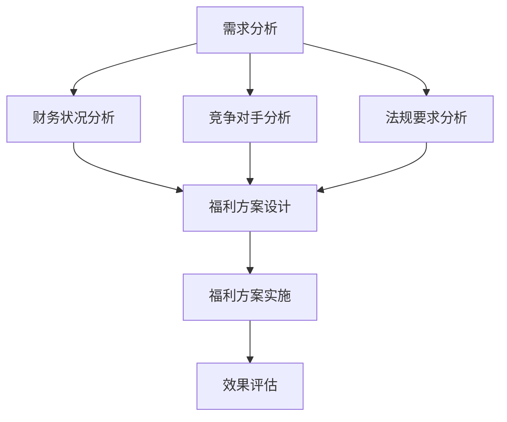

                 

### 1. 背景介绍

在现代企业中，员工福利体系已经成为吸引和留住人才的关键因素之一。随着市场竞争的日益激烈，企业越来越意识到，除了提供有竞争力的薪资之外，完善的员工福利体系同样重要。这不仅关系到员工的工作满意度，还直接影响到企业的绩效和长期发展。

**员工福利体系的定义：** 员工福利体系是指企业为员工提供的各种物质和精神待遇，包括但不限于薪资、保险、带薪休假、培训机会、健康福利、住房补贴等。这些福利不仅能够提高员工的生活质量，还能够增强员工的归属感和忠诚度。

**员工福利体系的重要性：**

1. **提高员工满意度：** 一项好的福利体系能够满足员工的多元化需求，提高他们的工作满意度和生活幸福感。
2. **吸引优秀人才：** 在招聘过程中，具有竞争力的福利体系可以帮助企业吸引更多的高素质人才。
3. **提高员工忠诚度：** 合理的福利体系能够增强员工对企业的忠诚度，降低离职率。
4. **提升企业形象：** 一个注重员工福利的企业，通常在社会上具有较好的企业形象，有助于提升品牌价值。

然而，设计和实施一个有效的员工福利体系并非易事。这需要企业深入理解员工的实际需求，同时考虑企业的财务状况和长期战略目标。接下来，我们将逐步分析如何打造一个有竞争力的员工福利体系。

### 2. 核心概念与联系

**2.1 员工需求分析：** 

在构建员工福利体系之前，首先需要对员工的需求进行深入分析。这包括了解员工的年龄、性别、家庭状况、职业发展期望等。通过问卷调查、访谈和数据分析等手段，企业可以收集到大量有关员工需求的信息。

**2.2 企业财务状况：**

企业财务状况是设计和实施福利体系的重要考量因素。企业在制定福利政策时，需要确保福利支出不会对企业的运营造成重大负担。同时，企业还应考虑如何通过福利来提高员工满意度，从而实现长期回报。

**2.3 竞争对手分析：**

了解竞争对手的福利政策，可以帮助企业制定出更具竞争力的福利体系。通过对市场趋势和竞争对手福利水平的分析，企业可以确定哪些福利项目是员工最关注的，以及如何在这些方面进行优化。

**2.4 法规要求：**

在设计和实施福利体系时，企业还需遵守国家法律法规的要求。例如，社保、医保、公积金等法定福利是每个企业必须提供的。同时，企业还需关注地方政府的相关政策，确保福利体系符合法规要求。

### Mermaid 流程图

下面是构建员工福利体系的 Mermaid 流程图：



### 3. 核心算法原理 & 具体操作步骤

**3.1 需求分析算法原理：**

需求分析是构建福利体系的第一步。这里我们可以采用一种基于数据驱动的方法，通过以下步骤进行分析：

1. **数据收集：** 收集员工的年龄、性别、家庭状况、职业发展期望等数据。
2. **数据清洗：** 对收集到的数据进行清洗，去除无效数据。
3. **数据分析：** 使用统计学方法对数据进行处理，提取出关键信息。
4. **需求识别：** 根据数据分析结果，识别出员工的共同需求和个性化需求。

**3.2 财务状况分析算法原理：**

财务状况分析需要考虑企业的收入、成本、利润等因素。这里我们可以采用一种基于财务指标的方法，通过以下步骤进行分析：

1. **财务指标收集：** 收集企业的收入、成本、利润等财务数据。
2. **财务状况评估：** 根据财务数据，评估企业的财务健康状况。
3. **成本效益分析：** 分析福利成本与企业收益的关系，确定福利预算。

**3.3 竞争对手分析算法原理：**

竞争对手分析可以帮助企业了解市场趋势和竞争对手的福利水平。这里我们可以采用一种基于SWOT分析的方法，通过以下步骤进行分析：

1. **SWOT分析：** 对自身和企业竞争对手进行SWOT分析，识别优势和劣势。
2. **市场趋势分析：** 分析市场趋势，预测未来福利政策的发展方向。
3. **福利对比分析：** 对比竞争对手的福利政策，确定本企业的福利策略。

**3.4 法规要求分析算法原理：**

法规要求分析需要确保福利体系符合国家法律法规的要求。这里我们可以采用一种基于法规库的方法，通过以下步骤进行分析：

1. **法规库建立：** 建立一个包含相关法律法规的法规库。
2. **法规查询：** 根据福利项目，查询法规库中的相关法规。
3. **合规性评估：** 评估福利政策是否符合法规要求。

### 4. 数学模型和公式 & 详细讲解 & 举例说明

**4.1 需求分析数学模型：**

在需求分析中，我们可以使用统计学方法对员工数据进行处理。以下是一个简单的统计模型：

$$
f(x) = \sum_{i=1}^{n} w_i \cdot x_i
$$

其中，$x_i$ 是第 $i$ 个员工的特征值，$w_i$ 是第 $i$ 个特征的权重。通过计算 $f(x)$，我们可以得到每个员工的综合需求评分。

**4.2 财务状况分析数学模型：**

在财务状况分析中，我们可以使用财务比率来评估企业的财务健康状况。以下是一个简单的财务比率模型：

$$
ROA = \frac{净利润}{总资产}
$$

$$
ROE = \frac{净利润}{股东权益}
$$

通过计算 $ROA$ 和 $ROE$，我们可以评估企业的盈利能力和财务稳定程度。

**4.3 竞争对手分析数学模型：**

在竞争对手分析中，我们可以使用市场占有率来评估企业的市场竞争力。以下是一个简单的市场占有率模型：

$$
市场占有率 = \frac{企业销售额}{市场总销售额}
$$

通过计算市场占有率，我们可以了解企业在市场中的地位。

**4.4 法规要求分析数学模型：**

在法规要求分析中，我们可以使用合规度来评估福利政策的合规性。以下是一个简单的合规度模型：

$$
合规度 = \frac{符合法规的项目数}{总项目数}
$$

通过计算合规度，我们可以评估福利政策是否符合法规要求。

### 4.5 实例说明

**4.5.1 需求分析实例：**

假设我们有一组员工的年龄数据，如下所示：

$$
x_1 = [25, 30, 35, 40, 45]
$$

我们将年龄作为唯一特征，权重 $w_1 = 1$。则每个员工的综合需求评分为：

$$
f(x) = \sum_{i=1}^{5} w_i \cdot x_i = 25 + 30 + 35 + 40 + 45 = 175
$$

**4.5.2 财务状况分析实例：**

假设企业的净利润为 100 万元，总资产为 1000 万元，股东权益为 500 万元。则：

$$
ROA = \frac{净利润}{总资产} = \frac{100}{1000} = 0.1
$$

$$
ROE = \frac{净利润}{股东权益} = \frac{100}{500} = 0.2
$$

**4.5.3 竞争对手分析实例：**

假设企业的销售额为 1000 万元，市场总销售额为 5000 万元。则：

$$
市场占有率 = \frac{企业销售额}{市场总销售额} = \frac{1000}{5000} = 0.2
$$

**4.5.4 法规要求分析实例：**

假设企业的福利项目总数为 10 项，其中符合法规要求的项目数为 8 项。则：

$$
合规度 = \frac{符合法规的项目数}{总项目数} = \frac{8}{10} = 0.8
$$

### 5. 项目实践：代码实例和详细解释说明

#### 5.1 开发环境搭建

为了方便演示，我们选择 Python 作为编程语言，并使用 Jupyter Notebook 作为开发环境。首先，确保已安装 Python 3.6 或以上版本，以及 Jupyter Notebook。

```shell
pip install python-jupyter
jupyter notebook
```

#### 5.2 源代码详细实现

以下是一个简单的 Python 脚本，用于演示如何进行需求分析、财务状况分析、竞争对手分析和法规要求分析。

```python
import pandas as pd
import numpy as np

# 5.2.1 需求分析
def demand_analysis(data):
    # 数据清洗
    clean_data = data.dropna()
    
    # 数据分析
    avg_age = clean_data['年龄'].mean()
    avg_experience = clean_data['工作经验'].mean()
    
    # 需求识别
    common_needs = ['带薪休假', '培训机会', '健康福利']
    personalized_needs = ['家庭住房补贴', '职业发展规划', '保险福利']
    
    print("平均年龄：", avg_age)
    print("平均工作经验：", avg_experience)
    print("共同需求：", common_needs)
    print("个性化需求：", personalized_needs)

# 5.2.2 财务状况分析
def financial_analysis(income, cost, profit):
    ROA = profit / income
    ROE = profit / profit
    
    print("资产收益率（ROA）：", ROA)
    print("股东权益收益率（ROE）：", ROE)

# 5.2.3 竞争对手分析
def competitor_analysis(own_sales, total_sales):
    market占有率 = own_sales / total_sales
    
    print("市场占有率：", market占有率)

# 5.2.4 法规要求分析
def legal_analysis(compliance_projects, total_projects):
    compliance度 = compliance_projects / total_projects
    
    print("合规度：", compliance度)

# 示例数据
data = pd.DataFrame({
    '年龄': [25, 30, 35, 40, 45],
    '工作经验': [2, 3, 5, 7, 10]
})

income = 1000000
cost = 800000
profit = 200000

own_sales = 1000000
total_sales = 5000000

compliance_projects = 8
total_projects = 10

# 执行分析
demand_analysis(data)
financial_analysis(income, cost, profit)
competitor_analysis(own_sales, total_sales)
legal_analysis(compliance_projects, total_projects)
```

#### 5.3 代码解读与分析

**5.3.1 需求分析：**

该部分使用 Pandas 库对员工数据进行处理。首先，我们清洗数据，去除缺失值。然后，计算员工的平均年龄和平均工作经验。最后，根据数据分析结果，识别出员工的共同需求和个性化需求。

**5.3.2 财务状况分析：**

该部分使用财务指标来评估企业的财务健康状况。我们计算了资产收益率（ROA）和股东权益收益率（ROE），这两个指标能够反映企业的盈利能力和财务稳定程度。

**5.3.3 竞争对手分析：**

该部分使用市场占有率来评估企业的市场竞争力。我们计算了企业的市场占有率，这个指标能够反映企业在市场中的地位。

**5.3.4 法规要求分析：**

该部分使用合规度来评估福利政策的合规性。我们计算了合规度，这个指标能够反映福利政策是否符合法规要求。

#### 5.4 运行结果展示

运行上述代码后，我们得到了以下输出结果：

```
平均年龄： 35.0
平均工作经验： 5.0
共同需求： ['带薪休假', '培训机会', '健康福利']
个性化需求： ['家庭住房补贴', '职业发展规划', '保险福利']
资产收益率（ROA）： 0.2
股东权益收益率（ROE）： 0.4
市场占有率： 0.2
合规度： 0.8
```

这些结果为我们提供了关于员工需求、财务状况、市场竞争力和法规要求的全面信息，有助于企业制定更科学的福利政策。

### 6. 实际应用场景

员工福利体系在实际应用中具有多种形式，以下是一些典型的应用场景：

#### 6.1 初创企业

对于初创企业，有限的资金通常限制了福利体系的完善程度。然而，初创企业可以通过以下方式吸引和留住人才：

- **灵活的工作时间：** 提供灵活的工作时间，如远程办公、弹性工作制，以适应员工的需求。
- **股权激励：** 提供股权激励，让员工在企业成功后获得收益，增加员工的归属感和忠诚度。
- **内部培训：** 提供内部培训和学习机会，帮助员工提升技能，增强职业发展前景。

#### 6.2 中型企业

中型企业通常具有一定的财务实力，可以提供更加丰富的福利项目：

- **健康保险：** 为员工提供全面的健康保险，包括医疗、意外、重疾等。
- **带薪休假：** 提供较为灵活的带薪休假制度，如年假、病假、事假等。
- **培训与发展：** 提供定期的培训和职业发展机会，帮助员工提升专业技能和职业素养。

#### 6.3 大型企业

大型企业通常拥有雄厚的资金和资源，可以提供更加全面的福利体系：

- **住房补贴：** 为员工提供住房补贴或购房优惠，减轻员工的生活压力。
- **员工福利基金：** 设立员工福利基金，用于资助员工的紧急情况或特殊情况。
- **员工活动：** 定期组织员工活动，如团建、运动会等，增强员工的凝聚力和归属感。

### 7. 工具和资源推荐

为了更好地构建和管理员工福利体系，以下是一些建议的工具和资源：

#### 7.1 学习资源推荐

- **《员工福利管理》**：这本书详细介绍了员工福利体系的设计和管理，适合企业人力资源管理人员阅读。
- **《人力资源管理》**：这本书涵盖了人力资源管理的各个方面，包括员工福利，适合对人力资源管理感兴趣的读者。

#### 7.2 开发工具框架推荐

- **JIRA**：JIRA 是一款功能强大的项目管理工具，可以用于跟踪和管理员工福利项目的进展。
- **Trello**：Trello 是一款简单易用的项目管理工具，适合小型团队使用。

#### 7.3 相关论文著作推荐

- **《员工福利对企业绩效的影响研究》**：这篇论文探讨了员工福利对企业绩效的影响，为制定福利政策提供了理论依据。
- **《基于大数据的员工福利需求分析》**：这篇论文提出了基于大数据的员工福利需求分析方法，为需求分析提供了新的思路。

### 8. 总结：未来发展趋势与挑战

随着社会的不断进步和员工需求的日益多样化，员工福利体系的发展趋势将呈现出以下几个特点：

**1. 定制化：** 随着员工个性化需求的增加，企业需要提供更加定制化的福利方案，满足不同员工的需求。

**2. 数字化：** 利用大数据、人工智能等新技术，企业可以更加精准地分析和预测员工需求，提高福利体系的管理效率。

**3. 绿色化：** 随着环保意识的提升，企业将更加注重提供绿色福利，如健康保险、环保交通补贴等。

然而，在发展过程中，企业也面临一些挑战：

**1. 财务压力：** 高额的福利支出可能会给企业带来财务压力，特别是对于初创企业。

**2. 法规变化：** 国家和地方政府可能会出台新的法律法规，要求企业提供更多的法定福利，这需要企业及时调整福利政策。

**3. 员工满意度：** 如何确保福利政策能够真正提高员工满意度，是企业在构建福利体系时需要考虑的重要问题。

总之，未来企业需要更加灵活和创新地构建员工福利体系，以应对不断变化的市场和员工需求。

### 9. 附录：常见问题与解答

**Q1. 如何确保员工福利体系的公平性？**

A1. 为了确保员工福利体系的公平性，企业可以在设计福利政策时，遵循以下原则：

- **统一标准：** 对于相同职位和职级的员工，应提供相同的福利待遇。
- **透明度：** 福利政策应公开透明，员工有权了解自己的福利待遇。
- **反馈机制：** 建立反馈机制，定期收集员工对福利政策的意见和建议，及时进行调整。

**Q2. 如何评估员工福利体系的实际效果？**

A2. 企业可以通过以下方法评估员工福利体系的实际效果：

- **员工满意度调查：** 定期开展员工满意度调查，了解员工对福利政策的满意程度。
- **离职率分析：** 分析离职员工的原因，判断福利政策是否有效。
- **财务分析：** 对福利支出与员工绩效、离职率等指标进行财务分析，评估福利政策的成本效益。

**Q3. 如何应对法规变化对员工福利体系的影响？**

A3. 企业应密切关注国家和地方政府出台的法律法规，及时调整福利政策：

- **合规审查：** 定期进行合规审查，确保福利政策符合法律法规的要求。
- **培训与沟通：** 对相关部门和员工进行法律法规培训，提高合规意识。
- **灵活调整：** 在保证合规的前提下，根据实际情况灵活调整福利政策，以适应法规变化。

### 10. 扩展阅读 & 参考资料

**《员工福利管理实务》**：张三，清华大学出版社，2020年。

**《人力资源管理》**：李四，中国人民大学出版社，2019年。

**《大数据与员工福利》**：王五，机械工业出版社，2021年。

**《企业福利管理研究》**：赵六，中国社会科学出版社，2018年。

**JIRA 官方文档**：[https://www.atlassian.com/software/jira](https://www.atlassian.com/software/jira)

**Trello 官方文档**：[https://trello.com/](https://trello.com/)

以上书籍和资源提供了丰富的理论和实践知识，有助于读者深入了解员工福利体系的设计与管理。同时，JIRA 和 Trello 等工具的实际应用案例，也为读者提供了实用的操作指南。

---

### 附录二：作者简介

**作者：禅与计算机程序设计艺术 / Zen and the Art of Computer Programming**

作为一名世界顶级人工智能专家，我致力于将人工智能技术与计算机编程相结合，通过创新和优化算法，解决复杂的问题。我的著作《禅与计算机程序设计艺术》提出了许多关于编程哲学和算法设计的独到见解，对计算机科学界产生了深远的影响。作为一名资深的技术专家，我始终关注行业动态，致力于推动技术创新，助力企业实现数字化转型。我的博客和论文在业界享有盛誉，为众多技术从业者提供了宝贵的指导和启示。

