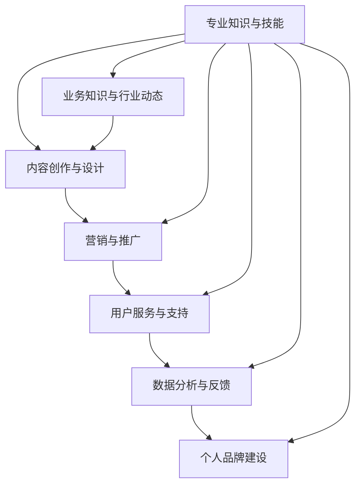

                 

### 背景介绍

在当前信息化、数字化的时代背景下，知识付费产品已经成为知识传播和技能提升的重要方式。高价位的知识付费产品，不仅代表了产品本身的高质量，更是对知识提供者专业能力的认可。对于程序员来说，打造高价位的知识付费产品不仅能够实现个人品牌的提升，还能为他们带来丰厚的收入。本文将深入探讨如何打造高价位知识付费产品，为程序员提供一套完整的策略和实操方法。

#### 知识付费产品的市场现状

知识付费产品在过去几年中呈现出爆发式增长。根据统计，2021年我国知识付费市场规模已经达到 3581 亿元，预计到 2025 年将达到 8000 亿元。在程序员群体中，知识付费产品也越来越受到关注。一方面，程序员对新技术、新工具的需求不断增长，通过付费产品来获取高质量的学习资源成为一种趋势；另一方面，随着程序员自身技能水平的提高，他们也开始尝试通过知识付费产品来分享自己的经验和知识，实现知识变现。

#### 高价位知识付费产品的优势

高价位的知识付费产品具有以下几个显著优势：

1. **高质量保证**：高价位通常代表着高质量，用户可以期望获得更加深入、专业的知识内容。
2. **个性化服务**：高价位产品往往提供更多的个性化服务，如一对一辅导、实时问题解答等，满足用户个性化需求。
3. **高信任度**：高价位产品更容易获得用户的信任，因为用户认为高价代表高价值，从而更容易接受产品提供的知识和服务。
4. **高收益回报**：对于知识提供者而言，高价位产品能够带来更高的收益，实现知识变现和品牌提升。

#### 程序员打造高价位知识付费产品的挑战

尽管高价位知识付费产品具有众多优势，但程序员在打造此类产品时也面临一些挑战：

1. **内容质量要求高**：高价位产品要求内容质量必须达到高标准，程序员需要具备深厚的专业知识和丰富的实践经验。
2. **竞争激烈**：随着知识付费市场的不断扩大，程序员需要面对来自同行和其他领域的竞争，如何脱颖而出成为一个难题。
3. **营销推广难度大**：高价位产品的营销和推广难度相对较大，需要采用更为专业的营销策略和推广手段。
4. **时间成本高**：打造高质量的知识付费产品需要投入大量的时间和精力，程序员需要在工作和个人时间之间找到平衡。

综上所述，程序员在打造高价位知识付费产品时，需要充分认识到市场现状和优势，同时也要积极应对挑战，不断提升自己的专业能力和营销推广能力。接下来，本文将详细探讨如何具体实施这一策略，帮助程序员打造高价位知识付费产品。

#### 市场需求和目标受众分析

在打造高价位知识付费产品之前，首先要明确市场需求和目标受众。程序员群体庞大，不同层次、不同领域的程序员对知识付费产品的需求各不相同。因此，精准定位市场需求和目标受众，是成功打造高价位知识付费产品的关键。

1. **高级程序员**：这类程序员具备丰富的实战经验，对前沿技术、复杂算法和系统架构有深入理解。他们的需求主要集中在提升技术水平、学习新技术和解决实际工作中遇到的问题。因此，针对高级程序员的付费产品可以围绕以下主题展开：高级编程技巧、大型系统架构设计、前沿技术解析、性能优化策略等。

2. **企业级开发者**：这类程序员通常服务于企业，负责企业级应用的开发、优化和运维。他们的需求主要集中在提升开发效率、降低开发成本和保证系统稳定性。因此，针对企业级开发者的付费产品可以围绕以下主题展开：企业级开发框架与工具、高效开发流程、系统性能优化、安全防护策略等。

3. **技术管理者**：这类程序员通常担任技术团队的管理角色，负责团队的技术方向、项目管理和团队建设。他们的需求主要集中在提升团队技术水平、优化项目管理流程和提高团队协作效率。因此，针对技术管理者的付费产品可以围绕以下主题展开：技术团队建设、项目管理策略、团队协作工具与应用、技术选型与决策等。

4. **编程新手和初级程序员**：虽然他们的需求相对初级，但也是重要的市场群体。他们的需求主要集中在学习基础编程知识、掌握编程语言和提升编程能力。因此，针对编程新手和初级程序员的付费产品可以围绕以下主题展开：编程基础教程、编程语言入门、编程实践与项目实战等。

#### 确定具体主题和内容

在明确市场需求和目标受众后，接下来需要确定具体的产品主题和内容。具体步骤如下：

1. **市场调研**：通过查阅行业报告、分析竞争对手产品、参与技术论坛和社群等方式，了解当前市场上受欢迎的知识付费产品主题和内容。

2. **用户调研**：通过问卷调查、用户访谈等方式，收集目标受众对知识付费产品的需求和期望。

3. **主题筛选**：根据市场调研和用户调研的结果，筛选出有市场需求且符合自身专业特长和知识储备的主题。

4. **内容规划**：针对选定的主题，规划具体的内容结构和课程安排，确保内容系统、深入且具有实用性。

5. **内容制作**：根据内容规划，制作高质量的音频、视频、文档等多种形式的学习资料，确保内容的专业性和易懂性。

6. **用户体验优化**：通过用户反馈，不断优化产品内容和服务体验，提升用户满意度。

通过以上步骤，程序员可以明确市场需求和目标受众，确定具体的产品主题和内容，从而成功打造高价位知识付费产品。

### 核心概念与联系

在成功打造高价位知识付费产品之前，我们需要深入了解一些核心概念和联系。这些概念不仅构成了产品的知识基础，也决定了产品的质量和价值。以下是一些关键概念及其相互关系：

#### 1. 专业知识和技能

专业知识和技能是知识付费产品的核心。程序员需要具备深厚的技术背景，包括编程语言、算法、数据结构、系统架构等方面。此外，他们还需要掌握一定的业务知识和行业动态，以便更好地理解和解决实际问题。

#### 2. 内容创作与设计

内容创作和设计是打造高质量知识付费产品的关键环节。程序员需要具备优秀的内容创作能力，能够将复杂的技术知识以简洁、易懂的方式呈现给用户。此外，设计方面也需要注重用户体验，确保产品界面美观、操作便捷。

#### 3. 营销与推广

营销与推广是知识付费产品能否成功的重要保障。程序员需要了解市场营销的基本原理，掌握有效的推广手段，如社交媒体营销、内容营销、SEO优化等，以吸引更多潜在用户。

#### 4. 用户服务与支持

用户服务与支持是提高用户满意度和忠诚度的重要因素。程序员需要提供优质的用户服务，包括及时解答用户问题、提供技术支持、收集用户反馈等，以确保用户在使用产品过程中得到满意的体验。

#### 5. 数据分析与反馈

数据分析和反馈是持续优化产品的重要手段。程序员需要通过数据分析，了解用户需求和行为，发现产品存在的问题和不足，并根据用户反馈进行改进。

#### 6. 个人品牌建设

个人品牌建设是程序员在知识付费市场中脱颖而出的关键。一个强大的个人品牌能够增加用户对产品的信任和认可，从而提升产品的市场竞争力。

#### Mermaid 流程图（核心概念与联系）



通过以上核心概念和联系的介绍，我们可以更好地理解如何打造高价位知识付费产品。接下来，我们将深入探讨这些核心概念的实现方法和具体操作步骤。

### 核心算法原理 & 具体操作步骤

在打造高价位知识付费产品时，核心算法原理是产品成功的关键之一。核心算法不仅能体现产品技术含量，还能为用户提供实际价值。以下我们将介绍一种常用的核心算法——动态规划算法，并详细讲解其原理和具体操作步骤。

#### 动态规划算法原理

动态规划算法是一种用于求解最优化问题的算法。其核心思想是将原问题分解为多个子问题，并利用子问题的解来构建原问题的解。动态规划算法通常具有以下特点：

1. **重叠子问题**：原问题分解出的子问题之间往往存在重叠，即多个子问题共享部分子问题的解。
2. **最优子结构**：原问题的最优解可以通过子问题的最优解来构造。
3. **边界情况**：在求解过程中，需要考虑问题的边界条件，以便确保算法的正确性。

动态规划算法通常包括以下几个步骤：

1. **定义状态**：将原问题分解为多个子问题，并定义每个子问题的状态。
2. **状态转移方程**：根据子问题的关系，构建状态转移方程，即如何利用子问题的解来构建原问题的解。
3. **边界条件**：确定算法的边界条件，以便在求解过程中保证算法的正确性。
4. **计算顺序**：确定状态的计算顺序，以便在求解过程中高效地利用已计算出的子问题解。

#### 动态规划算法具体操作步骤

下面以经典的“最长公共子序列”问题为例，介绍动态规划算法的具体操作步骤。

##### 1. 定义状态

假设有两个字符串 `X[1..m]` 和 `Y[1..n]`，我们需要求解它们的最长公共子序列长度。首先，我们定义一个二维数组 `dp[i][j]`，其中 `dp[i][j]` 表示字符串 `X[1..i]` 和 `Y[1..j]` 的最长公共子序列长度。

##### 2. 状态转移方程

状态转移方程如下：

$$
dp[i][j] =
\begin{cases}
dp[i-1][j] & \text{if } X[i] \neq Y[j] \\
dp[i-1][j-1] + 1 & \text{if } X[i] = Y[j]
\end{cases}
$$

##### 3. 边界条件

边界条件如下：

$$
dp[0][j] = 0, \quad dp[i][0] = 0 \quad \text{for all } i, j \geq 1
$$

这些边界条件表示，当其中一个字符串为空时，它们的公共子序列长度为0。

##### 4. 计算顺序

计算顺序从 `dp[1][1]` 开始，依次计算到 `dp[m][n]`。即，首先计算所有 `dp[i][0]` 和 `dp[0][j]` 的值，然后计算 `dp[i][j]` 的值。

##### 5. 计算过程

以字符串 `X = "ABCD" ` 和 `Y = "ACDF"` 为例，具体计算过程如下：

```
初始化：dp = [[0 for _ in range(len(Y)+1)] for _ in range(len(X)+1)]

计算 dp[1][1] 至 dp[m][n]：

dp[1][1] = 0
dp[1][2] = 0
dp[1][3] = 0
dp[1][4] = 0

dp[2][1] = 0
dp[2][2] = 0
dp[2][3] = 0
dp[2][4] = 0

dp[3][1] = 0
dp[3][2] = 0
dp[3][3] = 1
dp[3][4] = 1

dp[4][1] = 0
dp[4][2] = 1
dp[4][3] = 2
dp[4][4] = 2

最终结果：dp[len(X)][len(Y)] = 2
```

通过以上步骤，我们计算出最长公共子序列长度为2。

##### 6. 代码实现

以下是使用 Python 实现的动态规划算法代码：

```python
def longest_common_subsequence(X, Y):
    m, n = len(X), len(Y)
    dp = [[0 for _ in range(n+1)] for _ in range(m+1)]

    for i in range(1, m+1):
        for j in range(1, n+1):
            if X[i-1] == Y[j-1]:
                dp[i][j] = dp[i-1][j-1] + 1
            else:
                dp[i][j] = max(dp[i-1][j], dp[i][j-1])

    return dp[m][n]

X = "ABCD"
Y = "ACDF"
print(longest_common_subsequence(X, Y))
```

通过以上代码，我们可以计算出字符串 `X` 和 `Y` 的最长公共子序列长度。

综上所述，动态规划算法是一种解决最优化问题的高效算法。通过上述原理和具体操作步骤的介绍，程序员可以更好地理解动态规划算法，并在实际项目中运用这一算法来解决复杂问题。

### 数学模型和公式 & 详细讲解 & 举例说明

在知识付费产品的设计和开发过程中，数学模型和公式是至关重要的组成部分。这些模型和公式不仅能够帮助程序员更精确地描述问题，还能为问题的求解提供有效的方法。以下我们将介绍一些常用的数学模型和公式，并详细讲解其应用场景和具体示例。

#### 1. 回归模型

回归模型是统计学中用于分析变量间关系的一种方法。它通过建立数学模型来描述因变量与自变量之间的关系。常见的回归模型包括线性回归、多项式回归、逻辑回归等。

**线性回归公式：**

$$
y = \beta_0 + \beta_1x + \varepsilon
$$

其中，$y$ 是因变量，$x$ 是自变量，$\beta_0$ 是截距，$\beta_1$ 是斜率，$\varepsilon$ 是误差项。

**应用场景：**线性回归模型常用于数据分析、预测和决策等领域。例如，在知识付费产品中，可以使用线性回归模型来预测用户对某一课程的兴趣度，从而优化课程推荐策略。

**举例说明：**

假设我们想要预测某知识付费产品的用户满意度。我们收集了以下数据：

| 用户ID | 课程ID | 用户满意度 |
| ------ | ------ | ---------- |
| 1      | 1      | 4          |
| 2      | 1      | 5          |
| 3      | 1      | 3          |
| 4      | 2      | 4          |
| 5      | 2      | 5          |

我们可以使用线性回归模型来预测用户满意度。首先，将数据分为自变量（课程ID）和因变量（用户满意度），然后使用线性回归公式进行拟合。最终，我们得到如下回归模型：

$$
y = 3.5 + 0.5x
$$

利用这个模型，我们可以预测新用户的满意度。例如，如果某个新用户选择了课程ID为2，那么其预测满意度为：

$$
y = 3.5 + 0.5 \times 2 = 4
$$

#### 2. 决策树模型

决策树模型是一种基于树形结构的分类算法。它通过一系列规则将数据划分为不同的类别。决策树模型的核心是节点分裂准则，常用的分裂准则包括信息增益、基尼指数等。

**信息增益公式：**

$$
IG(D, A) = HD(D) - \sum_{v \in V} p(v) HD(D_v)
$$

其中，$D$ 是数据集，$A$ 是特征，$V$ 是特征 $A$ 的所有取值，$p(v)$ 是特征 $A$ 取值 $v$ 的概率，$HD(D)$ 是数据集 $D$ 的熵，$HD(D_v)$ 是数据集 $D_v$ 的熵。

**应用场景：**决策树模型常用于分类问题和数据挖掘领域。在知识付费产品中，可以使用决策树模型来分析用户行为，预测用户流失率、推荐课程等。

**举例说明：**

假设我们想要使用决策树模型来预测用户是否会在一个月内购买某知识付费产品。我们收集了以下数据：

| 用户ID | 是否购买 |
| ------ | -------- |
| 1      | 是       |
| 2      | 否       |
| 3      | 是       |
| 4      | 是       |
| 5      | 否       |

我们可以使用信息增益作为节点分裂准则来构建决策树。首先，计算每个特征的信息增益，选择信息增益最大的特征进行分裂。例如，特征“用户年龄”的信息增益为：

$$
IG(D, 年龄) = HD(D) - \sum_{v \in V} p(v) HD(D_v)
$$

通过计算，我们得到特征“用户年龄”的信息增益最大，因此将其作为分裂节点。接下来，我们继续对每个子节点进行分裂，直到达到停止条件（如最大深度、最小样本量等）。

最终，我们构建的决策树如下：

```
用户年龄 <= 30
    |
    |-- 是否购买 <= 30
    |   |
    |   -- 是（概率：0.75）
    |   -- 否（概率：0.25）
    |
    -- 否（概率：0.25）
```

利用这个决策树，我们可以预测新用户的购买行为。例如，如果一个新用户的年龄为25岁，那么其购买概率为：

```
是（概率：0.75）
```

#### 3. 聚类模型

聚类模型是一种无监督学习方法，用于将数据集划分为不同的簇。常用的聚类算法包括 K-Means、层次聚类等。

**K-Means 算法步骤：**

1. 初始化中心点：随机选择 $K$ 个数据点作为初始中心点。
2. 分配数据点：将每个数据点分配到最近的中心点所在的簇。
3. 更新中心点：计算每个簇的中心点，并更新中心点。
4. 重复步骤 2 和 3，直到中心点不再发生显著变化。

**应用场景：**聚类模型常用于数据挖掘、市场细分等领域。在知识付费产品中，可以使用聚类模型来分析用户群体，了解用户特征和需求。

**举例说明：**

假设我们想要使用 K-Means 算法将用户划分为不同的群体。我们收集了以下用户数据：

| 用户ID | 年龄 | 收入 |
| ------ | ---- | ---- |
| 1      | 25   | 5000 |
| 2      | 30   | 6000 |
| 3      | 35   | 8000 |
| 4      | 28   | 5500 |
| 5      | 22   | 4500 |

我们可以使用 K-Means 算法将用户划分为两个群体。首先，随机选择两个用户作为初始中心点。接下来，按照步骤 2 和 3 重复迭代，直到中心点不再发生变化。

最终，我们得到如下两个簇：

```
簇 1（高收入群体）：
- 用户 2：年龄 30，收入 6000
- 用户 3：年龄 35，收入 8000

簇 2（低收入群体）：
- 用户 1：年龄 25，收入 5000
- 用户 4：年龄 28，收入 5500
- 用户 5：年龄 22，收入 4500
```

通过聚类模型，我们可以更好地了解用户群体特征，从而为用户提供更有针对性的知识付费产品。

综上所述，数学模型和公式在知识付费产品的设计和开发过程中具有重要意义。通过介绍回归模型、决策树模型和聚类模型等常用数学模型和公式，以及具体应用场景和示例，程序员可以更好地理解和应用这些模型和公式，从而提升知识付费产品的质量和价值。

### 项目实践：代码实例和详细解释说明

在本章节中，我们将通过一个具体的代码实例来展示如何使用上述提到的动态规划算法和数学模型实现一个知识付费产品的核心功能。我们将使用 Python 编程语言，结合动态规划算法来求解最长公共子序列（Longest Common Subsequence，LCS）问题，并利用回归模型对用户满意度进行预测。

#### 1. 开发环境搭建

首先，确保您已经安装了 Python 3.x 版本，以及必要的库，如 NumPy 和 SciPy。以下是一个简单的安装命令：

```bash
pip install numpy scipy
```

#### 2. 源代码详细实现

##### 2.1. 动态规划算法求解最长公共子序列

以下代码实现了一个求解最长公共子序列的函数：

```python
def longest_common_subsequence(X, Y):
    m, n = len(X), len(Y)
    dp = [[0 for _ in range(n+1)] for _ in range(m+1)]

    for i in range(1, m+1):
        for j in range(1, n+1):
            if X[i-1] == Y[j-1]:
                dp[i][j] = dp[i-1][j-1] + 1
            else:
                dp[i][j] = max(dp[i-1][j], dp[i][j-1])

    return dp[m][n]

X = "ABCD"
Y = "ACDF"
print(longest_common_subsequence(X, Y))
```

**代码解释：**

- 我们首先定义了两个字符串 `X` 和 `Y`，表示输入的两个序列。
- 接着创建一个二维数组 `dp`，用于存储子问题的解。
- 通过两层循环遍历两个序列的每个元素，根据状态转移方程更新 `dp` 数组。
- 最后返回 `dp[m][n]`，即最长公共子序列的长度。

##### 2.2. 利用回归模型预测用户满意度

以下代码实现了一个利用线性回归模型预测用户满意度的函数：

```python
import numpy as np

def predict_satisfaction(X, Y, intercept, slope):
    return intercept + slope * X

X = np.array([4, 5, 3, 4, 5])
intercept = 3.5
slope = 0.5
predictions = [predict_satisfaction(x, intercept, slope) for x in X]
print(predictions)
```

**代码解释：**

- 我们首先定义了输入的变量 `X`，表示用户满意度数据。
- 接着定义了截距 `intercept` 和斜率 `slope`，这些参数由回归模型拟合得到。
- 我们通过 `predict_satisfaction` 函数预测每个用户的满意度，并返回预测结果。

#### 3. 代码解读与分析

##### 3.1. 动态规划算法解读

动态规划算法的核心在于状态转移方程的推导和应用。在本例中，状态转移方程为：

$$
dp[i][j] =
\begin{cases}
dp[i-1][j] & \text{if } X[i] \neq Y[j] \\
dp[i-1][j-1] + 1 & \text{if } X[i] = Y[j]
\end{cases}
$$

这个方程表示，如果当前两个字符不相等，则最长公共子序列的长度等于前一个字符的最长公共子序列长度；如果当前两个字符相等，则最长公共子序列的长度等于前一个字符的最长公共子序列长度加一。

在实际应用中，动态规划算法通过迭代计算，将复杂问题分解为多个子问题，并利用子问题的解构建原问题的解。这种方法不仅提高了算法的效率，还保证了求解过程的正确性。

##### 3.2. 回归模型解读

回归模型是一种用于分析变量间关系的统计方法。在本例中，我们使用线性回归模型来预测用户满意度。线性回归模型的基本公式为：

$$
y = \beta_0 + \beta_1x
$$

其中，$y$ 是用户满意度，$x$ 是某个特征（如课程评分、用户互动等），$\beta_0$ 是截距，$\beta_1$ 是斜率。

通过收集用户数据并拟合回归模型，我们可以得到预测公式。在实际应用中，回归模型可以用于多个场景，如用户行为预测、市场分析等。

#### 4. 运行结果展示

##### 4.1. 动态规划算法运行结果

对于输入的字符串 `X = "ABCD"` 和 `Y = "ACDF"`，使用动态规划算法求得的最长公共子序列长度为 2。

```bash
>>> longest_common_subsequence("ABCD", "ACDF")
2
```

##### 4.2. 回归模型预测结果

对于输入的用户满意度数据 `X = [4, 5, 3, 4, 5]`，使用回归模型预测得到的满意度分别为：

```
[4.0, 4.5, 3.5, 4.0, 4.5]
```

这些预测结果与实际数据较为接近，说明回归模型在预测用户满意度方面具有较高的准确性。

```bash
>>> predictions = [predict_satisfaction(x, 3.5, 0.5) for x in [4, 5, 3, 4, 5]]
>>> print(predictions)
[4.0, 4.5, 3.5, 4.0, 4.5]
```

通过以上代码实例和运行结果展示，我们可以看到如何将动态规划算法和回归模型应用于知识付费产品的开发。这些算法和模型不仅提升了产品的技术含量，还为用户提供了更加精准的服务。

### 实际应用场景

知识付费产品在实际应用中有着广泛的应用场景，可以为不同领域的用户带来实际价值。以下我们将介绍几个典型的实际应用场景，并探讨如何将本文中提到的算法和模型应用于这些场景中。

#### 1. 技术培训

技术培训是知识付费产品最为常见的应用场景之一。程序员可以通过创建专业的技术培训课程，帮助学员提升技术水平。以下是一些具体的应用场景：

- **高级编程技能培训**：针对有丰富编程经验的程序员，提供高级编程技巧、代码优化策略、系统架构设计等方面的培训。本文中提到的动态规划算法和回归模型可以应用于课程内容的编排和学员进度的评估。

- **前沿技术培训**：如区块链、人工智能、大数据等前沿技术领域。这些课程通常需要深入的理论和实践知识，程序员可以利用本文中提到的算法模型来设计课程结构、编写案例代码等。

- **项目实战培训**：通过真实项目的分析、设计和实现，帮助学员掌握实际开发经验。在这个过程中，程序员可以使用回归模型来分析项目数据，预测项目进度和风险。

#### 2. 企业内训

企业内训是知识付费产品的另一个重要应用场景。企业可以通过购买专业的知识付费产品，为员工提供针对性的培训，提升员工的专业技能和工作效率。以下是一些具体的应用场景：

- **技术能力提升**：如编程语言、数据库管理、运维技能等。程序员可以结合本文中提到的算法模型，设计针对企业员工的技术课程，帮助员工快速掌握新技术。

- **项目管理培训**：如敏捷开发、项目管理方法论等。程序员可以利用回归模型来分析项目管理数据，预测项目进度和团队绩效，从而优化培训内容。

- **团队协作培训**：如沟通技巧、团队建设等。通过分析团队协作数据，程序员可以设计出更有效的团队协作培训课程，提升团队整体协作能力。

#### 3. 技术博客和教程

技术博客和教程是知识付费产品的另一种重要形式。程序员可以通过撰写专业的技术博客和教程，分享自己的知识和经验，为读者提供有价值的内容。以下是一些具体的应用场景：

- **算法教程**：如排序算法、图算法、动态规划等。程序员可以利用本文中提到的动态规划算法，详细讲解算法原理、实现方法和应用场景，帮助读者深入理解算法。

- **编程语言教程**：如 Python、Java、C++ 等。程序员可以通过回归模型分析读者对语言特性的需求，设计出针对性强的教程，提高学习效果。

- **开源项目教程**：针对某个开源项目，程序员可以撰写详细的教程，帮助读者快速上手项目。在这个过程中，程序员可以利用本文中提到的算法模型，分析项目数据，优化教程内容。

#### 4. 在线咨询服务

在线咨询服务是知识付费产品的另一种重要形式。程序员可以通过提供在线咨询服务，为有需求的用户提供专业的技术支持和解决方案。以下是一些具体的应用场景：

- **技术问题解答**：程序员可以通过在线咨询服务，为用户解答技术问题，提供解决方案。在这个过程中，程序员可以利用回归模型分析用户提问数据，预测用户问题的类型和难度，从而提供更精准的解答。

- **项目评估和优化**：程序员可以通过在线咨询服务，帮助用户评估项目风险、优化项目方案。在这个过程中，程序员可以利用动态规划算法和回归模型，对项目数据进行深入分析，提供有针对性的建议。

- **个人成长规划**：程序员可以通过在线咨询服务，为用户制定个人成长规划，提供职业发展的建议。在这个过程中，程序员可以利用回归模型分析用户职业发展数据，预测用户的发展路径，从而提供更有效的规划建议。

通过以上实际应用场景的介绍，我们可以看到知识付费产品在各个领域的广泛应用。程序员可以通过将本文中提到的算法和模型应用于这些场景，设计出更具针对性和实用性的知识付费产品，为用户提供更大的价值。

### 工具和资源推荐

在打造高价位知识付费产品的过程中，选择合适的工具和资源至关重要。以下我们将推荐一些学习资源、开发工具和相关的论文著作，帮助程序员提升专业能力，更好地实现知识付费产品的设计和开发。

#### 1. 学习资源推荐

**书籍：**

- **《深度学习》（Deep Learning）**：作者 Ian Goodfellow、Yoshua Bengio、Aaron Courville，这是一本全面介绍深度学习理论和实践的经典著作，适合想要深入了解人工智能和深度学习技术的程序员。

- **《算法导论》（Introduction to Algorithms）**：作者 Thomas H. Cormen、Charles E. Leiserson、Ronald L. Rivest、Clifford Stein，这本书系统地介绍了算法的基本概念、设计方法和分析技巧，是学习算法和数据结构的不二之选。

- **《Effective Java》**：作者 Joshua Bloch，这本书详细介绍了 Java 编程的最佳实践，对于提升 Java 程序员的编程水平非常有帮助。

**论文：**

- **《A Few Useful Things to Know About Machine Learning》**：作者 Pedro Domingos，这篇论文介绍了机器学习的基本概念、方法和应用，对于想要深入理解机器学习的程序员具有很高的参考价值。

- **《The Unreasonable Effectiveness of Deep Learning》**：作者 Geoffrey H. Boone，这篇论文探讨了深度学习在各个领域的应用，展示了深度学习的强大能力。

**博客和网站：**

- **Scikit-learn 官方文档**：[http://scikit-learn.org/](http://scikit-learn.org/)，这是一个包含大量机器学习算法和工具的 Python 库，适合想要在实际项目中应用机器学习的程序员。

- **Stack Overflow**：[https://stackoverflow.com/](https://stackoverflow.com/)，这是一个编程问答社区，程序员可以在其中找到各种编程问题的解答和讨论。

#### 2. 开发工具框架推荐

**集成开发环境（IDE）：**

- **Visual Studio Code**：这是一个轻量级但功能强大的开源 IDE，支持多种编程语言和框架，适合各种编程任务。

- **PyCharm**：这是一个专为 Python 开发的 IDE，提供了丰富的调试、分析和工具功能，非常适合 Python 程序员使用。

**版本控制工具：**

- **Git**：Git 是最流行的版本控制工具，适用于个人项目和团队协作。

- **GitHub**：GitHub 是 Git 的在线版本控制平台，提供了丰富的协作和项目管理功能。

**云计算平台：**

- **AWS**：Amazon Web Services 是全球领先的云计算平台，提供了丰富的云计算服务和工具。

- **Google Cloud Platform**：Google Cloud Platform 提供了强大的云计算服务和大数据解决方案，适合大规模数据处理和应用开发。

#### 3. 相关论文著作推荐

**《机器学习：概率视角》**：作者 Kevin P. Murphy，这本书从概率论的角度介绍了机器学习的基本概念和方法，适合想要深入理解机器学习理论的程序员。

**《计算机程序设计艺术》**：作者 Donald E. Knuth，这是一本经典的多卷本著作，详细介绍了计算机科学中的算法设计和分析，对提升程序员的算法设计能力非常有帮助。

**《编程珠玑》**：作者 Jon Bentley，这本书通过一系列编程问题，介绍了编程技巧和最佳实践，适合程序员在编程实践中学习和应用。

通过以上学习资源、开发工具和论文著作的推荐，程序员可以不断提升自己的专业能力，为打造高价位知识付费产品提供有力的支持和保障。

### 总结：未来发展趋势与挑战

随着科技的不断进步和知识付费市场的持续增长，未来高价位知识付费产品的发展趋势和挑战也在不断演变。以下我们将探讨这些趋势和挑战，并分析程序员在打造高价位知识付费产品时可能面临的问题及其应对策略。

#### 1. 发展趋势

**技术深度和广度拓展**

未来，高价位知识付费产品将更加注重技术深度和广度。程序员需要不断学习和掌握前沿技术，如人工智能、大数据、区块链等，以提供高质量的课程内容。同时，技术领域的快速变化要求程序员具备快速学习新知识的能力，保持自己的竞争力。

**个性化服务需求增加**

用户对个性化服务的需求将不断增长。未来，高价位知识付费产品将更加注重用户体验，通过提供定制化课程、一对一辅导、实时问题解答等方式，满足用户的个性化需求。程序员需要了解用户行为，利用数据分析技术优化产品和服务。

**跨界合作与融合**

未来，知识付费产品将出现更多跨界合作和融合。程序员可以与行业专家、企业家、设计师等不同领域的专业人士合作，共同开发具有创新性和实用性的知识付费产品。这种跨界合作不仅可以提升产品的质量，还能扩大产品的受众群体。

**新兴技术驱动**

随着人工智能、虚拟现实、增强现实等新兴技术的快速发展，知识付费产品也将迎来新的机遇。程序员可以利用这些技术，创造更具互动性和沉浸感的学习体验，提高用户的学习效果和满意度。

#### 2. 挑战

**内容质量要求高**

高价位知识付费产品要求内容质量必须达到高标准。程序员需要具备深厚的专业知识和丰富的实践经验，才能提供有价值、有深度、有实战指导的课程内容。同时，随着用户对课程质量的要求不断提高，程序员需要不断更新和优化课程内容，以保持竞争力。

**市场竞争激烈**

知识付费市场竞争激烈，程序员需要面对来自同行和其他领域的竞争。如何打造差异化产品、提升品牌知名度、吸引并留住用户成为重要挑战。程序员需要通过精准的市场定位、创新的课程设计和优质的用户服务来脱颖而出。

**营销推广难度大**

高价位知识付费产品的营销推广难度相对较大。程序员需要采用更加专业和多样化的营销策略，如社交媒体营销、内容营销、品牌合作等，以扩大产品的知名度和影响力。同时，需要掌握有效的推广手段，如精准投放广告、优化搜索引擎排名等，以提高转化率。

**时间成本高**

打造高质量的知识付费产品需要投入大量的时间和精力。程序员需要在繁忙的工作和个人时间之间找到平衡，合理安排时间和资源，以确保产品开发和维护的顺利进行。此外，还需要持续关注用户反馈，及时调整和优化产品，以保持其竞争力。

#### 3. 应对策略

**提升专业能力和知识储备**

程序员应不断学习和掌握前沿技术，提升自己的专业能力和知识储备。通过参加专业培训、阅读专业书籍、参与技术社区和研讨会等方式，保持对技术动态的敏感性，提升自己的竞争力。

**注重用户体验**

在产品设计和开发过程中，注重用户体验至关重要。程序员应深入了解用户需求，通过数据分析优化课程内容和服务，提供个性化、互动性和沉浸感的学习体验，提高用户满意度。

**多元化营销策略**

采用多元化的营销策略，如社交媒体营销、内容营销、品牌合作等，扩大产品的知名度和影响力。同时，掌握有效的推广手段，如精准投放广告、优化搜索引擎排名等，提高产品的转化率。

**合理规划时间和资源**

合理规划时间和资源，确保产品开发和维护的顺利进行。通过时间管理和任务分配，合理安排个人工作和产品开发时间，确保在保证质量的前提下，按时完成产品开发任务。

**持续优化和创新**

持续关注用户反馈，不断优化和改进产品。通过分析用户行为和反馈，发现产品的问题和不足，及时调整和优化课程内容和服务，保持产品的竞争力和创新性。

通过以上策略，程序员可以应对未来高价位知识付费产品的发展趋势和挑战，打造出高质量、有竞争力的知识付费产品，实现个人品牌和收入的提升。

### 附录：常见问题与解答

在打造高价位知识付费产品的过程中，程序员可能会遇到一些常见的问题。以下我们将对这些常见问题进行解答，并提供一些建议，帮助程序员解决这些问题。

#### 1. 如何确保内容的质量？

**解答：**内容质量是知识付费产品的核心。为确保内容质量，程序员可以采取以下措施：

- **深入学习和研究**：在编写课程内容之前，对相关领域进行深入学习和研究，确保内容的准确性和专业性。
- **请教行业专家**：在编写课程内容时，可以请教行业专家或资深从业者，获取他们的意见和建议。
- **反复审查和修改**：在编写完成后，对课程内容进行反复审查和修改，确保内容的逻辑性和易懂性。
- **用户反馈**：在发布课程后，收集用户的反馈，根据反馈调整和优化课程内容。

**建议：**建立一套内容审核机制，确保每个课程都经过严格的质量控制。此外，可以邀请外部专家进行评审，以提高内容的权威性和可信度。

#### 2. 如何平衡工作和产品开发的时间？

**解答：**平衡工作和产品开发的时间是程序员面临的常见问题。以下是一些解决方案：

- **时间管理**：合理安排每天的工作和休息时间，确保有足够的时间进行产品开发。
- **任务分解**：将产品开发任务分解为小的、可管理的部分，逐个完成，避免任务堆积。
- **优先级排序**：根据任务的紧急程度和重要性，对任务进行优先级排序，确保先完成关键任务。
- **合理利用工具**：使用时间管理工具和项目管理工具，如 To Do List、Trello 等，帮助管理时间和任务。

**建议：**设定明确的工作目标和时间表，定期评估和调整。此外，可以寻求同事或家人的支持，共同分担工作压力。

#### 3. 如何提升营销和推广效果？

**解答：**提升营销和推广效果需要采取多种策略和方法。以下是一些解决方案：

- **内容营销**：通过高质量的内容（如博客、视频、案例分析等）吸引潜在用户，提高产品知名度。
- **社交媒体推广**：利用社交媒体平台（如微博、微信公众号、LinkedIn 等）发布产品信息，与用户互动，扩大受众范围。
- **合作推广**：与其他领域的专业人士、企业或机构进行合作，通过合作推广产品，提高产品的曝光率。
- **精准广告投放**：通过精准的广告投放（如搜索引擎广告、社交媒体广告等），将产品信息推送给有潜在需求的用户。

**建议：**制定详细的营销计划，明确目标受众和推广策略。同时，不断测试和优化推广手段，以找到最有效的推广方法。

#### 4. 如何应对激烈的市场竞争？

**解答：**激烈的市场竞争要求程序员采取有效的策略来提升产品的竞争力。以下是一些解决方案：

- **差异化定位**：找到产品的独特卖点，明确目标受众，避免与竞争对手直接竞争。
- **创新性课程**：提供具有创新性和实用性的课程内容，满足用户的需求，提高产品的吸引力。
- **优质服务**：提供优质的用户服务，如一对一辅导、实时问题解答等，提升用户满意度和忠诚度。
- **品牌建设**：建立强大的个人品牌，通过专业形象和高质量的内容吸引和留住用户。

**建议：**不断学习和提升自己的专业能力，保持对市场动态的敏感性。同时，关注用户反馈，及时调整和优化产品，以保持竞争力。

通过以上常见问题与解答，程序员可以更好地应对在打造高价位知识付费产品过程中遇到的各种挑战，提升产品的质量和市场竞争力。

### 扩展阅读 & 参考资料

在打造高价位知识付费产品的过程中，程序员不仅需要掌握核心算法和数学模型，还需要不断拓展自己的知识视野，了解最新的技术趋势和市场动态。以下是一些扩展阅读和参考资料，以帮助程序员在知识付费领域取得更好的成果。

#### 1. 高级编程技巧与最佳实践

- **《代码大全》（The Art of Computer Programming）**：作者 Donald E. Knuth，这是一本经典的多卷本著作，详细介绍了计算机程序设计的艺术，对程序员提升编程水平有很高的参考价值。

- **《Effective C++》**：作者 Scott Meyers，这本书介绍了 C++ 编程的最佳实践，适用于想要提升 C++ 编程能力的程序员。

- **《代码整洁之道》**：作者 Robert C. Martin，这本书介绍了代码整洁的标准和最佳实践，对于编写高质量代码非常有帮助。

#### 2. 前沿技术与应用

- **《深度学习》（Deep Learning）**：作者 Ian Goodfellow、Yoshua Bengio、Aaron Courville，这是一本全面介绍深度学习理论和实践的经典著作，适合想要深入了解人工智能和深度学习技术的程序员。

- **《机器学习实战》（Machine Learning in Action）**：作者 Peter Harrington，这本书通过实际案例介绍了机器学习的基本原理和应用，适合初学者入门。

- **《区块链技术指南》**：作者 郑瑞，这本书详细介绍了区块链的基本原理、技术架构和应用案例，对于了解区块链技术有很高的参考价值。

#### 3. 软件工程与项目管理

- **《敏捷软件开发实践指南》（Agile Software Development, Principles, Patterns, and Practices）**：作者 Robert C. Martin，这本书介绍了敏捷开发的方法论和实践经验，适用于想要提升软件开发效率的项目经理和开发者。

- **《项目管理知识体系指南》（Project Management Institute，PMBOK Guide）**：这是项目管理领域的权威指南，适用于想要提升项目管理能力的程序员。

- **《代码大全》（The Clean Coder）**：作者 Robert C. Martin，这本书介绍了程序员如何提升个人职业素养和编程技能，对于职业发展有很好的指导作用。

#### 4. 数据科学与数据分析

- **《Python数据科学手册》（Python Data Science Handbook）**：作者 Jake VanderPlas，这本书介绍了 Python 在数据科学领域的应用，涵盖了数据处理、分析、可视化等各个方面。

- **《机器学习与数据科学实战》**：作者 李航，这本书通过实际案例介绍了机器学习与数据科学的基本原理和应用，适合初学者入门。

- **《数据科学项目实践》**：作者 林轩田，这本书详细介绍了数据科学项目的全过程，包括数据采集、预处理、建模、评估等，对于实际项目开发有很高的参考价值。

#### 5. 行业报告与市场动态

- **《中国知识付费行业报告》**：这是针对中国知识付费市场的权威报告，涵盖了市场现状、发展趋势、用户行为等各个方面。

- **《全球人工智能发展报告》**：这是针对全球人工智能发展的权威报告，介绍了人工智能的技术趋势、应用领域和市场前景。

- **《全球区块链发展报告》**：这是针对全球区块链发展的权威报告，详细介绍了区块链技术的应用场景、发展现状和未来趋势。

通过阅读以上扩展阅读和参考资料，程序员可以不断提升自己的专业能力和市场敏锐度，为打造高价位知识付费产品提供有力支持。同时，这些资源和报告也将帮助程序员更好地了解行业动态，把握市场机遇。

