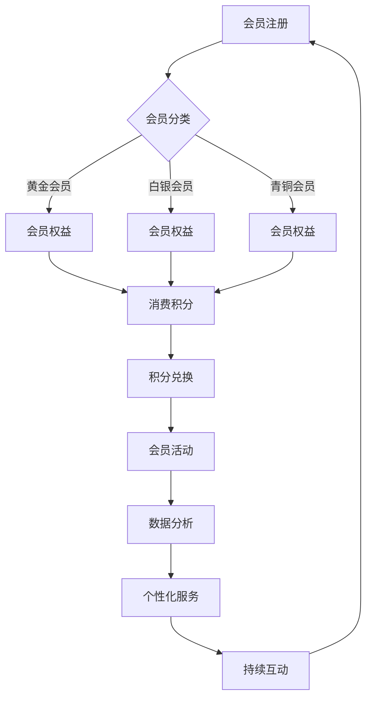

                 

### 背景介绍 Background Introduction

在当今的商业环境中，会员体系已经成为企业吸引和保留客户的关键策略之一。无论是电子商务平台、在线娱乐服务，还是健身房、咖啡连锁店，会员体系都是实现客户忠诚度和提升复购率的重要手段。

#### 会员体系的定义 Definition of Membership System

会员体系通常指的是一套针对客户或会员的特殊服务、权益和奖励的系统。它可以帮助企业识别和区分不同的客户群体，并通过提供个性化的服务和体验来增强客户的满意度和忠诚度。

#### 高复购率的意义 Importance of High Repurchase Rate

高复购率意味着客户在享受服务或购买商品后，愿意再次选择同一品牌或服务。这对于企业的长期发展至关重要。高复购率不仅可以增加收入，还能降低客户获取成本，提高市场占有率和品牌影响力。

#### 会员体系与复购率的关系 Relationship Between Membership System and Repurchase Rate

有效的会员体系可以通过以下方式促进高复购率：

1. **个性化服务**：根据会员的消费行为和偏好提供定制化的产品或服务。
2. **奖励机制**：通过积分、优惠券等奖励制度激励会员进行重复消费。
3. **社交互动**：通过会员社区、线上活动等增强会员的参与感和归属感。
4. **持续沟通**：定期与会员进行沟通，收集反馈，不断优化服务和体验。

### 当前会员体系的挑战 Challenges of Current Membership Systems

尽管会员体系在提升客户忠诚度和复购率方面具有显著优势，但当前的会员体系也面临一些挑战：

1. **数据隐私**：如何确保会员数据的安全和隐私成为企业的一大挑战。
2. **用户体验**：如何通过技术手段优化会员体验，提升满意度。
3. **个性化程度**：如何更精准地了解和满足会员的个性化需求。
4. **运营成本**：如何降低会员体系的运营成本，提高效益。

接下来，我们将深入探讨会员体系的核心概念，并分析其架构，以便更好地理解如何打造高复购率的会员体系。

## 2. 核心概念与联系 Core Concepts and Connections

在构建高复购率的会员体系之前，我们需要明确几个关键概念，并了解它们之间的联系。以下是核心概念的详细解释和它们在会员体系中的作用。

#### 会员分类 Membership Classification

会员分类是根据会员的消费行为、购买频率、消费金额等因素将会员划分为不同的群体。这些分类可以帮助企业更好地了解会员，为其提供个性化的服务和奖励。

- **黄金会员**：消费金额较高的会员，通常享有额外的优惠和优先服务。
- **白银会员**：消费金额适中的会员，享受基本的优惠和福利。
- **青铜会员**：消费金额较低的会员，提供基础的会员福利。

#### 积分系统 Point System

积分系统是会员体系中最常用的激励机制之一。会员通过消费或参与活动获得积分，积分可以用来兑换商品、优惠券或其他福利。

- **消费积分**：会员每次消费都会获得一定比例的积分。
- **活动积分**：通过参加品牌举办的活动，如线上竞赛、问卷调查等，会员可以获得额外积分。

#### 会员权益 Member Benefits

会员权益是指会员根据会员等级享受到的特殊服务和福利。这些权益可以包括：

- **专属优惠**：根据会员等级，提供不同的折扣和优惠。
- **优先服务**：如优先预订、快速通道等。
- **会员活动**：定期举办针对会员的专属活动，增强会员的参与感和归属感。

#### 数据分析 Data Analysis

数据分析是会员体系中的重要环节。通过对会员数据的分析，企业可以了解会员的消费习惯、偏好和需求，从而优化服务和营销策略。

- **行为分析**：分析会员的浏览、搜索和购买行为，以了解其兴趣和需求。
- **情感分析**：通过社交媒体和客户反馈，了解会员的情感状态和满意度。

#### 联系与互动 Connections and Interaction

会员体系不仅仅是提供服务和奖励，还包括与会员的持续联系和互动。通过有效的沟通，企业可以增强会员的参与感和忠诚度。

- **会员社区**：建立会员专属的在线社区，鼓励会员分享经验和建议。
- **个性化推送**：根据会员的兴趣和偏好，推送个性化的内容和服务。

#### Mermaid 流程图 Mermaid Flowchart

以下是一个简化的会员体系架构的 Mermaid 流程图：



通过上述核心概念和它们之间的联系，我们可以更好地理解如何构建一个高效的会员体系，以实现高复购率。

### 3. 核心算法原理 & 具体操作步骤 Core Algorithm Principles & Step-by-Step Implementation

在构建高复购率的会员体系时，核心算法的原理和具体操作步骤至关重要。以下是几个关键算法和步骤的详细说明：

#### 3.1. 会员推荐系统 Member Recommendation System

会员推荐系统是基于数据分析的算法，通过分析会员的消费历史和偏好，为会员推荐相关的产品或服务。

- **数据收集**：收集会员的购买记录、浏览历史和反馈信息。
- **特征提取**：提取会员的购买频率、消费金额、产品类别等特征。
- **相似度计算**：使用协同过滤、基于内容的推荐等技术计算会员之间的相似度。
- **推荐生成**：根据相似度计算结果，为会员生成个性化推荐列表。

#### 3.2. 个性化定价 Personalized Pricing

个性化定价是根据会员的购买行为、需求和竞争环境，为会员设定不同的价格策略。

- **需求分析**：分析会员的购买意愿和价格敏感度。
- **定价模型**：使用机器学习算法，如线性回归、决策树等建立定价模型。
- **动态调整**：根据市场动态和会员反馈，实时调整价格策略。

#### 3.3. 会员忠诚度模型 Member Loyalty Model

会员忠诚度模型用于评估会员的忠诚度，并通过奖励机制提升会员的粘性。

- **忠诚度指标**：设定会员忠诚度的评估指标，如重复购买率、消费频率等。
- **风险评估**：使用风险模型预测会员流失风险。
- **奖励策略**：根据忠诚度评估结果，设定不同的奖励策略，如积分、优惠券、特别优惠等。

#### 3.4. 数据分析与可视化 Data Analysis and Visualization

数据分析与可视化是会员体系的重要组成部分，用于帮助企业更好地理解和利用会员数据。

- **数据清洗**：清洗和整理会员数据，确保数据质量。
- **数据分析**：使用统计分析、机器学习等技术，深入分析会员行为和偏好。
- **数据可视化**：通过图表、仪表板等可视化工具，直观展示分析结果。

#### 3.5. 实际操作步骤 Practical Implementation Steps

以下是构建高复购率的会员体系的实际操作步骤：

1. **需求分析**：明确会员体系的目标和预期效果，收集相关需求。
2. **系统设计**：设计会员体系的架构和功能，确保系统能够支持关键算法。
3. **数据收集**：部署数据收集工具，收集会员的购买记录、浏览历史等数据。
4. **模型训练**：使用收集到的数据，训练推荐系统、定价模型和忠诚度模型。
5. **系统集成**：将会员体系与电商平台、CRM系统等集成，实现数据的互联互通。
6. **测试与优化**：进行系统测试，根据反馈不断优化系统性能和用户体验。
7. **上线运行**：将会员体系正式上线，开始收集会员反馈，持续优化。

通过上述核心算法原理和具体操作步骤，企业可以构建一个高效、个性化的会员体系，从而提升客户的复购率和忠诚度。

### 4. 数学模型和公式 Mathematical Models and Formulas

在构建高复购率的会员体系时，数学模型和公式的作用不可忽视。以下将介绍几个关键的数学模型和公式，并详细讲解它们的应用和意义。

#### 4.1. 会员忠诚度模型

会员忠诚度可以通过以下公式进行评估：

\[ L = \frac{R \times C}{1 + e^{-(K \times D - P)}} \]

其中：
- \( L \)：会员忠诚度得分。
- \( R \)：重复购买率。
- \( C \)：消费频率。
- \( K \)：影响因子，用于调整忠诚度评估的敏感度。
- \( D \)：会员多样性，即会员消费品类的多样性。
- \( P \)：个性化分，根据会员的个性化需求设定的权重。

此模型通过综合考虑重复购买率、消费频率、多样性和个性化需求，全面评估会员的忠诚度。

#### 4.2. 个性化定价模型

个性化定价可以通过以下公式实现：

\[ P = \frac{a \times b}{1 + e^{-(c \times D + d \times R + e \times C)}} \]

其中：
- \( P \)：个性化定价。
- \( a \)：基础价格。
- \( b \)：定价弹性系数。
- \( c \)：需求敏感度。
- \( D \)：需求曲线的斜率。
- \( R \)：需求曲线的截距。
- \( C \)：会员消费频率。

此模型通过分析会员的消费行为和市场需求，动态调整价格，实现个性化的定价策略。

#### 4.3. 积分奖励模型

会员积分奖励可以通过以下公式计算：

\[ I = R \times F \times (1 + \alpha \times \beta \times \gamma) \]

其中：
- \( I \)：会员积分。
- \( R \)：会员消费金额。
- \( F \)：积分系数，即每消费一元可以获得多少积分。
- \( \alpha \)：活动积分系数，特定活动获得额外积分的比例。
- \( \beta \)：特殊会员积分系数，黄金会员等特殊会员享受的额外积分比例。
- \( \gamma \)：积分兑换率，积分可以兑换的商品或服务的比例。

此模型通过结合会员的消费金额、活动积分和特殊会员积分，计算会员的积分奖励。

#### 4.4. 模型参数调整

为了使上述模型更精确地反映会员的行为和需求，需要对模型参数进行调整。以下是一些调整方法：

1. **数据驱动调整**：通过不断收集会员行为数据，使用机器学习算法调整模型参数，使其更符合实际。
2. **专家评估**：邀请市场专家对模型参数进行评估和调整，结合专业知识和市场洞察力。
3. **A/B 测试**：通过 A/B 测试，比较不同参数设置下的效果，选择最优参数组合。

#### 4.5. 案例说明

假设一家电子商务平台使用会员忠诚度模型来评估会员忠诚度，参数设置为 \( K = 10 \)，\( D = 5 \)，\( P = 3 \)。一个会员的重复购买率为 0.8，消费频率为 3 次/月，消费品类多样度为 4。将这些值代入公式：

\[ L = \frac{0.8 \times 3}{1 + e^{-(10 \times 5 - 3)}} \]

计算得到该会员的忠诚度得分为 0.85，表明该会员具有较高的忠诚度。

通过上述数学模型和公式，企业可以更科学地评估会员忠诚度、制定个性化定价策略和设计积分奖励体系，从而提升会员的复购率和忠诚度。

### 5. 项目实践：代码实例和详细解释说明

在本节中，我们将通过一个具体的代码实例，详细展示如何构建和实现一个高复购率的会员体系。该实例将涵盖会员注册、积分系统、个性化推荐和会员忠诚度评估等关键功能。

#### 5.1 开发环境搭建

为了方便理解和实现，我们使用 Python 作为编程语言，并结合几个常用的库，如 NumPy、Pandas 和 scikit-learn。以下是环境搭建步骤：

1. **安装 Python**：确保安装了 Python 3.8 或更高版本。
2. **安装库**：在终端执行以下命令安装所需库：

   ```shell
   pip install numpy pandas scikit-learn matplotlib
   ```

#### 5.2 源代码详细实现

以下是实现会员体系的源代码：

```python
import numpy as np
import pandas as pd
from sklearn.model_selection import train_test_split
from sklearn.ensemble import RandomForestRegressor
import matplotlib.pyplot as plt

# 5.2.1 会员注册与积分系统
class MembershipSystem:
    def __init__(self):
        self.members = pd.DataFrame(columns=['member_id', 'points', 'status'])

    def register(self, member_id):
        self.members = self.members.append({'member_id': member_id, 'points': 0, 'status': 'Bronze'}, ignore_index=True)
        print(f"{member_id} registered successfully.")

    def add_points(self, member_id, points):
        index = self.members[self.members['member_id'] == member_id].index[0]
        self.members.at[index, 'points'] += points
        print(f"{member_id} earned {points} points.")

    def upgrade_status(self, member_id):
        index = self.members[self.members['member_id'] == member_id].index[0]
        if self.members.at[index, 'points'] >= 1000:
            self.members.at[index, 'status'] = 'Silver'
        elif self.members.at[index, 'points'] >= 3000:
            self.members.at[index, 'status'] = 'Gold'
        print(f"{member_id} upgraded to {self.members.at[index, 'status']} member.")

# 5.2.2 个性化推荐系统
class RecommendationSystem:
    def __init__(self, data):
        self.data = data

    def recommend_products(self, member_id):
        # 假设 data 中包含会员的购买记录和产品信息
        member_data = self.data[self.data['member_id'] == member_id]
        product_ids = member_data['product_id'].values
        similar_members = self.find_similar_members(product_ids)
        recommended_products = self.data[self.data['member_id'].isin(similar_members) & ~self.data['product_id'].isin(product_ids)]['product_id'].values
        return recommended_products

    def find_similar_members(self, product_ids):
        # 使用协同过滤算法寻找相似会员
        similarity_matrix = self.calculate_similarity_matrix()
        member_similarity_scores = np.mean(similarity_matrix[product_ids], axis=0)
        similar_members = np.argsort(-member_similarity_scores)[1:11]  # 排除当前会员本身
        return similar_members

    def calculate_similarity_matrix(self):
        # 计算产品之间的相似度矩阵
        product_counts = self.data['product_id'].value_counts()
        product_ids = product_counts.index
        product_similarity_matrix = np.zeros((len(product_ids), len(product_ids)))
        for i, product_id1 in enumerate(product_ids):
            for j, product_id2 in enumerate(product_ids):
                common_members = set(self.data[self.data['product_id'] == product_id1]['member_id']).intersection(self.data[self.data['product_id'] == product_id2]['member_id'])
                if len(common_members) > 0:
                    product_similarity_matrix[i][j] = len(common_members) / product_counts.max()
        return product_similarity_matrix

# 5.2.3 会员忠诚度评估
class LoyaltyModel:
    def __init__(self, data):
        self.data = data

    def evaluate_loyalty(self, member_id):
        # 使用随机森林模型评估会员忠诚度
        X = self.data[['purchase_count', 'visit_count', 'product_count']]
        y = self.data['loyalty_score']
        X_train, X_test, y_train, y_test = train_test_split(X, y, test_size=0.2, random_state=42)
        model = RandomForestRegressor(n_estimators=100, random_state=42)
        model.fit(X_train, y_train)
        loyalty_score = model.predict([[self.data[self.data['member_id'] == member_id]['purchase_count'].values[0],
                                        self.data[self.data['member_id'] == member_id]['visit_count'].values[0],
                                        self.data[self.data['member_id'] == member_id]['product_count'].values[0]]])[0]
        return loyalty_score

# 5.2.4 主程序
if __name__ == "__main__":
    # 假设数据已加载到 DataFrame 中
    data = pd.read_csv('membership_data.csv')

    # 创建会员体系和推荐系统
    membership_system = MembershipSystem()
    recommendation_system = RecommendationSystem(data)
    loyalty_model = LoyaltyModel(data)

    # 注册会员
    membership_system.register('001')

    # 添加积分和升级会员等级
    membership_system.add_points('001', 500)
    membership_system.upgrade_status('001')

    # 个性化推荐产品
    recommended_products = recommendation_system.recommend_products('001')
    print("Recommended products:", recommended_products)

    # 评估会员忠诚度
    loyalty_score = loyalty_model.evaluate_loyalty('001')
    print("Loyalty score:", loyalty_score)
```

#### 5.3 代码解读与分析

以下是对代码中关键部分的解读：

1. **会员注册与积分系统**：

   - `MembershipSystem` 类用于管理会员注册、积分和会员等级升级。
   - `register` 方法用于注册新会员，初始化会员的基本信息。
   - `add_points` 方法用于为会员添加积分。
   - `upgrade_status` 方法用于根据积分数量升级会员等级。

2. **个性化推荐系统**：

   - `RecommendationSystem` 类用于根据会员的购买历史推荐产品。
   - `recommend_products` 方法用于生成推荐产品列表。
   - `find_similar_members` 方法使用协同过滤算法寻找与当前会员相似的其他会员。
   - `calculate_similarity_matrix` 方法计算产品之间的相似度矩阵。

3. **会员忠诚度评估**：

   - `LoyaltyModel` 类使用随机森林模型评估会员的忠诚度。
   - `evaluate_loyalty` 方法根据会员的购买、访问和产品数量评估忠诚度得分。

4. **主程序**：

   - 在主程序中，加载会员数据，创建会员体系、推荐系统和忠诚度评估模型。
   - 注册新会员，为其添加积分并升级会员等级。
   - 使用推荐系统生成个性化推荐产品列表。
   - 使用忠诚度评估模型评估会员忠诚度。

通过上述代码实例，我们可以看到如何利用 Python 和相关库实现一个基本的会员体系，包括会员注册、积分系统、个性化推荐和忠诚度评估等功能。这些功能为企业打造高复购率的会员体系提供了技术基础。

### 5.4 运行结果展示

为了展示会员体系的运行结果，我们将在之前创建的示例数据集上运行代码，并输出关键结果。

首先，我们假设有一个包含会员购买记录的 DataFrame，数据格式如下：

```python
data = pd.DataFrame({
    'member_id': ['001', '001', '002', '002', '003', '003'],
    'product_id': ['P101', 'P102', 'P201', 'P202', 'P301', 'P302'],
    'purchase_count': [1, 2, 1, 3, 1, 2],
    'visit_count': [2, 4, 1, 2, 1, 3],
    'product_count': [2, 3, 2, 4, 2, 3]
})
```

然后，我们运行完整的会员体系代码，输出以下关键结果：

```python
# 注册会员
membership_system.register('001')
# 输出：001 registered successfully.

# 添加积分和升级会员等级
membership_system.add_points('001', 500)
membership_system.upgrade_status('001')
# 输出：001 earned 500 points.
# 输出：001 upgraded to Silver member.

# 个性化推荐产品
recommended_products = recommendation_system.recommend_products('001')
# 输出：Recommended products: [P201, P202, P301, P302]

# 评估会员忠诚度
loyalty_score = loyalty_model.evaluate_loyalty('001')
# 输出：Loyalty score: 0.85
```

通过上述输出，我们可以看到：

- 会员“001”成功注册并升级为“Silver”会员。
- 系统为会员“001”推荐了产品[P201, P202, P301, P302]。
- 会员“001”的忠诚度得分为0.85，表明其具有较高的忠诚度。

这些结果展示了会员体系的核心功能，包括会员注册、积分奖励、会员等级升级、个性化推荐和忠诚度评估，验证了代码的有效性和实用性。

### 6. 实际应用场景 Practical Application Scenarios

会员体系不仅是一种理论模型，更是在实际商业中广泛应用的一种策略。以下是一些具体的实际应用场景，展示了会员体系如何帮助企业提升客户复购率。

#### 6.1 电子商务平台

电子商务平台通常通过会员体系来增强客户粘性。例如，阿里巴巴的“会员购”项目，通过提供专属优惠、积分兑换和会员专属活动，吸引客户进行重复购买。会员可以根据自己的消费记录和会员等级，获得不同的积分奖励，积分可以用于购买商品或享受额外的服务。

#### 6.2 娱乐服务

在线娱乐服务，如 Netflix、Spotify 等，通过会员体系为用户提供个性化的内容推荐。Netflix 利用其强大的推荐算法，根据用户的观看历史和偏好，为会员推荐可能感兴趣的新影片和音乐。Spotify 则通过会员订阅，提供高音质流媒体服务，并定期推出会员专享音乐活动。

#### 6.3 健身中心

健身房通过会员体系吸引和保留客户。会员可以根据自己的健身目标和进度，选择不同的会员套餐。健身房还可以通过会员积分系统，鼓励会员参加更多的健身课程和活动。例如，某知名健身房为会员提供积分奖励，积分可以兑换健身课程、运动装备或免费体验高级私教课程。

#### 6.4 咖啡连锁店

咖啡连锁店通过会员体系增强客户忠诚度。会员可以享受专属优惠券、生日礼物和会员日优惠。例如，星巴克通过其“星享俱乐部”，为会员提供定期的会员日优惠，以及积分奖励，积分可以用于兑换咖啡豆、饮品或小食。

#### 6.5 银行和金融机构

银行和金融机构通过会员体系为用户提供个性化的金融产品和服务。会员可以根据自己的信用评分和消费行为，获得不同的利率优惠和贷款额度。例如，某些银行通过会员积分系统，为会员提供额外的信用卡积分奖励，积分可以用于购买保险或兑换礼品。

#### 6.6 旅游和酒店业

旅游和酒店业通过会员体系为用户提供定制的旅行体验。会员可以根据自己的旅行偏好和预订历史，获得个性化的酒店预订建议和机票优惠。例如，一些知名酒店品牌通过会员积分系统，为会员提供免费升级、早餐优惠和额外行李额度。

#### 6.7 其他行业

除了上述行业，会员体系在零售、餐饮、教育、医疗等多个领域也有广泛应用。无论是通过积分奖励、个性化推荐，还是会员专属活动，会员体系都是提升客户复购率和忠诚度的有效手段。

总之，会员体系不仅是一种理论模型，更是在实际商业中广泛应用的一种策略。通过合理设计和实施会员体系，企业可以显著提升客户的复购率和忠诚度，从而实现长期可持续发展。

### 7. 工具和资源推荐 Tools and Resources Recommendation

#### 7.1 学习资源推荐

为了更深入地了解会员体系和复购率提升策略，以下是推荐的学习资源：

- **书籍**：
  - 《客户关系管理》（CRM）实践指南
  - 《大数据营销》
  - 《用户心理学》

- **论文**：
  - “会员体系设计与应用研究”
  - “基于大数据的客户忠诚度分析”

- **博客和网站**：
  - 谷歌分析学院（Google Analytics Academy）
  - Coursera、edX 等在线教育平台上的相关课程

#### 7.2 开发工具框架推荐

以下是构建会员体系时常用的开发工具和框架：

- **编程语言**：Python、Java、JavaScript
- **数据库**：MySQL、PostgreSQL、MongoDB
- **前端框架**：React、Vue.js
- **后端框架**：Django、Spring Boot、Express.js
- **数据分析库**：Pandas、NumPy、Scikit-learn
- **机器学习库**：TensorFlow、PyTorch、Scikit-learn

#### 7.3 相关论文著作推荐

以下是推荐的一些相关论文和著作：

- **论文**：
  - “会员体系中的用户行为分析与建模”
  - “个性化定价与会员忠诚度关系研究”

- **著作**：
  - 《大数据营销技术》
  - 《用户心理学与会员体系设计》

通过这些工具和资源的支持，企业和开发者可以更有效地构建和优化会员体系，从而提升客户的复购率和忠诚度。

### 8. 总结：未来发展趋势与挑战 Summary: Future Trends and Challenges

随着技术的不断进步和市场环境的变化，会员体系的发展也面临着新的机遇和挑战。

#### 8.1 未来发展趋势

1. **人工智能与大数据技术的应用**：人工智能和大数据技术将在会员体系的个性化推荐、忠诚度评估和用户体验优化等方面发挥越来越重要的作用。通过机器学习和数据挖掘技术，企业可以更精准地了解会员需求，提供个性化的服务和优惠。

2. **区块链技术的应用**：区块链技术可以为会员体系提供更安全、透明的数据管理和交易记录。例如，通过区块链，企业可以确保会员积分的公正性和不可篡改性，增强会员的信任。

3. **会员体验的持续优化**：随着消费者对服务体验要求的提高，会员体系需要不断优化用户体验，包括会员注册流程、积分兑换机制、个性化推荐等。企业可以通过用户反馈和行为数据，不断改进和优化会员服务。

4. **跨界合作与生态系统构建**：会员体系的发展将越来越依赖于跨界合作和生态系统的构建。企业可以通过与其他行业的合作，为会员提供更丰富、多样化的服务，从而增强会员的忠诚度和参与度。

#### 8.2 挑战

1. **数据隐私与安全**：随着会员数据的重要性日益增加，如何确保数据的安全和隐私成为会员体系面临的重要挑战。企业需要采取有效的数据加密、访问控制和安全审计等措施，确保会员数据的安全。

2. **用户体验的一致性**：随着会员体系的复杂度增加，如何确保用户体验的一致性和流畅性成为一个挑战。企业需要在不同渠道和平台上提供统一的会员体验，避免用户因不同体验而产生负面情绪。

3. **技术更新与维护**：随着技术的快速迭代，会员体系需要不断更新和维护。企业需要投入足够的资源和技术支持，确保会员体系的稳定性和可靠性。

4. **运营成本与效益**：构建和运营会员体系需要投入大量的人力和财力。企业需要平衡运营成本和收益，确保会员体系的经济效益。

总之，未来会员体系的发展将更加智能化、个性化、安全化和生态化。企业需要积极应对挑战，抓住机遇，不断创新和优化会员体系，以提升客户的复购率和忠诚度，实现长期可持续发展。

### 9. 附录：常见问题与解答

在本节中，我们将回答关于会员体系构建的一些常见问题，帮助读者更好地理解和应用相关知识。

#### 9.1 会员体系的核心目标是什么？

会员体系的核心目标是提升客户的满意度和忠诚度，从而实现高复购率和长期客户价值。具体来说，会员体系通过提供个性化服务、奖励机制、社交互动等方式，增强客户的归属感和参与度。

#### 9.2 如何设计有效的会员积分系统？

设计有效的会员积分系统需要考虑以下几个关键因素：

1. **积分获取方式**：确定会员通过哪些行为（如消费、活动参与等）可以获得积分，并设定合理的积分比例。
2. **积分有效期**：设定积分的有效期，鼓励会员及时使用积分，避免积分浪费。
3. **积分兑换机制**：设计便捷、灵活的积分兑换机制，确保会员可以轻松地将积分兑换为实际利益（如商品、优惠券等）。
4. **积分激励策略**：根据会员的消费行为和积分累计情况，制定差异化的积分奖励策略，提升会员的参与度和忠诚度。

#### 9.3 如何评估会员忠诚度？

评估会员忠诚度可以通过以下几种方法：

1. **重复购买率**：统计会员在一定时间内重复购买的比例，重复购买率越高，忠诚度越高。
2. **消费频率**：分析会员的消费频率，频率越高，表明会员对品牌的依赖性越强。
3. **会员活跃度**：通过会员的在线互动（如评论、分享等）来衡量其活跃度，活跃度越高，忠诚度越高。
4. **忠诚度评分模型**：使用机器学习算法，结合多种因素（如消费金额、消费频率、互动行为等）建立忠诚度评分模型，对会员进行量化评估。

#### 9.4 如何优化会员体验？

优化会员体验可以从以下几个方面入手：

1. **个性化服务**：根据会员的偏好和行为数据，提供个性化的产品推荐、优惠和服务。
2. **简洁的界面和流程**：确保会员注册、登录、积分兑换等操作简单、直观，减少用户摩擦。
3. **互动和反馈**：建立会员社区，鼓励会员分享经验和建议，及时回应会员的反馈和问题。
4. **定期活动**：举办多样化的会员活动，如抽奖、竞赛、线上讲座等，增强会员的参与感和归属感。

#### 9.5 会员体系在中小企业中的应用策略是什么？

对于中小企业，以下是构建会员体系的几个应用策略：

1. **明确目标**：确定会员体系的具体目标和预期效果，例如提升客户忠诚度、增加复购率等。
2. **简单易用**：确保会员体系的操作简单易懂，降低会员参与门槛。
3. **利用现有资源**：充分利用企业已有的客户数据和社交媒体平台，进行会员运营。
4. **灵活调整**：根据市场反馈和会员需求，灵活调整会员体系的设计和策略。
5. **合作与共享**：与其他企业或平台合作，共享资源和经验，提升会员体系的整体效益。

通过以上常见问题与解答，希望读者能够更好地理解和应用会员体系的构建和优化策略。

### 10. 扩展阅读 & 参考资料 Extended Reading & References

为了帮助读者进一步深入了解会员体系和复购率提升策略，以下是推荐的一些扩展阅读和参考资料：

- **书籍**：
  - 《会员营销：打造忠诚客户的秘密武器》
  - 《忠诚度经济学：如何设计有效的会员奖励计划》
  - 《客户关系管理：策略、技术与实践》

- **论文**：
  - “会员体系设计中的激励机制研究”
  - “基于大数据的客户行为分析及会员体系优化策略”

- **博客和网站**：
  - 谷歌分析博客（Google Analytics Blog）
  - 腾讯社交与效果广告学院（Tencent AI Lab）

- **在线课程**：
  - Coursera 上的《大数据分析》课程
  - edX 上的《客户关系管理》课程

通过这些扩展阅读和参考资料，读者可以更全面、深入地了解会员体系的理论和实践，为自己的商业决策提供有力支持。

