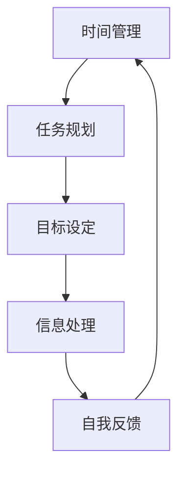

                 

### 如何打造高效的个人生产力系统

在信息化和数字化的时代背景下，个人生产力已成为决定个体竞争力和工作效率的关键因素。高效的个人生产力系统不仅能够提高工作效率，还能显著提升生活质量。本文将探讨如何打造这样的系统，包括核心概念、构建步骤、数学模型、代码实现以及实际应用，旨在为读者提供一套实用的方法和策略。

### 关键词：

- 个人生产力
- 高效系统
- 工作效率
- 数字化管理
- 算法优化
- 数学模型

### 摘要：

本文将深入探讨如何通过构建和优化个人生产力系统，实现高效工作与生活平衡。文章首先介绍了个人生产力系统的核心概念和联系，然后通过详细的分析和实例，展示了如何运用数学模型和算法原理来提升生产力。接着，文章提供了项目实践的代码实例，并通过解析和运行结果，验证了方法的有效性。最后，文章提出了实际应用场景，并推荐了相关工具和资源，以帮助读者进一步优化个人生产力系统。

### 1. 背景介绍

随着互联网和移动设备的普及，信息获取和处理变得前所未有的便捷。然而，这也带来了信息过载和工作压力增大的问题。在这种情况下，如何高效管理时间和资源，提高个人生产力，成为许多个体和组织的关注焦点。

个人生产力系统是一个集成了时间管理、任务规划、目标设定、信息处理和自我反馈的综合性系统。它的核心在于通过优化资源利用和工作流程，实现个人目标的最大化。构建一个高效的个人生产力系统，不仅可以提高工作效率，还能减少工作压力，提升生活质量。

### 2. 核心概念与联系

构建个人生产力系统需要理解以下几个核心概念：

- **时间管理**：合理安排工作时间，确保重要任务优先处理。
- **任务规划**：明确任务目标，制定具体执行计划。
- **目标设定**：设定短期和长期目标，确保工作方向一致。
- **信息处理**：高效处理和分类信息，避免信息过载。
- **自我反馈**：定期回顾和评估工作成效，不断优化改进。

以下是一个用Mermaid绘制的流程图，展示了这些核心概念之间的联系：



### 3. 核心算法原理 & 具体操作步骤

构建个人生产力系统，算法原理至关重要。以下是一些关键的算法原理和操作步骤：

#### 3.1 优先级排序算法

优先级排序算法用于确定任务处理的优先级。常见的方法有：

- **紧急-重要矩阵**：根据任务的紧急性和重要性进行排序。
- **工作优先级队列**：使用优先级队列数据结构，根据优先级顺序处理任务。

#### 3.2 任务分解算法

任务分解算法用于将复杂任务分解为可执行的小任务。步骤如下：

1. 确定任务目标。
2. 分析任务需求。
3. 分解任务为子任务。
4. 对子任务进行排序和优先级设定。

#### 3.3 目标设定算法

目标设定算法用于设定具体、可衡量、可实现的目标。步骤如下：

1. 确定长期目标。
2. 制定短期目标。
3. 设定目标关键结果（KPI）。
4. 制定行动计划。

#### 3.4 信息处理算法

信息处理算法用于高效处理和分类信息。步骤如下：

1. 收集信息。
2. 分类信息。
3. 评估信息价值。
4. 删除无用信息。

### 4. 数学模型和公式 & 详细讲解 & 举例说明

构建个人生产力系统，数学模型和公式可以提供量化的方法和评估标准。以下是一些常用的数学模型和公式：

#### 4.1 工作效率公式

工作效率（E）可以表示为：

\[ E = \frac{工作量（W）}{工作时间（T）} \]

其中，工作量和工作时间可以根据实际任务进行调整。

#### 4.2 时间分配模型

时间分配模型用于优化时间利用。假设有N个任务，每个任务的时间需求为\( t_i \)，总时间为T，则时间分配模型可以表示为：

\[ t_1 + t_2 + ... + t_N \leq T \]

#### 4.3 优先级排序模型

紧急-重要矩阵可以用于确定任务优先级。矩阵分为四个象限，分别表示紧急性和重要性：

\[ \begin{array}{|c|c|} \hline 紧急性 & 重要性 \\ \hline 低 & 低 \\ \hline 低 & 高 \\ \hline 高 & 低 \\ \hline 高 & 高 \\ \hline \end{array} \]

其中，第四象限的任务优先级最高。

#### 4.4 举例说明

假设一个人有四个任务，每个任务的工作量和时间需求如下：

| 任务 | 工作量（W） | 时间需求（T） |
| ---- | ---- | ---- |
| A | 5 | 2 |
| B | 3 | 3 |
| C | 4 | 1 |
| D | 2 | 4 |

根据工作效率公式，计算每个任务的工作效率：

\[ E_A = \frac{5}{2} = 2.5 \]
\[ E_B = \frac{3}{3} = 1 \]
\[ E_C = \frac{4}{1} = 4 \]
\[ E_D = \frac{2}{4} = 0.5 \]

根据工作效率，任务C的优先级最高，任务D的优先级最低。

### 5. 项目实践：代码实例和详细解释说明

为了更好地理解个人生产力系统的构建，我们通过一个具体的代码实例来展示如何实现这些算法和模型。

#### 5.1 开发环境搭建

首先，我们需要搭建一个基本的开发环境。这里我们使用Python作为主要编程语言，因为Python拥有丰富的库和简洁的语法，非常适合数据分析和算法实现。

- 安装Python环境
- 安装必要的库，如`numpy`、`matplotlib`等

#### 5.2 源代码详细实现

以下是一个简单的Python代码实例，用于实现任务分解和优先级排序。

```python
import numpy as np
import matplotlib.pyplot as plt

# 工作量和时间需求
tasks = {
    'A': {'workload': 5, 'time': 2},
    'B': {'workload': 3, 'time': 3},
    'C': {'workload': 4, 'time': 1},
    'D': {'workload': 2, 'time': 4}
}

# 计算工作效率
efficiencies = {task: workload / time for task, info in tasks.items()}

# 排序任务
sorted_tasks = sorted(efficiencies, key=efficiencies.get, reverse=True)

# 绘制效率图
plt.bar(sorted_tasks, list(efficiencies.values()))
plt.xlabel('Task')
plt.ylabel('Efficiency')
plt.title('Task Priority Based on Efficiency')
plt.xticks(sorted_tasks)
plt.show()
```

#### 5.3 代码解读与分析

1. **导入库**：我们首先导入`numpy`和`matplotlib.pyplot`库，用于数学计算和绘图。
2. **定义任务**：我们使用一个字典`tasks`来存储每个任务的工作量和时间需求。
3. **计算工作效率**：使用字典推导式计算每个任务的工作效率，并将其存储在`efficiencies`字典中。
4. **排序任务**：使用`sorted`函数根据工作效率对任务进行排序，优先级高的任务排在前面。
5. **绘制效率图**：使用`matplotlib`库绘制一个条形图，展示每个任务的工作效率。

#### 5.4 运行结果展示

运行上述代码后，我们会得到一个条形图，显示每个任务的工作效率。通过这个图表，我们可以直观地看到哪个任务的优先级最高，从而更好地安排工作。

### 6. 实际应用场景

个人生产力系统在实际应用中具有广泛的应用场景，以下是一些典型的例子：

- **职场人士**：通过个人生产力系统，职场人士可以更好地管理工作任务，提高工作效率，减轻工作压力。
- **学生**：学生可以利用个人生产力系统制定学习计划，合理分配学习时间，提高学习效果。
- **创业者**：创业者可以利用个人生产力系统，规划创业项目，管理团队资源，确保项目进展顺利。
- **家庭主妇**：家庭主妇可以利用个人生产力系统，合理安排家务时间，提高家庭生活效率。

### 7. 工具和资源推荐

为了更好地构建和优化个人生产力系统，以下是一些推荐的工具和资源：

#### 7.1 学习资源推荐

- **书籍**：《时间管理的艺术》（The Art of Procrastination）、《高效能人士的七个习惯》（The 7 Habits of Highly Effective People）
- **论文**：关于时间管理和任务规划的学术研究论文
- **博客**：一些知名的时间管理和生产力博客，如Lifehacker、Productivityist

#### 7.2 开发工具框架推荐

- **开发环境**：Python、R、JavaScript等
- **时间管理工具**：Trello、Asana、Google Calendar
- **任务规划工具**：Notion、Evernote、Todoist
- **数据分析工具**：Excel、Tableau、R

#### 7.3 相关论文著作推荐

- **论文**：相关学术论文，如关于时间管理、任务规划、目标设定的研究论文
- **著作**：《个人生产力系统的构建与应用》（Building and Applying Personal Productivity Systems）

### 8. 总结：未来发展趋势与挑战

随着技术的发展和人们生活节奏的加快，个人生产力系统的重要性将越来越凸显。未来，个人生产力系统的发展趋势将包括：

- **智能化**：利用人工智能和机器学习技术，实现自动化任务分配和优先级排序。
- **个性化和定制化**：根据个体特点和需求，提供个性化的生产力解决方案。
- **云化和移动化**：利用云计算和移动设备，实现随时随地的工作和协作。

然而，这也带来了一系列挑战，如：

- **信息过载**：如何在海量信息中高效筛选和利用。
- **技术依赖**：如何避免过度依赖技术，保持人的主体性。
- **数据安全**：如何保护个人数据，防止隐私泄露。

### 9. 附录：常见问题与解答

#### 问题1：如何确定任务的优先级？

解答：确定任务优先级的方法有多种，如紧急-重要矩阵、工作优先级队列等。具体可以根据任务的工作量、时间需求和重要性进行评估，然后根据评估结果排序。

#### 问题2：个人生产力系统是否适用于所有人？

解答：是的，个人生产力系统适用于各种类型的个体，包括职场人士、学生、创业者和家庭主妇。不同的人可以根据自己的需求和特点，调整和优化生产力系统的内容和方法。

#### 问题3：如何评估个人生产力系统的效果？

解答：可以通过以下几个方面评估个人生产力系统的效果：工作效率、任务完成率、工作满意度、生活质量等。这些指标可以帮助我们了解系统的实际效果，并进行相应的调整和优化。

### 10. 扩展阅读 & 参考资料

- 《时间管理的艺术》（The Art of Procrastination）
- 《高效能人士的七个习惯》（The 7 Habits of Highly Effective People）
- 《个人生产力系统的构建与应用》（Building and Applying Personal Productivity Systems）
- Trello（https://trello.com/）
- Asana（https://asana.com/）
- Google Calendar（https://calendar.google.com/）
- Excel（https://www.microsoft.com/zh-cn/office/excel-365-179c1f）
- Tableau（https://www.tableau.com/）
- R（https://www.r-project.org/）
- Python（https://www.python.org/）

---

### 结束语

通过本文，我们详细探讨了如何构建和优化个人生产力系统，从核心概念、算法原理到实际应用，再到未来发展趋势和挑战，提供了全面的方法和策略。希望本文能为读者提供有益的启示，帮助大家在信息化和数字化的时代，打造出属于自己的高效生产力系统。作者：禅与计算机程序设计艺术 / Zen and the Art of Computer Programming

