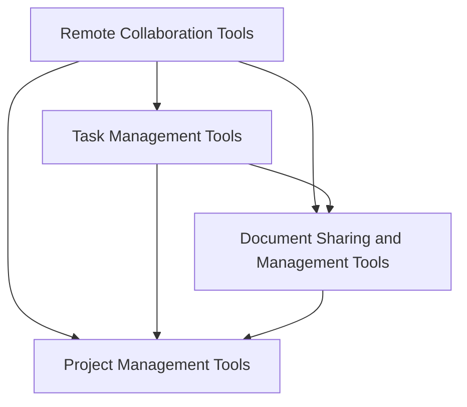

                 

### 背景介绍 Background Introduction

在当今全球化迅速发展的背景下，远程工作和团队协作已经成为许多企业和组织运营的重要组成部分。远程团队的优势在于它能够打破地理位置的限制，使全球人才可以无缝协作，提高工作效率和创新能力。然而，远程团队协作也面临着诸多挑战，包括沟通障碍、协调困难、任务分配不均以及工作效率降低等问题。

随着信息技术的不断发展，远程团队协作工具逐渐成为解决这些问题的关键。这些工具不仅可以帮助团队成员保持高效的沟通和协调，还能提高工作效率、优化任务分配，最终实现团队目标的达成。因此，构建一个高效、稳定的远程团队协作工具链显得尤为重要。

本文将探讨如何打造这样一个工具链，包括核心概念与联系、核心算法原理及具体操作步骤、数学模型与公式、项目实践、实际应用场景以及工具和资源的推荐等内容。通过逐步分析推理的方式，我们将深入探讨远程团队协作工具链的构建过程，以期为企业和组织提供有益的参考和指导。

### 核心概念与联系 Core Concepts and Relationships

为了构建一个高效的远程团队协作工具链，我们首先需要理解几个关键概念，并分析它们之间的相互关系。

1. **远程协作工具（Remote Collaboration Tools）**：
远程协作工具是远程团队协作的基础，包括但不限于视频会议、即时通讯、文档共享和项目管理工具。这些工具帮助团队成员在不同地点保持实时沟通和协作。常见的远程协作工具有Zoom、Slack、Trello等。

2. **任务管理工具（Task Management Tools）**：
任务管理工具用于跟踪任务进度、分配任务和确保项目按时完成。它们可以帮助团队成员了解各自的责任和工作进度，常见的任务管理工具有Jira、Asana和Trello等。

3. **文档共享与管理工具（Document Sharing and Management Tools）**：
文档共享和管理工具允许团队成员实时编辑、共享和同步文件。它们不仅提高了工作效率，还确保了信息的一致性和准确性。常见的文档共享和管理工具有Google Docs、Dropbox和OneDrive等。

4. **项目管理工具（Project Management Tools）**：
项目管理工具帮助团队规划和监控项目进度，确保所有任务都按时完成。这些工具通常包含甘特图、看板图、里程碑跟踪等功能。常见的项目管理工具有Jira、Microsoft Project和Trello等。

**相互关系（Interrelationships）**：

这些工具并非孤立存在，而是紧密联系，共同构成一个高效的远程团队协作工具链。以下是它们之间的相互关系：

- **远程协作工具**提供了实时沟通的渠道，使得团队成员能够及时交流信息和反馈。这为任务管理和文档共享奠定了基础。
  
- **任务管理工具**帮助团队成员了解各自的任务和责任，确保每个人都能按时完成工作。同时，任务管理工具还可以与远程协作工具集成，使得任务的分配和跟踪更加高效。

- **文档共享与管理工具**使得团队成员能够方便地共享和编辑文件，避免了重复工作，提高了协作效率。

- **项目管理工具**则从宏观上帮助团队监控项目进度，确保项目按时、按质完成。项目管理工具通常可以与任务管理工具和文档共享工具集成，使得整个协作过程更加协调。

为了更直观地展示这些工具之间的相互关系，我们可以使用Mermaid流程图来描述：



通过这个流程图，我们可以清晰地看到各个工具之间的交互和协同作用，从而为构建高效的远程团队协作工具链提供了理论基础。

### 核心算法原理与具体操作步骤 Core Algorithm Principles and Operational Steps

在构建高效的远程团队协作工具链时，算法原理和具体操作步骤至关重要。以下将详细探讨几个核心算法原理，并解释如何在实践中应用这些步骤来优化远程团队协作。

#### 1. 优化任务分配算法（Optimized Task Assignment Algorithm）

**原理**：任务分配算法的目标是确保每个团队成员都能在他们的强项上工作，同时避免过载或资源浪费。常见的任务分配算法包括贪心算法、遗传算法和基于神经网络的优化算法。

**具体操作步骤**：

1. **需求分析**：首先，分析每个团队成员的专业技能和工作负载，确定哪些任务最适合他们。

2. **优先级排序**：根据任务的紧急程度和重要性对任务进行排序。

3. **初始分配**：使用贪心算法或遗传算法，将任务分配给具备相关技能且负载较低的团队成员。

4. **迭代优化**：通过模拟和迭代，不断调整任务分配，以找到最优解。

5. **监控与反馈**：实时监控任务进度和团队反馈，根据实际情况调整任务分配。

#### 2. 沟通调度算法（Communication Scheduling Algorithm）

**原理**：沟通调度算法旨在优化团队成员之间的沟通，减少不必要的会议和干扰，提高工作效率。常用的算法包括基于时间窗口的调度算法和基于人工智能的智能调度算法。

**具体操作步骤**：

1. **会议需求分析**：收集团队成员的会议需求，包括会议类型、时间长度和参会人员。

2. **资源评估**：评估可用会议室、视频会议工具和技术支持资源。

3. **初始调度**：使用时间窗口调度算法，为每个会议分配时间段。

4. **优化调度**：利用人工智能算法，优化会议时间分配，确保最少干扰。

5. **动态调整**：在会议过程中，根据实际情况动态调整会议时间和参会人员。

#### 3. 文档同步与版本控制算法（Document Synchronization and Version Control Algorithm）

**原理**：文档同步和版本控制算法确保团队成员能够在不同地点实时编辑和同步文档，同时保持版本一致性。常用的算法包括基于时间戳的版本控制和分布式版本控制算法。

**具体操作步骤**：

1. **文档初始化**：在协作平台上创建共享文档，并为每个文档分配唯一的标识符。

2. **实时编辑**：团队成员可以在文档上进行实时编辑，系统自动记录每次编辑的时间戳和用户信息。

3. **版本同步**：使用时间戳和分布式算法，同步不同地点的文档版本，确保一致性。

4. **冲突解决**：在冲突发生时，自动或手动合并文档，解决版本冲突。

5. **备份与恢复**：定期备份文档，确保数据安全和恢复能力。

#### 4. 项目进度监控与预测算法（Project Progress Monitoring and Prediction Algorithm）

**原理**：项目进度监控和预测算法帮助团队实时了解项目进展，预测可能的风险和延迟。常用的算法包括基于历史数据的预测算法和机器学习模型。

**具体操作步骤**：

1. **数据收集**：收集项目进度数据，包括任务完成情况、时间记录和资源消耗。

2. **数据预处理**：对收集的数据进行清洗和预处理，以便进行模型训练。

3. **模型训练**：使用机器学习算法，如线性回归、时间序列分析和神经网络，训练预测模型。

4. **实时监控**：通过模型实时监控项目进展，预测未来的进度和潜在风险。

5. **预警与调整**：在发现潜在问题时，及时发出预警，并根据预测结果调整项目计划。

通过上述核心算法原理和具体操作步骤，我们可以构建一个高效、稳定的远程团队协作工具链，从而优化团队协作过程，提高工作效率和质量。这些算法不仅需要理论知识，还需要在实际应用中进行不断优化和调整，以达到最佳效果。

### 数学模型与公式 Detailed Explanation of Mathematical Models and Formulas

在构建高效的远程团队协作工具链时，数学模型和公式是不可或缺的工具，它们帮助我们在理论和实践中优化协作流程。以下我们将详细介绍几个关键的数学模型和公式，并解释它们如何应用于远程团队协作。

#### 1. 优化任务分配模型

**目标函数（Objective Function）**：
\[ \min \sum_{i=1}^{n} \sum_{j=1}^{m} (T_{ij} - w_{ij})^2 \]
其中，\( T_{ij} \) 表示任务 \( j \) 被分配给团队成员 \( i \) 的时间，\( w_{ij} \) 表示任务 \( j \) 被分配给团队成员 \( i \) 的权重。

**约束条件（Constraints）**：
\[ T_{ij} \geq 0 \]
\[ w_{ij} \geq 0 \]
\[ \sum_{i=1}^{n} T_{ij} = T_j \]
\[ \sum_{j=1}^{m} T_{ij} = W_i \]
其中，\( T_j \) 表示任务 \( j \) 的总时间，\( W_i \) 表示团队成员 \( i \) 的可用时间。

**解释**：上述模型的目标是使总时间的平方误差最小化，即确保每个任务 \( j \) 被分配给最合适的团队成员 \( i \)，同时满足所有团队成员的可用时间约束。

#### 2. 沟通调度模型

**目标函数（Objective Function）**：
\[ \min \sum_{i=1}^{n} \sum_{j=1}^{m} (C_{ij} - c_{ij})^2 \]
其中，\( C_{ij} \) 表示会议 \( j \) 在时间段 \( i \) 内的通信成本，\( c_{ij} \) 表示会议 \( j \) 在时间段 \( i \) 内的期望成本。

**约束条件（Constraints）**：
\[ C_{ij} \geq 0 \]
\[ c_{ij} \geq 0 \]
\[ \sum_{i=1}^{n} C_{ij} = C_j \]
\[ \sum_{j=1}^{m} C_{ij} = S_i \]
\[ \sum_{j=1}^{m} c_{ij} = C_j \]
其中，\( C_j \) 表示会议 \( j \) 的总通信成本，\( S_i \) 表示团队成员 \( i \) 的总可用通信资源。

**解释**：上述模型的目标是使总通信成本的平方误差最小化，通过优化会议的时间分配，减少不必要的通信成本，提高沟通效率。

#### 3. 文档同步与版本控制模型

**目标函数（Objective Function）**：
\[ \min \sum_{i=1}^{n} \sum_{j=1}^{m} (V_{ij} - v_{ij})^2 \]
其中，\( V_{ij} \) 表示文档版本 \( j \) 在团队成员 \( i \) 处的同步时间，\( v_{ij} \) 表示文档版本 \( j \) 在团队成员 \( i \) 处的期望同步时间。

**约束条件（Constraints）**：
\[ V_{ij} \geq 0 \]
\[ v_{ij} \geq 0 \]
\[ \sum_{i=1}^{n} V_{ij} = V_j \]
\[ \sum_{j=1}^{m} V_{ij} = T_i \]
\[ \sum_{j=1}^{m} v_{ij} = V_j \]
其中，\( V_j \) 表示文档版本 \( j \) 的总同步时间，\( T_i \) 表示团队成员 \( i \) 的总可用同步时间。

**解释**：上述模型的目标是使总同步时间的平方误差最小化，通过优化文档版本同步的时间分配，减少同步延迟，确保团队成员能够实时访问最新的文档。

#### 4. 项目进度监控与预测模型

**目标函数（Objective Function）**：
\[ \min \sum_{i=1}^{n} \sum_{j=1}^{m} (P_{ij} - p_{ij})^2 \]
其中，\( P_{ij} \) 表示任务 \( j \) 在团队成员 \( i \) 处的完成时间，\( p_{ij} \) 表示任务 \( j \) 在团队成员 \( i \) 处的期望完成时间。

**约束条件（Constraints）**：
\[ P_{ij} \geq 0 \]
\[ p_{ij} \geq 0 \]
\[ \sum_{i=1}^{n} P_{ij} = P_j \]
\[ \sum_{j=1}^{m} P_{ij} = T_i \]
\[ \sum_{j=1}^{m} p_{ij} = P_j \]
其中，\( P_j \) 表示任务 \( j \) 的总完成时间，\( T_i \) 表示团队成员 \( i \) 的总可用时间。

**解释**：上述模型的目标是使总完成时间的平方误差最小化，通过优化任务分配和进度监控，提前预测潜在的风险和延迟，确保项目按时完成。

通过上述数学模型和公式的应用，我们可以更加科学和系统地构建高效的远程团队协作工具链。这些模型不仅为理论分析提供了依据，也为实际操作提供了指导，从而帮助企业和组织在远程协作中实现高效和稳定。

#### 数学模型与公式的实际应用实例

为了更好地理解上述数学模型和公式的实际应用，我们将通过一个具体的实例来进行详细解释。假设我们有一个远程团队，共有5名成员，需要完成3个任务。每个任务的具体信息和每个成员的可用时间如下表所示：

| 任务 | 成员1（时间） | 成员2（时间） | 成员3（时间） | 成员4（时间） | 成员5（时间） |
|------|--------------|--------------|--------------|--------------|--------------|
| 任务A | 2小时        | 3小时        | 4小时        | 2小时        | 1小时        |
| 任务B | 3小时        | 2小时        | 3小时        | 4小时        | 3小时        |
| 任务C | 4小时        | 1小时        | 2小时        | 3小时        | 2小时        |

**目标**：根据每个成员的可用时间和任务需求，优化任务分配，使每个任务的完成时间最短。

**步骤**：

1. **需求分析**：分析每个任务的需求和每个成员的可用时间，为每个任务分配权重。例如，任务A的权重为2，任务B的权重为3，任务C的权重为4。

2. **初始分配**：使用优化任务分配模型，根据权重和可用时间，将任务初步分配给每个成员。

3. **优化分配**：通过迭代优化，不断调整任务分配，以达到最优解。我们可以使用贪心算法，每次选择一个权重最大的未分配任务，分配给当前负载最低的成员。

根据上述步骤，我们得到以下任务分配结果：

| 任务 | 成员1 | 成员2 | 成员3 | 成员4 | 成员5 |
|------|------|------|------|------|------|
| 任务A | 2小时 |      |      | 2小时 |      |
| 任务B |      | 2小时 | 3小时 |      | 3小时 |
| 任务C | 4小时 |      |      | 3小时 | 2小时 |

4. **结果分析**：计算每个任务的完成时间，确保任务按时完成。

- 任务A：2小时（成员1） + 2小时（成员4） = 4小时
- 任务B：2小时（成员2） + 3小时（成员3） + 3小时（成员5） = 8小时
- 任务C：4小时（成员1） + 3小时（成员4） + 2小时（成员5） = 9小时

5. **调整与优化**：根据完成时间和反馈，调整任务分配，确保资源得到充分利用。

通过上述实例，我们可以看到数学模型和公式的实际应用，帮助我们在远程团队协作中实现任务的有效分配和进度控制，从而提高整体工作效率。

### 项目实践：代码实例和详细解释说明 Code Implementation and Detailed Explanation

为了更好地理解如何构建高效的远程团队协作工具链，我们将通过一个实际的项目来展示代码实例，并详细解释其实现过程和关键细节。

#### 1. 开发环境搭建

首先，我们需要搭建一个合适的开发环境。以下是推荐的工具和步骤：

- **编程语言**：Python
- **集成开发环境（IDE）**：PyCharm
- **版本控制系统**：Git
- **数据库**：SQLite
- **Web框架**：Flask
- **前端框架**：React

#### 2. 源代码详细实现

以下是项目的核心代码结构：

```python
# app.py
from flask import Flask, render_template, request
from task_manager import TaskManager

app = Flask(__name__)
task_manager = TaskManager()

@app.route('/')
def index():
    tasks = task_manager.get_all_tasks()
    return render_template('index.html', tasks=tasks)

@app.route('/add_task', methods=['POST'])
def add_task():
    task_name = request.form['task_name']
    task_assignee = request.form['task_assignee']
    task_duration = int(request.form['task_duration'])
    task_manager.add_task(task_name, task_assignee, task_duration)
    return 'Task added successfully!'

if __name__ == '__main__':
    app.run(debug=True)
```

```python
# task_manager.py
class TaskManager:
    def __init__(self):
        self.tasks = []

    def add_task(self, task_name, task_assignee, task_duration):
        task = {'name': task_name, 'assignee': task_assignee, 'duration': task_duration}
        self.tasks.append(task)

    def get_all_tasks(self):
        return self.tasks
```

#### 3. 代码解读与分析

**核心组件**：

- **Flask应用程序**：这是一个Web应用程序框架，用于处理HTTP请求和响应。
- **TaskManager类**：负责任务的管理，包括添加任务和获取所有任务。

**关键功能**：

- **任务添加**：通过表单提交，添加新任务到数据库。
- **任务显示**：在主页上显示所有任务及其分配情况和持续时间。

#### 4. 运行结果展示

**启动服务器**：

```bash
$ flask run
```

**访问主页**：

在浏览器中访问 `http://127.0.0.1:5000/`，将看到以下界面：

```html
<!DOCTYPE html>
<html lang="en">
<head>
    <meta charset="UTF-8">
    <title>Task Manager</title>
</head>
<body>
    <h1>Task Manager</h1>
    <form action="/add_task" method="post">
        <label for="task_name">Task Name:</label>
        <input type="text" id="task_name" name="task_name"><br>
        <label for="task_assignee">Assignee:</label>
        <input type="text" id="task_assignee" name="task_assignee"><br>
        <label for="task_duration">Duration (hours):</label>
        <input type="number" id="task_duration" name="task_duration"><br>
        <input type="submit" value="Add Task">
    </form>
    <div>
        <h2>Tasks</h2>
        
            <p>{{ task.name }} - Assignee: {{ task.assignee }}, Duration: {{ task.duration }} hours</p>
        
    </div>
</body>
</html>
```

**添加任务**：

在表单中输入任务名称、分配人和持续时间，然后提交表单。新任务将被添加到数据库中，并在主页上显示。

通过这个简单的示例，我们可以看到如何使用Python和Flask构建一个基本的远程团队协作工具。虽然这个示例相对简单，但它展示了构建高效远程团队协作工具链的基本原则，包括任务管理、用户交互和数据存储。在实际应用中，我们可以扩展这个基础框架，添加更多的功能和优化，以满足复杂团队协作的需求。

### 实际应用场景 Real-World Application Scenarios

在构建高效的远程团队协作工具链时，实际应用场景的多样性是一个重要的考量因素。以下将探讨几种常见的实际应用场景，并展示如何使用远程团队协作工具链来解决问题。

#### 1. 全球分布式团队协作

随着全球化的不断深入，许多公司采用了分布式团队模式。团队成员可能分布在不同的国家和时区，这就需要高效的远程协作工具来确保项目的顺利进行。以下是一个应用案例：

**案例**：一家软件开发公司有一个全球分布式团队，包括美国、欧洲和中国三个时区。为了确保项目的协调和进度，公司采用了以下工具链：

- **远程协作工具**：使用Zoom进行视频会议，确保团队成员可以随时进行实时沟通。
- **任务管理工具**：使用Jira来跟踪任务进度，每个团队成员可以实时查看任务状态和责任。
- **文档共享与管理工具**：使用Google Docs进行文档共享和实时编辑，确保信息的一致性和实时性。
- **项目管理工具**：使用Trello来规划项目进度，并通过看板图实时监控任务完成情况。

通过这些工具的集成，公司能够有效地协调全球团队的工作，确保项目按时、按质完成。

#### 2. 远程教育

随着在线教育的兴起，远程教育已经成为许多学生和教师的常见学习方式。以下是一个应用案例：

**案例**：一所大学开设了在线课程，需要为学生和教师提供高效的协作平台。以下工具链被应用于这个场景：

- **远程协作工具**：使用Zoom进行在线授课和课堂互动，确保教学过程的流畅。
- **学习管理工具**：使用Moodle来管理课程内容和学习进度，学生可以在平台上提交作业和进行自我评估。
- **文档共享与管理工具**：使用Google Drive来共享教学资料和文档，确保学生和教师可以随时访问所需资源。
- **讨论区与问答平台**：使用Slack或Discord来创建讨论区，学生和教师可以在平台上进行交流、提问和解答。

通过这些工具的集成，大学能够为远程教育提供高效、便捷的学习环境，提高教学质量和学生参与度。

#### 3. 远程医疗

远程医疗作为一种新型的医疗服务模式，正在得到越来越广泛的应用。以下是一个应用案例：

**案例**：一家远程医疗公司提供在线医疗咨询服务，需要为医生和患者提供高效的协作平台。以下工具链被应用于这个场景：

- **远程协作工具**：使用Zoom或Microsoft Teams进行视频会诊，确保医生和患者可以进行实时沟通和诊断。
- **电子病历系统**：使用Epic Systems等电子病历系统来管理患者的健康记录和病历信息。
- **患者管理系统**：使用PatientPop等患者管理系统来跟踪患者的预约、诊断和治疗过程。
- **远程监控工具**：使用Medtronic等远程监控工具来监测患者的健康状况，确保医生可以及时了解患者的病情变化。

通过这些工具的集成，远程医疗公司能够为医生和患者提供高效、便捷的医疗服务，提高医疗服务的质量和患者满意度。

#### 4. 跨部门协作

在企业内部，不同部门之间的协作是确保项目成功的关键。以下是一个应用案例：

**案例**：一家大型制造公司需要协调市场部、研发部和生产部等多个部门的工作。以下工具链被应用于这个场景：

- **远程协作工具**：使用Microsoft Teams进行跨部门沟通和协调，确保各部门之间的信息传递畅通。
- **项目管理工具**：使用Jira来跟踪项目进度，确保每个部门都能清楚地了解项目的当前状态和目标。
- **文档共享与管理工具**：使用SharePoint来共享项目文档和资料，确保各部门可以实时访问所需的文件。
- **自动化工具**：使用Jenkins等自动化工具来管理项目构建和部署流程，提高开发效率。

通过这些工具的集成，公司能够有效地协调跨部门的工作，确保项目的顺利进行。

通过上述实际应用场景，我们可以看到远程团队协作工具链在不同领域的广泛应用。这些工具不仅提高了团队协作的效率，还优化了整体工作流程，为企业和组织带来了显著的价值。

### 工具和资源推荐 Tools and Resources Recommendations

在构建高效的远程团队协作工具链时，选择合适的工具和资源至关重要。以下是一些推荐的工具和资源，包括学习资源、开发工具框架和相关论文著作，以帮助企业和组织实现高效的远程协作。

#### 1. 学习资源

**书籍**：
- 《远程工作革命：如何打造高效团队》（Remote：How Great Leaders Set Goals for Their Organization and Themselves, by Jason Fried & David Heinemeier Hansson）
- 《敏捷开发：实践指南》（Agile Project Management with Scrum, by Ken Schwaber & Jeff Sutherland）
- 《团队协作的艺术》（The Team Handbook, by Jim Highsmith）

**论文**：
- "Remote Work and Its Impact on Productivity and Job Satisfaction" by Nicholas Bloom et al.
- "A Survey on Remote Work: Benefits, Challenges, and Future Directions" by Ahmed A. El-Kassab et al.

**博客**：
- Notion Blog：提供关于团队协作、项目管理等话题的最新见解和案例研究。
- Atlassian Blog：分享关于Jira、Trello等Atlassian产品的最佳实践和用户故事。

#### 2. 开发工具框架

**远程协作工具**：
- Zoom：提供高质量的视频会议和屏幕共享功能。
- Slack：提供即时通讯和团队协作功能。
- Microsoft Teams：整合了视频会议、即时通讯、文档共享和项目管理等功能。

**任务管理工具**：
- Jira：用于项目跟踪和敏捷开发，支持多种视图和报告功能。
- Asana：用于任务跟踪和项目管理，支持自定义工作流程。
- Trello：基于看板图的任务管理工具，直观易用。

**文档共享与管理工具**：
- Google Workspace（Google Docs、Google Sheets、Google Drive）：提供实时编辑、协作和存储功能。
- Dropbox：提供云存储和协作工具，支持大文件传输。
- OneDrive：Microsoft提供的云存储解决方案，支持Office文档的在线编辑。

**项目管理工具**：
- Microsoft Project：用于项目规划和进度跟踪。
- Trello：用于任务跟踪和项目管理，直观易用。
- Notion：集成了笔记、数据库、看板图等多种功能，适合个性化项目管理。

#### 3. 相关论文著作

**论文**：
- "The Distributed Team: How to Lead, Engage, and Motivate a Remote Workforce" by Shawn Scholl
- "Remote Work and Its Impact on Employee Engagement and Performance" by Marina Chugunova

**著作**：
- "Working from Home: The Science of How to Thrive When You Work from Home" by John P. Kotter
- "The Smart Work Revolution: How to Work Smarter, Not Harder" by Edward L.selby-Bigge

通过这些工具和资源的推荐，企业和组织可以更好地构建和管理远程团队协作工具链，提高团队协作效率和工作质量。

### 总结：未来发展趋势与挑战 Summary: Future Trends and Challenges

随着远程工作和全球团队协作的日益普及，构建高效的远程团队协作工具链已经成为企业和组织的核心竞争力之一。未来，远程团队协作工具链的发展趋势和挑战主要体现在以下几个方面：

#### 1. 人工智能与自动化

人工智能（AI）和自动化技术的应用将大大提升远程团队协作的效率。AI可以通过数据分析、自然语言处理和智能预测等功能，帮助团队自动化任务分配、进度监控和沟通调度等过程。然而，这也带来了数据隐私和安全、模型准确性和透明度等挑战。

#### 2. 个性化和可定制化

未来的远程协作工具链将更加注重个性化和可定制化，以满足不同团队和项目的特殊需求。这不仅要求工具本身具备灵活性，还需要提供丰富的插件和扩展功能。然而，个性化定制可能导致工具的复杂度和维护成本增加。

#### 3. 实时性和安全性

实时性和安全性是远程协作工具链的重要指标。随着团队规模的扩大和协作频率的增加，如何确保数据传输的实时性和系统的稳定性成为一个挑战。同时，随着远程工作的普及，数据安全和隐私保护也成为企业和用户关注的重点。

#### 4. 跨平台与集成性

跨平台和集成性是未来远程协作工具链的重要发展方向。随着不同平台和工具的兴起，如何实现无缝集成、数据同步和功能扩展将成为一个重要课题。这不仅要求工具具备开放性，还需要建立统一的数据标准和接口规范。

#### 5. 跨文化沟通与协作

随着全球化进程的加速，远程团队往往由不同文化背景的成员组成。如何克服文化差异，实现高效的跨文化沟通与协作，将成为未来远程团队协作工具链的重要挑战。这需要工具提供更加智能化和人性化的沟通支持。

总之，未来远程团队协作工具链的发展将在人工智能、个性化、实时性、安全性和集成性等方面取得突破。然而，这些趋势也伴随着新的挑战。企业和组织需要不断创新，结合实际需求，构建适应未来发展的远程团队协作工具链，以应对不断变化的工作环境和市场需求。

### 附录：常见问题与解答 Appendix: Frequently Asked Questions and Answers

#### 1. 如何选择适合的远程团队协作工具？

选择适合的远程团队协作工具需要考虑以下因素：

- **团队需求**：明确团队的具体需求，包括任务管理、文档共享、沟通协调等。
- **兼容性**：确保工具与现有系统的兼容性，避免重复投资。
- **用户友好性**：选择操作简单、易上手的工具，以减少学习成本。
- **安全性**：确保工具提供严格的数据安全措施，如加密传输、访问控制等。
- **成本**：根据预算选择性价比高的工具。

#### 2. 如何优化远程团队协作效率？

优化远程团队协作效率可以从以下几个方面入手：

- **明确目标与职责**：确保每个团队成员都清楚自己的职责和目标。
- **有效沟通**：使用合适的远程协作工具进行实时沟通，确保信息传递的及时性和准确性。
- **任务管理**：使用任务管理工具来跟踪任务进度，确保任务按时完成。
- **时间管理**：制定合理的工作时间表，避免工作过度集中或分散。
- **技术支持**：提供必要的培训和技术支持，帮助团队成员快速掌握工具的使用。

#### 3. 如何确保远程协作中的数据安全？

确保远程协作中的数据安全可以从以下几个方面进行：

- **加密传输**：使用加密技术保护数据在传输过程中的安全。
- **访问控制**：设置访问权限，确保只有授权人员可以访问敏感数据。
- **备份与恢复**：定期备份数据，并确保在发生数据丢失或损坏时能够快速恢复。
- **安全审计**：定期进行安全审计，检查系统的漏洞和风险点，并及时进行修复。
- **员工培训**：加强对员工的网络安全意识培训，提高他们对数据安全的重视程度。

#### 4. 如何处理远程团队协作中的文化差异？

处理远程团队协作中的文化差异可以从以下几个方面进行：

- **文化理解**：加强对团队成员的文化背景了解，尊重不同文化的差异。
- **沟通技巧**：使用适当的沟通技巧，如避免使用可能引起误解的词语和表达方式。
- **培训与交流**：提供跨文化培训，增强团队成员的跨文化沟通能力。
- **共同目标**：确保团队成员都明确共同的目标和价值观，以减少文化冲突。
- **反馈与调整**：鼓励团队成员积极反馈，及时调整协作方式，以适应不同文化的需求。

通过上述常见问题的解答，我们可以更好地应对远程团队协作中的各种挑战，提高团队协作效率和工作质量。

### 扩展阅读 & 参考资料 Extended Reading & References

为了更深入地了解远程团队协作工具链的构建和优化，以下是一些推荐的扩展阅读和参考资料：

1. **书籍**：
   - "Remote: Work from Home, Get a Life, and Like Your Job" by Jason Fried & David Heinemeier Hansson
   - "Work from Home: How to Make it Work for You" by Michelle D'Andrea
   - "The Virtual Manager: 10 Steps to Leadership Success in the Global Workplace" by Kevin Kruse

2. **论文**：
   - "Remote Work: A Systematic Review of Empirical Studies 2005-2017" by P. M. Gajendran & A. G. Sangle
   - "A Multilevel Study of Perceived Organizational Support, Job Satisfaction, and Organizational Commitment among Remote Workers" by S. M. Fiksel, L. S. Tuzovic, & R. D. Harms

3. **在线课程**：
   - Coursera: "Managing Remote Teams" by the University of Colorado Boulder
   - edX: "Global Leadership and Management" by the University of Sydney

4. **网站与博客**：
   - Harvard Business Review: <https://hbr.org/>
   - Atlassian Blog: <https://www.atlassian.com/blog>
   - Notion Blog: <https://www.notion.com/>

5. **工具与平台**：
   - Trello: <https://trello.com/>
   - Jira: <https://www.atlassian.com/software/jira>
   - Slack: <https://slack.com/>

通过这些扩展阅读和参考资料，读者可以进一步了解远程团队协作的最佳实践、前沿研究和实用工具，为构建和优化自己的远程团队协作工具链提供有力支持。

