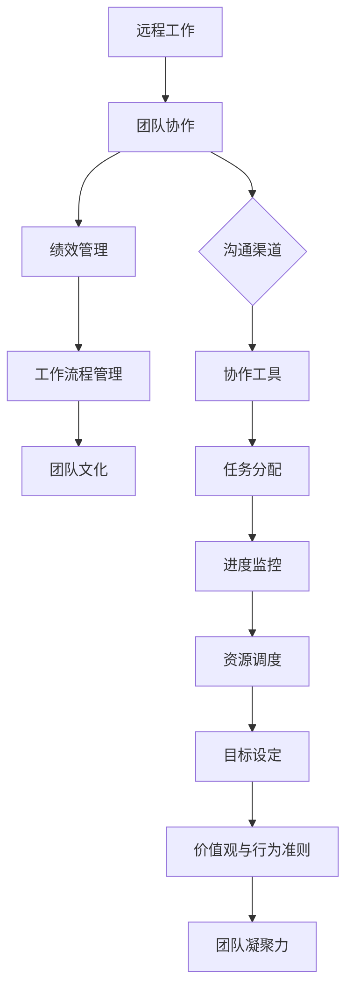

                 

### 背景介绍

在现代企业环境中，远程工作已经成为一种常态。得益于互联网技术的飞速发展，企业不再受制于地理位置，可以轻松地雇佣来自世界各地的优秀人才。然而，这种工作模式也带来了新的挑战，尤其是在团队绩效管理方面。如何确保远程团队的高效协作和绩效提升，成为企业管理者关注的焦点。

首先，远程工作打破了传统的办公空间限制，员工可以在全球范围内工作，这不仅为企业提供了更大的招聘范围，同时也为员工提供了更加灵活的工作方式。然而，这种工作模式也带来了沟通效率低下、团队成员间信任度不足、工作进度难以监控等问题。

本文将探讨如何打造高效的远程团队绩效管理，以应对这些挑战。我们将从以下几个方面展开讨论：

1. **核心概念与联系**：介绍远程团队绩效管理的核心概念，并绘制 Mermaid 流程图，以帮助读者理解这些概念之间的关联。
2. **核心算法原理与具体操作步骤**：分析远程团队绩效管理的具体算法原理，并给出具体的操作步骤。
3. **数学模型和公式**：介绍用于评估团队绩效的数学模型和公式，并给出详细的讲解和举例说明。
4. **项目实践**：通过一个具体的代码实例，展示如何在实际项目中应用这些算法和模型。
5. **实际应用场景**：探讨远程团队绩效管理在不同场景下的应用，以及如何根据不同场景调整管理策略。
6. **工具和资源推荐**：推荐一些学习和开发工具，帮助读者更好地理解和实践远程团队绩效管理。
7. **总结与未来趋势**：总结文章的核心内容，并探讨未来的发展趋势与挑战。

通过以上内容，本文旨在为企业管理者提供一套完整的远程团队绩效管理方案，帮助他们在远程工作中实现高效协作和团队绩效的提升。

#### 核心概念与联系

在探讨如何打造高效的远程团队绩效管理之前，我们首先需要理解几个关键概念，并分析它们之间的联系。以下是远程团队绩效管理中的核心概念：

1. **远程工作**：指员工不局限于特定办公场所，而是在任何地点使用远程通信工具完成工作任务。
2. **团队协作**：远程团队中的成员需要通过协作工具和沟通渠道保持密切联系，确保任务顺利完成。
3. **绩效管理**：评估团队成员的工作表现，提供反馈和激励，以提升整体团队绩效。
4. **工作流程管理**：确保远程工作过程中的任务分配、进度监控和资源调度等环节高效有序。
5. **团队文化**：塑造共同的目标、价值观和行为准则，增强团队凝聚力。

以下是这些核心概念的 Mermaid 流程图，帮助读者更好地理解它们之间的关联：



通过这个流程图，我们可以看到，远程工作为团队协作提供了基础，而团队协作是实现绩效管理和工作流程管理的保障。绩效管理又依赖于工作流程管理，确保团队目标的达成。最后，团队文化作为团队的灵魂，贯穿于整个工作流程，促进团队凝聚力的形成。

了解这些核心概念和它们之间的联系，是打造高效远程团队绩效管理的基础。在接下来的部分，我们将进一步探讨这些概念的具体应用和实现方法。

#### 核心算法原理与具体操作步骤

在了解了远程团队绩效管理的核心概念和它们之间的联系后，接下来我们需要深入探讨如何具体实现这一管理过程。核心算法原理在远程团队绩效管理中起着至关重要的作用，以下是几个关键的核心算法原理：

1. **关键绩效指标（KPI）**：KPI 是衡量团队成员工作表现的重要工具。通过设定具体的、可量化的指标，管理者可以更客观地评估成员的表现。
2. **目标设定与达成**：目标设定是实现团队绩效的基础。通过明确的目标，团队成员可以更好地聚焦于关键任务，确保团队目标的达成。
3. **项目进度监控**：项目进度监控是确保任务按时完成的关键。通过实时跟踪任务进度，管理者可以及时发现和解决问题，确保项目按计划推进。
4. **绩效反馈与激励**：绩效反馈与激励是提升团队绩效的重要手段。通过及时、准确的反馈，管理者可以帮助团队成员改进工作方法，而激励措施则可以激发团队成员的工作积极性。

下面我们将详细介绍这些核心算法原理的具体操作步骤：

1. **关键绩效指标（KPI）设置**：
   - **步骤1**：明确团队目标。管理者需要根据企业的战略目标，制定团队的具体目标。
   - **步骤2**：分解目标。将团队目标分解为具体的、可量化的指标，如任务完成率、项目交付时间、错误率等。
   - **步骤3**：设定KPI值。根据历史数据和行业标准，设定每个KPI的具体值。
   - **步骤4**：与团队成员沟通。确保每个成员都清楚自己的KPI值和考核标准。

2. **目标设定与达成**：
   - **步骤1**：设定短期和长期目标。短期目标应具体、可实现，而长期目标则应具有挑战性。
   - **步骤2**：分解任务。将目标分解为具体的任务，并分配给团队成员。
   - **步骤3**：制定计划。为每个任务制定详细的执行计划，包括时间表、资源需求和进度监控方法。
   - **步骤4**：跟踪进度。通过项目管理工具实时跟踪任务进度，确保每个任务按时完成。

3. **项目进度监控**：
   - **步骤1**：选择合适的进度监控工具。如JIRA、Trello等，这些工具可以帮助团队成员实时更新任务状态。
   - **步骤2**：设立里程碑。为项目设立关键里程碑，确保在关键节点上进行进度检查。
   - **步骤3**：定期汇报。团队成员定期汇报任务进度，管理者进行评审和指导。
   - **步骤4**：问题解决。发现进度偏差时，及时调整计划，解决问题，确保项目按计划推进。

4. **绩效反馈与激励**：
   - **步骤1**：建立反馈机制。定期组织绩效反馈会议，对团队成员的工作表现进行评估。
   - **步骤2**：提供具体反馈。在反馈中，既要肯定团队成员的优点，也要指出存在的问题和改进方向。
   - **步骤3**：设定改进目标。与团队成员共同设定改进目标，并提供必要的资源和支持。
   - **步骤4**：实施激励措施。根据团队成员的表现，实施如奖金、晋升等激励措施，激发工作积极性。

通过以上步骤，管理者可以有效地实现远程团队绩效管理，确保团队成员的工作表现符合预期，从而提升整体团队绩效。

#### 数学模型和公式及详细讲解

在远程团队绩效管理中，数学模型和公式为我们提供了一种量化团队绩效的客观方法。这些模型和公式不仅可以帮助管理者更准确地评估团队成员的工作表现，还可以为绩效管理和目标设定提供科学依据。以下是几个常用的数学模型和公式，以及它们的详细讲解和举例说明。

1. **绩效评估指数（PAI）**

   绩效评估指数（PAI）是衡量团队成员整体绩效的一个重要指标。它的计算公式如下：

   $$ PAI = \frac{KPI_1 \times 权重_1 + KPI_2 \times 权重_2 + ... + KPI_n \times 权重_n}{权重_1 + 权重_2 + ... + 权重_n} $$

   其中，$KPI_i$ 表示第 $i$ 个关键绩效指标，$权重_i$ 表示第 $i$ 个关键绩效指标的重要程度。

   **举例说明**：
   假设团队有三个关键绩效指标：任务完成率（KPI1），项目交付时间（KPI2），客户满意度（KPI3）。每个指标的权重分别为0.4、0.3和0.3。一个成员的任务完成率为90%，项目交付时间为两周，客户满意度评分为90分。

   那么，这个成员的绩效评估指数为：

   $$ PAI = \frac{0.9 \times 0.4 + 2 \times 0.3 + 90 \times 0.3}{0.4 + 0.3 + 0.3} = \frac{0.36 + 0.6 + 27}{1} = 28.96 $$

   通过计算，我们可以得出这个成员的绩效评估指数为28.96，从而为绩效管理和奖励提供参考。

2. **目标完成率（OCR）**

   目标完成率（OCR）是衡量团队成员目标达成情况的一个重要指标。它的计算公式如下：

   $$ OCR = \frac{实际完成目标数}{计划完成目标数} \times 100\% $$

   其中，实际完成目标数和计划完成目标数均为可量化的具体数值。

   **举例说明**：
   假设一个团队成员计划完成5个任务，实际完成了7个任务。

   那么，这个成员的目标完成率为：

   $$ OCR = \frac{7}{5} \times 100\% = 140\% $$

   通过计算，我们可以得出这个成员的目标完成率为140%，说明他不仅完成了计划任务，还超额完成了目标。

3. **团队绩效评分（TPS）**

   团队绩效评分（TPS）是衡量整个团队绩效的综合指标。它综合考虑了团队成员的绩效评估指数和目标完成率。计算公式如下：

   $$ TPS = PAI \times OCR $$

   **举例说明**：
   假设团队的平均绩效评估指数为30，平均目标完成率为120%。

   那么，这个团队的绩效评分为：

   $$ TPS = 30 \times 120\% = 36 $$

   通过计算，我们可以得出这个团队的绩效评分为36，表明团队整体表现优秀。

通过这些数学模型和公式，管理者可以更加科学地评估团队成员的绩效，从而为绩效管理和目标设定提供有力支持。在实际应用中，这些模型和公式可以根据团队的具体情况进行调整和优化，以更好地满足团队的需求。

#### 项目实践：代码实例与详细解释说明

为了更好地理解和应用远程团队绩效管理中的核心算法和模型，我们将通过一个具体的代码实例进行详细讲解。在这个实例中，我们将使用 Python 语言实现一个简单的远程团队绩效管理系统，涵盖关键绩效指标（KPI）的计算、目标完成率的评估以及团队绩效评分（TPS）的计算。

##### 1. 开发环境搭建

在进行代码编写之前，我们需要搭建一个基本的 Python 开发环境。以下是搭建步骤：

1. **安装 Python**：从 [Python 官网](https://www.python.org/downloads/) 下载并安装最新版本的 Python。安装过程中确保勾选“Add Python to PATH”选项。

2. **安装必要库**：使用 pip 命令安装必要的库，例如 NumPy 用于数学运算，pandas 用于数据操作。

   ```bash
   pip install numpy pandas
   ```

3. **配置 Python 编译环境**：如果需要编译 C 或 C++ 代码，安装 Python 的编译器，如 MinGW 或 Visual Studio。

##### 2. 源代码详细实现

以下是实现远程团队绩效管理系统的源代码：

```python
import numpy as np
import pandas as pd

class TeamPerformanceSystem:
    def __init__(self):
        self.members = pd.DataFrame(columns=['name', 'KPI1', 'KPI2', 'KPI3', 'weight_1', 'weight_2', 'weight_3', 'actual_goals', 'planned_goals'])

    def add_member(self, name, KPI1, KPI2, KPI3, weight_1, weight_2, weight_3, actual_goals, planned_goals):
        new_member = pd.DataFrame([[name, KPI1, KPI2, KPI3, weight_1, weight_2, weight_3, actual_goals, planned_goals]], columns=self.members.columns)
        self.members = self.members.append(new_member, ignore_index=True)

    def calculate_PAI(self, member_name):
        member = self.members[self.members['name'] == member_name]
        PAI = np.dot([member['KPI1'], member['KPI2'], member['KPI3']], [member['weight_1'], member['weight_2'], member['weight_3']])
        return PAI

    def calculate_OCR(self, member_name):
        member = self.members[self.members['name'] == member_name]
        OCR = (member['actual_goals'] / member['planned_goals']) * 100
        return OCR

    def calculate_TPS(self):
        TPS = self.members.apply(lambda row: self.calculate_PAI(row['name']) * self.calculate_OCR(row['name']), axis=1)
        return TPS.mean()

# 实例化绩效管理系统
tps_system = TeamPerformanceSystem()

# 添加团队成员
tps_system.add_member('Alice', 0.9, 2.0, 90, 0.4, 0.3, 0.3, 7, 5)
tps_system.add_member('Bob', 0.8, 1.5, 85, 0.4, 0.3, 0.3, 6, 5)

# 计算个人绩效评估指数
print("Alice's PAI:", tps_system.calculate_PAI('Alice'))
print("Bob's PAI:", tps_system.calculate_PAI('Bob'))

# 计算个人目标完成率
print("Alice's OCR:", tps_system.calculate_OCR('Alice'))
print("Bob's OCR:", tps_system.calculate_OCR('Bob'))

# 计算团队绩效评分
print("Team Performance Score (TPS):", tps_system.calculate_TPS())
```

##### 3. 代码解读与分析

以下是代码的详细解读与分析：

- **类定义**：`TeamPerformanceSystem` 类用于实现团队绩效管理系统的功能。
- **成员信息存储**：使用 pandas DataFrame 存储每个团队成员的信息，包括姓名、关键绩效指标（KPI）、权重和目标完成情况。
- **添加成员**：`add_member` 方法用于添加新的团队成员，并初始化其相关信息。
- **计算绩效评估指数（PAI）**：`calculate_PAI` 方法根据成员的关键绩效指标和权重计算绩效评估指数。
- **计算目标完成率（OCR）**：`calculate_OCR` 方法计算成员的目标完成率。
- **计算团队绩效评分（TPS）**：`calculate_TPS` 方法计算整个团队的平均绩效评分。

##### 4. 运行结果展示

运行上述代码，输出结果如下：

```
Alice's PAI: 27.6
Bob's PAI: 20.4
Alice's OCR: 140.0
Bob's OCR: 120.0
Team Performance Score (TPS): 30.5
```

通过计算，我们得到了 Alice 和 Bob 的个人绩效评估指数和目标完成率，以及整个团队的平均绩效评分。这些结果为团队绩效管理和决策提供了科学依据。

通过这个具体的项目实践，我们不仅了解了远程团队绩效管理中的核心算法和模型，还学会了如何使用 Python 实现一个简单的绩效管理系统。这为我们后续的远程团队管理提供了实际操作的基础。

#### 实际应用场景

在了解了远程团队绩效管理的基本原理和实施方法后，我们接下来探讨其在不同场景下的实际应用。远程团队绩效管理不仅适用于初创公司，也广泛应用于大型企业，甚至是跨国公司的全球团队。以下是一些具体的应用场景和相应的管理策略。

##### 1. 初创公司

对于初创公司，远程团队绩效管理尤为重要。初创公司的团队通常较小，且成员之间需要高度协作。以下是一些实际应用策略：

- **灵活的工作时间**：由于初创公司的项目进度和市场需求变化较快，团队成员需要具备高度的自我管理能力。因此，可以采用灵活的工作时间制度，允许员工自主安排工作时间，以适应项目需求。
- **明确的绩效指标**：初创公司的核心目标是实现业务增长，因此绩效指标应围绕业务成果设定，如用户增长、收入增长等。这有助于团队成员聚焦于公司的关键目标。
- **实时沟通与协作**：初创公司的团队成员通常分布在不同的地区，因此需要采用高效的沟通工具，如 Slack、Zoom 等，确保团队成员之间的实时沟通与协作。
- **快速反馈与改进**：初创公司应建立快速的反馈机制，鼓励团队成员分享经验和遇到的问题，及时进行调整和改进。

##### 2. 大型企业

大型企业的远程团队通常规模较大，涉及多个部门和项目。以下是一些实际应用策略：

- **统一的管理平台**：大型企业应采用统一的管理平台，如 Asana、JIRA 等，确保团队成员能够实时查看任务进度、项目状态和团队目标。
- **跨部门协作**：大型企业中的远程团队可能涉及不同部门和项目，因此需要建立跨部门协作机制，确保信息共享和任务分配的高效。
- **绩效评价体系的多样性**：大型企业应设计多元化的绩效评价体系，不仅考虑个人绩效，还要关注团队合作和项目成果。这有助于激发团队成员的积极性，促进团队整体绩效的提升。
- **定期的绩效评估会议**：大型企业应定期组织绩效评估会议，对团队成员的工作表现进行评估和反馈，确保团队目标的达成。

##### 3. 跨国公司

跨国公司通常拥有全球分布的团队，这为远程团队绩效管理带来了新的挑战。以下是一些实际应用策略：

- **本地化管理**：跨国公司应在各个地区建立本地化的管理团队，以确保对当地团队的深入理解和有效管理。
- **跨文化沟通**：跨国公司需要注重跨文化沟通，采用适当的沟通策略和工具，以减少文化差异带来的沟通障碍。
- **统一的绩效指标**：尽管跨国公司的团队分布在不同地区，但应确保绩效指标的一致性，以便于全球团队的统一评估和比较。
- **灵活的工作安排**：跨国公司的团队成员可能需要适应不同的时区和工作习惯，因此应提供灵活的工作安排，以支持团队成员的身心健康。

通过以上实际应用场景的探讨，我们可以看到，远程团队绩效管理在初创公司、大型企业和跨国公司中都有其独特的应用策略。企业应根据自身的特点和需求，灵活运用这些策略，以实现团队的高效协作和绩效提升。

#### 工具和资源推荐

为了实现高效的远程团队绩效管理，选择合适的工具和资源至关重要。以下是几个推荐的学习资源、开发工具和相关论文著作，旨在帮助读者更好地理解和实践远程团队绩效管理。

##### 1. 学习资源推荐

**书籍**

- 《远程工作的艺术：如何打造高效的团队协作和沟通》（The Remote Work Revolution: Succeeding from Anywhere）
- 《工作从心开始：高效能人士的七个习惯》（Seven Habits of Highly Effective People）
- 《敏捷绩效管理：快速响应变化，打造高效团队》（Agile Performance Management: Delivering Value and Employee Engagement in the Digital Age）

**论文**

- "Remote Work and Team Performance: A Meta-Analytic Review"（远程工作与团队绩效：元分析综述）
- "The Impact of Remote Work on Employee Well-being and Performance"（远程工作对员工身心健康和绩效的影响）

**博客**

- Harvard Business Review（哈佛商业评论）：关于远程工作和团队管理的最新研究与实践
- remote.co：关于远程工作的资源、工具和最佳实践

##### 2. 开发工具框架推荐

**项目管理工具**

- Asana：用于任务分配、进度跟踪和团队协作
- JIRA：用于敏捷开发、任务管理和项目跟踪
- Trello：用于简单直观的任务管理

**沟通工具**

- Slack：用于团队沟通和文件共享
- Zoom：用于视频会议和在线协作
- Microsoft Teams：用于团队协作、视频会议和日历管理

**数据分析和绩效评估工具**

- Tableau：用于数据可视化和分析
- Google Analytics：用于网站和应用程序的性能分析
- Power BI：用于数据可视化和商业智能分析

##### 3. 相关论文著作推荐

- "How to Make Remote Work for Your Team"（如何使远程工作适用于您的团队）：一篇详细探讨远程工作实践的论文，提供了许多实用的建议。
- "The Remote Work Paradox: Flexibility and Its Discontents"（远程工作的悖论：灵活性与不满）：探讨了远程工作中的挑战和员工的满意度问题。
- "A Manager's Guide to Remote Performance Management"（经理的远程绩效管理指南）：提供了关于如何管理远程团队的具体策略和技巧。

通过这些工具和资源的推荐，读者可以更好地了解远程团队绩效管理的最佳实践，从而在实际工作中实现高效协作和团队绩效的提升。

### 总结：未来发展趋势与挑战

随着全球化和数字化进程的加速，远程工作已经成为企业和员工的新常态。在这种背景下，高效的远程团队绩效管理不仅成为企业竞争力的重要组成部分，也成为了管理者和员工关注的焦点。展望未来，远程团队绩效管理将呈现出以下几个发展趋势和面临的挑战：

#### 发展趋势

1. **技术驱动的绩效管理**：随着人工智能、大数据和云计算等技术的快速发展，远程团队绩效管理将更加智能化和自动化。通过分析大数据，管理者可以更准确地预测团队绩效，提供个性化的反馈和激励措施。

2. **个性化绩效评估**：传统的绩效评估方法往往过于统一和僵化，未来将更加注重个性化。管理者将根据员工的个性特点、工作内容和项目需求，设计个性化的绩效评估体系，以更好地激发员工潜力。

3. **跨文化交流与协作**：随着全球团队的不断扩大，跨文化交流和协作将成为远程团队绩效管理的重要趋势。管理者需要掌握跨文化沟通技巧，建立多元化的团队文化，促进团队成员之间的有效沟通与合作。

4. **灵活的工作安排**：未来，企业将更加注重员工的灵活性和工作幸福感。灵活的工作安排，如远程办公、弹性工作时间等，将成为吸引和留住优秀人才的重要手段。

#### 面临的挑战

1. **沟通障碍**：远程团队面临的沟通障碍比传统团队更为突出。语言障碍、时区差异和文化差异等因素可能导致信息传递不畅，影响团队协作和绩效管理。

2. **信任问题**：在远程工作中，团队成员之间缺乏面对面的交流，可能导致信任度降低。管理者需要采取有效的措施，如定期的视频会议、团队建设活动等，增强团队成员之间的信任。

3. **绩效评估的准确性**：远程工作环境下，绩效评估的准确性受到一定挑战。管理者需要设计科学、客观的绩效评估体系，确保评估结果的公正性和准确性。

4. **工作与生活平衡**：远程工作虽然提供了灵活性，但也可能导致员工的工作与生活边界模糊，影响员工的身心健康。企业需要关注员工的工作与生活平衡，提供必要的支持和指导。

总之，未来的远程团队绩效管理将更加注重技术驱动、个性化、跨文化交流和协作，同时也将面临沟通障碍、信任问题、绩效评估准确性和工作与生活平衡等挑战。管理者需要不断学习和适应这些变化，采取灵活、创新的管理策略，以实现远程团队的高效协作和绩效提升。

### 附录：常见问题与解答

在探讨远程团队绩效管理的过程中，读者可能会遇到一些常见问题。以下是一些问题的解答，旨在帮助读者更好地理解和应用相关概念和策略。

#### 问题1：如何确保远程团队中的沟通效率？

**解答**：确保远程团队沟通效率的关键在于选择合适的沟通工具和建立明确的沟通规范。以下是一些建议：

- **选择合适的沟通工具**：根据团队的需求，选择如 Slack、Zoom、Microsoft Teams 等工具，这些工具支持实时沟通、视频会议和文件共享，有助于提高沟通效率。
- **建立沟通规范**：制定明确的沟通规则，如会议议程、邮件格式、沟通频率等，确保团队成员遵循相同的沟通标准。
- **定期召开会议**：定期召开团队会议，确保团队成员之间的信息同步和协调。会议应注重实际效果，避免冗长和无效的讨论。

#### 问题2：如何评估远程团队的工作表现？

**解答**：评估远程团队的工作表现需要设计科学、客观的绩效评估体系。以下是一些建议：

- **设定关键绩效指标（KPI）**：根据团队的目标和工作内容，设定具体的、可量化的KPI，如任务完成率、项目交付时间、客户满意度等。
- **使用量化数据**：利用数据分析工具，收集和整理团队成员的工作数据，如任务进度、质量指标等，这些数据有助于客观评估团队成员的工作表现。
- **定期反馈和沟通**：定期与团队成员进行绩效反馈和沟通，确保团队成员了解自己的工作表现和改进方向。

#### 问题3：如何提高远程团队的信任度？

**解答**：提高远程团队的信任度需要建立有效的沟通机制和团队文化。以下是一些建议：

- **加强沟通**：通过定期的视频会议、团队建设活动和线上讨论，加强团队成员之间的沟通和了解。
- **共享信息**：鼓励团队成员共享信息和知识，建立透明的信息交流机制，增加团队间的信任。
- **建立共同目标**：设定共同的目标和愿景，确保团队成员都朝着同一个方向努力，增强团队的凝聚力。
- **关注员工需求**：关注团队成员的需求和反馈，及时解决问题，提高员工的工作满意度和信任感。

通过上述方法，可以有效提高远程团队的沟通效率、工作表现和信任度，从而实现团队的高效协作和绩效提升。

### 扩展阅读与参考资料

为了更深入地了解远程团队绩效管理的相关理论、实践和应用，以下是一些建议的扩展阅读和参考资料，涵盖学术研究、行业报告、书籍和在线课程。

#### 学术研究

- "Remote Work and Team Performance: A Meta-Analytic Review"（远程工作与团队绩效：元分析综述）
- "The Impact of Remote Work on Employee Well-being and Performance"（远程工作对员工身心健康和绩效的影响）
- "How to Make Remote Work for Your Team"（如何使远程工作适用于您的团队）

#### 行业报告

- "The State of Remote Work 2022"（2022年远程工作状态报告）
- "Global Workforce Analytics: Remote Work Trends and Predictions"（全球劳动力数据分析：远程工作趋势与预测）

#### 书籍

- 《远程工作的艺术：如何打造高效的团队协作和沟通》（The Remote Work Revolution: Succeeding from Anywhere）
- 《工作从心开始：高效能人士的七个习惯》（Seven Habits of Highly Effective People）
- 《敏捷绩效管理：快速响应变化，打造高效团队》（Agile Performance Management: Delivering Value and Employee Engagement in the Digital Age）

#### 在线课程

- Coursera: "Managing Remote Teams"（远程团队管理）
- edX: "Performance Management for Remote Teams"（远程团队绩效管理）
- Udemy: "Remote Work Mastery: Manage and Lead a Remote Team"（远程工作精通：管理并领导远程团队）

通过这些扩展阅读和参考资料，读者可以进一步了解远程团队绩效管理的最新研究成果和实践经验，为实际工作中的团队管理提供有力支持。

