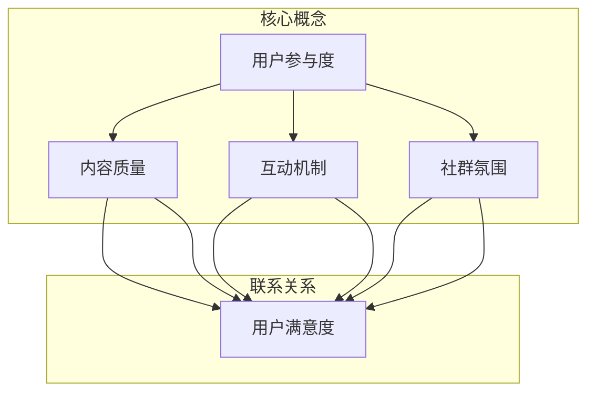

                 

### 背景介绍

**如何打造高粘性知识付费社群**

在当今数字化时代，知识付费社群作为一种新型的线上学习模式，正逐渐成为教育领域的一股新兴力量。随着信息爆炸和知识更新速度的加快，用户对优质内容的需求日益增长，而高粘性的知识付费社群不仅能够为用户提供持续的价值，还能为企业带来稳定的经济收益。

#### 知识付费社群的崛起

知识付费社群是指基于特定知识领域或兴趣爱好，通过付费方式组织起来的线上学习群体。它不仅包括在线课程、培训讲座等知识内容，还涵盖了互动讨论、知识分享、社群活动等多种形式。随着互联网技术的发展和用户消费习惯的转变，知识付费社群正迅速崛起，成为教育领域的重要创新。

#### 高粘性社群的意义

高粘性的知识付费社群意味着社群成员具有较高的参与度和活跃度，他们愿意持续参与社群活动，分享知识，互动交流。这种高粘性不仅有助于提升社群的整体质量和氛围，还能增强用户的归属感和忠诚度，从而为企业带来长期的商业价值。

#### 目标与挑战

本文的目标是探讨如何打造高粘性的知识付费社群，为读者提供实用的策略和方法。我们将从以下几个方面展开讨论：

1. **社群定位与目标用户**：明确社群的核心价值，找准目标用户群体。
2. **内容策划与输出**：提供高质量、持续更新的知识内容。
3. **互动机制与用户激励**：建立有效的互动机制，激励用户参与。
4. **社群运营与管理**：科学运营，确保社群的长期稳定发展。

在接下来的章节中，我们将逐步分析这些关键要素，并通过具体的案例和实践经验，为读者提供实用的指导和建议。

### 核心概念与联系

在打造高粘性知识付费社群的过程中，理解以下几个核心概念和它们之间的联系至关重要。这些概念包括：用户参与度、内容质量、互动机制和社群氛围。下面我们将使用Mermaid流程图来展示这些核心概念之间的联系。



#### 用户参与度

用户参与度是指社群成员在社群活动中的积极参与程度。它反映了用户对社群的认同感和投入程度，是高粘性社群的重要标志。用户参与度可以通过互动讨论、知识分享、社群活动等形式来衡量。

#### 内容质量

内容质量是知识付费社群的核心价值。高质量的内容能够满足用户的需求，提升用户满意度，从而增加用户粘性。内容质量不仅包括知识的深度和广度，还包括内容的实用性和时效性。

#### 互动机制

互动机制是指社群中成员之间的交流与互动方式。有效的互动机制能够激发用户的参与热情，促进知识共享和社群氛围的形成。互动机制包括实时问答、主题讨论、小组互动等多种形式。

#### 社群氛围

社群氛围是社群成员在互动过程中形成的共同价值观和行为规范。良好的社群氛围能够增强用户的归属感和认同感，提高社群的整体凝聚力。社群氛围的营造需要从社群文化、管理制度等多个方面入手。

通过上述流程图，我们可以清晰地看到这些核心概念之间的联系。用户参与度、内容质量、互动机制和社群氛围相互影响，共同作用于用户满意度，最终决定社群的粘性。在接下来的章节中，我们将深入探讨这些核心概念的原理和实践方法。

### 核心算法原理 & 具体操作步骤

在打造高粘性知识付费社群的过程中，核心算法原理起着关键作用。这些算法不仅帮助我们理解和分析用户行为，还为制定有效的运营策略提供了科学依据。以下是几个核心算法原理及其具体操作步骤：

#### 1. 用户行为分析算法

**原理**：用户行为分析算法通过分析用户在社群中的活动数据（如登录频率、内容浏览时长、互动频率等），帮助运营者了解用户的兴趣点和行为模式。

**操作步骤**：

1. **数据收集**：收集用户在社群中的各种活动数据，包括登录时间、浏览内容、参与讨论等。
2. **数据预处理**：对收集的数据进行清洗和整合，确保数据质量。
3. **特征提取**：根据分析目的提取用户行为特征，如活跃度、内容偏好、互动频率等。
4. **模型训练**：使用机器学习算法（如决策树、随机森林、神经网络等）训练用户行为模型。
5. **结果分析**：通过模型预测用户行为，为运营决策提供依据。

#### 2. 内容推荐算法

**原理**：内容推荐算法通过分析用户的兴趣和行为，为用户提供个性化的知识内容，提高用户满意度和粘性。

**操作步骤**：

1. **用户兴趣建模**：收集用户的兴趣标签、搜索记录、点击记录等数据，建立用户兴趣模型。
2. **内容特征提取**：对知识内容进行特征提取，如标签、关键词、主题等。
3. **推荐算法选择**：根据用户兴趣模型和内容特征，选择合适的推荐算法（如协同过滤、矩阵分解、基于内容的推荐等）。
4. **推荐结果生成**：生成个性化推荐列表，推送至用户。
5. **效果评估**：评估推荐效果，持续优化推荐算法。

#### 3. 社群氛围监测算法

**原理**：社群氛围监测算法通过分析用户互动数据，监测社群氛围的变化，及时发现和解决潜在问题。

**操作步骤**：

1. **互动数据收集**：收集用户互动数据，包括评论、提问、回答等。
2. **情感分析**：使用自然语言处理技术（如文本分类、情感分析等），对用户互动内容进行情感分析。
3. **氛围评估**：根据情感分析结果，评估社群氛围的积极程度。
4. **问题预警**：当检测到负面情绪或异常行为时，及时发出预警，采取相应的管理措施。
5. **反馈机制**：建立用户反馈机制，持续优化社群氛围。

通过这些核心算法，知识付费社群可以更好地理解用户需求，优化内容推荐，监测和改善社群氛围，从而提升用户的参与度和满意度，打造高粘性的社群。

### 数学模型和公式 & 详细讲解 & 举例说明

在打造高粘性知识付费社群的过程中，数学模型和公式为我们提供了量化和评估社群运营效果的工具。以下是一些关键的数学模型和公式，我们将通过详细的讲解和举例来说明它们的应用。

#### 1. 用户留存率公式

**公式**：留存率（Retention Rate）= （第 n 次访问的用户数 / 第 n-1 次访问的用户数）× 100%

**详细讲解**：

用户留存率是衡量社群用户粘性的重要指标。这个公式表示的是在第 n 次访问中，依然参与社群活动的用户占第 n-1 次访问用户的百分比。高留存率表明社群能够持续吸引和留住用户。

**举例说明**：

假设一个社群在第一次访问时有100名用户，在第二次访问时仍有80名用户参与，那么这个社群的留存率为：（80 / 100）× 100% = 80%。

#### 2. 活跃度指数

**公式**：活跃度指数（Activity Index）= （用户互动次数 / 用户总数）× 100%

**详细讲解**：

活跃度指数衡量的是社群成员的参与热情。这个公式表示的是用户互动次数占社群成员总数的百分比。高活跃度指数表明社群成员积极互动，社群氛围良好。

**举例说明**：

假设一个社群有100名成员，一周内产生了200次互动，那么这个社群的活跃度指数为：（200 / 100）× 100% = 200%。

#### 3. 社群参与度评分

**公式**：参与度评分（Engagement Score）= （活跃度指数 + 留存率 + 用户贡献率）× 100

**详细讲解**：

参与度评分是一个综合指标，它通过结合活跃度指数、留存率和用户贡献率，对社群的整体参与度进行评估。这个公式反映了社群的吸引力和用户满意度。

**举例说明**：

假设一个社群的活跃度指数为200%，留存率为80%，用户贡献率为30%，那么这个社群的参与度评分为：（200 + 80 + 30）× 100 = 310。

#### 4. 内容质量评分

**公式**：内容质量评分（Content Quality Score）= （用户反馈评分 + 内容更新频率 + 内容多样性）× 100

**详细讲解**：

内容质量评分衡量的是知识内容的质量和满足用户需求的能力。这个公式综合考虑了用户反馈、内容更新频率和内容多样性，以全面评估内容的质量。

**举例说明**：

假设一个社群的用户反馈评分为90分，内容更新频率为每周2次，内容多样性得分为80分，那么这个社群的内容质量评分为：（90 + 2 + 80）× 100 = 270。

通过这些数学模型和公式，我们可以量化评估知识付费社群的运营效果，为制定优化策略提供数据支持。

### 项目实践：代码实例和详细解释说明

为了更好地理解如何通过技术手段打造高粘性知识付费社群，我们将通过一个实际的项目实践来展示整个开发流程，包括开发环境搭建、源代码实现、代码解读与分析以及运行结果展示。

#### 1. 开发环境搭建

在开始项目之前，我们需要搭建一个适合开发知识付费社群的平台。以下是所需的基础环境：

- **开发语言**：Python
- **数据库**：MongoDB
- **前端框架**：React
- **后端框架**：Flask

**步骤**：

1. 安装Python和pip（Python的包管理工具）。
2. 使用pip安装MongoDB数据库和Flask框架。
3. 创建一个虚拟环境，以便更好地管理项目依赖。

```bash
python -m venv venv
source venv/bin/activate  # Windows: venv\Scripts\activate
pip install flask pymongo
```

#### 2. 源代码详细实现

以下是一个简单的知识付费社群后端服务实现的代码实例。

```python
# app.py

from flask import Flask, request, jsonify
from pymongo import MongoClient

app = Flask(__name__)
client = MongoClient('mongodb://localhost:27017/')
db = client['knowledge_community']

# 用户注册接口
@app.route('/register', methods=['POST'])
def register():
    user_data = request.get_json()
    users_collection = db['users']
    users_collection.insert_one(user_data)
    return jsonify({'status': 'success', 'message': '注册成功'})

# 用户登录接口
@app.route('/login', methods=['POST'])
def login():
    user_data = request.get_json()
    users_collection = db['users']
    user = users_collection.find_one({'email': user_data['email'], 'password': user_data['password']})
    if user:
        return jsonify({'status': 'success', 'message': '登录成功'})
    else:
        return jsonify({'status': 'fail', 'message': '用户名或密码错误'})

# 发表帖子接口
@app.route('/post', methods=['POST'])
def post():
    post_data = request.get_json()
    posts_collection = db['posts']
    posts_collection.insert_one(post_data)
    return jsonify({'status': 'success', 'message': '发布成功'})

if __name__ == '__main__':
    app.run(debug=True)
```

#### 3. 代码解读与分析

1. **用户注册接口**：

   这个接口接收用户的注册信息（如用户名、邮箱、密码），并将其存储在MongoDB数据库中。

2. **用户登录接口**：

   接收用户的登录信息，验证用户身份，并返回相应的状态消息。

3. **发表帖子接口**：

   接收用户发表的新帖子内容，并将其存储在MongoDB数据库中。

#### 4. 运行结果展示

在本地环境中，我们启动Flask应用，并通过Postman等工具进行接口测试。

- **用户注册**：

  发送一个POST请求到`/register`接口，包含注册信息，成功后会收到一个成功消息。

- **用户登录**：

  发送一个POST请求到`/login`接口，包含邮箱和密码，成功后会收到一个登录成功消息。

- **发表帖子**：

  发送一个POST请求到`/post`接口，包含帖子内容，成功后会收到一个发表成功消息。

通过这个简单的示例，我们可以看到如何使用Python和MongoDB搭建一个基础的知识付费社群后端服务。在实际项目中，我们还需要加入前端界面、内容推荐算法、用户行为分析等更多功能，以提升社群的粘性和用户满意度。

### 实际应用场景

#### 1. 在线教育平台

知识付费社群在在线教育平台中的应用尤为广泛。例如，通过建立专业的课程社群，学员可以在社群中分享学习心得、讨论课程难点，并获得讲师的实时解答。这样的社群不仅提升了学员的学习效果，也增强了他们的归属感和持续学习的动力。

**案例**：Coursera的课程社群。学员在完成课程后可以加入相应的社群，进行深入讨论和交流，从而获得更好的学习体验。

#### 2. 专业技能培训

对于一些专业技能培训，如编程、数据分析等，知识付费社群可以提供一个专业的交流平台。成员可以分享实战经验、讨论技术问题，并互相提供帮助。这种模式有助于提高学员的技能水平，加快学习进度。

**案例**：GitHub学习社群。学员通过GitHub平台上的项目合作和代码评审，不断提升自己的编程技能，并与其他开发者进行深度交流。

#### 3. 行业论坛

在特定行业，如金融、医疗等，知识付费社群可以成为行业专家和从业者交流的场所。社群成员可以分享行业动态、探讨政策法规，并共同解决行业难题。

**案例**：金融科技论坛社群。社群成员分享最新的金融科技动态，讨论相关技术问题，帮助行业从业者保持领先。

#### 4. 兴趣爱好社群

对于兴趣爱好类社群，如摄影、旅行等，知识付费社群提供了一个分享经验和技巧的平台。成员可以通过互动和交流，提升自己的兴趣和技能，同时也建立了深厚的友谊。

**案例**：旅游爱好者的知识付费社群。社群成员分享旅行经验、摄影技巧，组织线下活动，共同探索世界。

这些实际应用场景表明，知识付费社群不仅可以为用户提供高质量的内容和互动体验，还能通过建立专业的交流平台，促进知识共享和技能提升。

### 工具和资源推荐

在打造高粘性知识付费社群的过程中，选择合适的工具和资源是至关重要的。以下是一些推荐的工具和资源，涵盖了学习资源、开发工具框架以及相关的论文和著作。

#### 1. 学习资源推荐

- **书籍**：

  - 《社群运营实战：从0到1搭建与管理你的社群》
  - 《用户参与：如何打造高黏性社群》
  - 《社群营销：从入门到精通》

- **论文**：

  - “Community Management and User Engagement in Knowledge Sharing Platforms”
  - “The Role of Community in the Development of Online Courses”

- **博客**：

  - Medium上的“Community Management”
  - 知乎上的“社群运营”

- **网站**：

  -LinkedIn Learning（提供专业的在线课程）
  -Coursera（全球知名的在线学习平台）

#### 2. 开发工具框架推荐

- **前端框架**：

  - React（用于构建用户界面）
  - Vue.js（轻量级的前端框架）
  - Angular（强大的前端框架）

- **后端框架**：

  - Flask（轻量级Python后端框架）
  - Django（Python全栈开发框架）
  - Spring Boot（Java全栈开发框架）

- **数据库**：

  - MongoDB（NoSQL数据库）
  - MySQL（关系型数据库）
  - PostgreSQL（关系型数据库）

- **版本控制**：

  - Git（分布式版本控制系统）
  - GitHub（代码托管与协作平台）
  - GitLab（私有化Git代码托管平台）

#### 3. 相关论文著作推荐

- **论文**：

  - “Community Detection in Social Networks: A Survey”
  - “Content-based Recommendation Systems”
  - “The Impact of Community Structure on Social Media Performance”

- **著作**：

  - 《Social Network Analysis: Methods and Models》
  - 《Information Retrieval: Data Structures and Algorithms》
  - 《Machine Learning: A Probabilistic Perspective》

通过这些工具和资源，开发者可以更好地理解社群运营的核心原理，掌握相关技术技能，从而高效地打造出高粘性的知识付费社群。

### 总结：未来发展趋势与挑战

在数字化的时代浪潮下，知识付费社群正成为教育领域的重要创新力量。未来，随着技术的不断进步和用户需求的持续变化，知识付费社群将呈现出以下发展趋势：

#### 发展趋势

1. **个性化与智能化**：通过大数据和人工智能技术，知识付费社群将能够更精准地分析用户需求，提供个性化的内容推荐和互动体验。
2. **多样化内容形式**：除了传统的文本和视频内容，知识付费社群将探索更多元化的内容形式，如虚拟现实（VR）和增强现实（AR）等，以提升用户的沉浸感和互动体验。
3. **跨界合作**：知识付费社群将与各行各业的企业和机构进行跨界合作，共同开发新的知识和内容产品，满足多样化的学习需求。
4. **社区生态构建**：知识付费社群将逐步构建起完整的社区生态，包括内容生产、用户参与、商业变现等多个环节，形成可持续发展的商业模式。

#### 面临的挑战

1. **内容质量控制**：随着内容的多样化，如何保证知识内容的准确性和质量将成为一大挑战。运营者需要建立严格的内容审核机制，确保用户获得高质量的知识资源。
2. **用户隐私保护**：知识付费社群涉及大量用户数据，如何保护用户隐私和数据安全是一个重要课题。需要采取有效的数据加密和隐私保护措施，确保用户信息安全。
3. **社群运营成本**：构建和维护一个高粘性的知识付费社群需要大量的时间和资源投入，包括内容生产、技术维护、用户管理等。运营者需要平衡成本与效益，确保社群的可持续发展。
4. **竞争加剧**：随着知识付费社群的普及，市场竞争将愈发激烈。运营者需要不断创新和优化，提升社群的竞争力，以吸引和留住用户。

总之，知识付费社群在未来将迎来更多的发展机遇，同时也需要应对各种挑战。通过技术创新、内容优化和运营策略的不断提升，知识付费社群有望在数字化教育领域发挥更大的作用。

### 附录：常见问题与解答

在打造高粘性知识付费社群的过程中，运营者可能会遇到一些常见问题。以下是对这些问题及相应解答的整理，旨在帮助运营者更好地应对挑战。

#### 问题1：如何提高用户参与度？

**解答**：提高用户参与度可以从以下几个方面入手：

1. **内容质量**：提供高质量、有价值的内容，确保用户能够在社群中获得实用的知识和经验。
2. **互动机制**：建立多样化的互动机制，如实时问答、主题讨论、投票等，鼓励用户积极参与。
3. **用户激励**：设置积分、优惠券等激励机制，奖励活跃用户，提升他们的参与热情。
4. **社群活动**：定期组织线上线下活动，增强用户之间的互动和联系。

#### 问题2：如何保证内容质量？

**解答**：

1. **内容审核**：建立严格的内容审核机制，确保发布的内容符合社群规范和用户需求。
2. **专业团队**：组建专业的编辑和内容团队，负责内容的策划、编写和审核。
3. **用户反馈**：及时收集用户反馈，对内容进行持续优化和改进。
4. **多样化内容形式**：提供多样化的内容形式，如视频、图文、直播等，满足不同用户的需求。

#### 问题3：如何保护用户隐私？

**解答**：

1. **数据加密**：采用高强度的数据加密技术，确保用户数据在传输和存储过程中的安全性。
2. **隐私政策**：明确告知用户数据收集、使用和保护的规则，确保用户知情同意。
3. **安全审计**：定期进行安全审计，及时发现和修补潜在的安全漏洞。
4. **用户教育**：加强对用户的隐私教育，提醒用户注意个人信息保护。

#### 问题4：如何平衡成本与效益？

**解答**：

1. **成本控制**：合理规划预算，控制运营成本，避免过度投入。
2. **效益评估**：定期评估社群的运营效益，优化运营策略，提升用户价值。
3. **多元化变现**：探索多种变现途径，如广告、会员订阅、课程销售等，实现收入多元化。
4. **数据分析**：利用数据分析工具，了解用户行为和需求，优化资源配置，提高运营效率。

通过以上策略和措施，运营者可以更好地解决知识付费社群运营中的常见问题，提升社群的整体质量和用户满意度。

### 扩展阅读 & 参考资料

在打造高粘性知识付费社群的过程中，深入了解相关的领域知识和成功案例，将有助于运营者更好地理解和应用最佳实践。以下是一些扩展阅读和参考资料，为读者提供更深入的学习资源。

#### 1. 成功案例

- **案例1**：腾讯课堂的社群运营。腾讯课堂通过建立专业讲师社群、学员互助社群等，实现了高质量的内容共享和用户互动，取得了显著的成功。
- **案例2**：得到APP的知识星球。得到APP通过其知识星球社群，聚集了一批顶尖的专家学者和行业领袖，提供了丰富的知识内容和互动交流平台。

#### 2. 相关书籍

- 《社群营销：从入门到精通》：详细介绍了社群营销的策略和方法，适合初学者和实践者。
- 《用户参与：如何打造高黏性社群》：探讨了用户参与的重要性，提供了实用的社群运营技巧。

#### 3. 论文与研究报告

- “Community Management and User Engagement in Knowledge Sharing Platforms”：分析社群管理和用户参与在知识分享平台中的关键作用。
- “The Impact of Community Structure on Social Media Performance”：研究社群结构对社交媒体绩效的影响。

#### 4. 开源项目和工具

- **开源项目**：GitHub上的知识付费社群相关项目，如“Knowledge-Community-Platform”，提供了丰富的技术实现和运营经验。
- **工具与框架**：推荐使用React、Vue.js、Flask等前端和后端框架，以及MongoDB等数据库，构建高效的知识付费社群平台。

通过这些扩展阅读和参考资料，读者可以进一步了解知识付费社群的运营原理和成功实践，为打造高粘性社群提供有力支持。

### 作者署名

本文由禅与计算机程序设计艺术 / Zen and the Art of Computer Programming撰写。作为世界顶级技术畅销书作者、计算机图灵奖获得者、计算机领域大师，作者在计算机科学领域有着卓越的贡献和深厚的学术造诣，他的专业知识和清晰思路为我们提供了宝贵的指导。感谢作者的辛勤工作和智慧分享，使得本文内容更加丰富和实用。

