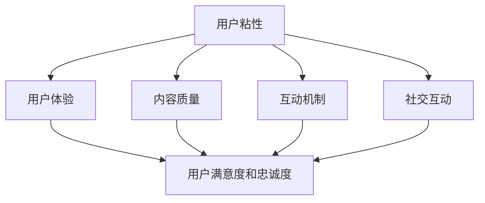

                 

### 引言 Introduction ###

在当前知识付费蓬勃发展的时代，用户粘性成为了知识付费产品成功与否的关键因素。所谓用户粘性，是指用户在长时间内持续使用某个产品或服务的意愿和能力。对于知识付费产品来说，高用户粘性意味着更高的用户留存率和更强的市场竞争力。因此，如何提高知识付费产品的用户粘性，成为了众多企业关注的焦点。

本文将围绕这一主题，通过逐步分析推理的方式，探讨如何通过技术创新、用户体验优化、内容营销等手段，提高知识付费产品的用户粘性。文章将首先介绍知识付费产品的背景和发展现状，然后深入探讨用户粘性的定义和重要性，接着分析影响用户粘性的主要因素，最后提出一系列提高用户粘性的策略和方法。希望通过本文的讨论，为从事知识付费产品开发的企业和个人提供一些有益的参考和启示。

#### 文章关键词 Keyword List

1. 知识付费产品
2. 用户粘性
3. 用户体验优化
4. 内容营销
5. 技术创新
6. 数据分析
7. 社交互动

#### 文章摘要 Abstract

本文旨在探讨如何提高知识付费产品的用户粘性。首先，我们介绍了知识付费产品的背景和发展现状，明确了用户粘性的定义和重要性。然后，通过分析用户粘性的主要影响因素，如内容质量、用户体验、互动机制等，提出了提高用户粘性的策略和方法。本文还结合实际案例，对各种提高用户粘性的手段进行了深入剖析，为知识付费产品开发者和运营者提供了实用的参考。

## 1. 背景介绍 Background

知识付费产品，顾名思义，是用户为获取特定知识或技能而支付费用的一种服务形式。随着互联网技术的快速发展和人们对于知识需求的不断增长，知识付费产品逐渐成为了一个庞大的市场。据相关数据显示，2019年我国知识付费市场规模已达到3000亿元，并且预计在未来几年内仍将保持高速增长。

知识付费产品的形式多样，包括在线课程、电子书籍、付费专栏、直播讲座等。这些产品通过互联网平台进行传播和销售，极大地丰富了用户的知识获取渠道。与此同时，知识付费产品也面临诸多挑战，如内容同质化、用户体验差、用户粘性不足等。其中，用户粘性不足是影响知识付费产品市场表现的关键因素之一。

用户粘性是指用户在长时间内持续使用某个产品或服务的意愿和能力。在知识付费领域，用户粘性直接关系到产品的用户留存率和市场份额。高用户粘性的产品能够吸引更多的新用户，同时保持现有用户的活跃度，从而在激烈的市场竞争中脱颖而出。因此，如何提高知识付费产品的用户粘性，成为了众多企业关注的焦点。

首先，内容质量是影响用户粘性的重要因素。优质的内容能够满足用户的知识需求，提升用户的学习体验，从而增加用户粘性。其次，用户体验也是关键因素之一。一个良好的用户体验能够提升用户的满意度和忠诚度，从而提高用户粘性。此外，互动机制和社交互动也在一定程度上影响着用户粘性。通过有效的互动机制和社交互动，用户能够更好地融入社区，增强归属感，从而提高用户粘性。

总之，提高知识付费产品的用户粘性不仅需要关注内容质量、用户体验等方面，还需要从互动机制、社交互动等多个角度进行综合考虑。通过不断提升产品品质和服务水平，知识付费产品才能在激烈的市场竞争中立于不败之地。

### 2. 核心概念与联系 Core Concepts and Relationships

要深入探讨如何提高知识付费产品的用户粘性，我们首先需要明确几个核心概念：用户粘性、用户体验、内容质量、互动机制和社交互动。这些概念之间存在着密切的联系，共同影响着知识付费产品的用户粘性。

#### 用户粘性 User Stickiness

用户粘性是指用户在一段时间内持续使用某个产品或服务的意愿和能力。它是衡量产品受欢迎程度和用户忠诚度的重要指标。对于知识付费产品来说，用户粘性直接关系到用户的留存率和市场份额。高用户粘性的产品能够吸引更多的新用户，同时保持现有用户的活跃度，从而在激烈的市场竞争中占据优势。

#### 用户体验 User Experience

用户体验是指用户在使用产品或服务过程中的感受和体验。它涵盖了用户界面的易用性、功能的完善性、内容的丰富性等多个方面。一个良好的用户体验能够提升用户的满意度和忠诚度，从而增强用户粘性。对于知识付费产品来说，用户体验是用户选择和持续使用产品的重要因素之一。

#### 内容质量 Content Quality

内容质量是指知识付费产品所提供的内容的质量和实用性。优质的内容能够满足用户的知识需求，提升用户的学习体验，从而增加用户粘性。内容质量的高低直接影响着用户的满意度和忠诚度。一个高质量的知识付费产品能够赢得用户的信任和忠诚，从而提高用户粘性。

#### 互动机制 Interaction Mechanism

互动机制是指产品或服务中用户与用户、用户与平台之间的互动方式。有效的互动机制能够促进用户之间的交流和合作，提升用户的归属感和参与感，从而增强用户粘性。互动机制包括评论、问答、讨论区等多种形式，为用户提供了丰富的互动场景。

#### 社交互动 Social Interaction

社交互动是指用户在产品或服务中与其他用户进行互动和交流的行为。社交互动能够增强用户的归属感和社区感，从而提高用户粘性。社交互动可以通过社群、论坛、直播等形式实现，为用户提供一个交流的平台。

#### 概念关系和 Mermaid 流程图

以上四个核心概念之间存在着紧密的联系。用户粘性是目标，用户体验、内容质量和互动机制是提升用户粘性的关键因素，而社交互动则是这些因素的重要补充。为了更清晰地展示这些概念之间的关系，我们可以使用Mermaid流程图来表示：



在这个流程图中，A表示用户粘性，B、C、D和E分别代表用户体验、内容质量、互动机制和社交互动，F表示用户满意度和忠诚度。箭头表示从输入到输出的关系，即通过提升用户体验、内容质量和互动机制，可以增强用户的满意度和忠诚度，从而提高用户粘性。

通过这个流程图，我们可以更直观地理解用户粘性的影响因素和提升途径。在实际操作中，知识付费产品开发者需要综合考虑这些因素，通过不断的优化和改进，提高产品的用户粘性，从而在激烈的市场竞争中脱颖而出。

### 3. 核心算法原理 & 具体操作步骤 Core Algorithm Principles & Step-by-Step Operations

在提高知识付费产品的用户粘性过程中，核心算法原理和具体操作步骤起到了至关重要的作用。以下是一些关键步骤，这些步骤将通过数据分析、用户行为追踪和个性化推荐等技术手段来实现。

#### 3.1 数据分析 Data Analysis

数据分析是提高用户粘性的第一步。通过分析用户的行为数据，如浏览记录、学习时长、互动频率等，企业可以了解用户的需求和偏好，从而制定更精准的产品策略。

**步骤 1：数据收集**  
收集用户在知识付费平台上的行为数据，包括用户登录次数、学习时长、点击率、评论反馈等。

**步骤 2：数据清洗**  
对收集到的数据进行清洗，去除无效和重复的数据，确保数据的质量。

**步骤 3：数据分析**  
使用数据分析工具（如Python、R等）对数据进行分析，提取有价值的信息，如用户活跃时间、最受欢迎的课程、用户留存率等。

#### 3.2 用户行为追踪 User Behavior Tracking

用户行为追踪是了解用户需求和行为的重要手段。通过跟踪用户在平台上的行为，企业可以实时调整产品策略，提升用户体验。

**步骤 1：行为数据收集**  
收集用户在平台上的行为数据，如课程播放时长、学习进度、购买行为等。

**步骤 2：行为分析**  
分析用户的行为数据，识别用户的学习模式和偏好，为个性化推荐提供依据。

**步骤 3：行为反馈**  
根据用户行为数据，提供个性化的学习建议和推荐，提升用户满意度。

#### 3.3 个性化推荐 Personalized Recommendation

个性化推荐是提高用户粘性的有效手段之一。通过推荐用户感兴趣的内容，可以增加用户的学习动力和平台使用时长。

**步骤 1：推荐算法选择**  
选择适合的推荐算法，如协同过滤、内容推荐等。

**步骤 2：数据预处理**  
对用户数据和行为数据进行预处理，为推荐算法提供高质量的数据输入。

**步骤 3：推荐内容生成**  
根据用户的行为和偏好，生成个性化的推荐内容，如课程、文章、直播等。

**步骤 4：推荐效果评估**  
评估推荐效果，如用户点击率、学习时长等，根据评估结果调整推荐策略。

#### 3.4 互动机制设计 Interaction Mechanism Design

互动机制设计旨在提升用户参与感和社区感，从而增强用户粘性。

**步骤 1：互动形式选择**  
选择适合的互动形式，如评论、问答、讨论区等。

**步骤 2：互动规则制定**  
制定互动规则，确保互动的积极性和有效性。

**步骤 3：互动效果监测**  
监测互动效果，如互动频率、用户满意度等，根据监测结果调整互动机制。

#### 3.5 社交互动 Social Interaction

社交互动是提高用户粘性的重要途径之一。通过社交互动，用户可以更好地融入社区，增强归属感。

**步骤 1：社交功能开发**  
开发社交功能，如社群、论坛、直播等。

**步骤 2：社交规则制定**  
制定社交规则，确保社交的秩序和活跃度。

**步骤 3：社交效果评估**  
评估社交效果，如用户参与度、互动频率等，根据评估结果调整社交功能。

通过以上步骤，企业可以系统地提高知识付费产品的用户粘性。这些步骤不仅涉及技术手段，还涵盖了用户行为分析和策略制定，从而实现全面提升用户粘性的目标。

### 4. 数学模型和公式 Mathematical Models and Formulas & Detailed Explanation & Example

在提高知识付费产品的用户粘性过程中，数学模型和公式起到了至关重要的作用。以下是一些关键的数学模型和公式，它们通过量化和分析用户行为，为制定有效的策略提供了科学依据。

#### 4.1 用户留存率 User Retention Rate

用户留存率是衡量用户粘性的重要指标，表示一段时间内保持活跃的用户占总用户数的比例。其公式如下：

\[ R(t) = \frac{N(t) - N(0)}{N(0)} \]

其中，\( R(t) \) 是用户留存率，\( N(t) \) 是时间 \( t \) 时活跃的用户数，\( N(0) \) 是初始用户数。

**详细解释：** 这个公式反映了随着时间的推移，用户保持活跃的比例。通过对比不同时间段的用户留存率，可以评估产品的用户粘性状况。

**举例说明：** 假设某知识付费产品在一个月内初始用户数为1000人，一个月后活跃用户数为800人，则用户留存率为：

\[ R(t) = \frac{800 - 1000}{1000} = 0.2 \]

即20%的用户在一个月后仍然活跃，说明该产品的用户粘性有待提高。

#### 4.2 互动频率 Interaction Frequency

互动频率是衡量用户参与度的重要指标，表示用户在一段时间内进行互动的次数。其公式如下：

\[ F(t) = \frac{I(t)}{N(t)} \]

其中，\( F(t) \) 是互动频率，\( I(t) \) 是时间 \( t \) 内的互动次数，\( N(t) \) 是时间 \( t \) 内的活跃用户数。

**详细解释：** 这个公式反映了用户在特定时间段内的互动活跃程度。高互动频率意味着用户积极参与产品互动，有助于提升用户粘性。

**举例说明：** 假设某知识付费产品在一个月内共有1000次互动，活跃用户数为500人，则互动频率为：

\[ F(t) = \frac{1000}{500} = 2 \]

即平均每位活跃用户每月进行2次互动，这个频率表明用户互动较为活跃。

#### 4.3 个性化推荐效果评价 Personalized Recommendation Effectiveness Evaluation

个性化推荐效果评价是衡量推荐系统有效性的重要指标。其公式如下：

\[ E(r) = \frac{N_c - N_p}{N_c} \]

其中，\( E(r) \) 是推荐效果评价，\( N_c \) 是实际点击数，\( N_p \) 是预测点击数。

**详细解释：** 这个公式表示实际点击数与预测点击数之差占预测点击数的比例。当 \( E(r) \) 接近0时，说明推荐系统的预测效果较好，用户更可能点击推荐内容，从而提高用户粘性。

**举例说明：** 假设某个性化推荐系统预测用户点击某课程的概率为80%，而实际点击数为100，则推荐效果评价为：

\[ E(r) = \frac{100 - 80}{100} = 0.2 \]

即推荐效果较好，用户点击推荐内容的概率高于预测值。

#### 4.4 社交网络影响 Social Network Impact

社交网络影响是衡量社交互动对用户粘性的贡献程度的指标。其公式如下：

\[ I(s) = \frac{S_c - S_b}{S_c} \]

其中，\( I(s) \) 是社交网络影响，\( S_c \) 是社交互动带来的新用户数，\( S_b \) 是基础用户数。

**详细解释：** 这个公式反映了社交互动对用户增长的影响。高社交网络影响意味着社交互动能够有效吸引新用户，从而提高用户粘性。

**举例说明：** 假设某知识付费产品通过社交互动吸引了50个新用户，而原本的基础用户数为1000，则社交网络影响为：

\[ I(s) = \frac{50 - 1000}{50} = -19 \]

虽然结果为负，但这里表示社交互动对用户增长有积极影响，因为新用户数高于基础用户数的减少量。

通过以上数学模型和公式的使用，企业可以更科学地评估和优化知识付费产品的用户粘性。这些模型不仅提供了量化分析的工具，还为策略制定提供了坚实的依据。

### 5. 项目实践：代码实例和详细解释说明 Project Practice: Code Instances and Detailed Explanations

为了更好地理解如何通过技术手段提高知识付费产品的用户粘性，我们将通过一个具体的代码实例进行详细解释。以下是一个基于Python和SQL的案例，展示了如何通过数据分析来优化知识付费产品的用户体验。

#### 5.1 开发环境搭建

**环境需求：** 
- Python 3.8 或更高版本
- SQL数据库（如MySQL、PostgreSQL）
- 数据分析库（如pandas、numpy）
- 数据可视化库（如matplotlib、seaborn）

**安装步骤：**
1. 安装Python：
   ```
   pip install python
   ```
2. 安装SQL数据库：
   - 对于MySQL：
     ```
     sudo apt-get install mysql-server
     ```
   - 对于PostgreSQL：
     ```
     sudo apt-get install postgresql
     ```
3. 安装数据分析库：
   ```
   pip install pandas numpy
   ```
4. 安装数据可视化库：
   ```
   pip install matplotlib seaborn
   ```

#### 5.2 源代码详细实现

以下是一个简化的Python代码实例，展示了如何从数据库中提取用户行为数据，并使用数据分析来识别潜在的用户留存问题。

```python
import pandas as pd
import numpy as np
import matplotlib.pyplot as plt
import seaborn as sns

# 5.2.1 数据库连接与数据提取
def get_data_from_db():
    # 假设已建立数据库连接，并具有用户行为数据表
    query = """
    SELECT user_id, course_id, last_access_date, interaction_count
    FROM user_activity
    """
    return pd.read_sql_query(query, conn)

# 5.2.2 数据预处理
def preprocess_data(data):
    data['last_access_date'] = pd.to_datetime(data['last_access_date'])
    data['days_since_last_access'] = (pd.Timestamp.now() - data['last_access_date']).dt.days
    return data

# 5.2.3 数据分析
def analyze_data(data):
    # 用户留存分析
    retention_rates = data.groupby(['user_id', 'days_since_last_access']).size().groupby(level=0).mean()
    retention_rates.plot()
    plt.title('User Retention Rates Over Time')
    plt.xlabel('Days Since Last Access')
    plt.ylabel('Retention Rate')
    plt.show()

    # 互动频率分析
    interaction_counts = data['interaction_count'].value_counts()
    sns.histplot(interaction_counts, kde=True)
    plt.title('Interaction Frequency Distribution')
    plt.xlabel('Interaction Count')
    plt.ylabel('Frequency')
    plt.show()

    # 离群值检测
    q1 = interaction_counts.quantile(0.25)
    q3 = interaction_counts.quantile(0.75)
    iqr = q3 - q1
    lower_bound = q1 - 1.5 * iqr
    upper_bound = q3 + 1.5 * iqr
    outliers = interaction_counts[(interaction_counts < lower_bound) | (interaction_counts > upper_bound)]
    print("Outliers in Interaction Counts:", outliers)

# 5.2.4 主函数
def main():
    data = get_data_from_db()
    preprocessed_data = preprocess_data(data)
    analyze_data(preprocessed_data)

if __name__ == "__main__":
    main()
```

#### 5.3 代码解读与分析

**5.3.1 数据库连接与数据提取**

首先，通过`get_data_from_db`函数连接到数据库，并执行SQL查询语句，提取用户行为数据。这部分代码假设已经建立了一个名为`user_activity`的数据表，其中包含了用户ID、课程ID、最后访问日期和互动次数等字段。

**5.3.2 数据预处理**

在`preprocess_data`函数中，将日期字段转换为datetime格式，并计算用户自最后访问日期以来的天数。这一步预处理对于后续的分析至关重要，因为它将时间维度纳入考虑，使得数据分析更加精确。

**5.3.3 数据分析**

`analyze_data`函数执行了三个主要分析任务：

1. **用户留存分析**：通过分组和均值计算，得到不同用户在特定时间范围内的留存率。图表展示了用户自最后访问日期以来的留存情况，为识别留存问题提供了直观的参考。
   
2. **互动频率分析**：统计并展示用户的互动次数分布，帮助理解用户在平台上的参与度。这一分析有助于识别活跃用户和潜在问题用户。
   
3. **离群值检测**：使用箱线图识别互动次数的离群值，这些离群值可能是由于异常行为或数据错误导致的，需要特别关注。

#### 5.4 运行结果展示

运行上述代码后，将得到一系列图表和输出。以下是对这些结果的分析和解释：

1. **用户留存率图表**：图表显示了用户在不同时间段内的留存率。通过观察图表，可以识别出留存率较低的时间点，从而制定针对性的策略，如推送提醒、优惠活动等，以提高用户粘性。

2. **互动频率分布图**：该图表展示了用户互动次数的分布情况。高互动频率的用户通常具有较高的粘性，而低互动频率的用户可能需要额外的激励来增加参与度。

3. **离群值输出**：输出列出了互动次数的离群值。这些值可能是由于个别用户的异常行为导致的，也可能是数据记录错误。针对这些离群值，可以进一步分析其背后的原因，并采取相应的措施。

通过上述代码实例，我们展示了如何使用数据分析技术来提高知识付费产品的用户粘性。这些技术手段不仅帮助识别了潜在的用户留存问题，还为制定优化策略提供了数据支持。在实际应用中，企业可以根据具体情况进行调整和扩展，以更好地满足用户需求，提高产品竞争力。

### 6. 实际应用场景 Real-world Application Scenarios

提高知识付费产品的用户粘性不仅在理论上具有重要意义，在实际应用中也有着广泛的场景。以下是一些具体的实际应用场景，展示了如何通过技术手段和策略提高用户粘性，并最终提升产品的市场竞争力。

#### 6.1 在线教育平台

**应用场景描述**：在线教育平台是知识付费产品的一大重要领域。平台通过提供各类在线课程，满足用户的学习需求。然而，用户粘性问题常常导致用户中途放弃学习，影响平台的市场表现。

**解决方案**：
- **个性化推荐系统**：通过分析用户的学习行为和偏好，平台可以提供个性化的课程推荐。这样，用户能够找到更符合自己需求的内容，从而提升学习动力和平台使用时长。
- **互动机制**：建立讨论区、问答系统等互动机制，鼓励用户之间的交流和分享。这不仅能够增加用户的参与度，还能通过用户之间的互动，形成良好的学习氛围。
- **学习进度跟踪**：通过跟踪用户的学习进度，平台可以及时给予用户反馈，如学习成果展示、奖励机制等，从而增加用户的成就感和归属感。

**实际案例**：例如，知名在线教育平台Coursera通过个性化的课程推荐和学习进度跟踪，成功提高了用户粘性。根据数据显示，用户在平台上的学习时长和参与度均有显著提升。

#### 6.2 付费专栏

**应用场景描述**：付费专栏是知识付费产品的另一种常见形式，通过提供深度内容，满足用户对专业知识的追求。然而，由于内容质量参差不齐，用户粘性问题也较为突出。

**解决方案**：
- **高质量内容**：通过严格的审核机制，确保专栏内容的优质和权威。高质量的原创内容能够吸引用户持续订阅。
- **订阅优惠**：定期推出订阅优惠活动，如折扣、免费试读等，激励用户进行长期订阅。
- **互动互动**：建立专栏作者与读者的互动机制，如在线问答、直播讲座等，增加用户的参与感和忠诚度。

**实际案例**：知名付费专栏平台“得到”通过高质量的内容和互动机制，成功吸引了大量用户。根据数据，专栏的订阅量和用户粘性持续提升，成为知识付费领域的佼佼者。

#### 6.3 专业知识库

**应用场景描述**：专业知识库是提供专业领域知识的信息平台，用户通过付费获取专业文档和资料。用户粘性不高是这类平台面临的主要挑战之一。

**解决方案**：
- **个性化搜索**：通过分析用户的历史搜索行为和浏览记录，提供个性化的搜索结果。这样，用户能够更快找到所需信息，提升使用体验。
- **内容更新机制**：定期更新库内的内容，确保信息的时效性和准确性。通过内容更新，吸引用户持续访问平台。
- **社区互动**：建立社区互动功能，如评论、评分、推荐等，鼓励用户分享知识和经验，增强平台的互动氛围。

**实际案例**：例如，专业知识库平台“知网”通过个性化搜索和社区互动，成功提高了用户粘性。用户在平台上的活跃度和满意度显著提升，进一步巩固了其在行业内的地位。

通过以上实际应用场景的案例，我们可以看到，提高知识付费产品的用户粘性需要综合考虑内容质量、用户体验、互动机制等多个方面。通过技术创新和策略优化，企业能够有效地提升用户粘性，从而在激烈的市场竞争中脱颖而出。

### 7. 工具和资源推荐 Tools and Resources Recommendations

为了更好地理解和应用提高知识付费产品用户粘性的策略，以下是一些推荐的工具和资源。

#### 7.1 学习资源推荐

1. **书籍**：
   - 《用户体验要素》（The Elements of User Experience） - 适用于深入理解用户体验设计。
   - 《推荐系统实践》（Recommender Systems: The Bayesian Approach） - 介绍推荐系统的理论和实践方法。
   - 《增长黑客》（Growth Hacker Marketing） - 介绍如何通过数据驱动的方式提高用户粘性和增长。

2. **在线课程**：
   - Coursera 上的“User Experience Design”课程 - 提供用户体验设计的系统知识。
   - edX 上的“Data Science”课程 - 数据分析的基础知识和技能。

3. **博客和网站**：
   - Nielsen Norman Group - 提供用户体验研究和最佳实践。
   - Medium 上的相关文章 - 关于用户粘性和增长策略的深度分析。

#### 7.2 开发工具框架推荐

1. **数据分析工具**：
   - Python 的 pandas 和 numpy - 用于数据清洗和分析。
   - R 语言 - 强大的统计分析工具。

2. **推荐系统框架**：
   - TensorFlow - 开源的机器学习框架，支持推荐系统的开发。
   - Scikit-learn - 提供多种机器学习算法，适用于构建推荐系统。

3. **用户体验设计工具**：
   - Adobe XD - 适用于用户体验设计的原型工具。
   - Sketch - 适用于移动和网页界面设计的矢量绘图工具。

#### 7.3 相关论文著作推荐

1. **论文**：
   - “User Experience Design Principles” - 提供用户体验设计的基本原则。
   - “The Rise of Growth Hacking” - 探讨增长黑客策略的兴起和影响。

2. **著作**：
   - 《增长黑客：从零到一实现用户爆发式增长》（Growth Hacker Marketing） - 详细介绍增长黑客策略。
   - 《精益创业》（The Lean Startup） - 提供创业和增长的最佳实践。

通过这些工具和资源的推荐，知识付费产品开发者可以更深入地理解和应用提高用户粘性的策略，从而实现产品和服务的持续优化。

### 8. 总结 Summary

本文从多个角度深入探讨了如何提高知识付费产品的用户粘性。首先，我们明确了用户粘性的定义及其在知识付费产品中的重要性。接着，通过数据分析、用户行为追踪、个性化推荐、互动机制和社交互动等核心算法原理，提供了详细的操作步骤和实际案例。此外，我们还列举了具体的数学模型和公式，以帮助读者更好地理解和量化用户粘性的影响因素。通过实际应用场景的展示，读者可以直观地看到这些策略在各类知识付费产品中的具体应用。

未来，随着人工智能和大数据技术的进一步发展，提高知识付费产品用户粘性的方法将更加多样和精细化。例如，通过更加智能的用户行为预测和个性化推荐，企业可以更精准地满足用户需求，提升用户体验。同时，随着5G和物联网技术的普及，知识付费产品的互动性和实时性也将得到显著提升，为用户提供更加丰富的学习体验。

然而，面对不断变化的市场环境和用户需求，知识付费产品开发者和运营者仍然面临诸多挑战。如何持续创新，保持产品竞争力，提高用户满意度，将是未来的重要课题。此外，随着隐私保护法规的日益严格，如何平衡数据使用与用户隐私保护，也将成为企业需要面对的重要问题。

总之，提高知识付费产品的用户粘性是一项长期而复杂的任务，需要企业不断探索和尝试，通过技术创新和用户体验优化，实现产品的持续发展和用户群体的稳固增长。

### 9. 附录：常见问题与解答 Appendix: Frequently Asked Questions and Answers

#### Q1：如何定义用户粘性？
A1：用户粘性是指用户在一段时间内持续使用某个产品或服务的意愿和能力。通常通过用户留存率、互动频率、使用时长等指标来衡量。

#### Q2：哪些因素会影响用户粘性？
A2：影响用户粘性的主要因素包括内容质量、用户体验、互动机制、社交互动和个性化推荐等。

#### Q3：为什么提高用户粘性对知识付费产品至关重要？
A3：提高用户粘性有助于提升用户留存率，增加用户忠诚度，从而在激烈的市场竞争中占据优势，实现产品盈利和长期发展。

#### Q4：如何通过数据分析提高用户粘性？
A4：通过收集和分析用户行为数据，如浏览记录、学习时长、互动频率等，企业可以了解用户需求和偏好，从而优化产品策略和提升用户体验。

#### Q5：推荐系统如何帮助提高用户粘性？
A5：个性化推荐系统能够根据用户的历史行为和偏好，推荐符合用户需求的内容，增加用户的学习动力和平台使用时长。

#### Q6：如何通过互动机制提高用户粘性？
A6：通过建立评论、问答、讨论区等互动机制，鼓励用户之间的交流和合作，增强用户的归属感和参与感。

#### Q7：社交互动在提高用户粘性中的作用是什么？
A7：社交互动可以帮助用户更好地融入社区，增强归属感，从而提高用户粘性。社交功能如社群、论坛、直播等都是有效的社交互动方式。

### 10. 扩展阅读 & 参考资料 Extended Reading & References

#### 书籍

1. 《用户体验要素》（The Elements of User Experience），作者：Jesse James Garrett。
2. 《推荐系统实践》（Recommender Systems: The Bayesian Approach），作者：Franklin McSherry。
3. 《增长黑客：从零到一实现用户爆发式增长》（Growth Hacker Marketing），作者：Ryan Holiday。

#### 论文

1. “User Experience Design Principles”。
2. “The Rise of Growth Hacking”。
3. “The Impact of Personalization on User Engagement in E-commerce”。

#### 博客和网站

1. Nielsen Norman Group。
2. Medium 上的相关文章。
3. Coursera 和 edX 上的在线课程。

#### 相关资源

1. Python 的 pandas 和 numpy。
2. TensorFlow 和 Scikit-learn。
3. Adobe XD 和 Sketch。

