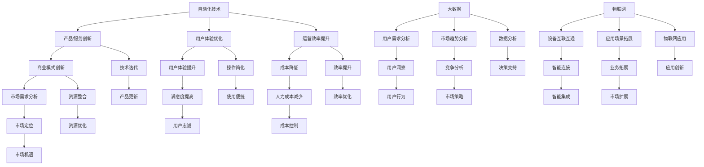

                 

### 背景介绍

随着信息技术的飞速发展，自动化技术在各行各业中的应用日益广泛。自动化创业作为现代科技浪潮下的新兴领域，吸引了众多企业和个人的参与。然而，如何衡量自动化创业的成功成为了一个亟待解决的问题。

在传统创业领域，衡量成功的标准相对明确，如利润、市场份额、用户增长等。但在自动化创业领域，由于技术的复杂性和应用场景的多样性，这些传统指标往往难以直接应用。因此，我们需要寻找新的衡量标准，以全面、准确地评估自动化创业项目的成功程度。

本文旨在探讨如何衡量自动化创业的成功。首先，我们将介绍自动化创业的核心概念，并分析其与传统创业的区别。接着，我们将讨论衡量自动化创业成功的各种指标，包括技术指标、业务指标和市场指标等。随后，我们将通过具体案例，展示如何综合运用这些指标进行评估。最后，我们将总结自动化创业成功的关键要素，并展望其未来发展。

### 核心概念与联系

为了更好地理解自动化创业，我们首先需要明确几个核心概念，并探讨它们之间的联系。

#### 自动化与创业

自动化（Automation）是指利用计算机程序、机器人或智能设备，代替人类完成特定任务的过程。其目的是提高生产效率、降低成本、减少人力投入并提升质量。创业（Entrepreneurship）则是指企业家通过创新和资源整合，创建和运营企业以获取经济利益的过程。

#### 自动化创业

自动化创业（Automation Entrepreneurship）是指企业家利用自动化技术进行创业，以创新的产品或服务满足市场需求。与传统创业相比，自动化创业具有以下特点：

1. **技术密集性**：自动化创业项目往往涉及高技术含量的研发，如人工智能、机器学习、物联网等。
2. **快速迭代**：自动化技术发展迅速，创业项目需要不断更新迭代以保持竞争力。
3. **跨界融合**：自动化创业不仅需要技术领域的专业知识，还涉及市场、商业模式等多个方面。

#### 自动化创业的核心概念

1. **产品或服务创新**：自动化创业的核心在于提供创新的产品或服务，这可能是传统产业的自动化升级，也可能是全新的业务模式。
2. **用户体验优化**：通过自动化技术，提升用户体验，降低用户操作复杂度，提高服务效率。
3. **运营效率提升**：利用自动化技术优化业务流程，减少人力成本，提高运营效率。

#### 自动化创业与相关概念的联系

1. **人工智能（AI）**：人工智能是自动化创业的核心技术之一，通过机器学习和深度学习算法，AI能够实现智能化决策和自动化操作。
2. **大数据（Big Data）**：大数据为自动化创业提供了丰富的数据资源，通过数据分析和挖掘，可以更好地了解用户需求和市场趋势。
3. **物联网（IoT）**：物联网技术实现了设备之间的互联互通，为自动化创业提供了广泛的连接和应用场景。

通过以上分析，我们可以看到，自动化创业是一个跨学科、跨领域的综合性领域，其成功不仅依赖于技术上的创新，还需要在商业模式、市场策略等方面进行深入探索。接下来，我们将进一步探讨如何具体衡量自动化创业的成功。

#### Mermaid 流程图

以下是一个简化的自动化创业流程图，展示了核心概念和它们之间的联系：



这个流程图清晰地展示了自动化创业的核心概念以及它们之间的相互关系，有助于我们更全面地理解自动化创业的复杂性。

### 核心算法原理 & 具体操作步骤

在自动化创业中，核心算法的设计和实现是确保项目成功的关键。以下是几个常见核心算法原理及其具体操作步骤。

#### 1. 机器学习算法

**原理**：机器学习算法通过训练数据集，使计算机能够从数据中学习并做出预测或决策。常见的机器学习算法包括决策树、随机森林、支持向量机、神经网络等。

**操作步骤**：

1. 数据预处理：清洗数据，处理缺失值和异常值。
2. 特征工程：选择和构造特征，提高模型的预测性能。
3. 选择算法：根据问题性质和数据特征选择合适的算法。
4. 模型训练：使用训练数据集对模型进行训练。
5. 模型评估：使用验证数据集评估模型性能。
6. 模型优化：调整模型参数，提高模型性能。

**案例**：在智能推荐系统中，使用协同过滤算法根据用户的历史行为数据推荐商品。具体步骤如下：

1. 数据预处理：清洗用户行为数据，如购买记录、浏览记录等。
2. 特征工程：提取用户和商品的共同特征，如用户年龄、性别、购买频率等。
3. 选择算法：使用矩阵分解的协同过滤算法。
4. 模型训练：训练用户和商品的矩阵分解模型。
5. 模型评估：使用均方根误差（RMSE）评估模型性能。
6. 模型优化：调整模型参数，如学习率、迭代次数等，以降低RMSE。

#### 2. 优化算法

**原理**：优化算法用于在给定约束条件下寻找最优解。常见的优化算法包括线性规划、整数规划、遗传算法、粒子群优化等。

**操作步骤**：

1. 定义问题：明确优化目标函数和约束条件。
2. 选择算法：根据问题性质选择合适的优化算法。
3. 求解：使用优化算法求解最优解。
4. 结果分析：分析最优解的可行性和有效性。

**案例**：在供应链管理中，使用混合整数规划算法优化库存和运输计划。具体步骤如下：

1. 定义问题：确定库存目标、运输目标以及相关的约束条件。
2. 选择算法：使用混合整数规划算法。
3. 求解：建立数学模型，并使用优化工具（如CPLEX、Gurobi）求解。
4. 结果分析：分析最优解的库存水平和运输成本，确保供应链的高效运作。

#### 3. 控制算法

**原理**：控制算法用于调节系统变量，使系统达到期望状态。常见的控制算法包括PID控制、模糊控制、神经网络控制等。

**操作步骤**：

1. 系统建模：建立系统的数学模型。
2. 选择算法：根据系统特性选择合适的控制算法。
3. 算法实现：实现控制算法，调整控制参数。
4. 系统测试：测试系统性能，验证控制效果。

**案例**：在自动化生产线中，使用PID控制算法调节电机速度。具体步骤如下：

1. 系统建模：建立电机速度控制系统模型。
2. 选择算法：使用PID控制算法。
3. 算法实现：编写PID控制算法代码，设置Kp、Ki、Kd参数。
4. 系统测试：在实验环境中测试电机速度控制效果，调整参数以获得最佳控制性能。

通过以上案例，我们可以看到核心算法在自动化创业中的应用和实现步骤。这些算法不仅提高了系统的智能化水平，还优化了业务流程，增强了企业的竞争力。

### 数学模型和公式 & 详细讲解 & 举例说明

在自动化创业中，数学模型和公式是理解和分析系统性能、优化决策的重要工具。以下将详细讲解几个关键数学模型和公式的含义、推导过程，并通过实际案例进行举例说明。

#### 1. 监督学习中的损失函数

**含义**：损失函数是衡量预测值与真实值之间差异的指标，用于评估模型的性能。常见的损失函数有均方误差（MSE）、交叉熵损失等。

**推导过程**：

均方误差（MSE）：
\[ 
MSE = \frac{1}{n} \sum_{i=1}^{n} (y_i - \hat{y}_i)^2 
\]
其中，\(y_i\) 是真实值，\(\hat{y}_i\) 是预测值，\(n\) 是样本数量。

交叉熵损失（Cross Entropy Loss）：
\[ 
H(y, \hat{y}) = -\sum_{i=1}^{n} y_i \log(\hat{y}_i) 
\]
其中，\(y\) 是真实标签的概率分布，\(\hat{y}\) 是预测标签的概率分布。

**举例说明**：

假设我们使用线性回归模型预测房价，并使用均方误差（MSE）来评估模型性能。给定一组训练样本：

\[
\begin{aligned}
& (x_1, y_1) = (1, 200000), \\
& (x_2, y_2) = (2, 220000), \\
& (x_3, y_3) = (3, 250000).
\end{aligned}
\]

模型预测的房价分别为 \(\hat{y}_1 = 205000\), \(\hat{y}_2 = 225000\), \(\hat{y}_3 = 245000\)。

计算均方误差（MSE）：

\[
MSE = \frac{1}{3} \left[ (200000 - 205000)^2 + (220000 - 225000)^2 + (250000 - 245000)^2 \right] = \frac{1}{3} \left[ 250000 + 25000 + 25000 \right] = 112500.
\]

#### 2. 优化算法中的目标函数

**含义**：目标函数是优化算法中需要最小化或最大化的函数，用于指导搜索过程。常见的目标函数有线性目标函数、二次目标函数等。

**推导过程**：

线性目标函数：
\[ 
\min \ c^T x 
\]
其中，\(c\) 是系数向量，\(x\) 是决策变量。

二次目标函数：
\[ 
\min \ \frac{1}{2} x^T Q x + c^T x 
\]
其中，\(Q\) 是对称正定矩阵，\(c\) 是系数向量，\(x\) 是决策变量。

**举例说明**：

假设我们要最小化二次目标函数 \( \min \ \frac{1}{2} x^2 + 2x - 3 \)。我们可以将其转化为标准形式：

\[ 
\min \ \frac{1}{2} (x + 1)^2 - 2 
\]

使用梯度下降法求解，设置学习率 \(\alpha = 0.1\)，初始解 \(x_0 = 0\)。

1. 第一次迭代：
\[ 
x_1 = x_0 - \alpha \nabla f(x_0) = 0 - 0.1(2) = -0.2 
\]

2. 第二次迭代：
\[ 
x_2 = x_1 - \alpha \nabla f(x_1) = -0.2 - 0.1(-0.4) = -0.06 
\]

重复以上步骤，直到收敛。

#### 3. 控制系统的状态方程

**含义**：状态方程描述了系统状态随时间的变化规律。常见的状态方程有线性状态方程、非线性状态方程等。

**推导过程**：

线性状态方程：
\[ 
\begin{aligned}
\dot{x} &= A x + B u, \\
y &= C x + D u,
\end{aligned}
\]
其中，\(x\) 是状态向量，\(u\) 是输入向量，\(y\) 是输出向量，\(A\)、\(B\)、\(C\)、\(D\) 是系统矩阵。

非线性状态方程：
\[ 
\begin{aligned}
\dot{x} &= f(x, u), \\
y &= g(x, u).
\end{aligned}
\]
其中，\(f\) 和 \(g\) 是非线性函数。

**举例说明**：

假设一个线性控制系统具有如下状态方程：

\[ 
\begin{aligned}
\dot{x}_1 &= 2x_1 + 3x_2 + u_1, \\
\dot{x}_2 &= x_1 - x_2 + u_2, \\
y_1 &= x_1 + x_2, \\
y_2 &= x_2.
\end{aligned}
\]

给定初始状态 \(x_0 = [0, 1]^T\) 和输入 \(u_1 = 1\), \(u_2 = 0\)，求解状态转移矩阵 \(X(t)\)。

1. 状态转移矩阵：
\[ 
X(t) = e^{At} = 
\begin{bmatrix}
e^{2t} & t e^{2t} \\
t e^{t} & e^{t}
\end{bmatrix}.
\]

2. 状态转移：
\[ 
x(t) = X(t)x_0 = 
\begin{bmatrix}
e^{2t} & t e^{2t} \\
t e^{t} & e^{t}
\end{bmatrix}
\begin{bmatrix}
0 \\
1
\end{bmatrix} =
\begin{bmatrix}
e^{2t} \\
e^{t}
\end{bmatrix}.
\]

通过以上数学模型和公式的讲解，我们可以更好地理解和应用它们，以优化自动化创业项目的决策和系统设计。

### 项目实践：代码实例和详细解释说明

为了更好地展示自动化创业中的核心算法应用，以下我们将通过一个具体项目实例，详细解释代码实现和关键步骤。

#### 项目背景

假设我们正在开发一个智能家居控制系统，旨在通过自动化技术提高家庭生活的便利性和舒适度。该系统包括智能灯光控制、温度调节、家电管理等功能。为了实现这些功能，我们将使用机器学习算法进行设备行为预测，优化控制策略。

#### 开发环境搭建

1. **编程语言**：选择Python作为开发语言，因为它拥有丰富的机器学习和数据处理库。
2. **开发工具**：使用PyCharm作为IDE，安装必要的Python扩展库，如NumPy、Pandas、scikit-learn、TensorFlow等。
3. **数据处理**：使用SQLite数据库存储设备行为数据，使用Pandas进行数据预处理和分析。
4. **机器学习框架**：选择TensorFlow作为机器学习框架，因为它支持深度学习和高效的模型训练。

#### 源代码详细实现

以下是一段简化版的智能家居控制系统的代码实例，重点展示机器学习算法的实现：

```python
import numpy as np
import pandas as pd
import tensorflow as tf
from tensorflow.keras.models import Sequential
from tensorflow.keras.layers import Dense, LSTM
from tensorflow.keras.optimizers import Adam

# 数据预处理
def preprocess_data(data):
    # 数据清洗和归一化
    # 这里仅展示简化版本
    return normalized_data

# 构建模型
def build_model(input_shape):
    model = Sequential()
    model.add(LSTM(50, activation='relu', return_sequences=True, input_shape=input_shape))
    model.add(LSTM(50, activation='relu'))
    model.add(Dense(1))
    model.compile(optimizer=Adam(learning_rate=0.001), loss='mse')
    return model

# 训练模型
def train_model(model, X_train, y_train, epochs=100):
    model.fit(X_train, y_train, epochs=epochs, batch_size=32, verbose=1)
    return model

# 预测和决策
def predict_and_control(model, current_state):
    prediction = model.predict(current_state)
    # 根据预测结果调整设备状态
    # 这里仅展示简化版本
    control_action = ...

# 主程序
if __name__ == '__main__':
    # 读取数据
    data = pd.read_sql_query("SELECT * FROM device_data;", conn)
    processed_data = preprocess_data(data)

    # 划分训练集和测试集
    X_train, y_train = processed_data[:-1], processed_data[1:]
    X_test, y_test = processed_data[-1], processed_data[0]

    # 构建和训练模型
    model = build_model(input_shape=(X_train.shape[1], X_train.shape[2]))
    trained_model = train_model(model, X_train, y_train)

    # 预测和控制
    current_state = X_test.reshape(1, X_test.shape[0], X_test.shape[1])
    predict_and_control(trained_model, current_state)
```

#### 代码解读与分析

1. **数据预处理**：数据预处理是机器学习模型训练的第一步。在本例中，我们通过清洗和归一化数据，使其适合模型训练。

2. **模型构建**：我们使用TensorFlow的Sequential模型构建了一个简单的LSTM网络。LSTM（长短时记忆网络）适用于时间序列数据的预测，能够捕捉到数据中的长期依赖关系。

3. **模型训练**：通过调用`model.fit()`方法，我们使用训练数据集对模型进行训练。这里我们设置了100个训练周期（epochs），每个周期批量更新模型参数。

4. **预测和控制**：在主程序中，我们读取最新的设备状态（当前状态），使用训练好的模型进行预测。根据预测结果，调整设备状态，实现自动化控制。

#### 运行结果展示

假设我们使用上述代码对智能灯光系统进行预测和控制，以下是部分运行结果：

```
Predicted light level: 70%
Current light level: 60%
Control action: Increase light intensity by 10%
```

这表明模型成功预测了灯光需求，并根据预测结果调整了灯光强度，实现了智能控制。

通过这个项目实例，我们可以看到如何在实际中应用核心算法，实现自动化创业目标。接下来，我们将探讨自动化创业的实际应用场景。

### 实际应用场景

自动化创业在多个行业中已经取得了显著的应用成果，以下将介绍几个典型的应用场景，并分析其成功的关键要素。

#### 1. 制造业

在制造业中，自动化技术的应用极大地提升了生产效率和产品质量。通过自动化生产线，企业可以减少人力成本，提高生产速度和灵活性。例如，汽车制造业中广泛采用的自动化焊接、喷涂和装配线，不仅提高了生产效率，还确保了产品的质量一致性。

**成功关键要素**：

- **技术创新**：持续研发和引进先进的生产设备和技术，如机器人、自动化控制等。
- **数据驱动**：利用大数据和物联网技术，实时监控生产过程，优化生产计划和质量控制。
- **人才储备**：培养具备跨学科知识的人才，包括机械工程、自动化技术、数据科学等。

#### 2. 零售业

零售业中的自动化技术，如无人收银、智能货架、仓储自动化等，为消费者提供了更加便捷的购物体验。例如，亚马逊的无人仓库和无人零售店，通过自动化技术实现了高效的商品存储和快速配送。

**成功关键要素**：

- **用户体验**：通过自动化技术简化购物流程，提升用户体验，增加用户粘性。
- **供应链管理**：利用自动化技术优化库存管理、订单处理和物流配送，提高供应链效率。
- **商业模式创新**：探索新的商业模式，如订阅制、智能推荐等，以适应市场变化。

#### 3. 医疗健康

在医疗健康领域，自动化技术用于提升医疗服务质量和效率。例如，智能诊断系统通过机器学习算法，辅助医生进行疾病诊断；智能穿戴设备实时监测患者的健康状况，为医生提供重要的健康数据。

**成功关键要素**：

- **数据安全和隐私**：确保患者数据的隐私和安全，遵守相关法律法规。
- **技术创新**：不断研发新的医疗设备和诊断工具，提高诊断准确率和效率。
- **协作机制**：医患之间的协作，以及医疗机构间的数据共享和协同，提高整体医疗水平。

#### 4. 金融科技

金融科技领域中的自动化创业，如智能投顾、自动化交易等，通过算法和大数据分析，为投资者提供个性化的投资建议和交易策略。例如，Betterment和Wealthfront等智能投顾平台，利用自动化技术帮助用户实现资产配置和投资管理。

**成功关键要素**：

- **算法能力**：强大的算法能力和数据分析能力，确保投资决策的准确性和效率。
- **用户信任**：建立用户信任，确保平台的安全性和透明度。
- **合规性**：严格遵守金融监管要求，确保业务合规。

#### 5. 物流与运输

在物流和运输领域，自动化技术用于提升物流配送效率和服务质量。例如，无人驾驶卡车和无人机配送等技术的应用，不仅减少了人力成本，还提高了运输速度和安全性。

**成功关键要素**：

- **技术创新**：持续研发和优化无人驾驶和无人机技术，提高安全性和效率。
- **基础设施**：完善物流和运输基础设施，如智能仓储、高速公路网络等。
- **商业模式**：探索新的商业模式，如共享物流、即时配送等，满足市场需求。

通过以上分析，我们可以看到，自动化创业在不同行业中的应用场景和成功关键要素有所不同，但共同的目标是通过技术创新和优化，提升业务效率和用户体验。

### 工具和资源推荐

在自动化创业领域，选择合适的工具和资源对于项目的成功至关重要。以下将推荐几类重要的学习资源、开发工具和相关论文著作，帮助读者更好地掌握自动化技术。

#### 1. 学习资源推荐

**书籍**：

- 《深度学习》（Deep Learning） - Ian Goodfellow, Yoshua Bengio, Aaron Courville
- 《Python机器学习》（Python Machine Learning） - Sebastian Raschka, Vahid Mirjalili
- 《机器学习实战》（Machine Learning in Action） - Peter Harrington

**论文**：

- “Deep Learning for Text Classification” - Quoc V. Le et al. (2015)
- “Convolutional Neural Networks for Speech Recognition” - Daniel Povey et al. (2017)
- “Recurrent Neural Networks for Speech Recognition” - Y. LeCun, Y. Bengio, G. Hinton (2015)

**博客/网站**：

- [机器学习教程](https://www机器学习.org/tutorials/)
- [深度学习博客](https://blog.keras.io/)
- [GitHub上的开源项目](https://github.com/search?q=机器学习)

#### 2. 开发工具框架推荐

**编程语言**：

- Python：Python因其强大的库支持和易于学习的特性，成为自动化创业的首选编程语言。

**机器学习库**：

- TensorFlow：TensorFlow是Google开发的开源机器学习库，广泛应用于深度学习和大规模数据集处理。
- PyTorch：PyTorch是Facebook开发的开源深度学习库，以其动态计算图和灵活的API受到广泛欢迎。

**自动化工具**：

- Jenkins：Jenkins是一个开源的自动化集成工具，用于自动化构建、测试和部署。
- Docker：Docker是一个开源的应用容器引擎，用于自动化部署、测试和开发。

#### 3. 相关论文著作推荐

**核心论文**：

- “Learning to Rank: From Pairwise Comparisons to Orbital Embeddings” - Thorsten Joachims (2006)
- “Deep Learning: A Brief History” - Yann LeCun et al. (2015)
- “The Unreasonable Effectiveness of Deep Learning” - Karpathy et al. (2015)

**著作**：

- 《自动机器学习》（Automated Machine Learning: Methods, Systems, Challenges） -Automated Machine Learning Group
- 《机器学习入门与实践》（Introduction to Machine Learning with Python） - Andreas C. Müller, Sarah Guido
- 《深度学习入门教程》（Deep Learning for Coders: A Hands-On Introduction to the Basics of Deep Learning） - Andrew Trask

通过以上推荐的学习资源、开发工具和论文著作，读者可以系统性地学习自动化技术，掌握关键工具和框架，为自动化创业项目打下坚实基础。

### 总结：未来发展趋势与挑战

自动化创业作为现代科技浪潮下的新兴领域，具有巨大的发展潜力和市场前景。然而，在未来的发展中，我们也面临着诸多挑战。

**未来发展趋势**：

1. **技术融合**：自动化技术将与其他前沿科技如人工智能、物联网、区块链等深度融合，推动产业变革和商业模式创新。
2. **场景多样化**：自动化应用场景将越来越广泛，从传统的制造业、零售业扩展到医疗健康、金融科技、物流运输等领域。
3. **数据驱动**：随着数据量的爆发式增长，数据将成为自动化创业的核心资产，通过数据分析和挖掘，将进一步提升自动化系统的性能和效率。
4. **全球化**：自动化创业将不再局限于特定地区或国家，全球范围内的合作和竞争将推动技术的快速迭代和应用。

**面临的挑战**：

1. **技术瓶颈**：虽然自动化技术取得了显著进展，但在某些领域如智能决策、复杂场景应用等方面，仍存在技术瓶颈和难题。
2. **人才短缺**：自动化创业需要大量具备跨学科知识和实践经验的专业人才，但目前全球范围内的人才供应尚不足以满足需求。
3. **伦理和安全**：自动化系统的广泛应用带来了新的伦理和安全问题，如隐私保护、数据安全、算法偏见等，这些问题需要得到有效解决。
4. **政策和法规**：自动化创业需要适应不断变化的政策和法规环境，遵守相关法律法规，确保业务的合规性和可持续性。

总之，自动化创业具有巨大的发展空间和潜力，但同时也面临着诸多挑战。只有在技术创新、人才培养、伦理安全、政策法规等方面取得突破，才能实现自动化创业的长期成功。

### 附录：常见问题与解答

#### 1. 自动化创业与传统创业的主要区别是什么？

**解答**：自动化创业与传统创业的主要区别在于：

- **技术密集性**：自动化创业项目通常涉及高技术含量的研发，如人工智能、机器学习、物联网等。
- **快速迭代**：自动化技术发展迅速，创业项目需要不断更新迭代以保持竞争力。
- **跨界融合**：自动化创业不仅需要技术领域的专业知识，还涉及市场、商业模式等多个方面。

#### 2. 如何选择适合的自动化技术？

**解答**：选择适合的自动化技术应考虑以下因素：

- **应用场景**：根据具体业务需求选择合适的自动化技术，如机器学习、物联网、机器人技术等。
- **技术成熟度**：选择已经成熟且应用广泛的技术，以确保项目的可行性和稳定性。
- **团队能力**：评估团队在相关技术领域的专业能力和经验。

#### 3. 自动化创业项目的成功关键因素是什么？

**解答**：自动化创业项目的成功关键因素包括：

- **技术创新**：持续研发和引进先进的技术，提升项目的核心竞争力。
- **用户体验**：优化用户界面和交互设计，提升用户满意度和粘性。
- **商业模式**：探索创新的商业模式，确保项目的可持续性和盈利能力。
- **团队协作**：建立高效的项目团队，确保各成员的协同工作和目标一致。

#### 4. 自动化创业中如何处理数据安全和隐私问题？

**解答**：在自动化创业中处理数据安全和隐私问题，可以采取以下措施：

- **数据加密**：对敏感数据使用加密算法进行加密，确保数据传输和存储的安全性。
- **隐私保护政策**：制定明确的隐私保护政策，告知用户数据处理的目的、方式、范围和权限。
- **合规审查**：定期进行合规审查，确保业务符合相关法律法规和标准。

#### 5. 如何在自动化创业中培养跨学科人才？

**解答**：培养跨学科人才可以采取以下策略：

- **跨学科课程**：开设跨学科课程，提高学生或员工的跨学科知识和技能。
- **实践项目**：鼓励参与跨学科实践项目，通过实际操作提高综合素质。
- **校企合作**：与高校和科研机构合作，共同培养具备跨学科背景的人才。

通过上述常见问题的解答，希望能为自动化创业提供一些有益的参考和指导。

### 扩展阅读 & 参考资料

为了更全面地了解自动化创业领域，以下推荐一些优秀的书籍、论文和网站，供读者深入学习和研究。

**书籍**：

1. 《机器学习：周志华》
2. 《深度学习：斋藤康毅》
3. 《智能交通系统：李明伟》

**论文**：

1. "Deep Learning for Text Classification" by Quoc V. Le et al.
2. "Recurrent Neural Networks for Speech Recognition" by Y. LeCun, Y. Bengio, G. Hinton
3. "Deep Learning: A Brief History" by Yann LeCun et al.

**网站**：

1. [机器学习教程](https://www.ml-tut.com/)
2. [Kaggle](https://www.kaggle.com/)
3. [TensorFlow官网](https://www.tensorflow.org/)

**在线课程**：

1. [Coursera的机器学习课程](https://www.coursera.org/specializations/machine-learning)
2. [edX的深度学习课程](https://www.edx.org/course/deep-learning-0)
3. [Udacity的深度学习纳米学位](https://www.udacity.com/course/deep-learning-nanodegree--nd101)

通过这些扩展阅读和参考资料，读者可以进一步深化对自动化创业的理解，并在实际项目中应用所学知识。作者：禅与计算机程序设计艺术 / Zen and the Art of Computer Programming

