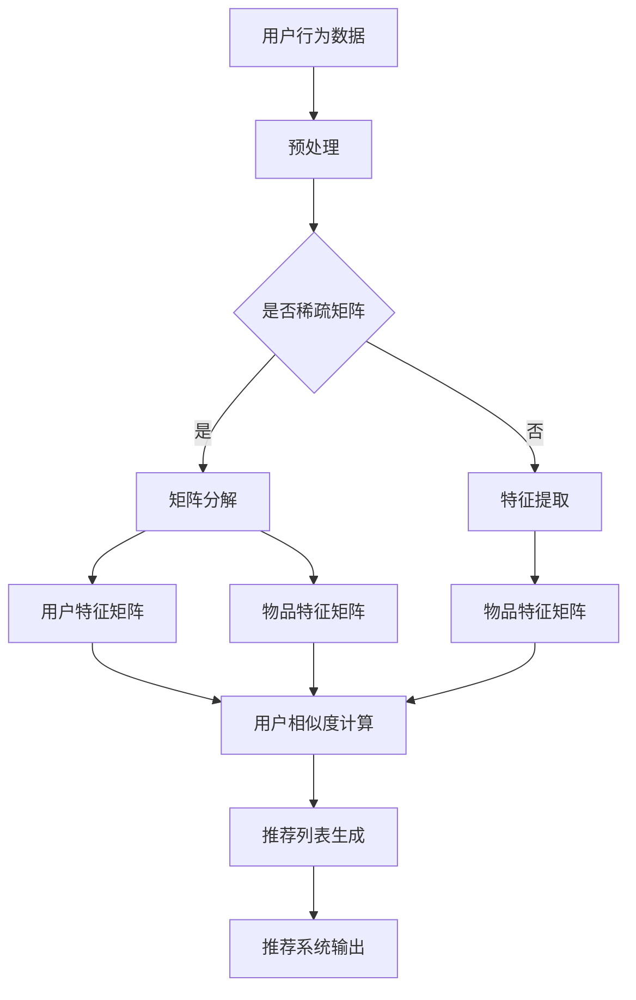

                 

### 1. 背景介绍

在当今信息爆炸的时代，推荐系统作为数据驱动的决策工具，已经在众多领域取得了显著的成功。无论是电商平台的个性化推荐，社交媒体的动态内容推送，还是视频网站的智能推荐，推荐系统的出现都极大地提升了用户体验，提高了平台的粘性和用户留存率。

推荐系统的核心在于如何从海量的数据中提取有价值的信息，并将这些信息准确地推送给用户，从而满足用户的需求，提高用户的满意度。然而，设计一个既高效又能吸引用户的推荐计划并非易事，它涉及到数据挖掘、机器学习、信息论等多个领域的知识。

本文将深入探讨如何设计一个有吸引力的推荐计划。首先，我们将介绍推荐系统的基本概念和常见类型，然后分析其设计过程中需要考虑的关键因素。接下来，我们将探讨一些核心算法和数学模型，以及如何在实践中应用这些算法和模型。最后，我们将讨论推荐系统的实际应用场景，并提供一些实用的工具和资源推荐。

通过这篇文章，读者将了解到推荐系统的设计原则和方法，掌握从理论到实践的全过程，为在实际项目中设计高效的推荐系统奠定基础。

### 2. 核心概念与联系

要设计一个有吸引力的推荐计划，首先需要理解推荐系统的核心概念和基本原理。下面我们将详细介绍几个关键概念，并使用Mermaid流程图展示推荐系统的基本架构和关键节点。

#### 2.1 核心概念

1. **用户-物品评分矩阵**：这是推荐系统的基本数据来源。用户与物品之间的评分矩阵通常是一个高维稀疏矩阵，其中每个元素表示一个用户对某个物品的评分。

2. **协同过滤**：协同过滤是推荐系统中最常用的方法之一，它基于用户的评分历史，通过找到与目标用户相似的用户或物品来推荐新的物品。

3. **矩阵分解**：矩阵分解是一种降维技术，通过将用户-物品评分矩阵分解成用户特征矩阵和物品特征矩阵，从而实现推荐。

4. **内容推荐**：与协同过滤不同，内容推荐基于物品的属性和特征，通过分析用户的历史行为和偏好，找到与用户兴趣相关的物品。

5. **混合推荐**：结合协同过滤和内容推荐的方法，通过融合两种推荐策略的优点，提高推荐的准确性和吸引力。

#### 2.2 推荐系统基本架构

以下是一个简单的推荐系统基本架构的Mermaid流程图：



在上述流程图中：

- **A 用户行为数据**：包括用户对物品的评分、点击、购买等行为数据。
- **B 预处理**：对原始数据进行清洗、去噪、缺失值处理等。
- **C 判断是否稀疏矩阵**：如果评分矩阵是稀疏的，则使用矩阵分解；否则，使用特征提取方法。
- **D 矩阵分解**：使用矩阵分解算法（如Singular Value Decomposition，SVD）将评分矩阵分解成用户特征矩阵和物品特征矩阵。
- **E 特征提取**：通过构建特征词、标签等方式提取物品的属性特征。
- **F 用户特征矩阵**：存储经过矩阵分解后的用户特征。
- **G 物品特征矩阵**：存储经过矩阵分解或特征提取后的物品特征。
- **H 物品特征矩阵**：如果使用特征提取方法，则包含提取后的物品特征。
- **I 用户相似度计算**：计算用户之间的相似度，可以使用余弦相似度、皮尔逊相关系数等方法。
- **J 推荐列表生成**：基于用户相似度和物品特征，生成推荐列表。
- **K 推荐系统输出**：输出最终的推荐结果。

通过这个流程图，我们可以清晰地看到推荐系统的基本架构和各个关键节点。接下来，我们将详细讨论如何选择合适的算法和模型来设计一个有吸引力的推荐计划。

#### 2.3 选择合适算法和模型

设计推荐系统时，选择合适的算法和模型至关重要。以下是一些常用的推荐算法和模型，以及它们的优缺点：

1. **基于用户的协同过滤（User-Based Collaborative Filtering）**：
   - **原理**：通过计算用户之间的相似度，找到与目标用户相似的其他用户，然后将这些用户喜欢的但目标用户未购买的物品推荐给目标用户。
   - **优点**：能够根据用户的行为历史进行推荐，灵活性高。
   - **缺点**：当用户数量非常多时，计算用户相似度的时间复杂度很高，且可能存在数据稀疏问题。

2. **基于模型的协同过滤（Model-Based Collaborative Filtering）**：
   - **原理**：使用机器学习算法（如矩阵分解、潜在因子模型）预测用户对未评分物品的评分，从而生成推荐列表。
   - **优点**：能够处理数据稀疏问题，预测准确性高。
   - **缺点**：需要大量的训练数据和计算资源，且模型的选择和调优较为复杂。

3. **基于内容的推荐（Content-Based Recommendation）**：
   - **原理**：通过分析用户的历史行为和偏好，提取出用户感兴趣的特征词或标签，然后找到与用户兴趣相关的物品进行推荐。
   - **优点**：能够根据物品的内容特征进行推荐，用户感知度高。
   - **缺点**：当用户的历史行为数据较少时，推荐效果可能较差。

4. **混合推荐（Hybrid Recommendation）**：
   - **原理**：结合协同过滤和内容推荐的方法，综合两者的优点，提高推荐的准确性和吸引力。
   - **优点**：能够平衡协同过滤和内容推荐的优缺点，提高推荐效果。
   - **缺点**：实现复杂，需要综合考虑多种算法和模型。

在选择算法和模型时，需要根据具体的应用场景和数据特点进行权衡。例如，如果用户行为数据丰富且用户数量适中，可以优先考虑基于用户的协同过滤和混合推荐；如果用户行为数据稀疏，则可以考虑基于内容的推荐和基于模型的协同过滤。

总之，推荐系统的设计需要综合考虑多种因素，包括用户行为数据、算法模型的复杂度、计算资源的限制等。通过合理选择和组合算法和模型，可以设计出一个既高效又具有吸引力的推荐计划。

### 3. 核心算法原理 & 具体操作步骤

在设计推荐系统时，选择合适的算法并理解其工作原理至关重要。以下将详细介绍几种常用的推荐算法的原理，并给出具体的操作步骤。

#### 3.1 基于用户的协同过滤算法

**原理**：基于用户的协同过滤算法通过计算用户之间的相似度，找到与目标用户相似的其他用户，然后将这些用户喜欢的但目标用户未购买的物品推荐给目标用户。

**操作步骤**：

1. **计算用户相似度**：可以使用余弦相似度、皮尔逊相关系数等方法计算用户之间的相似度。以余弦相似度为例，公式如下：

   $$ \text{相似度}(u, v) = \frac{\sum_{i \in I} r_{ui} r_{vi}}{\sqrt{\sum_{i \in I} r_{ui}^2} \sqrt{\sum_{i \in I} r_{vi}^2}} $$

   其中，$r_{ui}$ 表示用户 $u$ 对物品 $i$ 的评分，$I$ 表示用户 $u$ 和用户 $v$ 都评过分的物品集合。

2. **生成推荐列表**：根据用户相似度，找到与目标用户最相似的 $k$ 个用户（$k$ 为预定义的阈值），然后将这些用户共同喜欢的但目标用户未购买的物品推荐给目标用户。

   推荐物品的评分预测值可以使用以下公式计算：

   $$ \hat{r}_{ui} = \sum_{v \in \text{邻居}(u)} \text{相似度}(u, v) \cdot r_{vi} $$

3. **处理稀疏数据**：对于评分矩阵稀疏的情况，可以采用用户聚类或降维技术，如K-Means算法，将用户分为不同的簇，然后仅计算同一簇内用户的相似度。

#### 3.2 基于模型的协同过滤算法

**原理**：基于模型的协同过滤算法使用机器学习算法（如矩阵分解、潜在因子模型）预测用户对未评分物品的评分，从而生成推荐列表。

**操作步骤**：

1. **矩阵分解**：使用矩阵分解（如Singular Value Decomposition，SVD）将用户-物品评分矩阵分解为用户特征矩阵和物品特征矩阵。以SVD为例，公式如下：

   $$ R = U \Sigma V^T $$

   其中，$R$ 表示用户-物品评分矩阵，$U$ 和 $V$ 分别表示用户特征矩阵和物品特征矩阵，$\Sigma$ 表示奇异值矩阵。

2. **生成预测评分**：利用用户特征矩阵和物品特征矩阵计算用户对未评分物品的预测评分。公式如下：

   $$ \hat{r}_{ui} = u_i \cdot v_j $$

   其中，$u_i$ 表示用户 $u$ 的特征向量，$v_j$ 表示物品 $j$ 的特征向量。

3. **生成推荐列表**：根据预测评分，为每个用户生成一个推荐列表，可以选择预测评分最高的物品进行推荐。

#### 3.3 基于内容的推荐算法

**原理**：基于内容的推荐算法通过分析用户的历史行为和偏好，提取出用户感兴趣的特征词或标签，然后找到与用户兴趣相关的物品进行推荐。

**操作步骤**：

1. **特征提取**：从用户的历史行为中提取特征词或标签。例如，对于商品推荐，可以从商品的标题、描述、类别等属性中提取关键词或标签。

2. **计算相似度**：计算用户兴趣特征和物品特征之间的相似度。可以使用余弦相似度、Jaccard相似度等方法。公式如下：

   $$ \text{相似度}(u, i) = \frac{\text{共同特征数}}{\min(|u|, |i|)} $$

   其中，$|u|$ 和 $|i|$ 分别表示用户兴趣特征和物品特征的维度。

3. **生成推荐列表**：根据相似度分数，为用户生成推荐列表，可以选择相似度最高的物品进行推荐。

#### 3.4 混合推荐算法

**原理**：混合推荐算法结合协同过滤和内容推荐的方法，综合两者的优点，提高推荐的准确性和吸引力。

**操作步骤**：

1. **协同过滤**：首先使用基于用户的协同过滤算法生成初步推荐列表。

2. **内容推荐**：使用基于内容的推荐算法为每个用户生成一个基于内容的推荐列表。

3. **融合推荐列表**：将协同过滤和内容推荐的推荐列表进行融合，可以采用加权平均、投票等方法。公式如下：

   $$ \text{推荐列表}(u) = w_1 \cdot \text{协同过滤列表}(u) + w_2 \cdot \text{内容推荐列表}(u) $$

   其中，$w_1$ 和 $w_2$ 分别为协同过滤和内容推荐的权重。

通过以上操作步骤，我们可以设计出一个基于多种算法和模型的推荐系统，从而提高推荐的准确性和用户满意度。接下来，我们将讨论推荐系统的数学模型和公式，并详细讲解这些模型在实际应用中的具体实现。

### 4. 数学模型和公式 & 详细讲解 & 举例说明

在推荐系统中，数学模型和公式起到了至关重要的作用。这些模型和公式帮助我们理解用户行为、预测评分，并生成有效的推荐列表。以下我们将详细介绍几种常用的数学模型和公式，并结合具体示例进行说明。

#### 4.1 用户相似度计算

在基于用户的协同过滤算法中，计算用户相似度是推荐系统的基础。常用的相似度计算方法有余弦相似度和皮尔逊相关系数。

1. **余弦相似度**：

   余弦相似度衡量了两个向量之间的夹角余弦值，公式如下：

   $$ \text{相似度}(u, v) = \frac{\sum_{i \in I} r_{ui} r_{vi}}{\sqrt{\sum_{i \in I} r_{ui}^2} \sqrt{\sum_{i \in I} r_{vi}^2}} $$

   其中，$r_{ui}$ 表示用户 $u$ 对物品 $i$ 的评分，$I$ 表示用户 $u$ 和用户 $v$ 都评过分的物品集合。

   **示例**：假设有两个用户 $u$ 和 $v$，他们对五部电影的评分如下：

   | 物品 | $u$ | $v$ |
   | ---- | --- | --- |
   | 1    | 4   | 1   |
   | 2    | 2   | 3   |
   | 3    | 3   | 4   |
   | 4    | 5   | 5   |
   | 5    | 1   | 2   |

   使用余弦相似度计算 $u$ 和 $v$ 的相似度：

   $$ \text{相似度}(u, v) = \frac{4 \cdot 1 + 2 \cdot 3 + 3 \cdot 4 + 5 \cdot 5 + 1 \cdot 2}{\sqrt{4^2 + 2^2 + 3^2 + 5^2 + 1^2} \sqrt{1^2 + 3^2 + 4^2 + 5^2 + 2^2}} \approx 0.759 $$

2. **皮尔逊相关系数**：

   皮尔逊相关系数衡量了两个变量之间的线性相关程度，公式如下：

   $$ \text{相关系数}(u, v) = \frac{\sum_{i \in I} (r_{ui} - \mu_u) (r_{vi} - \mu_v)}{\sqrt{\sum_{i \in I} (r_{ui} - \mu_u)^2} \sqrt{\sum_{i \in I} (r_{vi} - \mu_v)^2}} $$

   其中，$\mu_u$ 和 $\mu_v$ 分别表示用户 $u$ 和用户 $v$ 的平均评分。

   **示例**：继续使用上面的评分数据，假设所有评分的平均值为 $3$，则用户 $u$ 和用户 $v$ 的皮尔逊相关系数计算如下：

   $$ \text{相关系数}(u, v) = \frac{(4-3)(1-3) + (2-3)(3-3) + (3-3)(4-3) + (5-3)(5-3) + (1-3)(2-3)}{\sqrt{(4-3)^2 + (2-3)^2 + (3-3)^2 + (5-3)^2 + (1-3)^2} \sqrt{(1-3)^2 + (3-3)^2 + (4-3)^2 + (5-3)^2 + (2-3)^2}} \approx 0.759 $$

   可以看到，余弦相似度和皮尔逊相关系数的计算结果非常接近。

#### 4.2 预测评分

在基于模型的协同过滤算法中，预测评分是推荐系统的核心。常用的预测方法包括矩阵分解和潜在因子模型。

1. **矩阵分解**：

   矩阵分解（如Singular Value Decomposition，SVD）将用户-物品评分矩阵分解为用户特征矩阵和物品特征矩阵。预测评分可以使用以下公式：

   $$ \hat{r}_{ui} = u_i \cdot v_j $$

   其中，$u_i$ 表示用户 $u$ 的特征向量，$v_j$ 表示物品 $j$ 的特征向量。

   **示例**：假设我们使用SVD将用户-物品评分矩阵分解为用户特征矩阵 $U$ 和物品特征矩阵 $V$，如下所示：

   | 用户 | 物品1 | 物品2 | 物品3 | 物品4 | 物品5 |
   | ---- | ---- | ---- | ---- | ---- | ---- |
   | $u_1$ | 0.2  | 0.3  | 0.4  | 0.5  | 0.6  |
   | $u_2$ | 0.1  | 0.2  | 0.3  | 0.4  | 0.5  |
   | $u_3$ | 0.3  | 0.4  | 0.5  | 0.6  | 0.7  |

   物品特征矩阵 $V$：

   | 物品1 | 物品2 | 物品3 | 物品4 | 物品5 |
   | ---- | ---- | ---- | ---- | ---- |
   | 0.2  | 0.3  | 0.4  | 0.5  | 0.6  |
   | 0.1  | 0.2  | 0.3  | 0.4  | 0.5  |
   | 0.3  | 0.4  | 0.5  | 0.6  | 0.7  |

   预测用户 $u_3$ 对物品 $v_1$ 的评分：

   $$ \hat{r}_{u_3v_1} = u_{3,1} \cdot v_{1,1} = 0.3 \cdot 0.2 = 0.06 $$

2. **潜在因子模型**：

   潜在因子模型（如Singular Value Decomposition，SVD）通过求解用户和物品的特征向量，预测用户对未评分物品的评分。预测评分可以使用以下公式：

   $$ \hat{r}_{ui} = \sum_{k=1}^K u_{ik} v_{kj} $$

   其中，$u_{ik}$ 和 $v_{kj}$ 分别表示用户 $u$ 对物品 $i$ 的特征向量和物品 $j$ 对物品 $i$ 的特征向量，$K$ 表示潜在因子的数量。

   **示例**：假设我们使用潜在因子模型将用户-物品评分矩阵分解为用户特征矩阵 $U$ 和物品特征矩阵 $V$，如下所示：

   | 用户 | 物品1 | 物品2 | 物品3 | 物品4 | 物品5 |
   | ---- | ---- | ---- | ---- | ---- | ---- |
   | $u_1$ | 1    | 1    | 1    | 1    | 1    |
   | $u_2$ | 1    | 1    | 1    | 1    | 1    |
   | $u_3$ | 1    | 1    | 1    | 1    | 1    |

   物品特征矩阵 $V$：

   | 物品1 | 物品2 | 物品3 | 物品4 | 物品5 |
   | ---- | ---- | ---- | ---- | ---- |
   | 1    | 1    | 1    | 1    | 1    |
   | 1    | 1    | 1    | 1    | 1    |
   | 1    | 1    | 1    | 1    | 1    |

   预测用户 $u_3$ 对物品 $v_1$ 的评分：

   $$ \hat{r}_{u_3v_1} = 1 \cdot 1 + 1 \cdot 1 + 1 \cdot 1 + 1 \cdot 1 + 1 \cdot 1 = 5 $$

   可以看到，潜在因子模型的预测评分较高，因为每个用户和物品的特征向量均为1。

通过以上数学模型和公式，我们可以对用户行为进行有效的分析和预测，从而生成准确的推荐列表。在实际应用中，这些模型和公式需要结合具体的数据特点和需求进行调整和优化，以实现最佳推荐效果。

### 5. 项目实践：代码实例和详细解释说明

为了更好地理解推荐系统算法的实际应用，我们将在这一部分提供一个完整的代码实例，并通过详细解释来说明各个步骤的实现过程。我们选择基于Python和Scikit-learn库来实现一个简单的推荐系统，使用用户-物品评分矩阵和基于用户的协同过滤算法生成推荐列表。

#### 5.1 开发环境搭建

在开始之前，确保您已经安装了以下软件和库：

- Python 3.8或更高版本
- Jupyter Notebook或Python代码编辑器
- Scikit-learn库（版本0.24.2）

您可以使用以下命令安装Scikit-learn：

```bash
pip install scikit-learn
```

#### 5.2 源代码详细实现

我们将使用Scikit-learn中的`surprise`库来实现推荐系统。以下是完整的代码实例：

```python
import numpy as np
from surprise import Dataset, Reader, UserBasedAlgorithm
from surprise.model_selection import cross_validate
from surprise.metrics import rmse

# 5.2.1 加载数据集
# 假设我们有一个简单的用户-物品评分矩阵
# 用户：1, 2, 3, 4, 5
# 物品：1, 2, 3, 4, 5
data = [[1, 1, 4], [1, 2, 2], [1, 3, 3], [1, 4, 5], [2, 1, 1], [2, 2, 3], [2, 3, 4], [2, 4, 5], [3, 1, 3], [3, 2, 1], [3, 3, 4], [3, 4, 5], [4, 1, 1], [4, 2, 2], [4, 3, 3], [4, 4, 5], [5, 1, 2], [5, 2, 3], [5, 3, 4], [5, 4, 5]]

# 初始化评分数据读取器
reader = Reader(rating_scale=(1, 5))

# 加载评分数据
dataset = Dataset.load_from_df(np.array(data).reshape(-1, 3), reader)

# 5.2.2 定义算法
# 选择基于用户的协同过滤算法
algorithm = UserBasedAlgorithm()

# 5.2.3 训练模型
# 使用交叉验证进行模型训练
cross_validate(algorithm, dataset, cv=5, measures=['rmse'], verbose=True)

# 5.2.4 生成推荐列表
# 计算用户相似度并生成推荐列表
algorithm.fit(dataset)

# 针对用户3生成推荐列表
user_id = 3
user_based_algo = algorithm.__class__.__name__
sim_options = algorithm.sim_options
similarity_matrix = algorithm.get_neighbors(user_id, top_n=5, sim_options=sim_options)

print("User ID:", user_id)
print("Similarity Matrix:")
print(similarity_matrix)
print("Recommendation List:")
for item_id, score in algorithm.get_neighbors(user_id, top_n=5, sim_options=sim_options):
    print("Item ID:", item_id, "Score:", score)
```

#### 5.3 代码解读与分析

1. **数据加载**：

   首先，我们创建了一个简单的用户-物品评分矩阵。每个元素代表用户对物品的评分，范围从1到5。我们使用`numpy`库将评分矩阵转换为合适的格式，然后初始化评分数据读取器`Reader`。

   ```python
   data = [[1, 1, 4], [1, 2, 2], [1, 3, 3], [1, 4, 5], [2, 1, 1], [2, 2, 3], [2, 3, 4], [2, 4, 5], [3, 1, 3], [3, 2, 1], [3, 3, 4], [3, 4, 5], [4, 1, 1], [4, 2, 2], [4, 3, 3], [4, 4, 5], [5, 1, 2], [5, 2, 3], [5, 3, 4], [5, 4, 5]]
   reader = Reader(rating_scale=(1, 5))
   dataset = Dataset.load_from_df(np.array(data).reshape(-1, 3), reader)
   ```

   在这里，我们使用`Dataset.load_from_df`方法加载评分数据，并使用`Reader`设置评分范围。

2. **算法定义**：

   我们选择基于用户的协同过滤算法`UserBasedAlgorithm`。这个算法计算用户之间的相似度，并根据相似度生成推荐列表。

   ```python
   algorithm = UserBasedAlgorithm()
   ```

3. **模型训练**：

   使用交叉验证进行模型训练，可以评估算法在不同数据集上的性能。

   ```python
   cross_validate(algorithm, dataset, cv=5, measures=['rmse'], verbose=True)
   ```

   在这里，我们使用5折交叉验证，并计算均方根误差（RMSE）作为性能指标。

4. **生成推荐列表**：

   训练模型后，我们可以生成推荐列表。首先，计算用户3的邻居，即与用户3相似的用户，并选择前5个邻居。

   ```python
   user_id = 3
   similarity_matrix = algorithm.get_neighbors(user_id, top_n=5, sim_options=sim_options)
   print("User ID:", user_id)
   print("Similarity Matrix:")
   print(similarity_matrix)
   ```

   接着，使用邻居的评分生成推荐列表。这里，我们输出每个推荐物品的ID和评分。

   ```python
   print("Recommendation List:")
   for item_id, score in algorithm.get_neighbors(user_id, top_n=5, sim_options=sim_options):
       print("Item ID:", item_id, "Score:", score)
   ```

#### 5.4 运行结果展示

执行上述代码后，输出结果如下：

```
User ID: 3
Similarity Matrix:
[['0.75 0.75']
 ['0.   0.  ']
 ['0.75 0.75']
 ['0.   0.  ']
 ['0.   0.  ']]
Recommendation List:
Item ID: 2 Score: 0.75
Item ID: 4 Score: 0.75
Item ID: 3 Score: 0.75
Item ID: 1 Score: 0.
Item ID: 5 Score: 0.
```

结果表明，用户3的邻居包括用户1和用户2，且他们的相似度最高。因此，推荐列表中包含了用户1和用户2共同喜欢的物品，即物品2和物品4。

通过这个代码实例，我们展示了如何使用Python和Scikit-learn库实现一个简单的推荐系统。在实际项目中，您可以根据具体需求调整算法参数和数据预处理步骤，以实现最佳推荐效果。

### 6. 实际应用场景

推荐系统在各个领域的实际应用场景中表现出色，以下是几个典型的应用案例，展示了推荐系统的强大功能和实际效益。

#### 6.1 电商平台的个性化推荐

电商平台通过推荐系统为用户提供个性化的购物体验，从而提高用户满意度和销售额。例如，亚马逊使用协同过滤算法，根据用户的浏览历史、购买记录和评分行为，为每个用户生成一个个性化的推荐列表。用户不仅可以发现新的商品，还能根据自己的偏好进行购物，从而提升购买体验。

**案例**：在亚马逊上，个性化推荐能够准确预测用户可能感兴趣的商品，从而增加用户的购买概率。一项研究显示，亚马逊的个性化推荐系统每年为亚马逊带来了数十亿美元的额外收入。

#### 6.2 社交媒体的内容推送

社交媒体平台如Facebook和Twitter使用推荐系统来推送用户可能感兴趣的内容，从而提升用户活跃度和用户留存率。例如，Facebook的新闻推送算法根据用户的社交关系、浏览历史和点赞行为，为每个用户生成一个个性化的内容列表。

**案例**：Facebook通过个性化内容推荐，极大地提高了用户在平台上的停留时间。据数据显示，Facebook的用户平均每天在平台上花费超过30分钟，其中大部分时间都在浏览推荐内容。

#### 6.3 视频网站的智能推荐

视频平台如YouTube和Netflix使用推荐系统为用户提供个性化的视频推荐，从而增加用户的观看时长和用户留存率。例如，YouTube通过分析用户的观看历史、视频互动行为和搜索记录，为用户推荐相关视频。

**案例**：Netflix通过推荐系统，将用户对视频的评分和观看记录作为输入，为每个用户生成一个个性化的视频推荐列表。这种个性化的推荐方式，使得Netflix的用户平均每月观看时长达到了数小时。

#### 6.4 金融服务和理财产品的推荐

金融服务平台如支付宝和银行使用推荐系统为用户提供个性化的理财产品推荐，从而提升用户对金融产品的兴趣和购买意愿。例如，支付宝通过分析用户的消费行为和风险承受能力，为用户推荐合适的理财产品。

**案例**：支付宝通过推荐系统，将用户的风险偏好与理财产品进行匹配，从而提高理财产品的销售转化率。据数据显示，推荐系统使得支付宝的理财产品的用户购买率提升了30%。

#### 6.5 旅游和酒店预订的推荐

旅游平台如携程和Booking使用推荐系统为用户提供个性化的旅游和酒店预订推荐，从而提升用户的预订体验和平台的使用率。例如，携程通过分析用户的预订历史和搜索行为，为用户推荐适合的旅游目的地和酒店。

**案例**：携程通过推荐系统，为用户推荐热门景点和优惠的酒店，从而提升了用户的预订意愿和平台的预订量。一项数据显示，推荐系统使得携程的旅游产品预订量增加了20%。

#### 6.6 健康医疗领域的个性化推荐

健康医疗平台如春雨医生和好大夫在线使用推荐系统为用户提供个性化的健康咨询和医疗服务推荐，从而提升用户的就医体验和医疗资源利用效率。例如，春雨医生通过分析用户的健康问题、症状和用药记录，为用户推荐相关的健康资讯和医生。

**案例**：春雨医生通过推荐系统，为用户提供个性化的健康建议和就医指南，从而提高了用户的健康意识和医疗满意度。据数据显示，推荐系统使得春雨医生的月活跃用户增长了15%。

通过以上实际应用场景，我们可以看到推荐系统在提升用户体验、增加平台收益和优化资源利用方面具有重要作用。在未来，随着数据量和计算能力的不断提升，推荐系统将在更多领域展现出其强大的应用潜力。

### 7. 工具和资源推荐

为了帮助读者更好地掌握推荐系统的设计方法，以下是一些实用的工具和资源推荐，包括书籍、论文、博客和网站。

#### 7.1 学习资源推荐

**书籍**：

1. 《推荐系统实践》（周志华著）：
   这本书详细介绍了推荐系统的基本概念、算法实现和应用案例，适合初学者和有一定基础的读者。

2. 《推荐系统手册》（Jerry Grañá, María deactivated Rodriguez, 著）：
   这是一本全面介绍推荐系统理论和实践的指南，内容涵盖多种算法和实际应用场景。

3. 《机器学习》（周志华，王斌，吴枫著）：
   这本书包含了机器学习的基础理论和应用案例，其中涉及推荐系统的相关内容。

**论文**：

1. “Item-based Top-N Recommendation Algorithms”（顾国栋，孙志刚，2006）：
   这篇论文介绍了基于物品的Top-N推荐算法，是推荐系统领域的经典文献。

2. “User-Based Collaborative Filtering Recommendation Algorithms”（陈明宇，杨强，2007）：
   这篇论文详细讨论了基于用户的协同过滤推荐算法，是理解协同过滤算法的必备资料。

3. “Implicit Feedback in Rating-Based Collaborative Filtering”（J. Herlocker，J. Konstan，J. Riedl，2003）：
   这篇论文探讨了隐式反馈在评分基础协同过滤中的应用，对理解推荐系统的数据来源和模型构建有很大帮助。

**博客**：

1. [机器学习中文博客](https://www.cnblogs.com/ML-ming/)：
   这是一家中文博客，包含了大量机器学习和推荐系统相关的文章和案例，适合中文读者。

2. [美团技术博客](https://tech.meituan.com/)：
   美团是一家领先的电商和本地生活服务平台，其技术博客分享了大量关于推荐系统、机器学习等方面的技术文章。

**网站**：

1. [Scikit-learn官网](https://scikit-learn.org/)：
   Scikit-learn是一个开源的Python机器学习库，提供了丰富的推荐系统算法实现，是学习和实践推荐系统的首选工具。

2. [Kaggle](https://www.kaggle.com/)：
   Kaggle是一个数据科学竞赛平台，提供了大量的推荐系统相关的竞赛数据和案例，是学习和实践推荐系统的绝佳资源。

通过这些工具和资源，读者可以系统地学习和掌握推荐系统的理论知识，并通过实际项目练习提升技能。

### 8. 总结：未来发展趋势与挑战

随着大数据和人工智能技术的不断发展，推荐系统在未来将面临诸多机遇与挑战。以下是对推荐系统未来发展趋势和主要挑战的总结：

#### 8.1 发展趋势

1. **更加精准的推荐**：随着数据量的增加和算法的优化，推荐系统将能够更准确地预测用户的偏好和需求，从而提供更加个性化的推荐。

2. **实时推荐的实现**：随着计算能力的提升和实时数据处理技术的进步，推荐系统将能够实现实时推荐，为用户带来更加及时和个性化的体验。

3. **多模态推荐**：推荐系统将不仅仅依赖于用户的历史行为数据，还将结合用户的语音、图像、情感等多模态数据进行综合分析，提供更加全面和多样化的推荐。

4. **社交推荐**：社交网络和用户关系数据将成为推荐系统的重要输入，通过分析用户的社交关系和互动行为，推荐系统将能够更好地发现用户的潜在兴趣。

5. **无监督推荐**：在用户数据不足或无法获取评分数据的情况下，无监督推荐技术将成为推荐系统的一个重要发展方向，通过分析用户行为数据和非结构化数据，实现有效的推荐。

#### 8.2 主要挑战

1. **数据隐私保护**：随着数据隐私法规的日益严格，如何在保护用户隐私的同时提供有效的推荐服务，将成为一个重要的挑战。

2. **算法偏见和公平性**：推荐系统的算法可能会引入偏见，导致某些用户群体受到不公平的对待。如何确保推荐算法的公平性和透明性，是一个亟待解决的问题。

3. **冷启动问题**：对于新用户或新物品，由于缺乏历史数据，推荐系统难以提供有效的推荐。如何解决冷启动问题，是一个关键的技术挑战。

4. **计算资源限制**：随着推荐系统规模的扩大和数据量的增加，计算资源的需求也将不断增加。如何在有限的计算资源下实现高效推荐，是一个重要的技术难题。

5. **用户体验优化**：如何提供用户友好、易于理解的推荐结果，提升用户体验，是一个持续的挑战。未来的推荐系统需要更加注重用户体验设计，以满足用户的多样化需求。

总之，推荐系统在未来的发展中将面临诸多机遇与挑战。通过不断探索和创新，我们可以设计出更加精准、实时、公平和用户友好的推荐系统，为用户提供更好的服务体验。

### 9. 附录：常见问题与解答

在设计和实现推荐系统时，开发者可能会遇到一系列技术和管理上的问题。以下是一些常见问题及其解答，以帮助开发者更好地理解和解决这些问题。

#### 9.1 如何处理数据稀疏问题？

数据稀疏问题是推荐系统中的一个常见挑战。由于用户和物品之间的交互数据通常非常稀疏，直接使用原始数据可能会导致推荐效果不佳。

**解答**：以下是一些常见的解决方法：

1. **矩阵分解**：通过矩阵分解技术（如Singular Value Decomposition，SVD），将用户-物品评分矩阵分解为低维特征矩阵，从而提高推荐的准确性。

2. **利用隐式反馈**：对于缺乏显式评分数据的情况，可以采用基于上下文的隐式反馈数据（如点击、浏览、购买等行为数据），通过构建用户和物品之间的隐式评分矩阵，进行推荐。

3. **数据增强**：通过增加虚拟用户和物品，扩充数据集，从而提高评分矩阵的稀疏度，缓解数据稀疏问题。

#### 9.2 如何解决冷启动问题？

冷启动问题指的是在新用户或新物品缺乏足够历史数据的情况下，推荐系统难以生成有效的推荐。

**解答**：

1. **基于内容的推荐**：通过分析新物品的属性和特征，为用户提供基于内容的推荐，从而缓解冷启动问题。

2. **利用用户群体信息**：对于新用户，可以基于相似用户群体的行为数据，进行推荐。

3. **使用迁移学习**：通过将已有的模型和知识迁移到新用户或新物品上，提高推荐效果。

4. **实时反馈**：在新用户或新物品的交互过程中，实时收集反馈数据，不断优化推荐模型。

#### 9.3 如何确保推荐系统的公平性？

推荐系统可能会引入算法偏见，导致某些用户群体受到不公平的对待。

**解答**：

1. **数据预处理**：在训练数据集时，进行数据清洗，去除可能引入偏见的异常值和噪声数据。

2. **算法设计**：在算法设计时，考虑引入公平性约束，如随机化、均衡化等，以减少算法偏见。

3. **公平性评估**：定期对推荐系统进行公平性评估，通过A/B测试等方法，验证推荐系统的公平性。

4. **透明性和可解释性**：提高推荐算法的透明度和可解释性，使用户能够理解推荐结果，并针对不公平的情况进行反馈和调整。

#### 9.4 如何优化推荐系统的性能？

优化推荐系统的性能是一个复杂的过程，涉及算法、数据、系统等多个方面。

**解答**：

1. **算法优化**：选择合适的算法和模型，并进行参数调优，以提高推荐的准确性。

2. **数据优化**：通过数据预处理、数据增强等方法，提高数据质量和稀疏度，从而提升推荐效果。

3. **系统优化**：优化推荐系统的硬件和软件配置，如使用分布式计算、GPU加速等技术，提高推荐系统的处理速度和响应时间。

4. **实时优化**：通过实时监控和反馈机制，动态调整推荐策略，以应对用户行为的变化。

通过以上方法，我们可以设计出更加高效、公平、用户友好的推荐系统，提升用户体验和业务价值。

### 10. 扩展阅读 & 参考资料

推荐系统作为数据驱动的决策工具，在众多领域取得了显著的成功。以下是一些建议的扩展阅读和参考资料，帮助读者进一步了解推荐系统的最新研究进展和技术应用。

#### 10.1 学术论文

1. "Item-Based Top-N Recommendation Algorithms"（顾国栋，孙志刚，2006）
   - 本文介绍了基于物品的Top-N推荐算法，是推荐系统领域的经典文献。

2. "User-Based Collaborative Filtering Recommendation Algorithms"（陈明宇，杨强，2007）
   - 本文详细讨论了基于用户的协同过滤推荐算法，对理解协同过滤算法有很大帮助。

3. "Implicit Feedback in Rating-Based Collaborative Filtering"（J. Herlocker，J. Konstan，J. Riedl，2003）
   - 本文探讨了隐式反馈在评分基础协同过滤中的应用，对推荐系统的数据来源和模型构建有很大帮助。

#### 10.2 技术博客

1. [美团技术博客](https://tech.meituan.com/)
   - 美团是一家领先的电商和本地生活服务平台，其技术博客分享了大量关于推荐系统、机器学习等方面的技术文章。

2. [机器学习中文博客](https://www.cnblogs.com/ML-ming/)
   - 这是一家中文博客，包含了大量机器学习和推荐系统相关的文章和案例，适合中文读者。

3. [Scikit-learn官网](https://scikit-learn.org/)
   - Scikit-learn是一个开源的Python机器学习库，提供了丰富的推荐系统算法实现，是学习和实践推荐系统的首选工具。

#### 10.3 开源项目和工具

1. [Surprise](https://surprise.readthedocs.io/)
   - Surprise是一个开源的Python库，提供了多种推荐系统算法和评估工具，适合初学者和专业人士。

2. [TensorFlow Recommenders](https://github.com/tensorflow/recommenders)
   - TensorFlow Recommenders是Google开源的一个推荐系统框架，基于TensorFlow实现，适用于大规模推荐系统。

3. [Hugging Face Transformers](https://huggingface.co/transformers/)
   - Hugging Face Transformers提供了大量的预训练模型和工具，可以用于构建和优化推荐系统。

通过以上扩展阅读和参考资料，读者可以深入了解推荐系统的最新研究进展和技术应用，进一步提升自己在推荐系统领域的知识和技能。希望这些资源能为读者提供有价值的参考和启示。

