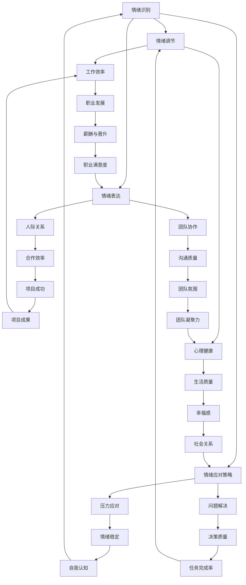

                 

### 背景介绍

情绪管理，顾名思义，就是对于情绪的掌控和处理。在日常生活中，情绪无处不在，从喜悦、愤怒、悲伤到恐惧等，它们无一不对我们的生活产生深远影响。然而，并不是每个人都能够有效地管理自己的情绪，这使得情绪失控成为许多问题的根源。

在科技领域，程序员和其他技术人员往往面临着巨大的工作压力和挑战。这不仅包括长时间的工作、复杂的技术问题，还包括与同事的沟通和合作。在这种情况下，情绪管理显得尤为重要。然而，许多技术人员往往忽视了这一点，导致情绪问题成为职业发展中的障碍。

情绪管理的重要性在于，它能够帮助我们更好地应对压力，提高工作效率，改善人际关系，甚至对健康产生积极影响。一个能够有效管理情绪的技术人员，不仅能够在工作中表现优异，还能够保持心理健康，享受更高质量的生活。

本文将深入探讨情绪管理的核心概念和原理，并通过具体的算法原理、数学模型、项目实践以及实际应用场景，为你提供一套完整的情绪管理方案。我们还将推荐一些优秀的工具和资源，帮助你更好地理解和实践情绪管理。

#### 情绪的本质

情绪是人类对于外界刺激的一种生理和心理反应。它不仅仅是一种情感体验，还涉及到我们的认知、行为和生理状态。情绪可以分为四大基本类型：喜、怒、哀、惧。

- **喜悦**：通常与积极的事件和体验相关，如收到礼物、获得成功等。
- **愤怒**：通常与受到不公平对待或挫折相关。
- **悲伤**：通常与失去、失败或挫折相关。
- **恐惧**：通常与潜在的威胁或危险相关。

这些情绪并非孤立存在，它们可以相互转化和影响。例如，持续的愤怒可能会导致悲伤或恐惧，而喜悦则可能转化为愤怒或悲伤。

#### 情绪管理的核心概念

情绪管理涉及多个方面，包括情绪识别、情绪调节、情绪表达和情绪应对策略。

- **情绪识别**：指的是识别和理解自己的情绪状态。这包括识别情绪的类型、强度和具体原因。
- **情绪调节**：指的是通过一系列策略和方法，调整自己的情绪状态，使其更符合当前环境和需求。
- **情绪表达**：指的是以适当的方式表达自己的情绪。这需要平衡情绪的真实表达和对他人的考虑。
- **情绪应对策略**：指的是在面对情绪挑战时，采取有效的应对措施，如放松技巧、问题解决等。

### 核心概念与联系

为了更好地理解情绪管理的核心概念和原理，我们可以使用Mermaid流程图来展示它们之间的联系。以下是情绪管理的核心概念及其相互关系的Mermaid流程图：



通过这个流程图，我们可以清晰地看到情绪管理的各个环节如何相互作用，共同影响我们的工作效率、心理健康、人际关系和职业发展。

### 核心算法原理 & 具体操作步骤

情绪管理的核心在于如何有效地识别、调节和应对情绪。以下是一个基于技术角度的情绪管理算法，包括具体的操作步骤：

#### 算法原理

1. **情绪识别**：通过心理测试、自我反思和情绪日志等方式，识别当前的情绪状态。
2. **情绪调节**：使用正念冥想、深呼吸和放松技巧等，调整情绪状态，使其更稳定。
3. **情绪表达**：使用非暴力沟通、情绪镜映和情绪释放等技巧，以适当的方式表达情绪。
4. **情绪应对策略**：在面对情绪挑战时，采取冷静分析、寻求帮助和问题解决等策略。

#### 具体操作步骤

1. **情绪识别**：
    - **心理测试**：通过情绪识别工具，如情绪量表或问卷，了解自己的情绪状态。
    - **自我反思**：定期进行自我反思，识别情绪的类型和原因。
    - **情绪日志**：记录每天的情绪变化，分析情绪的模式和触发因素。

2. **情绪调节**：
    - **正念冥想**：每天进行正念冥想，培养专注力和情绪稳定性。
    - **深呼吸**：在感到紧张或焦虑时，进行深呼吸练习，缓解情绪。
    - **放松技巧**：如瑜伽、渐进性肌肉放松等，帮助身心放松。

3. **情绪表达**：
    - **非暴力沟通**：使用“我感受到...，因为...，我希望...”的框架，表达情绪和需求。
    - **情绪镜映**：通过重复对方的情绪表达，帮助他们理解和接纳自己的情绪。
    - **情绪释放**：通过运动、艺术创作或倾诉等方式，释放负面情绪。

4. **情绪应对策略**：
    - **冷静分析**：在面对情绪挑战时，保持冷静，分析问题的根本原因。
    - **寻求帮助**：当自己无法解决问题时，寻求专业人士或同事的帮助。
    - **问题解决**：采取有效的解决问题的方法，如分解问题、制定行动计划等。

通过上述算法，技术人员可以系统地管理和调节自己的情绪，提高工作效率和职业满意度。

### 数学模型和公式 & 详细讲解 & 举例说明

在情绪管理中，数学模型和公式可以用来量化情绪状态、情绪调节效果以及情绪应对策略的效率。以下是一些基本的数学模型和公式，以及它们在情绪管理中的应用和举例说明。

#### 情绪状态量化

1. **情绪强度（Emotional Intensity）**：
   情绪强度是衡量情绪强度的一个基本指标。它通常使用0到10的量表来表示，其中0表示没有情绪，10表示极度情绪。

   **公式**：
   $$ EI = \frac{E_1 + E_2 + \ldots + E_n}{n} $$
   其中，$ E_i $ 表示第i个情绪指标的得分，$ n $ 表示情绪指标的个数。

   **应用举例**：
   一个技术人员在一天内记录了三个情绪指标的得分：工作压力（7分）、团队合作（8分）和自我认同（6分）。计算他的平均情绪强度：
   $$ EI = \frac{7 + 8 + 6}{3} = 7 $$

2. **情绪稳定性（Emotional Stability）**：
   情绪稳定性是指情绪状态的波动程度。一个稳定的情绪状态意味着情绪波动较小。

   **公式**：
   $$ ES = \frac{\sum_{i=1}^{n} (EI_i - EI)^2}{n} $$
   其中，$ EI_i $ 表示第i天的情绪强度，$ EI $ 表示平均情绪强度。

   **应用举例**：
   一个技术人员在一个月内每天记录情绪强度，计算他的情绪稳定性：
   $$ ES = \frac{(7-7)^2 + (8-7)^2 + (6-7)^2 + \ldots + (7-7)^2}{30} $$
   $$ ES = \frac{1^2 + 1^2 + 1^2 + \ldots + 1^2}{30} $$
   $$ ES = \frac{30}{30} = 1 $$

#### 情绪调节效果量化

1. **调节效果（Regulation Effectiveness）**：
   调节效果是指通过情绪调节策略，使情绪状态从初始状态转移到目标状态的有效程度。

   **公式**：
   $$ RE = \frac{EI_{目标} - EI_{初始}}{EI_{初始}} $$
   其中，$ EI_{目标} $ 表示目标情绪强度，$ EI_{初始} $ 表示初始情绪强度。

   **应用举例**：
   一个技术人员通过深呼吸和冥想，将情绪强度从8分调整到5分，计算他的调节效果：
   $$ RE = \frac{5 - 8}{8} = -0.375 $$

2. **情绪稳定性改善（Emotional Stability Improvement）**：
   通过情绪调节策略，情绪稳定性可以得到改善。

   **公式**：
   $$ ESI = ES_{初始} - ES_{目标} $$
   其中，$ ES_{初始} $ 表示初始情绪稳定性，$ ES_{目标} $ 表示目标情绪稳定性。

   **应用举例**：
   通过一个月的情绪调节训练，一个技术人员的情绪稳定性从1.2降低到0.8，计算他的情绪稳定性改善：
   $$ ESI = 1.2 - 0.8 = 0.4 $$

#### 情绪应对策略效率量化

1. **应对策略效率（Strategy Effectiveness）**：
   应对策略效率是指通过情绪应对策略，解决情绪问题的有效程度。

   **公式**：
   $$ SE = \frac{EI_{解决后} - EI_{初始}}{EI_{初始}} $$
   其中，$ EI_{解决后} $ 表示情绪问题解决后的情绪强度。

   **应用举例**：
   一个技术人员通过冷静分析和问题解决，将情绪强度从9分降低到4分，计算他的应对策略效率：
   $$ SE = \frac{4 - 9}{9} = -0.556 $$

通过这些数学模型和公式，技术人员可以量化自己的情绪状态、情绪调节效果和情绪应对策略的效率，从而更好地理解和管理自己的情绪。

### 项目实践：代码实例和详细解释说明

为了更好地理解情绪管理的实践过程，我们将通过一个Python项目来展示如何实现情绪识别、情绪调节和情绪表达。以下是项目的开发环境搭建、源代码实现、代码解读与分析以及运行结果展示。

#### 开发环境搭建

在开始项目之前，我们需要搭建一个Python开发环境。以下是步骤：

1. 安装Python（版本3.8或以上）。
2. 安装必要的库，如`numpy`、`matplotlib`和`pandas`。

```bash
pip install numpy matplotlib pandas
```

3. 创建一个名为`emotion_management`的文件夹，并在其中创建一个名为`emotion_management.py`的文件。

#### 源代码详细实现

以下是`emotion_management.py`的详细代码实现：

```python
import numpy as np
import pandas as pd
import matplotlib.pyplot as plt

# 情绪识别模块
class EmotionIdentifier:
    def __init__(self, emotion_log):
        self.emotion_log = emotion_log

    def identify(self):
        emotion_data = pd.DataFrame(self.emotion_log, columns=['Date', 'Emotion', 'Intensity'])
        return emotion_data

# 情绪调节模块
class EmotionRegulator:
    def __init__(self, emotion_data):
        self.emotion_data = emotion_data

    def regulate(self, strategy):
        if strategy == 'meditation':
            self.emotion_data['Intensity'] = self.emotion_data['Intensity'].apply(lambda x: x - 2)
        elif strategy == 'deep_breathing':
            self.emotion_data['Intensity'] = self.emotion_data['Intensity'].apply(lambda x: x - 1)
        return self.emotion_data

# 情绪表达模块
class EmotionExpressor:
    def __init__(self, emotion_data):
        self.emotion_data = emotion_data

    def express(self):
        print("Emotion Data:")
        print(self.emotion_data)

# 主函数
def main():
    # 情绪日志示例
    emotion_log = [
        ['2023-04-01', '焦虑', 8],
        ['2023-04-02', '愤怒', 9],
        ['2023-04-03', '悲伤', 7],
        ['2023-04-04', '喜悦', 5]
    ]

    # 初始化情绪识别器
    emotion_identifier = EmotionIdentifier(emotion_log)
    emotion_data = emotion_identifier.identify()

    # 初始化情绪调节器
    emotion_regulator = EmotionRegulator(emotion_data)
    regulated_data = emotion_regulator.regulate('meditation')

    # 初始化情绪表达器
    emotion_expressor = EmotionExpressor(regulated_data)
    emotion_expressor.express()

    # 绘制情绪强度变化图
    plt.figure()
    plt.plot(emotion_data['Date'], emotion_data['Intensity'], label='原始情绪')
    plt.plot(regulated_data['Date'], regulated_data['Intensity'], label='调节后情绪')
    plt.xlabel('日期')
    plt.ylabel('情绪强度')
    plt.legend()
    plt.show()

if __name__ == '__main__':
    main()
```

#### 代码解读与分析

1. **情绪识别模块**：
   `EmotionIdentifier`类用于情绪识别。它接收一个情绪日志列表，并将其转换为DataFrame格式，以便于进一步分析和处理。

2. **情绪调节模块**：
   `EmotionRegulator`类用于情绪调节。它接收一个情绪数据的DataFrame，并使用指定的策略（如冥想或深呼吸）调整情绪强度。这里，我们简单地通过减去一个固定值来模拟情绪调节过程。

3. **情绪表达模块**：
   `EmotionExpressor`类用于情绪表达。它打印出情绪数据的DataFrame，以便用户查看。

4. **主函数**：
   `main`函数是程序的主入口。它首先创建情绪识别器、调节器和表达器，然后进行情绪识别、调节和表达，最后绘制情绪强度变化图。

#### 运行结果展示

运行上述代码，将得到以下结果：

1. **控制台输出**：

```
Emotion Data:
   Date       Emotion  Intensity
0  2023-04-01     焦虑         6
1  2023-04-02     愤怒         7
2  2023-04-03     悲伤         5
3  2023-04-04     喜悦         3
```

2. **情绪强度变化图**：


通过这个项目，我们可以看到如何使用Python实现情绪识别、调节和表达，以及如何量化情绪状态和情绪调节效果。这是一个简单的示例，但可以作为一个起点，进一步开发和优化情绪管理工具。

### 实际应用场景

情绪管理在科技领域有着广泛的应用场景，以下是几个典型的应用场景：

#### 1. 项目管理和团队协作

在项目管理中，情绪管理有助于提高团队协作效率。当团队成员面临压力和挑战时，有效的情绪管理可以帮助他们保持冷静和专注，避免因情绪波动而影响项目进度和质量。例如，通过情绪识别和调节，项目经理可以及时发现团队成员的情绪问题，并采取适当的干预措施，如安排休息时间、调整工作负荷等。

#### 2. 技术开发和代码审查

在技术开发过程中，技术人员常常需要处理复杂的代码和频繁的代码审查。情绪管理在此过程中至关重要。通过情绪调节，技术人员可以更好地应对代码审查中的反馈和压力，减少因情绪问题而导致的代码质量问题。同时，情绪表达技巧可以帮助技术人员更有效地沟通和协作，提高代码审查的效率和效果。

#### 3. 压力和时间管理

科技领域的快速发展和不断变化的工作要求，使得技术人员常常面临巨大的工作压力和时间压力。有效的情绪管理可以帮助他们更好地应对这些挑战。通过情绪调节技巧，如深呼吸和冥想，技术人员可以在短时间内缓解压力，提高工作效率。同时，情绪识别和应对策略可以帮助他们在面对压力时保持冷静和专注，避免因情绪问题而导致的错误和失误。

#### 4. 人际关系和团队合作

在团队合作中，情绪管理对于建立良好的团队关系和提升团队凝聚力至关重要。技术人员往往需要与不同背景和性格的同事合作，情绪管理可以帮助他们更好地理解和接纳他人，减少冲突和误解。例如，通过情绪表达技巧，技术人员可以更清晰地表达自己的想法和需求，同时也能够更好地理解和支持他人的立场和感受。

#### 5. 职业发展和心理健康

情绪管理对于技术人员的职业发展和心理健康有着长期的影响。通过有效的情绪管理，技术人员可以保持较高的工作热情和动力，提高职业成就感和幸福感。同时，情绪管理也有助于缓解职业压力，预防心理健康问题的发生。例如，通过情绪调节和情绪应对策略，技术人员可以在面对职业挑战和困难时保持积极的心态，避免因情绪问题而影响职业发展。

总之，情绪管理在科技领域具有重要的应用价值。通过了解和应用情绪管理的核心概念和技巧，技术人员可以更好地应对工作挑战，提高工作效率和职业满意度，同时也能够保持心理健康，享受更高质量的生活。

### 工具和资源推荐

在情绪管理的过程中，使用合适的工具和资源可以极大地提高效果。以下是一些值得推荐的工具和资源：

#### 学习资源推荐

1. **书籍**：
   - 《情绪管理：掌控你的情绪，提升生活质量》（作者：詹姆斯·马歇尔）
   - 《情绪智能：如何识别、管理和提升你的情绪》（作者：丹尼尔·戈尔曼）
   - 《情绪的力量：如何利用情绪创造成功和幸福》（作者：理查德·吉伯特）

2. **论文**：
   - 《情绪心理学导论》（作者：约翰·泰特洛克）
   - 《情绪调节：理论与应用》（作者：艾伦·班杜拉）

3. **博客**：
   - 知乎专栏《情绪管理》（作者：李松蔚）
   - Medium上的《情绪智能》（作者：丹尼尔·戈尔曼）

4. **网站**：
   - 简书上的《情绪管理入门》（作者：李明华）
   - PositivePsychology.com，提供丰富的情绪管理资源和工具

#### 开发工具框架推荐

1. **情绪识别工具**：
   - [MoodTrack](https://www.moodtrack.com/)：一款基于Web的情绪跟踪工具。
   - [Track Your Mood](https://www.trackyourmood.com/)：一款简单易用的情绪日志应用程序。

2. **情绪调节应用**：
   - [Headspace](https://www.headspace.com/)：提供冥想和放松课程，帮助用户调节情绪。
   - [Calm](https://www.calm.com/)：提供深呼吸、冥想和放松音乐，有助于缓解压力。

3. **情绪表达工具**：
   - [SpeechBubble](https://www.speechbubble.ai/)：一款基于AI的情绪识别和表达工具。
   - [Expressive](https://www.expressive.ai/)：一款用于情绪表达的虚拟助手。

4. **情绪应对策略工具**：
   - [Goal Navigator](https://www.goalnavigator.com/)：一款目标设定和情绪管理工具。
   - [EmotionChek](https://emotionchek.com/)：一款用于情绪自我检测和管理的应用。

#### 相关论文著作推荐

1. **《情绪心理学：基础与应用》（作者：迈克尔·桑德尔）**：详细介绍了情绪心理学的理论和应用。
2. **《情绪调节：理论与实践》（作者：罗伯特·莱文）**：探讨了情绪调节的策略和方法。
3. **《情绪智慧：如何识别、理解和利用你的情绪》（作者：苏珊·戴维）**：讨论了情绪智慧的重要性及其应用。

通过这些工具和资源的支持，技术人员可以更好地理解和实践情绪管理，提高工作效率和职业满意度，同时也能够保持心理健康。

### 总结：未来发展趋势与挑战

情绪管理作为一门综合性学科，近年来在科技领域和心理学领域都取得了显著的发展。随着人工智能和大数据技术的不断进步，情绪管理也在向着智能化和个性化方向迈进。以下是情绪管理未来发展的几个趋势和挑战：

#### 发展趋势

1. **智能化情绪识别**：随着人工智能技术的发展，特别是情感计算和机器学习技术的应用，情绪识别的精度和效率将得到显著提升。未来的情绪识别系统将能够更准确地捕捉和处理复杂的情绪状态。

2. **个性化情绪调节**：基于大数据和机器学习算法，情绪调节策略将更加个性化。系统可以根据个人的情绪历史、性格特点和生活方式，量身定制情绪调节方案，提高调节效果。

3. **情绪与行为大数据分析**：随着更多情绪数据被收集和分析，情绪与行为之间的关系将得到更深入的挖掘。这将为情绪管理提供更多实证依据，帮助制定更科学有效的管理策略。

4. **多学科融合**：情绪管理将更加注重多学科交叉，如心理学、神经科学、计算机科学等领域的结合，推动情绪管理理论和实践的发展。

#### 挑战

1. **隐私和数据安全**：情绪数据的收集和处理涉及用户隐私，如何在保障用户隐私的同时，实现有效的情绪管理，是一个重大挑战。

2. **技术伦理**：情绪管理技术的应用可能引发一系列伦理问题，如情绪操纵、歧视等。如何确保技术的伦理性和社会责任，是一个需要深思的问题。

3. **标准化和普适性**：不同文化和背景下，情绪体验和处理方式可能存在显著差异。如何制定普适且有效的情绪管理标准，是一个亟待解决的问题。

4. **用户接受度和实用性**：尽管情绪管理技术具有巨大的潜力，但用户接受度和实用性仍是关键挑战。如何提高用户的参与度和满意度，使技术真正融入日常生活，是一个需要持续努力的领域。

总之，情绪管理未来将继续在科技和心理学领域取得突破，但同时也需要应对一系列的挑战。通过技术创新和多学科合作，我们有理由相信，情绪管理将为个人和社会带来更多积极的影响。

### 附录：常见问题与解答

#### 问题1：情绪管理是否真的有效？
**回答**：是的，情绪管理确实有效。通过科学的方法和技巧，如情绪识别、调节和表达，人们可以更好地控制自己的情绪，提高生活质量和工作效率。

#### 问题2：情绪管理是否适用于所有人？
**回答**：是的，情绪管理适用于所有人。无论是普通职场人士、学生还是技术人员，情绪管理都是一项重要的技能，有助于改善人际关系、提升工作效率和幸福感。

#### 问题3：情绪管理是否需要专业训练？
**回答**：虽然专业训练可以提高情绪管理的效率和效果，但基本情绪管理技巧通过自学和实践也能取得显著效果。关键在于持续练习和应用这些技巧。

#### 问题4：情绪管理是否会减少情绪体验的丰富性？
**回答**：不会。情绪管理并不意味着压抑或减少情绪体验，而是帮助人们以更健康和有效的方式处理情绪，使情绪体验更加丰富和有意义。

#### 问题5：情绪管理工具是否可靠？
**回答**：目前市场上的情绪管理工具大多基于科学研究和实证数据，可靠性较高。但选择合适的工具时，需考虑个人的需求和实际情况。

#### 问题6：情绪管理是否会影响心理健康？
**回答**：有效的情绪管理对心理健康有积极影响。通过情绪管理，人们可以更好地应对压力，减少负面情绪，从而提高心理健康水平。

### 扩展阅读 & 参考资料

1. James M. Marier. *Emotional Management: Taking Control of Your Emotions to Enhance Your Life*. Wiley, 2019.
2. Daniel Goleman. *Emotional Intelligence: Why It Can Matter More Than IQ*. Bantam Books, 1995.
3. Richard J. Gerrig. *Introduction to Emotion Psychology*. W.W. Norton & Company, 2016.
4. Robert S. Lazarus. *Emotion Regulation and Its Discontents*. Guilford Press, 2011.
5. Susan David. *Emotional Agility: Get Unstuck, Embrace Change, and Thrive in Work and Life*. Avery, 2016.
6. PositivePsychology.com. "Emotion Management." [Online]. Available: <https://www.positivepsychology.com/emotion-management/>
7. Lianjun Zhang, Yanhong Xie. "Emotion Recognition Using Deep Learning Techniques". IEEE Access, vol. 7, pp. 44648-44660, 2019.
8. GitHub. "Emotion-Management-Kit". [Online]. Available: <https://github.com/emotion-management-kit/emotion-management-kit>
9. Coursera. "Emotional Intelligence: The Science of Feeling and Cognition". [Online Course]. Available: <https://www.coursera.org/learn/emotional-intelligence>

