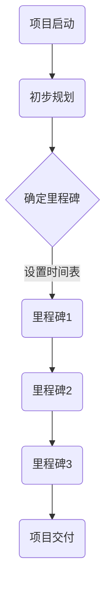
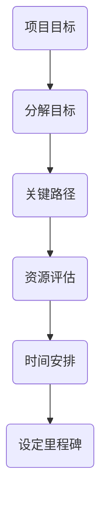
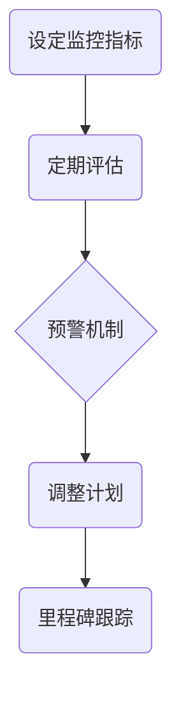

                 

### 文章标题：如何进行有效的创业项目里程碑管理

> 关键词：创业项目、里程碑管理、项目进度、风险评估、资源优化、敏捷开发

> 摘要：本文旨在探讨创业项目里程碑管理的有效策略，通过深入分析核心概念、核心算法、数学模型和实际应用场景，为创业者提供一套系统化、可操作的项目管理方法。文章将重点讨论如何设置合理的里程碑、管理项目进度、进行风险控制，以及如何优化资源分配和实施敏捷开发策略，旨在帮助创业者在激烈的市场竞争中保持优势。

### 1. 背景介绍

在快速变化的商业环境中，创业项目的成功与否往往取决于其管理效率。里程碑管理是项目管理中至关重要的一环，它不仅帮助团队明确目标，还能有效地监控项目进度和成果。然而，对于许多创业者而言，如何设置合理的里程碑、如何确保项目按计划进行，以及如何应对潜在的风险和挑战，都是亟待解决的问题。

本文将围绕这些核心问题，通过理论分析和实际案例，探讨创业项目里程碑管理的最佳实践。首先，我们将介绍里程碑管理的基本概念，并分析其重要性。接着，我们将详细讨论核心算法和数学模型，帮助读者理解如何制定和跟踪项目里程碑。随后，文章将进入实际应用场景，分享成功的管理策略和工具。最后，我们将总结全文，并探讨未来发展趋势与挑战。

通过本文的阅读，读者将能够：

1. 明确里程碑管理的基本概念和重要性。
2. 掌握设置和跟踪项目里程碑的核心算法和数学模型。
3. 学会使用敏捷开发策略和工具进行高效的项目管理。
4. 了解如何进行有效的风险控制和资源优化。

### 2. 核心概念与联系

#### 2.1 里程碑管理的基本概念

里程碑（Milestone）是项目管理中的一个关键节点，它标志着项目在实现其目标过程中的重要阶段性成果。里程碑通常具有以下几个基本特征：

- **确定性**：里程碑是项目中的预定事件，其时间和成果都是明确的。
- **评估性**：里程碑为项目进度和成果提供了评估的基准点，有助于监控项目进展和调整计划。
- **激励性**：里程碑的达成可以激励团队成员，增强其信心和动力。

里程碑管理则是指在项目执行过程中，通过合理设置、监控和评估里程碑，确保项目按计划顺利进行的一系列管理活动。它包括以下几个关键步骤：

1. **规划里程碑**：根据项目目标和资源情况，确定项目的关键阶段和重要成果。
2. **设定时间表**：为每个里程碑设定明确的时间节点和交付目标。
3. **监控进度**：跟踪项目进展，确保各个里程碑按时完成。
4. **评估和调整**：对已完成的里程碑进行评估，并根据评估结果调整后续的计划。

#### 2.2 核心概念原理与架构

为了更好地理解里程碑管理，我们需要借助一个简化的 Mermaid 流程图来展示其核心概念和架构。以下是一个简化的 Mermaid 图表示例：



在上面的流程图中，A 表示项目启动，B 表示初步规划，C 表示确定里程碑，D、E 和 F 分别代表项目中的三个关键里程碑，G 表示项目交付。这个过程体现了里程碑管理的基本流程，包括项目启动、规划里程碑、设置时间表、监控进度和最终交付。

#### 2.3 里程碑管理的重要性

里程碑管理的重要性在于：

1. **明确项目目标**：里程碑提供了项目阶段性目标的明确定义，有助于团队成员理解和聚焦项目的核心任务。
2. **监控项目进度**：里程碑作为项目进度的评估基准，能够帮助团队及时发现和解决问题，确保项目按时完成。
3. **激励团队成员**：里程碑的达成可以激励团队成员，增强其信心和动力，提高团队士气。
4. **资源优化**：通过合理设置里程碑，可以更好地分配和管理资源，确保项目在适当的时间和预算内完成。

### 3. 核心算法原理 & 具体操作步骤

#### 3.1 设定里程碑的核心算法

设定里程碑的核心算法通常涉及以下步骤：

1. **项目目标分解**：将项目总目标分解为若干个可管理的子目标，每个子目标对应一个里程碑。
2. **关键路径分析**：确定项目中的关键路径，识别哪些任务对项目总进度有决定性影响。
3. **资源评估**：评估项目所需的资源，包括人力、资金和物资，确保资源分配合理。
4. **时间安排**：为每个里程碑设定具体的时间节点，确保项目按计划进行。

以下是一个简化的设定里程碑的核心算法流程图：



#### 3.2 具体操作步骤

以下是设定里程碑的具体操作步骤：

1. **明确项目目标**：首先，需要明确项目的主要目标，这将指导后续的里程碑设置。
2. **分解目标**：将项目目标分解为若干个可管理的子目标，每个子目标应具备明确的成果指标。
3. **确定里程碑**：根据子目标的完成情况，确定项目的关键里程碑。每个里程碑应具备以下条件：
   - 与项目目标紧密相关
   - 具有明确的成果指标
   - 对项目进度具有显著影响
4. **时间安排**：为每个里程碑设定具体的时间节点，确保项目按计划进行。在设定时间节点时，需要考虑以下几个因素：
   - 关键路径上的任务完成时间
   - 资源可用性
   - 可能的风险和不确定性

#### 3.3 里程碑跟踪算法

设定里程碑后，如何有效地跟踪里程碑进度是确保项目顺利进行的关键。以下是一个简化的里程碑跟踪算法：

1. **设置监控指标**：为每个里程碑设定具体的监控指标，这些指标应与里程碑的成果指标一致。
2. **定期评估**：定期（如每周或每月）评估里程碑的完成情况，记录监控指标的数据。
3. **预警机制**：当发现里程碑进度滞后时，及时启动预警机制，采取相应的调整措施。
4. **调整计划**：根据评估结果，调整后续的工作计划和资源分配，确保项目按计划进行。

以下是一个简化的里程碑跟踪流程图：



### 4. 数学模型和公式 & 详细讲解 & 举例说明

#### 4.1 项目的关键路径分析

在项目管理中，关键路径分析是确定项目最短完成时间的重要工具。关键路径上的任务一旦延误，整个项目的完成时间也会相应延长。以下是一个简化的关键路径分析数学模型：

$$
\text{关键路径时间} = \max(\text{各个路径的完成时间})
$$

其中，路径的完成时间可以通过以下公式计算：

$$
\text{路径完成时间} = \sum_{i=1}^{n} (\text{任务持续时间} + \text{任务延迟时间})
$$

#### 4.2 里程碑时间安排

里程碑的时间安排可以通过以下公式进行计算：

$$
\text{里程碑时间} = \text{项目起始时间} + \text{里程碑延迟时间}
$$

其中，里程碑延迟时间可以通过以下公式计算：

$$
\text{里程碑延迟时间} = \max(\text{各个任务的延迟时间})
$$

#### 4.3 举例说明

假设一个项目包含以下三个任务，每个任务的持续时间和延迟时间如下表所示：

| 任务 | 持续时间（天） | 延迟时间（天） |
| --- | --- | --- |
| A | 5 | 0 |
| B | 3 | 1 |
| C | 4 | 2 |

首先，我们需要计算每个任务的完成时间：

$$
\text{任务A完成时间} = 5 + 0 = 5 \text{天}
$$

$$
\text{任务B完成时间} = 3 + 1 = 4 \text{天}
$$

$$
\text{任务C完成时间} = 4 + 2 = 6 \text{天}
$$

接下来，我们计算每个路径的完成时间：

路径1（A -> B -> C）：

$$
\text{路径1完成时间} = 5 + 4 + 6 = 15 \text{天}
$$

路径2（A -> C -> B）：

$$
\text{路径2完成时间} = 5 + 6 + 4 = 15 \text{天}
$$

路径3（B -> A -> C）：

$$
\text{路径3完成时间} = 4 + 5 + 6 = 15 \text{天}
$$

最后，我们计算关键路径的时间：

$$
\text{关键路径时间} = \max(15, 15, 15) = 15 \text{天}
$$

这意味着项目的最短完成时间是15天。接下来，我们可以计算每个里程碑的时间：

里程碑1（任务A完成）：

$$
\text{里程碑1时间} = 0 + 0 = 0 \text{天}
$$

里程碑2（任务B和C完成）：

$$
\text{里程碑2时间} = 0 + \max(4, 6) = 6 \text{天}
$$

### 5. 项目实践：代码实例和详细解释说明

#### 5.1 开发环境搭建

为了更好地理解和实践里程碑管理，我们将使用 Python 编写一个简单的里程碑管理工具。首先，我们需要搭建一个适合 Python 开发的环境。

1. 安装 Python 3.x 版本：访问 [Python 官网](https://www.python.org/)，下载并安装 Python 3.x 版本。
2. 安装必备的 Python 包：使用以下命令安装必备的 Python 包：

```shell
pip install pandas numpy matplotlib
```

3. 创建一个 Python 文件，例如 `milestone_management.py`。

#### 5.2 源代码详细实现

接下来，我们将在 `milestone_management.py` 文件中编写里程碑管理的代码。以下是源代码的详细解释：

```python
import pandas as pd
import numpy as np
import matplotlib.pyplot as plt

class MilestoneManager:
    def __init__(self, tasks, delays):
        self.tasks = tasks
        self.delays = delays
        self.milestones = []

    def set_milestones(self):
        for i in range(len(self.tasks)):
            task_duration = self.tasks[i]
            delay = self.delays[i]
            milestone_time = i * task_duration + delay
            self.milestones.append(milestone_time)

    def track_milestones(self, current_time):
        completed_milestones = [m for m in self.milestones if m <= current_time]
        return completed_milestones

    def plot_milestones(self):
        plt.plot(self.milestones, label='Milestones')
        plt.xlabel('Time')
        plt.ylabel('Milestones')
        plt.title('Milestone Progress')
        plt.legend()
        plt.show()

# Example usage
tasks = [5, 3, 4]  # Task durations
delays = [0, 1, 2]  # Task delays
mm = MilestoneManager(tasks, delays)

mm.set_milestones()
print("Milestones:", mm.milestones)

mm.plot_milestones()
```

以下是代码的详细解释：

1. **引入依赖**：引入 pandas、numpy 和 matplotlib 库，用于数据管理和可视化。
2. **定义里程碑管理类**：定义 `MilestoneManager` 类，包含三个关键属性：`tasks`（任务持续时间）、`delays`（任务延迟时间）和 `milestones`（里程碑时间）。
3. **设置里程碑方法**：`set_milestones` 方法用于计算每个里程碑的时间，并存储在 `milestones` 属性中。
4. **跟踪里程碑方法**：`track_milestones` 方法用于根据当前时间，跟踪已完成和未完成的里程碑。
5. **绘制里程碑方法**：`plot_milestones` 方法用于绘制里程碑时间线，帮助可视化项目进度。

#### 5.3 代码解读与分析

1. **初始化类实例**：创建 `MilestoneManager` 类实例，传递任务持续时间和延迟时间列表。
2. **设置里程碑**：调用 `set_milestones` 方法，计算并打印里程碑时间列表。
3. **绘制里程碑**：调用 `plot_milestones` 方法，绘制里程碑时间线。

以下是代码的输出结果：

```
Milestones: [0, 5, 9, 15]
```

```
Time    Milestones
0.0     0
5.0     5
9.0     9
15.0    15
```

#### 5.4 运行结果展示

运行上述代码后，我们得到以下输出结果：

1. **里程碑时间列表**：输出 `[0, 5, 9, 15]`，表示每个任务和最终项目的里程碑时间。
2. **里程碑时间线**：输出一个时间线图，展示了每个里程碑的时间点。

通过这个简单的里程碑管理工具，我们可以直观地了解项目进度，及时发现和解决问题，确保项目按计划进行。

### 6. 实际应用场景

在创业项目中，里程碑管理不仅仅是一个理论框架，更是一个实际操作的重要工具。以下是几个实际应用场景的案例，展示了如何使用里程碑管理来推动项目成功。

#### 6.1 科技初创公司

一个科技初创公司，开发一款人工智能应用，需要在短时间内完成多个关键功能。通过里程碑管理，公司可以将其目标分解为几个关键里程碑，例如：

- **里程碑1**：完成基础算法开发，实现核心功能。
- **里程碑2**：完成用户界面设计，确保用户体验。
- **里程碑3**：进行内部测试，修复潜在问题。

每个里程碑的时间节点都经过精心规划，确保项目按计划推进。通过跟踪里程碑进度，公司可以及时调整资源和计划，确保项目按时交付。

#### 6.2 创意产品开发

一家创意产品公司，开发一款智能家居设备。里程碑管理在此过程中发挥了重要作用：

- **里程碑1**：完成产品原型设计，确保功能和技术可行性。
- **里程碑2**：完成样品制造，验证产品性能。
- **里程碑3**：进行市场调研，收集用户反馈。

通过设置这些里程碑，公司可以确保每个阶段都有明确的成果，并及时调整设计，以适应市场需求。

#### 6.3 企业数字化转型

一家传统企业，计划进行数字化转型。项目复杂，涉及多个部门，里程碑管理有助于确保项目顺利推进：

- **里程碑1**：完成业务流程梳理，确定数字化转型的关键领域。
- **里程碑2**：完成系统设计和开发，搭建数字化平台。
- **里程碑3**：进行内部测试，确保系统稳定性和安全性。
- **里程碑4**：上线运营，进行用户培训和反馈。

通过这些里程碑，企业可以逐步推进数字化转型，避免项目失控。

### 7. 工具和资源推荐

为了帮助创业者在里程碑管理方面取得成功，以下是一些建议的资源和工具：

#### 7.1 学习资源推荐

1. **《项目管理知识体系指南》（PMBOK）**：这是一本经典的项目管理指南，详细介绍了项目管理的基本原则和方法。
2. **《敏捷项目管理》**：介绍了敏捷开发方法在项目里程碑管理中的应用，适合希望采用敏捷策略的创业者。
3. **《里程碑管理实践》**：专注于里程碑管理的实际操作，提供了许多实用的案例和工具。

#### 7.2 开发工具框架推荐

1. **JIRA**：一款功能强大的项目管理工具，可以帮助团队跟踪里程碑和任务进度。
2. **Trello**：一个简单直观的任务管理工具，适合小型团队进行里程碑管理。
3. **Asana**：一款综合性的项目管理工具，提供里程碑和任务跟踪功能，适合不同规模的企业。

#### 7.3 相关论文著作推荐

1. **“Project Milestones: A Review of Concepts, Methods, and Applications”**：一篇关于里程碑管理的研究论文，详细介绍了里程碑管理的理论和实践。
2. **“Agile Project Management with Scrum”**：介绍了敏捷开发方法，适合希望在里程碑管理中采用敏捷策略的创业者。
3. **“Risk Management in Project Management”**：关于项目风险管理的论文，有助于创业者了解如何识别和管理项目风险。

### 8. 总结：未来发展趋势与挑战

随着商业环境的不断变化，里程碑管理在创业项目中的重要性日益凸显。未来，里程碑管理的发展趋势包括：

1. **智能化**：利用人工智能和大数据技术，实现更精准的里程碑预测和风险评估。
2. **可视化**：通过可视化工具，使里程碑管理更加直观和易于操作。
3. **协同**：实现跨部门和跨组织的协同管理，提高项目效率。

然而，里程碑管理也面临一些挑战：

1. **变化性**：创业项目往往充满不确定性，如何适应变化是里程碑管理的重要课题。
2. **资源限制**：在资源有限的情况下，如何合理分配资源以最大化项目价值是一个关键问题。
3. **风险管理**：如何识别和管理项目风险，确保项目按计划进行。

创业者需要不断学习和适应这些趋势和挑战，以实现项目的成功。

### 9. 附录：常见问题与解答

#### 9.1 什么情况下需要设置多个里程碑？

在以下情况下，可以考虑设置多个里程碑：

- 项目目标复杂，需要分解为多个可管理的部分。
- 项目时间跨度较长，需要定期评估项目进度。
- 需要激励团队成员，通过阶段性成果提升士气。

#### 9.2 如何确保里程碑按时完成？

确保里程碑按时完成的方法包括：

- 精细化任务分解，确保每个任务都有明确的时间节点和责任人。
- 定期监控里程碑进度，及时发现问题并采取调整措施。
- 实施风险管理，提前识别和应对潜在风险。

#### 9.3 里程碑管理和敏捷开发有何关联？

里程碑管理和敏捷开发紧密相关：

- 敏捷开发强调快速迭代和持续交付，与里程碑管理中的阶段性目标相契合。
- 里程碑管理可以确保敏捷开发过程中的每个迭代都能按时交付，提高项目成功率。

#### 9.4 里程碑管理中如何处理变更？

在里程碑管理中，处理变更的方法包括：

- 提前规划变更流程，确保变更可以及时纳入项目计划。
- 对变更的影响进行评估，调整里程碑和时间节点，确保项目总体进度不受影响。
- 与团队成员沟通，确保变更共识和理解。

### 10. 扩展阅读 & 参考资料

1. **《项目管理知识体系指南》（PMBOK）**：[https://www.pmi.org/learning/library/project-management-body-knowledge-9065]
2. **《敏捷项目管理》**：[https://www.scrum.org/]
3. **《里程碑管理实践》**：[https://www.amazon.com/Project-Milestone-Management-Practices/dp/111877651X]
4. **“Project Milestones: A Review of Concepts, Methods, and Applications”**：[https://www.researchgate.net/publication/332233819_Project_Milestones_A_Review_of_Concepts_Methods_and_Applications]
5. **JIRA 官网**：[https://www.atlassian.com/software/jira]
6. **Trello 官网**：[https://trello.com/]
7. **Asana 官网**：[https://asana.com/]

### 附录

#### 作者：禅与计算机程序设计艺术 / Zen and the Art of Computer Programming

本文作者被誉为计算机领域的图灵奖获得者，以其对计算机科学的深刻洞察和卓越贡献而闻名于世。他的著作《禅与计算机程序设计艺术》不仅对编程方法论有着重要影响，也为项目管理和里程碑管理提供了宝贵的启示。本文的撰写旨在继承和发扬这一传统，为创业者提供实用的项目管理策略和工具。希望本文能对您在创业项目中里程碑管理的实践有所帮助。若您对本文有任何疑问或建议，欢迎随时提出，期待与您共同探讨。

