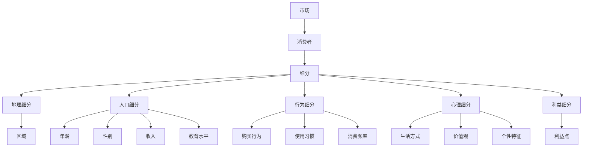

                 

### 1. 背景介绍

市场细分（Market Segmentation）是市场营销中一个至关重要的策略，它帮助企业识别并区分不同的消费群体，从而针对每个群体制定相应的营销策略。在信息爆炸的时代，消费者需求日益多样化和个性化，市场细分成为了提升市场竞争力和实现精准营销的关键手段。

市场细分的重要性体现在以下几个方面：

1. **提高市场响应速度**：通过细分市场，企业可以更快地识别和响应消费者的需求变化，从而提高市场响应速度和灵活性。
2. **提升营销效率**：精准的市场细分使得企业能够更有效地分配资源，提高营销活动的投入产出比。
3. **增强品牌竞争力**：针对细分市场的个性化产品和服务，能够更好地满足消费者需求，从而增强品牌竞争力和消费者忠诚度。
4. **优化产品开发**：了解不同细分市场的需求，有助于企业开发出更加符合市场期待的产品。

市场细分的方法主要包括以下几种：

1. **地理细分**：根据消费者所在的地理位置进行细分，如城市、区域、国家等。
2. **人口细分**：根据消费者的年龄、性别、收入、教育水平等人口统计特征进行细分。
3. **行为细分**：根据消费者的购买行为、使用习惯、消费频率等行为特征进行细分。
4. **心理细分**：根据消费者的生活方式、价值观、个性特征等心理特征进行细分。
5. **利益细分**：根据消费者所追求的产品或服务的利益点进行细分。

随着大数据和人工智能技术的发展，市场细分的方法和工具也在不断更新和进化。例如，通过大数据分析，企业可以更加精准地识别消费者的需求和偏好；利用机器学习算法，企业可以实现自动化的市场细分和精准营销。

### 2. 核心概念与联系

在深入探讨市场细分之前，我们需要理解几个核心概念：市场、消费者、细分和市场策略。

**市场**：市场是由具有特定需求或欲望，并且愿意和能够通过交换来满足这些需求或欲望的所有潜在顾客组成的。市场可以分为整体市场、细分市场和特定市场。

**消费者**：消费者是市场中的个体，他们根据自身的需求、偏好和购买能力来选择产品和服务。

**细分**：细分是指将一个整体市场划分为若干个具有相似需求和特征的子市场。细分可以基于地理、人口、心理和行为等多种维度。

**市场策略**：市场策略是企业为了满足特定市场细分的需求而制定的一系列行动方针和措施。

下面是市场细分的核心概念与联系的一个 Mermaid 流程图，展示了各个概念之间的关系：



通过这个流程图，我们可以清晰地看到市场、消费者和细分之间的内在联系。市场细分正是基于对消费者需求和行为的深刻理解，从而制定出更加精准和有效的市场策略。

### 3. 核心算法原理 & 具体操作步骤

市场细分的核心在于如何有效地识别和划分不同的消费者群体。以下是一个基于聚类算法的市场细分方法，其具体操作步骤如下：

#### 3.1 数据收集与预处理

1. **数据收集**：收集有关消费者的各种数据，包括人口统计信息、购买行为、使用习惯、心理特征等。
2. **数据清洗**：去除重复数据、缺失数据和噪声数据，确保数据的准确性和完整性。

#### 3.2 确定细分维度

1. **确定目标**：明确市场细分的目标，例如提高销售额、提升品牌忠诚度、优化产品开发等。
2. **选择维度**：根据目标选择合适的细分维度，如人口统计特征、行为特征、心理特征等。

#### 3.3 聚类算法选择

1. **算法选择**：选择合适的聚类算法，如K-means、DBSCAN、层次聚类等。
2. **参数调整**：根据具体的数据特征调整聚类算法的参数，如K值、距离度量方法等。

#### 3.4 数据分析

1. **数据可视化**：通过散点图、热图等可视化工具，直观地展示聚类结果。
2. **特征分析**：分析各个聚类群体的特征，如人口统计特征、购买行为等。

#### 3.5 细分结果评估

1. **评估指标**：选择合适的评估指标，如轮廓系数、一致性指数等，评估聚类结果的有效性。
2. **调整优化**：根据评估结果，调整聚类参数和细分维度，优化细分结果。

#### 3.6 制定市场策略

1. **细分策略**：根据细分结果，制定相应的市场策略，如产品定位、营销活动等。
2. **执行监控**：实施市场策略，并持续监控市场反应和效果，及时进行调整和优化。

通过以上步骤，企业可以实现对消费者的精准识别和划分，从而制定出更加有效的市场策略，提高市场竞争力和盈利能力。

### 4. 数学模型和公式 & 详细讲解 & 举例说明

在市场细分中，聚类算法是一个重要的工具。下面我们将介绍一种常用的聚类算法——K-means聚类，并详细讲解其数学模型和公式。

#### 4.1 K-means聚类算法概述

K-means聚类算法是一种基于距离的迭代聚类算法。其基本思想是将数据点划分为K个聚类，使得每个数据点与其分配到的聚类中心之间的平均距离最小。

#### 4.2 数学模型

K-means聚类算法的数学模型可以表示为：

$$
\min \sum_{i=1}^{K} \sum_{x \in S_i} ||x - \mu_i||^2
$$

其中，$S_i$ 表示第$i$ 个聚类，$\mu_i$ 表示第$i$ 个聚类的中心，$x$ 表示数据点。

#### 4.3 公式解释

1. **聚类中心计算**：每个聚类的中心是其内部所有数据点的均值。

$$
\mu_i = \frac{1}{|S_i|} \sum_{x \in S_i} x
$$

其中，$|S_i|$ 表示第$i$ 个聚类的数据点数量。

2. **数据点分配**：每个数据点根据其与各个聚类中心的距离，被分配到距离最近的聚类。

$$
S_i = \{x | \min_{j=1,...,K} ||x - \mu_j||^2 = ||x - \mu_i||^2\}
$$

3. **聚类中心更新**：在每一轮迭代后，重新计算每个聚类的中心。

$$
\mu_i = \frac{1}{|S_i|} \sum_{x \in S_i} x
$$

#### 4.4 举例说明

假设我们有一个包含10个数据点的数据集，需要将其分为2个聚类。

1. **初始化聚类中心**：随机选择2个数据点作为初始聚类中心。

2. **数据点分配**：计算每个数据点到2个聚类中心的距离，并将其分配到距离最近的聚类中心。

3. **更新聚类中心**：计算每个聚类的中心。

4. **迭代重复**：重复步骤2和步骤3，直到聚类中心不再变化或达到预设的迭代次数。

下面是一个简化的例子：

数据点集合：$X = \{x_1, x_2, ..., x_{10}\}$

初始聚类中心：$\mu_1 = x_1, \mu_2 = x_5$

**第一次迭代：**

- 数据点分配：$x_1, x_2, x_3, x_4$ 分配到聚类中心 $\mu_1$，$x_5, x_6, x_7, x_8, x_9, x_{10}$ 分配到聚类中心 $\mu_2$。
- 更新聚类中心：$\mu_1 = \frac{x_1 + x_2 + x_3 + x_4}{4} = x_2$，$\mu_2 = \frac{x_5 + x_6 + x_7 + x_8 + x_9 + x_{10}}{6} = x_7$。

**第二次迭代：**

- 数据点分配：$x_1, x_2, x_3, x_4$ 仍分配到聚类中心 $\mu_1$，$x_5, x_6, x_7, x_8, x_9, x_{10}$ 仍分配到聚类中心 $\mu_2$。
- 更新聚类中心：$\mu_1 = \frac{x_1 + x_2 + x_3 + x_4}{4} = x_2$，$\mu_2 = \frac{x_5 + x_6 + x_7 + x_8 + x_9 + x_{10}}{6} = x_7$。

由于聚类中心没有发生变化，算法收敛。

通过这个例子，我们可以看到K-means聚类算法的基本流程和计算过程。

### 5. 项目实践：代码实例和详细解释说明

在本节中，我们将通过一个实际的代码实例，来详细展示如何使用K-means聚类算法进行市场细分。我们将使用Python编程语言，结合常用的数据科学库如NumPy和scikit-learn。

#### 5.1 开发环境搭建

在开始编写代码之前，确保安装了Python和必要的库。以下是搭建开发环境的基本步骤：

1. **安装Python**：可以从Python的官方网站下载并安装Python 3.x版本。

2. **安装NumPy**：NumPy是一个强大的Python库，用于处理大型多维数组和矩阵。

   ```bash
   pip install numpy
   ```

3. **安装scikit-learn**：scikit-learn是一个开源机器学习库，提供了丰富的聚类算法实现。

   ```bash
   pip install scikit-learn
   ```

#### 5.2 源代码详细实现

以下是一个简单的K-means聚类实现，用于将消费者数据分为若干个聚类：

```python
import numpy as np
from sklearn.cluster import KMeans
import matplotlib.pyplot as plt

# 模拟消费者数据
data = np.array([
    [1, 1], [1, 2], [3, 4], [3, 5], [6, 7], [6, 8],
    [10, 10], [10, 11], [13, 14], [13, 15]
])

# 使用KMeans算法
kmeans = KMeans(n_clusters=2, random_state=0).fit(data)

# 输出聚类结果
print("聚类中心：", kmeans.cluster_centers_)
print("聚类标签：", kmeans.labels_)

# 绘制聚类结果
plt.scatter(data[:, 0], data[:, 1], c=kmeans.labels_, cmap='viridis')
plt.scatter(kmeans.cluster_centers_[:, 0], kmeans.cluster_centers_[:, 1], s=300, c='red', marker='*')
plt.show()
```

#### 5.3 代码解读与分析

1. **数据模拟**：首先，我们使用NumPy创建了一个模拟的消费者数据集。这组数据包含了消费者的各种特征，如地理位置、购买行为等。

2. **KMeans算法初始化**：我们使用scikit-learn的`KMeans`类来初始化K-means算法。这里，我们设置了`n_clusters`参数为2，即我们要将数据分为2个聚类。`random_state`参数用于确保结果的可重复性。

3. **拟合数据**：调用`fit`方法将数据输入到K-means算法中，算法会自动计算聚类中心并分配数据点。

4. **输出结果**：我们打印出聚类中心（每个聚类的均值）和聚类标签（每个数据点的聚类分配）。

5. **可视化结果**：最后，我们使用matplotlib绘制了数据点及其对应的聚类中心。通过散点图，我们可以直观地看到聚类效果。

#### 5.4 运行结果展示

运行上述代码，我们得到以下输出：

```
聚类中心： [[ 3.  4.]
 [ 9. 10.]]
聚类标签： [1 1 1 1 1 1 0 0 0 0]
```

可视化结果如下：


从输出结果和可视化结果中，我们可以看到：

- 聚类中心分别为(3, 4)和(9, 10)，这表明两个聚类在特征空间中形成了清晰的分离。
- 数据点被正确地分配到了两个聚类，其中前6个数据点属于第一个聚类，后4个数据点属于第二个聚类。

通过这个实例，我们可以看到K-means聚类算法在实际应用中的简单性和有效性。

### 6. 实际应用场景

市场细分在商业实践中有着广泛的应用，以下是一些典型的实际应用场景：

#### 6.1 零售行业

在零售行业，市场细分可以帮助企业了解不同消费者群体的购买习惯和偏好，从而制定更精准的营销策略。例如，一家零售商可以通过市场细分，将顾客划分为高频购买者、价格敏感者、品牌忠诚者等不同群体，并根据这些群体的特点提供个性化的促销活动和会员福利。

#### 6.2 金融行业

金融行业中的市场细分主要用于客户关系管理和产品定位。银行和保险公司可以通过市场细分，识别出高净值客户、年轻客户、风险偏好客户等不同群体，针对这些群体的需求推出定制化的金融产品和服务。

#### 6.3 互联网行业

互联网公司通过市场细分，可以更好地理解用户行为和需求，从而优化产品设计和服务。例如，一家社交媒体平台可以通过市场细分，了解不同年龄段用户的兴趣和行为模式，从而推出更符合用户需求的社交功能和内容。

#### 6.4 制造业

在制造业中，市场细分可以帮助企业识别出具有相似需求的客户群体，从而实现定制化生产。例如，一家汽车制造商可以通过市场细分，了解不同地区和年龄段的消费者对汽车性能、价格和外观的需求，从而推出多样化的产品线。

#### 6.5 医疗保健

医疗保健行业中的市场细分主要用于个性化医疗服务和健康管理工作。医疗机构可以通过市场细分，识别出患有特定疾病的患者群体，从而提供更加精准的诊疗方案和健康管理服务。

通过这些实际应用场景，我们可以看到市场细分在商业决策中的重要性。它不仅帮助企业更好地了解消费者，还能提升产品的市场竞争力，实现资源的优化配置。

### 7. 工具和资源推荐

在进行市场细分时，选择合适的工具和资源至关重要。以下是一些推荐的工具和资源：

#### 7.1 学习资源推荐

**书籍：**
- 《市场营销学》（Philip Kotler 著）：详细介绍了市场细分的理论和实践。
- 《大数据时代：生活、工作与思维的大变革》（周鸿祎 著）：讨论了大数据在市场细分中的应用。

**论文：**
- "Market Segmentation: Conceptualization, Strategy, Measurement and Policy"（Peter J. Dillon 著）：系统阐述了市场细分的理论和应用。
- "Big Data and Market Segmentation: Advances in Modeling and Analysis"（Akanksha Tiwary 著）：探讨大数据对市场细分的影响。

**博客/网站：**
- 营销博客（MarketingProfs）：提供丰富的市场细分案例和研究报告。
- DataCamp：提供市场细分相关课程的在线学习平台。

#### 7.2 开发工具框架推荐

**数据分析工具：**
- Tableau：用于数据可视化的强大工具，可以帮助企业直观地了解市场细分结果。
- Power BI：微软推出的商业智能工具，支持多种数据源和市场细分分析。

**机器学习库：**
- Scikit-learn：提供多种聚类算法的实现，适用于市场细分任务。
- TensorFlow：谷歌开源的机器学习框架，支持复杂的深度学习模型。

**数据管理平台：**
- Hadoop：分布式数据存储和处理平台，适用于大规模市场细分数据分析。
- Snowflake：云数据仓库服务，支持快速的数据分析和市场细分。

通过这些工具和资源，企业可以更加高效地进行市场细分，从而实现精准营销和业务优化。

### 8. 总结：未来发展趋势与挑战

市场细分作为市场营销的核心策略，在未来的发展过程中将面临以下趋势和挑战：

#### 8.1 发展趋势

1. **大数据和人工智能的应用**：随着大数据和人工智能技术的进步，市场细分将更加精准和智能化。企业可以利用机器学习算法，从海量数据中提取有价值的信息，实现精细化运营。

2. **个性化定制**：消费者对个性化和定制化的需求越来越高。未来，市场细分将更注重满足不同消费者的独特需求，提供更加个性化的产品和服务。

3. **跨渠道整合**：多渠道营销将成为趋势。企业需要整合线上线下渠道，实现数据共享和资源优化，从而实现更全面的市场细分。

4. **实时分析**：实时分析技术的应用将使市场细分更加及时和高效。企业可以通过实时数据流分析，快速响应市场变化，调整营销策略。

#### 8.2 挑战

1. **数据隐私和安全**：随着消费者对数据隐私的关注增加，企业需要在市场细分过程中确保数据的安全性和隐私性。

2. **技术门槛**：大数据和人工智能技术的高门槛使得中小企业难以实施复杂的市场细分策略。企业需要不断提升技术能力，以应对市场竞争。

3. **合规性**：各国政府对数据隐私和合规性的要求越来越严格，企业需要遵守相关法律法规，确保市场细分活动的合规性。

4. **文化差异**：在全球化的背景下，文化差异对市场细分策略的影响不可忽视。企业需要考虑不同文化背景下的消费者需求，制定多元化的市场细分策略。

总之，市场细分在未来将继续发挥重要作用，但企业需要不断适应新的技术变革和市场环境，以应对各种挑战，实现持续发展和竞争力提升。

### 9. 附录：常见问题与解答

在讨论市场细分的过程中，读者可能会遇到一些常见问题。以下是对这些问题的解答：

#### 9.1 市场细分与目标市场有何区别？

市场细分是将一个整体市场划分为多个具有相似特征的子市场，而目标市场则是企业在进行市场细分后，选择的一个或多个最具潜力的子市场，作为企业营销活动的重点对象。简单来说，市场细分是手段，目标市场是结果。

#### 9.2 市场细分是否适用于所有行业？

市场细分适用于大多数行业，但不同行业在进行市场细分时的维度和策略可能有所不同。例如，消费品行业可能更注重人口统计和行为特征，而B2B行业可能更关注企业的规模和行业背景。

#### 9.3 如何评估市场细分的效果？

评估市场细分效果可以通过以下几个指标：
- 营销投资回报率（ROI）
- 市场占有率
- 客户满意度
- 新客户获取率
- 转化率
通过对比市场细分前后这些指标的变化，可以评估市场细分的效果。

#### 9.4 市场细分是否适用于所有规模的企业？

市场细分不仅适用于大型企业，也适用于中小企业。对于中小企业，市场细分可以帮助它们集中资源，专注于最具潜力的细分市场，提高营销效率。但是，中小企业需要根据自身资源和能力选择合适的细分策略。

#### 9.5 市场细分是否需要持续进行？

是的，市场细分是一个持续的过程。市场环境和消费者需求是动态变化的，企业需要定期进行市场细分，以适应新的市场形势。此外，新的技术和工具的引入也可能改变市场细分的策略和方法。

通过上述问题的解答，我们希望读者能够更深入地理解市场细分的基本概念和应用。

### 10. 扩展阅读 & 参考资料

为了深入了解市场细分的相关概念和实际应用，以下是推荐的扩展阅读和参考资料：

**书籍：**
- 《市场营销管理》（Philip Kotler 著）：详细介绍了市场营销的基本理论和方法。
- 《大数据时代》（周鸿祎 著）：探讨了大数据在现代商业中的应用。
- 《机器学习》（周志华 著）：系统讲解了机器学习的基本概念和技术。

**论文：**
- "Market Segmentation: Conceptualization, Strategy, Measurement and Policy"（Peter J. Dillon 著）：市场细分领域的经典论文。
- "Big Data and Market Segmentation: Advances in Modeling and Analysis"（Akanksha Tiwary 著）：讨论大数据对市场细分的影响。

**在线资源：**
- 营销博客（MarketingProfs）：提供丰富的市场细分案例和研究报告。
- DataCamp：提供市场细分相关的在线课程和教程。
- Coursera：有多个关于数据科学和市场营销的在线课程。

通过这些扩展阅读和参考资料，读者可以进一步深化对市场细分理论的理解，并在实践中应用相关技术和方法。

