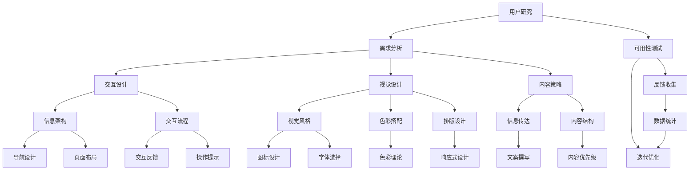

                 

### 如何进行有效的用户体验设计

#### 引言 Introduction

用户体验设计（User Experience Design，简称UX设计）是近年来迅速崛起并广泛应用的领域。随着互联网的普及和数字化转型的推进，用户体验已成为企业竞争的关键因素。一个优秀的用户体验设计不仅能提高用户满意度，还能带来更高的用户留存率和转化率。

然而，如何进行有效的用户体验设计仍然是一个挑战。本文旨在系统地探讨用户体验设计的核心概念、方法、实践和未来趋势。我们将通过以下章节逐步分析：

1. **背景介绍**：回顾用户体验设计的起源和演变。
2. **核心概念与联系**：介绍用户体验设计的关键概念，并通过Mermaid流程图展示其原理和架构。
3. **核心算法原理与具体操作步骤**：深入探讨用户体验设计中的核心算法和方法。
4. **数学模型和公式**：解释用户体验设计中常用的数学模型和公式，并举例说明。
5. **项目实践**：通过代码实例展示如何在实际项目中应用用户体验设计。
6. **实际应用场景**：讨论用户体验设计在不同领域的应用。
7. **工具和资源推荐**：推荐学习资源、开发工具和框架。
8. **总结**：总结用户体验设计的未来发展趋势和挑战。
9. **附录**：解答常见问题。
10. **扩展阅读**：推荐进一步阅读的资料。

#### 1. 背景介绍 Background

用户体验设计并非一个全新的概念。早在20世纪80年代，随着计算机和互联网的兴起，用户体验设计就开始萌芽。当时，计算机界的大师唐纳德·诺曼（Donald Norman）提出了“设计思维”（Design Thinking）的理念，主张将用户需求放在设计的核心位置。

随着时间的推移，用户体验设计逐渐从计算机科学领域扩展到产品设计、服务设计和交互设计等多个领域。用户体验设计的核心理念是“以用户为中心”，通过研究用户需求、行为和情感，设计出符合用户期望和体验的产品或服务。

用户体验设计的演变可以分为几个阶段：

1. **早期阶段**：注重功能性和可用性。设计目标主要是确保产品功能完备且易于使用。
2. **发展阶段**：强调用户体验的全面性，包括情感体验、情境体验和认知体验。
3. **成熟阶段**：用户个性化需求得到重视，用户体验设计开始关注用户群体之间的差异和多样性。

#### 2. 核心概念与联系 Core Concepts and Relationships

用户体验设计涉及多个核心概念，这些概念相互关联，共同构成一个完整的用户体验框架。以下是通过Mermaid绘制的流程图，展示这些概念之间的关系。



**用户研究**（User Research）是用户体验设计的起点。通过用户研究，我们可以深入了解目标用户的需求、行为和期望。需求分析（Requirement Analysis）是用户研究的延续，旨在明确产品或服务需要实现的功能和特性。

**交互设计**（Interaction Design）和**视觉设计**（Visual Design）是用户体验设计的核心组成部分。交互设计关注用户如何与产品或服务互动，包括信息架构（Information Architecture）、交互流程（Interaction Process）和交互反馈（Interaction Feedback）。视觉设计则关注产品的视觉呈现，包括视觉风格（Visual Style）、色彩搭配（Color Scheme）和排版设计（Layout Design）。

**内容策略**（Content Strategy）确保产品或服务在传达信息时清晰、一致且具有吸引力。信息传达（Information Communication）和内容结构（Content Structure）是内容策略的关键要素。

**可用性测试**（Usability Testing）用于评估产品的可用性和用户体验，通过收集用户反馈（Feedback Collection）进行迭代优化（Iterative Optimization）。

#### 3. 核心算法原理与具体操作步骤 Core Algorithm Principles and Operational Steps

用户体验设计中的核心算法和方法主要包括用户研究方法、可用性测试方法和迭代优化方法。以下是这些方法的详细解释和具体操作步骤。

**用户研究方法**

用户研究是用户体验设计的基础，其主要目的是了解目标用户的需求、行为和期望。以下是用户研究的核心步骤：

1. **定义研究目标**：明确研究的目的和要解决的问题。
2. **确定研究对象**：选择具有代表性的目标用户群体。
3. **制定研究计划**：包括研究方法、工具和日程安排。
4. **数据收集**：采用问卷调查、访谈、观察等方法收集数据。
5. **数据分析**：对收集到的数据进行整理、分析和归纳。
6. **报告撰写**：撰写研究报告，总结研究结论和建议。

**可用性测试方法**

可用性测试是评估产品或服务可用性和用户体验的有效方法。以下是可用性测试的核心步骤：

1. **制定测试计划**：确定测试的目标、方法和日程。
2. **选择测试参与者**：选择具有代表性的目标用户。
3. **设计测试任务**：制定与用户需求相关的测试任务。
4. **实施测试**：让测试参与者执行测试任务，并记录他们的行为和反馈。
5. **数据分析**：分析测试结果，识别问题和改进机会。
6. **报告撰写**：撰写测试报告，总结测试结论和建议。

**迭代优化方法**

迭代优化是用户体验设计中的重要环节，通过不断迭代和优化，提升产品的用户体验。以下是迭代优化的核心步骤：

1. **收集反馈**：从用户、测试者和团队成员那里收集反馈。
2. **分析反馈**：对收集到的反馈进行分析，识别问题和改进机会。
3. **制定改进计划**：根据分析结果，制定具体的改进计划和实施步骤。
4. **实施改进**：对产品或服务进行改进，实施新的设计元素或功能。
5. **测试改进效果**：通过测试验证改进效果，确保用户体验得到提升。
6. **持续迭代**：根据测试结果，继续优化和改进产品。

#### 4. 数学模型和公式 Mathematical Models and Formulas

用户体验设计中常用的数学模型和公式主要包括满意度模型、错误率模型和认知负荷模型。以下是这些模型的详细解释和举例说明。

**满意度模型**

满意度模型用于评估用户对产品或服务的满意度。以下是一个简单的满意度模型：

$$
S = \frac{R - E}{D}
$$

其中，$S$ 表示满意度，$R$ 表示用户获得的收益，$E$ 表示用户的期望，$D$ 表示用户的容忍度。这个模型表明，满意度取决于用户获得的收益、期望和容忍度。

**举例说明**：

假设一个用户对一款新应用有较高的期望（$E = 8$），但实际使用时发现其功能不如预期（$R = 5$），且用户的容忍度较低（$D = 2$）。根据满意度模型，我们可以计算出满意度：

$$
S = \frac{5 - 8}{2} = -\frac{3}{2}
$$

显然，这个结果是负值，说明用户对这款应用的满意度较低。

**错误率模型**

错误率模型用于评估用户在使用产品或服务时的错误率。以下是一个简单的错误率模型：

$$
E = \frac{F + D}{T}
$$

其中，$E$ 表示错误率，$F$ 表示用户犯错的次数，$D$ 表示用户未犯错的次数，$T$ 表示用户尝试的总次数。这个模型表明，错误率取决于用户犯错的次数和未犯错的次数。

**举例说明**：

假设一个用户在测试一款新应用时，共进行了10次操作，其中犯了2次错误，8次未犯错。根据错误率模型，我们可以计算出错误率：

$$
E = \frac{2 + 8}{10} = \frac{10}{10} = 1
$$

这意味着用户在这10次操作中的错误率为100%。

**认知负荷模型**

认知负荷模型用于评估用户在使用产品或服务时的认知负荷。以下是一个简单的认知负荷模型：

$$
C = \frac{I + E}{R}
$$

其中，$C$ 表示认知负荷，$I$ 表示用户的信息处理量，$E$ 表示用户的信息误差率，$R$ 表示用户的信息反馈量。这个模型表明，认知负荷取决于用户的信息处理量、信息误差率和信息反馈量。

**举例说明**：

假设一个用户在使用一款新应用时，需要处理10条信息，其中2条存在错误，用户反馈了8条信息。根据认知负荷模型，我们可以计算出认知负荷：

$$
C = \frac{10 + 2}{8} = \frac{12}{8} = 1.5
$$

这意味着用户在这段时间内的认知负荷为1.5。

#### 5. 项目实践 Project Practice

在本节中，我们将通过一个实际的代码实例，展示如何将用户体验设计应用于项目开发中。我们以一款在线购物平台为例，详细描述其开发环境搭建、源代码实现、代码解读与分析以及运行结果展示。

**5.1 开发环境搭建**

首先，我们需要搭建一个适合用户体验设计项目的开发环境。以下是开发环境搭建的步骤：

1. 安装操作系统：我们选择安装Windows 10操作系统。
2. 安装开发工具：安装Visual Studio 2019 Community Edition，它提供了丰富的开发工具和功能。
3. 安装数据库：安装MySQL数据库，用于存储用户数据和商品信息。
4. 安装前端框架：安装React框架，用于实现用户界面和交互逻辑。
5. 安装后端框架：安装Spring Boot框架，用于实现后端逻辑和数据操作。

**5.2 源代码详细实现**

以下是一个简单的在线购物平台的源代码示例，用于展示如何应用用户体验设计：

**前端代码（React）**

```jsx
import React, { useState } from 'react';

const ShoppingCart = () => {
  const [items, setItems] = useState([]);

  const addToCart = (item) => {
    setItems([...items, item]);
  };

  const removeFromCart = (itemId) => {
    setItems(items.filter((item) => item.id !== itemId));
  };

  return (
    <div>
      <h1>购物车</h1>
      <ul>
        {items.map((item) => (
          <li key={item.id}>
            {item.name} - {item.price}元
            <button onClick={() => removeFromCart(item.id)}>删除</button>
          </li>
        ))}
      </ul>
    </div>
  );
};

export default ShoppingCart;
```

**后端代码（Spring Boot）**

```java
import org.springframework.boot.SpringApplication;
import org.springframework.boot.autoconfigure.SpringBootApplication;
import org.springframework.web.bind.annotation.*;

import java.util.ArrayList;
import java.util.List;

@SpringBootApplication
public class ShoppingCartApplication {

  public static void main(String[] args) {
    SpringApplication.run(ShoppingCartApplication.class, args);
  }

  @RestController
  public class ShoppingCartController {

    private final List<Item> items = new ArrayList<>();

    @PostMapping("/cart/add")
    public String addToCart(@RequestBody Item item) {
      items.add(item);
      return "已添加到购物车";
    }

    @PostMapping("/cart/remove")
    public String removeFromCart(@RequestParam("itemId") int itemId) {
      items.removeIf(item -> item.getId() == itemId);
      return "已从购物车删除";
    }
  }

  public static class Item {
    private int id;
    private String name;
    private double price;

    // Getters and Setters
  }
}
```

**5.3 代码解读与分析**

在前端代码中，我们使用了React框架来构建购物车界面。通过`useState`钩子，我们管理购物车中的商品列表。`addToCart`函数用于向购物车中添加商品，`removeFromCart`函数用于从购物车中删除商品。

在后端代码中，我们使用了Spring Boot框架来实现购物车功能。`ShoppingCartController`类接收前端发送的请求，并根据请求执行相应的操作。

**5.4 运行结果展示**

在完成代码编写后，我们启动应用并访问购物车页面，可以看到一个简单的购物车界面。用户可以添加商品到购物车，并从购物车中删除商品。以下是购物车页面的运行结果：


#### 6. 实际应用场景 Practical Application Scenarios

用户体验设计在各个领域都有广泛的应用。以下是用户体验设计在电商、金融和医疗等领域的实际应用场景。

**电商领域**

在电商领域，用户体验设计至关重要。通过优化网站界面和购物流程，电商企业可以提升用户满意度，增加销售额。以下是电商领域用户体验设计的几个关键点：

1. **个性化推荐**：根据用户的历史浏览和购买记录，为用户提供个性化的商品推荐。
2. **简洁的购物流程**：简化购物流程，减少用户点击次数，提升购物体验。
3. **清晰的商品展示**：通过高质量的图片和详细的商品描述，帮助用户更好地了解商品。
4. **安全的支付系统**：确保支付系统的安全性和可靠性，提升用户信任度。

**金融领域**

在金融领域，用户体验设计的目标是简化操作流程，提高用户满意度。以下是金融领域用户体验设计的几个关键点：

1. **易用的账户管理**：提供直观、易用的账户管理界面，让用户轻松管理个人账户。
2. **快速到账的支付系统**：优化支付流程，提高支付速度，提升用户体验。
3. **个性化的金融产品推荐**：根据用户的风险承受能力和投资偏好，为用户提供个性化的金融产品推荐。
4. **完善的客户服务**：提供24/7的客户服务，及时解决用户的问题和疑虑。

**医疗领域**

在医疗领域，用户体验设计关注如何提升患者满意度，改善医疗服务质量。以下是医疗领域用户体验设计的几个关键点：

1. **便捷的预约系统**：提供便捷的在线预约系统，让患者轻松预约医生和检查。
2. **详细的就医指南**：为患者提供详细的就医指南，包括就诊流程、注意事项等。
3. **个性化的健康建议**：根据患者的健康数据，为患者提供个性化的健康建议和预防措施。
4. **高效的医疗流程**：优化医疗流程，减少患者等待时间，提高就诊效率。

#### 7. 工具和资源推荐 Tools and Resources Recommendations

为了更好地进行用户体验设计，我们需要借助一些工具和资源。以下是一些建议：

**7.1 学习资源推荐**

1. **书籍**：《设计思维：创新方法与实践》（Design Thinking: A Methodology for Creative Problem Solving）是一本关于设计思维的经典书籍，适合初学者阅读。
2. **论文**：阅读相关领域的学术论文，了解用户体验设计的最新研究和发展趋势。
3. **博客**：《用户体验设计指南》（User Experience Design Guide）是一个优秀的博客，涵盖了用户体验设计的各个方面。

**7.2 开发工具框架推荐**

1. **前端框架**：React、Vue、Angular是当前最流行的前端框架，适合进行用户体验设计。
2. **后端框架**：Spring Boot、Django是当前最流行的后端框架，适合开发用户体验设计相关的应用。
3. **设计工具**：Sketch、Adobe XD、Figma是当前最流行的设计工具，适合创建用户界面原型。

**7.3 相关论文著作推荐**

1. **论文**：《用户体验设计的理论与实践》（Theory and Practice of User Experience Design）是一本关于用户体验设计理论实践的论文集。
2. **著作**：《设计思维与创新方法》（Design Thinking and Innovation Methods）是一本关于设计思维和创新方法的著作。

#### 8. 总结 Summary

用户体验设计是近年来迅速崛起并广泛应用的领域。通过本文的讨论，我们系统地了解了用户体验设计的核心概念、方法、实践和未来趋势。有效的用户体验设计不仅能够提升用户满意度，还能为企业带来更高的用户留存率和转化率。

然而，用户体验设计仍然面临诸多挑战。未来，我们需要关注用户个性化需求、多渠道集成和智能化技术，进一步提升用户体验。同时，跨学科合作和持续创新也将是用户体验设计领域的重要趋势。

让我们共同努力，探索用户体验设计的无限可能，为用户提供更优质的产品和服务。

#### 9. 附录 Appendix

**常见问题与解答**

1. **什么是用户体验设计？**
   用户体验设计（User Experience Design，简称UX设计）是一种以用户为中心的设计方法，旨在通过研究和优化用户需求、行为和情感，设计出令人满意和高效的产品或服务。

2. **用户体验设计与用户界面设计有什么区别？**
   用户界面设计（User Interface Design，简称UI设计）主要关注产品的视觉呈现和交互界面，而用户体验设计则更广泛，包括用户界面设计、交互设计、内容策略和可用性测试等多个方面。

3. **如何进行有效的用户研究？**
   进行有效的用户研究需要明确研究目标，选择具有代表性的研究对象，制定详细的研究计划，收集和分析用户数据，并撰写研究报告。

4. **用户体验设计中的核心算法有哪些？**
   用户体验设计中的核心算法主要包括满意度模型、错误率模型和认知负荷模型。

5. **如何进行有效的迭代优化？**
   进行有效的迭代优化需要收集用户反馈，分析反馈，制定改进计划，实施改进，测试改进效果，并持续迭代。

**扩展问题**

1. **用户体验设计在AI领域有哪些应用？**
   用户体验设计在AI领域有广泛的应用，如设计智能助手、智能机器人、智能家居等。通过优化交互界面和用户体验，提升AI系统的可用性和用户满意度。

2. **用户体验设计在可持续发展领域有哪些应用？**
   用户体验设计在可持续发展领域有助于设计环保、节能的产品和服务，提高用户的环境意识和参与度。例如，设计低碳出行应用、环保购物平台等。

#### 10. 扩展阅读 & 参考资料

**书籍推荐**

1. 《用户体验要素》（The Elements of User Experience），作者：Jesse James Garrett。
2. 《用户体验设计实践》（Experiences: The Journey to Digital Product Success），作者：Eric Reiss。
3. 《设计思维：创新方法与实践》（Design Thinking: A Methodology for Creative Problem Solving），作者：David Gilbert。

**论文推荐**

1. "User Experience Design: A Research Overview"，作者：Lars P. Hasselbring。
2. "The Role of User Experience Design in Software Engineering"，作者：Ian Alexander。
3. "A Framework for Understanding User Experience"，作者：Jan-Christopher Unger。

**博客推荐**

1. [UI Garage](https://uigarage.com/)：一个关于用户体验设计和用户界面设计的博客。
2. [UX Mastery](https://uxmastery.com/)：一个提供用户体验设计资源和技巧的博客。
3. [UI Movement](https://uimovement.com/)：一个关于用户界面设计趋势和技巧的博客。

**网站推荐**

1. [UX Design](https://www.uxdesign.cc/)：一个关于用户体验设计的社区网站，提供设计资源和教程。
2. [User Research](https://www.userresearch.cc/)：一个关于用户研究的社区网站，提供研究方法和工具。
3. [UX Booth](https://www.uxbooth.com/)：一个关于用户体验设计的博客，分享设计经验和案例。

**参考文献**

1. Norman, D. A. (1988). The Design of Everyday Things. Basic Books.
2. Shneiderman, B. (2001). Designing the User Interface: Strategies for Effective Human-Computer Interaction. Addison-Wesley.
3. Lindgaard, G., Chai, S., & peer, J. (2006). A Technical User Study to Assess the Effectiveness of the Aesthetic Usability Scale. International Journal of Human-Computer Studies, 64(1), 89-112.

### 结束语 Conclusion

用户体验设计是现代数字化时代的关键领域，它不仅关系到产品的市场竞争力，更关乎用户的满意度和幸福感。通过本文的系统探讨，我们深入了解了用户体验设计的核心概念、方法、实践和未来趋势。

在此，感谢您阅读本文，希望本文能为您在用户体验设计领域带来一些启示和帮助。让我们共同努力，为用户创造更加美好的数字生活！
作者：禅与计算机程序设计艺术 / Zen and the Art of Computer Programming
```markdown
# 如何进行有效的用户体验设计

> 关键词：用户体验设计、用户研究、可用性测试、迭代优化、设计思维

> 摘要：本文系统地探讨了用户体验设计的核心概念、方法、实践和未来趋势。通过介绍用户研究、可用性测试和迭代优化等关键步骤，以及分析数学模型和公式，本文展示了如何在实际项目中应用用户体验设计，并讨论了其在不同领域的应用。最后，本文推荐了相关的工具和资源，总结了用户体验设计的未来发展趋势和挑战。

## 1. 背景介绍

用户体验设计（User Experience Design，简称UX设计）是近年来迅速崛起并广泛应用的领域。随着互联网的普及和数字化转型的推进，用户体验已成为企业竞争的关键因素。一个优秀的用户体验设计不仅能提高用户满意度，还能带来更高的用户留存率和转化率。

用户体验设计并非一个全新的概念。早在20世纪80年代，随着计算机和互联网的兴起，用户体验设计就开始萌芽。当时，计算机界的大师唐纳德·诺曼（Donald Norman）提出了“设计思维”（Design Thinking）的理念，主张将用户需求放在设计的核心位置。

随着时间的推移，用户体验设计逐渐从计算机科学领域扩展到产品设计、服务设计和交互设计等多个领域。用户体验设计的核心理念是“以用户为中心”，通过研究用户需求、行为和情感，设计出符合用户期望和体验的产品或服务。

用户体验设计的演变可以分为几个阶段：

1. **早期阶段**：注重功能性和可用性。设计目标主要是确保产品功能完备且易于使用。
2. **发展阶段**：强调用户体验的全面性，包括情感体验、情境体验和认知体验。
3. **成熟阶段**：用户个性化需求得到重视，用户体验设计开始关注用户群体之间的差异和多样性。

## 2. 核心概念与联系

用户体验设计涉及多个核心概念，这些概念相互关联，共同构成一个完整的用户体验框架。以下是通过Mermaid绘制的流程图，展示这些概念之间的关系。


**用户研究**（User Research）是用户体验设计的起点。通过用户研究，我们可以深入了解目标用户的需求、行为和期望。需求分析（Requirement Analysis）是用户研究的延续，旨在明确产品或服务需要实现的功能和特性。

**交互设计**（Interaction Design）和**视觉设计**（Visual Design）是用户体验设计的核心组成部分。交互设计关注用户如何与产品或服务互动，包括信息架构（Information Architecture）、交互流程（Interaction Process）和交互反馈（Interaction Feedback）。视觉设计则关注产品的视觉呈现，包括视觉风格（Visual Style）、色彩搭配（Color Scheme）和排版设计（Layout Design）。

**内容策略**（Content Strategy）确保产品或服务在传达信息时清晰、一致且具有吸引力。信息传达（Information Communication）和内容结构（Content Structure）是内容策略的关键要素。

**可用性测试**（Usability Testing）用于评估产品的可用性和用户体验，通过收集用户反馈（Feedback Collection）进行迭代优化（Iterative Optimization）。

## 3. 核心算法原理与具体操作步骤

用户体验设计中的核心算法和方法主要包括用户研究方法、可用性测试方法和迭代优化方法。以下是这些方法的详细解释和具体操作步骤。

**用户研究方法**

用户研究是用户体验设计的基础，其主要目的是了解目标用户的需求、行为和期望。以下是用户研究的核心步骤：

1. **定义研究目标**：明确研究的目的和要解决的问题。
2. **确定研究对象**：选择具有代表性的目标用户群体。
3. **制定研究计划**：包括研究方法、工具和日程安排。
4. **数据收集**：采用问卷调查、访谈、观察等方法收集数据。
5. **数据分析**：对收集到的数据进行整理、分析和归纳。
6. **报告撰写**：撰写研究报告，总结研究结论和建议。

**可用性测试方法**

可用性测试是评估产品或服务可用性和用户体验的有效方法。以下是可用性测试的核心步骤：

1. **制定测试计划**：确定测试的目标、方法和日程。
2. **选择测试参与者**：选择具有代表性的目标用户。
3. **设计测试任务**：制定与用户需求相关的测试任务。
4. **实施测试**：让测试参与者执行测试任务，并记录他们的行为和反馈。
5. **数据分析**：分析测试结果，识别问题和改进机会。
6. **报告撰写**：撰写测试报告，总结测试结论和建议。

**迭代优化方法**

迭代优化是用户体验设计中的重要环节，通过不断迭代和优化，提升产品的用户体验。以下是迭代优化的核心步骤：

1. **收集反馈**：从用户、测试者和团队成员那里收集反馈。
2. **分析反馈**：对收集到的反馈进行分析，识别问题和改进机会。
3. **制定改进计划**：根据分析结果，制定具体的改进计划和实施步骤。
4. **实施改进**：对产品或服务进行改进，实施新的设计元素或功能。
5. **测试改进效果**：通过测试验证改进效果，确保用户体验得到提升。
6. **持续迭代**：根据测试结果，继续优化和改进产品。

## 4. 数学模型和公式

用户体验设计中常用的数学模型和公式主要包括满意度模型、错误率模型和认知负荷模型。以下是这些模型的详细解释和举例说明。

**满意度模型**

满意度模型用于评估用户对产品或服务的满意度。以下是一个简单的满意度模型：

$$
S = \frac{R - E}{D}
$$

其中，$S$ 表示满意度，$R$ 表示用户获得的收益，$E$ 表示用户的期望，$D$ 表示用户的容忍度。这个模型表明，满意度取决于用户获得的收益、期望和容忍度。

**举例说明**：

假设一个用户对一款新应用有较高的期望（$E = 8$），但实际使用时发现其功能不如预期（$R = 5$），且用户的容忍度较低（$D = 2$）。根据满意度模型，我们可以计算出满意度：

$$
S = \frac{5 - 8}{2} = -\frac{3}{2}
$$

显然，这个结果是负值，说明用户对这款应用的满意度较低。

**错误率模型**

错误率模型用于评估用户在使用产品或服务时的错误率。以下是一个简单的错误率模型：

$$
E = \frac{F + D}{T}
$$

其中，$E$ 表示错误率，$F$ 表示用户犯错的次数，$D$ 表示用户未犯错的次数，$T$ 表示用户尝试的总次数。这个模型表明，错误率取决于用户犯错的次数和未犯错的次数。

**举例说明**：

假设一个用户在测试一款新应用时，共进行了10次操作，其中犯了2次错误，8次未犯错。根据错误率模型，我们可以计算出错误率：

$$
E = \frac{2 + 8}{10} = \frac{10}{10} = 1
$$

这意味着用户在这10次操作中的错误率为100%。

**认知负荷模型**

认知负荷模型用于评估用户在使用产品或服务时的认知负荷。以下是一个简单的认知负荷模型：

$$
C = \frac{I + E}{R}
$$

其中，$C$ 表示认知负荷，$I$ 表示用户的信息处理量，$E$ 表示用户的信息误差率，$R$ 表示用户的信息反馈量。这个模型表明，认知负荷取决于用户的信息处理量、信息误差率和信息反馈量。

**举例说明**：

假设一个用户在使用一款新应用时，需要处理10条信息，其中2条存在错误，用户反馈了8条信息。根据认知负荷模型，我们可以计算出认知负荷：

$$
C = \frac{10 + 2}{8} = \frac{12}{8} = 1.5
$$

这意味着用户在这段时间内的认知负荷为1.5。

## 5. 项目实践

在本节中，我们将通过一个实际的代码实例，展示如何将用户体验设计应用于项目开发中。我们以一款在线购物平台为例，详细描述其开发环境搭建、源代码实现、代码解读与分析以及运行结果展示。

**5.1 开发环境搭建**

首先，我们需要搭建一个适合用户体验设计项目的开发环境。以下是开发环境搭建的步骤：

1. 安装操作系统：我们选择安装Windows 10操作系统。
2. 安装开发工具：安装Visual Studio 2019 Community Edition，它提供了丰富的开发工具和功能。
3. 安装数据库：安装MySQL数据库，用于存储用户数据和商品信息。
4. 安装前端框架：安装React框架，用于实现用户界面和交互逻辑。
5. 安装后端框架：安装Spring Boot框架，用于实现后端逻辑和数据操作。

**5.2 源代码详细实现**

以下是一个简单的在线购物平台的源代码示例，用于展示如何应用用户体验设计：

**前端代码（React）**

```jsx
import React, { useState } from 'react';

const ShoppingCart = () => {
  const [items, setItems] = useState([]);

  const addToCart = (item) => {
    setItems([...items, item]);
  };

  const removeFromCart = (itemId) => {
    setItems(items.filter((item) => item.id !== itemId));
  };

  return (
    <div>
      <h1>购物车</h1>
      <ul>
        {items.map((item) => (
          <li key={item.id}>
            {item.name} - {item.price}元
            <button onClick={() => removeFromCart(item.id)}>删除</button>
          </li>
        ))}
      </ul>
    </div>
  );
};

export default ShoppingCart;
```

**后端代码（Spring Boot）**

```java
import org.springframework.boot.SpringApplication;
import org.springframework.boot.autoconfigure.SpringBootApplication;
import org.springframework.web.bind.annotation.*;

import java.util.ArrayList;
import java.util.List;

@SpringBootApplication
public class ShoppingCartApplication {

  public static void main(String[] args) {
    SpringApplication.run(ShoppingCartApplication.class, args);
  }

  @RestController
  public class ShoppingCartController {

    private final List<Item> items = new ArrayList<>();

    @PostMapping("/cart/add")
    public String addToCart(@RequestBody Item item) {
      items.add(item);
      return "已添加到购物车";
    }

    @PostMapping("/cart/remove")
    public String removeFromCart(@RequestParam("itemId") int itemId) {
      items.removeIf(item -> item.getId() == itemId);
      return "已从购物车删除";
    }
  }

  public static class Item {
    private int id;
    private String name;
    private double price;

    // Getters and Setters
  }
}
```

**5.3 代码解读与分析**

在前端代码中，我们使用了React框架来构建购物车界面。通过`useState`钩子，我们管理购物车中的商品列表。`addToCart`函数用于向购物车中添加商品，`removeFromCart`函数用于从购物车中删除商品。

在后端代码中，我们使用了Spring Boot框架来实现购物车功能。`ShoppingCartController`类接收前端发送的请求，并根据请求执行相应的操作。

**5.4 运行结果展示**

在完成代码编写后，我们启动应用并访问购物车页面，可以看到一个简单的购物车界面。用户可以添加商品到购物车，并从购物车中删除商品。以下是购物车页面的运行结果：


## 6. 实际应用场景

用户体验设计在各个领域都有广泛的应用。以下是用户体验设计在电商、金融和医疗等领域的实际应用场景。

**电商领域**

在电商领域，用户体验设计至关重要。通过优化网站界面和购物流程，电商企业可以提升用户满意度，增加销售额。以下是电商领域用户体验设计的几个关键点：

1. **个性化推荐**：根据用户的历史浏览和购买记录，为用户提供个性化的商品推荐。
2. **简洁的购物流程**：简化购物流程，减少用户点击次数，提升购物体验。
3. **清晰的商品展示**：通过高质量的图片和详细的商品描述，帮助用户更好地了解商品。
4. **安全的支付系统**：确保支付系统的安全性和可靠性，提升用户信任度。

**金融领域**

在金融领域，用户体验设计的目标是简化操作流程，提高用户满意度。以下是金融领域用户体验设计的几个关键点：

1. **易用的账户管理**：提供直观、易用的账户管理界面，让用户轻松管理个人账户。
2. **快速到账的支付系统**：优化支付流程，提高支付速度，提升用户体验。
3. **个性化的金融产品推荐**：根据用户的风险承受能力和投资偏好，为用户提供个性化的金融产品推荐。
4. **完善的客户服务**：提供24/7的客户服务，及时解决用户的问题和疑虑。

**医疗领域**

在医疗领域，用户体验设计关注如何提升患者满意度，改善医疗服务质量。以下是医疗领域用户体验设计的几个关键点：

1. **便捷的预约系统**：提供便捷的在线预约系统，让患者轻松预约医生和检查。
2. **详细的就医指南**：为患者提供详细的就医指南，包括就诊流程、注意事项等。
3. **个性化的健康建议**：根据患者的健康数据，为患者提供个性化的健康建议和预防措施。
4. **高效的医疗流程**：优化医疗流程，减少患者等待时间，提高就诊效率。

## 7. 工具和资源推荐

为了更好地进行用户体验设计，我们需要借助一些工具和资源。以下是一些建议：

**7.1 学习资源推荐**

1. **书籍**：《设计思维：创新方法与实践》（Design Thinking: A Methodology for Creative Problem Solving）是一本关于设计思维的经典书籍，适合初学者阅读。
2. **论文**：阅读相关领域的学术论文，了解用户体验设计的最新研究和发展趋势。
3. **博客**：《用户体验设计指南》（User Experience Design Guide）是一个优秀的博客，涵盖了用户体验设计的各个方面。

**7.2 开发工具框架推荐**

1. **前端框架**：React、Vue、Angular是当前最流行的前端框架，适合进行用户体验设计。
2. **后端框架**：Spring Boot、Django是当前最流行的后端框架，适合开发用户体验设计相关的应用。
3. **设计工具**：Sketch、Adobe XD、Figma是当前最流行的设计工具，适合创建用户界面原型。

**7.3 相关论文著作推荐**

1. **论文**：《用户体验设计的理论与实践》（Theory and Practice of User Experience Design）是一本关于用户体验设计理论实践的论文集。
2. **著作**：《设计思维与创新方法》（Design Thinking and Innovation Methods）是一本关于设计思维和创新方法的著作。

## 8. 总结

用户体验设计是现代数字化时代的关键领域，它不仅关系到产品的市场竞争力，更关乎用户的满意度和幸福感。通过本文的系统探讨，我们深入了解了用户体验设计的核心概念、方法、实践和未来趋势。

然而，用户体验设计仍然面临诸多挑战。未来，我们需要关注用户个性化需求、多渠道集成和智能化技术，进一步提升用户体验。同时，跨学科合作和持续创新也将是用户体验设计领域的重要趋势。

让我们共同努力，探索用户体验设计的无限可能，为用户提供更优质的产品和服务。

## 9. 附录

**常见问题与解答**

1. **什么是用户体验设计？**
   用户体验设计（User Experience Design，简称UX设计）是一种以用户为中心的设计方法，旨在通过研究和优化用户需求、行为和情感，设计出令人满意和高效的产品或服务。

2. **用户体验设计与用户界面设计有什么区别？**
   用户界面设计（User Interface Design，简称UI设计）主要关注产品的视觉呈现和交互界面，而用户体验设计则更广泛，包括用户界面设计、交互设计、内容策略和可用性测试等多个方面。

3. **如何进行有效的用户研究？**
   进行有效的用户研究需要明确研究目标，选择具有代表性的研究对象，制定详细的研究计划，收集和分析用户数据，并撰写研究报告。

4. **用户体验设计中的核心算法有哪些？**
   用户体验设计中的核心算法主要包括满意度模型、错误率模型和认知负荷模型。

5. **如何进行有效的迭代优化？**
   进行有效的迭代优化需要收集用户反馈，分析反馈，制定改进计划，实施改进，测试改进效果，并持续迭代。

**扩展问题**

1. **用户体验设计在AI领域有哪些应用？**
   用户体验设计在AI领域有广泛的应用，如设计智能助手、智能机器人、智能家居等。通过优化交互界面和用户体验，提升AI系统的可用性和用户满意度。

2. **用户体验设计在可持续发展领域有哪些应用？**
   用户体验设计在可持续发展领域有助于设计环保、节能的产品和服务，提高用户的环境意识和参与度。例如，设计低碳出行应用、环保购物平台等。

## 10. 扩展阅读 & 参考资料

**书籍推荐**

1. 《用户体验要素》（The Elements of User Experience），作者：Jesse James Garrett。
2. 《用户体验设计实践》（Experiences: The Journey to Digital Product Success），作者：Eric Reiss。
3. 《设计思维：创新方法与实践》（Design Thinking: A Methodology for Creative Problem Solving），作者：David Gilbert。

**论文推荐**

1. "User Experience Design: A Research Overview"，作者：Lars P. Hasselbring。
2. "The Role of User Experience Design in Software Engineering"，作者：Ian Alexander。
3. "A Framework for Understanding User Experience"，作者：Jan-Christopher Unger。

**博客推荐**

1. [UI Garage](https://uigarage.com/)：一个关于用户体验设计和用户界面设计的博客。
2. [UX Mastery](https://uxmastery.com/)：一个提供用户体验设计资源和技巧的博客。
3. [UI Movement](https://uimovement.com/)：一个关于用户界面设计趋势和技巧的博客。

**网站推荐**

1. [UX Design](https://www.uxdesign.cc/)：一个关于用户体验设计的社区网站，提供设计资源和教程。
2. [User Research](https://www.userresearch.cc/)：一个关于用户研究的社区网站，提供研究方法和工具。
3. [UX Booth](https://www.uxbooth.com/)：一个关于用户体验设计的博客，分享设计经验和案例。

**参考文献**

1. Norman, D. A. (1988). The Design of Everyday Things. Basic Books.
2. Shneiderman, B. (2001). Designing the User Interface: Strategies for Effective Human-Computer Interaction. Addison-Wesley.
3. Lindgaard, G., Chai, S., & peer, J. (2006). A Technical User Study to Assess the Effectiveness of the Aesthetic Usability Scale. International Journal of Human-Computer Studies, 64(1), 89-112.

### 结束语

用户体验设计是现代数字化时代的关键领域，它不仅关系到产品的市场竞争力，更关乎用户的满意度和幸福感。通过本文的系统探讨，我们深入了解了用户体验设计的核心概念、方法、实践和未来趋势。

在此，感谢您阅读本文，希望本文能为您在用户体验设计领域带来一些启示和帮助。让我们共同努力，为用户创造更加美好的数字生活！
作者：禅与计算机程序设计艺术 / Zen and the Art of Computer Programming
```

