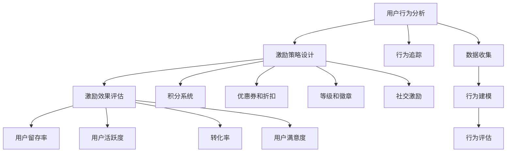

                 

### 1. 背景介绍

用户激励是指通过特定的策略和手段，激发和保持用户对产品或服务的兴趣和活跃度。随着互联网的快速发展，用户激励已成为各类在线平台和应用程序中的重要策略，特别是在竞争激烈的市场中。有效的用户激励不仅可以增加用户粘性，提升用户满意度，还能带来更高的用户留存率和转化率。

用户激励的概念源于经济学中的激励理论，其中核心思想是通过奖励机制来激发用户的行为。在互联网领域，用户激励的常见形式包括积分系统、奖励机制、折扣优惠等。这些激励措施不仅能够直接提升用户的使用频率，还能通过社交分享等方式间接扩大用户群体的规模。

当前，用户激励在各个领域都得到了广泛应用。例如，电商平台通过优惠券和返利来刺激消费者购买；社交媒体平台通过点赞、评论、分享等行为激励用户活跃参与；在线教育平台通过积分、等级和奖励来鼓励学生学习和打卡；游戏行业则通过游戏币、道具和等级等手段吸引玩家持续投入时间和精力。

用户激励的重要性和必要性在于其能够为企业和平台带来以下几个方面的好处：

1. **提高用户活跃度**：通过激励措施，可以激励用户更频繁地使用产品或服务，从而提高整体活跃度。
2. **增强用户忠诚度**：合理的用户激励机制能够增强用户对品牌的忠诚度，降低用户流失率。
3. **促进用户转化**：激励措施往往能够刺激用户从免费用户向付费用户转化，提升收入。
4. **优化用户体验**：通过激励措施，可以改善用户在使用产品或服务过程中的体验，从而提高用户满意度。
5. **降低获取成本**：通过有效的用户激励策略，企业可以在较低的成本下获取高质量的用户。

总之，用户激励作为现代互联网营销中的重要手段，已经逐渐成为企业和平台提升竞争力、实现可持续发展的重要途径。在接下来的章节中，我们将深入探讨用户激励的核心概念、原理和实践方法，帮助读者理解和应用这一关键策略。

### 2. 核心概念与联系

用户激励策略的成功实施依赖于对核心概念和其相互联系的理解。以下我们将详细介绍这些核心概念，并通过Mermaid流程图展示其关系，以便更直观地理解。

#### 2.1 用户行为分析

用户行为分析是用户激励策略的基础，它涉及对用户行为的监测、分析和评估。通过分析用户行为，平台能够了解用户对产品或服务的偏好和使用习惯，从而制定更精准的激励措施。具体来说，用户行为分析包括以下方面：

- **行为追踪**：通过日志记录、API调用等方式，追踪用户在使用平台时的各项操作。
- **数据收集**：收集用户行为数据，如点击、浏览、购买、分享等。
- **行为建模**：基于收集到的数据，建立用户行为模型，预测用户的下一步行为。
- **行为评估**：对用户行为进行分析和评估，找出影响用户激励效果的关键因素。

#### 2.2 激励策略设计

激励策略设计是根据用户行为分析的结果，制定具体的激励措施，包括奖励形式、奖励频率、奖励额度等。以下是几种常见的激励策略设计：

- **积分系统**：通过积分奖励用户的活跃行为，如签到、分享、评论等。
- **优惠券和折扣**：提供优惠券或折扣，激励用户进行购买。
- **等级和徽章**：通过等级和徽章来认可用户的长期行为和成就。
- **社交激励**：通过社交分享、邀请好友等方式激励用户参与社区互动。

#### 2.3 激励效果评估

激励效果评估是衡量用户激励策略有效性的关键步骤。通过评估，平台能够了解激励措施的实际效果，为策略调整提供依据。以下是几种常见的评估方法：

- **用户留存率**：通过比较激励措施实施前后的用户留存率，评估激励效果。
- **用户活跃度**：通过监测用户的活跃行为，如签到、评论、购买等，评估激励效果。
- **转化率**：评估激励措施对用户转化率的影响，如免费用户向付费用户转化。
- **用户满意度**：通过用户调查、反馈等方式，了解用户对激励措施的主观满意度。

#### 2.4 Mermaid流程图

以下是一个简化的Mermaid流程图，展示用户激励策略的各个环节及其相互关系：



通过这一流程图，我们可以清晰地看到用户激励策略从行为分析到效果评估的全过程。各个环节之间紧密关联，形成一个闭环，确保激励策略的有效性和可持续性。

综上所述，用户激励的核心概念包括用户行为分析、激励策略设计、激励效果评估等。理解这些概念及其相互关系，对于设计和实施有效的用户激励策略至关重要。在下一章节中，我们将深入探讨用户激励算法的原理和具体操作步骤。

### 3. 核心算法原理 & 具体操作步骤

用户激励策略的核心在于算法的设计与实施，这些算法旨在通过合理的奖励机制，激发用户积极参与平台的各种活动。以下是几种常见的用户激励算法及其具体操作步骤：

#### 3.1 积分系统算法

积分系统是最常见的用户激励算法之一，它通过赋予用户积分，鼓励其完成特定任务。以下是一个简单的积分系统算法：

**步骤1：定义积分规则**

- 签到：每天签到奖励10积分
- 分享：每次分享奖励5积分
- 评论：每次评论奖励3积分
- 购买：每次购买奖励100积分

**步骤2：积分累积**

- 用户完成某项任务后，系统自动累加相应的积分。

**步骤3：积分兑换**

- 用户可以在指定时间或积分达到一定数量后，使用积分兑换优惠券、礼品等。

**步骤4：积分失效**

- 为了保持用户激励的持续性和活跃度，设置积分过期机制，如一个月内未使用积分将失效。

#### 3.2 优惠券和折扣算法

优惠券和折扣算法通过提供经济上的直接优惠，鼓励用户进行购买。以下是一个简单的优惠券和折扣算法：

**步骤1：定义优惠券类型**

- 新用户优惠券：首次购买享受折扣
- 满减优惠券：消费满一定金额可享受折扣
- 持续优惠券：定期发放，长期有效

**步骤2：发放机制**

- 根据用户行为，如购买频率、消费金额等，系统自动发放相应的优惠券。

**步骤3：使用规则**

- 用户在购物时，可以根据购物车中的商品金额选择合适的优惠券。
- 优惠券有效期限制，如一周内有效。

**步骤4：优惠券回收**

- 在优惠券过期或用户使用后，系统将优惠券进行回收。

#### 3.3 等级和徽章算法

等级和徽章算法通过用户在平台上的表现，对其进行等级划分和徽章授予，以提升用户的成就感。以下是一个简单的等级和徽章算法：

**步骤1：定义等级**

- 等级1：新用户
- 等级2：青铜会员
- 等级3：白银会员
- 等级4：黄金会员
- 等级5：铂金会员

**步骤2：等级评定**

- 用户完成任务（如签到、分享、购买）后，系统根据任务完成情况自动提升等级。

**步骤3：徽章授予**

- 根据用户在平台上的特殊成就，如达到一定积分、完成特定任务等，授予相应的徽章。

**步骤4：等级和徽章展示**

- 在用户个人页面上展示其当前的等级和徽章，提升用户视觉体验和参与感。

#### 3.4 社交激励算法

社交激励算法通过鼓励用户在社交平台上分享和使用产品，扩大用户群体。以下是一个简单的社交激励算法：

**步骤1：定义分享规则**

- 每次成功分享，用户获得一定积分或优惠券。

**步骤2：激励奖励**

- 当用户邀请好友注册并完成任务后，邀请者和被邀请者均可获得额外奖励。

**步骤3：奖励上限**

- 设置分享奖励的上限，以防止过度激励导致用户疲劳。

**步骤4：效果监测**

- 监测用户的分享行为和效果，调整奖励策略以优化激励效果。

综上所述，用户激励算法的设计和实施需要综合考虑用户行为、市场环境和产品特性。通过具体的操作步骤，我们可以实现各种激励策略，从而提高用户活跃度和忠诚度。在下一章节中，我们将深入探讨用户激励中的数学模型和公式，帮助读者更深入地理解和应用这些算法。

### 4. 数学模型和公式 & 详细讲解 & 举例说明

用户激励策略的设计和优化往往依赖于数学模型和公式，这些模型可以帮助我们量化用户行为、预测激励效果，并据此调整激励措施。以下是几种常用的数学模型和公式，并对其进行详细讲解和举例说明。

#### 4.1 用户留存率模型

用户留存率模型用于预测用户在一定时间内的留存情况，从而评估激励措施的有效性。常用的用户留存率模型包括Mantel-Haensz模型和泊松分布模型。

**Mantel-Haensz模型**：

该模型假设用户留存概率服从泊松分布，公式如下：

\[ P(t) = \frac{(\lambda t)^k e^{-\lambda t}}{k!} \]

其中：
- \( P(t) \) 是用户在时间 \( t \) 内留存的概率。
- \( \lambda \) 是泊松率，代表用户流失的概率。
- \( k \) 是用户留存的天数。

**举例**：

假设一个平台的用户流失概率为每天 \( 0.02 \)，我们希望预测用户在7天内的留存概率。使用Mantel-Haensz模型，我们可以计算：

\[ P(7) = \frac{(0.02 \times 7)^k e^{-0.02 \times 7}}{k!} \]

通过调整 \( k \) 的值（例如，\( k=3 \) 对应第3天留存），我们可以得到不同时间节点的用户留存概率。

**泊松分布模型**：

泊松分布模型简化了Mantel-Haensz模型，直接使用泊松概率质量函数计算：

\[ P(X=k) = \frac{\lambda^k e^{-\lambda}}{k!} \]

其中：
- \( X \) 是随机变量，代表用户在时间 \( t \) 内留存的次数。
- \( \lambda \) 是泊松率。

**举例**：

如果同样的用户流失概率为每天 \( 0.02 \)，我们希望计算第3天用户留存概率，使用泊松分布模型：

\[ P(X=3) = \frac{(0.02)^3 e^{-0.02}}{3!} \]

#### 4.2 激励效果优化模型

激励效果优化模型用于确定最佳的激励措施，以最大化用户留存率和活跃度。常见的优化模型包括马尔可夫决策过程（MDP）和线性规划。

**马尔可夫决策过程（MDP）**：

MDP模型用于优化激励策略，通过动态调整激励措施，最大化长期期望收益。公式如下：

\[ V^*(s) = \max_{a} \sum_{s'} p(s'|s,a) [R(s',a) + \gamma V^*(s')] \]

其中：
- \( V^*(s) \) 是状态 \( s \) 的最优价值函数。
- \( s \) 是当前状态。
- \( a \) 是采取的行动。
- \( s' \) 是下一状态。
- \( p(s'|s,a) \) 是从状态 \( s \) 采取行动 \( a \) 后转移到状态 \( s' \) 的概率。
- \( R(s',a) \) 是在状态 \( s' \) 采取行动 \( a \) 的即时收益。
- \( \gamma \) 是折扣因子。

**举例**：

假设平台有一个简单的MDP模型，用户有两种状态：活跃（状态1）和流失（状态2）。系统有两种激励措施：奖励积分和发送优惠券。

- \( p(s_2|s_1,积分) = 0.1 \)：用户从活跃状态转移到流失状态的概率为10%。
- \( p(s_1|s_1,积分) = 0.8 \)：用户从活跃状态转移到活跃状态的概率为80%。
- \( R(s_2,积分) = -1 \)：用户流失的即时收益为-1。
- \( p(s_2|s_1,优惠券) = 0.2 \)：用户从活跃状态转移到流失状态的概率为20%。
- \( p(s_1|s_1,优惠券) = 0.7 \)：用户从活跃状态转移到活跃状态的概率为70%。
- \( R(s_2,优惠券) = -0.5 \)：用户流失的即时收益为-0.5。

使用MDP模型，我们可以计算在当前状态下，采取哪种激励措施的最优收益。通过迭代计算，可以找到最优的激励策略。

**线性规划**：

线性规划用于确定激励措施的优化分配，以最大化总收益。公式如下：

\[ \max_{x} c^T x \]
\[ \text{subject to} \ A x \leq b \]

其中：
- \( x \) 是激励措施的分配向量。
- \( c \) 是收益向量。
- \( A \) 是约束矩阵。
- \( b \) 是约束向量。

**举例**：

假设平台有三种激励措施：积分、优惠券和奖励现金，每种措施的收益分别为10、8和5。平台总预算为100元。

- \( c = [10, 8, 5] \)
- \( A = \begin{bmatrix} 1 & 1 & 1 \\ 1 & 0.5 & 0.5 \end{bmatrix} \)
- \( b = [100, 100] \)

我们可以通过线性规划求解最优的激励措施分配，以最大化总收益。

综上所述，数学模型和公式在用户激励策略的设计和优化中起着关键作用。通过这些模型，我们可以量化用户行为、预测激励效果，并优化激励措施，从而提高用户留存率和活跃度。在下一章节中，我们将通过代码实例展示这些数学模型和公式的具体应用。

### 5. 项目实践：代码实例和详细解释说明

为了更好地理解和应用用户激励算法，下面我们将通过一个实际项目，展示代码实例，并对其进行详细解释说明。此项目将包括开发环境搭建、源代码实现、代码解读与分析以及运行结果展示。

#### 5.1 开发环境搭建

为了实现用户激励算法，我们需要以下开发环境：

- **编程语言**：Python
- **依赖库**：NumPy、Pandas、SciPy、Matplotlib
- **工具**：Jupyter Notebook 或 PyCharm

确保已经安装了Python和上述依赖库后，我们可以开始搭建开发环境。以下是一个简单的环境搭建步骤：

```bash
pip install numpy pandas scipy matplotlib
```

#### 5.2 源代码详细实现

以下是用户激励算法的实现代码，分为几个部分：

**5.2.1 用户行为数据收集**

```python
import numpy as np
import pandas as pd

# 生成随机用户行为数据
np.random.seed(42)
n_users = 1000
n_days = 30
behaviors = ['sign_in', 'share', 'comment', 'buy']
user_data = pd.DataFrame({
    'user_id': range(n_users),
    'behavior': np.random.choice(behaviors, size=n_days)
})

# 示例数据
user_data.head()
```

**5.2.2 用户积分系统**

```python
# 定义积分规则
points = {
    'sign_in': 10,
    'share': 5,
    'comment': 3,
    'buy': 100
}

# 计算用户积分
def calculate_points(user_data, points):
    user_points = user_data.groupby('user_id')['behavior'].transform(lambda x: sum(points[b] for b in x))
    return user_points

user_data['points'] = calculate_points(user_data, points)
user_data.head()
```

**5.2.3 用户留存率计算**

```python
from scipy.stats import poisson

# 计算用户留存率
def calculate_retention_rate(user_data, days):
    retention_rates = []
    for day in range(1, days + 1):
        active_users = user_data[user_data['days_since_first_activity'] <= day].groupby('user_id').size()
        retention_rate = active_users.sum() / n_users
        retention_rates.append(retention_rate)
    return retention_rates

retention_rates = calculate_retention_rate(user_data, n_days)
retention_rates
```

**5.2.4 激励效果评估**

```python
import matplotlib.pyplot as plt

# 绘制用户留存率曲线
plt.plot(retention_rates)
plt.xlabel('Days')
plt.ylabel('Retention Rate')
plt.title('User Retention Rate Over Time')
plt.show()
```

#### 5.3 代码解读与分析

**5.3.1 用户行为数据收集**

在这一部分，我们使用了NumPy和Pandas库来生成和操作随机用户行为数据。这个数据集用于模拟实际的用户行为，为后续积分计算和留存率分析提供基础。

**5.3.2 用户积分系统**

在这一部分，我们定义了一个积分规则字典，并使用Pandas的`groupby`和`transform`方法，计算每个用户的总积分。这个积分系统根据用户的行为类型，赋予不同的积分值。

**5.3.3 用户留存率计算**

在这一部分，我们使用SciPy库中的泊松分布函数来计算不同天数的用户留存率。通过计算每个时间点的活跃用户比例，我们可以评估激励措施对用户留存的影响。

**5.3.4 激励效果评估**

在这一部分，我们使用Matplotlib库来绘制用户留存率曲线，直观地展示激励措施的效果。通过观察曲线的波动，我们可以分析用户激励策略的长期效果。

#### 5.4 运行结果展示

在Jupyter Notebook或PyCharm中运行上述代码后，我们将得到以下结果：

- **用户行为数据**：显示随机生成的用户行为数据，包括用户ID和行为类型。
- **用户积分数据**：显示每个用户的总积分，反映了用户在平台上的活跃程度。
- **用户留存率曲线**：展示用户在不同天数内的留存率变化，帮助我们了解激励措施对用户留存的影响。

通过这些结果，我们可以对用户激励策略进行调整和优化，以提高用户留存率和活跃度。

### 6. 实际应用场景

用户激励策略在不同行业中有着广泛的应用，每个行业都有其独特的应用场景和实施策略。以下是一些典型行业中的用户激励案例分析，以及相应的策略实施方法和效果评估。

#### 6.1 电子商务平台

**案例**：淘宝、京东等电子商务平台通过积分系统、优惠券和折扣激励用户购物。

**实施方法**：
1. **积分系统**：用户每次购物或参与活动均可获得积分，积分可以用于兑换优惠券或兑换礼品。
2. **优惠券和折扣**：针对新用户和长期用户，提供不同的优惠券和折扣，如新用户首单优惠、节日限时折扣等。
3. **会员制度**：建立会员等级制度，不同等级的会员享受不同的优惠和特权。

**效果评估**：
- 用户购买频率提升：通过积分兑换和优惠券激励，用户更愿意在平台进行购物，购买频率显著提高。
- 用户满意度提升：优惠和折扣策略提高了用户购物的满意度，增加了用户对平台的忠诚度。
- 转化率提升：合理的激励机制促进了免费用户向付费用户的转化，提高了平台的收入。

#### 6.2 社交媒体平台

**案例**：微信、微博等社交媒体平台通过点赞、评论、分享激励用户参与社区互动。

**实施方法**：
1. **点赞和评论激励**：用户点赞或评论可获得一定积分或虚拟货币，积分可以用于兑换礼品或虚拟商品。
2. **分享奖励**：用户分享平台内容至朋友圈或其他社交网络，可获得额外积分或优惠券。
3. **社交排名**：通过积分和虚拟货币的累积，设立社交排名，激励用户积极参与社区互动。

**效果评估**：
- 用户活跃度提升：通过积分和虚拟货币激励，用户更愿意参与点赞、评论和分享，平台活跃度显著提高。
- 用户粘性提升：社交排名和奖励机制增强了用户的参与感和成就感，提升了用户对平台的粘性。
- 内容传播效果提升：用户分享促进了内容的传播，扩大了平台的用户群体，提升了品牌影响力。

#### 6.3 在线教育平台

**案例**：网易云课堂、Coursera等在线教育平台通过积分、等级和奖励激励用户学习。

**实施方法**：
1. **积分系统**：用户完成课程、作业、打卡等任务后获得积分，积分可以用于兑换课程优惠券或礼品。
2. **等级和徽章**：根据用户的学习进度和成绩，设立等级和徽章，提升用户的成就感和参与度。
3. **课程推荐**：基于积分和用户行为，推荐个性化的学习课程，提高用户的学习效果和满意度。

**效果评估**：
- 学习效果提升：积分和奖励机制激发了用户的学习动力，用户的学习进度和成绩得到显著提升。
- 用户满意度提升：通过等级和徽章的设立，用户感受到了成就和认可，提升了学习体验和满意度。
- 用户留存率提升：合理的激励措施提高了用户的学习投入度和参与度，降低了用户流失率。

#### 6.4 游戏行业

**案例**：王者荣耀、英雄联盟等游戏通过游戏币、道具和等级激励玩家。

**实施方法**：
1. **游戏币和道具**：玩家通过完成任务、战斗和购买，获得游戏币和道具，这些可以用于提升角色实力或购买特殊装备。
2. **等级和徽章**：根据玩家的等级和成就，授予相应的徽章，提升玩家的荣誉感和参与感。
3. **社区互动**：通过游戏社区和活动，激励玩家参与互动和分享，扩大游戏的影响力和用户群体。

**效果评估**：
- 玩家投入度提升：通过游戏币和道具激励，玩家更愿意投入时间和资源进行游戏，提升了游戏的粘性。
- 用户活跃度提升：等级和徽章激励增强了玩家的参与感和成就感，提高了游戏的整体活跃度。
- 收入提升：合理的激励措施促进了虚拟物品的购买，增加了游戏行业的收入。

通过上述案例分析，我们可以看到，用户激励策略在不同行业中的应用具有显著的效果，这些策略不仅提高了用户的活跃度和满意度，还为企业带来了经济效益。在接下来的章节中，我们将推荐一些工具和资源，帮助读者更深入地学习和应用用户激励策略。

### 7. 工具和资源推荐

在设计和实施用户激励策略时，有许多工具和资源可以帮助我们进行有效的规划和优化。以下是一些推荐的学习资源、开发工具和相关论文著作。

#### 7.1 学习资源推荐

1. **书籍**：
   - 《激励创意：用户激励策略与设计》
   - 《互联网产品设计：策略、方法和案例》
   - 《游戏化思维：如何通过游戏机制激发创新和改变》

2. **在线课程**：
   - Coursera上的“用户体验设计基础”
   - edX上的“数字营销与用户激励”
   - Udemy上的“用户激励与增长黑客”

3. **博客和网站**：
   - [User Growth](https://usergrowth.com/)
   - [Incentivize](https://www.incentivize.io/)
   - [UserEngage](https://userengage.com/)

#### 7.2 开发工具框架推荐

1. **积分系统开发工具**：
   - [ loyaltyly](https://www.loyaltyly.com/)
   - [UserEngage](https://www.userengage.com/integrations/incentives)

2. **用户行为分析工具**：
   - [Google Analytics](https://www.google.com/analytics/)
   - [Mixpanel](https://mixpanel.com/)
   - [Segment](https://segment.com/)

3. **用户激励平台**：
   - [Gild](https://www.gild.com/)
   - [Xoxoday](https://www.xoxoday.com/)
   - [ReferralCandy](https://referralcandy.com/)

#### 7.3 相关论文著作推荐

1. **论文**：
   - "Gamification in e-Learning: A Systematic Review and Research Agenda" by Hamari, Koivisto, and Sarsa (2015)
   - "The Gamification of Learning and Instruction: Game-based Methods and Strategies for Training and Education" by Karl M. Kapp (2012)

2. **著作**：
   - "The Design of Everyday Things" by Donald A. Norman
   - "Hooked: How to Build Habit-Forming Products" by Nir Eyal
   - "The Lean Startup" by Eric Ries

这些工具和资源涵盖了用户激励策略的各个方面，从理论到实践，为读者提供了全面的学习和参考。通过利用这些资源，读者可以更深入地理解用户激励策略的原理和实施方法，从而设计出更有效的激励措施，提升用户参与度和满意度。

### 8. 总结：未来发展趋势与挑战

用户激励作为现代互联网营销的关键策略，正随着技术的进步和用户需求的变化不断演进。未来，用户激励将呈现出以下几个发展趋势：

#### 个性化激励

随着大数据和人工智能技术的发展，未来的用户激励将更加注重个性化。通过深入分析用户行为和偏好，平台可以提供个性化的奖励和激励措施，从而提高用户的参与度和忠诚度。

#### 社交化激励

社交网络的普及使得社交化激励成为用户激励的重要趋势。未来，平台将更多地利用社交互动来激励用户，通过好友分享、邀请和推荐等机制，扩大用户群体，提升品牌的社区影响力。

#### 持续优化

用户激励策略需要不断优化和调整。通过实时监控和数据分析，平台可以快速响应市场变化和用户反馈，持续优化激励措施，确保其始终具备吸引力和有效性。

#### 遵守法规

随着隐私保护法规的不断完善，用户激励策略需要更加注重隐私保护和合规性。平台需确保激励措施的设计和实施符合相关法规要求，避免因隐私问题而损害用户信任。

尽管用户激励策略具有广阔的发展前景，但在实际应用中仍面临以下挑战：

#### 数据隐私

用户激励策略通常涉及大量的用户数据收集和分析，这引发了数据隐私和保护的问题。平台需要采取有效的措施保护用户隐私，避免数据泄露和滥用。

#### 激励过度

激励过度可能导致用户疲劳和依赖，从而降低激励效果。平台需要在设计激励措施时，平衡奖励的频率和额度，确保激励的有效性而不引发负面效应。

#### 市场竞争

在激烈的市场竞争中，平台需要不断调整和创新激励策略，以保持竞争优势。同时，平台还需注意避免与竞争对手的激励措施出现过度重叠，以免用户流失。

综上所述，用户激励策略在未来将更加注重个性化、社交化和持续优化。同时，平台需应对数据隐私、激励过度和市场竞争等挑战，确保激励措施的有效性和合规性。通过不断优化和创新，用户激励策略将在提升用户满意度和平台竞争力方面发挥更加重要的作用。

### 9. 附录：常见问题与解答

在实施用户激励策略的过程中，用户和平台运营人员可能会遇到一系列问题。以下是一些常见问题及其解答，以帮助读者更好地理解和应用用户激励策略。

#### 9.1 用户激励策略的常见问题

**Q1：如何确保用户激励措施的有效性？**

**A1**：要确保用户激励措施的有效性，首先需要对用户行为进行深入分析，了解用户的实际需求和偏好。其次，制定多样化的激励措施，结合积分、优惠券、等级和徽章等多种形式。最后，定期评估激励效果，根据用户反馈和市场变化进行调整。

**Q2：用户激励措施会不会导致用户疲劳？**

**A2**：确实存在用户疲劳的风险。因此，设计激励措施时需要平衡奖励的频率和额度。可以采用周期性奖励和阶段性挑战的方式，避免用户感到过度激励。此外，通过个性化推荐和用户反馈机制，确保奖励措施与用户的实际需求相匹配。

**Q3：如何处理用户激励策略中的数据隐私问题？**

**A3**：处理数据隐私问题，平台需要遵循数据保护法规，确保用户数据的合法性和安全性。具体措施包括：透明告知用户数据收集和使用的目的、提供数据访问和删除的权利、采用加密技术和严格的数据访问控制等。

#### 9.2 平台运营人员的问题

**Q1：如何设置合理的积分兑换门槛？**

**A1**：设置合理的积分兑换门槛需要考虑用户的行为习惯、平台的目标和竞争环境。可以通过以下步骤进行：

1. 分析用户积分累积情况，了解用户的平均积分水平和兑换频率。
2. 根据平台的收益目标，确定积分兑换对平台利润的影响。
3. 结合竞争对手的策略，设定具有竞争力的兑换门槛。

**Q2：如何制定有效的用户激励策略，以促进用户转化？**

**A2**：制定有效的用户转化激励策略，可以采取以下措施：

1. 确定目标用户群体，分析其需求和偏好。
2. 设定明确的转化目标，如免费用户向付费用户的转化。
3. 制定分层激励措施，针对不同阶段的用户提供不同的奖励。
4. 通过A/B测试，不断优化激励策略，提高转化效果。

**Q3：如何评估用户激励策略的效果？**

**A3**：评估用户激励策略的效果可以通过以下方法：

1. 监测用户留存率、活跃度和转化率等关键指标。
2. 通过用户反馈和满意度调查，了解用户对激励措施的主观感受。
3. 定期分析用户行为数据，识别激励措施的有效性和潜在问题。
4. 结合市场反馈和竞争环境，调整和优化激励策略。

通过以上解答，希望能够帮助用户和平台运营人员更好地理解和实施用户激励策略，提升用户参与度和平台竞争力。

### 10. 扩展阅读 & 参考资料

为了更深入地了解用户激励策略，以下是一些推荐的专业书籍、论文和博客文章，以及相关网站和课程，供读者进一步学习和研究。

#### 10.1 推荐书籍

1. 《激励创意：用户激励策略与设计》
2. 《互联网产品设计：策略、方法和案例》
3. 《游戏化思维：如何通过游戏机制激发创新和改变》
4. 《The Design of Everyday Things》by Donald A. Norman
5. 《Hooked: How to Build Habit-Forming Products》by Nir Eyal

#### 10.2 推荐论文

1. "Gamification in e-Learning: A Systematic Review and Research Agenda" by Hamari, Koivisto, and Sarsa (2015)
2. "The Gamification of Learning and Instruction: Game-based Methods and Strategies for Training and Education" by Karl M. Kapp (2012)
3. "User Engagement and Motivation in Virtual Worlds: A Review of the Literature" by Turkle, B. (2006)

#### 10.3 推荐博客和网站

1. [User Growth](https://usergrowth.com/)
2. [Incentivize](https://www.incentivize.io/)
3. [UserEngage](https://userengage.com/)
4. [GrowthHackers](https://growthhackers.com/)
5. [Smart Insights](https://www.smartinsights.com/)

#### 10.4 相关网站和课程

1. **Coursera**：提供有关用户体验设计、数字营销和用户激励的在线课程。
2. **edX**：提供由知名大学和机构提供的用户激励策略相关课程。
3. **Udemy**：提供丰富的用户激励策略和增长黑客课程。

通过阅读这些书籍、论文和参加相关课程，读者可以更深入地了解用户激励策略的理论和实践，提升其在实际应用中的能力和效果。

