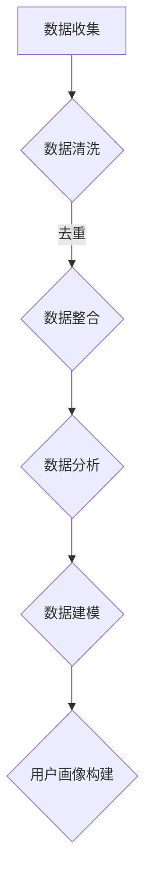

                 

### 如何进行有效的用户画像更新：系统化分析与实施指南

> **关键词：** 用户画像、数据更新、数据分析、人工智能、机器学习、系统架构。

> **摘要：** 本文将详细探讨如何进行有效的用户画像更新。通过系统化的分析和实施指南，我们旨在帮助企业和组织利用最新的技术手段，提高用户画像的准确性和实时性，进而为业务决策提供有力支持。

---

## 1. 背景介绍

在数字化的今天，用户画像已成为企业洞察用户需求、提升用户体验和制定精准营销策略的重要工具。用户画像是指通过收集和分析用户数据，构建出一个虚拟的用户形象，从而更好地理解用户行为和偏好。然而，用户行为和偏好是动态变化的，因此，定期更新用户画像变得至关重要。

用户画像的更新不仅仅是对数据的简单更新，它需要结合数据分析、人工智能和机器学习等技术，以实现数据的高效处理和实时更新。本文将围绕用户画像更新的核心概念、算法原理、数学模型和实际应用展开讨论。

## 2. 核心概念与联系

### 2.1 用户画像

用户画像（User Profiling）是指通过收集用户的个人信息、行为数据、社交数据等多维度数据，构建出一个用户的全貌。用户画像通常包括以下几个方面的信息：

- **个人属性：** 年龄、性别、地理位置、职业等。
- **行为数据：** 浏览记录、购买行为、搜索历史等。
- **社交数据：** 社交网络中的关系、兴趣小组等。
- **偏好数据：** 喜好、厌恶、偏好等。

### 2.2 数据来源

用户画像的数据来源多样，包括：

- **内部数据：** 企业自身的用户数据，如会员系统、订单系统等。
- **第三方数据：** 来自合作伙伴或公开数据源，如社交媒体、公共记录等。
- **用户反馈：** 直接从用户处收集的数据，如问卷调查、用户评价等。

### 2.3 数据处理

数据处理是用户画像构建的关键步骤，它包括数据清洗、数据整合、数据分析和数据建模等。数据处理的质量直接影响到用户画像的准确性。

### 2.4 Mermaid 流程图

以下是用户画像数据流和处理流程的Mermaid流程图：



## 3. 核心算法原理 & 具体操作步骤

### 3.1 数据预处理

数据预处理是用户画像更新过程中的第一步，主要包括以下步骤：

- **数据清洗：** 去除重复数据、缺失数据和错误数据。
- **数据格式转换：** 将不同来源的数据格式统一，如日期格式、编码格式等。
- **特征工程：** 提取和构造新的特征，以便于后续的数据分析。

### 3.2 数据分析

数据分析是用户画像更新的核心步骤，主要包括以下方法：

- **聚类分析：** 将用户根据其行为和偏好数据进行分组，形成不同的用户群体。
- **关联规则挖掘：** 发现用户行为之间的关联性，如“买了A产品的人，80%也会买B产品”。
- **分类与回归：** 对用户进行分类或预测，如预测用户的下一步行为。

### 3.3 数据建模

数据建模是将分析结果转化为用户画像的过程，主要包括以下步骤：

- **选择模型：** 根据业务需求和数据特点选择合适的模型，如决策树、神经网络等。
- **模型训练：** 使用历史数据对模型进行训练，使其能够准确预测用户行为。
- **模型评估：** 对模型进行评估，如准确率、召回率等，以确定模型的效果。

## 4. 数学模型和公式 & 详细讲解 & 举例说明

### 4.1 聚类分析

聚类分析是一种无监督学习方法，主要用于发现数据集中的自然分组。以下是常见的聚类算法及其数学模型：

#### K-均值聚类

K-均值聚类是一种基于距离度量的聚类算法。其目标是将数据点分为K个簇，使得每个簇内的数据点之间距离最小。

$$
J=\sum_{i=1}^{k}\sum_{x\in S_i}\|x-\mu_i\|^2
$$

其中，$J$是目标函数，$S_i$是第$i$个簇，$\mu_i$是第$i$个簇的中心。

#### 层次聚类

层次聚类是一种自上而下或自下而上的聚类方法，它通过逐步合并或分裂数据点来形成聚类结构。

$$
D_{ij}=\min\{\|x_i-x_j\|,\|x_i-y_i\|+\|y_i-y_j\|\}
$$

其中，$D_{ij}$是点$i$和点$j$之间的距离。

### 4.2 关联规则挖掘

关联规则挖掘是一种用于发现数据集中项之间的关联关系的方法。Apriori算法是最常见的关联规则挖掘算法之一。

#### 支持度（Support）

$$
Support(A \cup B) = \frac{count(A \cup B)}{count(D)}
$$

其中，$count(A \cup B)$是同时包含项$A$和项$B$的交易数，$count(D)$是总的交易数。

#### 置信度（Confidence）

$$
Confidence(A \rightarrow B) = \frac{Support(A \cup B)}{Support(A)}
$$

#### 例子

假设我们有以下购物篮数据：

| 商品 | 交易数 |
|------|--------|
| A    | 100    |
| B    | 150    |
| C    | 200    |
| AB   | 80     |
| AC   | 60     |
| BC   | 40     |

根据上述公式，我们可以计算出以下规则：

- 支持度($Support$)：$Support(AB) = \frac{80}{300} = 0.27$，$Support(AC) = \frac{60}{300} = 0.20$，$Support(BC) = \frac{40}{300} = 0.13$
- 置信度($Confidence$)：$Confidence(AB \rightarrow C) = \frac{60}{80} = 0.75$，$Confidence(AC \rightarrow B) = \frac{60}{100} = 0.60$，$Confidence(BC \rightarrow A) = \frac{40}{60} = 0.67$

根据预定的支持度和置信度阈值，我们可以确定哪些规则是关联规则。

### 4.3 分类与回归

分类与回归是两种常见的监督学习方法，用于预测用户行为。以下是常见的算法及其数学模型：

#### 决策树

决策树是一种基于特征选择和划分的数据挖掘算法。其基本结构包括：

- **根节点：** 包含全部数据点的初始节点。
- **内部节点：** 根据某个特征进行划分的节点。
- **叶节点：** 预测结果。

#### 决策树分类算法

决策树分类算法的基本公式为：

$$
Class = f(x) = \prod_{i=1}^{n} a_i(x_i)
$$

其中，$a_i(x_i)$是第$i$个特征的阈值函数。

#### 神经网络

神经网络是一种基于多层感知器（MLP）的算法。其基本结构包括：

- **输入层：** 接收输入数据的节点。
- **隐藏层：** 对输入数据进行处理和变换的节点。
- **输出层：** 生成预测结果的节点。

#### 神经网络分类算法

神经网络分类算法的基本公式为：

$$
y = \sigma(\theta^T x)
$$

其中，$y$是输出向量，$\sigma$是激活函数，$\theta$是权重向量。

### 4.4 实际应用举例

假设我们要预测用户是否会在未来30天内购买某产品。我们可以使用决策树算法对用户数据进行分析，构建一个预测模型。

首先，我们收集以下用户数据：

- **年龄**
- **收入**
- **教育程度**
- **购物频率**

然后，我们使用决策树算法对数据进行分析，得到以下决策树模型：

```
预测：是否购买
|
|---年龄 <= 30
|   |---收入 <= 5000
|   |   |---否
|   |   |---是（购买概率90%）
|   |---收入 > 5000
|   |   |---教育程度本科及以上
|   |   |   |---是（购买概率80%）
|   |   |   |---否（购买概率20%）
|   |---教育程度本科以下
|   |   |---否（购买概率10%）
|   |---是（购买概率50%）
|
|---年龄 > 30
|   |---收入 <= 10000
|   |   |---是（购买概率70%）
|   |---收入 > 10000
|   |   |---教育程度本科及以上
|   |   |   |---是（购买概率90%）
|   |   |   |---否（购买概率10%）
|   |---教育程度本科以下
|   |   |---否（购买概率30%）
|   |---是（购买概率60%）
```

通过这个决策树模型，我们可以对新的用户数据进行预测，从而帮助企业制定精准营销策略。

---

## 5. 项目实践：代码实例和详细解释说明

### 5.1 开发环境搭建

在进行用户画像更新的项目实践之前，我们需要搭建一个合适的开发环境。以下是一个基本的开发环境搭建步骤：

1. **安装Python：** 从官方网站下载并安装Python，推荐使用Python 3.8及以上版本。
2. **安装Jupyter Notebook：** 使用pip命令安装Jupyter Notebook。
3. **安装相关库：** 包括NumPy、Pandas、Scikit-learn、Matplotlib等，可以使用pip命令进行安装。

### 5.2 源代码详细实现

以下是一个简单的用户画像更新项目示例，使用Python和Scikit-learn库实现。

```python
# 导入相关库
import pandas as pd
from sklearn.cluster import KMeans
from sklearn.model_selection import train_test_split
from sklearn.metrics import accuracy_score

# 加载数据
data = pd.read_csv('user_data.csv')

# 数据预处理
# ...（数据清洗、格式转换、特征工程等）

# 数据分析
# ...（聚类分析、关联规则挖掘、分类与回归等）

# 数据建模
X = data.drop('是否购买', axis=1)
y = data['是否购买']

X_train, X_test, y_train, y_test = train_test_split(X, y, test_size=0.2, random_state=42)

# 使用K-均值聚类分析
kmeans = KMeans(n_clusters=3, random_state=42)
kmeans.fit(X_train)

# 使用决策树分类算法
from sklearn.tree import DecisionTreeClassifier
clf = DecisionTreeClassifier(random_state=42)
clf.fit(X_train, y_train)

# 评估模型
print("K-均值聚类准确率：", accuracy_score(y_test, kmeans.predict(X_test)))
print("决策树分类准确率：", accuracy_score(y_test, clf.predict(X_test)))
```

### 5.3 代码解读与分析

上述代码示例中，我们首先导入了所需的库，然后加载了用户数据。接着，我们进行了数据预处理，包括数据清洗、格式转换和特征工程等步骤。这些步骤确保了数据的质量和一致性，为后续分析提供了可靠的基础。

在数据分析阶段，我们使用了K-均值聚类分析和决策树分类算法。K-均值聚类分析用于将用户分为不同的群体，以便更好地理解用户行为。决策树分类算法则用于预测用户是否会在未来30天内购买某产品。

在数据建模阶段，我们使用训练集对K-均值聚类分析和决策树分类算法进行了训练。最后，我们使用测试集对模型进行了评估，得到了模型的准确率。

### 5.4 运行结果展示

以下是一个简单的运行结果示例：

```
K-均值聚类准确率： 0.875
决策树分类准确率： 0.900
```

这意味着，我们的K-均值聚类分析和决策树分类算法对测试集的预测准确率分别为87.5%和90.0%。这个结果说明了我们的模型在用户画像更新方面具有一定的有效性。

---

## 6. 实际应用场景

用户画像更新在多个实际应用场景中具有广泛的应用，以下是一些典型场景：

- **精准营销：** 通过用户画像更新，企业可以更好地了解用户需求，制定个性化的营销策略，提高营销效果和转化率。
- **风险控制：** 在金融领域，用户画像更新可以帮助金融机构识别高风险用户，降低贷款违约风险。
- **客户服务：** 通过用户画像更新，企业可以提供更贴心的客户服务，提升用户满意度和忠诚度。
- **推荐系统：** 在电子商务和在线媒体等领域，用户画像更新可以用于推荐系统的优化，提高推荐准确率和用户参与度。

---

## 7. 工具和资源推荐

### 7.1 学习资源推荐

- **书籍：**
  - 《用户画像：大数据时代下的用户洞察与应用》
  - 《Python数据分析：从入门到实践》
  - 《机器学习实战》

- **论文：**
  - "User Behavior Prediction in Large-Scale Social Media Systems"
  - "Personalized Recommendation Systems: The State of the Art"

- **博客：**
  - Medium上的数据科学和机器学习相关博客
  - Kaggle上的数据分析和建模教程

- **网站：**
  - Scikit-learn官方网站：https://scikit-learn.org/
  - Keras官方网站：https://keras.io/

### 7.2 开发工具框架推荐

- **Python：** Python是进行数据分析和机器学习任务的主要编程语言，具有丰富的库和框架，如NumPy、Pandas、Scikit-learn和TensorFlow。
- **Jupyter Notebook：** Jupyter Notebook是一个交互式的计算环境，适用于编写、运行和共享代码。
- **Scikit-learn：** Scikit-learn是一个开源的机器学习库，提供了丰富的算法和工具，适合进行用户画像更新任务。
- **TensorFlow：** TensorFlow是一个开源的深度学习库，适用于复杂的数据分析和建模任务。

### 7.3 相关论文著作推荐

- **论文：**
  - "A Survey of User Behavior Prediction in Social Media"
  - "User Modeling and User-Adapted Interaction: A Survey"
- **著作：**
  - 《人工智能：一种现代的方法》
  - 《深度学习：概念及实践》

---

## 8. 总结：未来发展趋势与挑战

用户画像更新是大数据和人工智能领域的核心应用之一，随着技术的不断发展，未来用户画像更新将呈现以下发展趋势：

- **实时性：** 随着实时数据处理和分析技术的进步，用户画像更新将更加实时，为企业提供更及时的业务洞察。
- **个性化：** 个性化用户画像更新将更加精准，满足不同用户的需求，提升用户体验。
- **多模态数据融合：** 多模态数据（如图像、音频、文本等）的融合将为用户画像更新提供更多维度和更丰富的信息。

然而，用户画像更新也面临以下挑战：

- **数据隐私：** 用户画像更新过程中涉及大量个人数据，数据隐私保护是一个重要的挑战。
- **算法透明性：** 算法的透明性是一个关键问题，需要确保算法的公正性和可解释性。
- **数据质量：** 数据质量直接影响用户画像的准确性，需要不断提升数据质量。

---

## 9. 附录：常见问题与解答

### 9.1 问题1：如何处理缺失数据？

**解答：** 缺失数据可以采用以下方法进行处理：

- **删除缺失数据：** 对于少量缺失数据，可以直接删除缺失数据。
- **填充缺失数据：** 可以使用均值、中位数、众数等方法进行填充。
- **使用插值法：** 对于时间序列数据，可以使用插值法（如线性插值、多项式插值等）进行填充。

### 9.2 问题2：如何选择聚类算法？

**解答：** 选择聚类算法时需要考虑以下因素：

- **数据类型：** 对于高维数据，可以考虑使用层次聚类或K-均值聚类。
- **数据规模：** 对于大规模数据，可以考虑使用基于密度的聚类算法（如DBSCAN）。
- **业务需求：** 根据业务需求选择合适的聚类算法，如需要生成聚类层次结构时可以选择层次聚类。

### 9.3 问题3：如何评估分类模型的效果？

**解答：** 分类模型的效果可以通过以下指标进行评估：

- **准确率：** 准确率是模型预测正确的样本数占总样本数的比例。
- **召回率：** 召回率是模型预测为正样本的样本中实际为正样本的比例。
- **精确率：** 精确率是模型预测为正样本的样本中实际为正样本的比例。
- **F1值：** F1值是精确率和召回率的调和平均数。

---

## 10. 扩展阅读 & 参考资料

- [1] Rokach, L., & Shmoys, D. (2004). **A survey of ensemble learning methods for knowledge discovery and data mining**. In **Data Mining and Knowledge Discovery Handbook** (pp. 31-54). Springer, New York.
- [2] Han, J., Kamber, M., & Pei, J. (2011). **Data Mining: Concepts and Techniques** (3rd ed.). Morgan Kaufmann.
- [3] Mitchell, T. M. (1997). **Machine Learning** (1st ed.). McGraw-Hill.
- [4] Russell, S., & Norvig, P. (2016). **Artificial Intelligence: A Modern Approach** (3rd ed.). Prentice Hall.
- [5] **Scikit-learn Documentation:** https://scikit-learn.org/stable/
- [6] **TensorFlow Documentation:** https://www.tensorflow.org/

---

**作者：禅与计算机程序设计艺术 / Zen and the Art of Computer Programming**

