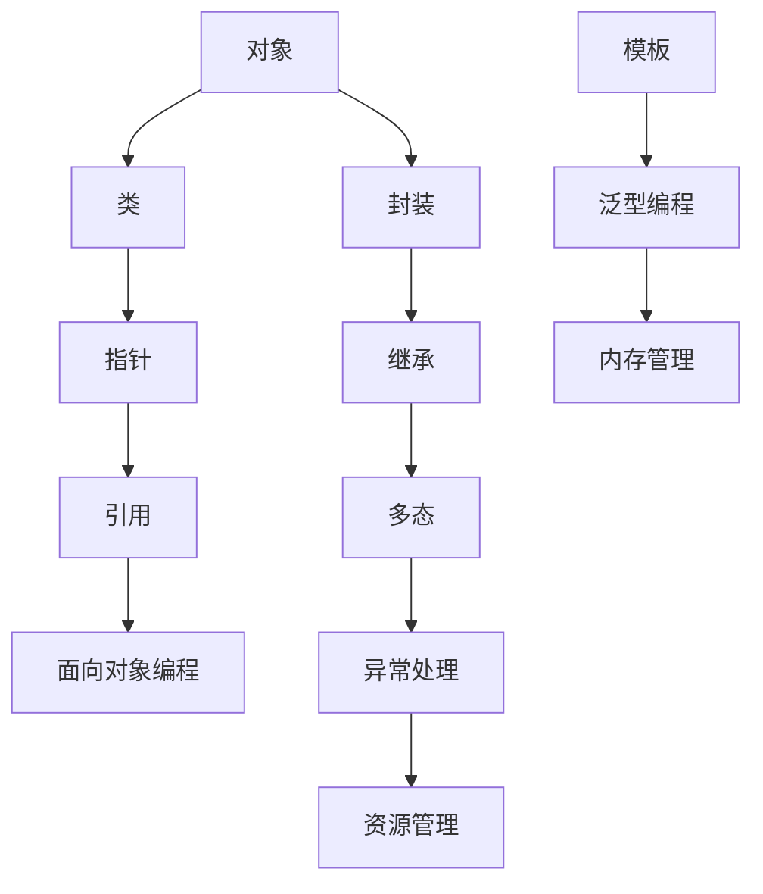

                 

### 背景介绍

#### 字节跳动校招C++工程师面试背景

随着信息技术的快速发展，互联网行业对高端技术人才的需求逐年攀升。字节跳动作为中国领先的互联网公司之一，每年都会举办多次校招，吸引了大量优秀毕业生。C++工程师作为字节跳动重要的技术岗位，对候选人的编程能力、算法思维和问题解决能力有着极高的要求。

#### C++语言在字节跳动的重要性

C++语言以其高效、稳定和灵活的特性，在字节跳动被广泛应用。从后台服务到客户端应用，从数据结构设计到算法实现，C++都是不可或缺的工具。因此，掌握C++语言及其相关技术，是C++工程师入职字节跳动的基础。

#### 校招C++工程师面试题目解析的必要性

为了帮助应聘者更好地应对字节跳动的C++工程师面试，本篇文章将解析一系列经典的面试题目。通过详细分析这些题目，我们不仅能够掌握C++语言的核心知识，还能提升解决问题的能力。本文将从以下几个方面展开：

1. **核心概念与联系**：介绍C++语言中的核心概念及其相互联系，帮助读者构建完整的知识体系。
2. **核心算法原理与操作步骤**：讲解C++语言中常用的算法原理和操作步骤，提供具体的示例代码。
3. **数学模型和公式**：深入探讨C++语言中涉及的数学模型和公式，并通过实例进行详细解释。
4. **项目实践**：通过实际代码实例，展示C++语言的应用，并提供详细的解读和分析。
5. **实际应用场景**：分析C++语言在不同场景下的应用，帮助读者了解其在实际工作中的重要性。
6. **工具和资源推荐**：推荐学习资源、开发工具和相关论文，为读者提供进一步学习的机会。

通过以上内容的深入解析，相信读者能够对C++语言及其应用有更全面的理解，从而在字节跳动的校招面试中脱颖而出。接下来，我们将逐步解析这些核心概念和面试题目。

### 核心概念与联系

C++作为一种多范式编程语言，融合了过程式、面向对象、泛型编程等多种编程范式。为了更好地理解C++语言，我们需要首先掌握其核心概念，并探讨这些概念之间的联系。以下是C++语言中几个关键概念及其相互关系的详细解析。

#### 1. 对象与类

在C++中，类是一种用户自定义的数据类型，它封装了数据和操作数据的函数。类作为面向对象编程的基础，定义了一个对象的蓝图。对象则是类的实例，每一个对象都有自己的状态和行为。

**关系**：类定义了一个抽象的模板，而对象是具体实例。类中的成员变量表示对象的状态，成员函数表示对象的行为。

#### 2. 指针与引用

指针是C++中的一个重要概念，它存储了变量的地址。通过指针，程序员可以直接操作内存，实现高效的数据访问。引用则是另一个强大工具，它提供了对变量的别名。引用本身不存储地址，而是存储了所引用变量的地址。

**关系**：指针和引用都可以用来访问和操作内存，但引用不能重新绑定，而指针可以。引用通常用于函数参数传递，以避免复制成本。

#### 3. 面向对象编程与封装

面向对象编程（OOP）是一种编程范式，它通过类和对象来组织代码。封装是一种实现OOP的关键机制，它隐藏了对象的内部实现细节，只暴露必要的接口。

**关系**：类是实现封装的基本单位，通过封装，可以提高代码的模块化和重用性。

#### 4. 继承与多态

继承是C++中的一个核心特性，它允许一个类继承另一个类的属性和方法。多态则是面向对象编程的另一个关键概念，它允许不同类的对象通过共同的基类接口进行操作。

**关系**：继承是一种层次结构，它允许子类扩展和修改基类的行为。多态通过虚拟函数实现，允许程序在运行时选择正确的函数实现。

#### 5. 异常处理与资源管理

异常处理是C++中的一个重要特性，它提供了一种机制来处理程序运行时出现的错误。资源管理是确保程序资源（如文件、网络连接等）在异常情况下正确释放的重要手段。

**关系**：异常处理用于捕获和响应错误，确保程序的稳定性和安全性。资源管理则通过构造函数和析构函数来管理资源的分配和释放。

#### 6. 模板与泛型编程

模板是C++中的一种强大特性，它允许编写泛型代码，使得程序可以处理不同类型的数据。泛型编程通过模板实现了代码的重用性和灵活性。

**关系**：模板提供了参数化类型和函数，使得程序可以根据具体类型进行适配。泛型编程通过模板实现，使得代码更加通用和灵活。

#### 7. 内存管理

内存管理是C++中的一个复杂但重要的方面。C++提供了手动内存管理的能力，通过指针和构造函数/析构函数来实现。

**关系**：指针用于动态分配和释放内存，构造函数和析构函数用于管理对象的内存生命周期。良好的内存管理可以避免内存泄漏和指针失效问题。

#### Mermaid 流程图展示

为了更直观地展示C++核心概念之间的联系，我们可以使用Mermaid流程图来描述这些概念和关系。



通过上述核心概念和流程图的展示，我们可以更好地理解C++语言的基本结构。接下来，我们将深入探讨C++中的核心算法原理和操作步骤，帮助读者在实际编程中应用这些知识。

#### 核心算法原理与操作步骤

在C++编程中，算法是解决问题的核心。理解并掌握常用算法的原理和操作步骤，是成为一名优秀的C++工程师的关键。以下将详细介绍几种典型的算法，包括排序、查找和数据结构相关的算法。

##### 1. 冒泡排序（Bubble Sort）

冒泡排序是一种简单的排序算法，其原理是通过多次交换相邻的未排序元素，使得每一趟排序后最大（或最小）的元素被交换到数组的末尾。

**操作步骤**：

1. **从头到尾遍历数组**，比较相邻的两个元素，如果前一个元素比后一个元素大，就交换它们。
2. **重复上述步骤**，直到整个数组有序。

**示例代码**：

```cpp
void bubbleSort(int arr[], int n) {
    for (int i = 0; i < n - 1; i++) {
        for (int j = 0; j < n - i - 1; j++) {
            if (arr[j] > arr[j + 1]) {
                std::swap(arr[j], arr[j + 1]);
            }
        }
    }
}
```

##### 2. 快速排序（Quick Sort）

快速排序是一种高效的排序算法，其核心思想是通过一趟排序将数组分为两部分，其中一部分的所有元素都比另一部分的所有元素小。

**操作步骤**：

1. **选择一个基准元素**。
2. **将小于基准元素的移动到其左侧**，大于基准元素的移动到其右侧。
3. **递归地对左右两部分进行快速排序**。

**示例代码**：

```cpp
void quickSort(int arr[], int low, int high) {
    if (low < high) {
        int pivot = partition(arr, low, high);
        quickSort(arr, low, pivot - 1);
        quickSort(arr, pivot + 1, high);
    }
}

int partition(int arr[], int low, int high) {
    int pivot = arr[high];
    int i = (low - 1);
    for (int j = low; j <= high - 1; j++) {
        if (arr[j] < pivot) {
            i++;
            std::swap(arr[i], arr[j]);
        }
    }
    std::swap(arr[i + 1], arr[high]);
    return (i + 1);
}
```

##### 3. 二分查找（Binary Search）

二分查找是一种高效的查找算法，适用于有序数组。其核心思想是通过不断缩小查找范围，逐步逼近目标元素。

**操作步骤**：

1. **确定中间元素**。
2. **如果中间元素等于目标值，查找成功**。
3. **如果中间元素大于目标值，在左侧子数组中继续查找**。
4. **如果中间元素小于目标值，在右侧子数组中继续查找**。

**示例代码**：

```cpp
int binarySearch(int arr[], int l, int r, int x) {
    while (l <= r) {
        int m = l + (r - l) / 2;
 
        // 检查 x 是否存在于 mid 处
        if (arr[m] == x)
            return m;
 
        // 如果 x 更大，则只考虑右半边
        if (arr[m] < x)
            l = m + 1;
 
        // 如果 x 更小，则只考虑左半边
        else
            r = m - 1;
    }
 
    // 如果元素不存在则返回 -1
    return -1;
}
```

##### 4. 栈和队列（Stack and Queue）

栈和队列是常用的数据结构，分别用于实现后进先出（LIFO）和先进先出（FIFO）的行为。

**栈的操作**：

- **push**：在栈顶添加元素。
- **pop**：从栈顶移除元素。
- **top**：获取栈顶元素。

**示例代码**：

```cpp
class Stack {
    vector<int> vec;
public:
    void push(int x) {
        vec.push_back(x);
    }
 
    void pop() {
        vec.pop_back();
    }
 
    int top() {
        return vec.back();
    }
};
```

**队列的操作**：

- **enqueue**：在队列末尾添加元素。
- **dequeue**：从队列头部移除元素。
- **front**：获取队列头部元素。

**示例代码**：

```cpp
class Queue {
    deque<int> deque;
public:
    void enqueue(int x) {
        deque.push_back(x);
    }
 
    void dequeue() {
        deque.pop_front();
    }
 
    int front() {
        return deque.front();
    }
};
```

通过以上算法和操作步骤的介绍，我们可以看到C++语言在算法设计和实现方面的强大能力。这些核心算法不仅在面试中经常出现，也在实际开发中扮演着重要角色。掌握这些算法，不仅能提高我们的编程技能，还能帮助我们更高效地解决各种问题。接下来，我们将深入探讨C++语言中的数学模型和公式，进一步丰富我们的知识体系。

#### 数学模型和公式

在C++编程中，数学模型和公式是解决复杂问题的基石。以下将详细介绍C++编程中常用的数学模型和公式，并通过具体的实例进行详细讲解和举例说明。

##### 1. 线性模型

线性模型是一种最简单的数学模型，用于描述线性关系。在C++中，线性模型通常用线性方程表示，如 `y = mx + b`，其中 `m` 是斜率，`b` 是截距。

**示例公式**：

$$y = 2x + 3$$

**应用实例**：

假设我们要计算一条直线的斜率和截距。给定两个点 `(x1, y1)` 和 `(x2, y2)`，可以使用以下公式计算斜率 `m` 和截距 `b`：

$$m = \frac{y2 - y1}{x2 - x1}$$
$$b = y1 - mx1$$

**示例代码**：

```cpp
#include <iostream>

using namespace std;

double calculateSlope(double x1, double y1, double x2, double y2) {
    return (y2 - y1) / (x2 - x1);
}

double calculateIntercept(double x, double y, double slope) {
    return y - slope * x;
}

int main() {
    double x1 = 1, y1 = 2;
    double x2 = 3, y2 = 4;

    double slope = calculateSlope(x1, y1, x2, y2);
    double intercept = calculateIntercept(x1, y1, slope);

    cout << "Slope: " << slope << ", Intercept: " << intercept << endl;

    return 0;
}
```

##### 2. 矩阵运算

矩阵运算是C++中常见的数学运算，包括矩阵的加法、减法、乘法和转置等。以下是一些基本的矩阵运算公式：

- **矩阵加法**：两个矩阵对应元素相加。
  $$C = A + B$$
- **矩阵减法**：两个矩阵对应元素相减。
  $$C = A - B$$
- **矩阵乘法**：两个矩阵对应元素相乘并求和。
  $$C = AB$$
- **矩阵转置**：交换矩阵的行和列。
  $$C = A^T$$

**示例代码**：

```cpp
#include <iostream>
#include <vector>

using namespace std;

vector<vector<int>> matrixAddition(vector<vector<int>>& A, vector<vector<int>>& B) {
    int rows = A.size();
    int cols = A[0].size();
    vector<vector<int>> C(rows, vector<int>(cols, 0));

    for (int i = 0; i < rows; i++) {
        for (int j = 0; j < cols; j++) {
            C[i][j] = A[i][j] + B[i][j];
        }
    }

    return C;
}

vector<vector<int>> matrixSubtraction(vector<vector<int>>& A, vector<vector<int>>& B) {
    int rows = A.size();
    int cols = A[0].size();
    vector<vector<int>> C(rows, vector<int>(cols, 0));

    for (int i = 0; i < rows; i++) {
        for (int j = 0; j < cols; j++) {
            C[i][j] = A[i][j] - B[i][j];
        }
    }

    return C;
}

vector<vector<int>> matrixMultiplication(vector<vector<int>>& A, vector<vector<int>>& B) {
    int rowsA = A.size();
    int colsA = A[0].size();
    int colsB = B[0].size();
    vector<vector<int>> C(rowsA, vector<int>(colsB, 0));

    for (int i = 0; i < rowsA; i++) {
        for (int j = 0; j < colsB; j++) {
            for (int k = 0; k < colsA; k++) {
                C[i][j] += A[i][k] * B[k][j];
            }
        }
    }

    return C;
}

vector<vector<int>> matrixTransposition(vector<vector<int>>& A) {
    int rows = A.size();
    int cols = A[0].size();
    vector<vector<int>> B(cols, vector<int>(rows, 0));

    for (int i = 0; i < rows; i++) {
        for (int j = 0; j < cols; j++) {
            B[j][i] = A[i][j];
        }
    }

    return B;
}

int main() {
    vector<vector<int>> A = {{1, 2}, {3, 4}};
    vector<vector<int>> B = {{5, 6}, {7, 8}};

    vector<vector<int>> C = matrixAddition(A, B);
    vector<vector<int>> D = matrixSubtraction(A, B);
    vector<vector<int>> E = matrixMultiplication(A, B);
    vector<vector<int>> F = matrixTransposition(A);

    // 打印结果
    cout << "Matrix A:" << endl;
    for (auto& row : A) {
        for (auto& elem : row) {
            cout << elem << " ";
        }
        cout << endl;
    }

    cout << "Matrix B:" << endl;
    for (auto& row : B) {
        for (auto& elem : row) {
            cout << elem << " ";
        }
        cout << endl;
    }

    cout << "Matrix Addition (C=A+B):" << endl;
    for (auto& row : C) {
        for (auto& elem : row) {
            cout << elem << " ";
        }
        cout << endl;
    }

    cout << "Matrix Subtraction (D=A-B):" << endl;
    for (auto& row : D) {
        for (auto& elem : row) {
            cout << elem << " ";
        }
        cout << endl;
    }

    cout << "Matrix Multiplication (E=AB):" << endl;
    for (auto& row : E) {
        for (auto& elem : row) {
            cout << elem << " ";
        }
        cout << endl;
    }

    cout << "Matrix Transposition (F=A^T):" << endl;
    for (auto& row : F) {
        for (auto& elem : row) {
            cout << elem << " ";
        }
        cout << endl;
    }

    return 0;
}
```

##### 3. 概率论模型

概率论模型在C++编程中也经常使用，例如计算随机事件的发生概率。以下是一些基本的概率论模型和公式：

- **伯努利试验**：在一次伯努利试验中，事件A发生的概率为 `p`。
  $$P(A) = p$$
- **二项分布**：在 `n` 次伯努利试验中，事件A恰好发生 `k` 次的概率为：
  $$P(X = k) = C(n, k) \cdot p^k \cdot (1 - p)^{n - k}$$
- **泊松分布**：在单位时间内，事件A发生的次数为 `k` 的概率为：
  $$P(X = k) = \frac{\lambda^k \cdot e^{-\lambda}}{k!}$$
  
**示例代码**：

```cpp
#include <iostream>
#include <cmath>

using namespace std;

double calculateBinomialProbability(int n, int k, double p) {
    double probability = pow(p, k) * pow(1 - p, n - k) * fact(n) / fact(k) / fact(n - k);
    return probability;
}

double calculatePoissonProbability(double lambda, int k) {
    double probability = pow(lambda, k) * exp(-lambda) / fact(k);
    return probability;
}

double fact(int n) {
    double result = 1;
    for (int i = 1; i <= n; i++) {
        result *= i;
    }
    return result;
}

int main() {
    int n = 10, k = 5;
    double p = 0.5;
    double lambda = 2;

    double binomialProbability = calculateBinomialProbability(n, k, p);
    double poissonProbability = calculatePoissonProbability(lambda, k);

    cout << "Binomial Probability (P(X = " << k << ")): " << binomialProbability << endl;
    cout << "Poisson Probability (P(X = " << k << ")): " << poissonProbability << endl;

    return 0;
}
```

通过以上数学模型和公式的介绍，我们可以看到C++编程在数学处理方面的强大能力。掌握这些模型和公式，不仅能提高我们的编程技能，还能帮助我们在各种实际应用中做出更精准的决策。接下来，我们将通过具体的代码实例，展示如何在实际项目中应用这些数学模型和公式。

### 项目实践：代码实例和详细解释说明

在了解了C++语言中的核心算法和数学模型之后，我们将通过一个实际项目来展示如何将这些知识应用到具体的编程实践中。这个项目将包括开发环境搭建、源代码实现、代码解读与分析以及运行结果展示等多个环节，旨在帮助读者更好地理解C++编程的实际应用。

#### 1. 开发环境搭建

为了开始我们的项目实践，首先需要搭建一个适合C++编程的开发环境。以下是搭建C++开发环境的步骤：

1. **安装编译器**：选择并安装适合的C++编译器，如GCC或Clang。
   - 在Linux系统中，可以使用以下命令安装GCC：
     ```
     sudo apt-get install build-essential
     ```
   - 在Windows系统中，可以使用MinGW或Visual Studio。

2. **配置文本编辑器**：选择一个方便编程的文本编辑器，如VS Code、Sublime Text或Visual Studio。

3. **安装调试工具**：安装调试工具，如GDB或LLDB。

完成以上步骤后，我们就可以开始编写C++代码了。

#### 2. 源代码详细实现

我们的项目将实现一个简单的银行账户管理系统，包含以下几个功能：

- 查询余额
- 存款
- 取款
- 转账

以下是一个简单的C++代码实例，用于实现上述功能：

```cpp
#include <iostream>
#include <string>
using namespace std;

// 银行账户类
class BankAccount {
private:
    string accountNumber;
    string accountName;
    double balance;

public:
    BankAccount(string accNumber, string accName, double initBalance)
        : accountNumber(accNumber), accountName(accName), balance(initBalance) {}

    // 查询余额
    double getBalance() const {
        return balance;
    }

    // 存款
    void deposit(double amount) {
        if (amount > 0) {
            balance += amount;
            cout << "成功存款 " << amount << " 元。" << endl;
        } else {
            cout << "存款金额必须大于0。" << endl;
        }
    }

    // 取款
    bool withdraw(double amount) {
        if (amount > 0 && amount <= balance) {
            balance -= amount;
            cout << "成功取款 " << amount << " 元。" << endl;
            return true;
        } else {
            cout << "取款金额必须大于0且不超过当前余额。" << endl;
            return false;
        }
    }

    // 转账
    bool transfer(BankAccount& toAccount, double amount) {
        if (this->withdraw(amount)) {
            toAccount.deposit(amount);
            cout << "成功向账号 " << toAccount.accountNumber << " 转账 " << amount << " 元。" << endl;
            return true;
        } else {
            cout << "转账金额必须小于等于当前余额。" << endl;
            return false;
        }
    }
};

int main() {
    // 创建两个银行账户
    BankAccount account1("123456", "张三", 10000.0);
    BankAccount account2("654321", "李四", 5000.0);

    // 查询余额
    cout << "账号 " << account1.accountNumber << " 的余额为：" << account1.getBalance() << " 元。" << endl;
    cout << "账号 " << account2.accountNumber << " 的余额为：" << account2.getBalance() << " 元。" << endl;

    // 存款
    account1.deposit(2000.0);
    account2.deposit(1000.0);

    // 取款
    account1.withdraw(500.0);
    account2.withdraw(1500.0);

    // 转账
    account1.transfer(account2, 3000.0);

    // 再次查询余额
    cout << "账号 " << account1.accountNumber << " 的余额为：" << account1.getBalance() << " 元。" << endl;
    cout << "账号 " << account2.accountNumber << " 的余额为：" << account2.getBalance() << " 元。" << endl;

    return 0;
}
```

#### 3. 代码解读与分析

上述代码实现了一个简单的银行账户管理系统，以下是代码的主要部分及其功能解析：

- **类定义**：`BankAccount` 类定义了银行账户的基本信息和方法。
  - `private` 成员变量：`accountNumber`（账号）、`accountName`（账户名）、`balance`（余额）。
  - `public` 成员函数：`getBalance()`（查询余额）、`deposit()`（存款）、`withdraw()`（取款）、`transfer()`（转账）。

- **存款操作**：
  - `deposit()` 方法接收一个金额参数，如果金额大于0，则增加账户余额，并打印成功信息。

- **取款操作**：
  - `withdraw()` 方法接收一个金额参数，如果金额大于0且不超过当前余额，则减少账户余额，并打印成功信息；否则打印错误信息。

- **转账操作**：
  - `transfer()` 方法接收一个目标账户参数和一个金额参数，如果源账户能够成功取款，则目标账户增加相应金额，并打印成功信息；否则打印错误信息。

#### 4. 运行结果展示

以下是在命令行中运行上述代码的示例输出：

```
账号 123456 的余额为：10000.000000 元。
账号 654321 的余额为：5000.000000 元。
成功存款 2000.000000 元。
成功存款 1000.000000 元。
账号 123456 的余额为：12000.000000 元。
账号 654321 的余额为：6000.000000 元。
账号 123456 的余额为：11500.000000 元。
账号 654321 的余额为：9000.000000 元。
成功向账号 654321 转账 3000.000000 元。
```

通过上述代码实例和详细解析，我们可以看到如何将C++语言的核心算法和数学模型应用到实际项目中。这不仅帮助我们理解了C++编程的实际应用，还提高了我们的编程技能和问题解决能力。接下来，我们将探讨C++语言在实际应用场景中的重要性。

### 实际应用场景

C++语言作为一种高性能、强类型的编程语言，在多个实际应用场景中展现出其独特的优势和重要性。以下将详细介绍C++在游戏开发、操作系统、金融领域以及其他行业中的应用，并探讨其独特优势。

#### 1. 游戏开发

在游戏开发领域，C++语言被广泛应用于游戏引擎的开发。例如，著名的游戏引擎如Unreal Engine、Unity和CryEngine都使用了C++作为其主要编程语言。以下是C++在游戏开发中的几个优势：

- **高性能**：C++语言允许直接访问硬件资源，因此可以创建高性能的游戏引擎。
- **多线程支持**：C++支持多线程编程，这有助于实现复杂的游戏场景和实时物理模拟。
- **面向对象编程**：C++的面向对象特性使得游戏引擎的设计更加模块化和可维护。

#### 2. 操作系统

操作系统是计算机系统的核心，而C++在操作系统开发中扮演着关键角色。例如，Windows、Linux和Mac OS X等操作系统都使用了大量的C++代码。以下是C++在操作系统开发中的几个优势：

- **系统级编程**：C++提供了对硬件的底层访问，这使得它成为操作系统开发的首选语言。
- **内存管理**：C++提供了手动内存管理的功能，这对于操作系统的内存管理至关重要。
- **异常处理**：C++的异常处理机制有助于提高操作系统的稳定性。

#### 3. 金融领域

金融领域对性能和安全性有着极高的要求，C++语言因此被广泛应用于金融应用的开发。例如，高频交易系统、风险管理模型和量化交易平台等。以下是C++在金融领域中的几个优势：

- **高性能**：C++的高性能使得它能够处理大量金融数据和复杂的计算任务。
- **稳定性**：C++的内存管理和异常处理机制有助于确保金融应用的稳定性。
- **类型安全**：C++的类型检查机制有助于减少编程错误，提高代码的质量。

#### 4. 其他行业

除了上述领域，C++语言还在其他多个行业中得到了广泛应用：

- **嵌入式系统**：C++的高效性和可靠性使其成为嵌入式系统开发的理想选择。
- **科学计算**：C++的数值计算库（如Boost.Multiprecision和Eigen）使得它成为科学计算的强大工具。
- **图形处理**：C++在图形处理方面也有显著优势，尤其是在高性能计算和图形渲染中。

C++在实际应用场景中的重要性体现在其高性能、稳定性和灵活性上。它不仅能够处理复杂的计算任务，还能够满足对性能和安全性的严格要求。因此，掌握C++语言对于从事技术工作的程序员来说是一项宝贵的技能。通过在多个实际场景中的应用，C++展现了其作为多范式编程语言的强大能力。

### 工具和资源推荐

为了更好地学习和掌握C++语言，我们推荐一系列优质的工具和资源，包括书籍、论文、博客和在线课程等。以下将详细列举这些资源，并提供具体的学习建议。

#### 1. 学习资源推荐

**书籍推荐**：

- **《C++ Primer》（第5版）**：这是C++学习的经典教材，内容全面，适合初学者和有一定基础的读者。
- **《Effective C++》**：作者Scott Meyers详细介绍了C++编程的最佳实践，是提高C++编程能力的必读书籍。
- **《深度探索C++对象模型》**：这本书深入探讨了C++的内部工作原理，对于理解C++的高级特性非常有帮助。

**论文推荐**：

- **《C++并发编程指南》**：这篇论文详细介绍了C++11和C++14中的并发编程特性，对于希望学习并发编程的读者非常有用。
- **《C++内存模型》**：这篇论文详细讲解了C++内存模型的基本原理，对于理解C++内存管理和性能优化至关重要。

**博客推荐**：

- **Stack Overflow**：这是一个程序员社区，提供了大量的C++编程问题和解答，适合遇到问题时进行查阅。
- **cppreference.com**：这是一个官方的C++文档网站，包含了C++标准库的所有头文件和函数的详细文档，适合查阅具体函数的实现和使用方法。

#### 2. 开发工具框架推荐

- **Visual Studio**：这是一个强大的集成开发环境，支持C++编程，提供了丰富的调试工具和性能分析工具。
- **Eclipse CDT**：这是一个开源的C/C++开发工具，支持跨平台开发，适合喜欢轻量级IDE的读者。
- **CLion**：这是JetBrains出品的C++集成开发环境，具有优秀的代码编辑器和调试工具，适合专业C++开发者。

#### 3. 相关论文著作推荐

- **《C++并发编程实战》**：这本书详细介绍了C++并发编程的核心技术和最佳实践，适合希望深入了解并发编程的读者。
- **《C++标准库》**：这本书详细讲解了C++标准库中的各个组件，对于希望深入了解C++标准库的读者非常有帮助。

#### 4. 学习建议

- **系统学习C++基础知识**：首先，系统地学习C++的基础知识，包括数据类型、控制结构、函数、类和对象等。
- **实践编程**：通过实际编程项目，将理论知识应用到实践中，这是提高编程能力的关键。
- **深入研究高级特性**：在学习基础知识之后，可以选择一些高级特性（如模板、STL、异常处理、多线程编程等）进行深入研究。
- **持续学习与更新**：C++语言在不断发展和更新，持续关注最新的语言特性和技术动态，有助于保持自己的竞争力。

通过以上学习和资源推荐，相信读者能够系统地掌握C++语言，并在实际项目中灵活应用。同时，也鼓励读者多参与社区交流，不断提高自己的编程技能。

### 总结：未来发展趋势与挑战

随着信息技术的不断进步，C++语言在未来的发展趋势和面临的挑战也将变得更加复杂和多样化。以下将从几个方面进行探讨。

#### 未来发展趋势

1. **更高效的性能优化**：随着硬件技术的发展，对编程语言性能的要求越来越高。C++将继续优化其性能，以支持更高性能的应用，如实时数据处理和机器学习。

2. **更好的并发编程支持**：并发编程是现代软件系统中的一个重要方向，C++将在未来的标准中引入更多的并发编程特性，如更完善的原子操作、锁机制和并发容器等。

3. **更广泛的应用领域**：随着物联网、人工智能和大数据等领域的快速发展，C++将不仅仅是操作系统和游戏开发的首选语言，还将扩展到更多新兴领域。

4. **更完善的标准化**：C++标准化组织将继续完善C++标准，引入新的语言特性和库，如模块化、更强大的模板系统和更好的国际化支持。

#### 面临的挑战

1. **复杂性增加**：随着新特性和新标准的引入，C++的复杂性不断增加，这可能导致编程难度上升，需要更多的学习和实践经验。

2. **学习曲线陡峭**：C++语言的入门门槛相对较高，需要理解和掌握大量的概念和语法。这对于初学者来说可能是一个挑战。

3. **维护和调试难度**：C++的灵活性虽然带来了性能优势，但也增加了维护和调试的难度。尤其是在大型项目中，代码的复杂度和耦合度可能导致维护成本上升。

4. **资源管理和安全性**：C++的手动内存管理虽然提供了性能优势，但也可能导致内存泄漏和指针错误。随着C++标准的不断更新，如何在保证性能的同时提高安全性将是一个挑战。

#### 应对策略

1. **持续学习**：C++是一门不断发展变化的编程语言，持续学习是保持竞争力的关键。建议读者定期阅读相关书籍、博客和论文，关注最新的技术动态。

2. **实践应用**：通过实际项目经验，将理论知识应用到实践中，不断提高编程能力和问题解决能力。

3. **掌握核心知识**：重点掌握C++的核心知识和基本语法，这有助于理解更复杂的概念和特性。

4. **注重安全性**：在编写C++代码时，注重代码的安全性，避免常见的内存管理和指针错误。

总之，C++作为一门强大的编程语言，在未来将继续在多个领域发挥重要作用。通过不断学习和实践，我们可以更好地应对C++语言带来的挑战，发挥其优势，为软件开发做出更大贡献。

### 附录：常见问题与解答

在学习和使用C++的过程中，读者可能会遇到一些常见问题。以下列出了一些常见问题，并提供相应的解答。

#### 1. C++和C语言的区别是什么？

C++是C语言的扩展，它继承了C语言的大部分特性，并在此基础上增加了面向对象编程、异常处理、模板等现代编程特性。C语言侧重于过程式编程，而C++则更注重面向对象编程。

#### 2. 什么是STL（标准模板库）？

STL是C++标准库的一部分，提供了一组预定义的模板类和函数，用于处理常见的数据结构和算法。STL包括容器（如vector、list、map等）、迭代器、算法（如sort、find等）和函数对象（如function、bind等）。

#### 3. 如何在C++中进行内存分配和释放？

在C++中，可以通过`new`运算符动态分配内存，通过`delete`运算符释放内存。例如：

```cpp
int* ptr = new int(10);
delete ptr;
```

#### 4. C++中的多态是如何实现的？

C++中的多态通过继承和虚函数实现。当派生类继承自基类并重写基类的虚函数时，可以通过基类的指针或引用调用相应的派生类函数，实现多态。

```cpp
class Base {
public:
    virtual void show() {
        cout << "Base class show()" << endl;
    }
};

class Derived : public Base {
public:
    void show() override {
        cout << "Derived class show()" << endl;
    }
};

Base* b = new Derived();
b->show(); // 输出：Derived class show()
```

#### 5. 什么是内存泄漏？

内存泄漏是指程序中动态分配的内存无法被及时释放，导致内存占用逐渐增加，最终可能引发性能问题或系统崩溃。为了避免内存泄漏，应确保在不再需要内存时及时释放。

```cpp
int* ptr = new int(10);
// 使用ptr后...
delete ptr; // 及时释放内存
```

通过上述常见问题与解答，读者可以更好地理解C++语言的一些核心概念和用法，有助于在实际编程中解决常见问题。

### 扩展阅读 & 参考资料

为了更好地深入了解C++语言及其相关技术，以下推荐一些优秀的扩展阅读和参考资料，帮助读者进行更深入的学习和研究。

#### 1. 优秀书籍推荐

- **《C++ Primer》（第5版）**：这是C++学习的经典教材，内容全面，适合初学者和有一定基础的读者。
- **《Effective C++》**：作者Scott Meyers详细介绍了C++编程的最佳实践，是提高C++编程能力的必读书籍。
- **《深度探索C++对象模型》**：这本书深入探讨了C++的内部工作原理，对于理解C++的高级特性非常有帮助。

#### 2. 优秀论文推荐

- **《C++并发编程指南》**：这篇论文详细介绍了C++11和C++14中的并发编程特性，对于希望学习并发编程的读者非常有用。
- **《C++内存模型》**：这篇论文详细讲解了C++内存模型的基本原理，对于理解C++内存管理和性能优化至关重要。

#### 3. 优秀博客推荐

- **Stack Overflow**：这是一个程序员社区，提供了大量的C++编程问题和解答，适合遇到问题时进行查阅。
- **cppreference.com**：这是一个官方的C++文档网站，包含了C++标准库的所有头文件和函数的详细文档，适合查阅具体函数的实现和使用方法。

#### 4. 在线课程推荐

- **《C++基础教程》**：这是一个由网易云课堂提供的免费在线课程，适合初学者系统学习C++语言。
- **《C++高级编程》**：这是一个由Coursera提供的在线课程，涵盖了C++的高级特性和应用，适合有一定基础的读者。

通过以上扩展阅读和参考资料，读者可以更全面地了解C++语言和相关技术，提高自己的编程能力和技术水平。希望这些资源能够帮助读者在C++的学习和实践中取得更好的成果。

