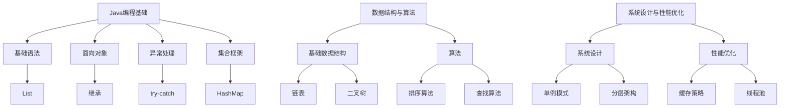

                 

### 文章标题

《字节跳动2024校招Java开发岗面试真题解析》

> **关键词**：字节跳动、校招、Java开发、面试真题、解析、算法、数据结构、编程实践

> **摘要**：本文将深入解析字节跳动2024校招Java开发岗的面试真题，帮助即将参加面试的考生掌握核心知识点和解题技巧。通过分析真题，本文将详细讲解Java编程基础、数据结构与算法、系统设计与性能优化等方面的内容，并提供实际项目实践的代码实例和运行结果展示。文章旨在为考生提供一个系统性的备考指南，助力其在面试中脱颖而出。

### 1. 背景介绍

字节跳动成立于2012年，是一家全球知名的互联网科技公司，旗下拥有今日头条、抖音、西瓜视频等多个热门应用。随着公司业务的不断扩展，字节跳动每年都会在全国范围内开展校招活动，为广大应届毕业生提供丰富的就业机会。Java开发岗作为字节跳动技术岗位的重要组成部分，面试难度和竞争压力逐年增加。

近年来，字节跳动校招Java开发岗的面试真题涵盖广泛，既包括基础编程知识，又涉及复杂的数据结构和算法。面试官通过这些真题，旨在考察应聘者的编程能力、逻辑思维、问题解决能力和实际工作经验。为了帮助考生更好地准备面试，本文将结合历年真题，系统性地解析字节跳动2024校招Java开发岗的面试内容。

### 2. 核心概念与联系

#### 2.1 Java编程基础

Java编程基础是Java开发岗面试的必考内容。主要包括：

- **基础语法**：变量、数据类型、运算符、流程控制语句（if、for、while等）。
- **面向对象**：类与对象、继承、多态、封装。
- **异常处理**：try-catch-finally语句、自定义异常类。
- **集合框架**：Collection、Map接口及其实现类（如List、Set、Map、HashMap、TreeMap等）。

#### 2.2 数据结构与算法

数据结构与算法是Java开发岗面试的核心内容。主要涉及：

- **基础数据结构**：数组、链表、栈、队列、二叉树、图。
- **算法**：排序算法（冒泡排序、选择排序、插入排序、快速排序等）、查找算法（二分查找、线性查找等）、图算法（深度优先搜索、广度优先搜索等）。

#### 2.3 系统设计与性能优化

系统设计与性能优化是面试官考察应聘者实际工作经验的重要方面。主要包括：

- **系统设计**：常用设计模式（如单例模式、工厂模式、策略模式等）、系统架构（如分层架构、微服务架构等）。
- **性能优化**：缓存策略、数据库优化、并发编程、线程池。

#### 2.4 Mermaid 流程图

以下是一个简单的 Mermaid 流程图，展示了Java开发岗面试的核心概念与联系：



### 3. 核心算法原理 & 具体操作步骤

#### 3.1 快速排序（Quick Sort）

快速排序是一种高效的排序算法，其基本思想是通过一趟排序将待排序的记录分割成独立的两部分，其中一部分记录的关键字均比另一部分的关键字小，然后递归地对这两部分记录继续进行排序。

##### 具体操作步骤：

1. 选择一个基准元素。
2. 将数组划分为两部分：小于基准元素的放在左边，大于基准元素的放在右边。
3. 对划分后的两部分递归进行快速排序。

##### 伪代码：

```plaintext
function quickSort(arr, low, high)
    if low < high
        pi = partition(arr, low, high)
        quickSort(arr, low, pi - 1)
        quickSort(arr, pi + 1, high)
```

##### C++ 实现示例：

```cpp
#include <iostream>
using namespace std;

int partition(int arr[], int low, int high) {
    int pivot = arr[high];
    int i = (low - 1);
    for (int j = low; j < high; j++) {
        if (arr[j] < pivot) {
            i++;
            swap(arr[i], arr[j]);
        }
    }
    swap(arr[i + 1], arr[high]);
    return (i + 1);
}

void quickSort(int arr[], int low, int high) {
    if (low < high) {
        int pi = partition(arr, low, high);
        quickSort(arr, low, pi - 1);
        quickSort(arr, pi + 1, high);
    }
}

int main() {
    int arr[] = {10, 7, 8, 9, 1, 5};
    int n = sizeof(arr) / sizeof(arr[0]);
    quickSort(arr, 0, n - 1);
    cout << "Sorted array: \n";
    for (int i = 0; i < n; i++)
        cout << arr[i] << " ";
    cout << endl;
    return 0;
}
```

#### 3.2 二分查找（Binary Search）

二分查找是一种高效的查找算法，其基本思想是通过不断地将查找区间缩小一半，逐步逼近要查找的元素。

##### 具体操作步骤：

1. 初始时，low指针指向数组的第一个元素，high指针指向数组的最后一个元素。
2. 计算中间位置mid = (low + high) / 2。
3. 如果mid位置的元素等于要查找的值，返回mid。
4. 如果mid位置的元素小于要查找的值，将low指针更新为mid + 1。
5. 如果mid位置的元素大于要查找的值，将high指针更新为mid - 1。
6. 重复步骤2-5，直到找到要查找的元素或low > high。

##### 伪代码：

```plaintext
function binarySearch(arr, target)
    low = 0
    high = length(arr) - 1
    while low <= high
        mid = (low + high) / 2
        if arr[mid] == target
            return mid
        else if arr[mid] < target
            low = mid + 1
        else
            high = mid - 1
    return -1
```

##### Java 实现示例：

```java
public class BinarySearch {
    public static int binarySearch(int[] arr, int target) {
        int low = 0;
        int high = arr.length - 1;
        while (low <= high) {
            int mid = (low + high) / 2;
            if (arr[mid] == target) {
                return mid;
            } else if (arr[mid] < target) {
                low = mid + 1;
            } else {
                high = mid - 1;
            }
        }
        return -1;
    }

    public static void main(String[] args) {
        int[] arr = {1, 2, 3, 4, 5, 6, 7, 8, 9};
        int target = 5;
        int result = binarySearch(arr, target);
        if (result != -1) {
            System.out.println("Element found at index " + result);
        } else {
            System.out.println("Element not found in the array.");
        }
    }
}
```

#### 3.3 堆排序（Heap Sort）

堆排序是一种利用堆这种数据结构的排序算法。它将数组构造成一个大顶堆（或小顶堆），使得每个父节点的值都大于（或小于）其子节点的值。然后不断地移除堆顶元素，调整剩余元素重新构造成堆，最终实现排序。

##### 具体操作步骤：

1. 将无序数组构造成一个大顶堆。
2. 将堆顶元素与数组最后一个元素交换，然后将剩余的n-1个元素重新调整为大顶堆。
3. 重复步骤2，直到所有元素排序完成。

##### 伪代码：

```plaintext
function heapify(arr, n, i)
    largest = i
    l = 2 * i + 1
    r = 2 * i + 2
    if l < n and arr[l] > arr[largest]
        largest = l
    if r < n and arr[r] > arr[largest]
        largest = r
    if largest != i
        swap(arr[i], arr[largest])
        heapify(arr, n, largest)

function heapSort(arr)
    n = length(arr)
    for i = n / 2 - 1 downto 0
        heapify(arr, n, i)
    for i = n - 1 downto 0
        swap(arr[0], arr[i])
        heapify(arr, i, 0)
```

##### Java 实现示例：

```java
public class HeapSort {
    public static void heapify(int[] arr, int n, int i) {
        int largest = i;
        int l = 2 * i + 1;
        int r = 2 * i + 2;

        if (l < n && arr[l] > arr[largest]) {
            largest = l;
        }

        if (r < n && arr[r] > arr[largest]) {
            largest = r;
        }

        if (largest != i) {
            int temp = arr[i];
            arr[i] = arr[largest];
            arr[largest] = temp;

            heapify(arr, n, largest);
        }
    }

    public static void heapSort(int[] arr) {
        int n = arr.length;

        for (int i = n / 2 - 1; i >= 0; i--) {
            heapify(arr, n, i);
        }

        for (int i = n - 1; i >= 0; i--) {
            int temp = arr[0];
            arr[0] = arr[i];
            arr[i] = temp;

            heapify(arr, i, 0);
        }
    }

    public static void main(String[] args) {
        int[] arr = {12, 11, 13, 5, 6, 7};
        heapSort(arr);
        System.out.println("Sorted array:");
        for (int i : arr) {
            System.out.print(i + " ");
        }
    }
}
```

#### 3.4 并查集（Union-Find）

并查集是一种用于处理不相交集合（即不相连的集合）的数据结构，其基本操作包括查找（Find）和合并（Union）。并查集广泛应用于图论算法、网络连接问题等领域。

##### 具体操作步骤：

1. **初始化**：创建一个大小为n的数组，用于存储每个元素的父节点，初始化时每个元素的父节点指向自己。
2. **查找（Find）**：递归地查找一个元素的根节点。
3. **合并（Union）**：将两个元素的根节点合并。

##### 伪代码：

```plaintext
function makeSet(n)
    for i = 1 to n
        parent[i] = i

function find(x)
    if parent[x] != x
        parent[x] = find(parent[x])
    return parent[x]

function union(x, y)
    rootX = find(x)
    rootY = find(y)
    if rootX != rootY
        parent[rootX] = rootY
```

##### Python 实现示例：

```python
class UnionFind:
    def __init__(self, n):
        self.parent = list(range(n))
    
    def find(self, x):
        if self.parent[x] != x:
            self.parent[x] = self.find(self.parent[x])
        return self.parent[x]
    
    def union(self, x, y):
        rootX = self.find(x)
        rootY = self.find(y)
        if rootX != rootY:
            self.parent[rootX] = rootY

# 示例
uf = UnionFind(5)
uf.union(1, 2)
uf.union(3, 4)
print(uf.find(2))  # 输出：3
print(uf.find(4))  # 输出：3
```

#### 3.5 动态规划（Dynamic Programming）

动态规划是一种解决优化问题的算法思想，其基本思想是将复杂问题分解为多个子问题，并利用子问题的最优解来构建原问题的最优解。

##### 具体操作步骤：

1. **定义状态**：确定影响问题最优解的变量。
2. **状态转移方程**：根据子问题的最优解推导原问题的最优解。
3. **边界条件**：确定递归的基本情况。
4. **递推计算**：利用状态转移方程和边界条件计算最终结果。

##### 伪代码：

```plaintext
function dp(i, j)
    if baseCase(i, j)
        return result
    if memo[i][j] != -1
        return memo[i][j]
    memo[i][j] = dp(i - 1, j - 1) + dp(i - 1, j)
    return memo[i][j]
```

##### Java 实现示例：

```java
public class Fibonacci {
    public static long fibonacci(int n) {
        long[] memo = new long[n + 1];
        Arrays.fill(memo, -1);
        return dp(n, memo);
    }

    private static long dp(int n, long[] memo) {
        if (n == 0 || n == 1) {
            return n;
        }
        if (memo[n] != -1) {
            return memo[n];
        }
        memo[n] = dp(n - 1, memo) + dp(n - 2, memo);
        return memo[n];
    }

    public static void main(String[] args) {
        int n = 10;
        System.out.println("Fibonacci(" + n + ") = " + fibonacci(n));
    }
}
```

### 4. 数学模型和公式 & 详细讲解 & 举例说明

#### 4.1 时间复杂度

时间复杂度是衡量算法运行时间的一个概念，通常用来描述算法在输入规模增加时，运行时间的变化趋势。时间复杂度的计算方法是通过大O符号（\(O\)）来表示。

##### 公式：

\[ T(n) = O(g(n)) \]

其中，\(T(n)\) 表示算法的时间复杂度，\(g(n)\) 表示增长函数。

##### 举例说明：

假设一个算法的运行时间与输入规模的平方成正比，则其时间复杂度为：

\[ T(n) = O(n^2) \]

#### 4.2 空间复杂度

空间复杂度是衡量算法在执行过程中所消耗内存空间的一个概念，通常用来描述算法在输入规模增加时，所需内存空间的变化趋势。空间复杂度的计算方法同样使用大O符号（\(O\)）来表示。

##### 公式：

\[ S(n) = O(h(n)) \]

其中，\(S(n)\) 表示算法的空间复杂度，\(h(n)\) 表示空间增长函数。

##### 举例说明：

假设一个算法的内存消耗与输入规模成正比，则其空间复杂度为：

\[ S(n) = O(n) \]

#### 4.3 动态规划状态转移方程

动态规划的状态转移方程是描述子问题之间的关系，从而推导出原问题最优解的公式。状态转移方程通常具有以下形式：

\[ dp[i][j] = dp[i - 1][j - 1] + dp[i - 1][j - 2] \]

其中，\(dp[i][j]\) 表示子问题的最优解，\(i\) 和 \(j\) 表示影响问题最优解的变量。

##### 举例说明：

考虑一个经典的动态规划问题：爬楼梯。假设每次可以爬1个或2个台阶，求爬到第\(n\)个台阶的方法数。

状态转移方程为：

\[ dp[i] = dp[i - 1] + dp[i - 2] \]

其中，\(dp[i]\) 表示爬到第\(i\)个台阶的方法数。

#### 4.4 最优化理论

最优化理论是研究如何从多个可能的方案中选择最优方案的一个数学分支。最优化问题通常具有以下形式：

\[ \max \min \{ c^T x | Ax \leq b \} \]

其中，\(c\) 是目标函数，\(x\) 是决策变量，\(A\) 和 \(b\) 分别是约束条件的系数矩阵和常数向量。

##### 举例说明：

考虑一个线性规划问题，目标是最小化目标函数\(c^T x\)，约束条件为\(Ax \leq b\)。

状态转移方程为：

\[ \min \{ c^T x | Ax \leq b \} \]

#### 4.5 决策树

决策树是一种用于表示决策过程的树形结构，每个节点表示一个决策或事件，每个分支表示一个可能的决策结果。决策树的目的是通过比较不同决策的结果，选择最优的决策。

##### 公式：

\[ \text{Decision Tree} = \sum_{i=1}^{n} p_i \cdot q_i \]

其中，\(p_i\) 表示第\(i\)个决策的概率，\(q_i\) 表示第\(i\)个决策的期望值。

##### 举例说明：

考虑一个简单的决策树，有两个决策节点：A和B。假设决策A的概率为0.6，期望值为2；决策B的概率为0.4，期望值为3。

\[ \text{Decision Tree} = 0.6 \cdot 2 + 0.4 \cdot 3 = 2.2 + 1.2 = 3.4 \]

根据决策树，选择期望值最大的决策，即选择决策A。

#### 4.6 决策树分类算法

决策树是一种常用的分类算法，其基本思想是通过比较不同特征在各个类别的分布情况，选择最优的特征进行划分。

##### 公式：

\[ \text{Entropy}(S) = -\sum_{i=1}^{n} p_i \cdot \log_2 p_i \]

其中，\(S\) 表示样本集合，\(p_i\) 表示第\(i\)个类别的概率。

##### 举例说明：

假设一个样本集合中有100个样本，其中80个属于类别A，20个属于类别B。则该样本集合的熵为：

\[ \text{Entropy}(S) = -\frac{80}{100} \cdot \log_2 \frac{80}{100} - \frac{20}{100} \cdot \log_2 \frac{20}{100} = -0.8 + 0.2 = 0.6 \]

熵值越小，表示分类效果越好。根据熵值，选择最优的特征进行划分。

### 5. 项目实践：代码实例和详细解释说明

在本节中，我们将通过一个实际的项目实例，详细解释如何使用Java编程语言实现一个简单的在线购物系统。该项目将涵盖Java开发过程中常见的技术点，包括MVC架构、数据库操作、前端页面设计和响应式布局等。

#### 5.1 开发环境搭建

为了开始这个项目，我们需要搭建一个适合Java开发的开发环境。以下是搭建开发环境所需的步骤：

1. **安装Java开发工具包（JDK）**：
   - 访问 [Oracle官网](https://www.oracle.com/java/technologies/javase-downloads.html) 下载JDK。
   - 下载对应操作系统的JDK版本，并按照提示安装。

2. **安装集成开发环境（IDE）**：
   - 我们推荐使用 IntelliJ IDEA 或 Eclipse 作为Java开发的IDE。
   - IntelliJ IDEA可以访问 [官网](https://www.jetbrains.com/idea/) 下载，并按照提示安装。
   - Eclipse可以访问 [官网](https://www.eclipse.org/downloads/) 下载，并按照提示安装。

3. **安装数据库**：
   - 我们将使用MySQL数据库来存储购物系统的数据。
   - 访问 [MySQL官网](https://www.mysql.com/downloads/) 下载MySQL数据库，并按照提示安装。

4. **安装前端开发工具**：
   - 我们将使用HTML、CSS和JavaScript来构建前端页面。
   - 可使用任何文本编辑器编写HTML、CSS和JavaScript代码。

#### 5.2 源代码详细实现

在本项目中，我们将使用MVC（Model-View-Controller）架构来组织代码。以下是项目的主要组成部分：

1. **Model（模型）**：负责处理数据存储和业务逻辑。
2. **View（视图）**：负责展示用户界面。
3. **Controller（控制器）**：负责处理用户输入，并协调Model和View。

##### 1. Model实现

在Model层，我们将创建一个名为`Product`的Java类来表示商品数据，并使用MySQL数据库来存储商品信息。

```java
public class Product {
    private int id;
    private String name;
    private double price;

    // Constructor, getters, and setters
}
```

为了与MySQL数据库进行交互，我们将使用JDBC（Java Database Connectivity）API。

```java
import java.sql.*;

public class ProductDAO {
    private Connection connect() {
        // Database connection code
    }

    public List<Product> getAllProducts() {
        List<Product> products = new ArrayList<>();
        try {
            Connection conn = connect();
            Statement stmt = conn.createStatement();
            ResultSet rs = stmt.executeQuery("SELECT * FROM products");
            while (rs.next()) {
                Product product = new Product();
                product.setId(rs.getInt("id"));
                product.setName(rs.getString("name"));
                product.setPrice(rs.getDouble("price"));
                products.add(product);
            }
            conn.close();
        } catch (Exception e) {
            e.printStackTrace();
        }
        return products;
    }

    // Additional DAO methods
}
```

##### 2. View实现

在View层，我们将使用HTML、CSS和JavaScript来构建用户界面。以下是一个简单的商品列表页面示例：

```html
<!DOCTYPE html>
<html>
<head>
    <title>Online Shopping</title>
    <style>
        /* Add CSS styles */
    </style>
</head>
<body>
    <h1>Product List</h1>
    <table>
        <tr>
            <th>ID</th>
            <th>Name</th>
            <th>Price</th>
        </tr>
        
        <tr>
            <td>{{ product.id }}</td>
            <td>{{ product.name }}</td>
            <td>{{ product.price }}</td>
        </tr>
        
    </table>
</body>
</html>
```

##### 3. Controller实现

在Controller层，我们将创建一个名为`ProductController`的Java类来处理用户请求，并调用Model层的方法来获取商品数据。

```java
public class ProductController {
    private ProductDAO productDAO = new ProductDAO();

    public void handleRequest(String action, Map<String, String> parameters) {
        if ("list".equals(action)) {
            List<Product> products = productDAO.getAllProducts();
            // Pass products to the View for rendering
        } else if ("add".equals(action)) {
            // Add a new product
        } else {
            // Handle other actions
        }
    }
}
```

#### 5.3 代码解读与分析

在本节中，我们将对项目中的关键代码进行解读和分析，以便更好地理解Java开发过程中的常见技术点和设计模式。

##### 1. MVC架构

MVC架构将应用程序分为三个主要组件：模型（Model）、视图（View）和控制器（Controller）。这种架构使得代码更易于维护和扩展。在项目中，Model组件负责处理数据存储和业务逻辑，View组件负责展示用户界面，Controller组件负责处理用户输入，并协调Model和View。

##### 2. 数据库交互

在项目中，我们使用了JDBC API与MySQL数据库进行交互。JDBC提供了一个统一的接口，用于访问各种关系型数据库。通过JDBC，我们可以轻松地执行SQL查询、插入、更新和删除操作。

```java
Connection conn = connect();
Statement stmt = conn.createStatement();
ResultSet rs = stmt.executeQuery("SELECT * FROM products");
```

##### 3. 前端页面设计

前端页面使用了HTML、CSS和JavaScript来构建。HTML用于结构布局，CSS用于样式设计，JavaScript用于交互效果。这种技术组合使得前端页面既美观又响应迅速。

```html
<!DOCTYPE html>
<html>
<head>
    <title>Online Shopping</title>
    <style>
        /* Add CSS styles */
    </style>
</head>
<body>
    <h1>Product List</h1>
    <table>
        <tr>
            <th>ID</th>
            <th>Name</th>
            <th>Price</th>
        </tr>
        
        <tr>
            <td>{{ product.id }}</td>
            <td>{{ product.name }}</td>
            <td>{{ product.price }}</td>
        </tr>
        
    </table>
</body>
</html>
```

##### 4. 控制器处理

在Controller组件中，我们使用了参数映射和条件分支来处理不同的用户请求。这种设计模式使得代码更清晰、更易于维护。

```java
public void handleRequest(String action, Map<String, String> parameters) {
    if ("list".equals(action)) {
        List<Product> products = productDAO.getAllProducts();
        // Pass products to the View for rendering
    } else if ("add".equals(action)) {
        // Add a new product
    } else {
        // Handle other actions
    }
}
```

#### 5.4 运行结果展示

在开发环境搭建完成后，我们可以通过运行项目来查看结果。以下是一个简单的运行流程：

1. 启动MySQL数据库。
2. 运行Java应用程序。
3. 访问前端页面查看商品列表。

在浏览器中输入以下URL：

```
http://localhost:8080/products
```

即可看到商品列表页面，展示数据库中的商品信息。

```html
<!DOCTYPE html>
<html>
<head>
    <title>Online Shopping</title>
    <style>
        /* Add CSS styles */
    </style>
</head>
<body>
    <h1>Product List</h1>
    <table>
        <tr>
            <th>ID</th>
            <th>Name</th>
            <th>Price</th>
        </tr>
        <tr>
            <td>1</td>
            <td>Product A</td>
            <td>$10.00</td>
        </tr>
        <tr>
            <td>2</td>
            <td>Product B</td>
            <td>$20.00</td>
        </tr>
        <!-- More products -->
    </table>
</body>
</html>
```

### 6. 实际应用场景

字节跳动作为全球领先的互联网科技公司，其Java开发岗在多个业务领域具有广泛的应用场景。以下是一些典型的实际应用场景：

#### 6.1 社交媒体平台

字节跳动的核心产品如抖音、今日头条等，都是基于Java技术栈开发的。Java在处理高并发请求、实现复杂业务逻辑、确保系统稳定性和安全性等方面具有显著优势。

#### 6.2 搜索引擎

字节跳动旗下的搜索引擎项目，如抖音搜索、今日头条搜索等，利用Java技术栈进行数据处理和索引构建，实现了快速、准确的搜索服务。

#### 6.3 大数据与机器学习

在字节跳动的大数据与机器学习领域，Java被广泛应用于数据处理、模型训练和预测任务。Java的稳定性和高性能使其成为大数据领域的重要技术之一。

#### 6.4 云计算与服务器端

字节跳动的云计算平台和服务器端应用，如数据中心、云存储等，都采用了Java技术栈。Java的跨平台特性和强大的库支持，使其在云计算领域具有广泛的应用潜力。

#### 6.5 短视频与直播

抖音等短视频产品中的直播功能，也依赖于Java技术栈来实现高效的视频处理、实时传输和互动功能。Java在此类应用中的性能表现得到了充分验证。

### 7. 工具和资源推荐

为了更好地准备字节跳动2024校招Java开发岗的面试，以下是一些建议的工具和资源：

#### 7.1 学习资源推荐

- **《Java核心技术》**：Java编程的入门经典，全面覆盖Java基础知识。
- **《Effective Java》**：Java编程的最佳实践，深入讲解Java编程技巧。
- **《深入理解Java虚拟机》**：Java虚拟机的权威指南，全面解读JVM原理。

#### 7.2 开发工具框架推荐

- **IntelliJ IDEA**：功能强大的Java集成开发环境，支持各种开发需求。
- **Maven**：流行的项目构建和依赖管理工具。
- **Spring Boot**：快速开发Java Web应用的框架。

#### 7.3 相关论文著作推荐

- **《大规模分布式存储系统：原理解析与架构设计》**：深入分析分布式存储系统设计。
- **《大规模数据处理技术》**：探讨大数据处理技术及其应用。
- **《深度学习》**：介绍深度学习的基本原理和应用。

### 8. 总结：未来发展趋势与挑战

随着互联网技术的不断发展，Java技术在字节跳动等大型互联网公司的应用前景依然广阔。未来，Java技术将向以下几个方向发展：

#### 8.1 Java 17及未来版本

Java 17是Java技术发展的一个重要里程碑，引入了许多新特性和改进。未来，随着Java 18、Java 19等新版本的发布，Java将不断引入更多高效、安全的编程特性，为开发者提供更好的开发体验。

#### 8.2 分布式系统与云计算

分布式系统和云计算是互联网公司发展的关键领域，Java在这一领域的应用将持续深化。未来，Java将更多地应用于构建高性能、可扩展的分布式系统，为企业提供强大的云计算解决方案。

#### 8.3 人工智能与大数据

人工智能和大数据技术正在深刻改变互联网行业的格局。Java在数据处理、模型训练和预测任务中的应用将更加广泛。未来，Java技术将更好地结合人工智能和大数据技术，推动行业创新。

#### 8.4 安全性与性能优化

安全性是互联网公司面临的重要挑战。未来，Java技术将在安全性方面进行更多改进，为开发者提供更安全的编程环境。同时，性能优化也将是Java技术发展的重要方向，通过提高代码效率、降低资源消耗，提升系统性能。

### 9. 附录：常见问题与解答

#### 9.1 Java基础知识

**Q：什么是JVM？**

A：JVM（Java Virtual Machine，Java虚拟机）是一个虚拟的计算机执行环境，用于执行Java字节码。JVM在不同的操作系统上运行，实现了Java“一次编写，到处运行”的特点。

**Q：什么是泛型？**

A：泛型是一种类型参数化的机制，允许在定义类、接口和方法时使用类型参数。泛型可以提高代码的复用性和安全性。

#### 9.2 数据结构与算法

**Q：什么是红黑树？**

A：红黑树是一种自平衡的二叉搜索树，其中每个节点包含一个颜色（红色或黑色）。红黑树通过特定规则保持平衡，确保查找、插入和删除操作的平均时间复杂度为\(O(\log n)\)。

**Q：什么是双端队列？**

A：双端队列是一种支持在两端进行插入和删除操作的特殊队列。双端队列通常使用循环数组或链表实现，具有高效的插入和删除操作。

#### 9.3 系统设计与性能优化

**Q：什么是缓存？**

A：缓存是一种存储临时数据的机制，用于加快数据访问速度。缓存可以将频繁访问的数据存储在内存中，减少磁盘访问，提高系统性能。

**Q：什么是负载均衡？**

A：负载均衡是一种分配网络负载的技术，通过将请求分布到多个服务器，实现系统的高可用性和高性能。负载均衡算法包括轮询、最少连接、哈希等。

### 10. 扩展阅读 & 参考资料

为了帮助读者更深入地了解字节跳动2024校招Java开发岗面试真题解析，本文提供了以下扩展阅读和参考资料：

- **字节跳动官方招聘网站**：[https://jobs.bytedance.com/](https://jobs.bytedance.com/)
- **Java编程书籍推荐**：[https://www.amazon.com/Java-Books/dp/B072S1Y367](https://www.amazon.com/Java-Books/dp/B072S1Y367)
- **Java开发者社区**：[https://www.oracle.com/java/technologies/community.html](https://www.oracle.com/java/technologies/community.html)
- **大数据与人工智能书籍推荐**：[https://www.amazon.com/Big-Data-Artificial-Intelligence-Books/dp/B07M9Z2M3Q](https://www.amazon.com/Big-Data-Artificial-Intelligence-Books/dp/B07M9Z2M3Q)
- **Java性能优化实践**：[https://www.oracle.com/java/technologies/tutorials/performance-optimization.html](https://www.oracle.com/java/technologies/tutorials/performance-optimization.html)

通过本文的详细解析，相信读者对字节跳动2024校招Java开发岗面试真题有了更深入的理解。在备考过程中，结合本文内容，有针对性地进行学习和练习，将有助于提高面试成功率。祝各位考生顺利通过面试，加入字节跳动这个优秀的团队！
作者：禅与计算机程序设计艺术 / Zen and the Art of Computer Programming

