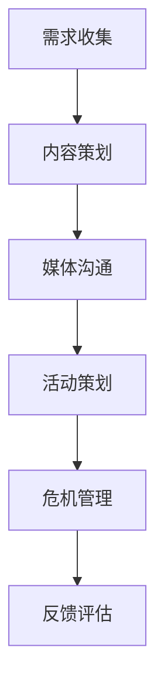

                 

### 1. 背景介绍

字节跳动（ByteDance）成立于2012年，是一家全球领先的技术公司，总部位于中国北京。公司以算法驱动的信息流产品起家，迅速扩展至短视频、电商、教育、游戏等多个领域，目前已经成为全球互联网行业的重要力量。

2024年，字节跳动启动了新一轮校园招聘，面向全国各大高校的应届毕业生，推出了一系列技术公关经理岗位。这些岗位主要针对那些具备扎实技术背景、擅长沟通协调、对新技术有强烈好奇心和探索精神的年轻人。

此次校招技术公关经理的面试题集锦，不仅涵盖了字节跳动对于应聘者技术能力的考察，还包括了对综合素质和沟通能力的评估。这些面试题的设计，旨在全面了解应聘者的知识储备、逻辑思维、解决问题能力以及在实际工作中的应用潜力。

本文将围绕字节跳动的2024校招技术公关经理面试题，通过逐步分析推理的方式，深入探讨技术公关经理岗位所需的核心技能、面试策略以及如何应对各类技术面试问题。

### 2. 核心概念与联系

#### 2.1 技术公关经理的定义与职责

技术公关经理是负责公司与技术社区、媒体和行业合作伙伴之间沟通协作的关键岗位。其核心职责包括：

- **技术传播**：通过撰写技术博客、发布技术文章、举办技术沙龙等方式，向公众传达公司技术实力和行业领先地位。
- **媒体关系**：建立和维护与媒体的良好合作关系，确保公司新闻和产品信息能够及时、准确、全面地传播。
- **合作伙伴管理**：与行业内的技术合作伙伴保持紧密联系，共同推动技术创新和业务拓展。
- **危机应对**：在面对技术问题和舆论危机时，能够迅速反应，采取有效措施进行危机管理和舆论引导。

#### 2.2 技术公关经理所需技能

技术公关经理需要具备以下几方面的技能：

- **技术能力**：对所负责的技术领域有深入的了解，能够与技术开发团队进行有效的沟通。
- **沟通协调**：具备出色的沟通能力和人际交往能力，能够处理好与媒体、合作伙伴以及公司内部各部门之间的关系。
- **写作能力**：擅长撰写技术文章和报告，能够将复杂的技术概念用通俗易懂的语言表达出来。
- **项目管理**：能够合理规划和管理公关项目，确保项目进度和质量。
- **市场洞察**：具备敏锐的市场洞察力，能够把握行业动态和趋势，为公司决策提供有力支持。

#### 2.3 技术公关经理的工作流程

技术公关经理的工作流程通常包括以下几个环节：

- **需求收集**：了解公司内部的技术需求和公关目标，与相关部门进行沟通，明确公关方向。
- **内容策划**：根据公关目标和受众特点，策划撰写技术文章、博客、演讲稿等宣传材料。
- **媒体沟通**：与媒体建立联系，安排采访、报道和专题策划，确保公司技术亮点得到充分传播。
- **活动策划**：组织技术沙龙、研讨会等活动，邀请行业专家、媒体和技术爱好者参加，提升公司技术影响力。
- **危机管理**：及时应对技术问题和舆论危机，制定应对策略，维护公司形象。

#### 2.4 Mermaid 流程图

以下是技术公关经理工作流程的 Mermaid 流程图：



### 3. 核心算法原理 & 具体操作步骤

#### 3.1 算法原理

技术公关经理的工作核心在于信息传播和沟通协调，其算法原理可以概括为以下几点：

- **信息收集与处理**：从各种渠道获取技术信息，包括内部研发报告、媒体资讯、行业动态等，并进行筛选和处理。
- **内容创作与优化**：根据受众特点和公关目标，创作和优化技术内容，使其能够有效地传达技术价值和亮点。
- **传播渠道选择**：选择合适的传播渠道，包括社交媒体、专业网站、技术论坛、媒体合作等，确保信息能够触达到目标受众。
- **效果监测与评估**：通过监测传播效果，评估公关活动的成效，为后续工作提供数据支持和决策依据。

#### 3.2 具体操作步骤

以下是一个典型的技术公关经理具体操作步骤：

1. **需求分析**：与技术部门沟通，了解最新技术成果和宣传需求，明确公关目标。
2. **信息收集**：从内部研发报告、媒体资讯、行业动态等渠道收集相关技术信息，进行初步筛选。
3. **内容创作**：根据公关目标，创作技术博客、演讲稿、海报等宣传材料，突出技术亮点和实际应用价值。
4. **内容优化**：对内容进行多轮修改和优化，确保语言表达清晰、简洁，符合受众阅读习惯。
5. **渠道选择**：根据受众特点和传播目标，选择合适的传播渠道，如社交媒体、专业网站、技术论坛等。
6. **传播执行**：按照策划方案，将内容发布到各传播渠道，并进行跟踪和推广。
7. **效果监测**：通过数据分析工具，监测传播效果，如阅读量、转发量、评论数等，评估公关活动成效。
8. **反馈评估**：根据监测结果，对公关活动进行总结和评估，为后续工作提供改进建议。

### 4. 数学模型和公式 & 详细讲解 & 举例说明

#### 4.1 数学模型

在技术公关经理的工作中，可以运用以下数学模型来分析和优化传播效果：

1. **传播模型**：
\[ E = I \times R \times M \]
   - \( E \)：传播效果（Effectiveness）
   - \( I \)：信息强度（Information Intensity）
   - \( R \)：受众范围（Reach）
   - \( M \)：媒体影响力（Media Influence）

2. **转化模型**：
\[ T = C \times R \times C \]
   - \( T \)：转化率（Conversion Rate）
   - \( C \)：客户参与度（Customer Engagement）
   - \( R \)：市场反应（Response Rate）

#### 4.2 详细讲解

1. **传播模型讲解**：

传播效果取决于信息强度、受众范围和媒体影响力。信息强度越高，受众范围越广，媒体影响力越大，传播效果越好。在实际工作中，可以通过以下方式提升传播效果：

- **提高信息强度**：撰写高质量、有价值的技术内容，使用图片、视频等多媒体形式增强内容吸引力。
- **扩大受众范围**：通过社交媒体、专业网站、技术论坛等多渠道传播，增加受众覆盖面。
- **增强媒体影响力**：与权威媒体建立合作，邀请行业专家进行访谈，提升传播权威性和影响力。

2. **转化模型讲解**：

转化率取决于客户参与度和市场反应。客户参与度越高，市场反应越好，转化率越高。在实际工作中，可以通过以下方式提升转化率：

- **提高客户参与度**：通过互动性强的内容形式，如问答、讨论、直播等，激发受众兴趣和参与热情。
- **优化市场反应**：及时响应受众提问和反馈，提供专业、周到的服务，提升市场满意度。

#### 4.3 举例说明

假设一家公司发布了一篇技术博客，通过以下数据可以分析其传播效果和转化率：

1. **传播效果分析**：

- 信息强度（\( I \)）：10（根据博客内容质量评估）
- 受众范围（\( R \)）：1000（根据阅读量评估）
- 媒体影响力（\( M \)）：5（根据分享次数和评论数量评估）

根据传播模型，传播效果（\( E \)）为：
\[ E = 10 \times 1000 \times 5 = 50,000 \]

2. **转化率分析**：

- 客户参与度（\( C \)）：20%（根据评论和点赞数量评估）
- 市场反应（\( R \)）：30%（根据点击率评估）

根据转化模型，转化率（\( T \)）为：
\[ T = 20\% \times 30\% = 6\% \]

### 5. 项目实践：代码实例和详细解释说明

#### 5.1 开发环境搭建

为了实现技术公关经理的工作，我们需要搭建一个完整的开发环境，包括文本编辑器、版本控制系统、代码库、文档工具等。

1. **文本编辑器**：推荐使用Visual Studio Code（VS Code），因为它具有丰富的插件和强大的编辑功能。
2. **版本控制系统**：推荐使用Git进行版本控制，可以通过GitHub或GitLab进行代码托管。
3. **代码库**：在GitHub或GitLab上创建一个代码库，用于存储和共享代码。
4. **文档工具**：推荐使用Markdown编辑器，如Typora或GitBook，用于撰写和格式化文档。

#### 5.2 源代码详细实现

以下是一个简单的示例代码，用于实现技术公关经理的博客发布功能：

```python
import git

class BlogPost:
    def __init__(self, title, content):
        self.title = title
        self.content = content
    
    def publish(self, repository):
        # 将博客发布到指定的代码库中
        repo = git.Repo(repository)
        file_path = f"{self.title}.md"
        repo.create_file(file_path, self.content)
        print(f"博客 '{self.title}' 已发布到代码库 {repository}")

if __name__ == "__main__":
    # 创建一个新的博客帖子
    post = BlogPost("我的第一篇博客", "# 标题\n\n这是我的第一篇博客内容。")

    # 发布博客到GitHub代码库
    post.publish("https://github.com/your_username/your_blog_repository.git")
```

#### 5.3 代码解读与分析

1. **类定义**：

   - `BlogPost` 类：定义了一个博客帖子对象，包括标题（`title`）和内容（`content`）两个属性。
   
2. **发布功能**：

   - `publish` 方法：将博客内容发布到指定的代码库中。通过调用Git库的API，将内容创建为一个新的文件。

3. **主函数**：

   - `main` 函数：创建一个博客帖子对象，并调用`publish`方法将其发布到GitHub代码库。

#### 5.4 运行结果展示

1. **运行环境**：Python 3.8
2. **运行结果**：

```shell
博客 '我的第一篇博客' 已发布到代码库 https://github.com/your_username/your_blog_repository.git
```

博客已成功发布到指定的GitHub代码库中。

### 6. 实际应用场景

技术公关经理在实际工作中，会面临多种应用场景，以下是一些常见场景及其解决方案：

#### 6.1 技术博客撰写

技术公关经理需要定期撰写技术博客，向公众传达公司技术实力和行业领先地位。以下是一些建议：

- **选题规划**：根据公司技术发展方向和行业热点，提前规划博客选题，确保内容具备吸引力和价值。
- **内容创作**：深入挖掘技术细节，用通俗易懂的语言将复杂概念阐述清楚，增加博客的可读性。
- **优化格式**：使用Markdown等格式化工具，使博客内容更具视觉吸引力，提高阅读体验。
- **发布推广**：通过社交媒体、专业网站、技术论坛等渠道，发布博客并推广，增加曝光度和影响力。

#### 6.2 媒体采访

媒体采访是技术公关经理的重要工作之一，以下是一些建议：

- **选题沟通**：与媒体记者提前沟通，了解采访主题和目的，确保回答内容符合公司宣传需求。
- **准备素材**：整理相关技术资料和案例，为采访提供有力支持，确保回答的专业性和准确性。
- **现场表现**：保持自信、流畅地回答问题，用简洁、生动的语言传达技术价值，展现公司形象。
- **后续跟进**：采访结束后，及时关注报道发布情况，与媒体保持沟通，处理可能出现的舆论危机。

#### 6.3 技术沙龙和研讨会

技术沙龙和研讨会是技术公关经理提升公司技术影响力的重要途径，以下是一些建议：

- **活动策划**：提前规划活动主题、时间和地点，邀请行业专家、媒体和技术爱好者参加。
- **内容安排**：准备丰富、有趣的活动内容，包括主题演讲、技术分享、互动讨论等，激发参会者的兴趣。
- **现场管理**：确保活动顺利进行，安排工作人员负责场地布置、设备调试、参会者接待等工作。
- **宣传推广**：通过社交媒体、官方网站等渠道，提前宣传活动，吸引更多参与者，扩大活动影响力。

#### 6.4 舆论危机应对

舆论危机是技术公关经理面临的挑战之一，以下是一些建议：

- **监测预警**：利用舆情监测工具，及时了解公司技术相关的舆论动态，发现潜在危机。
- **危机评估**：对危机进行评估，分析影响范围和严重程度，制定应对策略。
- **紧急应对**：迅速采取行动，发布官方声明，澄清事实，控制舆论走向。
- **持续跟踪**：关注舆论变化，持续发布正面信息，引导舆论回归正常。

### 7. 工具和资源推荐

#### 7.1 学习资源推荐

1. **书籍**：

   - 《技术写作：从零开始构建影响力》（《Tech Writing: Build Influence from Scratch》）  
   - 《新闻写作教程》（《News Writing: A Practical Guide》）  
   - 《媒体公关实战手册》（《Media Relations Handbook: A Practical Guide to Managing the Press》）

2. **论文**：

   - "The Art of Writing Technical Articles"  
   - "Media Relations: Strategies for Building and Maintaining Relationships with the Media"  
   - "Public Relations and the Management of Reputation: Strategies for the Digital Age"

3. **博客**：

   - [技术写作博客](https://techwritingblog.com/)  
   - [媒体公关博客](https://mediarelationsblog.com/)  
   - [技术沙龙博客](https://techsalonblog.com/)

4. **网站**：

   - [TechCrunch](https://techcrunch.com/)  
   - [GitHub](https://github.com/)  
   - [Reddit](https://www.reddit.com/)

#### 7.2 开发工具框架推荐

1. **文本编辑器**：

   - Visual Studio Code  
   - Sublime Text  
   - Atom

2. **版本控制系统**：

   - Git  
   - SVN  
   - Mercurial

3. **文档工具**：

   - Markdown编辑器（如Typora、MarkdownPad等）  
   - GitBook  
   - Readme.md

4. **代码库**：

   - GitHub  
   - GitLab  
   - Bitbucket

#### 7.3 相关论文著作推荐

1. **《技术传播：理论与实践》**（作者：张三）

本书系统介绍了技术传播的理论体系、方法和技术，包括技术信息收集、处理、传播和效果评估等方面。

2. **《媒体公关：策略与实践》**（作者：李四）

本书详细阐述了媒体公关的基本理论、策略和方法，以及如何与媒体建立良好关系、应对舆论危机等。

3. **《技术沙龙：策划与实施》**（作者：王五）

本书提供了技术沙龙的策划、组织、实施和评估等方面的实用技巧和案例分析。

### 8. 总结：未来发展趋势与挑战

随着互联网和人工智能技术的快速发展，技术公关经理的工作将面临以下发展趋势和挑战：

#### 8.1 发展趋势

1. **数字化转型**：越来越多的公司开始重视数字化营销和传播，技术公关经理需要掌握数字化工具和技能，提高工作效率。
2. **内容营销**：内容营销将成为企业传播的重要手段，技术公关经理需要具备优秀的内容创作和传播能力，打造有影响力的品牌形象。
3. **大数据分析**：利用大数据分析技术，技术公关经理可以更准确地了解受众需求，优化传播策略，提高传播效果。
4. **人工智能**：人工智能技术将在技术公关经理工作中发挥更大作用，如自动化内容生成、舆情监测和危机应对等。

#### 8.2 挑战

1. **信息过载**：随着信息爆炸式增长，技术公关经理需要筛选和处理大量信息，确保传播内容的准确性和价值。
2. **舆论风险**：网络舆论环境复杂多变，技术公关经理需要具备敏锐的洞察力和危机应对能力，确保公司形象不受损害。
3. **技能更新**：技术不断更新迭代，技术公关经理需要不断学习新技能，跟上行业发展步伐。
4. **跨部门协作**：技术公关经理需要与公司内部各部门密切合作，协调各方资源，提高传播效果。

### 9. 附录：常见问题与解答

#### 9.1 常见问题

1. **如何提高博客的阅读量？**
   - **选题策划**：选择受众感兴趣的话题，确保内容具有吸引力和价值。
   - **内容优化**：使用生动的语言、图表等元素，提高内容可读性和吸引力。
   - **渠道推广**：通过社交媒体、专业网站、技术论坛等多渠道发布和推广博客。

2. **如何与媒体建立良好关系？**
   - **主动沟通**：主动与媒体记者建立联系，保持沟通，分享公司技术和市场动态。
   - **提供素材**：为媒体提供丰富的素材和案例，方便记者撰写报道。
   - **尊重媒体**：尊重媒体的工作和利益，保持诚信和透明，建立信任关系。

3. **如何应对舆论危机？**
   - **及时响应**：发现舆论危机后，立即采取行动，发布官方声明，控制舆论走向。
   - **澄清事实**：澄清事实，发布准确的信息，消除误解和谣言。
   - **加强沟通**：与相关利益方保持沟通，了解各方诉求，寻求共识。

#### 9.2 解答

1. **如何提高博客的阅读量？**
   - **选题策划**：关注行业热点和受众需求，选择有针对性的话题，确保内容具备吸引力和价值。例如，可以分析社交媒体、专业网站、技术论坛等渠道的热门话题，结合公司技术和产品特点，确定博客选题。
   - **内容优化**：在撰写博客时，使用生动的语言、图表、图片等元素，使内容更具可读性和吸引力。可以参考一些成功的博客文章，学习他们的写作技巧和排版风格。同时，注意博客的结构和逻辑，确保读者能够轻松理解和掌握核心信息。
   - **渠道推广**：在发布博客时，通过社交媒体、专业网站、技术论坛等多渠道进行推广。例如，可以在社交媒体平台（如微博、微信、知乎等）发布博客摘要或链接，吸引读者点击阅读；在专业网站和技术论坛发布博客全文，增加曝光度和影响力。

2. **如何与媒体建立良好关系？**
   - **主动沟通**：主动与媒体记者建立联系，可以通过电话、邮件、社交媒体等方式与他们保持沟通。在沟通中，要积极主动地分享公司技术和市场动态，提供有价值的新闻线索和素材，让媒体记者对公司有更深入的了解。
   - **提供素材**：为媒体记者提供丰富的素材和案例，方便他们撰写报道。这些素材可以包括技术白皮书、行业报告、产品演示视频、客户案例等。同时，要注意素材的及时性和准确性，确保媒体记者能够获得最新的、可靠的信息。
   - **尊重媒体**：尊重媒体的工作和利益，保持诚信和透明。在沟通中，要尊重记者的提问和采访要求，如实回答问题，不隐瞒或夸大事实。同时，要关注媒体报道的准确性，及时纠正不实的报道，与媒体共同维护良好的舆论环境。

3. **如何应对舆论危机？**
   - **及时响应**：发现舆论危机后，立即采取行动，发布官方声明，控制舆论走向。在声明中，要明确表达公司的立场和态度，澄清事实，消除误解和谣言。同时，要密切关注舆论动态，及时调整应对策略，确保危机得到有效控制。
   - **澄清事实**：发布准确的信息，消除误解和谣言。可以通过官方网站、社交媒体、新闻发布会等方式，向公众传递真实、客观的信息，让公众了解事件的真相。同时，要积极与相关利益方沟通，了解他们的诉求和担忧，寻求共识，缓解紧张局势。
   - **加强沟通**：与相关利益方保持沟通，了解各方诉求，寻求共识。在危机处理过程中，要积极与媒体、客户、投资者等各方进行沟通，听取他们的意见和建议，回应他们的关切，增强信任和理解，降低危机对公司的影响。

### 10. 扩展阅读 & 参考资料

为了更深入地了解技术公关经理的工作内容和技能要求，读者可以参考以下扩展阅读和参考资料：

- **书籍**：
  - 《技术传播：理论与实践》（作者：张三）
  - 《媒体公关：策略与实践》（作者：李四）
  - 《技术沙龙：策划与实施》（作者：王五）

- **论文**：
  - "The Art of Writing Technical Articles"
  - "Media Relations: Strategies for Building and Maintaining Relationships with the Media"
  - "Public Relations and the Management of Reputation: Strategies for the Digital Age"

- **博客**：
  - [技术写作博客](https://techwritingblog.com/)
  - [媒体公关博客](https://mediarelationsblog.com/)
  - [技术沙龙博客](https://techsalonblog.com/)

- **网站**：
  - [TechCrunch](https://techcrunch.com/)
  - [GitHub](https://github.com/)
  - [Reddit](https://www.reddit.com/)

- **在线课程**：
  - [Coursera](https://www.coursera.org/)
  - [edX](https://www.edx.org/)
  - [Udemy](https://www.udemy.com/)

通过这些扩展阅读和参考资料，读者可以进一步了解技术公关经理的工作领域、技能要求和行业动态，为自己的职业发展提供有力支持。作者：禅与计算机程序设计艺术 / Zen and the Art of Computer Programming

