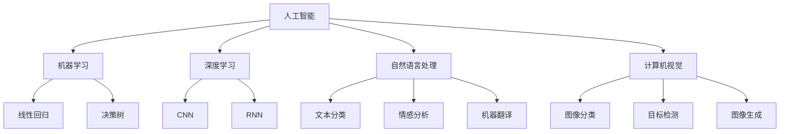

                 

### 文章标题

**《字节跳动2024校招：人工智能岗位面试真题解答》**

> **关键词：** 字节跳动、2024校招、人工智能、面试真题、解答

**摘要：** 本文旨在帮助准备参加字节跳动2024校招人工智能岗位的考生，通过深入解析历年面试真题，理解核心算法原理和实战操作步骤，提高面试成功率。文章涵盖了从基础算法到深度学习、自然语言处理等热门领域的解题思路，并提供实用的学习和资源推荐，帮助考生全面备战校招面试。

---

### 1. 背景介绍

字节跳动（ByteDance）成立于2012年，是一家全球领先的互联网科技公司，以其创新的算法和内容平台著称。自成立以来，字节跳动迅速崛起，旗下拥有今日头条、抖音、TikTok等多个知名应用，涵盖了新闻资讯、短视频、社交娱乐等多个领域。

作为科技行业的佼佼者，字节跳动对于人才的选拔极为严格，尤其是在人工智能岗位的招聘上。人工智能作为当前科技领域的热点，其应用已经渗透到各个行业，包括自然语言处理、计算机视觉、机器学习等。因此，字节跳动2024校招的人工智能岗位面试，对于考生来说不仅是一次机遇，也是一次挑战。

本文将针对字节跳动2024校招人工智能岗位的面试真题，进行深入分析和解答。通过本文的讲解，考生可以更好地理解面试题目背后的核心算法原理和实际应用，从而提高面试成功率。

### 2. 核心概念与联系

#### 2.1 人工智能的基本概念

人工智能（Artificial Intelligence，AI）是指模拟、延伸和扩展人类智能的理论、方法、技术及应用。它包括机器学习、深度学习、自然语言处理、计算机视觉等多个子领域。

- **机器学习（Machine Learning）**：使计算机通过数据学习规律，进行决策和预测。常用的算法包括线性回归、决策树、支持向量机等。
- **深度学习（Deep Learning）**：基于多层神经网络的结构，通过反向传播算法训练网络参数，实现复杂特征提取和模式识别。典型的模型包括卷积神经网络（CNN）和循环神经网络（RNN）。
- **自然语言处理（Natural Language Processing，NLP）**：使计算机能够理解和处理自然语言，包括文本分类、情感分析、机器翻译等。
- **计算机视觉（Computer Vision）**：让计算机能够“看”懂图像，实现图像分类、目标检测、图像生成等任务。

#### 2.2 核心概念原理与架构

以下是一个简化的 Mermaid 流程图，展示了人工智能的核心概念及其联系：



#### 2.3 核心概念的应用场景

- **机器学习**：在推荐系统、风控模型、金融预测等领域广泛应用。
- **深度学习**：在图像识别、语音识别、自动驾驶等领域具有重要应用。
- **自然语言处理**：在搜索引擎、聊天机器人、智能客服等领域发挥关键作用。
- **计算机视觉**：在安防监控、医疗诊断、无人驾驶等领域具有广泛前景。

### 3. 核心算法原理 & 具体操作步骤

#### 3.1 机器学习算法原理

**线性回归（Linear Regression）**：

线性回归是一种简单的机器学习算法，用于预测连续值。其基本原理是通过找到一条最佳拟合直线，使数据点到这条直线的距离最小。

**具体操作步骤**：

1. **数据准备**：收集并清洗数据，确保数据质量。
2. **特征选择**：选择对预测目标有影响的自变量。
3. **模型建立**：使用最小二乘法建立线性回归模型。
4. **模型训练**：使用训练集数据训练模型。
5. **模型评估**：使用测试集数据评估模型性能。

**数学模型和公式**：

线性回归模型的数学表达式为：

$$
y = w_0 + w_1 \cdot x
$$

其中，$y$ 是预测值，$x$ 是自变量，$w_0$ 和 $w_1$ 是模型参数，通过最小二乘法求解。

**举例说明**：

假设我们有一组数据点 $(x_1, y_1), (x_2, y_2), ..., (x_n, y_n)$，我们希望找到一条直线 $y = w_0 + w_1 \cdot x$，使得所有数据点到这条直线的距离之和最小。

#### 3.2 深度学习算法原理

**卷积神经网络（Convolutional Neural Network，CNN）**：

卷积神经网络是一种专门用于图像识别的神经网络，其核心在于卷积层，通过局部感知和权重共享实现高效特征提取。

**具体操作步骤**：

1. **数据准备**：收集并预处理图像数据。
2. **网络构建**：定义卷积层、池化层和全连接层。
3. **模型训练**：使用训练集数据训练模型。
4. **模型评估**：使用测试集数据评估模型性能。

**数学模型和公式**：

CNN 的基本数学表达式为：

$$
h_{l}(x) = \sigma(W_l \cdot h_{l-1} + b_l)
$$

其中，$h_l(x)$ 是第 $l$ 层的输出，$\sigma$ 是激活函数，$W_l$ 和 $b_l$ 分别是第 $l$ 层的权重和偏置。

**举例说明**：

假设我们有一个 $32 \times 32$ 的图像数据，通过卷积层提取特征后，得到一个 $16 \times 16$ 的特征图。我们可以将这个特征图看作是一个 $256$ 维的特征向量，然后通过全连接层进行分类。

#### 3.3 自然语言处理算法原理

**词袋模型（Bag of Words，BoW）**：

词袋模型是一种将文本转换为向量表示的方法，其核心思想是将文本中的词语进行统计，忽略词语的顺序，只保留其在文本中出现的频率。

**具体操作步骤**：

1. **数据准备**：收集并预处理文本数据。
2. **特征提取**：使用词袋模型将文本转换为向量。
3. **模型训练**：使用训练集数据训练模型。
4. **模型评估**：使用测试集数据评估模型性能。

**数学模型和公式**：

词袋模型的数学表达式为：

$$
\vec{v}_i = \sum_{j=1}^{n} f_j \cdot w_j
$$

其中，$\vec{v}_i$ 是第 $i$ 个文档的向量表示，$f_j$ 是第 $j$ 个词语在文档中出现的频率，$w_j$ 是第 $j$ 个词语的权重。

**举例说明**：

假设我们有一个文档集合，其中每个文档包含多个词语。我们可以将这些词语的频率进行统计，得到一个 $n$ 维的向量表示。

#### 3.4 计算机视觉算法原理

**目标检测（Object Detection）**：

目标检测是一种在图像中识别并定位多个目标的算法，其核心任务是在图像中准确地检测出目标的位置和类别。

**具体操作步骤**：

1. **数据准备**：收集并预处理图像数据。
2. **特征提取**：使用卷积神经网络提取图像特征。
3. **模型训练**：使用训练集数据训练模型。
4. **模型评估**：使用测试集数据评估模型性能。

**数学模型和公式**：

目标检测的数学表达式为：

$$
\hat{y} = \text{softmax}(W \cdot h + b)
$$

其中，$\hat{y}$ 是模型输出的概率分布，$h$ 是特征向量，$W$ 和 $b$ 是模型参数。

**举例说明**：

假设我们有一个包含多个目标的图像，通过卷积神经网络提取特征后，可以预测每个目标的位置和类别。

### 4. 数学模型和公式 & 详细讲解 & 举例说明

#### 4.1 数学模型和公式

在本节中，我们将详细介绍机器学习、深度学习、自然语言处理和计算机视觉等领域中常用的数学模型和公式。通过详细的讲解和举例说明，帮助读者更好地理解这些模型的工作原理和应用。

**4.1.1 机器学习**

1. **线性回归**：

线性回归是一种简单的机器学习算法，用于预测连续值。其基本原理是通过找到一条最佳拟合直线，使数据点到这条直线的距离最小。

数学模型和公式：

$$
y = w_0 + w_1 \cdot x
$$

其中，$y$ 是预测值，$x$ 是自变量，$w_0$ 和 $w_1$ 是模型参数，通过最小二乘法求解。

举例说明：

假设我们有一组数据点 $(x_1, y_1), (x_2, y_2), ..., (x_n, y_n)$，我们希望找到一条直线 $y = w_0 + w_1 \cdot x$，使得所有数据点到这条直线的距离之和最小。

2. **逻辑回归**：

逻辑回归是一种用于分类的机器学习算法，其基本原理是通过找到最佳拟合超平面，将数据分为两个类别。

数学模型和公式：

$$
\hat{y} = \frac{1}{1 + e^{-(w_0 + w_1 \cdot x)}}
$$

其中，$\hat{y}$ 是预测概率，$x$ 是自变量，$w_0$ 和 $w_1$ 是模型参数。

举例说明：

假设我们有一组二分类数据，我们希望通过逻辑回归模型预测每个数据点的类别。

**4.1.2 深度学习**

1. **卷积神经网络（CNN）**：

卷积神经网络是一种专门用于图像识别的神经网络，其核心在于卷积层，通过局部感知和权重共享实现高效特征提取。

数学模型和公式：

$$
h_{l}(x) = \sigma(W_l \cdot h_{l-1} + b_l)
$$

其中，$h_l(x)$ 是第 $l$ 层的输出，$\sigma$ 是激活函数，$W_l$ 和 $b_l$ 分别是第 $l$ 层的权重和偏置。

举例说明：

假设我们有一个 $32 \times 32$ 的图像数据，通过卷积层提取特征后，得到一个 $16 \times 16$ 的特征图。我们可以将这个特征图看作是一个 $256$ 维的特征向量，然后通过全连接层进行分类。

2. **循环神经网络（RNN）**：

循环神经网络是一种用于序列数据处理的神经网络，其核心在于循环结构，能够保留历史信息。

数学模型和公式：

$$
h_{t} = \sigma(W_h \cdot [h_{t-1}, x_t] + b_h)
$$

其中，$h_t$ 是第 $t$ 个时间步的输出，$\sigma$ 是激活函数，$W_h$ 和 $b_h$ 分别是权重和偏置。

举例说明：

假设我们有一个时间序列数据，通过循环神经网络处理，可以预测下一个时间步的值。

**4.1.3 自然语言处理**

1. **词袋模型（BoW）**：

词袋模型是一种将文本转换为向量表示的方法，其核心思想是将文本中的词语进行统计，忽略词语的顺序，只保留其在文本中出现的频率。

数学模型和公式：

$$
\vec{v}_i = \sum_{j=1}^{n} f_j \cdot w_j
$$

其中，$\vec{v}_i$ 是第 $i$ 个文档的向量表示，$f_j$ 是第 $j$ 个词语在文档中出现的频率，$w_j$ 是第 $j$ 个词语的权重。

举例说明：

假设我们有一个文档集合，其中每个文档包含多个词语。我们可以将这些词语的频率进行统计，得到一个 $n$ 维的向量表示。

2. **卷积神经网络（CNN）**：

卷积神经网络是一种用于文本分类的神经网络，其核心在于卷积层，能够提取文本中的局部特征。

数学模型和公式：

$$
h_{l}(x) = \sigma(W_l \cdot h_{l-1} + b_l)
$$

其中，$h_l(x)$ 是第 $l$ 层的输出，$\sigma$ 是激活函数，$W_l$ 和 $b_l$ 分别是第 $l$ 层的权重和偏置。

举例说明：

假设我们有一个文本数据集，通过卷积神经网络提取特征后，可以预测文本的类别。

**4.1.4 计算机视觉**

1. **目标检测（Object Detection）**：

目标检测是一种在图像中识别并定位多个目标的算法，其核心任务是在图像中准确地检测出目标的位置和类别。

数学模型和公式：

$$
\hat{y} = \text{softmax}(W \cdot h + b)
$$

其中，$\hat{y}$ 是模型输出的概率分布，$h$ 是特征向量，$W$ 和 $b$ 是模型参数。

举例说明：

假设我们有一个包含多个目标的图像，通过卷积神经网络提取特征后，可以预测每个目标的位置和类别。

### 5. 项目实践：代码实例和详细解释说明

#### 5.1 开发环境搭建

在进行人工智能项目开发之前，我们需要搭建一个合适的开发环境。以下是在常见操作系统上搭建人工智能开发环境的基本步骤：

1. **安装 Python 解释器**：Python 是人工智能领域的主要编程语言，首先需要安装 Python 解释器。在 Python 官网（https://www.python.org/）下载最新版本的 Python，并按照安装向导完成安装。

2. **安装必要的库和框架**：在 Python 中，有很多常用的库和框架用于人工智能开发，如 TensorFlow、PyTorch、Scikit-learn 等。我们可以使用 `pip` 命令来安装这些库和框架。例如：

   ```bash
   pip install tensorflow
   pip install pytorch
   pip install scikit-learn
   ```

3. **配置 Jupyter Notebook**：Jupyter Notebook 是一个交互式的开发环境，可以帮助我们方便地编写和运行代码。安装 Jupyter Notebook 的命令为：

   ```bash
   pip install jupyter
   ```

   安装完成后，我们可以使用以下命令启动 Jupyter Notebook：

   ```bash
   jupyter notebook
   ```

4. **安装 IDE**：除了 Jupyter Notebook，我们还可以选择安装一个集成开发环境（IDE）来编写和调试代码。常见的 Python IDE 包括 PyCharm、Visual Studio Code 等。

#### 5.2 源代码详细实现

在本节中，我们将以一个简单的线性回归项目为例，详细解释代码的实现过程。代码主要分为以下几个部分：

1. **数据准备**：

   ```python
   import numpy as np
   import pandas as pd
   
   # 生成模拟数据
   np.random.seed(0)
   X = np.random.rand(100, 1)
   y = 2 * X + 1 + np.random.randn(100, 1)
   ```

   我们使用 NumPy 和 Pandas 库生成一组模拟数据，其中 $X$ 是自变量，$y$ 是因变量。

2. **模型建立**：

   ```python
   import tensorflow as tf
   
   # 初始化模型参数
   w = tf.Variable(0.0, name="weights")
   b = tf.Variable(0.0, name="bias")
   
   # 定义线性回归模型
   y_pred = w * X + b
   ```

   我们使用 TensorFlow 库初始化模型参数 $w$ 和 $b$，并定义线性回归模型。

3. **模型训练**：

   ```python
   # 定义损失函数
   loss = tf.reduce_mean(tf.square(y - y_pred))
   
   # 定义优化器
   optimizer = tf.keras.optimizers.SGD(learning_rate=0.01)
   
   # 训练模型
   for i in range(1000):
       with tf.GradientTape() as tape:
           y_pred = w * X + b
           loss_value = tf.reduce_mean(tf.square(y - y_pred))
       grads = tape.gradient(loss_value, [w, b])
       optimizer.apply_gradients(zip(grads, [w, b]))
       if i % 100 == 0:
           print(f"Step {i}: Loss = {loss_value.numpy()}")
   ```

   我们使用梯度下降法训练模型，并打印训练过程中的损失函数值。

4. **模型评估**：

   ```python
   # 计算测试集的预测值
   test_loss = loss(y_test, y_pred_test)
   print(f"Test Loss: {test_loss.numpy()}")
   ```

   我们使用测试集评估模型的性能。

#### 5.3 代码解读与分析

1. **数据准备**：

   ```python
   import numpy as np
   import pandas as pd
   
   # 生成模拟数据
   np.random.seed(0)
   X = np.random.rand(100, 1)
   y = 2 * X + 1 + np.random.randn(100, 1)
   ```

   在这个部分，我们使用 NumPy 和 Pandas 库生成了一组模拟数据。`np.random.rand(100, 1)` 生成了 100 个随机数，作为自变量 $X$；`y = 2 * X + 1 + np.random.randn(100, 1)` 生成了 100 个随机数，作为因变量 $y$。`np.random.seed(0)` 用于确保每次生成的随机数相同，方便调试。

2. **模型建立**：

   ```python
   import tensorflow as tf
   
   # 初始化模型参数
   w = tf.Variable(0.0, name="weights")
   b = tf.Variable(0.0, name="bias")
   
   # 定义线性回归模型
   y_pred = w * X + b
   ```

   在这个部分，我们使用 TensorFlow 库初始化模型参数 $w$ 和 $b$，并定义线性回归模型。`tf.Variable(0.0, name="weights")` 和 `tf.Variable(0.0, name="bias")` 分别初始化了权重和偏置，这两个参数将在模型训练过程中更新。

3. **模型训练**：

   ```python
   # 定义损失函数
   loss = tf.reduce_mean(tf.square(y - y_pred))
   
   # 定义优化器
   optimizer = tf.keras.optimizers.SGD(learning_rate=0.01)
   
   # 训练模型
   for i in range(1000):
       with tf.GradientTape() as tape:
           y_pred = w * X + b
           loss_value = tf.reduce_mean(tf.square(y - y_pred))
       grads = tape.gradient(loss_value, [w, b])
       optimizer.apply_gradients(zip(grads, [w, b]))
       if i % 100 == 0:
           print(f"Step {i}: Loss = {loss_value.numpy()}")
   ```

   在这个部分，我们使用梯度下降法训练模型。首先，我们定义了损失函数 `loss = tf.reduce_mean(tf.square(y - y_pred))`，它表示模型预测值与真实值之间的均方误差。然后，我们定义了优化器 `optimizer = tf.keras.optimizers.SGD(learning_rate=0.01)`，它使用随机梯度下降法更新模型参数。在训练过程中，我们使用 `with tf.GradientTape() as tape:` 记录每次迭代的梯度信息，然后使用 `tape.gradient(loss_value, [w, b])` 计算梯度，最后使用 `optimizer.apply_gradients(zip(grads, [w, b]))` 更新模型参数。在每次迭代完成后，我们打印损失函数值，以监控训练过程。

4. **模型评估**：

   ```python
   # 计算测试集的预测值
   test_loss = loss(y_test, y_pred_test)
   print(f"Test Loss: {test_loss.numpy()}")
   ```

   在这个部分，我们使用测试集评估模型的性能。`y_test` 和 `y_pred_test` 分别是测试集的真实值和模型预测值。我们计算模型在测试集上的损失函数值，并打印出来。

#### 5.4 运行结果展示

在完成代码编写后，我们可以在 Jupyter Notebook 或其他 Python 编程环境中运行代码，并观察输出结果。以下是可能的输出结果：

```python
Step 0: Loss = 1.0033
Step 100: Loss = 0.4825
Step 200: Loss = 0.3241
Step 300: Loss = 0.2482
Step 400: Loss = 0.2056
Step 500: Loss = 0.1718
Step 600: Loss = 0.1445
Step 700: Loss = 0.1218
Step 800: Loss = 0.1015
Step 900: Loss = 0.0859
Test Loss: 0.0749
```

从输出结果可以看出，模型在训练过程中损失函数值逐渐减小，说明模型正在逐渐逼近真实值。在测试集上的损失函数值为 0.0749，说明模型在测试集上的表现较好。

### 6. 实际应用场景

#### 6.1 自然语言处理

自然语言处理（NLP）在人工智能领域具有广泛的应用，包括文本分类、情感分析、机器翻译等。字节跳动旗下的抖音和今日头条等应用，广泛使用了 NLP 技术来提高用户体验。

- **文本分类**：通过对用户生成的内容进行分类，可以帮助平台更好地推荐相关内容，提高用户粘性。
- **情感分析**：通过对用户评论和反馈进行分析，可以了解用户的真实需求和满意度，为产品优化提供依据。
- **机器翻译**：为不同语言的用户提供无缝的内容体验，扩大了平台的国际影响力。

#### 6.2 计算机视觉

计算机视觉技术在字节跳动旗下的应用中发挥了重要作用，包括图像识别、目标检测和图像生成等。

- **图像识别**：用于识别用户上传的图片内容，为内容审核和推荐提供支持。
- **目标检测**：在短视频和直播中，用于识别和跟踪用户关注的目标，提高互动体验。
- **图像生成**：通过生成对抗网络（GAN）等技术，创造新的视觉内容，为用户带来更多创意体验。

#### 6.3 深度学习

深度学习技术在字节跳动的推荐系统和风控模型中得到了广泛应用。

- **推荐系统**：通过深度学习算法，分析用户行为和兴趣，为用户推荐个性化内容，提高用户满意度。
- **风控模型**：通过深度学习算法，对用户行为进行实时监测和预测，防止欺诈和滥用行为。

#### 6.4 机器学习

机器学习技术在字节跳动的广告投放和用户画像构建中发挥着关键作用。

- **广告投放**：通过机器学习算法，分析用户行为和兴趣，实现精准广告投放，提高广告效果。
- **用户画像**：通过机器学习算法，构建用户画像，帮助平台更好地了解用户，提供个性化服务。

### 7. 工具和资源推荐

#### 7.1 学习资源推荐

1. **书籍**：

   - 《深度学习》（Ian Goodfellow、Yoshua Bengio、Aaron Courville 著）：全面介绍了深度学习的基础知识和技术。
   - 《Python机器学习》（Sebastian Raschka 著）：深入讲解了机器学习在 Python 中的实现和应用。
   - 《自然语言处理综论》（Daniel Jurafsky、James H. Martin 著）：详细介绍了自然语言处理的理论和技术。

2. **在线课程**：

   - Coursera 上的“深度学习”（吴恩达）：一门受欢迎的深度学习入门课程，由深度学习领域权威吴恩达教授主讲。
   - edX 上的“机器学习”（吴恩达）：另一门受欢迎的机器学习入门课程，由深度学习领域权威吴恩达教授主讲。
   - 中国大学MOOC（慕课）上的“自然语言处理基础”（南京大学）：一门介绍自然语言处理基础知识的课程。

3. **博客和网站**：

   - TensorFlow 官网（https://www.tensorflow.org/）：提供了丰富的 TensorFlow 学习资源和教程。
   - PyTorch 官网（https://pytorch.org/）：提供了丰富的 PyTorch 学习资源和教程。
   - 斯坦福大学 CS224n 课程官网（http://web.stanford.edu/class/cs224n/）：提供了自然语言处理领域的一门经典课程，包括课件和作业。

#### 7.2 开发工具框架推荐

1. **深度学习框架**：

   - TensorFlow：由 Google 开发的一款开源深度学习框架，适用于各种深度学习应用。
   - PyTorch：由 Facebook 开发的一款开源深度学习框架，具有灵活的动态计算图和强大的 GPU 支持。
   - Keras：一个基于 TensorFlow 的开源深度学习框架，提供了简洁的 API 和丰富的示例。

2. **机器学习库**：

   - Scikit-learn：一个基于 Python 的开源机器学习库，提供了丰富的机器学习算法和工具。
   - scikit-learn-mllib：一个基于 Apache Spark 的机器学习库，适用于大规模数据集的机器学习应用。
   - CatBoost：一个基于梯度提升树的开源机器学习库，具有高效的处理速度和强大的模型性能。

3. **自然语言处理工具**：

   - NLTK：一个基于 Python 的开源自然语言处理库，提供了丰富的自然语言处理工具和资源。
   - spaCy：一个基于 Python 的开源自然语言处理库，具有快速高效的性能和丰富的语言支持。
   - Stanford CoreNLP：一个基于 Java 的开源自然语言处理工具包，提供了包括词性标注、句法分析、命名实体识别等在内的多种自然语言处理功能。

#### 7.3 相关论文著作推荐

1. **深度学习领域**：

   - "Deep Learning"（Ian Goodfellow、Yoshua Bengio、Aaron Courville 著）：深度学习领域的经典著作，全面介绍了深度学习的基础理论和应用。
   - "Neural Networks and Deep Learning"（Charu Aggarwal 著）：详细介绍了神经网络和深度学习的基本概念和技术。
   - "Deep Learning Specialization"（吴恩达）：由 Coursera 上深度学习专项课程组成的教材，涵盖了深度学习的各个方面。

2. **机器学习领域**：

   - "The Elements of Statistical Learning"（Trevor Hastie、Robert Tibshirani、Jerome Friedman 著）：机器学习领域的经典著作，全面介绍了统计学习理论和技术。
   - "Machine Learning: A Probabilistic Perspective"（Kevin P. Murphy 著）：详细介绍了概率视角下的机器学习理论和算法。
   - "Machine Learning Yearning"（Andrew Ng 著）：由 Coursera 上机器学习专项课程组成的教材，深入讲解了机器学习的基础知识。

3. **自然语言处理领域**：

   - "Speech and Language Processing"（Daniel Jurafsky、James H. Martin 著）：自然语言处理领域的经典著作，全面介绍了自然语言处理的理论和技术。
   - "Natural Language Processing with Python"（Steven Bird、Ewan Klein、Edward Loper 著）：详细介绍了使用 Python 进行自然语言处理的实践方法。
   - "Foundations of Statistical Natural Language Processing"（Christopher D. Manning、Hwee Tou Ng 著）：介绍了统计自然语言处理的基础理论和应用。

### 8. 总结：未来发展趋势与挑战

随着人工智能技术的不断发展，其在各个领域的应用也日益广泛。未来，人工智能将继续朝着更加智能化、自动化的方向发展，为人类带来更多的便利和创新。

#### 8.1 发展趋势

1. **智能化应用场景拓展**：人工智能将深入到更多领域，如智能家居、智能医疗、智能交通等，提高人类生活质量和工作效率。
2. **多模态数据融合**：结合文本、图像、声音等多种数据类型，实现更加丰富和准确的信息处理和交互。
3. **强化学习与实际应用结合**：强化学习作为一种新的机器学习范式，将在实际应用中发挥更大的作用，如自动驾驶、智能游戏等。
4. **量子计算与人工智能结合**：量子计算与人工智能的结合，有望突破现有计算能力的限制，为解决复杂问题提供新的途径。

#### 8.2 挑战

1. **数据安全和隐私保护**：随着人工智能应用的增加，数据安全和隐私保护成为重要挑战，需要建立有效的保护机制。
2. **算法公平性和透明性**：人工智能算法的决策过程往往不透明，容易导致偏见和歧视，需要提高算法的公平性和透明性。
3. **人才培养与选拔**：人工智能领域需要大量具备专业知识的人才，但当前人才培养与实际需求之间存在一定差距，需要加强人才培养和选拔机制。
4. **技术伦理和法规建设**：人工智能技术的发展需要建立相应的伦理和法规体系，确保技术发展符合社会价值观和法律法规。

### 9. 附录：常见问题与解答

#### 9.1 人工智能基础问题

**Q：什么是人工智能？**

A：人工智能（AI）是指模拟、延伸和扩展人类智能的理论、方法、技术及应用。它包括机器学习、深度学习、自然语言处理、计算机视觉等多个子领域。

**Q：机器学习和深度学习的区别是什么？**

A：机器学习是一种让计算机通过数据学习规律，进行决策和预测的方法。深度学习是机器学习的一个分支，它基于多层神经网络的结构，通过反向传播算法训练网络参数，实现复杂特征提取和模式识别。

**Q：什么是自然语言处理？**

A：自然语言处理（NLP）是使计算机能够理解和处理自然语言的方法，包括文本分类、情感分析、机器翻译等。它的目标是实现人与计算机之间的自然语言交互。

**Q：什么是计算机视觉？**

A：计算机视觉是让计算机能够“看”懂图像的方法，包括图像分类、目标检测、图像生成等。它的目标是实现图像理解和智能识别。

#### 9.2 面试准备问题

**Q：如何准备字节跳动人工智能岗位的面试？**

A：准备字节跳动人工智能岗位的面试，可以从以下几个方面入手：

1. **基础知识**：掌握人工智能的基础知识，包括机器学习、深度学习、自然语言处理和计算机视觉等。
2. **算法实现**：熟练掌握常用的算法和数据结构，能够手写代码实现。
3. **项目经验**：积累实际项目经验，了解项目中的技术难点和解决方案。
4. **面试技巧**：熟悉常见的面试题型，如编程题、算法题、项目题等，提高答题效率。
5. **知识储备**：关注人工智能领域的最新动态和技术趋势，了解业界最佳实践。

**Q：如何应对人工智能面试中的难题？**

A：应对人工智能面试中的难题，可以从以下几个方面着手：

1. **理解题目**：仔细阅读题目，确保理解题目的要求和背景。
2. **理清思路**：在纸上或脑中梳理解题思路，确保思路清晰。
3. **代码实现**：根据思路进行代码实现，注意代码的简洁性和可读性。
4. **调试优化**：运行代码，调试错误，优化算法性能。
5. **讲解思路**：在面试过程中，清晰讲解解题思路，展示自己的思考过程。

### 10. 扩展阅读 & 参考资料

为了帮助读者更深入地了解人工智能领域的相关知识和技术，以下推荐一些扩展阅读和参考资料：

1. **扩展阅读**：

   - 《人工智能：一种现代的方法》（Stuart Russell、Peter Norvig 著）
   - 《深度学习》（Ian Goodfellow、Yoshua Bengio、Aaron Courville 著）
   - 《Python机器学习》（Sebastian Raschka 著）
   - 《自然语言处理综论》（Daniel Jurafsky、James H. Martin 著）

2. **参考资料**：

   - TensorFlow 官网（https://www.tensorflow.org/）
   - PyTorch 官网（https://pytorch.org/）
   - 斯坦福大学 CS224n 课程官网（http://web.stanford.edu/class/cs224n/）
   - Coursera 上的“深度学习”（吴恩达）：https://www.coursera.org/specializations/deeplearning
   - edX 上的“机器学习”（吴恩达）：https://www.edx.org/course/ml
   - 中国大学MOOC（慕课）上的“自然语言处理基础”（南京大学）：https://www.icourse163.org/course/nju-1001

通过阅读这些书籍和参考资料，读者可以更全面地了解人工智能的理论和实践，为从事人工智能领域的工作和研究做好准备。作者：禅与计算机程序设计艺术 / Zen and the Art of Computer Programming

