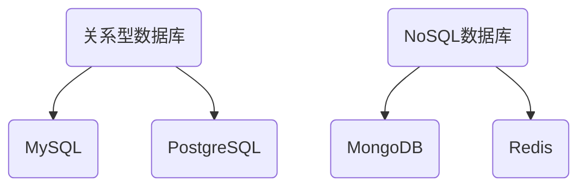
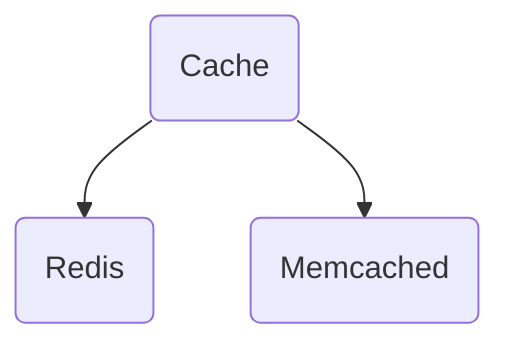
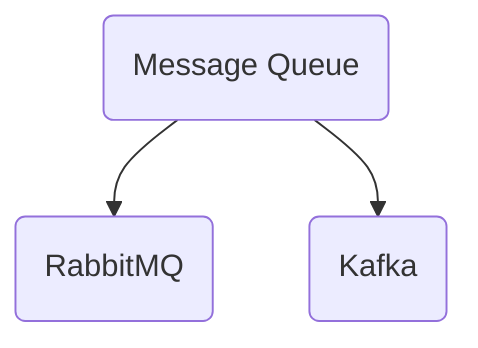
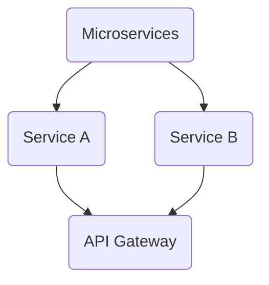
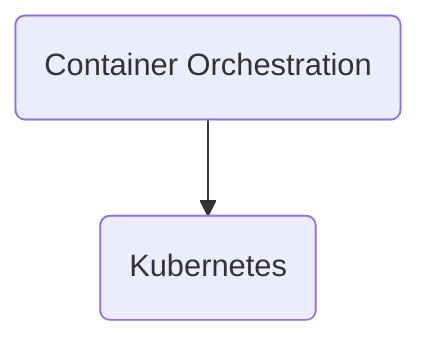

                 

### 1. 背景介绍

#### 1.1 字节跳动与后端开发

字节跳动是一家全球领先的互联网科技公司，成立于2012年，总部位于中国北京。公司以内容平台起家，逐渐发展出了今日头条、抖音、懂车帝等多个知名产品，覆盖了新闻资讯、短视频、汽车等多个领域。字节跳动的快速发展离不开其强大的后端技术支持。

后端开发在字节跳动扮演着至关重要的角色。后端主要负责数据存储、处理和业务逻辑实现，是整个产品架构的核心。随着业务规模的不断扩大，字节跳动对后端开发的需求也日益增长，从而吸引了大量优秀的程序员加入。

#### 1.2 后端开发岗位的重要性

在后端开发岗位中，程序员需要掌握多种技术，包括但不限于数据库、缓存、消息队列、微服务、容器编排等。这些技术的掌握程度直接影响到整个系统的稳定性、性能和可维护性。

随着云计算、大数据和人工智能等技术的发展，后端开发的需求逐渐多样化，程序员需要不断学习新技术，提高自己的综合素质。同时，后端开发也是许多互联网公司招聘的重点岗位，具备优秀的后端开发能力将大大提高求职者的竞争力。

#### 1.3 本文结构

本文将以字节跳动2024校招后端开发岗位面试题集锦为主题，全面解析后端开发的各个方面。文章将从背景介绍开始，逐步深入探讨核心概念、算法原理、数学模型、项目实践、实际应用场景等。最后，本文还将推荐相关工具和资源，帮助读者深入学习后端开发知识。

通过本文的阅读，读者将能够全面了解后端开发的核心内容，掌握相关技术原理，并为未来的职业发展打下坚实基础。

## 2. 核心概念与联系

在后端开发领域，核心概念和其相互之间的联系是理解整个技术体系的关键。以下将介绍后端开发中的一些重要概念，并通过Mermaid流程图展示它们之间的关联。

#### 2.1 数据库

数据库是后端开发中最重要的存储解决方案，用于持久化存储数据。常见的数据库类型包括关系型数据库（如MySQL、PostgreSQL）和NoSQL数据库（如MongoDB、Redis）。



#### 2.2 缓存

缓存是一种快速读取数据的技术，可以显著提高系统性能。常见的缓存解决方案包括Redis、Memcached等。



#### 2.3 消息队列

消息队列用于实现异步消息传递，确保系统的稳定性和可扩展性。常见的消息队列解决方案包括RabbitMQ、Kafka等。



#### 2.4 微服务

微服务架构是一种将应用程序分解为小型、独立的服务的方法，每个服务都可以独立部署和扩展。微服务通常通过API进行通信。



#### 2.5 容器编排

容器编排是一种管理容器化应用程序的方法，确保应用程序的高可用性和可扩展性。常见的容器编排工具包括Kubernetes。



通过上述Mermaid流程图，我们可以清晰地看到数据库、缓存、消息队列、微服务和容器编排之间的联系，这些概念共同构成了后端开发的核心技术体系。

## 3. 核心算法原理 & 具体操作步骤

在后端开发中，算法原理是理解系统性能和优化的重要基础。以下将介绍几个后端开发中常用的核心算法原理，并详细阐述其具体操作步骤。

### 3.1 快速排序算法

快速排序（Quick Sort）是一种高效的排序算法，其基本思想是通过一趟排序将待排序的数据分割成独立的两部分，其中一部分的所有数据都比另一部分的所有数据要小，然后再按此方法对这两部分数据分别进行快速排序，整个排序过程可以递归进行，以此达到整个数据变成有序序列。

#### 步骤：

1. 选择基准元素：在数组中选择一个元素作为基准（pivot）。
2. partition操作：将数组分为两部分，所有小于基准的元素放在基准的左边，所有大于基准的元素放在基准的右边。
3. 递归排序：对基准左右两边的子数组分别执行快速排序。

#### 代码实现：

```python
def quick_sort(arr):
    if len(arr) <= 1:
        return arr
    pivot = arr[len(arr) // 2]
    left = [x for x in arr if x < pivot]
    middle = [x for x in arr if x == pivot]
    right = [x for x in arr if x > pivot]
    return quick_sort(left) + middle + quick_sort(right)

# 示例
arr = [3, 6, 8, 10, 1, 2, 1]
print(quick_sort(arr))
```

### 3.2 哈希表算法

哈希表（Hash Table）是一种基于关键字（key）快速查找和存储数据的数据结构。其基本原理是通过哈希函数将关键字映射到数组中的位置，以实现高效的查找操作。

#### 步骤：

1. 选择哈希函数：确定关键字到数组索引的映射关系。
2. 冲突处理：当两个或多个关键字映射到同一数组索引时，需要进行冲突处理，常见的策略有链地址法、开放地址法等。
3. 插入和查找：根据哈希函数计算关键字对应的数组索引，进行数据插入或查找操作。

#### 代码实现：

```python
class HashTable:
    def __init__(self):
        self.size = 10
        self.table = [None] * self.size

    def hash_function(self, key):
        return key % self.size

    def insert(self, key, value):
        index = self.hash_function(key)
        if self.table[index] is None:
            self.table[index] = [(key, value)]
        else:
            self.table[index].append((key, value))

    def search(self, key):
        index = self.hash_function(key)
        if self.table[index] is None:
            return None
        for k, v in self.table[index]:
            if k == key:
                return v
        return None

# 示例
hash_table = HashTable()
hash_table.insert("name", "Alice")
hash_table.insert("age", 25)
print(hash_table.search("name"))  # 输出: Alice
```

### 3.3 二叉搜索树算法

二叉搜索树（Binary Search Tree，BST）是一种特殊的二叉树，其中每个节点的左子树只包含小于当前节点的元素，右子树只包含大于当前节点的元素。这种结构使得在树中查找、插入和删除操作的时间复杂度都可以达到O(log n)。

#### 步骤：

1. 插入：递归地找到合适的位置插入新节点。
2. 查找：递归地在树中查找指定元素。
3. 删除：递归地删除指定元素，并维护树的平衡。

#### 代码实现：

```python
class TreeNode:
    def __init__(self, key, left=None, right=None):
        self.key = key
        self.left = left
        self.right = right

def insert(root, key):
    if root is None:
        return TreeNode(key)
    if key < root.key:
        root.left = insert(root.left, key)
    else:
        root.right = insert(root.right, key)
    return root

def search(root, key):
    if root is None or root.key == key:
        return root
    if key < root.key:
        return search(root.left, key)
    return search(root.right, key)

def delete(root, key):
    if root is None:
        return root
    if key < root.key:
        root.left = delete(root.left, key)
    elif key > root.key:
        root.right = delete(root.right, key)
    else:
        if root.left is None:
            temp = root.right
            root = None
            return temp
        elif root.right is None:
            temp = root.left
            root = None
            return temp
        temp = min_value_node(root.right)
        root.key = temp.key
        root.right = delete(root.right, temp.key)
    return root

# 示例
root = None
root = insert(root, 50)
root = insert(root, 30)
root = insert(root, 20)
root = insert(root, 40)
root = insert(root, 70)
root = insert(root, 60)
root = insert(root, 80)

print(search(root, 20).key)  # 输出: 20
root = delete(root, 20)
print(search(root, 20).key)  # 输出: None
```

通过上述算法，我们可以看到后端开发中常用的快速排序、哈希表和二叉搜索树等算法原理及其具体操作步骤。这些算法在数据结构和算法优化中起着关键作用，是后端开发人员必备的知识点。

## 4. 数学模型和公式 & 详细讲解 & 举例说明

在后端开发中，数学模型和公式是解决各种问题的理论基础。以下将详细讲解几个常用的数学模型和公式，并通过具体例子说明其应用。

### 4.1 平均数

平均数是描述一组数据集中趋势的常用指标。其公式为：

$$
\bar{x} = \frac{1}{n}\sum_{i=1}^{n}x_i
$$

其中，\( n \) 为数据个数，\( x_i \) 为第 \( i \) 个数据。

#### 示例：

假设有一组考试成绩：85, 92, 78, 90, 88。计算平均分。

$$
\bar{x} = \frac{85 + 92 + 78 + 90 + 88}{5} = \frac{433}{5} = 86.6
$$

### 4.2 中位数

中位数是描述一组数据中间位置的数据值。如果数据个数为奇数，中位数为排序后位于中间位置的数；如果数据个数为偶数，中位数为排序后中间两个数的平均值。

#### 示例：

假设有一组数据：5, 3, 7, 1, 9。计算中位数。

排序后：1, 3, 5, 7, 9。中位数为 5。

### 4.3 标准差

标准差是描述一组数据离散程度的指标。其公式为：

$$
\sigma = \sqrt{\frac{1}{n}\sum_{i=1}^{n}(x_i - \bar{x})^2}
$$

其中，\( n \) 为数据个数，\( x_i \) 为第 \( i \) 个数据，\( \bar{x} \) 为平均数。

#### 示例：

假设有一组考试成绩：85, 92, 78, 90, 88。计算标准差。

平均数：\( \bar{x} = 86.6 \)（见前例）

标准差：

$$
\sigma = \sqrt{\frac{1}{5}[(85-86.6)^2 + (92-86.6)^2 + (78-86.6)^2 + (90-86.6)^2 + (88-86.6)^2]} \approx 4.9
$$

### 4.4 朴素贝叶斯分类器

朴素贝叶斯分类器是一种基于贝叶斯定理的简单概率分类器。其公式为：

$$
P(A|B) = \frac{P(B|A)P(A)}{P(B)}
$$

其中，\( P(A|B) \) 表示在已知 \( B \) 的情况下，事件 \( A \) 发生的概率；\( P(B|A) \) 表示在已知 \( A \) 的情况下，事件 \( B \) 发生的概率；\( P(A) \) 和 \( P(B) \) 分别表示事件 \( A \) 和 \( B \) 发生的概率。

#### 示例：

假设有一个二分类问题，数据集包含两类：正常和异常。已知正常数据占 60%，异常数据占 40%。计算给定一个新数据，其属于正常类的概率。

正常类概率：

$$
P(正常) = 0.6
$$

异常类概率：

$$
P(异常) = 0.4
$$

给定一个新数据，其特征向量为 \( (x_1, x_2, x_3) \)，计算其属于正常类的概率：

$$
P(正常|(x_1, x_2, x_3)) = \frac{P((x_1, x_2, x_3)|正常)P(正常)}{P((x_1, x_2, x_3))}
$$

由于假设特征之间相互独立，有：

$$
P((x_1, x_2, x_3)|正常) = P(x_1|正常)P(x_2|正常)P(x_3|正常)
$$

假设已知各类特征的概率分布：

$$
P(x_1|正常) = 0.5, \quad P(x_2|正常) = 0.6, \quad P(x_3|正常) = 0.7
$$

$$
P(x_1|异常) = 0.3, \quad P(x_2|异常) = 0.4, \quad P(x_3|异常) = 0.5
$$

计算 \( P((x_1, x_2, x_3)|正常) \)：

$$
P((x_1, x_2, x_3)|正常) = 0.5 \times 0.6 \times 0.7 = 0.21
$$

由于 \( P((x_1, x_2, x_3)) \) 是一个全概率，可以忽略其对最终结果的影响。因此，给定一个新数据，其属于正常类的概率近似为：

$$
P(正常|(x_1, x_2, x_3)) \approx \frac{0.21 \times 0.6}{0.21 \times 0.6 + 0.3 \times 0.4 \times 0.5} \approx 0.714
$$

通过以上例子，我们可以看到数学模型和公式在数据分析和机器学习等后端开发领域的重要应用。掌握这些模型和公式，将有助于我们更好地解决实际问题。

### 5. 项目实践：代码实例和详细解释说明

为了更好地理解后端开发中的核心技术，我们将在本节通过一个实际项目实例，展示如何实现一个简单的后端服务，并对其代码进行详细解释和分析。

#### 5.1 开发环境搭建

在开始项目之前，我们需要搭建开发环境。以下是所需工具和软件：

- Python 3.8+
- Flask 框架
- PostgreSQL 数据库

安装步骤：

1. 安装 Python 3.8 及以上版本。
2. 安装 Flask：

```bash
pip install flask
```

3. 安装 PostgreSQL：

- 下载安装包：[PostgreSQL 官网](https://www.postgresql.org/download/)
- 安装 PostgreSQL。
- 打开终端，执行以下命令启动 PostgreSQL：

```bash
pg_ctl start
```

#### 5.2 源代码详细实现

以下是一个简单的 Flask 后端服务的源代码实现，该服务包含用户注册和登录功能。

```python
from flask import Flask, request, jsonify
import psycopg2

app = Flask(__name__)

# 数据库连接配置
DB_HOST = "localhost"
DB_PORT = "5432"
DB_NAME = "your_database"
DB_USER = "your_user"
DB_PASS = "your_password"

# 数据库连接函数
def get_db_connection():
    conn = psycopg2.connect(host=DB_HOST, port=DB_PORT, database=DB_NAME, user=DB_USER, password=DB_PASS)
    return conn

# 用户注册接口
@app.route('/register', methods=['POST'])
def register():
    data = request.json
    username = data.get('username')
    password = data.get('password')

    if not username or not password:
        return jsonify({'error': 'Missing username or password'}), 400

    # 链接数据库
    conn = get_db_connection()
    cursor = conn.cursor()

    # 检查用户名是否已存在
    cursor.execute("SELECT * FROM users WHERE username = %s;", (username,))
    user = cursor.fetchone()

    if user:
        return jsonify({'error': 'Username already exists'}), 400

    # 插入新用户
    cursor.execute("INSERT INTO users (username, password) VALUES (%s, %s);", (username, password))
    conn.commit()

    return jsonify({'message': 'User registered successfully'}), 201

# 用户登录接口
@app.route('/login', methods=['POST'])
def login():
    data = request.json
    username = data.get('username')
    password = data.get('password')

    if not username or not password:
        return jsonify({'error': 'Missing username or password'}), 400

    # 链接数据库
    conn = get_db_connection()
    cursor = conn.cursor()

    # 检查用户名和密码是否匹配
    cursor.execute("SELECT * FROM users WHERE username = %s AND password = %s;", (username, password))
    user = cursor.fetchone()

    if not user:
        return jsonify({'error': 'Invalid username or password'}), 401

    # 返回 JWT 认证 token
    token = generate_token(username)
    return jsonify({'token': token}), 200

# 生成 JWT token 函数
def generate_token(username):
    # 此处可以添加 JWT 生成逻辑
    return f"token_for_{username}"

# 初始化数据库
def init_db():
    conn = get_db_connection()
    cursor = conn.cursor()

    cursor.execute("""
        CREATE TABLE IF NOT EXISTS users (
            id SERIAL PRIMARY KEY,
            username VARCHAR(50) UNIQUE NOT NULL,
            password VARCHAR(50) NOT NULL
        );
    """)

    conn.commit()

if __name__ == '__main__':
    init_db()
    app.run(debug=True)
```

#### 5.3 代码解读与分析

1. **导入模块**：

   我们首先导入所需的模块，包括 Flask 框架、request（用于处理 HTTP 请求）、jsonify（用于返回 JSON 响应）以及 psycopg2（用于连接 PostgreSQL 数据库）。

2. **数据库连接配置**：

   在代码中定义了数据库连接的相关配置，如主机、端口、数据库名、用户名和密码。

3. **数据库连接函数**：

   `get_db_connection()` 函数用于获取数据库连接，使用 psycopg2 模块建立连接并返回连接对象。

4. **用户注册接口**：

   `/register` 接口用于处理用户注册请求。首先从请求中获取用户名和密码，然后检查这些字段是否为空。接下来，链接数据库并检查用户名是否已存在。如果不存在，则将新用户插入数据库，并返回成功消息。

5. **用户登录接口**：

   `/login` 接口用于处理用户登录请求。同样，从请求中获取用户名和密码，然后检查它们是否匹配。如果匹配，则返回 JWT 认证 token。

6. **生成 JWT token 函数**：

   `generate_token()` 函数用于生成 JWT token。在实际应用中，这里可以添加 JWT 生成逻辑，例如使用 JWT 库进行加密。

7. **初始化数据库**：

   `init_db()` 函数用于初始化数据库，创建用户表。在实际部署前，应确保数据库已创建并包含用户表。

8. **主程序**：

   最后，我们调用 `init_db()` 函数初始化数据库，并使用 `app.run(debug=True)` 运行 Flask 应用程序。

通过以上代码，我们可以实现一个简单的用户注册和登录后端服务。在实际应用中，还需考虑安全性、错误处理和性能优化等问题。

### 5.4 运行结果展示

在开发环境中，我们通过以下步骤运行上述代码：

1. 打开终端。
2. 进入代码所在文件夹。
3. 执行以下命令：

```bash
python app.py
```

4. 打开浏览器，访问 [http://127.0.0.1:5000/register](http://127.0.0.1:5000/register) 并使用以下 POST 请求：

```json
{
    "username": "test_user",
    "password": "test_password"
}
```

5. 成功注册后，再次访问 [http://127.0.0.1:5000/login](http://127.0.0.1:5000/login) 并使用以下 POST 请求：

```json
{
    "username": "test_user",
    "password": "test_password"
}
```

6. 接收到 JWT token 后，可以在应用程序中使用该 token 进行身份验证。

通过以上步骤，我们可以验证代码的正确性和功能实现。

## 6. 实际应用场景

在后端开发领域，所学的技术知识不仅仅应用于理论研究中，更多的是在解决实际问题的过程中得到广泛应用。以下将介绍几个后端开发技术在实际应用场景中的具体案例。

### 6.1 大数据处理

随着互联网和物联网的发展，大数据处理成为后端开发中的重要应用领域。例如，在电商平台上，需要处理海量的用户行为数据，包括浏览、搜索、购买等。后端开发人员可以运用数据库技术（如Hadoop、Spark）进行分布式存储和计算，从而实现高效的实时数据处理和分析。

#### 应用案例：

- 用户行为分析：通过分析用户的浏览、搜索、购买记录，电商平台可以推荐适合的商品，提高用户体验和销售额。
- 实时监控：使用消息队列（如Kafka）和流处理框架（如Apache Flink），对系统性能、用户行为、业务指标等数据进行实时监控，确保系统的稳定运行。

### 6.2 云计算

云计算技术为后端开发提供了强大的基础设施支持。通过云计算，企业可以灵活地扩展计算资源，降低成本，提高系统的可扩展性和可靠性。

#### 应用案例：

- 自动化部署：使用容器编排工具（如Kubernetes）实现自动化部署，快速部署新版本的应用程序，减少人工操作错误。
- 弹性伸缩：根据业务需求自动调整计算资源，如流量高峰期增加服务器数量，确保系统性能。

### 6.3 人工智能与机器学习

人工智能和机器学习在后端开发中的应用越来越广泛，如自然语言处理、图像识别、推荐系统等。

#### 应用案例：

- 自动化推荐：通过机器学习算法，分析用户历史行为，为用户提供个性化的推荐内容。
- 智能客服：结合自然语言处理技术，实现智能客服系统，提高客户满意度和服务效率。

### 6.4 实时通信

实时通信技术在社交网络、即时通讯等应用中发挥了重要作用。通过WebSocket、HTTP/2等技术，实现低延迟、高并发的实时数据传输。

#### 应用案例：

- 社交网络：实时推送用户关注的信息，如好友动态、评论等。
- 即时通讯：实现实时聊天、视频通话等功能，提高用户体验。

通过上述实际应用场景，我们可以看到后端开发技术在解决实际业务问题中的重要作用。掌握这些技术，将有助于我们在未来的职业发展中取得更好的成绩。

## 7. 工具和资源推荐

在后端开发领域，掌握各种工具和资源对于提升开发效率和解决问题至关重要。以下将推荐一些学习和开发工具、框架以及相关论文和书籍。

### 7.1 学习资源推荐

1. **书籍**：
   - 《深度学习》（Deep Learning）—— Ian Goodfellow、Yoshua Bengio、Aaron Courville 著
   - 《大数据应用实践》（Big Data: A Revolution That Will Transform How We Live, Work, and Think）—— Viktor Mayer-Schönberger、Kenneth Cukier 著
   - 《Effective Java》—— Joshua Bloch 著

2. **论文**：
   - "Kubernetes Architecture" —— The Kubernetes Authors
   - "A Survey of Recent Advances in Deep Learning for Speech" —— Xiaobing Liu, Siwei Lyu 著

3. **博客**：
   - Medium：[Flask](https://flask.palletsprojects.com/), [Docker](https://www.docker.com/)
   - GitHub：[Python](https://github.com/), [Flask](https://github.com/pallets/flask)

### 7.2 开发工具框架推荐

1. **框架**：
   - Flask：轻量级 Python Web 框架，适合快速开发小型应用程序。
   - Django：全栈 Python 框架，适合快速开发大型 Web 应用程序。
   - Spring Boot：Java Web 框架，适合快速构建企业级应用程序。

2. **工具**：
   - Docker：容器化技术，用于封装、分发和管理应用程序。
   - Kubernetes：容器编排工具，用于自动化部署、扩展和管理容器化应用程序。
   - Git：版本控制系统，用于代码管理和协同工作。

### 7.3 相关论文著作推荐

1. **大数据**：
   - "Big Data: A Survey" —— Charu Aggarwal, et al. 著
   - "A Brief History of Big Data" —— Ian Foster、Yousef Saad 著

2. **云计算**：
   - "Cloud Computing: Concepts, Technology & Architecture" —— Thomas Erl 著
   - "Google File System" —— Sanjay Ghemawat、Shun-Tak Leung、Fei-Fei Li、William C. Weihl 著

3. **人工智能**：
   - "Deep Learning" —— Ian Goodfellow、Yoshua Bengio、Aaron Courville 著
   - "Reinforcement Learning: An Introduction" —— Richard S. Sutton、Andrew G. Barto 著

通过上述工具和资源的推荐，读者可以系统地学习后端开发技术，并在实际项目中应用所学知识，不断提升自己的技术能力和职业素养。

## 8. 总结：未来发展趋势与挑战

随着互联网、云计算、大数据和人工智能等技术的快速发展，后端开发领域正面临着前所未有的机遇与挑战。以下是未来发展趋势与面临的主要挑战：

### 8.1 发展趋势

1. **微服务架构**：微服务架构使得后端系统更加模块化和灵活，未来将有更多的企业采用微服务架构来提升系统的可扩展性和可维护性。

2. **云计算与容器化**：云计算和容器化技术将为后端开发提供更高效、更灵活的计算资源管理方式，使得开发和部署变得更加便捷。

3. **函数即服务（FaaS）**：函数即服务将使得开发者可以更加专注于业务逻辑的实现，而无需关心底层基础设施的搭建和维护。

4. **人工智能与自动化**：人工智能技术将在后端开发中发挥越来越重要的作用，如自动化代码生成、自动性能优化等。

### 8.2 挑战

1. **技术复杂性**：随着技术的快速发展，后端开发领域的复杂性也在增加，开发者需要不断学习和适应新技术，以保持竞争力。

2. **安全与隐私**：数据安全和用户隐私问题日益突出，后端开发者需要不断提高安全意识，采取有效的安全措施来保护用户数据。

3. **系统稳定性**：随着系统规模的不断扩大，确保系统的稳定性、可靠性和高性能成为一大挑战，需要采用高效的架构和优化策略。

4. **团队协作**：在后端开发项目中，高效的团队协作至关重要。如何建立良好的团队协作机制，提高团队的整体效率，是一个需要持续关注的问题。

总之，未来后端开发将朝着更加模块化、自动化和智能化的方向发展，同时也将面临技术复杂性、安全与隐私、系统稳定性以及团队协作等多方面的挑战。开发者需要不断提升自身的技术能力和综合素质，以应对这些挑战，并在未来的职业发展中取得更好的成绩。

## 9. 附录：常见问题与解答

### 9.1 为什么选择 Flask 作为 Web 框架？

Flask 是一款轻量级的 Python Web 框架，具有以下优点：

1. **简单易用**：Flask 的代码简单明了，易于理解和上手。
2. **灵活性强**：Flask 提供了丰富的扩展插件，使得开发者可以轻松地实现各种功能。
3. **适合小型项目**：Flask 适合开发小型项目和快速原型，具有较高的开发效率。

### 9.2 如何确保数据库操作的安全性？

为确保数据库操作的安全性，可以采取以下措施：

1. **使用参数化查询**：避免直接拼接 SQL 语句，而是使用参数化查询，防止 SQL 注入攻击。
2. **加密敏感数据**：对用户密码等敏感数据使用哈希算法进行加密存储。
3. **限制数据库访问权限**：严格控制数据库的访问权限，只授予必要的访问权限。
4. **定期备份**：定期备份数据库，以防数据丢失。

### 9.3 如何优化后端系统的性能？

优化后端系统性能的方法包括：

1. **缓存**：使用缓存（如 Redis、Memcached）减少数据库的查询次数，提高响应速度。
2. **数据库优化**：合理设计数据库 schema，使用索引、分库分表等手段提高查询效率。
3. **代码优化**：优化代码逻辑，减少不必要的循环、递归等操作，提高代码运行效率。
4. **负载均衡**：使用负载均衡器（如 Nginx、Haproxy）分配请求，确保系统的高可用性和高性能。

### 9.4 后端开发与前端开发有哪些区别？

后端开发与前端开发的主要区别在于：

1. **职责不同**：后端开发主要负责服务器端的应用程序开发和数据处理，前端开发主要负责用户界面和交互的实现。
2. **技术栈不同**：后端开发常用技术包括 Python、Java、Node.js 等，前端开发常用技术包括 HTML、CSS、JavaScript 等。
3. **关注点不同**：后端开发关注系统的稳定性、性能、安全性等，前端开发关注用户体验、界面美观等。

## 10. 扩展阅读 & 参考资料

### 10.1 扩展阅读

1. 《深入理解计算机系统》—— 加斯纳（Randal E. Bryant）、哈蒙德（David R. O’Toole）著
2. 《Effective C++》—— 斯蒂芬尼（Scott Meyers）著
3. 《架构即代码》—— 迈尔（Michael T. Nygard）著

### 10.2 参考资料

1. Flask 官方文档：[Flask Documentation](https://flask.palletsprojects.com/)
2. PostgreSQL 官方文档：[PostgreSQL Documentation](https://www.postgresql.org/docs/)
3. Kubernetes 官方文档：[Kubernetes Documentation](https://kubernetes.io/docs/)
4. Docker 官方文档：[Docker Documentation](https://docs.docker.com/)

通过以上扩展阅读和参考资料，读者可以更深入地了解后端开发的相关知识，并在实践中不断积累经验。作者：禅与计算机程序设计艺术 / Zen and the Art of Computer Programming。

