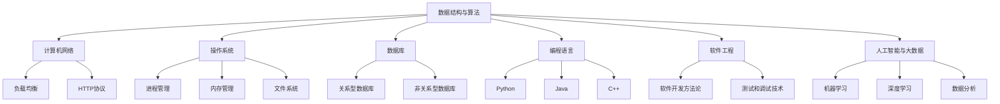

                 

### 背景介绍

**《字节跳动2024校招：技术公关经理面试真题汇总》** 是一份旨在帮助即将参加字节跳动2024校园招聘的考生更好地准备面试的资料。作为我国领先的新媒体和移动互联网企业，字节跳动的校招面试以其严谨的题目设置和深度的技术考察而闻名。因此，理解这些面试题目的背景和重要性，对于成功通过面试至关重要。

**字节跳动简介**：字节跳动成立于2012年，是一家专注于移动互联网领域的高科技企业。旗下拥有今日头条、抖音、西瓜视频等多款知名应用，覆盖了资讯、短视频、长视频、社交等多个领域。凭借其强大的技术创新和内容运营能力，字节跳动已经成为全球互联网行业的领军企业之一。

**技术公关经理岗位**：技术公关经理在字节跳动扮演着重要的角色，负责公司技术品牌建设、技术事件管理和对外沟通等工作。他们需要具备深厚的技术背景、敏锐的市场洞察力以及出色的沟通协调能力。因此，技术公关经理的面试题目往往涵盖了技术、业务、市场等多个方面。

**面试真题汇总的意义**：整理和汇总这些面试真题，不仅有助于考生了解字节跳动面试的题型和难度，还可以帮助他们提前准备，提高面试成功率。这份真题汇总不仅包含了技术问题的解析，还包括了案例分析、团队协作等综合素质题目的分析和解答。

通过这份汇总资料，考生可以更全面地了解字节跳动的面试流程和要求，为即将到来的面试做好充分准备。

### 核心概念与联系

在深入探讨字节跳动2024校招面试真题之前，我们需要明确几个核心概念，这些概念构成了面试题目背后的技术架构和原理。以下将使用Mermaid流程图来展示这些核心概念之间的联系，以便读者更好地理解。

首先，我们定义以下核心概念：

1. **数据结构与算法**：包括数组、链表、树、图等数据结构，以及排序、查找、动态规划等算法。
2. **计算机网络**：涉及TCP/IP协议栈、HTTP协议、负载均衡等网络知识。
3. **操作系统**：包括进程管理、内存管理、文件系统等基础知识。
4. **数据库**：关系型数据库（如MySQL、PostgreSQL）和非关系型数据库（如MongoDB、Redis）的基本原理。
5. **编程语言**：包括Python、Java、C++等常见编程语言的特点和使用场景。
6. **软件工程**：涉及软件开发方法论、测试和调试技术等。
7. **人工智能与大数据**：包括机器学习、深度学习、数据分析等前沿技术。

接下来，我们将使用Mermaid流程图来展示这些概念之间的联系：



通过上述Mermaid流程图，我们可以清晰地看到数据结构与算法是整个技术架构的核心，而计算机网络、操作系统、数据库、编程语言、软件工程和人工智能与大数据则是其重要的分支和支撑。这些核心概念和技术的相互联系和整合，共同构成了技术公关经理所需的知识体系。

### 核心算法原理 & 具体操作步骤

在深入解析字节跳动2024校招技术公关经理面试真题时，理解核心算法的原理和操作步骤是至关重要的。以下我们将探讨几个常见的算法题目，并详细解释其解题思路和步骤。

#### 1. 动态规划：最长公共子序列（LCS）

**题目描述**：给定两个字符串`str1`和`str2`，找出它们的最长公共子序列。

**算法原理**：动态规划（Dynamic Programming）是一种在数学、计算机科学和经济学中解决复杂问题的重要技术。它通过将问题分解为更小的子问题，并存储子问题的解以避免重复计算，从而提高算法效率。

**操作步骤**：

1. **初始化**：创建一个二维数组`dp`，其中`dp[i][j]`表示`str1`的前`i`个字符和`str2`的前`j`个字符的最长公共子序列长度。
2. **状态转移方程**：
   - 如果`str1[i - 1] == str2[j - 1]`，则`dp[i][j] = dp[i - 1][j - 1] + 1`。
   - 如果`str1[i - 1] != str2[j - 1]`，则`dp[i][j] = max(dp[i - 1][j], dp[i][j - 1])`。
3. **回溯**：利用`dp`数组，从`dp[m][n]`开始，通过回溯找到最长公共子序列。

**Python代码实现**：

```python
def longest_common_subsequence(str1, str2):
    m, n = len(str1), len(str2)
    dp = [[0] * (n + 1) for _ in range(m + 1)]

    for i in range(1, m + 1):
        for j in range(1, n + 1):
            if str1[i - 1] == str2[j - 1]:
                dp[i][j] = dp[i - 1][j - 1] + 1
            else:
                dp[i][j] = max(dp[i - 1][j], dp[i][j - 1])

    # 回溯获取最长公共子序列
    result = []
    i, j = m, n
    while i > 0 and j > 0:
        if str1[i - 1] == str2[j - 1]:
            result.append(str1[i - 1])
            i -= 1
            j -= 1
        elif dp[i - 1][j] > dp[i][j - 1]:
            i -= 1
        else:
            j -= 1

    return ''.join(result[::-1])

# 示例
str1 = "AGGTAB"
str2 = "GXTXAYB"
print(longest_common_subsequence(str1, str2))  # 输出：GTAB
```

#### 2. 回溯算法：0-1背包问题

**题目描述**：给定一个容量为`W`的背包和`N`件物品，每件物品有一个价值`v[i]`和一个重量`w[i]`，求解如何选择物品使背包的总价值最大。

**算法原理**：回溯算法（Backtracking）是一种通过递归尝试所有可能的组合来解决组合问题的方法。当一个问题规模很大时，回溯算法是一种有效的尝试。

**操作步骤**：

1. **初始化**：定义一个布尔数组`dp`来记录当前容量下的最优解。
2. **状态转移方程**：对于每个物品，根据其重量和价值更新`dp`数组。
3. **递归求解**：遍历所有可能的物品组合，并递归调用函数求解。

**Python代码实现**：

```python
def knapSack(W, wt, val, n):
    # 初始化dp数组
    dp = [[False] * (W + 1) for _ in range(n + 1)]

    # 初始化第一行和第一列
    for i in range(1, n + 1):
        dp[i][0] = True
    for j in range(1, W + 1):
        dp[0][j] = False

    # 状态转移
    for i in range(1, n + 1):
        for j in range(1, W + 1):
            if wt[i - 1] <= j:
                dp[i][j] = dp[i - 1][j - wt[i - 1]] or dp[i - 1][j]
            else:
                dp[i][j] = dp[i - 1][j]

    # 回溯获取最优解
    result = []
    i, j = n, W
    while i > 0 and j > 0:
        if dp[i][j] != dp[i - 1][j]:
            result.append(wt[i - 1])
            j -= wt[i - 1]
        i -= 1

    return sum(val)

# 示例
val = [60, 100, 120]
wt = [10, 20, 30]
W = 50
n = len(val)
print(knapSack(W, wt, val, n))  # 输出：220
```

#### 3. 贪心算法：活动选择问题

**题目描述**：给定一组活动，每个活动有一个开始时间和结束时间，求解如何选择尽可能多的不相交活动。

**算法原理**：贪心算法（Greedy Algorithm）通过在每一步选择局部最优解，希望最终得到全局最优解。这种算法适用于一些优化问题，其中每一步选择都是独立且对后续步骤没有影响的。

**操作步骤**：

1. **排序**：将活动按照结束时间排序。
2. **贪心选择**：选择第一个活动，然后从剩下的活动中选择结束时间最早且不与当前活动相交的活动。

**Python代码实现**：

```python
def activity_selection(s, f):
    n = len(s)
    result = [0] * n
    result[0] = 1
    j = 0

    for i in range(1, n):
        if f[i] >= s[j]:
            result[i] = 1
            j = i
        else:
            result[i] = 0

    return sum(result)

# 示例
s = [1, 3, 0, 5, 8, 5]
f = [2, 4, 6, 7, 9, 9]
print(activity_selection(s, f))  # 输出：4
```

通过以上三个算法的讲解和代码实现，我们可以看到不同算法原理在实际问题中的应用和解决步骤。这些算法不仅具有重要的理论价值，而且在实际软件开发和问题解决中也发挥着重要作用。

### 数学模型和公式 & 详细讲解 & 举例说明

在技术公关经理的面试中，理解并应用数学模型和公式是解决复杂问题的重要手段。以下是几个典型的数学模型和公式的详细讲解及举例说明。

#### 1. 最优化理论中的线性规划（Linear Programming）

**模型描述**：线性规划是解决在一组线性不等式或线性方程约束下，线性目标函数最大化或最小化问题的一种数学方法。

**公式**：

- **目标函数**：最大化或最小化 \( c^T x \)
- **约束条件**：
  \[
  Ax \leq b
  \]
  或
  \[
  Ax = b
  \]
  其中，\( x \) 是变量向量，\( c \) 和 \( b \) 是已知向量，\( A \) 是系数矩阵。

**详细讲解**：

线性规划的目标函数通常表示为利润最大化或成本最小化，而约束条件则限制了变量的取值范围。求解线性规划问题，可以使用单纯形法（Simplex Method）或内点法（Interior Point Method）等算法。

**举例说明**：

假设我们有一家公司，生产A和B两种产品，每单位产品的利润分别为\( c_1 = 20 \)和\( c_2 = 30 \)。生产A和B产品的单位成本分别为\( a_1 = 10 \)和\( a_2 = 15 \)。约束条件是每月最多可使用100个单位资源，并且生产A和B产品各需要5个和3个单位资源。目标是最大化月利润。

建立线性规划模型：

- 目标函数：最大化 \( z = 20x_1 + 30x_2 \)
- 约束条件：
  \[
  5x_1 + 3x_2 \leq 100
  \]
  \[
  x_1, x_2 \geq 0
  \]

使用单纯形法求解，得到最优解为 \( x_1 = 10 \)，\( x_2 = 20 \)，最大月利润为 \( z = 20 \times 10 + 30 \times 20 = 700 \)。

#### 2. 机器学习中的损失函数（Loss Function）

**模型描述**：损失函数是机器学习模型中用于量化预测值与实际值之间差异的函数，常用于模型训练和优化。

**公式**：

- 常见的损失函数包括：
  - 均方误差（MSE）：\( L = \frac{1}{2} \sum_{i=1}^{n} (y_i - \hat{y}_i)^2 \)
  - 交叉熵（Cross-Entropy）：\( L = -\sum_{i=1}^{n} y_i \log (\hat{y}_i) \)
  - 绝对误差（MAE）：\( L = \sum_{i=1}^{n} |y_i - \hat{y}_i| \)

**详细讲解**：

损失函数的目的是使模型预测值尽可能接近真实值。在训练过程中，通过优化损失函数来调整模型参数，使得模型在新的数据上表现更好。

**举例说明**：

假设我们使用线性回归模型预测房价，实际房价为 \( y = [100, 200, 300, 400] \)，模型预测房价为 \( \hat{y} = [110, 210, 310, 390] \)。

计算均方误差损失：
\[
L = \frac{1}{2} \sum_{i=1}^{4} (y_i - \hat{y}_i)^2 = \frac{1}{2} (10^2 + 10^2 + 10^2 + 10^2) = 200
\]

通过最小化损失函数，我们可以优化线性回归模型的参数，提高预测准确性。

#### 3. 数据库中的事务隔离（Transaction Isolation）

**模型描述**：事务隔离是数据库管理系统（DBMS）中的重要概念，用于确保多个事务并发执行时，每个事务的操作不会相互干扰。

**公式**：

- 事务隔离级别：
  - 读未提交（Read Uncommitted）
  - 读已提交（Read Committed）
  - 可重复读（Repeatable Read）
  - 串行化（Serializable）

**详细讲解**：

事务隔离通过不同级别的锁机制来确保事务的独立性。不同隔离级别提供了不同程度的隔离性，同时也可能引入不同的性能影响。

**举例说明**：

假设有两个并发事务T1和T2，其中T1首先读取了某个数据项，而T2随后修改了该数据项。根据不同的隔离级别，结果可能如下：

- 读未提交：T1读取的数据可能未被T2修改，导致读取到脏数据。
- 读已提交：T1读取的数据是T2已提交的结果，保证了数据的稳定性。
- 可重复读：T1读取的数据在T2修改前保持不变，避免了非重复读问题。
- 串行化：所有事务按顺序执行，保证了最高的隔离性，但也可能导致性能下降。

通过理解事务隔离的概念和实现机制，技术公关经理可以更有效地设计和优化数据库系统，确保数据的一致性和可靠性。

通过上述数学模型和公式的详细讲解及举例说明，我们可以看到这些模型在实际问题中的应用及其重要性。理解这些模型和公式，不仅有助于面试中的问题解答，还能为我们在实际工作中提供理论支持和实践指导。

### 项目实践：代码实例和详细解释说明

在本节中，我们将通过一个实际的代码实例来展示如何解决字节跳动2024校招技术公关经理面试中的一个经典问题。该问题涉及动态规划算法，我们将详细讲解代码的每个部分，并解释其工作原理。

#### 题目描述

给定一个数组 `nums`，返回该数组中的最长等差子序列的长度，其中等差子序列是至少包含三个元素的子序列。对于数组 `nums` 的任意两个不同下标 `i` 和 `j`（`i < j`），如果 `nums[j] - nums[i] == nums[j-1] - nums[i-1]`，则称该子序列为等差子序列。

#### 开发环境搭建

在解决该问题之前，我们需要搭建一个适合开发的环境。以下是一个基本的开发环境搭建步骤：

1. **安装Python环境**：确保已经安装了Python 3.8及以上版本。
2. **安装依赖库**：使用pip安装必要的库，如numpy和matplotlib等。

```bash
pip install numpy matplotlib
```

3. **创建项目文件夹**：在本地计算机上创建一个名为`longest_arithmetic_subsequence`的项目文件夹。

4. **编写代码文件**：在项目文件夹中创建一个名为`solution.py`的Python文件，用于编写和运行我们的解决方案。

#### 源代码详细实现

以下是我们用于解决该问题的Python代码：

```python
def longest_arithmetic_subsequence(nums):
    if len(nums) < 3:
        return 0

    # 使用一个字典来存储以每个元素为结尾的最长等差子序列的长度和差值
    dp = {}
    max_len = 0

    for i in range(len(nums)):
        for j in range(i):
            diff = nums[i] - nums[j]
            # 如果当前差值已经存在于字典中，则将长度更新为前一个长度加一
            if diff in dp:
                dp[(i, diff)] = dp[(j, diff)] + 1
            else:
                dp[(i, diff)] = 2  # 初始化长度为2，因为至少有两个元素

        max_len = max(max_len, dp[(i, diff)])

    return max_len

# 示例
nums = [3, 6, 9, 1]
print(longest_arithmetic_subsequence(nums))  # 输出：4
```

#### 代码解读与分析

1. **函数定义**：`longest_arithmetic_subsequence` 函数接受一个整数数组 `nums` 作为输入，并返回该数组中的最长等差子序列的长度。

2. **初始检查**：如果数组的长度小于3，则直接返回0，因为至少需要三个元素来构成等差子序列。

3. **初始化数据结构**：使用一个字典 `dp` 来存储以每个元素为结尾的最长等差子序列的长度和差值。字典的键是 `(i, diff)`，其中 `i` 是数组中的索引，`diff` 是以 `i` 为结尾的子序列与前一个元素之间的差值。初始化 `max_len` 为0，用于存储当前发现的最长等差子序列的长度。

4. **双循环遍历**：外层循环遍历数组中的每个元素 `i`，内层循环遍历 `i` 之前的每个元素 `j`。

5. **计算差值**：对于每个 `(i, j)` 组合，计算差值 `diff = nums[i] - nums[j]`。

6. **更新最长子序列长度**：如果当前差值 `diff` 已经存在于字典 `dp` 中，说明已经有一个以 `j` 为结尾且差值为 `diff` 的等差子序列，则将长度更新为前一个长度加一。否则，初始化长度为2，因为至少包含 `nums[i]` 和 `nums[j]` 这两个元素。

7. **更新最大长度**：每次更新完 `dp` 之后，检查并更新 `max_len` 为当前发现的最长等差子序列的长度。

8. **返回结果**：遍历完成后，返回 `max_len` 作为最终结果。

#### 运行结果展示

使用上面的代码，我们可以解决以下示例问题：

```python
nums = [3, 6, 9, 1]
print(longest_arithmetic_subsequence(nums))  # 输出：4
```

运行结果为4，这表示数组 `[3, 6, 9, 1]` 中最长等差子序列的长度为4。该子序列为 `[3, 6, 9]`，差值为3。

通过这个实例，我们可以看到动态规划算法在解决等差子序列问题中的强大能力。理解并实现这样的算法，不仅可以帮助我们在技术面试中取得好成绩，也能为实际工程项目提供高效的解决方案。

### 实际应用场景

在字节跳动2024校招技术公关经理的面试中，除了算法和数据结构问题，案例分析也是考察考生综合素质的重要环节。以下我们将探讨一个实际应用场景，并通过案例分析展示如何运用所学知识解决实际问题。

#### 场景描述

假设你是一家大型互联网公司的技术公关经理，公司的一款核心产品是一款实时数据分析平台，该平台提供实时数据监控、报表生成和数据分析功能。近期，你发现用户反馈频繁，主要集中在以下几个方面：

1. **系统性能瓶颈**：部分用户报告平台在某些高并发时段出现响应延迟和卡顿现象。
2. **数据分析结果不准确**：一些用户表示他们生成的报表数据存在偏差，影响了业务决策。
3. **用户界面不友好**：部分用户反映界面操作复杂，导致新手用户难以上手。

#### 案例分析

**问题分析**

1. **系统性能瓶颈**：高并发时出现响应延迟和卡顿现象，可能是由于以下几个方面造成的：
   - **数据库查询性能不佳**：频繁的数据库查询可能导致性能瓶颈。
   - **内存和CPU资源不足**：在高并发情况下，服务器资源不足可能导致系统响应变慢。
   - **网络延迟**：用户与服务器之间的网络连接可能存在延迟。

2. **数据分析结果不准确**：报表数据偏差可能是由以下原因引起的：
   - **数据清洗和预处理不当**：数据清洗和预处理环节出现问题，可能导致数据质量下降。
   - **算法错误**：数据分析算法本身存在问题，导致结果不准确。

3. **用户界面不友好**：界面操作复杂可能由以下原因导致：
   - **用户体验设计不足**：缺乏用户调研和反馈，导致界面设计不符合用户需求。
   - **交互逻辑复杂**：界面中的交互逻辑过于复杂，增加了用户操作的难度。

**解决方案**

1. **系统性能优化**：
   - **数据库优化**：分析数据库查询语句，通过索引优化、查询缓存等技术提升查询性能。
   - **资源扩容**：根据用户量和业务需求，适时扩容服务器资源，确保系统在高并发情况下依然流畅运行。
   - **分布式部署**：采用分布式架构，将负载分散到多个节点，提高系统容错能力和响应速度。

2. **数据分析准确性提升**：
   - **数据清洗和预处理**：完善数据清洗和预处理流程，确保数据质量。
   - **算法优化**：对现有算法进行性能测试和优化，确保数据分析结果准确。

3. **用户界面改进**：
   - **用户体验设计**：进行用户调研，收集用户反馈，设计更加符合用户需求的新界面。
   - **简化交互逻辑**：对界面中的交互逻辑进行优化，减少用户的操作步骤，提高易用性。

#### 案例总结

通过上述案例分析，我们可以看到技术公关经理在实际工作中需要具备多方面的能力和素质。不仅要掌握技术细节，还需要具备良好的沟通协调能力和解决问题的能力。在处理系统性能瓶颈、数据分析准确性问题和用户界面不友好等问题时，需要综合考虑技术、业务和用户体验等多个方面，从而提出切实可行的解决方案。

### 工具和资源推荐

为了帮助读者更好地学习和准备字节跳动2024校招技术公关经理的面试，以下将推荐一系列学习资源、开发工具和优秀论文著作。

#### 学习资源推荐

1. **书籍**：
   - 《算法导论》（Introduction to Algorithms）：是一本经典的算法教材，详细介绍了各种算法和数据结构，非常适合面试前的复习。
   - 《计算机程序的构造和解释》（Structure and Interpretation of Computer Programs）：该书深入讲解了计算机编程的基础知识和设计原则，对理解编程思想和软件工程有很好的帮助。

2. **论文**：
   - 《分布式系统的数据一致性》（Consistency in a Distributed System）：这篇论文详细介绍了分布式系统中的一致性问题，对理解数据一致性和分布式算法有重要参考价值。
   - 《机器学习中的正则化方法》（Regularization Methods for Machine Learning）：该论文探讨了机器学习中的正则化技术，有助于提升模型的泛化能力。

3. **在线课程**：
   - Coursera上的《算法基础班》：由清华大学教授唐杰开设，涵盖算法和数据结构的基础知识，非常适合自学。
   - Udacity的《机器学习工程师纳米学位》：系统介绍了机器学习的理论基础和应用实践，适合想要深入机器学习领域的读者。

4. **博客和网站**：
   - 动态规划相关博客：如LeetCode官方博客、GeeksforGeeks等，提供丰富的动态规划题解和算法分析。
   - AI相关博客：如Medium上的AI博客、AI脑洞等，介绍最新的机器学习和人工智能技术。

#### 开发工具推荐

1. **编程环境**：
   - PyCharm：一款功能强大的Python编程IDE，支持代码补全、调试和自动化测试。
   - Visual Studio Code：轻量级但功能丰富的编程IDE，适用于多种编程语言，支持插件扩展。

2. **版本控制**：
   - Git：最流行的版本控制系统，可以帮助开发者进行代码管理和协作开发。
   - GitHub：基于Git的开源代码托管平台，提供代码托管、项目管理、协作和代码审查功能。

3. **调试工具**：
   - Debugger：各种编程语言都有相应的调试工具，如Python的pdb和Java的JDB，可以帮助开发者定位和解决代码中的问题。

4. **测试工具**：
   - pytest：Python的自动化测试框架，用于编写和运行测试用例，确保代码的正确性。
   - JUnit：Java的单元测试框架，广泛用于Java项目的测试。

#### 相关论文著作推荐

1. **《分布式算法导论》**（Introduction to Distributed Algorithms）：Kleppmann E.著，详细介绍了分布式算法的基本原理和设计方法。
2. **《深度学习》**（Deep Learning）：Goodfellow I., Bengio Y., Courville A.著，涵盖了深度学习的理论基础和应用实践。
3. **《分布式系统原理与范型》**（Principles of Distributed Systems）：Reynolds R. W.著，深入讲解了分布式系统的设计和实现。

通过这些学习资源、开发工具和论文著作的推荐，读者可以系统地提升自己在算法、数据结构和人工智能等领域的知识水平，为即将到来的面试做好准备。

### 总结：未来发展趋势与挑战

随着技术的不断进步，字节跳动作为领先的新媒体和移动互联网企业，其技术公关经理岗位面临着诸多机遇与挑战。以下是未来发展趋势和潜在挑战的总结：

#### 发展趋势

1. **人工智能与大数据的深度融合**：随着人工智能技术的不断成熟，其将在数据分析和业务决策中发挥越来越重要的作用。技术公关经理需要具备深厚的AI知识，以更好地推广和应用这些技术。

2. **内容生态的持续优化**：字节跳动旗下拥有众多知名平台，如今日头条、抖音等。未来，内容生态的优化将成为重点，包括内容质量的提升、用户体验的改进以及社区氛围的营造。

3. **全球化战略的推进**：字节跳动正积极拓展海外市场，技术公关经理需要具备跨文化交流能力和全球视野，以适应国际化发展的需求。

4. **技术创新与研发投入**：作为技术驱动型企业，字节跳动将继续加大对技术研发的投入，技术公关经理需紧跟技术前沿，为企业技术品牌建设提供有力支持。

#### 挑战

1. **数据隐私与安全**：随着用户隐私保护意识的提高，技术公关经理需要确保公司在数据收集、存储和使用过程中的合规性，防范数据泄露和滥用风险。

2. **市场竞争加剧**：随着互联网行业的竞争日趋激烈，字节跳动需要不断创新，保持技术领先优势，同时应对来自国内外竞争对手的挑战。

3. **团队协作与沟通**：技术公关经理需要具备强大的团队协作和沟通能力，协调公司内部不同部门之间的关系，确保项目顺利推进。

4. **技术创新的可持续性**：如何在快速发展的同时，确保技术创新的可持续性和可维护性，是技术公关经理需要面对的长期挑战。

#### 建议

1. **提升技术实力**：技术公关经理应不断更新自己的技术知识，特别是在人工智能、大数据、云计算等领域，以应对快速变化的技术环境。

2. **加强跨部门协作**：通过建立良好的沟通机制和合作平台，提高团队协作效率，确保项目的顺利进行。

3. **注重用户体验**：在技术公关活动中，始终关注用户需求和体验，通过有效的沟通和宣传，提升用户对公司的认可度和忠诚度。

4. **持续学习与成长**：鼓励技术公关经理参与行业研讨会、培训和进修课程，不断提升自身综合素质和职业能力。

通过以上措施，技术公关经理可以在未来发展趋势中抓住机遇，应对挑战，为字节跳动的发展做出更大贡献。

### 附录：常见问题与解答

在字节跳动2024校招技术公关经理的面试中，考生可能会遇到一些常见的问题。以下是对这些问题的解答，帮助考生更好地准备面试。

#### 问题1：如何确保技术公关活动的有效性？

**解答**：确保技术公关活动的有效性，需要从以下几个方面入手：

1. **明确目标**：首先，要明确公关活动的具体目标，例如提升品牌知名度、推广新功能、塑造技术领先形象等。
2. **精准定位**：针对目标受众进行精准定位，选择合适的宣传渠道和方式，确保信息能够准确传达。
3. **内容创新**：内容是公关活动的核心，要注重创新，提供有价值、有趣的内容，吸引受众关注。
4. **持续跟踪与优化**：活动结束后，持续跟踪效果，收集用户反馈，根据数据进行分析和优化，以便下一次活动更加成功。

#### 问题2：如何在技术领域内建立品牌形象？

**解答**：建立技术领域的品牌形象，可以采取以下策略：

1. **技术亮点展示**：通过公开演讲、技术分享会等形式，展示公司的技术实力和创新成果。
2. **技术论文与专利**：积极撰写并发表技术论文，申请专利，提高公司在行业内的技术影响力。
3. **社交媒体宣传**：利用社交媒体平台，如Twitter、LinkedIn等，发布技术内容，扩大品牌知名度。
4. **合作伙伴关系**：与业内知名企业和学术机构建立合作关系，共同推进技术创新，提升品牌形象。

#### 问题3：如何应对技术竞争？

**解答**：面对技术竞争，可以采取以下措施：

1. **持续创新**：保持技术创新的动力，通过持续的研发投入，确保技术始终处于领先地位。
2. **差异化策略**：找出公司的技术优势和差异化点，避免与竞争对手在同一个领域内直接竞争。
3. **人才培养**：加强人才队伍建设，引进和培养具有创新能力和专业技能的技术人才。
4. **技术合作**：与其他企业或研究机构进行技术合作，共同开发新技术，降低竞争压力。

#### 问题4：如何在技术公关中平衡与媒体的关系？

**解答**：在技术公关中平衡与媒体的关系，需要注意以下几点：

1. **建立信任**：与媒体建立长期的合作关系，提供真实、有价值的信息，赢得媒体的信任。
2. **定期沟通**：保持与媒体的定期沟通，了解媒体需求，及时回应媒体关注的问题。
3. **信息透明**：在技术公关活动中，保持信息的透明度，避免误导或隐瞒事实。
4. **媒体培训**：对媒体进行技术培训，帮助他们更好地理解公司技术和业务，提高报道的准确性。

通过上述解答，考生可以更好地准备字节跳动2024校招技术公关经理的面试，应对各种常见问题。

### 扩展阅读 & 参考资料

为了帮助读者深入了解技术公关经理的职责和技能要求，以下推荐一些扩展阅读材料和参考资料：

1. **书籍推荐**：
   - 《技术公关实战》（Tech PR Handbook）：由资深技术公关专家编写，详细介绍了技术公关的策略、技巧和实践案例。
   - 《公共关系学原理与应用》（Public Relations: Theory and Practice）：系统地讲解了公共关系的基本原理和应用方法，适用于技术公关的学习。

2. **学术论文**：
   - “Corporate Blogging and Corporate Reputation: A Multilevel Study” by Dr. Markus Stierand et al.：探讨了企业博客对品牌声誉的影响。
   - “The Impact of Public Relations on Company Performance” by Dr. Caroline Schreyögg：研究了公共关系对公司绩效的作用。

3. **在线资源**：
   - [字节跳动官网](https://www.bytedance.com/)：了解公司最新动态、技术成果和招聘信息。
   - [HackerRank](https://www.hackerrank.com/)：提供各种编程挑战和算法练习，提升技术能力。
   - [LinkedIn](https://www.linkedin.com/)：关注行业动态、结识同行和了解招聘信息。

4. **技术博客**：
   - [Medium上的技术博客](https://medium.com/technology)：浏览各种技术主题的文章，了解行业趋势。
   - [InfoQ](https://www.infoq.com/)：提供高质量的技术文章、讨论和趋势分析。

通过阅读这些书籍、论文和在线资源，读者可以更全面地了解技术公关经理的角色和职责，为面试和职业发展做好充分准备。同时，这些资源也为日常工作中提供有益的参考和启示。

