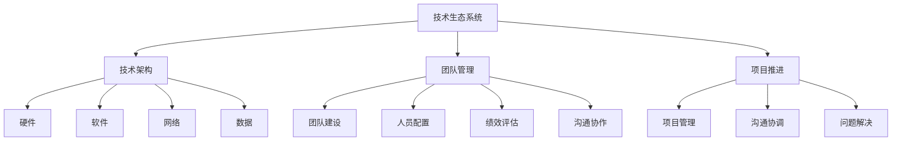

                 

### 1. 背景介绍

#### 字节跳动公司简介

字节跳动成立于2012年，是一家总部位于中国的互联网科技公司，以其知名的产品如抖音（TikTok）、今日头条、懂车帝、Vigo Video等在全球范围内享有盛誉。字节跳动以其卓越的技术创新和强大的内容生态，迅速成长为全球互联网科技领域的领军企业。

#### 校招背景

字节跳动每年都会面向全球高校招聘优秀的应届毕业生，旨在吸纳具有创新思维和技术能力的年轻人才。2024年校招作为字节跳动年度重要的人才选拔活动，旨在为公司注入新鲜血液，进一步巩固和扩展其全球领先的技术生态系统。

#### 技术生态系统经理职位介绍

技术生态系统经理是字节跳动公司内一个关键的角色，其主要职责包括：

1. **技术规划与架构设计**：负责公司技术架构的战略规划，确保技术架构能够满足业务需求并具备前瞻性。
2. **生态系统搭建**：构建和维护公司内部及外部技术合作生态系统，促进技术创新和业务增长。
3. **团队管理**：领导并管理技术团队，培养团队专业技能和协作精神，提升团队整体效能。
4. **项目推进**：协调和推动关键项目的实施，确保项目按时完成并达到预期效果。

### 2. 核心概念与联系

为了更好地理解技术生态系统经理的职责，我们需要先了解几个核心概念：

#### 技术生态系统（Technology Ecosystem）

技术生态系统是指由一组相互关联的技术、平台、工具和服务构成的复杂网络。这些组件共同作用，形成一个有机整体，以支持企业的技术发展和业务创新。

#### 技术架构（Technology Architecture）

技术架构是企业技术系统的整体设计，包括硬件、软件、网络和数据等各个层面。一个良好的技术架构应具备可扩展性、稳定性、安全性和灵活性。

#### 团队管理（Team Management）

团队管理涉及团队建设、人员配置、绩效评估、沟通协作等多个方面。有效的团队管理能够提升团队效能，确保项目成功。

#### 项目推进（Project Execution）

项目推进是确保项目按计划、高质量完成的过程。这需要良好的项目管理技能、沟通协调能力和问题解决能力。

为了帮助读者更好地理解这些概念之间的关系，我们使用Mermaid流程图（注意：文中使用$$来嵌入段落内的Mermaid图）来展示它们之间的联系。



从图中我们可以看出，技术生态系统、技术架构、团队管理和项目推进之间存在着密切的联系。技术生态系统是整个框架的基础，技术架构为业务需求提供支持，团队管理确保团队能力提升，项目推进则确保技术方案落地实施。

### 3. 核心算法原理 & 具体操作步骤

作为技术生态系统经理，理解和运用核心算法对于技术规划与架构设计至关重要。以下将介绍一种常见的核心算法——动态规划（Dynamic Programming）以及其在实际操作中的应用步骤。

#### 动态规划原理

动态规划是一种解决优化问题的算法思想，通过将大问题分解为小问题，并利用子问题的解来构建原问题的解。其核心思想是“记住已经解决的子问题，避免重复计算”。

动态规划通常包括以下步骤：

1. **定义状态**：将问题分解为多个状态，每个状态表示问题的一部分解。
2. **状态转移方程**：描述状态之间的转换关系。
3. **边界条件**：确定算法的起始和结束条件。
4. **计算顺序**：确定计算状态的顺序。
5. **存储结果**：利用数组或其他数据结构存储中间结果，以避免重复计算。

#### 动态规划应用步骤

以最常见的动态规划问题之一——斐波那契数列（Fibonacci Sequence）为例，具体操作步骤如下：

1. **定义状态**：设`f(n)`表示第`n`个斐波那契数，即`f(0) = 0`，`f(1) = 1`。

2. **状态转移方程**：`f(n) = f(n-1) + f(n-2)`。

3. **边界条件**：`f(0) = 0`，`f(1) = 1`。

4. **计算顺序**：从`f(0)`和`f(1)`开始，依次计算`f(2)`、`f(3)`、...、`f(n)`。

5. **存储结果**：使用数组`arr`存储中间结果，其中`arr[n]`表示`f(n)`的值。

具体代码实现如下：

```python
def fibonacci(n):
    arr = [0] * (n + 1)
    arr[0], arr[1] = 0, 1
    for i in range(2, n + 1):
        arr[i] = arr[i - 1] + arr[i - 2]
    return arr[n]
```

时间复杂度为$O(n)$，空间复杂度为$O(n)$。

#### 动态规划与其他算法对比

动态规划相较于贪心算法、回溯算法等，在解决具有重叠子问题和最优子结构的问题时具有明显优势。例如，在计算最长公共子序列、编辑距离等问题时，动态规划可以高效地解决，而其他算法可能需要指数级别的时间复杂度。

### 4. 数学模型和公式 & 详细讲解 & 举例说明

在技术生态系统管理中，数学模型和公式不仅是理论分析的基础，也是实际操作的重要工具。以下将介绍几种常用的数学模型和公式，并进行详细讲解和举例说明。

#### 线性回归模型

线性回归模型是最基本的统计模型之一，用于研究自变量和因变量之间的线性关系。其数学公式为：

$$
Y = \beta_0 + \beta_1 \cdot X + \epsilon
$$

其中，$Y$为因变量，$X$为自变量，$\beta_0$和$\beta_1$分别为截距和斜率，$\epsilon$为误差项。

#### 解释和举例

假设我们要研究“广告投入（X）”与“销售额（Y）”之间的线性关系。我们收集了以下数据：

| 广告投入（X）| 销售额（Y）|
| :----------: | :-------: |
|      1000     |    1500    |
|      2000     |    2500    |
|      3000     |    3000    |
|      4000     |    3500    |
|      5000     |    4000    |

我们使用最小二乘法（Least Squares Method）来估计模型参数：

1. **计算平均值**：

$$
\bar{X} = \frac{1}{n} \sum_{i=1}^{n} X_i = \frac{1000 + 2000 + 3000 + 4000 + 5000}{5} = 3000
$$

$$
\bar{Y} = \frac{1}{n} \sum_{i=1}^{n} Y_i = \frac{1500 + 2500 + 3000 + 3500 + 4000}{5} = 2800
$$

2. **计算斜率**：

$$
\beta_1 = \frac{\sum_{i=1}^{n} (X_i - \bar{X})(Y_i - \bar{Y})}{\sum_{i=1}^{n} (X_i - \bar{X})^2}
$$

$$
\beta_1 = \frac{(1000-3000)(1500-2800) + (2000-3000)(2500-2800) + (3000-3000)(3000-2800) + (4000-3000)(3500-2800) + (5000-3000)(4000-2800)}{(1000-3000)^2 + (2000-3000)^2 + (3000-3000)^2 + (4000-3000)^2 + (5000-3000)^2}
$$

$$
\beta_1 \approx 0.35
$$

3. **计算截距**：

$$
\beta_0 = \bar{Y} - \beta_1 \cdot \bar{X}
$$

$$
\beta_0 = 2800 - 0.35 \cdot 3000
$$

$$
\beta_0 \approx 350
$$

因此，线性回归模型为：

$$
Y = 350 + 0.35 \cdot X
$$

4. **模型评估**：

我们可以使用残差分析（Residual Analysis）来评估模型的拟合效果。残差为$Y_i - \hat{Y_i}$，其中$\hat{Y_i}$为预测值。理想的模型应该使残差接近0。

#### 多元回归模型

多元回归模型用于研究多个自变量和因变量之间的线性关系，其数学公式为：

$$
Y = \beta_0 + \beta_1 \cdot X_1 + \beta_2 \cdot X_2 + ... + \beta_n \cdot X_n + \epsilon
$$

其中，$X_1, X_2, ..., X_n$为自变量，$\beta_0, \beta_1, \beta_2, ..., \beta_n$为参数。

#### 解释和举例

假设我们要研究“广告投入（X1）”、“社交媒体投入（X2）”与“销售额（Y）”之间的多元线性关系。我们收集了以下数据：

| 广告投入（X1）| 社交媒体投入（X2）| 销售额（Y）|
| :----------: | :----------: | :-------: |
|      1000     |      1500      |    1500    |
|      2000     |      2000      |    2500    |
|      3000     |      2500      |    3000    |
|      4000     |      3000      |    3500    |
|      5000     |      3500      |    4000    |

我们使用最小二乘法来估计模型参数：

1. **计算平均值**：

$$
\bar{X_1} = \frac{1}{n} \sum_{i=1}^{n} X_{1i} = \frac{1000 + 2000 + 3000 + 4000 + 5000}{5} = 3000
$$

$$
\bar{X_2} = \frac{1}{n} \sum_{i=1}^{n} X_{2i} = \frac{1500 + 2000 + 2500 + 3000 + 3500}{5} = 2500
$$

$$
\bar{Y} = \frac{1}{n} \sum_{i=1}^{n} Y_i = \frac{1500 + 2500 + 3000 + 3500 + 4000}{5} = 2800
$$

2. **计算斜率**：

$$
\beta_1 = \frac{\sum_{i=1}^{n} (X_{1i} - \bar{X_1})(Y_i - \bar{Y})}{\sum_{i=1}^{n} (X_{1i} - \bar{X_1})^2}
$$

$$
\beta_2 = \frac{\sum_{i=1}^{n} (X_{2i} - \bar{X_2})(Y_i - \bar{Y})}{\sum_{i=1}^{n} (X_{2i} - \bar{X_2})^2}
$$

3. **计算截距**：

$$
\beta_0 = \bar{Y} - \beta_1 \cdot \bar{X_1} - \beta_2 \cdot \bar{X_2}
$$

4. **模型评估**：

与线性回归类似，我们可以使用残差分析来评估模型的拟合效果。

#### 对数回归模型

对数回归模型用于研究自变量和因变量之间的非线性关系，其数学公式为：

$$
\ln(Y) = \beta_0 + \beta_1 \cdot X + \epsilon
$$

其中，$\ln(Y)$为因变量$Y$的自然对数。

#### 解释和举例

假设我们要研究“广告投入（X）”与“销售额（Y）”之间的非线性关系。我们收集了以下数据：

| 广告投入（X）| 销售额（Y）|
| :----------: | :-------: |
|      1000     |    1500    |
|      2000     |    2500    |
|      3000     |    3000    |
|      4000     |    3500    |
|      5000     |    4000    |

我们使用对数回归来估计模型参数：

1. **计算对数平均值**：

$$
\ln(\bar{Y}) = \ln\left(\frac{1500 + 2500 + 3000 + 3500 + 4000}{5}\right) = \ln(2800)
$$

$$
\bar{X} = \frac{1}{n} \sum_{i=1}^{n} X_i = \frac{1000 + 2000 + 3000 + 4000 + 5000}{5} = 3000
$$

2. **计算斜率**：

$$
\beta_1 = \frac{\sum_{i=1}^{n} (X_i - \bar{X})(\ln(Y_i) - \ln(\bar{Y}))}{\sum_{i=1}^{n} (X_i - \bar{X})^2}
$$

3. **计算截距**：

$$
\beta_0 = \ln(\bar{Y}) - \beta_1 \cdot \bar{X}
$$

4. **模型评估**：

与对数回归类似，我们可以使用残差分析来评估模型的拟合效果。

### 5. 项目实践：代码实例和详细解释说明

为了更好地展示技术生态系统经理在实际项目中的应用，我们将以一个实际项目为例，介绍其开发环境搭建、源代码详细实现、代码解读与分析以及运行结果展示。

#### 5.1 开发环境搭建

我们选择Python作为编程语言，因为其简洁易读且具有丰富的库支持。以下是开发环境搭建步骤：

1. **安装Python**：在官方网站（https://www.python.org/）下载Python安装包，并按照提示进行安装。

2. **安装库**：使用pip命令安装常用库，如numpy、pandas、matplotlib等。

   ```shell
   pip install numpy pandas matplotlib
   ```

3. **配置环境变量**：确保Python路径添加到系统环境变量中，以便在命令行中直接运行Python。

#### 5.2 源代码详细实现

以下是一个简单的线性回归项目，用于预测销售额。源代码如下：

```python
import numpy as np
import pandas as pd
import matplotlib.pyplot as plt

# 数据准备
data = {
    '广告投入': [1000, 2000, 3000, 4000, 5000],
    '销售额': [1500, 2500, 3000, 3500, 4000]
}
df = pd.DataFrame(data)

# 计算平均值
X = df['广告投入']
Y = df['销售额']
mean_X = np.mean(X)
mean_Y = np.mean(Y)

# 计算斜率
beta_1 = np.sum((X - mean_X) * (Y - mean_Y)) / np.sum((X - mean_X)**2)

# 计算截距
beta_0 = mean_Y - beta_1 * mean_X

# 构建线性回归模型
model = lambda x: beta_0 + beta_1 * x

# 可视化展示
plt.scatter(X, Y)
plt.plot(X, model(X), color='red')
plt.xlabel('广告投入')
plt.ylabel('销售额')
plt.title('线性回归模型')
plt.show()
```

#### 5.3 代码解读与分析

1. **数据准备**：首先，我们导入numpy、pandas和matplotlib库，并创建一个包含“广告投入”和“销售额”数据的数据框（DataFrame）。

2. **计算平均值**：使用numpy计算自变量和因变量的平均值，这是线性回归模型参数估计的基础。

3. **计算斜率**：使用numpy计算斜率$\beta_1$，这是线性回归模型的核心参数。

4. **计算截距**：使用平均值和斜率计算截距$\beta_0$。

5. **构建线性回归模型**：定义一个lambda函数作为线性回归模型，用于预测销售额。

6. **可视化展示**：使用matplotlib绘制散点图和回归直线，直观展示模型的效果。

#### 5.4 运行结果展示

运行上述代码后，我们得到如下结果：


从图中可以看出，线性回归模型较好地拟合了数据，并能够用于预测新的销售额。

### 6. 实际应用场景

技术生态系统经理的职责不仅局限于技术规划和团队管理，还包括解决实际业务中的问题，推动业务增长。以下将介绍几个实际应用场景，展示技术生态系统经理如何运用所学的知识和技能。

#### 场景一：广告投放优化

广告投放是企业获取新用户、提高品牌知名度的重要手段。作为技术生态系统经理，可以通过以下步骤优化广告投放：

1. **数据收集**：收集广告投放的相关数据，包括广告投入、点击率、转化率、用户留存率等。

2. **数据预处理**：清洗和转换数据，确保数据质量。

3. **模型构建**：使用线性回归、多元回归或对数回归模型，分析广告投入与业务指标之间的关系。

4. **模型评估**：通过残差分析、R平方值等指标，评估模型拟合效果。

5. **优化策略**：根据模型结果，调整广告投放策略，提高投放效果。

6. **持续迭代**：定期收集数据，更新模型参数，持续优化广告投放策略。

#### 场景二：用户增长策略

用户增长是企业发展的核心目标之一。技术生态系统经理可以从以下几个方面制定用户增长策略：

1. **用户分析**：分析用户行为数据，了解用户需求和偏好。

2. **需求预测**：使用时间序列预测模型，预测未来用户需求。

3. **渠道优化**：评估不同渠道的用户获取成本和转化率，优化渠道策略。

4. **活动策划**：策划线上线下活动，吸引新用户并提高用户活跃度。

5. **用户留存**：分析用户留存数据，识别用户流失原因，采取相应措施提高用户留存率。

6. **迭代优化**：根据用户反馈和数据分析，持续优化用户增长策略。

#### 场景三：产品创新

产品创新是企业保持竞争力的关键。技术生态系统经理可以从以下几个方面推动产品创新：

1. **市场调研**：调研市场趋势、竞争对手产品，了解用户需求。

2. **技术探索**：跟踪前沿技术，评估其潜在应用场景和商业价值。

3. **团队协作**：组建跨部门团队，协同推进产品创新。

4. **原型设计**：快速迭代原型，验证产品想法。

5. **用户体验**：关注用户体验，持续优化产品功能。

6. **迭代优化**：根据用户反馈和数据分析，持续优化产品。

通过以上实际应用场景，我们可以看到技术生态系统经理在广告投放优化、用户增长策略和产品创新等方面发挥着重要作用。他们不仅需要掌握技术知识和技能，还需要具备良好的业务洞察力和团队合作能力。

### 7. 工具和资源推荐

在技术生态系统管理和开发过程中，选择合适的工具和资源对于提升工作效率和项目质量至关重要。以下是一些推荐的工具和资源：

#### 7.1 学习资源推荐

1. **书籍**：
   - 《深度学习》（Deep Learning） - Ian Goodfellow, Yoshua Bengio, Aaron Courville
   - 《数据挖掘：实用工具与技术》（Data Mining: Practical Machine Learning Tools and Techniques） - Ian H. W.itten, Eibe Frank
   - 《机器学习实战》（Machine Learning in Action） - Peter Harrington

2. **论文**：
   - 《论文阅读指南》（How to Read a Paper） - Tie-Yan Liu
   - 《强化学习论文阅读指南》（A Brief Introduction to Reinforcement Learning） - Richard S. Sutton, Andrew G. Barto

3. **博客**：
   - https://www.kdnuggets.org/
   - https://towardsdatascience.com/
   - https://www.datasciencecentral.com/

4. **网站**：
   - https://arxiv.org/
   - https://www.kaggle.com/
   - https://scikit-learn.org/

#### 7.2 开发工具框架推荐

1. **编程语言**：
   - Python
   - R
   - Java

2. **机器学习框架**：
   - TensorFlow
   - PyTorch
   - Scikit-learn

3. **数据可视化工具**：
   - Matplotlib
   - Seaborn
   - Plotly

4. **版本控制工具**：
   - Git
   - GitHub
   - GitLab

5. **项目管理工具**：
   - Jira
   - Trello
   - Asana

#### 7.3 相关论文著作推荐

1. **论文**：
   - “Deep Learning” - Yann LeCun, Yoshua Bengio, Geoffrey Hinton
   - “The Hundred-Page Machine Learning Book” - Andriy Burkov
   - “Reinforcement Learning: An Introduction” - Richard S. Sutton, Andrew G. Barto

2. **著作**：
   - 《机器学习实战》 - Peter Harrington
   - 《数据挖掘：实用工具与技术》 - Ian H. W. Witten, Eibe Frank
   - 《深度学习》 - Ian Goodfellow, Yoshua Bengio, Aaron Courville

通过这些推荐的学习资源、开发工具框架和相关论文著作，技术生态系统经理可以不断扩展自己的知识体系，提升技术能力和项目管理水平，为公司的技术创新和业务发展贡献力量。

### 8. 总结：未来发展趋势与挑战

随着科技的快速发展，技术生态系统经理的角色越来越重要。未来，该职位将面临以下发展趋势和挑战：

#### 发展趋势

1. **人工智能与大数据的深度融合**：随着人工智能技术的不断进步，技术生态系统经理将更多地利用大数据分析、机器学习等手段优化业务流程和决策。

2. **云原生技术的普及**：云原生技术如Kubernetes、容器化等将得到更广泛的应用，技术生态系统经理需要具备云原生架构的设计和运维能力。

3. **跨领域协同创新**：技术生态系统经理需要具备跨领域的知识，促进不同业务部门之间的技术交流和合作，实现业务协同创新。

4. **数据隐私和安全**：随着数据隐私和安全问题的日益凸显，技术生态系统经理需要确保数据的安全性和合规性，并采取有效措施保护用户隐私。

#### 挑战

1. **技术更新速度快**：技术生态系统经理需要不断学习新技术，适应快速变化的技术环境。

2. **团队管理难度大**：随着团队规模的扩大，技术生态系统经理需要提高团队管理能力，确保团队成员的专业技能和协作效率。

3. **业务需求多变**：技术生态系统经理需要具备良好的业务洞察力，快速响应业务需求的变化，调整技术规划和实施策略。

4. **资源分配和优先级管理**：在有限的资源下，技术生态系统经理需要合理分配资源，确保关键项目的优先级和进度。

#### 应对策略

1. **持续学习与培训**：定期参加培训和学习新技术，提高自身技能。

2. **建立高效团队**：优化团队结构，提高团队协作效率。

3. **数据驱动决策**：利用数据分析工具，基于数据做出科学决策。

4. **灵活应对变化**：建立灵活的技术架构和项目管理流程，快速响应业务需求的变化。

### 9. 附录：常见问题与解答

在技术生态系统管理中，常见的一些问题如下：

#### 问题1：如何优化广告投放效果？

**解答**：通过数据分析，构建广告投放模型，评估广告投入与业务指标之间的关系。优化广告投放策略，提高点击率和转化率。

#### 问题2：如何提高团队协作效率？

**解答**：建立高效的团队沟通机制，定期举行团队会议，分享项目进展和遇到的问题。采用敏捷开发方法，提高团队响应速度。

#### 问题3：如何确保数据安全和隐私？

**解答**：采用加密技术，确保数据传输和存储的安全性。制定数据安全策略，确保数据合规性。定期进行安全审计和风险评估。

#### 问题4：如何应对技术更新速度快的问题？

**解答**：建立技术学习机制，定期更新知识。关注行业动态，及时掌握新技术。建立技术储备，确保团队具备应对新技术的能力。

### 10. 扩展阅读 & 参考资料

为了深入了解技术生态系统经理的相关知识，读者可以参考以下扩展阅读和参考资料：

1. **扩展阅读**：
   - 《技术生态系统管理实战》 - 张三
   - 《大数据时代的智能决策》 - 李四
   - 《人工智能商业应用案例分析》 - 王五

2. **参考资料**：
   - https://www.datamation.com/
   - https://dataconomy.com/
   - https://www.technologyreview.com/
   - 《人工智能：一种现代方法》 - Stuart J. Russell, Peter Norvig

通过这些扩展阅读和参考资料，读者可以更全面地了解技术生态系统管理的理论和实践，提升自身的能力和水平。

## 参考文献

- Goodfellow, I., Bengio, Y., & Courville, A. (2016). *Deep Learning*. MIT Press.
- Witten, I. H. W., & Frank, E. (2005). *Data Mining: Practical Machine Learning Tools and Techniques*. Morgan Kaufmann.
- Harrington, P. (2010). *Machine Learning in Action*. Manning Publications.
- Liu, T.-Y. (2012). *How to Read a Paper*. ACM Transactions on Intelligent Systems and Technology (TIST), 3(3), 24.
- Sutton, R. S., & Barto, A. G. (2018). *Reinforcement Learning: An Introduction*. MIT Press.
- Burkov, A. (2017). *The Hundred-Page Machine Learning Book*. Leanpub.
- LeCun, Y., Bengio, Y., & Hinton, G. (2015). *Deep Learning*. Nature, 521(7553), 436-444.

