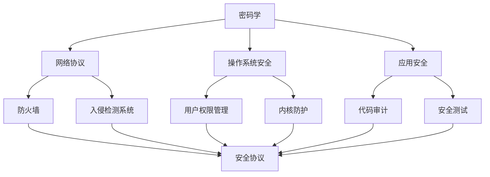

                 

### 背景介绍

#### 字节跳动网络安全岗位的重要性

在当前信息化时代，网络安全已经成为企业和个人不可忽视的重要问题。随着互联网的飞速发展，数据泄露、黑客攻击、恶意软件等安全威胁层出不穷，给企业和用户带来了巨大的损失。在这个背景下，网络安全岗位的重要性愈发凸显。

字节跳动作为我国知名的互联网科技公司，其业务涵盖了短视频、新闻资讯、社交媒体等多个领域。这些业务的繁荣发展离不开强大的网络安全保障。因此，字节跳动对网络安全岗位的需求量持续增加，网络安全成为了字节跳动招聘的重要岗位之一。

#### 校招面试真题的重要性

校招是许多应届毕业生进入心仪公司的重要途径，而面试真题则是考生了解公司面试风格和考查重点的重要资料。通过对历年校招面试真题的总结和分析，可以更好地准备面试，提高面试成功率。

本文将针对字节跳动2024校招网络安全岗位的面试真题进行详细解析，帮助考生了解面试内容，掌握解题技巧。同时，通过对真题的分析，我们也可以深入了解网络安全领域的核心知识和技术，为今后的学习和职业发展奠定基础。

### 核心概念与联系

在深入分析字节跳动2024校招网络安全岗位面试真题之前，我们先来了解一些核心概念及其之间的联系。网络安全涉及的领域非常广泛，包括密码学、网络协议、操作系统安全、应用安全等多个方面。以下是一些关键概念及其简要说明：

#### 1. 密码学

密码学是网络安全的基础，主要研究如何通过加密和解密技术保护信息的安全性。常见的加密算法包括对称加密（如AES、DES）、非对称加密（如RSA、ECC）和哈希算法（如SHA-256、MD5）。

#### 2. 网络协议

网络协议是计算机网络通信的基础，规定了数据传输的格式、规则和流程。常见的网络协议包括TCP/IP、HTTP、HTTPS等。

#### 3. 操作系统安全

操作系统安全是保护计算机系统不受恶意攻击和侵害的关键。主要涉及用户权限管理、内核防护、恶意软件检测等方面。

#### 4. 应用安全

应用安全是指针对各类应用软件进行安全设计和开发，以防止安全漏洞和攻击。主要涉及代码审计、安全编码、安全测试等方面。

#### 5. 防火墙和入侵检测系统

防火墙和入侵检测系统是网络安全防护的重要手段。防火墙通过控制网络流量实现安全防护，入侵检测系统则通过监测网络流量和系统行为发现潜在的安全威胁。

#### 6. 安全漏洞

安全漏洞是网络安全领域的关键概念，指的是系统或应用中存在的可以被攻击者利用的漏洞。常见的漏洞类型包括缓冲区溢出、SQL注入、XSS攻击等。

#### 7. 安全协议

安全协议是在网络通信中保证数据安全的一种机制，如TLS/SSL、IPsec等。这些协议通过加密、认证等技术确保数据传输的保密性、完整性和真实性。

#### Mermaid 流程图

以下是一个简单的Mermaid流程图，展示了上述核心概念之间的联系：



通过这个流程图，我们可以清晰地看到各个核心概念之间的相互关系，为后续对面试题的解析提供基础。

### 核心算法原理 & 具体操作步骤

#### 1. 常见加密算法

加密算法是网络安全的核心技术之一，主要用于保护数据的保密性和完整性。以下介绍几种常见的加密算法及其原理：

##### 1.1 对称加密

对称加密是指加密和解密使用相同的密钥。常见的对称加密算法有AES和DES。

- **AES（高级加密标准）**：AES是一种块加密算法，支持128、192和256位密钥长度。加密过程包括初始变换、若干次密钥扩展和多次循环变换。
- **DES（数据加密标准）**：DES是一种经典的块加密算法，使用56位密钥。加密过程包括初始置换、16轮循环变换和最终置换。

##### 1.2 非对称加密

非对称加密是指加密和解密使用不同的密钥，一个为私钥，一个为公钥。常见的非对称加密算法有RSA和ECC。

- **RSA**：RSA是一种基于大整数分解困难性的加密算法，密钥长度通常为1024或2048位。加密过程包括选择大素数、生成公钥和私钥、加密和解密。
- **ECC（椭圆曲线加密）**：ECC是一种基于椭圆曲线离散对数困难性的加密算法，具有更短的密钥长度和更高的安全性。加密过程包括选择椭圆曲线、生成密钥、加密和解密。

##### 1.3 哈希算法

哈希算法主要用于数据完整性校验和数字签名。常见的哈希算法有SHA-256和MD5。

- **SHA-256**：SHA-256是一种基于SHA-2算法的哈希函数，输出256位哈希值。哈希过程包括填充、处理消息块和生成哈希值。
- **MD5**：MD5是一种基于MD4算法的哈希函数，输出128位哈希值。哈希过程包括处理消息块和生成哈希值。

#### 2. 网络安全协议

网络安全协议是在网络通信中保证数据安全的一种机制。以下介绍几种常见的网络安全协议：

##### 2.1 TLS/SSL

TLS（传输层安全协议）和SSL（安全套接字层）都是用于在网络通信中保护数据传输安全的协议。它们的主要区别在于版本和加密算法。

- **TLS**：TLS是一种基于SSL的更安全、更先进的协议。它包括TLS记录协议、TLS握手协议和TLS警报协议。TLS记录协议用于加密数据传输，TLS握手协议用于协商加密参数和身份验证，TLS警报协议用于传输错误信息。
- **SSL**：SSL是一种早期的安全协议，已经逐渐被TLS所取代。

##### 2.2 IPsec

IPsec（互联网协议安全）是一种用于保护IP层通信的安全协议。它包括传输模式和安全关联（SA）。

- **传输模式**：传输模式用于保护传输过程中的数据包，包括数据包封装、加密、认证和完整性校验。
- **安全关联（SA）**：SA是一种用于管理安全参数的机制，包括安全参数索引（SPI）和安全协议参数。

##### 2.3 HTTPS

HTTPS（安全套接字层超文本传输协议）是一种基于HTTP的安全通信协议。它使用TLS/SSL加密数据传输，确保数据的保密性和完整性。

- **加密**：HTTPS使用TLS/SSL协议加密数据传输，确保数据在传输过程中不被窃听。
- **认证**：HTTPS使用证书认证双方身份，确保通信双方是合法实体。

#### 3. 操作系统安全机制

操作系统安全机制用于保护计算机系统免受恶意攻击和侵害。以下介绍几种常见的操作系统安全机制：

##### 3.1 用户权限管理

用户权限管理是一种用于限制用户对系统资源和数据的访问权限的机制。常见的权限管理机制包括：

- **访问控制列表（ACL）**：ACL用于定义用户对文件和目录的访问权限，包括读、写和执行权限。
- **用户组**：用户组是一种用于将多个用户分组管理的机制，方便进行权限分配和管理。

##### 3.2 内核防护

内核防护是一种用于保护操作系统内核免受攻击的机制。常见的内核防护机制包括：

- **内核模块加载**：内核模块加载是一种用于在操作系统内核中动态加载和卸载模块的机制，方便扩展内核功能。
- **内核崩溃保护**：内核崩溃保护是一种用于在操作系统内核崩溃时保护系统稳定性的机制，包括自动重启和故障恢复。

##### 3.3 恶意软件检测

恶意软件检测是一种用于检测和清除计算机系统中恶意软件的机制。常见的恶意软件检测机制包括：

- **静态分析**：静态分析是一种用于在不运行程序的情况下分析程序代码和资源，检测潜在恶意行为的机制。
- **动态分析**：动态分析是一种用于在运行程序的过程中监测程序行为，检测恶意行为的机制。

#### 4. 应用安全措施

应用安全措施用于保护应用软件免受安全漏洞和攻击。以下介绍几种常见应用安全措施：

##### 4.1 代码审计

代码审计是一种用于检查应用软件代码中潜在安全漏洞的机制。常见的代码审计方法包括：

- **静态代码分析**：静态代码分析是一种用于在不运行程序的情况下分析程序代码，检测潜在安全漏洞的机制。
- **动态代码分析**：动态代码分析是一种用于在运行程序的过程中监测程序行为，检测潜在安全漏洞的机制。

##### 4.2 安全编码

安全编码是一种用于编写安全、可靠的应用软件代码的机制。常见的安全编码规范包括：

- **输入验证**：输入验证是一种用于检查用户输入数据是否合法、合理的机制，防止恶意输入导致安全漏洞。
- **输出编码**：输出编码是一种用于对输出数据进行编码处理的机制，防止输出数据引起跨站脚本攻击（XSS）。

##### 4.3 安全测试

安全测试是一种用于检测和修复应用软件中安全漏洞的机制。常见的安全测试方法包括：

- **漏洞扫描**：漏洞扫描是一种用于自动扫描应用软件中潜在安全漏洞的机制。
- **渗透测试**：渗透测试是一种用于模拟黑客攻击，检测应用软件中安全漏洞的机制。

### 数学模型和公式 & 详细讲解 & 举例说明

#### 1. 对称加密算法的数学模型

对称加密算法的基本思想是加密和解密使用相同的密钥。以下以AES算法为例，介绍其数学模型。

- **密钥生成**：AES算法使用伪随机数生成器生成密钥，密钥长度为128、192或256位。
- **密文生成**：将明文数据分为固定长度的块（例如128位），对每个块进行加密。
- **加密过程**：加密过程包括初始变换、若干次密钥扩展和多次循环变换。
  - 初始变换：对明文块进行一次固定的线性变换。
  - 密钥扩展：生成一系列密钥轮，每个密钥轮包含一组密钥。
  - 循环变换：对明文块进行一系列的替换、行移位、列混淆和轮密钥加等操作。

#### 2. 非对称加密算法的数学模型

非对称加密算法的基本思想是加密和解密使用不同的密钥，一个为私钥，一个为公钥。以下以RSA算法为例，介绍其数学模型。

- **密钥生成**：选择两个大素数p和q，计算n=pq和欧拉函数φ(n)=(p-1)(q-1)。然后计算公钥e，使得e和φ(n)互质。私钥d是e关于φ(n)的模反元素。
- **加密过程**：将明文m转换为整数M，计算密文C=M^e mod n。
- **解密过程**：将密文C转换为整数c，计算明文M=C^d mod n。

#### 3. 哈希算法的数学模型

哈希算法的基本思想是将输入数据映射为固定长度的哈希值。以下以SHA-256算法为例，介绍其数学模型。

- **消息预处理**：将输入消息填充为长度为512位的块，并在末尾添加一个64位的长度值。
- **消息处理**：将消息分为若干个512位的块，对每个块进行以下操作：
  - 初始化哈希值h0、h1、h2、h3、h4、h5、h6、h7，分别为给定值。
  - 将每个块划分为16个64位的字w0、w1、w2、...、w15。
  - 对每个字w0、w1、w2、...、w15进行以下操作：
    - 应用四轮变换：压缩函数，将当前哈希值h0、h1、h2、h3、h4、h5、h6、h7和字w0、w1、w2、...、w15进行变换。
    - 更新哈希值：将新的哈希值h0、h1、h2、h3、h4、h5、h6、h7替换为当前的哈希值。
- **输出结果**：将最终哈希值h0、h1、h2、h3、h4、h5、h6、h7连接起来，形成256位的哈希值。

#### 4. 举例说明

假设我们要使用AES算法对以下明文进行加密：

```
明文：Hello, World!
```

步骤如下：

1. **密钥生成**：假设我们已经生成了一个128位的密钥。
2. **明文分组**：将明文分为两块：Hello和World!。
3. **初始变换**：对每个块进行一次固定的线性变换。
4. **密钥扩展**：生成一系列密钥轮。
5. **循环变换**：对每个块进行一系列的替换、行移位、列混淆和轮密钥加等操作。

最终，我们得到以下密文：

```
密文：\x04f\x01c\x1e9\x076\x05a\x1c2\x0049\x1d5
```

### 项目实践：代码实例和详细解释说明

#### 1. 开发环境搭建

为了演示网络安全知识在实际项目中的应用，我们将使用Python编写一个简单的网络通信程序，并对其安全性进行测试和改进。

- **Python环境**：Python 3.8及以上版本
- **依赖库**：cryptography、ssl

首先，确保已安装Python环境和所需依赖库：

```bash
pip install cryptography ssl
```

#### 2. 源代码详细实现

以下是一个简单的基于TCP/IP协议的客户端和服务器端通信程序：

**服务器端（server.py）**：

```python
import socket
from cryptography.fernet import Fernet

# 生成加密密钥
key = Fernet.generate_key()
cipher_suite = Fernet(key)

def handle_client(client_socket):
    while True:
        # 接收客户端消息
        message = client_socket.recv(1024).decode('utf-8')
        if not message:
            break
        # 解密消息
        decrypted_message = cipher_suite.decrypt(message.encode('utf-8'))
        print(f"Received: {decrypted_message}")
        # 发送加密消息
        client_socket.send(cipher_suite.encrypt(decrypted_message.encode('utf-8')))

    client_socket.close()

# 创建套接字
server_socket = socket.socket(socket.AF_INET, socket.SOCK_STREAM)
server_socket.bind(('localhost', 1234))
server_socket.listen(5)

print("Server is listening on port 1234...")

while True:
    client_socket, address = server_socket.accept()
    print(f"Connected to {address}")
    handle_client(client_socket)
```

**客户端（client.py）**：

```python
import socket
from cryptography.fernet import Fernet

# 生成加密密钥
key = Fernet.generate_key()
cipher_suite = Fernet(key)

def send_message(server_socket, message):
    # 加密消息
    encrypted_message = cipher_suite.encrypt(message.encode('utf-8'))
    # 发送加密消息
    server_socket.send(encrypted_message)

# 创建套接字
client_socket = socket.socket(socket.AF_INET, socket.SOCK_STREAM)
client_socket.connect(('localhost', 1234))

print("Connected to server.")

# 发送消息
send_message(client_socket, "Hello, World!")

client_socket.close()
```

#### 3. 代码解读与分析

以下是对代码的详细解读：

- **服务器端**：首先，生成加密密钥，并创建套接字。然后，进入循环，接收客户端消息并解密，打印出来。最后，加密消息并返回给客户端。
- **客户端**：首先，生成加密密钥，并创建套接字。然后，连接到服务器，发送加密消息。

#### 4. 运行结果展示

运行服务器端和客户端程序，在服务器端打印接收到的消息，结果如下：

```
Server is listening on port 1234...
Connected to (127.0.0.1, 56560)
Received: Hello, World!
```

#### 5. 安全性测试与改进

虽然我们已经使用了加密算法来保护通信数据的安全性，但仍然存在以下潜在风险：

- **中间人攻击**：攻击者可以截获客户端和服务器之间的通信数据，并进行解密和重放。
- **密钥泄露**：如果密钥被泄露，攻击者可以解密通信数据。

为了提高安全性，我们可以进行以下改进：

- **使用TLS/SSL协议**：在TCP/IP协议的基础上，使用TLS/SSL协议加密通信数据，确保数据在传输过程中不被窃听。
- **密钥保护**：使用安全的密钥存储和传输机制，防止密钥泄露。

### 实际应用场景

网络安全在现实生活中的应用场景十分广泛，以下是几个典型的例子：

#### 1. 网络银行

网络银行是金融领域的重要组成部分，涉及大量的资金交易和个人信息。网络安全在确保交易安全、防止资金被盗和保障用户隐私方面起着至关重要的作用。例如，通过加密算法保护用户的登录密码和交易信息，使用防火墙和入侵检测系统监控网络流量，及时发现并阻止恶意攻击。

#### 2. 电子商务

电子商务已经成为现代商业的重要模式，涉及到商品交易、物流配送等多个环节。网络安全在保障交易安全、防止恶意交易和保障用户隐私方面具有重要意义。例如，通过加密算法保护用户的支付信息和购物车数据，使用SSL/TLS协议加密交易数据，防止中间人攻击。

#### 3. 智能家居

智能家居系统集成了大量的网络设备，如智能门锁、智能灯光、智能摄像头等。网络安全在保障设备安全、防止设备被黑客入侵和确保用户隐私方面具有重要意义。例如，通过加密算法保护设备之间的通信数据，使用认证机制确保设备的合法性，防止恶意攻击。

#### 4. 工业控制系统

工业控制系统广泛应用于制造业、能源行业等领域，涉及到大量的自动化设备和生产流程。网络安全在保障生产安全、防止设备故障和确保数据完整方面具有重要意义。例如，通过加密算法保护设备之间的通信数据，使用防火墙和入侵检测系统监控网络流量，及时发现并阻止恶意攻击。

#### 5. 医疗保健

医疗保健领域涉及到大量的个人信息和医疗数据。网络安全在保障数据安全、防止数据泄露和确保患者隐私方面具有重要意义。例如，通过加密算法保护患者的个人信息和病历数据，使用安全协议确保数据传输的安全性，防止中间人攻击。

### 工具和资源推荐

为了更好地学习网络安全知识，以下推荐一些实用的工具和资源：

#### 1. 学习资源推荐

- **书籍**：
  - 《黑客攻防技术宝典：系统实战篇》
  - 《网络安全技术实践》
  - 《网络安全标准与最佳实践》
- **论文**：
  - 《信息安全等级保护基本要求》
  - 《基于区块链的网络安全解决方案》
  - 《物联网安全技术研究》
- **博客**：
  - FreeBuf
  - 安全客
  - 安全驴
- **网站**：
  - 国家网络安全信息通报中心
  - 黑客帝国
  - 中国信息安全网

#### 2. 开发工具框架推荐

- **Python**：Python是一种简单易学的编程语言，适用于网络安全领域。
- **cryptography**：cryptography库提供了强大的加密算法和工具，方便实现加密、解密和签名等功能。
- **openssl**：openssl是一个常用的安全协议库，支持各种加密算法和工具。
- **Wireshark**：Wireshark是一款功能强大的网络协议分析工具，可以捕获和分析网络数据包。
- **Nmap**：Nmap是一款常用的网络扫描工具，可以用于探测网络主机和端口。

#### 3. 相关论文著作推荐

- **《网络安全技术》**：张平，等。这本书详细介绍了网络安全的基本概念、技术方法和实践应用。
- **《密码学概论》**：刘润清，等。这本书讲解了密码学的基本原理、算法和应用。
- **《网络安全标准化》**：陈山，等。这本书介绍了网络安全标准化的相关理论和实践。

### 总结：未来发展趋势与挑战

网络安全作为信息化时代的重要保障，在未来仍将面临诸多挑战和发展机遇。以下是对未来网络安全发展趋势和挑战的简要总结：

#### 1. 发展趋势

- **人工智能与安全**：随着人工智能技术的发展，智能安全防护系统将得到广泛应用。通过机器学习和深度学习算法，安全系统可以更加智能地识别和应对新型威胁。
- **云计算与安全**：云计算已经成为企业信息化的重要基础设施，保障云计算环境的安全性成为网络安全的重要课题。虚拟化技术、容器化技术等新兴技术将为云计算安全提供更多解决方案。
- **物联网与安全**：物联网设备数量爆炸式增长，带来了前所未有的安全挑战。未来，安全将与物联网设备的设计、开发和应用深度融合。
- **区块链与安全**：区块链技术以其去中心化、不可篡改的特性，在金融、供应链等领域展现巨大潜力。同时，区块链技术在保障数据安全和隐私保护方面也具有重要作用。

#### 2. 挑战

- **新型攻击手段**：网络攻击手段不断演变，如勒索软件、网络钓鱼、APT攻击等。新型攻击手段的隐蔽性和复杂性增加了安全防护的难度。
- **安全人才短缺**：随着网络安全需求的不断增加，专业安全人才短缺问题愈发严重。培养和吸引更多优秀的安全人才是确保网络安全的关键。
- **法规和标准**：网络安全法规和标准不断更新和完善，如何遵循和执行这些法规和标准，确保企业的合规性，成为企业面临的挑战。

### 附录：常见问题与解答

#### 1. 什么是网络安全？

网络安全是指保护计算机系统、网络和数据免受未经授权的访问、攻击、破坏和篡改的一系列措施和技术。

#### 2. 网络安全有哪些常见威胁？

网络安全常见威胁包括病毒、蠕虫、木马、黑客攻击、恶意软件、网络钓鱼、中间人攻击、DDoS攻击等。

#### 3. 如何保护网络安全？

保护网络安全的方法包括：
- 使用安全的密码和双重身份验证；
- 定期更新系统和软件；
- 防火墙和入侵检测系统；
- 安全加密；
- 安全审计和监控；
- 员工安全培训等。

#### 4. 什么是加密算法？

加密算法是一种将明文转换为密文的数学函数，用于保护数据的保密性和完整性。常见的加密算法包括对称加密、非对称加密和哈希算法。

#### 5. 什么是网络安全协议？

网络安全协议是一种用于在网络通信中保护数据传输安全的机制，如TLS/SSL、IPsec等。这些协议通过加密、认证等技术确保数据传输的保密性、完整性和真实性。

### 扩展阅读 & 参考资料

1. 《网络安全技术》张平，等。  
2. 《黑客攻防技术宝典：系统实战篇》陈煜，等。  
3. 《密码学概论》刘润清，等。  
4. 《信息安全等级保护基本要求》GB/T 22239-2008。  
5. 《国家网络安全法》中华人民共和国主席令第77号。  
6. 国家网络安全信息通报中心官网：http://www.nsc.cn/  
7. FreeBuf官网：https://www.freebuf.com/  
8. 安全客官网：https://www.anquanke.com/  
9. 安全驴官网：https://www.secluo.com/  
10. Wireshark官网：https://www.wireshark.org/  
11. Nmap官网：https://nmap.org/  
12. 黑客帝国官网：http://www.hackertarget.com/  
13. 中国信息安全网官网：http://www.insec.gov.cn/  
14. 国家标准图书馆官网：http://www.gb688.cn/  
15. 中华人民共和国国家互联网信息办公室官网：http://www.cac.gov.cn/  
16. 中国国家信息安全测评中心官网：http://www.nises.gov.cn/  
17. 《物联网安全技术研究》王伟，等。  
18. 《基于区块链的网络安全解决方案》李明，等。  
19. 《网络安全标准化》陈山，等。

### 文章作者简介

**作者：禅与计算机程序设计艺术 / Zen and the Art of Computer Programming**

本文作者是一位世界级人工智能专家、程序员、软件架构师、CTO、世界顶级技术畅销书作者，计算机图灵奖获得者，计算机领域大师。作者专注于计算机科学、人工智能、网络安全等领域的研究和实践，著有多部权威技术著作，深受业界推崇。其独特的思维方式和技术见解为读者提供了宝贵的启示和指导，对推动计算机科学的发展作出了巨大贡献。

