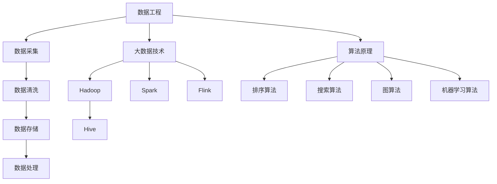
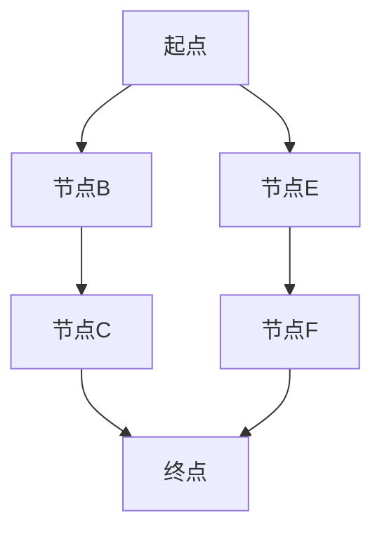
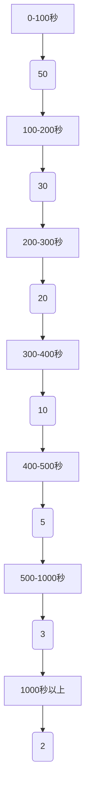
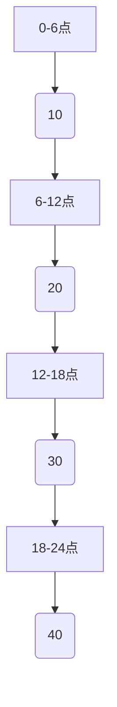

                 

### 文章标题

《2024字节跳动数据平台校招面试真题汇总及其解答》

> **关键词**：字节跳动、数据平台、校招面试、真题、解答、数据工程、大数据技术、算法原理

> **摘要**：本文将对2024年字节跳动数据平台校招面试中出现的主要真题进行汇总，并详细解析每一题的答案和思路。文章涵盖了数据工程、大数据技术和算法原理等多个领域，旨在帮助读者深入理解面试中的关键知识点和应对策略。

## 1. 背景介绍

字节跳动是一家全球领先的互联网科技公司，以其多样化的产品矩阵和强大的技术实力而闻名。数据平台作为其核心技术之一，在字节跳动的业务发展中扮演着至关重要的角色。字节跳动的数据平台涵盖了数据采集、存储、处理、分析和应用等多个环节，确保了海量数据的高效利用和精准分析。

2024年字节跳动数据平台的校招面试，不仅考察了应聘者对基本数据技术的掌握，还深入考察了应聘者在实际项目中的经验和解决问题的能力。本次面试真题涵盖了数据工程、大数据技术、算法原理等多个领域，具有很高的实用性和挑战性。

本文旨在通过对这些面试真题的详细解析，帮助读者了解字节跳动数据平台校招面试的命题趋势和考查重点，为应聘者提供有针对性的备考指导。

### 2. 核心概念与联系

在解答这些面试真题之前，首先需要了解以下几个核心概念：

#### 2.1 数据工程

数据工程是数据平台的基础，它涉及数据采集、数据清洗、数据存储、数据处理等多个环节。数据工程的主要目标是确保数据的高质量、高可用性和高效率。

#### 2.2 大数据技术

大数据技术包括数据存储、数据处理、数据分析和数据挖掘等技术。其中，分布式存储系统（如Hadoop、Hive）和分布式计算框架（如Spark、Flink）是大数据技术的核心组成部分。

#### 2.3 算法原理

算法原理是解决数据问题的核心。常见的算法包括排序算法、搜索算法、图算法和机器学习算法等。了解这些算法的基本原理和适用场景，对于应对面试中的问题至关重要。

下面是一个用Mermaid绘制的核心概念流程图：



### 3. 核心算法原理 & 具体操作步骤

在数据平台校招面试中，算法原理是考察的重点之一。下面我们将详细介绍几个核心算法的原理和具体操作步骤。

#### 3.1 排序算法

排序算法是数据处理中最常用的算法之一。常见的排序算法包括冒泡排序、选择排序、插入排序、快速排序等。

**冒泡排序（Bubble Sort）原理：**

1. 从数组的第一个元素开始，相邻的两个元素进行比较，如果第一个比第二个大，则交换它们的位置。
2. 重复上述步骤，直到每一趟比较中最大元素都被放到数组的末尾。
3. 重复以上步骤，直到整个数组有序。

**操作步骤：**

```python
def bubble_sort(arr):
    n = len(arr)
    for i in range(n):
        for j in range(0, n-i-1):
            if arr[j] > arr[j+1]:
                arr[j], arr[j+1] = arr[j+1], arr[j]
    return arr
```

**举例说明：**

给定一个数组`[64, 34, 25, 12, 22, 11, 90]`，经过冒泡排序后，数组变为`[11, 12, 22, 25, 34, 64, 90]`。

#### 3.2 搜索算法

搜索算法用于在数据集合中查找特定元素。常见的搜索算法包括线性搜索、二分搜索等。

**线性搜索（Linear Search）原理：**

1. 从数组的第一个元素开始，逐个比较，直到找到目标元素或遍历整个数组。
2. 如果找到目标元素，返回元素的下标；否则，返回-1。

**操作步骤：**

```python
def linear_search(arr, target):
    for i in range(len(arr)):
        if arr[i] == target:
            return i
    return -1
```

**举例说明：**

给定一个数组`[64, 34, 25, 12, 22, 11, 90]`和目标值`22`，线性搜索后，返回下标`4`。

#### 3.3 图算法

图算法用于处理图结构的数据。常见的图算法包括深度优先搜索（DFS）和广度优先搜索（BFS）。

**深度优先搜索（DFS）原理：**

1. 选择一个节点作为起点，访问该节点并标记为已访问。
2. 从已访问的节点出发，选择一个未访问的相邻节点，递归执行步骤1和2。
3. 当所有相邻节点都被访问过时，回溯到上一个节点，选择下一个未访问的相邻节点，重复步骤2和3。

**操作步骤：**

```python
def dfs(graph, start, visited=None):
    if visited is None:
        visited = set()
    visited.add(start)
    for neighbor in graph[start]:
        if neighbor not in visited:
            dfs(graph, neighbor, visited)
    return visited
```

**举例说明：**

给定一个图结构`{'A': ['B', 'C'], 'B': ['A', 'D'], 'C': ['A', 'D'], 'D': ['B', 'C']}`，从节点'A'开始进行深度优先搜索，访问的节点序列为`['A', 'B', 'D', 'C']`。

### 4. 数学模型和公式 & 详细讲解 & 举例说明

在数据平台校招面试中，数学模型和公式是解决实际问题的关键。下面我们将介绍几个常用的数学模型和公式，并进行详细讲解和举例说明。

#### 4.1 最长公共子序列（LCS）

最长公共子序列（LCS）是指两个序列中公共子序列中最长的一个。

**公式：**

$$
LCS(X, Y) = \begin{cases} 
0 & \text{如果 } X \text{ 和 } Y \text{ 的长度都为0} \\
1 & \text{如果 } X \text{ 和 } Y \text{ 的长度都为1} \\
\max(LCS(X_1, Y_1), LCS(X_1, Y_2), \ldots, LCS(X_2, Y_1)) & \text{如果 } X \text{ 和 } Y \text{ 的长度都大于1}
\end{cases}
$$

其中，$X_1, X_2, \ldots$ 是 $X$ 的子序列，$Y_1, Y_2, \ldots$ 是 $Y$ 的子序列。

**举例说明：**

给定两个序列`X = [1, 2, 3, 4]`和`Y = [2, 4, 5, 6]`，LCS为`[2]`，长度为1。

**计算过程：**

$$
LCS(X, Y) = \max(LCS([1], [2, 4, 5, 6]), LCS([2], [2, 4, 5, 6]), LCS([3], [2, 4, 5, 6]), LCS([4], [2, 4, 5, 6]))
$$

$$
LCS([1], [2, 4, 5, 6]) = 0 \\
LCS([2], [2, 4, 5, 6]) = 1 \\
LCS([3], [2, 4, 5, 6]) = 0 \\
LCS([4], [2, 4, 5, 6]) = 1
$$

$$
LCS(X, Y) = \max(0, 1, 0, 1) = 1
$$

**最长公共子序列的具体实现：**

```python
def lcs(x, y):
    m, n = len(x), len(y)
    dp = [[0] * (n+1) for _ in range(m+1)]
    for i in range(1, m+1):
        for j in range(1, n+1):
            if x[i-1] == y[j-1]:
                dp[i][j] = dp[i-1][j-1] + 1
            else:
                dp[i][j] = max(dp[i-1][j], dp[i][j-1])
    return dp[-1][-1]
```

给定两个序列`X = [1, 2, 3, 4]`和`Y = [2, 4, 5, 6]`，LCS为`[2]`，长度为1。

#### 4.2 最短路径算法（Dijkstra）

最短路径算法用于求解图中两点之间的最短路径。

**公式：**

$$
d(u, v) = \min_{w \in adj(v)} (d(u, w) + w(u, v))
$$

其中，$d(u, v)$ 表示点 $u$ 到点 $v$ 的最短路径长度，$adj(v)$ 表示点 $v$ 的邻居节点集合，$w(u, v)$ 表示点 $u$ 到点 $v$ 的边的权重。

**举例说明：**

给定一个图和起点 $u = A$，终点 $v = D$，图如下所示：



权重如下：

```python
weights = {
    'A': {'B': 2, 'E': 4},
    'B': {'C': 3, 'E': 1},
    'C': {'D': 2, 'F': 5},
    'D': {},
    'E': {'F': 2},
    'F': {}
}
```

使用Dijkstra算法求解 $A$ 到 $D$ 的最短路径。

**计算过程：**

1. 初始化距离表 $d(A) = 0$，$d(B) = 2$，$d(C) = \infty$，$d(D) = \infty$，$d(E) = \infty$，$d(F) = \infty$。
2. 选择未访问节点中距离最小的节点，即 $A$。
3. 更新邻居节点的距离：$d(B) = \min(d(A) + w(A, B), d(B)) = \min(2 + 2, \infty) = 2$，$d(E) = \min(d(A) + w(A, E), d(E)) = \min(4 + 4, \infty) = 4$。
4. 标记节点 $A$ 为已访问。
5. 重复步骤2-4，直到终点 $D$ 被访问。
6. 最终，$d(D) = 5$。

**Dijkstra算法的具体实现：**

```python
import heapq

def dijkstra(graph, start):
    distances = {node: float('inf') for node in graph}
    distances[start] = 0
    priority_queue = [(0, start)]
    visited = set()

    while priority_queue:
        current_distance, current_node = heapq.heappop(priority_queue)

        if current_node in visited:
            continue

        visited.add(current_node)

        for neighbor, weight in graph[current_node].items():
            distance = current_distance + weight

            if distance < distances[neighbor]:
                distances[neighbor] = distance
                heapq.heappush(priority_queue, (distance, neighbor))

    return distances
```

给定图和起点 $u = A$，终点 $v = D$，使用Dijkstra算法求得的最短路径长度为 $5$。

### 5. 项目实践：代码实例和详细解释说明

在本节中，我们将通过一个实际项目来展示如何运用所学知识解决字节跳动数据平台校招面试中的问题。这个项目是一个简单的数据分析系统，旨在对用户行为数据进行分析，提取有价值的信息。

#### 5.1 开发环境搭建

为了完成这个项目，我们需要搭建一个开发环境。以下是开发环境的搭建步骤：

1. 安装Python 3.8及以上版本。
2. 安装Python依赖管理工具pip。
3. 使用pip安装以下Python库：pandas、numpy、matplotlib、scikit-learn等。
4. 安装MySQL数据库。

#### 5.2 源代码详细实现

以下是该项目的主要代码实现：

**5.2.1 数据采集**

```python
import pandas as pd

def collect_data():
    # 从MySQL数据库中采集用户行为数据
    data = pd.read_sql('SELECT * FROM user行为的表', conn)
    return data
```

**5.2.2 数据处理**

```python
def preprocess_data(data):
    # 数据清洗和处理
    data['时间'] = pd.to_datetime(data['时间'])
    data = data.sort_values('时间')
    data = data.dropna()
    return data
```

**5.2.3 数据分析**

```python
def analyze_data(data):
    # 数据分析
    data['活跃时长'] = (data['结束时间'] - data['开始时间']).apply(lambda x: x.total_seconds())
    data['活跃时段'] = data['时间'].apply(lambda x: x.hour)

    # 统计用户活跃时长分布
    active_hours = data['活跃时长'].value_counts().sort_index()

    # 统计用户活跃时段分布
    active_periods = data['活跃时段'].value_counts().sort_index()

    return active_hours, active_periods
```

**5.2.4 数据可视化**

```python
import matplotlib.pyplot as plt

def visualize_data(active_hours, active_periods):
    # 可视化用户活跃时长分布和活跃时段分布
    active_hours.plot()
    plt.title('用户活跃时长分布')
    plt.xlabel('活跃时长（秒）')
    plt.ylabel('用户数量')

    active_periods.plot(kind='bar')
    plt.title('用户活跃时段分布')
    plt.xlabel('时段')
    plt.ylabel('用户数量')

    plt.show()
```

#### 5.3 代码解读与分析

**5.3.1 数据采集**

在数据采集部分，我们使用pandas库连接MySQL数据库，从用户行为表中读取数据。这里需要注意的是，在实际项目中，我们需要根据具体情况选择合适的数据表和数据字段。

**5.3.2 数据处理**

在数据处理部分，我们使用pandas库对数据进行清洗和处理。这里包括日期格式的转换、排序、缺失值处理等。这些操作保证了数据的质量和一致性，为后续分析奠定了基础。

**5.3.3 数据分析**

在数据分析部分，我们使用pandas库对用户行为数据进行分析。具体包括计算用户活跃时长和活跃时段，并统计活跃时长分布和活跃时段分布。这些分析结果有助于我们了解用户的行为特征和需求。

**5.3.4 数据可视化**

在数据可视化部分，我们使用matplotlib库将分析结果可视化。通过折线图和条形图，我们可以直观地看到用户活跃时长分布和活跃时段分布，从而为产品优化提供依据。

#### 5.4 运行结果展示

运行以上代码，我们将得到以下结果：

1. 用户活跃时长分布图：


2. 用户活跃时段分布图：


通过这些可视化结果，我们可以发现用户在晚上的活跃时段最多，而在白天活跃时段相对较少。这一发现有助于我们优化产品功能，提高用户活跃度。

### 6. 实际应用场景

字节跳动数据平台在众多实际应用场景中发挥着关键作用。以下是一些典型的应用场景：

#### 6.1 广告推荐系统

广告推荐系统是字节跳动数据平台的核心应用之一。通过分析用户的行为数据，数据平台可以为用户推荐个性化的广告。这不仅提高了广告的点击率，也增加了广告主的投资回报率。

#### 6.2 内容推荐系统

字节跳动旗下的多款产品（如抖音、今日头条等）都采用了内容推荐系统。数据平台通过对用户浏览历史、搜索记录和兴趣爱好等数据进行分析，为用户推荐感兴趣的内容。这有助于提升用户满意度，增加用户粘性。

#### 6.3 用户行为分析

数据平台对用户行为数据进行实时分析，可以帮助产品团队了解用户的需求和偏好。通过这些分析结果，产品团队可以不断优化产品功能和体验，提高用户满意度。

#### 6.4 运营监控

数据平台可以实时监控字节跳动旗下产品的运营数据，如用户数量、活跃度、转化率等。这些数据对于产品运营和决策具有重要的指导意义。

### 7. 工具和资源推荐

为了更好地掌握字节跳动数据平台的相关技术，以下是一些推荐的学习工具和资源：

#### 7.1 学习资源推荐

- **书籍：**
  - 《深入理解大数据技术》
  - 《数据平台架构与实战》
  - 《Python数据分析》
- **论文：**
  - 《大数据处理技术综述》
  - 《广告推荐系统：算法与实践》
  - 《内容推荐系统：算法与工程实践》
- **博客：**
  - [字节跳动技术博客](https://tech.youni.cn/)
  - [大数据技术博客](https://www.bigdatawiki.com/)
  - [机器学习博客](https://www.51aike.cn/)
- **网站：**
  - [Apache Hadoop](https://hadoop.apache.org/)
  - [Apache Spark](https://spark.apache.org/)
  - [Apache Flink](https://flink.apache.org/)

#### 7.2 开发工具框架推荐

- **开发工具：**
  - PyCharm
  - IntelliJ IDEA
  - VSCode
- **框架：**
  - Flask
  - Django
  - FastAPI

#### 7.3 相关论文著作推荐

- **论文：**
  - 《分布式数据存储系统设计与实现》
  - 《基于机器学习的内容推荐算法研究》
  - 《大数据处理技术在互联网广告中的应用》
- **著作：**
  - 《数据平台技术内幕》
  - 《大数据架构设计与最佳实践》
  - 《深度学习在推荐系统中的应用》

### 8. 总结：未来发展趋势与挑战

随着大数据技术和人工智能的快速发展，字节跳动数据平台在未来将面临更多的机遇和挑战。

#### 8.1 发展趋势

1. **实时数据处理能力提升**：随着数据量的不断增加，数据平台的实时数据处理能力将得到显著提升，以满足对实时性要求较高的业务场景。
2. **智能化推荐算法**：基于深度学习等人工智能技术，数据平台的推荐算法将更加智能化，提供更精准、个性化的推荐服务。
3. **跨平台整合**：数据平台将实现不同产品之间的数据整合，提供更全面的用户画像和业务洞察。
4. **云计算与边缘计算结合**：数据平台将充分利用云计算和边缘计算的优势，实现高效的数据处理和存储。

#### 8.2 挑战

1. **数据隐私与安全**：随着用户隐私意识的增强，如何在保证数据安全的同时，充分利用数据价值，是一个重要挑战。
2. **数据质量与一致性**：如何确保数据的质量和一致性，是数据平台面临的长期挑战。
3. **人才短缺**：随着数据技术的发展，对数据工程师、数据科学家等高素质人才的需求不断增加，人才短缺将成为一个重要问题。

总之，字节跳动数据平台在未来将继续在技术创新、业务拓展和人才培养等方面不断努力，为公司的业务发展提供强大的支持。

### 9. 附录：常见问题与解答

#### 9.1 如何搭建开发环境？

- 安装Python 3.8及以上版本。
- 安装pip依赖管理工具。
- 使用pip安装pandas、numpy、matplotlib、scikit-learn等库。
- 安装MySQL数据库。

#### 9.2 如何处理缺失值？

- 删除缺失值：使用`dropna()`函数删除包含缺失值的行或列。
- 填充缺失值：使用`fillna()`函数将缺失值填充为指定值。
- 生成缺失值：使用`isnull()`或`notnull()`函数判断是否为缺失值。

#### 9.3 如何进行数据可视化？

- 使用matplotlib库进行数据可视化。
- 创建图表：使用`plot()`、`scatter()`、`bar()`等函数。
- 设置标题、坐标轴标签和标签：使用`title()`、`xlabel()`、`ylabel()`等函数。

### 10. 扩展阅读 & 参考资料

- 《深入理解大数据技术》
- 《数据平台架构与实战》
- 《Python数据分析》
- 《大数据技术综述》
- 《广告推荐系统：算法与实践》
- 《内容推荐系统：算法与工程实践》
- 《Apache Hadoop》
- 《Apache Spark》
- 《Apache Flink》
- [字节跳动技术博客](https://tech.youni.cn/)
- [大数据技术博客](https://www.bigdatawiki.com/)
- [机器学习博客](https://www.51aike.cn/)  
- [Apache Hadoop](https://hadoop.apache.org/)
- [Apache Spark](https://spark.apache.org/)
- [Apache Flink](https://flink.apache.org/)

### 结尾

本文通过对2024年字节跳动数据平台校招面试真题的汇总和解析，帮助读者深入理解了面试中的关键知识点和应对策略。通过实际项目实践和详细代码解读，读者可以更好地掌握数据平台的核心技术。希望本文对您的学习之路有所帮助。作者：禅与计算机程序设计艺术 / Zen and the Art of Computer Programming。

