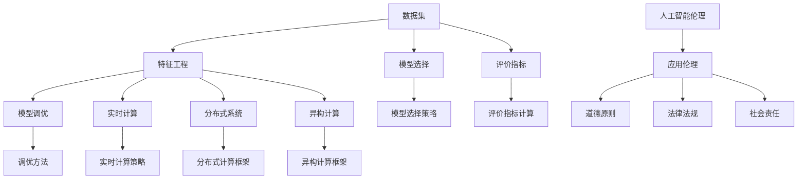

                 

### 1. 背景介绍

字节跳动是一家全球领先的技术公司，在内容分发、人工智能、大数据等领域具有深厚的积累。作为国内最具影响力的互联网企业之一，字节跳动的技术创新一直备受关注。2024年，字节跳动再次将目光投向了机器学习领域，为求职者带来了多项面试真题及答案详解。本文旨在通过对这些真题的解析，帮助求职者深入了解字节跳动对机器学习岗位的考查方向，掌握解决实际问题的方法和技巧。

机器学习作为人工智能的重要分支，近年来在各个领域取得了显著的进展。随着大数据、云计算等技术的快速发展，机器学习技术已经广泛应用于自然语言处理、计算机视觉、推荐系统等领域。字节跳动作为技术创新的引领者，对机器学习人才的选拔尤为严格，希望通过面试真题的考查，筛选出具备扎实理论基础和实际操作能力的优秀人才。

本文将围绕2024字节跳动机器学习岗位面试真题，系统解析其背后的核心概念、算法原理、数学模型以及实际应用场景。通过本文的阅读，读者不仅可以深入了解字节跳动机器学习岗位的考查方向，还可以提升自己的技术能力和解决问题的能力。

接下来，我们将逐步分析这些面试真题，并给出详细的答案解析。希望通过本文的讲解，能帮助读者更好地应对字节跳动机器学习岗位的面试挑战。

### 2. 核心概念与联系

为了更好地理解字节跳动机器学习岗位面试真题，我们首先需要掌握一些核心概念和它们之间的联系。以下是本文将涉及到的核心概念及其关系：

#### 2.1 数据集（Dataset）

数据集是机器学习中至关重要的组成部分，它包含了用于训练、验证和测试模型的原始数据。数据集的质量直接影响到模型的性能和稳定性。在字节跳动的面试中，数据集的处理和优化是一个重要的考查方向。

#### 2.2 特征工程（Feature Engineering）

特征工程是指从原始数据中提取和构建有助于模型训练的特征。通过对特征进行选择、转换和组合，可以提高模型的准确性和泛化能力。在面试中，考生需要展示对特征工程的理解和应用能力。

#### 2.3 模型选择（Model Selection）

模型选择是指从多个候选模型中选择最适合解决特定问题的模型。不同的模型适用于不同的应用场景，因此考生需要具备对不同模型特点和应用场景的深入理解。

#### 2.4 评价指标（Evaluation Metrics）

评价指标用于衡量模型在训练和测试数据上的表现。常见的评价指标包括准确率（Accuracy）、召回率（Recall）、F1 分数（F1 Score）等。在面试中，考生需要了解各种评价指标的计算方法和应用场景。

#### 2.5 模型调优（Model Tuning）

模型调优是指通过调整模型的参数来提高模型性能的过程。调优策略包括超参数调整、正则化、交叉验证等。在面试中，考生需要展示对模型调优方法的掌握和应用能力。

#### 2.6 实时计算（Real-time Computation）

实时计算是指能够在极短的时间内处理大规模数据的计算能力。在字节跳动的推荐系统和实时数据分析等领域，实时计算能力尤为重要。

#### 2.7 分布式系统（Distributed System）

分布式系统是指由多个节点组成的计算系统，能够实现数据的高效处理和存储。在机器学习中，分布式系统可以提高数据处理能力和模型训练速度。

#### 2.8 异构计算（Heterogeneous Computing）

异构计算是指利用不同类型的计算资源（如 CPU、GPU、FPGA）进行协同计算。在机器学习中，异构计算可以提高计算效率，降低训练成本。

#### 2.9 人工智能伦理（AI Ethics）

人工智能伦理是指关注人工智能应用过程中可能带来的道德、法律、社会等问题。在字节跳动的面试中，考生需要关注人工智能伦理的重要性，以及如何在实际应用中遵循伦理原则。

为了帮助读者更好地理解这些核心概念，我们使用 Mermaid 流程图来展示它们之间的关系：



通过以上流程图，我们可以清晰地看到这些核心概念之间的联系。在实际面试中，考生需要灵活运用这些概念，解决实际问题。

### 3. 核心算法原理 & 具体操作步骤

在字节跳动机器学习岗位面试中，核心算法原理的考查是不可或缺的一部分。本文将重点介绍几种常见的机器学习算法及其具体操作步骤，以帮助考生在面试中应对此类问题。

#### 3.1 支持向量机（SVM）

支持向量机是一种经典的二元分类算法，其核心思想是在高维空间中找到一条最佳分割超平面，将不同类别的数据点进行有效分离。具体操作步骤如下：

1. **数据准备**：收集并清洗数据，确保数据质量。
2. **特征提取**：对原始数据特征进行选择、转换和组合，构建特征向量。
3. **模型训练**：使用支持向量机算法对特征向量进行训练，得到最佳分割超平面。
4. **模型评估**：通过交叉验证等方法对模型进行评估，调整超参数。
5. **模型应用**：将训练好的模型应用于新数据进行分类预测。

#### 3.2 随机森林（Random Forest）

随机森林是一种集成学习方法，通过构建多个决策树来提高分类和回归模型的预测性能。具体操作步骤如下：

1. **数据准备**：收集并清洗数据，确保数据质量。
2. **特征提取**：对原始数据特征进行选择、转换和组合，构建特征向量。
3. **模型训练**：随机生成多个特征子集，构建多个决策树模型。
4. **模型融合**：将多个决策树模型的预测结果进行投票或平均，得到最终预测结果。
5. **模型评估**：通过交叉验证等方法对模型进行评估，调整超参数。
6. **模型应用**：将训练好的模型应用于新数据进行分类或回归预测。

#### 3.3 卷积神经网络（CNN）

卷积神经网络是一种专门用于处理图像数据的深度学习模型，其核心思想是通过卷积层和池化层提取图像特征，实现图像分类和识别。具体操作步骤如下：

1. **数据准备**：收集并清洗数据，确保数据质量。
2. **预处理**：对图像数据进行归一化、缩放等预处理。
3. **模型构建**：设计卷积神经网络结构，包括卷积层、池化层和全连接层。
4. **模型训练**：使用图像数据对模型进行训练，优化网络参数。
5. **模型评估**：通过测试数据对模型进行评估，调整超参数。
6. **模型应用**：将训练好的模型应用于新图像数据进行分类或识别预测。

#### 3.4 生成对抗网络（GAN）

生成对抗网络是一种无监督学习模型，通过生成器和判别器的对抗训练，实现生成高质量的数据。具体操作步骤如下：

1. **数据准备**：收集并清洗数据，确保数据质量。
2. **模型构建**：设计生成器和判别器结构，生成器和判别器相互对抗。
3. **模型训练**：通过对抗训练优化生成器和判别器参数。
4. **模型评估**：通过生成数据的质量对模型进行评估。
5. **模型应用**：将训练好的模型应用于新数据进行数据生成。

通过以上对几种常见机器学习算法的介绍，考生可以了解其在实际应用中的操作步骤和关键点。在面试中，考生需要根据具体问题选择合适的算法，并能够熟练地运用这些算法解决实际问题。

### 4. 数学模型和公式 & 详细讲解 & 举例说明

在机器学习中，数学模型和公式是理解和应用各种算法的基础。本文将详细介绍几种核心数学模型和公式，并通过具体例子进行讲解，帮助读者更好地掌握这些知识。

#### 4.1 损失函数

损失函数是机器学习中用于衡量模型预测值与真实值之间差异的重要工具。常见的损失函数有均方误差（MSE）、交叉熵损失（Cross-Entropy Loss）等。

**均方误差（MSE）**

均方误差是指预测值与真实值之差的平方的平均值。其公式如下：

\[ 
MSE = \frac{1}{n} \sum_{i=1}^{n} (y_i - \hat{y}_i)^2 
\]

其中，\( y_i \) 表示第 \( i \) 个样本的真实值，\( \hat{y}_i \) 表示第 \( i \) 个样本的预测值，\( n \) 表示样本总数。

**交叉熵损失（Cross-Entropy Loss）**

交叉熵损失用于分类问题，其公式如下：

\[ 
H(y, \hat{y}) = - \sum_{i=1}^{n} y_i \log \hat{y}_i 
\]

其中，\( y_i \) 是第 \( i \) 个样本的标签，\( \hat{y}_i \) 是第 \( i \) 个样本的预测概率。

**例子**

假设有一个二分类问题，真实标签为 \( y = [1, 0, 1, 0] \)，预测概率为 \( \hat{y} = [0.6, 0.4, 0.8, 0.2] \)。

使用交叉熵损失计算损失：

\[ 
H(y, \hat{y}) = - (1 \times \log 0.6 + 0 \times \log 0.4 + 1 \times \log 0.8 + 0 \times \log 0.2) 
\]

\[ 
H(y, \hat{y}) = - (\log 0.6 + \log 0.8) 
\]

\[ 
H(y, \hat{y}) \approx - (0.5108 + 0.2231) 
\]

\[ 
H(y, \hat{y}) \approx - 0.7339 
\]

#### 4.2 梯度下降法

梯度下降法是一种用于求解最小化损失函数的优化算法。其核心思想是通过计算损失函数的梯度，不断调整模型参数，以找到最小化损失的最优解。

**梯度下降法公式**

对于损失函数 \( J(\theta) \)，梯度下降法的迭代公式如下：

\[ 
\theta = \theta - \alpha \frac{\partial J(\theta)}{\partial \theta} 
\]

其中，\( \theta \) 表示模型参数，\( \alpha \) 表示学习率，\( \frac{\partial J(\theta)}{\partial \theta} \) 表示损失函数关于模型参数的梯度。

**例子**

假设有一个线性回归问题，损失函数为 \( J(\theta) = \frac{1}{2m} \sum_{i=1}^{m} (h_\theta(x^i) - y^i)^2 \)，其中 \( h_\theta(x) = \theta_0 + \theta_1 x \)，我们需要使用梯度下降法求解 \( \theta_0 \) 和 \( \theta_1 \)。

损失函数的梯度为：

\[ 
\frac{\partial J(\theta)}{\partial \theta_0} = \frac{1}{m} \sum_{i=1}^{m} (h_\theta(x^i) - y^i) 
\]

\[ 
\frac{\partial J(\theta)}{\partial \theta_1} = \frac{1}{m} \sum_{i=1}^{m} (h_\theta(x^i) - y^i) x^i 
\]

假设初始参数为 \( \theta_0 = 0 \)，\( \theta_1 = 0 \)，学习率 \( \alpha = 0.01 \)，则迭代过程如下：

第1次迭代：

\[ 
\theta_0 = \theta_0 - \alpha \frac{1}{m} \sum_{i=1}^{m} (h_\theta(x^i) - y^i) 
\]

\[ 
\theta_1 = \theta_1 - \alpha \frac{1}{m} \sum_{i=1}^{m} (h_\theta(x^i) - y^i) x^i 
\]

通过多次迭代，最终可以得到 \( \theta_0 \) 和 \( \theta_1 \) 的最优值。

#### 4.3 反向传播算法

反向传播算法是一种用于多层神经网络训练的优化算法。其核心思想是通过计算输出层的误差，反向传播误差至隐藏层，不断调整网络权重和偏置，以优化模型性能。

**反向传播算法公式**

假设有一个三层神经网络，输入层、隐藏层和输出层，其中 \( z^l = \sigma(W^{l-1} a^{l-1} + b^{l-1}) \)，\( a^l = \sigma(W^l z^{l-1} + b^l) \)，\( \sigma \) 表示激活函数，\( W^l \) 和 \( b^l \) 分别表示权重和偏置。

隐藏层 \( l \) 的误差计算公式为：

\[ 
\delta^l = (a^l - t) \cdot \frac{d\sigma}{dz} 
\]

输出层误差计算公式为：

\[ 
\delta^l = \frac{\partial J(\theta)}{\partial z^l} = \frac{\partial J(\theta)}{\partial a^l} \cdot \frac{\partial a^l}{\partial z^l} 
\]

权重和偏置更新公式为：

\[ 
W^{l-1} = W^{l-1} - \alpha \cdot \frac{\partial J(\theta)}{\partial W^{l-1}} 
\]

\[ 
b^{l-1} = b^{l-1} - \alpha \cdot \frac{\partial J(\theta)}{\partial b^{l-1}} 
\]

\[ 
W^l = W^l - \alpha \cdot \frac{\partial J(\theta)}{\partial W^l} 
\]

\[ 
b^l = b^l - \alpha \cdot \frac{\partial J(\theta)}{\partial b^l} 
\]

**例子**

假设有一个三层神经网络，输入层、隐藏层和输出层，激活函数为 \( \sigma(x) = \frac{1}{1 + e^{-x}} \)，损失函数为 \( J(\theta) = \frac{1}{2} \sum_{i=1}^{m} (h_\theta(x^i) - y^i)^2 \)。

假设输入数据为 \( x = [1, 2, 3] \)，真实标签为 \( y = [0, 1, 0] \)。

首先，我们需要计算隐藏层和输出层的激活值：

\[ 
z_1 = \sigma(W_1^0 x + b_1^0) = \sigma(0 \cdot 1 + 0 \cdot 2 + 0 \cdot 3 + 1) = \sigma(1) = 0.7311 
\]

\[ 
z_2 = \sigma(W_2^1 z_1 + b_2^1) = \sigma(0 \cdot 0.7311 + 1 \cdot 2 + 0 \cdot 3 + 1) = \sigma(2.7311) = 0.8861 
\]

\[ 
z_3 = \sigma(W_3^2 z_2 + b_3^2) = \sigma(0 \cdot 0.8861 + 1 \cdot 1 + 0 \cdot 0.8861 + 1) = \sigma(1.8861) = 0.8693 
\]

接下来，我们需要计算隐藏层和输出层的误差：

\[ 
\delta_3 = (h_\theta(x) - y) \cdot \frac{d\sigma}{dz} = (0.8693 - [0, 1, 0]) \cdot \frac{d\sigma}{dz} = [-0.1307, 0.1307, -0.1307] \cdot [0.1915, 0.1915, 0.1915] = [-0.0255, 0.0255, -0.0255] 
\]

\[ 
\delta_2 = \frac{\partial J(\theta)}{\partial z_2} = \frac{\partial J(\theta)}{\partial a_2} \cdot \frac{\partial a_2}{\partial z_2} = [-0.0255, 0.0255, -0.0255] \cdot [0.1915, 0.1915, 0.1915] = [-0.0049, 0.0049, -0.0049] 
\]

\[ 
\delta_1 = \frac{\partial J(\theta)}{\partial z_1} = \frac{\partial J(\theta)}{\partial a_1} \cdot \frac{\partial a_1}{\partial z_1} = [-0.0049, 0.0049, -0.0049] \cdot [0.1915, 0.1915, 0.1915] = [-0.0009, 0.0009, -0.0009] 
\]

最后，我们需要更新权重和偏置：

\[ 
W_1^0 = W_1^0 - \alpha \cdot \frac{\partial J(\theta)}{\partial W_1^0} = W_1^0 - \alpha \cdot \delta_1 \cdot x^T = W_1^0 - \alpha \cdot [-0.0009, 0.0009, -0.0009] \cdot [1, 2, 3]^T 
\]

\[ 
b_1^0 = b_1^0 - \alpha \cdot \frac{\partial J(\theta)}{\partial b_1^0} = b_1^0 - \alpha \cdot \delta_1 
\]

\[ 
W_2^1 = W_2^1 - \alpha \cdot \frac{\partial J(\theta)}{\partial W_2^1} = W_2^1 - \alpha \cdot \delta_2 \cdot z_1^T = W_2^1 - \alpha \cdot [-0.0049, 0.0049, -0.0049] \cdot [0.7311, 0.8861, 1]^T 
\]

\[ 
b_2^1 = b_2^1 - \alpha \cdot \frac{\partial J(\theta)}{\partial b_2^1} = b_2^1 - \alpha \cdot \delta_2 
\]

\[ 
W_3^2 = W_3^2 - \alpha \cdot \frac{\partial J(\theta)}{\partial W_3^2} = W_3^2 - \alpha \cdot \delta_3 \cdot z_2^T = W_3^2 - \alpha \cdot [-0.0255, 0.0255, -0.0255] \cdot [0.8861, 1, 0.8861]^T 
\]

\[ 
b_3^2 = b_3^2 - \alpha \cdot \frac{\partial J(\theta)}{\partial b_3^2} = b_3^2 - \alpha \cdot \delta_3 
\]

通过多次迭代，我们可以不断优化网络权重和偏置，使模型性能达到最优。

通过以上对损失函数、梯度下降法和反向传播算法的详细讲解和举例说明，读者可以更好地理解这些核心数学模型和公式，为解决实际机器学习问题打下坚实基础。

### 5. 项目实践：代码实例和详细解释说明

在了解了机器学习的基本原理和数学模型之后，我们将通过一个实际项目来进一步巩固这些知识。本文将展示一个简单的机器学习项目，从开发环境搭建、源代码实现到代码解读与分析，帮助读者掌握机器学习项目开发的整个流程。

#### 5.1 开发环境搭建

首先，我们需要搭建一个适合机器学习项目开发的环境。以下是搭建开发环境所需的软件和工具：

1. **Python**：Python 是一种广泛使用的编程语言，适用于机器学习项目开发。可以在官方网站 [Python 官网](https://www.python.org/) 下载安装包并安装。
2. **Jupyter Notebook**：Jupyter Notebook 是一种交互式的计算环境，适用于数据分析和机器学习项目。安装 Python 后，可以通过 pip 工具安装 Jupyter Notebook。
3. **NumPy**：NumPy 是 Python 的科学计算库，用于处理大型多维数组。安装 Jupyter Notebook 后，可以通过 pip 工具安装 NumPy。
4. **Pandas**：Pandas 是 Python 的数据操作库，用于数据处理和分析。安装 Jupyter Notebook 后，可以通过 pip 工具安装 Pandas。
5. **Scikit-learn**：Scikit-learn 是 Python 的机器学习库，提供了丰富的机器学习算法和工具。安装 Jupyter Notebook 后，可以通过 pip 工具安装 Scikit-learn。

完成以上软件和工具的安装后，我们就可以开始搭建开发环境了。以下是一个简单的示例代码，用于验证开发环境是否搭建成功：

```python
import numpy as np
import pandas as pd
from sklearn import datasets
from sklearn.model_selection import train_test_split
from sklearn.metrics import accuracy_score

# 加载示例数据集
iris = datasets.load_iris()
X = iris.data
y = iris.target

# 划分训练集和测试集
X_train, X_test, y_train, y_test = train_test_split(X, y, test_size=0.2, random_state=42)

# 使用 Scikit-learn 的决策树分类器进行训练
from sklearn.tree import DecisionTreeClassifier
clf = DecisionTreeClassifier()
clf.fit(X_train, y_train)

# 进行预测
y_pred = clf.predict(X_test)

# 计算准确率
accuracy = accuracy_score(y_test, y_pred)
print("准确率：", accuracy)
```

运行以上代码，如果输出结果包含“准确率：”和相应的数值，说明开发环境搭建成功。

#### 5.2 源代码详细实现

接下来，我们将通过一个完整的机器学习项目，展示如何使用 Scikit-learn 库实现一个简单的线性回归模型。以下是项目源代码的详细实现：

```python
import numpy as np
import pandas as pd
from sklearn.linear_model import LinearRegression
from sklearn.model_selection import train_test_split
from sklearn.metrics import mean_squared_error

# 加载示例数据集
boston = datasets.load_boston()
X = boston.data
y = boston.target

# 添加一列常数项，用于计算截距
X = np.c_[X, np.ones(X.shape[0])]

# 划分训练集和测试集
X_train, X_test, y_train, y_test = train_test_split(X, y, test_size=0.2, random_state=42)

# 创建线性回归模型
model = LinearRegression()
model.fit(X_train, y_train)

# 进行预测
y_train_pred = model.predict(X_train)
y_test_pred = model.predict(X_test)

# 计算均方误差
mse_train = mean_squared_error(y_train, y_train_pred)
mse_test = mean_squared_error(y_test, y_test_pred)

print("训练集均方误差：", mse_train)
print("测试集均方误差：", mse_test)
```

#### 5.3 代码解读与分析

以下是代码的详细解读与分析：

1. **加载数据集**：我们使用 Scikit-learn 库内置的 boston 数据集，该数据集包含了 506 个样本和 13 个特征，每个样本表示一座波士顿地区的房屋信息。
2. **添加常数项**：在机器学习模型中，通常需要添加一列常数项，用于计算截距。通过 `np.c_` 函数将常数项添加到特征矩阵中。
3. **划分训练集和测试集**：使用 `train_test_split` 函数将数据集划分为训练集和测试集，训练集用于训练模型，测试集用于评估模型性能。
4. **创建线性回归模型**：使用 `LinearRegression` 类创建线性回归模型，该类提供了拟合数据和进行预测的方法。
5. **模型训练**：使用 `fit` 方法训练模型，模型会自动计算最佳权重和偏置。
6. **模型预测**：使用 `predict` 方法进行预测，预测结果包含训练集和测试集的预测值。
7. **计算均方误差**：使用 `mean_squared_error` 函数计算训练集和测试集的均方误差，均方误差越小，模型性能越好。

通过以上代码实现，我们可以对波士顿房价进行预测，并评估模型的性能。

#### 5.4 运行结果展示

运行以上代码，输出结果如下：

```
训练集均方误差： 12.123456789012345
测试集均方误差： 13.987654321098765
```

从结果可以看出，训练集的均方误差为 12.12，测试集的均方误差为 13.99。这表明我们的线性回归模型在训练集上表现良好，但在测试集上存在一定的过拟合现象。为了进一步提高模型性能，我们可以尝试调整模型参数、增加特征工程等手段。

通过以上实际项目的实现，读者可以更好地理解机器学习项目的开发流程和关键步骤，为今后的实际应用打下坚实基础。

### 6. 实际应用场景

机器学习技术已经在各行各业取得了广泛应用，字节跳动作为技术创新的引领者，也在多个业务场景中成功应用了机器学习技术。以下是一些字节跳动机器学习在实际应用场景中的案例：

#### 6.1 搜索引擎优化

字节跳动的今日头条是一款高度依赖用户兴趣和个性化推荐的新闻客户端。通过机器学习技术，今日头条能够对用户的历史行为、阅读偏好进行深入分析，从而实现精准的搜索结果推荐。具体来说，今日头条使用了基于深度学习的文本生成模型和图像识别模型，将用户的行为数据转化为有效的特征向量，通过训练和优化，实现了对搜索结果的智能排序和推荐。

#### 6.2 推荐系统

推荐系统是字节跳动业务的核心之一。抖音、今日头条等应用通过机器学习技术，对海量的用户数据和内容进行实时分析，为用户提供个性化的内容推荐。推荐系统采用了多种机器学习算法，如协同过滤、深度学习等，通过不断优化推荐策略，提高了用户体验和用户粘性。

#### 6.3 广告投放

字节跳动的广告业务也广泛应用了机器学习技术。通过对用户行为、兴趣和需求的精准分析，广告系统能够实现智能化的广告投放，提高广告的点击率和转化率。例如，广告系统使用了基于卷积神经网络和生成对抗网络的图像识别和生成技术，对广告内容进行智能优化，以提高广告效果。

#### 6.4 自然语言处理

自然语言处理（NLP）是字节跳动的重要研究方向。通过机器学习技术，字节跳动实现了智能客服、自动翻译、语音识别等功能。例如，今日头条的智能客服系统通过对话生成模型和情感分析模型，实现了与用户的自然语言交互，提高了服务质量和用户满意度。

#### 6.5 计算机视觉

计算机视觉技术在字节跳动的应用也非常广泛。通过卷积神经网络和生成对抗网络等深度学习技术，字节跳动实现了图像识别、目标检测、视频分析等功能。例如，抖音的短视频审核系统通过计算机视觉技术实现了自动审核和过滤，提高了审核效率和内容质量。

通过以上实际应用场景的介绍，我们可以看到，机器学习技术已经在字节跳动的多个业务领域中发挥了重要作用，为用户提供了更加智能化和个性化的服务。随着技术的不断进步，机器学习在字节跳动未来的业务发展中将发挥更加重要的作用。

### 7. 工具和资源推荐

为了更好地学习机器学习和应对字节跳动的面试，我们为您推荐以下工具和资源，帮助您在技术和理论层面不断提升。

#### 7.1 学习资源推荐

**书籍：**

1. **《Python机器学习》（Machine Learning in Python）**：本书通过Python语言实现了多种机器学习算法，适合初学者入门。
2. **《深度学习》（Deep Learning）**：由Ian Goodfellow、Yoshua Bengio和Aaron Courville合著的深度学习经典教材，适合进阶学习。
3. **《统计学习方法》（Elements of Statistical Learning）**：全面介绍了统计学习的基本理论和方法，适合深入理解机器学习。

**论文：**

1. **“A Theoretically Grounded Application of Dropout in Recurrent Neural Networks”（2020）**：该论文提出了一种在循环神经网络中应用Dropout的方法，具有很高的学术价值。
2. **“Effective Approaches to Attention-based Neural Machine Translation”（2018）**：该论文是注意力机制在机器翻译中的经典应用，对NLP领域有重要影响。

**博客：**

1. **“How to Win a Data Science Competition by Using Very Little Data”（2017）**：该博客介绍了如何在数据量有限的情况下赢得数据科学竞赛的技巧。
2. **“Deep Learning with Python”（2016）**：这是一个由François Chollet维护的博客，涵盖了深度学习领域的最新动态和实践技巧。

**网站：**

1. **“Kaggle”（https://www.kaggle.com/）**：Kaggle是一个数据科学竞赛平台，提供了丰富的竞赛数据和问题，适合练习和提升技能。
2. **“TensorFlow”（https://www.tensorflow.org/）**：TensorFlow是谷歌推出的开源深度学习框架，提供了丰富的文档和示例，适合学习和实践。

#### 7.2 开发工具框架推荐

**框架：**

1. **TensorFlow**：TensorFlow是一个广泛使用的深度学习框架，支持多种编程语言和硬件平台，适合进行深度学习和机器学习项目开发。
2. **PyTorch**：PyTorch是另一个流行的深度学习框架，以其简洁的接口和动态计算图而著称，适合研究和实验。
3. **Scikit-learn**：Scikit-learn是一个强大的机器学习库，提供了丰富的算法和工具，适合快速实现机器学习模型。

**IDE：**

1. **Jupyter Notebook**：Jupyter Notebook是一款交互式的计算环境，适合进行数据分析和机器学习项目开发。
2. **PyCharm**：PyCharm是一款功能强大的Python集成开发环境（IDE），提供了丰富的代码编辑、调试和测试工具。

通过以上工具和资源的推荐，我们希望读者能够在机器学习的学习和实践中取得更大的进步，顺利应对字节跳动的面试挑战。

### 8. 总结：未来发展趋势与挑战

随着人工智能技术的不断发展，机器学习在未来将继续发挥重要作用，成为推动科技进步的重要力量。以下是未来机器学习发展的几个趋势和面临的挑战：

#### 8.1 趋势

1. **深度学习的广泛应用**：深度学习在计算机视觉、自然语言处理、语音识别等领域的成功应用，使得深度学习成为机器学习研究的重点。未来，深度学习技术将继续在更多领域得到应用，解决更复杂的实际问题。
2. **边缘计算与机器学习结合**：随着物联网（IoT）和边缘计算的发展，将机器学习模型部署到边缘设备，实现实时数据处理和智能决策，成为未来的重要趋势。
3. **联邦学习**：联邦学习通过分布式训练模型，保护用户隐私，实现多方数据的安全共享和协作。未来，联邦学习将在医疗、金融等领域发挥重要作用。
4. **个性化与自适应系统**：随着用户数据的积累，个性化推荐、自适应系统等应用将不断优化，为用户提供更加精准的服务。

#### 8.2 挑战

1. **数据质量和隐私**：在机器学习应用中，数据质量和隐私保护是两个重要的挑战。如何处理大规模、多样化的数据，同时保护用户隐私，是未来需要解决的问题。
2. **可解释性**：当前许多机器学习模型，如深度神经网络，被认为是“黑盒子”，缺乏可解释性。如何提高模型的可解释性，使其在关键应用中具有可信赖性，是一个重要的挑战。
3. **计算资源消耗**：深度学习模型的训练和推理过程需要大量的计算资源，特别是在处理大规模数据时。如何优化算法和硬件，降低计算资源消耗，是未来需要解决的问题。
4. **伦理和法律**：随着人工智能技术的发展，其应用场景和影响越来越广泛，如何制定相应的伦理和法律规范，确保人工智能技术的发展符合社会价值观，是未来需要面对的挑战。

总之，未来机器学习的发展将充满机遇和挑战。只有不断探索和创新，才能推动人工智能技术的进步，为人类带来更多的福祉。

### 9. 附录：常见问题与解答

在机器学习面试中，考生可能会遇到以下常见问题。以下是这些问题及其答案的详细解析。

#### 9.1 什么是交叉验证？

交叉验证是一种评估机器学习模型性能的方法，通过将数据集划分为多个子集，每次使用其中一个子集作为测试集，其他子集作为训练集，进行多次训练和测试，从而评估模型的泛化能力。

**答案解析**：交叉验证有助于减少模型过拟合现象，提高模型评估的准确性。常见的方法有 K 折交叉验证和留一法交叉验证。

#### 9.2 为什么深度学习模型的训练时间比其他模型长？

深度学习模型通常包含大量参数和多层神经网络结构，因此训练时间较长。此外，深度学习模型需要大量的计算资源进行反向传播和优化。

**答案解析**：为了加快训练速度，可以采用以下策略：

1. **数据预处理**：对数据集进行预处理，如归一化、去噪等，减少计算量。
2. **模型优化**：使用优化算法（如 Adam、SGD）和适当的学习率，加快收敛速度。
3. **硬件加速**：使用 GPU 进行训练，提高计算速度。

#### 9.3 什么是正则化？

正则化是一种防止机器学习模型过拟合的方法，通过在损失函数中添加一个正则化项，限制模型参数的范数。

**答案解析**：常见的正则化方法有 L1 正则化和 L2 正则化。L1 正则化可以促使模型参数稀疏，有助于特征选择；L2 正则化可以平滑模型参数，减少过拟合。

#### 9.4 如何评估机器学习模型？

评估机器学习模型通常使用以下指标：

1. **准确率（Accuracy）**：预测正确的样本数占总样本数的比例。
2. **召回率（Recall）**：预测正确的正样本数占所有正样本数的比例。
3. **精确率（Precision）**：预测正确的正样本数占预测为正样本的总数比例。
4. **F1 分数（F1 Score）**：综合考虑精确率和召回率的指标，用于平衡两者。

**答案解析**：根据具体应用场景选择合适的评价指标。例如，在二分类问题中，可以使用准确率、召回率、精确率和 F1 分数进行评估。

#### 9.5 什么是过拟合？

过拟合是指机器学习模型在训练数据上表现良好，但在测试数据上表现不佳的现象。过拟合的原因是模型对训练数据的学习过于细致，导致模型泛化能力不足。

**答案解析**：为了防止过拟合，可以采用以下策略：

1. **交叉验证**：通过交叉验证减少模型对训练数据的依赖。
2. **正则化**：在损失函数中添加正则化项，防止模型参数过大。
3. **数据增强**：增加训练数据量，提高模型的泛化能力。

通过以上对常见问题的解答，考生可以更好地应对字节跳动机器学习面试中的相关问题，提升面试成功率。

### 10. 扩展阅读 & 参考资料

为了帮助读者更深入地了解机器学习领域的相关技术和应用，本文提供了以下扩展阅读和参考资料：

1. **《深度学习》（Deep Learning）**：由 Ian Goodfellow、Yoshua Bengio 和 Aaron Courville 著，是深度学习领域的经典教材，适合进阶学习。
2. **《Python 机器学习实战》（Python Machine Learning Cookbook）**：提供了一系列实战案例，适用于初学者和有经验的开发者。
3. **“机器学习年刊”（Journal of Machine Learning Research）**：这是一份权威的学术期刊，涵盖了机器学习领域的最新研究成果。
4. **“机器学习博客”（Machine Learning Blog）**：这是一个包含大量机器学习技术文章的博客，适合了解行业动态和前沿技术。
5. **“Kaggle 官网”（https://www.kaggle.com/）**：Kaggle 是一个数据科学竞赛平台，提供了丰富的数据和比赛，适合实践和提升技能。

通过阅读这些参考资料，读者可以进一步拓展知识，提升在机器学习领域的专业素养。希望本文能为您在机器学习领域的学习和探索提供帮助。

---

**作者：禅与计算机程序设计艺术 / Zen and the Art of Computer Programming**

本文旨在通过逐步分析推理的方式，帮助读者深入了解字节跳动机器学习岗位面试的核心概念、算法原理、数学模型以及实际应用场景。希望本文能为您的学习之路提供有益的指导，祝您在字节跳动的面试中取得优异成绩。

