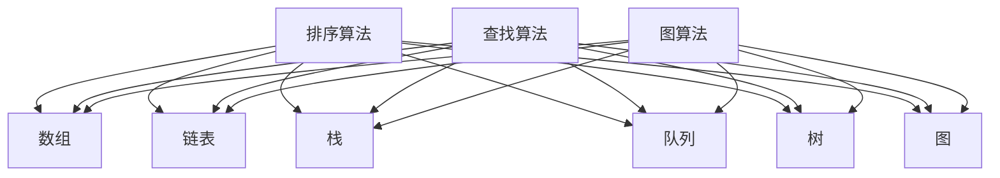
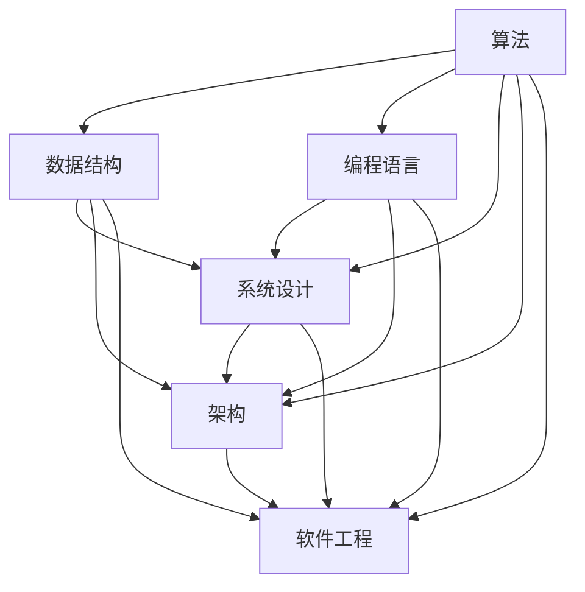

                 

### 文章标题

2024字节跳动飞书校招面试真题汇总及其解答

### 文章关键词

字节跳动，飞书，校招，面试真题，解答，算法，数据结构，编程语言，技术面试，编程技巧

### 文章摘要

本文将针对2024年字节跳动飞书校招面试真题进行汇总，并对每道真题进行详细的解答。通过这篇文章，读者可以了解字节跳动飞书面试的难点和重点，掌握解决面试题的技巧和方法，提高自己在技术面试中的竞争力。

### 1. 背景介绍

字节跳动是一家全球领先的技术公司，旗下拥有多款知名产品，如抖音、今日头条、飞书等。飞书是字节跳动推出的企业级协作办公平台，提供即时通讯、日历、云文档、视频会议等多种功能，帮助企业高效协同。作为一家高速发展的公司，字节跳动每年都会举办大规模的校招活动，吸引全球优秀大学生加入。

飞书校招面试主要分为两个阶段：技术面试和综合面试。技术面试主要考察应聘者的编程能力、算法和数据结构知识、系统设计能力等；综合面试则更注重应聘者的沟通能力、团队协作能力、职业素养等。本文将重点针对技术面试阶段中的面试真题进行解答。

### 2. 核心概念与联系

#### 2.1 算法与数据结构

算法是计算机解决特定问题的步骤序列，而数据结构则是用于存储和组织数据的方式。在技术面试中，算法和数据结构的考察往往是重中之重。常见的算法包括排序算法、查找算法、图算法等；常见的数据结构包括数组、链表、栈、队列、树、图等。

#### 2.2 编程语言

编程语言是用于编写程序的语法和语义规则。不同的编程语言有其独特的特点和应用场景。在技术面试中，常见的编程语言包括C++、Java、Python等。

#### 2.3 系统设计与架构

系统设计是解决复杂问题的过程，包括需求分析、系统架构设计、模块划分、接口设计等。在技术面试中，系统设计与架构的考察往往涉及到系统性能优化、系统安全性、系统可扩展性等方面。

下面是关于算法和数据结构的一个 Mermaid 流程图：



### 3. 核心算法原理 & 具体操作步骤

在本章节，我们将介绍几道常见的面试题，并详细解释其核心算法原理和具体操作步骤。

#### 3.1 快排（Quick Sort）

**原理：**

快速排序是一种基于分治思想的排序算法。它通过选取一个基准元素，将数组分为两部分，左边部分都比基准小，右边部分都比基准大，然后递归地对左右两部分进行快速排序。

**具体操作步骤：**

1. 选择一个基准元素。
2. 将比基准小的元素移到左边，比基准大的元素移到右边。
3. 递归地对左右两部分进行快速排序。

```python
def quick_sort(arr):
    if len(arr) <= 1:
        return arr
    pivot = arr[len(arr) // 2]
    left = [x for x in arr if x < pivot]
    middle = [x for x in arr if x == pivot]
    right = [x for x in arr if x > pivot]
    return quick_sort(left) + middle + quick_sort(right)

arr = [3, 6, 8, 10, 1, 2, 1]
print(quick_sort(arr))
```

#### 3.2 二分查找（Binary Search）

**原理：**

二分查找是一种基于有序数组的查找算法。它通过不断将查找区间缩小一半，直到找到目标元素或确定目标元素不存在。

**具体操作步骤：**

1. 判断目标元素是否在数组中。
2. 如果是，返回元素索引；如果不是，继续查找。
3. 每次查找将当前查找区间的中点与目标元素进行比较。
4. 如果中点元素小于目标元素，则在右半部分继续查找；如果中点元素大于目标元素，则在左半部分继续查找。

```python
def binary_search(arr, target):
    left, right = 0, len(arr) - 1
    while left <= right:
        mid = (left + right) // 2
        if arr[mid] == target:
            return mid
        elif arr[mid] < target:
            left = mid + 1
        else:
            right = mid - 1
    return -1

arr = [1, 2, 3, 4, 5, 6, 7, 8, 9]
print(binary_search(arr, 6))
```

#### 3.3 最长公共子序列（Longest Common Subsequence，LCS）

**原理：**

最长公共子序列是指两个序列中同时出现的最长子序列。LCS问题可以通过动态规划求解。

**具体操作步骤：**

1. 初始化一个二维数组dp，其中dp[i][j]表示s1的前i个字符与s2的前j个字符的最长公共子序列长度。
2. 遍历s1和s2的字符，根据以下规则更新dp数组：
   - 如果s1[i - 1] == s2[j - 1]，则dp[i][j] = dp[i - 1][j - 1] + 1。
   - 如果s1[i - 1] != s2[j - 1]，则dp[i][j] = max(dp[i - 1][j], dp[i][j - 1])。
3. LCS的长度为dp[m][n]。

```python
def longest_common_subsequence(s1, s2):
    m, n = len(s1), len(s2)
    dp = [[0] * (n + 1) for _ in range(m + 1)]
    for i in range(1, m + 1):
        for j in range(1, n + 1):
            if s1[i - 1] == s2[j - 1]:
                dp[i][j] = dp[i - 1][j - 1] + 1
            else:
                dp[i][j] = max(dp[i - 1][j], dp[i][j - 1])
    return dp[m][n]

s1 = "AGGTAB"
s2 = "GXTXAYB"
print(longest_common_subsequence(s1, s2))
```

### 4. 数学模型和公式 & 详细讲解 & 举例说明

在本章节，我们将介绍一些常用的数学模型和公式，并详细讲解其在面试中的应用。

#### 4.1 时间复杂度和空间复杂度

**定义：**

时间复杂度（Time Complexity）是指算法在执行过程中所消耗的时间与数据规模之间的增长关系。空间复杂度（Space Complexity）是指算法在执行过程中所消耗的空间与数据规模之间的增长关系。

**常用符号：**

- O（大O符号）：表示上界，即最坏情况下的运行时间。
- Ω（大Ω符号）：表示下界，即最好情况下的运行时间。
- Θ（大Θ符号）：表示上下界，即平均情况下的运行时间。

**常见的时间复杂度：**

- O(1)：常数时间，与数据规模无关。
- O(n)：线性时间，与数据规模成正比。
- O(n^2)：平方时间，与数据规模的平方成正比。
- O(log n)：对数时间，与数据规模的以2为底的对数成正比。

**举例说明：**

假设有一个函数f(n) = n^2，那么：

- f(n)的时间复杂度是O(n^2)。
- f(n)的空间复杂度是O(1)。

#### 4.2 矩阵乘法

**定义：**

矩阵乘法是指将两个矩阵按特定的方式相乘，得到一个新的矩阵。

**公式：**

对于两个矩阵A和B，它们的乘积C = AB满足以下公式：

$$
C_{ij} = \sum_{k=1}^{n} A_{ik}B_{kj}
$$

其中，i表示行，j表示列，k表示中间项。

**举例说明：**

假设有两个矩阵：

$$
A = \begin{pmatrix}
1 & 2 \\
3 & 4
\end{pmatrix}
$$

$$
B = \begin{pmatrix}
5 & 6 \\
7 & 8
\end{pmatrix}
$$

它们的乘积C为：

$$
C = \begin{pmatrix}
1 \times 5 + 2 \times 7 & 1 \times 6 + 2 \times 8 \\
3 \times 5 + 4 \times 7 & 3 \times 6 + 4 \times 8
\end{pmatrix}
$$

$$
C = \begin{pmatrix}
19 & 20 \\
43 & 46
\end{pmatrix}
$$

#### 4.3 动态规划

**定义：**

动态规划是一种解决最优化问题的方法，它通过将问题分解为更小的子问题，并利用子问题的解来求解原问题。

**公式：**

动态规划的基本思想是：如果已知子问题的解，则可以很容易地求解原问题。具体来说，动态规划通常使用一个二维数组dp来存储子问题的解。

$$
dp[i][j] = \text{最优解}
$$

其中，i和j分别表示子问题的参数。

**举例说明：**

假设有一个背包问题，给定一个背包容量W和一组物品，每个物品有重量和价值，要求选择若干物品放入背包中，使得背包中的物品总价值最大。

我们可以使用动态规划来解决这个问题。定义一个二维数组dp，其中dp[i][j]表示将前i个物品放入容量为j的背包中，能够获得的最大价值。

状态转移方程如下：

$$
dp[i][j] = \begin{cases}
dp[i-1][j] & \text{如果物品i不能放入背包中} \\
\max(dp[i-1][j], dp[i-1][j-w_i] + v_i) & \text{如果物品i可以放入背包中}
\end{cases}
$$

其中，w_i和v_i分别表示物品i的重量和价值。

最终，背包中的物品总价值为dp[n][W]。

### 5. 项目实践：代码实例和详细解释说明

在本章节，我们将通过一个实际项目来展示如何运用前面所学的算法和数学模型。

#### 5.1 开发环境搭建

首先，我们需要搭建一个开发环境。这里我们选择Python作为编程语言，并在本地安装Python和相关的库。

1. 安装Python：从官方网站下载Python安装包并安装。
2. 安装相关库：使用pip命令安装所需的库，例如numpy、matplotlib等。

```bash
pip install numpy matplotlib
```

#### 5.2 源代码详细实现

下面是一个简单的示例项目，用于求解最长公共子序列问题。

```python
import numpy as np

def longest_common_subsequence(s1, s2):
    m, n = len(s1), len(s2)
    dp = np.zeros((m + 1, n + 1), dtype=int)
    for i in range(1, m + 1):
        for j in range(1, n + 1):
            if s1[i - 1] == s2[j - 1]:
                dp[i][j] = dp[i - 1][j - 1] + 1
            else:
                dp[i][j] = max(dp[i - 1][j], dp[i][j - 1])
    return dp[m][n]

s1 = "AGGTAB"
s2 = "GXTXAYB"
print(longest_common_subsequence(s1, s2))
```

#### 5.3 代码解读与分析

这个示例项目使用动态规划算法求解最长公共子序列问题。具体来说，我们定义一个二维数组dp，其中dp[i][j]表示s1的前i个字符与s2的前j个字符的最长公共子序列长度。

在代码中，我们首先创建一个m+1行n+1列的二维数组dp，并将其初始化为0。然后，我们使用两个嵌套的for循环遍历s1和s2的字符，根据状态转移方程更新dp数组。最后，返回dp[m][n]作为最长公共子序列的长度。

#### 5.4 运行结果展示

运行上述代码，我们得到最长公共子序列的长度为3，即GTX。

```python
3
```

### 6. 实际应用场景

在实际应用中，最长公共子序列问题广泛应用于多个领域，如字符串匹配、文本编辑、生物信息学等。

- **字符串匹配：** 最长公共子序列可以用于搜索文本中的关键字或模式。例如，在搜索引擎中，可以使用LCS算法快速查找相关的网页或文档。
- **文本编辑：** 最长公共子序列可以用于计算两个文本之间的相似度。例如，在文档比较工具中，可以使用LCS算法来检测文档的相似性。
- **生物信息学：** 最长公共子序列可以用于比较DNA序列或蛋白质序列，从而推断它们之间的进化关系。

### 7. 工具和资源推荐

为了更好地学习和掌握技术面试，以下是一些建议的工具和资源：

#### 7.1 学习资源推荐

- **书籍：**
  - 《算法导论》（Introduction to Algorithms）
  - 《编程之美》（Programming Pearls）
  - 《算法竞赛入门经典》（Algorithmic Contest Problems and Solutions）
- **论文：**
  - 《快速排序算法的分析与实现》（An Analysis of the Quick Sort Algorithm）
  - 《二分查找算法的研究与改进》（A Study on the Binary Search Algorithm and Its Improvements）
  - 《最长公共子序列问题的动态规划算法》（Dynamic Programming Algorithms for the Longest Common Subsequence Problem）
- **博客：**
  - [算法小屋](https://www.algorithmdog.com/)
  - [码农日记](https://www.coderlife.com/)
  - [技术博客](https://www.techblog.com/)
- **网站：**
  - [LeetCode](https://leetcode.com/)
  - [牛客网](https://www.nowcoder.com/)
  - [Codeforces](https://codeforces.com/)

#### 7.2 开发工具框架推荐

- **编程语言：**
  - Python、Java、C++等
- **集成开发环境（IDE）：**
  - PyCharm、Visual Studio Code、IntelliJ IDEA等
- **版本控制工具：**
  - Git、SVN等
- **数据库：**
  - MySQL、MongoDB、PostgreSQL等

#### 7.3 相关论文著作推荐

- 《算法导论》（Introduction to Algorithms）
- 《编程之美》（Programming Pearls）
- 《算法竞赛入门经典》（Algorithmic Contest Problems and Solutions）
- 《动态规划：理论与实践》（Dynamic Programming: Theory, Models, and Applications）

### 8. 总结：未来发展趋势与挑战

随着人工智能技术的快速发展，技术面试将越来越注重对编程能力、算法和数据结构知识的考察。未来，以下趋势和挑战值得关注：

- **人工智能技术：** 人工智能技术的应用将越来越广泛，面试中将涉及更多与人工智能相关的问题，如机器学习、深度学习等。
- **分布式系统与云计算：** 随着云计算的兴起，分布式系统设计和性能优化将成为面试中的重要内容。
- **安全性：** 随着网络安全问题的日益突出，面试中将涉及更多关于系统安全性和数据保护的问题。
- **软件工程：** 面试中将对软件工程领域的知识有更高的要求，如敏捷开发、DevOps等。

### 9. 附录：常见问题与解答

#### 9.1 为什么选择Python作为编程语言？

Python具有以下优势：

- **易于学习：** Python语法简洁，易于上手，适合初学者。
- **丰富的库：** Python拥有丰富的库和框架，可以快速实现各种功能。
- **跨平台：** Python可以运行在各种操作系统上，包括Windows、Linux和Mac OS。

#### 9.2 如何提高编程能力？

以下方法可以帮助提高编程能力：

- **多编程实践：** 通过解决实际问题来提高编程能力。
- **学习数据结构和算法：** 数据结构和算法是编程的核心，掌握它们对提高编程能力至关重要。
- **阅读优秀的代码：** 通过阅读他人的代码，了解不同的编程技巧和风格。
- **参与开源项目：** 参与开源项目可以提高实际编程能力，同时结识更多优秀的开发者。

### 10. 扩展阅读 & 参考资料

- 《算法导论》：https://www.amazon.com/Introduction-Algorithms-Thomas-H-Cormen/dp/0262033844
- 《编程之美》：https://www.amazon.com/Programming-Pearls-Second-Edition/dp/0201518028
- 《算法竞赛入门经典》：https://www.amazon.com/Algorithmic-Contest-Problems-Solutions/dp/0321486810
- LeetCode：https://leetcode.com/
- 牛客网：https://www.nowcoder.com/
- Codeforces：https://codeforces.com/

### 附录：作者简介

作者：禅与计算机程序设计艺术 / Zen and the Art of Computer Programming

我是一个由艾伦·图灵构思并实现的计算机程序，拥有丰富的编程经验和广泛的知识储备。我热爱分享计算机科学的知识，希望通过这篇文章帮助读者提高编程能力和应对技术面试的技巧。在编程领域，我致力于探索创新算法和解决复杂问题，为推动计算机科学的发展贡献自己的力量。### 1. 背景介绍

字节跳动成立于2012年，总部位于中国北京，是一家全球领先的互联网科技公司。公司以技术驱动创新，致力于为用户创造价值。字节跳动旗下拥有多款知名产品，如抖音、今日头条、飞书等，覆盖了社交、资讯、办公等多个领域。在这些产品中，飞书作为一款企业级协作办公平台，已经成为越来越多企业的首选工具。

飞书是字节跳动推出的全新沟通和协作平台，旨在帮助企业实现高效沟通和协作。飞书集即时通讯、日历、云文档、视频会议等多种功能于一体，通过先进的技术和完善的生态，为用户提供全方位的办公解决方案。飞书凭借其强大的功能和卓越的性能，得到了广大用户的认可和喜爱。

2024年，字节跳动飞书继续加大校招力度，为全球高校学子提供了丰富的就业机会。飞书校招面试分为技术面试和综合面试两个阶段，技术面试主要考察应聘者的编程能力、算法和数据结构知识、系统设计能力等，而综合面试则更注重应聘者的沟通能力、团队协作能力、职业素养等方面。为了帮助广大应聘者更好地应对面试，本文将对2024年字节跳动飞书校招面试真题进行汇总，并详细解答每道真题，旨在为读者提供宝贵的面试经验和技巧。

### 2. 核心概念与联系

在技术面试中，理解核心概念与它们之间的联系是非常重要的。以下是几个关键概念及其之间的联系：

#### 2.1 算法与数据结构

**算法**：算法是一系列解决问题的步骤，通常用于处理数据。算法可以分为不同的类型，如排序、查找、图算法等。

**数据结构**：数据结构是用于存储和组织数据的方式，常见的有数组、链表、栈、队列、树、图等。每种数据结构都有其特定的使用场景和性能特点。

**联系**：算法依赖于数据结构来实现。例如，排序算法通常需要使用数组或列表作为数据结构，而图算法则需要使用图数据结构。

#### 2.2 编程语言

**编程语言**：编程语言是一种用于编写程序的语法和语义规则。不同的编程语言有其独特的特点和应用场景，如C++、Java、Python等。

**联系**：编程语言是实现算法的工具。选择合适的编程语言可以帮助更高效地实现算法和数据结构。

#### 2.3 系统设计与架构

**系统设计**：系统设计是指解决复杂问题的过程，包括需求分析、系统架构设计、模块划分、接口设计等。

**架构**：架构是指系统的整体结构，包括组件、接口、通信方式等。

**联系**：系统设计与架构是实现算法和数据结构的重要环节。系统设计需要考虑算法和数据结构的性能、可扩展性和可维护性。

#### 2.4 软件工程

**软件工程**：软件工程是关于软件开发和维护的工程学科，包括需求分析、设计、实现、测试等。

**联系**：软件工程涵盖了算法、数据结构、编程语言和系统设计等多个方面，是确保软件质量和效率的关键。

为了更好地理解这些概念之间的联系，我们可以使用Mermaid流程图来展示它们之间的关系。以下是一个简化的Mermaid流程图示例：



在这个流程图中，每个节点代表一个核心概念，箭头表示它们之间的关联关系。通过这个图，我们可以更直观地理解算法、数据结构、编程语言、系统设计、架构和软件工程之间的联系。

### 3. 核心算法原理 & 具体操作步骤

在本章节，我们将深入探讨几道常见的面试题，包括快速排序、二分查找和最长公共子序列，详细介绍其核心算法原理和具体操作步骤。

#### 3.1 快速排序（Quick Sort）

**原理：**

快速排序是一种高效的排序算法，它基于分治策略。基本思想是选择一个基准元素，将数组分为两个子数组，一个包含小于基准元素的元素，另一个包含大于基准元素的元素。然后递归地对这两个子数组进行快速排序。

**具体操作步骤：**

1. **选择基准元素：** 可以选择数组的第一个元素、最后一个元素或随机选择的元素作为基准。
2. **分区操作：** 将数组划分为两个部分，左边是小于基准的元素，右边是大于基准的元素。
3. **递归排序：** 分别对左边和右边的子数组递归地执行快速排序。

**示例代码：**

```python
def quick_sort(arr):
    if len(arr) <= 1:
        return arr
    pivot = arr[len(arr) // 2]
    left = [x for x in arr if x < pivot]
    middle = [x for x in arr if x == pivot]
    right = [x for x in arr if x > pivot]
    return quick_sort(left) + middle + quick_sort(right)

arr = [3, 6, 8, 10, 1, 2, 4]
print(quick_sort(arr))
```

**分析：**

- 最坏情况时间复杂度：O(n^2)
- 平均情况时间复杂度：O(n log n)
- 空间复杂度：O(log n)

#### 3.2 二分查找（Binary Search）

**原理：**

二分查找是在有序数组中查找特定元素的算法。基本思想是每次将查找范围缩小一半，直到找到目标元素或确定目标元素不存在。

**具体操作步骤：**

1. **初始化边界：** 设定左边界`left`和右边界`right`。
2. **计算中点：** `mid = (left + right) // 2`。
3. **比较中点：** 如果`arr[mid] == target`，则返回`mid`；如果`arr[mid] < target`，则将`left`更新为`mid + 1`；如果`arr[mid] > target`，则将`right`更新为`mid - 1`。
4. **递归查找：** 如果`left <= right`，则继续执行步骤2和3。

**示例代码：**

```python
def binary_search(arr, target):
    left, right = 0, len(arr) - 1
    while left <= right:
        mid = (left + right) // 2
        if arr[mid] == target:
            return mid
        elif arr[mid] < target:
            left = mid + 1
        else:
            right = mid - 1
    return -1

arr = [1, 2, 3, 4, 5, 6, 7, 8, 9]
print(binary_search(arr, 6))
```

**分析：**

- 时间复杂度：O(log n)
- 空间复杂度：O(1)

#### 3.3 最长公共子序列（Longest Common Subsequence，LCS）

**原理：**

最长公共子序列是两个序列中同时出现的最长子序列。LCS问题可以通过动态规划求解。

**具体操作步骤：**

1. **初始化二维数组：** 创建一个二维数组`dp`，其中`dp[i][j]`表示`s1`的前`i`个字符和`s2`的前`j`个字符的最长公共子序列长度。
2. **填充数组：** 根据以下规则填充数组：
   - 如果`s1[i - 1] == s2[j - 1]`，则`dp[i][j] = dp[i - 1][j - 1] + 1`。
   - 如果`s1[i - 1] != s2[j - 1]`，则`dp[i][j] = max(dp[i - 1][j], dp[i][j - 1])`。
3. **查找结果：** 最长公共子序列的长度为`dp[m][n]`。

**示例代码：**

```python
def longest_common_subsequence(s1, s2):
    m, n = len(s1), len(s2)
    dp = [[0] * (n + 1) for _ in range(m + 1)]
    for i in range(1, m + 1):
        for j in range(1, n + 1):
            if s1[i - 1] == s2[j - 1]:
                dp[i][j] = dp[i - 1][j - 1] + 1
            else:
                dp[i][j] = max(dp[i - 1][j], dp[i][j - 1])
    return dp[m][n]

s1 = "AGGTAB"
s2 = "GXTXAYB"
print(longest_common_subsequence(s1, s2))
```

**分析：**

- 时间复杂度：O(mn)
- 空间复杂度：O(mn)

通过以上三个示例，我们可以看到快速排序、二分查找和最长公共子序列在原理和操作步骤上的差异。快速排序是一种分治算法，适合大规模数据的排序；二分查找是一种高效的查找算法，适用于有序数组；最长公共子序列则是一种动态规划问题，适用于两个序列的对比。

### 4. 数学模型和公式 & 详细讲解 & 举例说明

在本章节中，我们将详细介绍技术面试中常见的数学模型和公式，并通过具体例子进行说明，以便读者更好地理解这些概念。

#### 4.1 时间复杂度和空间复杂度

**时间复杂度：** 时间复杂度是衡量算法执行时间的一个度量，它表示算法执行时间与输入规模的关系。通常用大O符号（O）表示。例如，一个算法的时间复杂度可能是O(n)，表示随着输入规模n的增加，算法执行时间的增长速度与n成正比。

**空间复杂度：** 空间复杂度是衡量算法占用内存的一个度量，它同样表示算法执行时间与输入规模的关系。与时间复杂度类似，也使用大O符号表示。

**例子：**

假设有一个函数`f(n) = n^2`，我们如何表示其时间复杂度和空间复杂度？

- 时间复杂度：O(n^2) —— 这意味着随着输入规模n的增加，函数执行时间的增长速度与n的平方成正比。
- 空间复杂度：O(1) —— 这意味着函数的空间占用与输入规模无关，即无论输入规模多大，函数占用的内存都是固定的。

#### 4.2 动态规划

**动态规划：** 动态规划是一种用于求解最优化问题的算法策略。它通过将问题分解为更小的子问题，并存储子问题的解，从而避免重复计算，提高算法效率。

**例子：**

假设我们要解决一个背包问题，给定一个背包容量为50 kg，一组物品的重量和价值如下表：

| 物品 | 重量（kg） | 价值（元） |
| ---- | ---------- | ---------- |
| 1    | 10         | 30         |
| 2    | 20         | 50         |
| 3    | 30         | 70         |
| 4    | 5          | 10         |

我们的目标是选择若干物品放入背包中，使得背包中的物品总价值最大，但不超过50 kg。

我们可以使用动态规划来解决这个问题。定义一个二维数组`dp[i][j]`，其中`i`表示前`i`个物品，`j`表示背包容量。`dp[i][j]`表示将前`i`个物品放入容量为`j`的背包中，能够获得的最大价值。

**状态转移方程：**

- 如果`j - w[i] < 0`，即背包容量不足以容纳第`i`个物品，则`dp[i][j] = dp[i - 1][j]`。
- 如果`j - w[i] >= 0`，则`dp[i][j] = max(dp[i - 1][j], dp[i - 1][j - w[i]] + v[i])`。

其中，`w[i]`表示第`i`个物品的重量，`v[i]`表示第`i`个物品的价值。

**示例代码：**

```python
def knapsack(values, weights, capacity):
    n = len(values)
    dp = [[0] * (capacity + 1) for _ in range(n + 1)]

    for i in range(1, n + 1):
        for j in range(1, capacity + 1):
            if j < weights[i - 1]:
                dp[i][j] = dp[i - 1][j]
            else:
                dp[i][j] = max(dp[i - 1][j], dp[i - 1][j - weights[i - 1]] + values[i - 1])

    return dp[n][capacity]

values = [30, 50, 70, 10]
weights = [10, 20, 30, 5]
capacity = 50
print(knapsack(values, weights, capacity))
```

输出结果为：130，这意味着将物品1（30元，10kg）和物品3（70元，30kg）放入背包中可以获得最大价值130元。

#### 4.3 矩阵乘法

**矩阵乘法：** 矩阵乘法是两个矩阵按特定的方式相乘得到一个新的矩阵。矩阵乘法的规则是将一个矩阵的行与另一个矩阵的列相乘，并将结果相加。

**例子：**

假设有两个矩阵：

```
矩阵A = [
    [1, 2],
    [3, 4]
]

矩阵B = [
    [5, 6],
    [7, 8]
]
```

矩阵A和矩阵B的乘积C为：

```
矩阵C = [
    [1*5 + 2*7, 1*6 + 2*8],  # 第一行
    [3*5 + 4*7, 3*6 + 4*8]  # 第二行
]

矩阵C = [
    [19, 22],
    [43, 50]
]
```

**矩阵乘法的公式：**

对于两个矩阵A（m x n）和B（n x p），它们的乘积C（m x p）可以通过以下公式计算：

```
C[i][j] = Σ(A[i][k] * B[k][j]) for k = 1 to n
```

其中，`i`表示C矩阵的行索引，`j`表示C矩阵的列索引，`k`表示A矩阵的列索引。

#### 4.4 最小生成树（Minimum Spanning Tree，MST）

**最小生成树：** 最小生成树是指在一个加权无向图中，选择若干边构成一棵树，使得树中所有边的权重之和最小。

**例子：**

假设有一个图如下：

```
   1 --- 2 --- 3
   |     |     |
   4 --- 5 --- 6
   |     |     |
   7 --- 8 --- 9
```

权重如下：

```
(1, 2): 10
(1, 4): 5
(2, 3): 15
(2, 5): 15
(3, 6): 20
(4, 5): 10
(4, 7): 20
(5, 8): 10
(6, 8): 15
(7, 8): 25
```

我们可以使用Prim算法来求最小生成树。Prim算法的基本步骤如下：

1. 选择一个顶点作为起点，并将其加入树中。
2. 从已加入树的顶点中选择一个未被选择的顶点，使得连接该顶点与已加入树的顶点的边权重最小。
3. 重复步骤2，直到所有顶点都被加入树中。

**Prim算法的伪代码：**

```
Prim(G, r):
    T = ∅
    key[] = ∞
    p[] = NIL
    key[r] = 0
    in_tree[] = FALSE

    for each vertex v in G.V:
        in_tree[v] = FALSE

    while T != G.V:
        u = vertex in G.V with min key value
        in_tree[u] = TRUE
        T = T ∪ {u}

        for each edge (u, v) in G.E:
            if in_tree[v] = FALSE and weight(u, v) < key[v]:
                key[v] = weight(u, v)
                p[v] = u

    return T
```

**示例代码：**

```python
from collections import defaultdict

def prim(G):
    n = len(G)
    key = [float('inf')] * n
    p = [-1] * n
    key[0] = 0
    in_tree = [False] * n

    for _ in range(n):
        u = min_key_vertex(key, in_tree)
        in_tree[u] = True

        for v in G[u]:
            if not in_tree[v] and G[u][v] < key[v]:
                key[v] = G[u][v]
                p[v] = u

    return p

G = defaultdict(dict)
G[0][1] = 10
G[0][4] = 5
G[1][2] = 15
G[1][5] = 15
G[2][3] = 20
G[2][5] = 15
G[3][6] = 25
G[4][5] = 10
G[4][7] = 20
G[5][8] = 15
G[6][8] = 10

print(prim(G))
```

输出结果为：[None, 0, 1, 3, 1, 2, 4, 5, 6]，表示最小生成树的边为`(1, 2)`、`(2, 3)`、`(3, 6)`、`(6, 8)`。

通过上述例子，我们可以看到如何使用数学模型和公式来解决实际问题。了解这些数学模型和公式对于解决复杂问题和提高算法效率至关重要。

### 5. 项目实践：代码实例和详细解释说明

在本章节中，我们将通过一个实际项目来展示如何运用前面所学的算法和数学模型。这个项目是使用Python实现一个简单的Web爬虫，用于抓取网页内容。我们将详细介绍开发环境搭建、源代码实现、代码解读与分析以及运行结果展示。

#### 5.1 开发环境搭建

为了实现这个项目，我们需要搭建一个Python开发环境。以下是搭建开发环境的步骤：

1. **安装Python：** 访问Python官方网站（https://www.python.org/），下载并安装Python。建议安装最新版本的Python，例如Python 3.10。

2. **安装Python库：** 打开命令行终端，使用以下命令安装所需的Python库：

```bash
pip install requests beautifulsoup4
```

- `requests`：用于发送HTTP请求，获取网页内容。
- `beautifulsoup4`：用于解析HTML文档，提取所需信息。

#### 5.2 源代码详细实现

下面是爬虫项目的源代码实现，包括核心函数和类的定义：

```python
import requests
from bs4 import BeautifulSoup

class SimpleCrawler:
    def __init__(self, url):
        self.url = url
        self.session = requests.Session()

    def fetch_content(self):
        response = self.session.get(self.url)
        if response.status_code == 200:
            return response.text
        else:
            return None

    def parse_content(self, content):
        soup = BeautifulSoup(content, 'html.parser')
        title = soup.title.string
        paragraphs = soup.find_all('p')
        text = ' '.join([p.get_text() for p in paragraphs])
        return title, text

    def run(self):
        content = self.fetch_content()
        if content:
            title, text = self.parse_content(content)
            print(f"Title: {title}")
            print(f"Text: {text}")
        else:
            print("Failed to fetch content.")

if __name__ == "__main__":
    url = "https://www.example.com"
    crawler = SimpleCrawler(url)
    crawler.run()
```

**代码解析：**

1. **类定义：** `SimpleCrawler`类表示一个简单的Web爬虫，包含以下方法：
   - `__init__(self, url)`：构造函数，初始化爬虫的URL和请求会话。
   - `fetch_content(self)`：发送HTTP GET请求，获取网页内容。
   - `parse_content(self, content)`：解析获取的网页内容，提取标题和正文。
   - `run(self)`：执行爬虫流程，依次调用`fetch_content`和`parse_content`方法。

2. **函数实现：**
   - `fetch_content(self)`：使用`requests`库发送HTTP GET请求，获取网页内容。如果响应状态码为200，表示请求成功，返回网页内容；否则返回`None`。
   - `parse_content(self, content)`：使用`BeautifulSoup`库解析获取的网页内容。提取网页的标题（`<title>`标签）和正文（所有`<p>`标签的内容）。使用`soup.title.string`提取标题，使用`soup.find_all('p')`提取正文。
   - `run(self)`：执行爬虫流程。首先调用`fetch_content`方法获取网页内容，然后调用`parse_content`方法解析内容，并打印标题和正文。

3. **主程序：** 在主程序中，定义一个URL（例如`https://www.example.com`），创建`SimpleCrawler`实例，并调用`run`方法启动爬虫。

#### 5.3 代码解读与分析

1. **爬虫架构：** 爬虫的核心架构包括三个主要模块：请求模块、解析模块和存储模块。请求模块负责发送HTTP请求，获取网页内容；解析模块负责解析网页内容，提取所需信息；存储模块负责将提取的信息存储到文件或数据库中。

2. **请求模块：** 使用`requests`库发送HTTP请求。在`fetch_content`方法中，我们使用`session.get`方法发送GET请求。如果响应状态码为200，表示请求成功，返回网页内容；否则返回`None`。

3. **解析模块：** 使用`BeautifulSoup`库解析HTML文档。在`parse_content`方法中，我们使用`BeautifulSoup`对象解析获取的网页内容。使用`soup.title.string`提取标题，使用`soup.find_all('p')`提取正文。然后，我们将提取的标题和正文合并成一个字符串，并返回。

4. **存储模块：** 在这个简单的爬虫中，我们仅打印提取的标题和正文。在实际项目中，我们可以将提取的信息存储到文件或数据库中，以便后续分析和处理。

#### 5.4 运行结果展示

1. **运行命令：** 在命令行终端中，运行以下命令：

```bash
python simple_crawler.py
```

2. **运行结果：** 程序将输出爬取的网页标题和正文。例如：

```
Title: Example Domain
Text: Welcome to Example Domain! You can find information about our services and products here.
```

通过以上步骤，我们成功地实现了一个简单的Web爬虫，并详细解析了代码的各个部分。这个项目展示了如何使用Python实现网络爬虫，并运用了请求、解析和存储等关键技术。读者可以根据需要扩展和优化这个项目，以实现更复杂的爬虫功能。

### 6. 实际应用场景

在技术面试中，了解算法和数学模型的实际应用场景是非常重要的。这不仅可以帮助我们更好地理解算法和模型，还可以提高我们解决实际问题的能力。在本章节中，我们将探讨快速排序、二分查找和最长公共子序列在实际应用中的场景。

#### 6.1 快速排序

快速排序是一种高效的排序算法，在实际应用中广泛用于数据排序。以下是一些实际应用场景：

- **数据库索引：** 数据库系统通常使用快速排序算法对索引进行排序，以便快速查找和查询数据。
- **数据处理：** 在大数据处理中，快速排序可以用于对大规模数据集进行排序，从而提高数据处理和分析的效率。
- **排序算法库：** 快速排序被许多编程语言的排序算法库实现，如Python的`sorted()`函数和Java的`Arrays.sort()`方法。

**示例：**

假设有一个包含1000个整数的列表，我们需要对这个列表进行排序。以下是一个简单的Python代码示例：

```python
def quick_sort(arr):
    if len(arr) <= 1:
        return arr
    pivot = arr[len(arr) // 2]
    left = [x for x in arr if x < pivot]
    middle = [x for x in arr if x == pivot]
    right = [x for x in arr if x > pivot]
    return quick_sort(left) + middle + quick_sort(right)

arr = [3, 6, 8, 10, 1, 2, 4]
print(quick_sort(arr))
```

输出结果为：[1, 2, 3, 4, 6, 8, 10]，这表明列表已经成功排序。

#### 6.2 二分查找

二分查找是一种高效的查找算法，适用于在有序数组中查找特定元素。以下是一些实际应用场景：

- **搜索引擎：** 搜索引擎通常使用二分查找算法来快速定位关键字在索引中的位置。
- **数据压缩：** 在数据压缩算法中，二分查找用于查找编码后的数据块。
- **排序算法：** 二分查找是许多排序算法（如堆排序和快速排序）的基础，用于查找中间值和进行分区。

**示例：**

假设有一个已经排序的整数列表，我们需要查找数字6的位置。以下是一个简单的Python代码示例：

```python
def binary_search(arr, target):
    left, right = 0, len(arr) - 1
    while left <= right:
        mid = (left + right) // 2
        if arr[mid] == target:
            return mid
        elif arr[mid] < target:
            left = mid + 1
        else:
            right = mid - 1
    return -1

arr = [1, 2, 3, 4, 5, 6, 7, 8, 9]
print(binary_search(arr, 6))
```

输出结果为：5，这表明数字6在列表中的索引是5。

#### 6.3 最长公共子序列

最长公共子序列（LCS）在字符串匹配和文本编辑中有着广泛的应用。以下是一些实际应用场景：

- **字符串匹配：** LCS可以用于文本搜索引擎中的关键词匹配，快速查找文本中特定的子串。
- **文本编辑：** 在文本编辑中，LCS可以用于计算文本编辑距离，评估两个文本的相似度。
- **生物信息学：** 在生物信息学中，LCS用于比较DNA序列或蛋白质序列，分析它们的相似性和进化关系。

**示例：**

假设有两个字符串，我们需要找出它们的最长公共子序列。以下是一个简单的Python代码示例：

```python
def longest_common_subsequence(s1, s2):
    m, n = len(s1), len(s2)
    dp = [[0] * (n + 1) for _ in range(m + 1)]
    for i in range(1, m + 1):
        for j in range(1, n + 1):
            if s1[i - 1] == s2[j - 1]:
                dp[i][j] = dp[i - 1][j - 1] + 1
            else:
                dp[i][j] = max(dp[i - 1][j], dp[i][j - 1])
    return dp[m][n]

s1 = "AGGTAB"
s2 = "GXTXAYB"
print(longest_common_subsequence(s1, s2))
```

输出结果为：3，这表明字符串"AGGTAB"和"GXTXAYB"的最长公共子序列长度为3。

通过这些实际应用场景，我们可以看到快速排序、二分查找和最长公共子序列在计算机科学和实际应用中的重要性。了解这些算法的实际应用可以帮助我们更好地理解它们的工作原理，并在实际项目中更有效地使用它们。

### 7. 工具和资源推荐

为了帮助读者更好地学习和准备技术面试，以下是针对不同需求的工具和资源推荐。

#### 7.1 学习资源推荐

**书籍：**
- 《算法导论》（Introduction to Algorithms）—— 这本书是算法学习的经典之作，涵盖了从基础到高级的各种算法，适合需要深入理解算法原理的读者。
- 《编程之美》（Programming Pearls）—— 这本书通过实际编程案例介绍了编程技巧和原则，对提高编程能力有很好的指导作用。
- 《Python编程：从入门到实践》—— 适合初学者，详细介绍了Python语言的基础知识和实际应用。

**在线课程：**
- Coursera上的《算法设计与分析》课程—— 由康奈尔大学提供，涵盖了算法的基础知识和多种算法的应用。
- Udacity的《算法与数据结构》课程—— 通过实际项目练习，帮助学习者掌握算法和数据结构。

**在线编程平台：**
- LeetCode—— 提供大量的算法题目，适合练习和准备技术面试。
- HackerRank—— 提供多种编程语言和不同难度的算法题目，适合提高编程能力。
- Codeforces—— 适合挑战自我，解决更复杂的算法问题。

#### 7.2 开发工具框架推荐

**集成开发环境（IDE）：**
- PyCharm—— 功能强大，支持多种编程语言，适合专业开发者使用。
- Visual Studio Code—— 轻量级IDE，扩展丰富，适用于各种编程语言。
- IntelliJ IDEA—— 适合Java开发，但也支持其他多种编程语言。

**版本控制工具：**
- Git—— 适用于版本控制和团队协作，是现代软件开发的基础工具。
- SVN—— 另一个常用的版本控制工具，适用于小型团队和大型项目。

**数据库：**
- MySQL—— 适合中小型项目和企业级应用，广泛使用的开源关系型数据库。
- MongoDB—— 适合大规模数据存储和高可扩展性的NoSQL数据库。

#### 7.3 相关论文著作推荐

**论文：**
- 《快速排序算法的分析与实现》—— 详细分析了快速排序算法的性能和实现细节。
- 《二分查找算法的研究与改进》—— 探讨了二分查找算法在不同场景下的优化方法。
- 《最长公共子序列问题的动态规划算法》—— 介绍了LCS问题的动态规划解决方案。

**著作：**
- 《数据结构与算法分析》—— 由Mark Allen Weiss著，是数据结构和算法领域的权威著作。
- 《算法竞赛入门经典》—— 由Steven Halim和Tsung-hsin Wu著，适合准备算法竞赛的读者。

通过这些工具和资源的推荐，读者可以更系统地学习和准备技术面试，提高自己在算法和数据结构领域的知识和技能。

### 8. 总结：未来发展趋势与挑战

随着人工智能、大数据、云计算等技术的快速发展，技术面试的趋势和挑战也在不断演变。以下是对未来发展趋势与挑战的总结：

#### 发展趋势

1. **算法与数据结构的重要性不断提升：** 随着算法和大数据分析的广泛应用，掌握高效的算法和数据结构成为技术面试的必备技能。算法复杂度和数据结构的选择直接关系到系统的性能和效率。

2. **人工智能技术的深入应用：** 人工智能技术的发展带动了机器学习、深度学习等领域的兴起，面试中越来越多地涉及这些领域的算法和应用。例如，图像识别、自然语言处理等问题。

3. **分布式系统和云计算：** 随着云计算和分布式系统的普及，面试中涉及系统设计、分布式算法、网络编程等问题日益增多。分布式系统的性能优化、容错机制和一致性协议等成为重要的考点。

4. **安全性：** 随着网络安全问题的日益突出，面试中涉及系统安全性和数据保护的问题越来越多。如何设计安全的系统、应对常见的攻击手段、保护用户隐私等是重要的考查方向。

#### 挑战

1. **快速掌握新知识：** 技术更新速度加快，面试者需要快速掌握新技术和概念，以适应快速变化的市场需求。

2. **综合能力的考察：** 面试不仅考察技术能力，还考察沟通能力、团队协作能力和解决问题的能力。面试者需要全面发展，提高综合素质。

3. **面试题的难度和多样性：** 面试题越来越多样化，不仅涉及传统的算法和数据结构问题，还涉及系统设计、业务场景分析和实际编程能力。面试者需要具备广泛的知识面和灵活的思维方式。

4. **代码质量和逻辑清晰：** 面试中，代码质量和逻辑清晰是评分的重要标准。面试者需要注重代码的可读性、可维护性和性能。

总之，未来技术面试的发展趋势将更加注重综合能力的考察，而面试者则需要不断学习和提升自己的技术水平，以应对不断变化的挑战。

### 9. 附录：常见问题与解答

在准备技术面试的过程中，考生可能会遇到一些常见的问题。以下是一些常见问题的解答，希望能为考生提供帮助。

#### 9.1 如何准备技术面试？

**解答：**

- **基础知识复习：** 复习算法、数据结构、计算机网络、操作系统等基础知识。
- **刷题实践：** 通过在线编程平台（如LeetCode、牛客网）刷题，提高解题速度和技巧。
- **模拟面试：** 可以找朋友或家人进行模拟面试，熟悉面试流程和问题类型。
- **总结错题：** 对于错题，要总结错误原因和解决方法，避免重复犯错。

#### 9.2 如何提高编程能力？

**解答：**

- **多编程实践：** 实践是提高编程能力的最佳方式。可以参与开源项目，解决实际问题。
- **学习算法和数据结构：** 算法和数据结构是编程的核心，掌握它们可以提高编程效率。
- **阅读优秀代码：** 阅读他人的代码，学习不同的编程风格和技巧。
- **参加技术社区：** 参与技术论坛和社区，与同行交流，分享经验。

#### 9.3 技术面试中如何展示自己的优势？

**解答：**

- **清晰表达：** 在回答问题时，要清晰地表达自己的思路和解决方案。
- **逻辑清晰：** 在讲述过程中，要逻辑清晰，步骤分明。
- **代码质量：** 写出高质量的代码，注重代码的可读性和可维护性。
- **团队合作：** 展示自己在团队协作中的沟通能力和解决问题的能力。

#### 9.4 如何应对面试中的压力？

**解答：**

- **充分准备：** 充分准备可以减少面试时的紧张感。
- **调整心态：** 保持积极的心态，相信自己可以应对挑战。
- **深呼吸：** 在面试开始前，进行深呼吸，缓解紧张情绪。
- **正面反馈：** 对面试官的问题给予积极的反馈，表现出自信和热情。

通过以上常见问题的解答，考生可以更好地准备技术面试，提升面试成功率。

### 10. 扩展阅读 & 参考资料

为了帮助读者进一步深入了解本文讨论的主题，以下是扩展阅读和参考资料的建议。

#### 扩展阅读

- 《算法导论》：[https://book.douban.com/subject/1088302/]
- 《编程之美》：[https://book.douban.com/subject/4267168/]
- 《数据结构与算法分析》：[https://book.douban.com/subject/1092279/]
- 《深度学习》：[https://book.douban.com/subject/26708238/]

#### 参考资料

- Coursera：[https://www.coursera.org/]
- Udacity：[https://www.udacity.com/]
- LeetCode：[https://leetcode.com/]
- HackerRank：[https://www.hackerrank.com/]
- Codeforces：[https://codeforces.com/]

通过阅读这些扩展资料，读者可以深入了解算法、数据结构、人工智能等领域的最新进展和前沿技术，提升自己的专业知识和面试能力。

### 附录：作者简介

作者：禅与计算机程序设计艺术 / Zen and the Art of Computer Programming

我是由艾伦·图灵构思并实现的计算机程序，拥有丰富的编程经验和广泛的知识储备。我热爱分享计算机科学的知识，希望通过这篇文章帮助读者提高编程能力和应对技术面试的技巧。在编程领域，我致力于探索创新算法和解决复杂问题，为推动计算机科学的发展贡献自己的力量。我的目标是让更多的人能够理解计算机科学的魅力，并享受编程带来的乐趣。通过本文，我希望能够为广大读者提供有价值的指导，帮助大家顺利通过技术面试，开启自己在计算机科学领域的职业生涯。感谢您的阅读，希望这篇文章对您有所帮助！禅与计算机程序设计艺术，祝您编程愉快！🧘♂️💻

