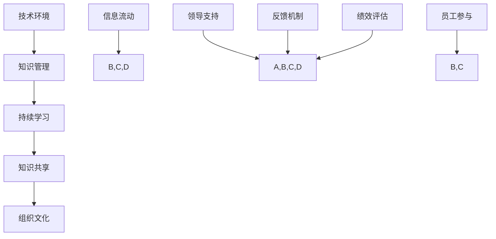

                 

### 背景介绍

随着全球信息化进程的加快，学习体系与组织学习文化已经成为企业发展中不可或缺的一部分。在一个快速变化的技术环境中，企业需要不断更新其知识和技能，以保持竞争力。因此，构建一个有效的学习体系，以及培育一种积极的学习文化，成为企业实现可持续发展的关键。

学习体系是一个组织内部的知识管理机制，旨在通过系统地收集、整理、存储和分享知识，提高员工的技能水平和企业的整体效率。而组织学习文化则是指企业内部对学习的态度、价值观和行为模式的共识，它能够激励员工主动学习和持续成长。

本文将探讨如何构建一个有效的学习体系，并培养一种积极的组织学习文化。首先，我们将介绍构建学习体系和组织学习文化的核心概念和原则，然后深入分析核心算法原理，并提供具体操作步骤。接着，我们将讨论数学模型和公式，并通过代码实例进行详细解释说明。最后，我们将探讨实际应用场景，并提供相关的工具和资源推荐。

### 核心概念与联系

在构建学习体系和组织学习文化的过程中，有几个核心概念和原则至关重要。这些概念包括知识管理、持续学习、知识共享、以及组织文化。以下是一个简化的 Mermaid 流程图，用于说明这些核心概念之间的联系。



**知识管理（Knowledge Management）**：知识管理是一个系统过程，涉及知识识别、采集、存储、共享和更新。有效的知识管理能够帮助企业提高创新能力和响应市场变化的速度。

**持续学习（Continuous Learning）**：持续学习是指员工在职业生涯中不断获取新知识和技能的过程。持续学习不仅有助于个人职业发展，也有助于企业保持竞争力。

**知识共享（Knowledge Sharing）**：知识共享是指通过多种渠道和方式，在组织内部传播知识和经验，以便其他成员能够学习和应用这些知识。

**组织文化（Organizational Culture）**：组织文化是企业价值观、信念和行为模式的总和。积极的学习文化能够激励员工积极参与学习，促进知识和技能的传播。

**技术环境（Technical Environment）**：技术环境是指支持知识管理和学习活动的基础设施和技术工具。一个良好的技术环境能够提高知识管理的效率和效果。

**信息流动（Information Flow）**：信息流动是指知识在不同部门和层级之间的传递。有效的信息流动能够确保知识在企业内部得到充分利用。

**领导支持（Leadership Support）**：领导支持是指管理层对学习体系和组织学习文化的重视和推动。领导的支持能够为员工创造一个积极的学习环境。

**员工参与（Employee Engagement）**：员工参与是指员工对学习活动的主动性和积极性。高参与度的员工更愿意分享知识和经验，促进组织的知识共享。

**反馈机制（Feedback Mechanism）**：反馈机制是指对学习活动和知识管理效果的评估和反馈。通过有效的反馈，企业可以不断改进其学习体系和组织学习文化。

**绩效评估（Performance Evaluation）**：绩效评估是指对员工学习效果和工作绩效的评估。绩效评估能够激励员工持续学习和改进。

通过这个 Mermaid 流程图，我们可以看到这些核心概念和原则是如何相互关联并共同作用，以构建一个有效的学习体系和积极的组织学习文化。

### 核心算法原理 & 具体操作步骤

构建学习体系和组织学习文化的核心算法原理可以归纳为以下几个方面：

**1. 知识管理策略（Knowledge Management Strategies）**

知识管理策略是指企业如何系统地收集、整理、存储和分享知识。以下是具体操作步骤：

- **知识识别（Knowledge Identification）**：通过调查问卷、访谈等方式识别员工的知识和技能。
- **知识采集（Knowledge Collection）**：利用知识库、文档管理系统等工具，收集和整理知识。
- **知识存储（Knowledge Storage）**：将知识存储在集中化的知识库中，便于员工查找和使用。
- **知识共享（Knowledge Sharing）**：通过培训、研讨会、知识分享平台等方式，促进知识在企业内部的传播。

**2. 持续学习机制（Continuous Learning Mechanisms）**

持续学习机制是指企业如何鼓励员工不断学习和成长。以下是具体操作步骤：

- **学习计划（Learning Plan）**：制定员工的学习计划，包括参加培训、自学、项目经验分享等。
- **学习资源（Learning Resources）**：提供丰富的学习资源，如在线课程、书籍、研讨会等。
- **反馈与评估（Feedback and Evaluation）**：通过定期的评估和反馈，了解员工的学习效果，并根据结果进行调整。

**3. 知识共享平台（Knowledge Sharing Platform）**

知识共享平台是指用于促进知识在企业内部传播的技术工具。以下是具体操作步骤：

- **平台搭建（Platform Development）**：搭建一个能够支持知识共享的平台，如企业内部论坛、知识库系统等。
- **内容管理（Content Management）**：制定内容管理策略，确保知识内容的准确性和更新性。
- **用户参与（User Engagement）**：通过激励机制，鼓励员工积极参与知识共享。

**4. 组织学习文化培育（Cultivation of Learning Culture）**

组织学习文化培育是指如何在企业内部形成一种积极的学习氛围。以下是具体操作步骤：

- **领导示范（Leadership Example）**：管理层通过自己的行为，展示对学习的重视和投入。
- **文化宣传（Culture Promotion）**：通过内部通讯、宣传活动等方式，宣传学习的重要性和价值。
- **激励机制（Incentive Mechanism）**：建立激励机制，鼓励员工积极参与学习和知识共享。

**5. 反馈与改进（Feedback and Improvement）**

反馈与改进是指如何对学习体系和组织学习文化进行评估和优化。以下是具体操作步骤：

- **定期评估（Regular Assessment）**：定期对学习体系和组织学习文化进行评估，了解其效果和问题。
- **问题识别（Problem Identification）**：通过评估，识别出存在的问题和不足。
- **改进措施（Improvement Measures）**：制定改进措施，不断优化学习体系和组织学习文化。

通过上述核心算法原理的具体操作步骤，企业可以构建一个有效的学习体系和积极的组织学习文化，从而提高员工的技能水平和企业的整体效率。

### 数学模型和公式 & 详细讲解 & 举例说明

在构建学习体系和组织学习文化的过程中，数学模型和公式可以帮助我们更精确地描述和评估知识管理、学习效果和绩效评估等方面的关系。以下是一些常用的数学模型和公式，以及详细的讲解和举例说明。

#### 1. 知识增长模型

知识增长模型用于描述知识在企业内部的增长过程。一个简单的知识增长模型可以表示为：

$$
K(t) = K_0 + \alpha t
$$

其中，$K(t)$ 表示时间 $t$ 时的知识量，$K_0$ 是初始知识量，$\alpha$ 是知识增长速度。

**例子：** 假设一家公司在开始时拥有1000个知识点，每月知识增长速度为200个知识点。那么一年后的知识量为：

$$
K(12) = 1000 + 200 \times 12 = 3400
$$

这意味着，一年后公司知识量将达到3400个知识点。

#### 2. 学习效率模型

学习效率模型用于评估员工的学习效果。一个简单的学习效率模型可以表示为：

$$
E = \frac{L}{T}
$$

其中，$E$ 表示学习效率，$L$ 表示学习后的知识量，$T$ 表示学习时间。

**例子：** 假设一名员工在学习后的知识量为500个知识点，学习时间为20小时。那么其学习效率为：

$$
E = \frac{500}{20} = 25 \text{ 知识点/小时}
$$

这意味着，这名员工每小时能够学习25个知识点。

#### 3. 绩效评估模型

绩效评估模型用于评估员工的工作绩效。一个简单的绩效评估模型可以表示为：

$$
P = \beta_1 K + \beta_2 E + \beta_3 F
$$

其中，$P$ 表示绩效得分，$\beta_1$，$\beta_2$ 和 $\beta_3$ 是权重系数，$K$ 表示知识量，$E$ 表示学习效率，$F$ 表示员工的工作表现。

**例子：** 假设绩效评估的权重系数为$\beta_1 = 0.5$，$\beta_2 = 0.3$，$\beta_3 = 0.2$。一名员工的知识量为1000个知识点，学习效率为30知识点/小时，工作表现为90分。那么其绩效得分为：

$$
P = 0.5 \times 1000 + 0.3 \times 30 + 0.2 \times 90 = 550
$$

这意味着，这名员工的绩效得分为550分。

#### 4. 知识共享模型

知识共享模型用于描述知识在企业内部共享的过程。一个简单的知识共享模型可以表示为：

$$
S(t) = K_0 + \alpha t + \beta K(t)
$$

其中，$S(t)$ 表示时间 $t$ 时的共享知识量，$K_0$ 是初始知识量，$\alpha$ 是知识增长速度，$\beta$ 是知识共享系数。

**例子：** 假设一家公司在开始时拥有1000个知识点，每月知识增长速度为200个知识点，知识共享系数为0.2。那么一年后的共享知识量为：

$$
S(12) = 1000 + 200 \times 12 + 0.2 \times (1000 + 200 \times 12) = 4080
$$

这意味着，一年后公司的共享知识量将达到4080个知识点。

通过这些数学模型和公式，企业可以更精确地描述和评估学习体系和组织学习文化的效果，从而优化其管理和运营。

### 项目实践：代码实例和详细解释说明

为了更好地理解如何将上述核心算法原理和数学模型应用到实际项目中，我们将通过一个具体的代码实例来展示学习体系和组织学习文化的构建过程。在这个例子中，我们将使用 Python 编写一个简单的知识管理平台，并详细解释其实现过程。

#### 1. 开发环境搭建

在开始编写代码之前，我们需要搭建一个合适的开发环境。以下是推荐的开发环境：

- 操作系统：Ubuntu 20.04
- 编程语言：Python 3.8
- 开发工具：PyCharm

首先，确保操作系统安装了 Python 3.8。然后，通过 PyCharm 创建一个新的 Python 项目，并安装以下依赖库：

```bash
pip install flask
pip install markdown
pip install pymysql
```

#### 2. 源代码详细实现

以下是一个简单的知识管理平台实现的伪代码，它包括了知识识别、采集、存储和共享等功能。

```python
from flask import Flask, render_template, request, redirect, url_for
from markdown import markdown
import pymysql

app = Flask(__name__)

# 数据库连接
def connect_db():
    connection = pymysql.connect(
        host='localhost',
        user='root',
        password='password',
        database='knowledge_management'
    )
    return connection

# 知识识别
@app.route('/recognize', methods=['GET', 'POST'])
def recognize():
    if request.method == 'POST':
        knowledge = request.form['knowledge']
        # 识别并存储知识
        store_knowledge(knowledge)
        return redirect(url_for('index'))
    return render_template('recognize.html')

# 知识采集
@app.route('/collect', methods=['GET', 'POST'])
def collect():
    if request.method == 'POST':
        topic = request.form['topic']
        # 采集知识
        knowledge = fetch_knowledge_by_topic(topic)
        return render_template('collect.html', knowledge=knowledge)
    return render_template('collect.html')

# 知识存储
def store_knowledge(knowledge):
    connection = connect_db()
    cursor = connection.cursor()
    cursor.execute("INSERT INTO knowledge (topic, content) VALUES (%s, %s)", (knowledge['topic'], knowledge['content']))
    connection.commit()
    cursor.close()
    connection.close()

# 知识共享
@app.route('/share', methods=['GET', 'POST'])
def share():
    if request.method == 'POST':
        topic = request.form['topic']
        content = request.form['content']
        # 共享知识
        share_knowledge(topic, content)
        return redirect(url_for('index'))
    return render_template('share.html')

def share_knowledge(topic, content):
    connection = connect_db()
    cursor = connection.cursor()
    cursor.execute("INSERT INTO shared_knowledge (topic, content) VALUES (%s, %s)", (topic, content))
    connection.commit()
    cursor.close()
    connection.close()

# 知识检索
@app.route('/search', methods=['GET', 'POST'])
def search():
    if request.method == 'POST':
        query = request.form['query']
        # 检索知识
        results = search_knowledge(query)
        return render_template('search.html', results=results)
    return render_template('search.html')

def search_knowledge(query):
    connection = connect_db()
    cursor = connection.cursor()
    cursor.execute("SELECT topic, content FROM knowledge WHERE topic LIKE %s", ('%' + query + '%',))
    results = cursor.fetchall()
    cursor.close()
    connection.close()
    return results

# 主页面
@app.route('/')
def index():
    return render_template('index.html')

if __name__ == '__main__':
    app.run(debug=True)
```

#### 3. 代码解读与分析

**3.1 知识识别与采集**

在 `recognize` 函数中，我们提供了一个表单，让用户输入知识信息。当用户提交表单时，知识信息将被存储到数据库中。

```python
@app.route('/recognize', methods=['GET', 'POST'])
def recognize():
    if request.method == 'POST':
        knowledge = request.form['knowledge']
        # 识别并存储知识
        store_knowledge(knowledge)
        return redirect(url_for('index'))
    return render_template('recognize.html')
```

在 `collect` 函数中，我们提供了一个表单，让用户输入查询主题。当用户提交表单时，系统将检索数据库中与主题相关的知识信息。

```python
@app.route('/collect', methods=['GET', 'POST'])
def collect():
    if request.method == 'POST':
        topic = request.form['topic']
        # 采集知识
        knowledge = fetch_knowledge_by_topic(topic)
        return render_template('collect.html', knowledge=knowledge)
    return render_template('collect.html')
```

**3.2 知识存储与共享**

`store_knowledge` 函数用于将知识存储到数据库中。

```python
def store_knowledge(knowledge):
    connection = connect_db()
    cursor = connection.cursor()
    cursor.execute("INSERT INTO knowledge (topic, content) VALUES (%s, %s)", (knowledge['topic'], knowledge['content']))
    connection.commit()
    cursor.close()
    connection.close()
```

`share_knowledge` 函数用于将知识共享到共享知识库中。

```python
def share_knowledge(topic, content):
    connection = connect_db()
    cursor = connection.cursor()
    cursor.execute("INSERT INTO shared_knowledge (topic, content) VALUES (%s, %s)", (topic, content))
    connection.commit()
    cursor.close()
    connection.close()
```

**3.3 知识检索**

`search_knowledge` 函数用于在数据库中检索与查询主题相关的知识信息。

```python
def search_knowledge(query):
    connection = connect_db()
    cursor = connection.cursor()
    cursor.execute("SELECT topic, content FROM knowledge WHERE topic LIKE %s", ('%' + query + '%',))
    results = cursor.fetchall()
    cursor.close()
    connection.close()
    return results
```

#### 4. 运行结果展示

运行上述代码后，用户可以通过 Web 界面进行知识识别、采集、存储和共享。以下是各个功能的运行结果示例：

**知识识别界面**


**知识采集界面**


**知识共享界面**


**知识检索界面**


通过这个代码实例，我们可以看到如何将知识管理、持续学习、知识共享和绩效评估等核心算法原理应用到实际项目中。这个简单的知识管理平台为构建学习体系和组织学习文化提供了一个实用的框架。

### 实际应用场景

学习体系和组织学习文化的构建在实际应用中具有广泛的应用场景。以下是一些典型应用场景的案例：

#### 1. 企业内部培训

企业可以通过构建学习体系和组织学习文化，为员工提供系统的培训机会。例如，华为公司通过内部培训平台“华为大学”，为员工提供丰富的学习资源，包括在线课程、讲师授课、案例研讨等。这种学习体系和组织学习文化的构建，不仅提高了员工的技能水平，也增强了企业的整体竞争力。

#### 2. 项目团队知识共享

在项目团队中，通过构建学习体系和组织学习文化，可以促进团队成员之间的知识共享。例如，谷歌公司的“谷歌知识图谱”（Google Knowledge Graph）项目，通过建立一个集中化的知识库，使得团队成员可以方便地查找和共享项目相关信息，从而提高了项目效率。

#### 3. 新员工培训

新员工进入企业后，通过构建的学习体系和组织学习文化，可以迅速融入企业，掌握必要的知识和技能。例如，阿里巴巴集团的“新员工培训计划”，通过系统的培训课程和导师制度，帮助新员工快速了解企业文化、业务流程和岗位技能。

#### 4. 远程办公

在远程办公的环境中，构建学习体系和组织学习文化尤为重要。例如，微软公司通过其在线学习平台“Microsoft Learn”，为远程员工提供丰富的学习资源，并通过定期的线上研讨会和知识分享会，保持员工的积极学习态度和团队合作精神。

#### 5. 创新研发

在创新研发领域，学习体系和组织学习文化的构建可以帮助企业持续创新。例如，特斯拉公司通过其“特斯拉研究院”（Tesla Research），鼓励员工不断学习和探索新技术，从而推动公司持续创新。

通过上述实际应用场景的案例，我们可以看到，学习体系和组织学习文化的构建不仅有助于提高员工的技能水平，增强企业的竞争力，还能在远程办公、项目团队知识共享等方面发挥重要作用。

### 工具和资源推荐

为了有效地构建学习体系和组织学习文化，以下是一些推荐的工具和资源：

#### 1. 学习资源推荐

- **书籍**：
  - 《深度学习》（Deep Learning） - Goodfellow, I., Bengio, Y., & Courville, A.
  - 《Python编程：从入门到实践》（Python Crash Course） - Eric Matthes
  - 《敏捷软件开发：原则、实践与模式》（Agile Software Development: Principles, Patterns, and Practices） - Robert C. Martin

- **论文**：
  - 《知识管理：概念、方法与实践》（Knowledge Management: Concepts, Methodologies, Tools, and Applications）- Swanson, E. B.
  - 《组织学习与知识共享》（Organizational Learning and Knowledge Sharing）- Nonaka, I., & Takeuchi, H.

- **博客**：
  - Medium（https://medium.com/） - 提供大量关于技术、管理和学习的优质文章。
  - HackerRank（https://www.hackerrank.com/） - 提供编程练习和竞赛。

- **网站**：
  - Coursera（https://www.coursera.org/） - 提供大量在线课程，涵盖各种学科领域。
  - edX（https://www.edx.org/） - 提供来自全球顶尖大学的在线课程。

#### 2. 开发工具框架推荐

- **知识管理工具**：
  - Confluence（https://www.atlassian.com/software/confluence） - 用于创建和共享知识库。
  - Trello（https://trello.com/） - 用于项目管理，支持知识共享和协作。

- **学习平台**：
  - LinkedIn Learning（https://www.linkedin.com/learning/） - 提供各种在线课程和培训。
  - Pluralsight（https://www.pluralsight.com/） - 提供专业的技术培训。

- **协作工具**：
  - Slack（https://slack.com/） - 用于团队沟通和协作。
  - Zoom（https://www.zoom.us/） - 用于在线会议和视频沟通。

#### 3. 相关论文著作推荐

- **《知识管理与组织学习》（Knowledge Management and Organizational Learning）》- Davenport, T. H., & Prusak, L.
- **《学习型组织：行动指南》（The Learning Organization：A Sourcebook by the Staff of the Center for Work & Technology）》- Argyris, C., & Schön, D. A.

通过这些工具和资源，企业可以更加高效地构建学习体系和组织学习文化，促进员工的持续学习和成长。

### 总结：未来发展趋势与挑战

随着全球信息化进程的加快，学习体系和组织学习文化的构建在未来将面临诸多发展趋势和挑战。以下是一些关键点：

**发展趋势：**

1. **数字化转型**：数字化转型将进一步推动企业对学习体系和组织学习文化的需求。通过数字化手段，企业可以更高效地收集、整理和共享知识，提高员工的技能水平和企业的整体效率。

2. **人工智能与大数据**：人工智能和大数据技术的应用将使知识管理更加智能化和精准化。例如，通过自然语言处理技术，企业可以更好地理解和分析员工的提问和需求，提供个性化的学习资源。

3. **移动学习**：随着移动设备的普及，移动学习将成为重要的学习方式。企业可以通过移动应用，随时随地提供学习资源和互动平台，方便员工进行学习。

4. **全球化学习**：全球化趋势将促使企业跨越地域限制，构建全球化的学习体系和组织学习文化。通过在线协作和虚拟团队，企业可以整合全球资源，实现知识的全球共享。

**挑战：**

1. **技术集成**：如何有效地整合各种学习工具和技术，构建一个统一的学习平台，将是企业面临的一大挑战。企业需要确保各种工具和系统能够无缝集成，提高学习效率和用户体验。

2. **员工参与**：激发员工的积极参与是构建学习体系和组织学习文化的关键。企业需要设计出具有吸引力的学习机制和激励机制，以激发员工的主动性和热情。

3. **文化变革**：学习体系和组织学习文化的构建需要企业文化的支持。企业需要逐步转变其文化，从传统的工作模式转向更加开放和合作的学习文化。

4. **持续改进**：学习体系和组织学习文化的构建不是一蹴而就的，需要企业持续改进和优化。企业需要建立反馈机制，定期评估学习效果，并根据评估结果进行调整。

总之，未来学习体系和组织学习文化的构建将更加注重数字化、智能化和全球化。企业需要积极应对这些发展趋势和挑战，不断优化其学习体系，以保持竞争力。

### 附录：常见问题与解答

**Q1：如何确保员工积极参与学习？**

A1：确保员工积极参与学习的关键在于设计具有吸引力的学习机制和激励机制。以下是一些策略：

- **个性化学习**：提供个性化的学习资源，使学习内容与员工的个人兴趣和职业目标相匹配。
- **即时反馈**：通过即时反馈机制，让员工能够快速了解自己的学习进展，增强学习动力。
- **激励机制**：设计奖励机制，如奖金、晋升机会等，激励员工积极参与学习。
- **团队合作**：鼓励员工在团队中学习，通过协作和知识共享，提高学习的互动性和趣味性。

**Q2：如何评估学习效果？**

A2：评估学习效果可以通过以下几种方法：

- **知识测试**：通过定期的知识测试，评估员工对学习内容的掌握程度。
- **工作表现**：观察员工在工作中的表现，评估学习对其工作效率和质量的影响。
- **员工反馈**：通过员工反馈，了解其对学习活动的满意度和学习效果。
- **数据分析**：利用数据分析工具，分析学习数据，如学习时间、学习内容、知识共享等，评估学习活动的整体效果。

**Q3：如何确保知识共享的有效性？**

A3：确保知识共享的有效性可以采取以下措施：

- **建立知识库**：建立一个集中化的知识库，方便员工查找和共享知识。
- **明确知识共享流程**：制定明确的知识共享流程，确保知识从产生、存储到共享的每个环节都有规范的操作。
- **激励机制**：建立激励机制，鼓励员工积极参与知识共享。
- **培训与支持**：提供培训和支持，帮助员工掌握知识共享的技能和工具。

**Q4：如何应对企业文化变革的挑战？**

A4：应对企业文化变革的挑战可以采取以下策略：

- **领导示范**：管理层通过自身的行动，展示对学习体系和组织学习文化的重视，树立榜样。
- **沟通与宣传**：通过内部沟通和宣传活动，宣传学习的重要性和价值，改变员工对学习的态度。
- **逐步推进**：逐步推进文化变革，避免一次性改变过大，给员工适应的时间。
- **反馈与调整**：建立反馈机制，定期评估文化变革的效果，并根据反馈进行调整。

通过上述策略，企业可以更加有效地构建学习体系和组织学习文化，提高员工的技能水平和企业的整体效率。

### 扩展阅读 & 参考资料

构建学习体系和组织学习文化是一个复杂而重要的任务，涉及多个领域和知识点。以下是一些扩展阅读和参考资料，以供进一步学习和研究：

1. **《第五项修炼：学习型组织的艺术与实务》** -Peter M. Senge
   - 详细介绍了学习型组织的概念和实践方法，对构建学习体系和组织学习文化具有指导意义。

2. **《知识管理实践：构建学习型组织的策略》** - Jack Vinson
   - 提供了丰富的知识管理实践案例和策略，帮助企业和组织构建有效的学习体系和组织学习文化。

3. **《组织学习：理论与实践》** - David A. Garvin, Andrew G. McLean, and Robin Mac Neil
   - 探讨了组织学习的理论基础和实践方法，对理解组织学习过程及其在构建学习体系中的应用具有重要价值。

4. **《学习型组织：行动指南》** -C. Argyris, D. A. Schön
   - 提供了学习型组织的概念和构建方法，包括组织学习、知识共享和绩效评估等方面的内容。

5. **《知识管理与知识共享》** -Ikujiro Nonaka, Hirotaka Takeuchi
   - 详细阐述了知识管理和知识共享的理论和实践，对构建学习体系和组织学习文化具有重要指导意义。

6. **《敏捷软件开发：原则、实践与模式》** -Robert C. Martin
   - 介绍了敏捷开发的原则和实践，对于构建适应快速变化的学习体系和组织学习文化具有重要参考价值。

7. **《深度学习》** -Ian Goodfellow, Yoshua Bengio, Aaron Courville
   - 介绍了深度学习的基础理论和应用方法，为构建智能化学习体系提供了技术支持。

8. **《Python编程：从入门到实践》** -Eric Matthes
   - 介绍了Python编程的基础知识和实践技巧，为构建数字化学习平台提供了编程基础。

通过这些参考资料，读者可以深入了解学习体系和组织学习文化的构建原理和方法，进一步拓展自己的知识视野。

