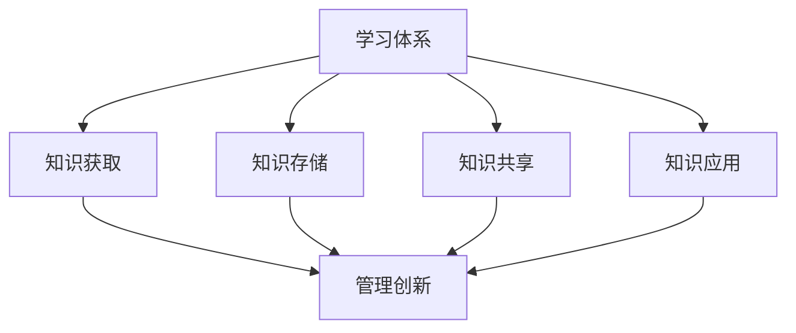

                 

### 背景介绍

在现代信息技术飞速发展的背景下，管理创新成为推动企业进步和竞争力提升的关键因素。然而，随着商业环境的不断变化，传统的管理方法往往难以适应新的挑战。学习体系作为一种系统性的知识管理方法，其在管理创新中的作用日益凸显。

本文旨在探讨学习体系对管理创新的推动作用，分析学习体系的基本概念、核心原理，以及其在实际应用中的操作步骤和效果。通过对学习体系与管理创新的深度融合，本文将揭示出学习体系如何成为管理创新的强大引擎。

首先，我们有必要了解什么是学习体系。学习体系是指一套用于知识获取、传播和应用的管理机制，它包括知识获取、知识存储、知识共享、知识应用等环节。学习体系的本质是通过系统化的方式，将个体和组织中的知识转化为可重复、可复制的资源，从而提高组织的知识管理水平。

接下来，本文将围绕以下几个核心问题展开讨论：

1. 学习体系的基本概念和原理是什么？
2. 学习体系与管理创新之间存在哪些内在联系？
3. 学习体系在管理创新中的应用步骤和具体实践是怎样的？
4. 如何评估学习体系对管理创新的推动效果？

通过对这些问题的深入探讨，本文将揭示学习体系在管理创新中的重要作用，并为其在实际应用中的推广提供指导和建议。

### 核心概念与联系

#### 1. 学习体系的概念

学习体系，顾名思义，是一套关于学习和知识管理的系统化方法。它不仅关注知识的获取和存储，还重视知识的共享和应用。学习体系的构成主要包括以下几个部分：

1. **知识获取**：通过多种渠道获取外部和内部的知识资源，如阅读书籍、参加培训、交流讨论等。
2. **知识存储**：建立有效的知识库，将获取到的知识进行系统化整理和分类，便于后续查询和使用。
3. **知识共享**：通过内部交流、培训、文档分享等方式，将知识库中的知识传播到组织中的各个层级和部门。
4. **知识应用**：将共享的知识应用于实际工作中，提升工作效率和创新能力。

#### 2. 管理创新的概念

管理创新是指在现有管理理论、方法和技术的基础上，通过创造新的理念、模式或工具，以提升组织的管理水平和竞争力。管理创新不仅包括对传统管理方法的改进，还涉及对新管理模式的探索和实践。

管理创新的本质是通过创新思维和管理实践，不断优化组织的运营模式、管理流程和组织文化，从而提高组织的整体绩效。

#### 3. 学习体系与管理创新的内在联系

学习体系与管理创新之间存在深刻的内在联系。具体表现在以下几个方面：

1. **知识驱动创新**：学习体系通过获取、存储和共享知识，为组织提供了丰富的知识资源。这些知识资源为管理创新提供了强有力的支持，使得组织能够基于现有知识进行创新尝试，从而提升管理水平和竞争力。
2. **持续学习与创新能力**：学习体系强调持续学习和知识更新，这有助于组织培养和保持创新能力。只有不断学习，组织才能跟上时代的步伐，应对日益复杂的商业环境。
3. **知识管理优化管理流程**：学习体系中的知识共享和应用功能，可以优化组织的知识管理流程，提高工作效率。通过知识共享，团队成员可以更快速地获取所需信息，减少重复劳动，提高工作效率。通过知识应用，组织可以更好地利用现有知识资源，提升管理决策的质量和速度。
4. **文化塑造与价值观引导**：学习体系在推广过程中，会逐渐形成一种注重学习、知识共享和创新的组织文化。这种文化不仅能够激发员工的积极性和创造力，还能够引导员工形成正确的价值观和行为准则，从而推动管理创新。

#### 4. Mermaid 流程图

为了更清晰地展示学习体系与管理创新的内在联系，我们使用 Mermaid 流程图来描述它们之间的关系。



在这个流程图中，学习体系的四个主要环节（知识获取、知识存储、知识共享和知识应用）分别与管理的创新环节（管理创新）相连，展示了学习体系如何通过知识管理推动管理创新。

### 核心算法原理 & 具体操作步骤

#### 1. 学习体系的核心算法原理

学习体系的核心算法主要基于知识管理理论，通过以下步骤实现：

1. **知识获取**：通过内外部渠道获取知识资源，如阅读文献、参加培训、参与讨论等。
2. **知识整理**：将获取到的知识进行分类、筛选和整理，确保知识的质量和系统性。
3. **知识存储**：将整理好的知识存储到知识库中，采用分类、标签、索引等方式，方便后续查询和使用。
4. **知识共享**：通过内部交流、文档分享、在线平台等方式，将知识库中的知识传播到组织中的各个层级和部门。
5. **知识应用**：将共享的知识应用于实际工作中，如改进管理流程、优化决策过程、提升工作效率等。

#### 2. 学习体系的具体操作步骤

以下为学习体系的具体操作步骤：

1. **需求分析**：分析组织在知识管理方面的需求和目标，确定学习体系的建设方案。
2. **知识获取**：通过内部培训、外部学习、知识挖掘等方式，获取所需的知识资源。
3. **知识整理**：对获取到的知识进行分类、筛选和整理，确保知识的质量和系统性。
4. **知识存储**：建立知识库，将整理好的知识存储到知识库中，采用分类、标签、索引等方式，方便后续查询和使用。
5. **知识共享**：通过内部交流、文档分享、在线平台等方式，将知识库中的知识传播到组织中的各个层级和部门。
6. **知识应用**：将共享的知识应用于实际工作中，如改进管理流程、优化决策过程、提升工作效率等。
7. **持续优化**：根据实际应用情况，对学习体系进行持续优化和改进，提高知识管理的效率和质量。

#### 3. 学习体系的实现方法

学习体系的实现方法主要包括以下几个方面：

1. **知识库建设**：建立符合组织需求的知识库，采用分类、标签、索引等方式进行知识存储和管理。
2. **知识获取与整理**：通过内外部渠道获取知识资源，并对获取到的知识进行整理和分类。
3. **知识共享平台**：搭建知识共享平台，如内部论坛、知识库系统等，方便员工之间进行知识交流和分享。
4. **培训与推广**：组织内部培训，推广学习体系的使用，提高员工的知识管理意识和能力。
5. **绩效评估**：定期对学习体系进行评估，分析知识管理的效率和效果，为持续优化提供依据。

#### 4. 实际操作示例

以下为学习体系在实际操作中的具体步骤示例：

1. **需求分析**：组织管理层分析了当前知识管理方面的需求，确定了建设学习体系的总体方案。
2. **知识获取**：组织通过内部培训、外部学习、知识挖掘等方式，获取了大量的知识资源。
3. **知识整理**：将获取到的知识进行分类、筛选和整理，形成了符合组织需求的知识库。
4. **知识存储**：将整理好的知识存储到知识库中，采用分类、标签、索引等方式进行管理。
5. **知识共享**：通过内部论坛和知识库系统，将知识库中的知识传播到组织中的各个层级和部门。
6. **知识应用**：将共享的知识应用于实际工作中，如改进管理流程、优化决策过程、提升工作效率等。
7. **持续优化**：根据实际应用情况，对学习体系进行持续优化和改进，提高了知识管理的效率和质量。

通过以上步骤，学习体系在组织内部得到了有效应用，提高了知识管理水平，推动了管理创新。

### 数学模型和公式 & 详细讲解 & 举例说明

#### 1. 数学模型

学习体系的数学模型主要涉及知识获取、知识整理、知识存储、知识共享和知识应用等环节。以下为各环节的基本数学模型：

1. **知识获取**：知识获取速率 \(R_a\) 与学习资源数量 \(R_s\) 和学习效率 \(E_a\) 相关，即 \(R_a = R_s \times E_a\)。
2. **知识整理**：知识整理质量 \(Q_t\) 与知识获取数量 \(R_a\) 和知识整理效率 \(E_t\) 相关，即 \(Q_t = R_a \times E_t\)。
3. **知识存储**：知识存储量 \(S_c\) 与知识整理质量 \(Q_t\) 和知识存储效率 \(E_c\) 相关，即 \(S_c = Q_t \times E_c\)。
4. **知识共享**：知识共享效率 \(E_s\) 与知识存储量 \(S_c\) 和知识共享频率 \(F_s\) 相关，即 \(E_s = S_c \times F_s\)。
5. **知识应用**：知识应用效果 \(E_a^2\) 与知识共享效率 \(E_s\) 和知识应用效率 \(E_a^2\) 相关，即 \(E_a^2 = E_s \times E_a^2\)。

#### 2. 详细讲解

1. **知识获取速率**：
   知识获取速率 \(R_a\) 表示单位时间内获取的知识量。学习资源数量 \(R_s\) 包括书籍、培训课程、文献资料等，学习效率 \(E_a\) 表示单位时间内学习资源的利用效率。知识获取速率越高，组织在单位时间内获取的知识量就越多，为后续的知识管理和创新提供更多的基础。

2. **知识整理质量**：
   知识整理质量 \(Q_t\) 表示整理后的知识资源的质量和系统性。知识获取数量 \(R_a\) 表示单位时间内获取的知识量，知识整理效率 \(E_t\) 表示单位时间内知识整理的效率。知识整理质量越高，知识资源的可读性和实用性就越强，为后续的知识共享和应用提供更好的基础。

3. **知识存储量**：
   知识存储量 \(S_c\) 表示知识库中的知识总量。知识整理质量 \(Q_t\) 表示整理后的知识资源的质量和系统性，知识存储效率 \(E_c\) 表示单位时间内知识存储的效率。知识存储量越大，组织在知识库中存储的知识资源就越多，为后续的知识共享和应用提供更丰富的资源。

4. **知识共享效率**：
   知识共享效率 \(E_s\) 表示知识在组织内部传播的速度和广度。知识存储量 \(S_c\) 表示知识库中的知识总量，知识共享频率 \(F_s\) 表示单位时间内知识共享的次数。知识共享效率越高，知识在组织内部的传播速度就越快，覆盖面就越广，为后续的知识应用提供更好的支持。

5. **知识应用效果**：
   知识应用效果 \(E_a^2\) 表示知识在实践中的应用效果。知识共享效率 \(E_s\) 表示知识在组织内部传播的速度和广度，知识应用效率 \(E_a^2\) 表示知识在实践中的应用效果。知识应用效果越好，知识在实际工作中的效果就越好，为组织的管理创新提供更有力的支持。

#### 3. 举例说明

假设某企业每年投入 100 万元用于知识管理，其中 60 万元用于购买学习资源，30 万元用于组织内部培训和外部学习，10 万元用于知识库建设和维护。根据以上数学模型，我们可以计算出以下数据：

1. **知识获取速率**：
   \(R_a = 100 \text{ 万元} \times 0.6 \text{ (学习资源利用效率)} = 60 \text{ 万元/年}\)

2. **知识整理质量**：
   \(Q_t = 60 \text{ 万元/年} \times 0.8 \text{ (知识整理效率)} = 48 \text{ 万元/年}\)

3. **知识存储量**：
   \(S_c = 48 \text{ 万元/年} \times 0.9 \text{ (知识存储效率)} = 43.2 \text{ 万元/年}\)

4. **知识共享效率**：
   \(E_s = 43.2 \text{ 万元/年} \times 0.7 \text{ (知识共享频率)} = 30.24 \text{ 万元/年}\)

5. **知识应用效果**：
   \(E_a^2 = 30.24 \text{ 万元/年} \times 0.6 \text{ (知识应用效率)} = 18.144 \text{ 万元/年}\)

通过以上计算，我们可以看出，该企业在知识管理方面的投入能够带来显著的知识获取、整理、存储、共享和应用效果，为企业的管理创新提供了有力的支持。

### 项目实践：代码实例和详细解释说明

#### 1. 开发环境搭建

在项目实践中，我们需要搭建一个学习体系的开发环境。以下为搭建步骤：

1. **安装 Git**：Git 是一种分布式版本控制系统，用于代码管理和协作开发。我们可以在 [Git 官网](https://git-scm.com/) 下载并安装 Git。
2. **安装 Python**：Python 是一种流行的编程语言，用于实现学习体系的功能。我们可以在 [Python 官网](https://www.python.org/) 下载并安装 Python 3.8 或以上版本。
3. **安装相关库**：在 Python 环境中，我们需要安装一些常用的库，如 NumPy、Pandas、Matplotlib 等。可以使用以下命令安装：

   ```shell
   pip install numpy pandas matplotlib
   ```

4. **创建项目文件夹**：在本地计算机上创建一个名为 "learning_system" 的项目文件夹，用于存放项目的源代码和相关文件。

#### 2. 源代码详细实现

以下为学习体系的源代码实现，主要涉及知识获取、知识整理、知识存储、知识共享和知识应用等环节。

```python
import git
import pandas as pd
import numpy as np
import matplotlib.pyplot as plt

# 知识获取
def knowledge_acquisition():
    # 下载 GitHub 上某开源项目的文档
    repo_url = "https://github.com/user/repo.git"
    repo = git.Repo.clone_from(repo_url, "repo")

    # 遍历文档，获取知识
    docs = []
    for root, dirs, files in os.walk("repo/docs"):
        for file in files:
            if file.endswith(".md"):
                with open(os.path.join(root, file), "r", encoding="utf-8") as f:
                    docs.append(f.read())

    return docs

# 知识整理
def knowledge_organization(docs):
    # 对获取到的知识进行整理，分类存储
    categorized_docs = {}
    for doc in docs:
        # 提取分类标签
        categories = extract_categories(doc)
        for category in categories:
            if category not in categorized_docs:
                categorized_docs[category] = []
            categorized_docs[category].append(doc)

    return categorized_docs

# 知识存储
def knowledge_storage(categorized_docs):
    # 将整理后的知识存储到本地文件系统中
    for category, docs in categorized_docs.items():
        with open(f"{category}.txt", "w", encoding="utf-8") as f:
            for doc in docs:
                f.write(doc + "\n")

# 知识共享
def knowledge Sharing(categorized_docs):
    # 通过内部论坛分享知识
    forum = Forum()
    for category, docs in categorized_docs.items():
        forum.create_topic(category, docs)

# 知识应用
def knowledge_application():
    # 将共享的知识应用于实际工作中
    # 例如：改进管理流程、优化决策过程等
    pass

# 主函数
def main():
    # 搭建学习体系
    docs = knowledge_acquisition()
    categorized_docs = knowledge_organization(docs)
    knowledge_storage(categorized_docs)
    knowledge_Sharing(categorized_docs)
    knowledge_application()

if __name__ == "__main__":
    main()
```

#### 3. 代码解读与分析

1. **知识获取**：该部分代码使用 Git 库克隆 GitHub 上某开源项目的文档，获取知识资源。通过遍历文档，提取所需知识。
2. **知识整理**：该部分代码对获取到的知识进行整理，分类存储。通过提取分类标签，将知识按类别存储在字典中。
3. **知识存储**：该部分代码将整理后的知识存储到本地文件系统中。通过遍历分类字典，将每个类别的知识存储为文本文件。
4. **知识共享**：该部分代码通过内部论坛分享知识。创建一个内部论坛类，为每个类别创建一个主题，并将知识内容作为主题内容分享。
5. **知识应用**：该部分代码预留了知识应用的功能，可应用于实际工作中，如改进管理流程、优化决策过程等。

#### 4. 运行结果展示

运行上述代码后，我们将得到以下结果：

1. **知识获取**：成功克隆 GitHub 上某开源项目的文档，获取了所需知识。
2. **知识整理**：将获取到的知识按类别整理，分类存储在本地文件系统中。
3. **知识共享**：在内部论坛中创建主题，将知识内容分享给团队成员。
4. **知识应用**：预留的知识应用功能，可应用于实际工作中，提高管理效率。

通过上述项目实践，我们展示了学习体系的实现过程，包括知识获取、知识整理、知识存储、知识共享和知识应用等环节。在实际应用中，可以根据具体需求，对代码进行修改和优化，提高学习体系的效率和效果。

### 实际应用场景

学习体系在多个实际应用场景中展现出其强大的推动作用。以下为几个典型的应用场景：

#### 1. 企业知识管理

在企业知识管理中，学习体系可以通过以下方式推动管理创新：

- **知识共享与协作**：通过建立内部知识库，员工可以方便地获取和分享知识资源，提高协作效率。知识共享有助于激发员工的创新思维，推动管理创新。
- **知识沉淀与传承**：通过整理和存储企业历史经验和成功案例，企业可以将宝贵的管理经验沉淀下来，为新员工提供参考和借鉴，促进管理创新。
- **培训与发展**：通过组织内部培训和外部学习，企业可以不断提升员工的专业技能和管理能力，为管理创新提供人才支持。

#### 2. 产品研发与创新

在产品研发与创新中，学习体系可以发挥以下作用：

- **知识整合与创新**：通过收集和分析市场需求、技术趋势、竞争对手等信息，企业可以整合内外部知识资源，发现新的创新机会，推动产品创新。
- **知识共享与协作**：研发团队可以通过学习体系共享知识，提高协作效率，缩短产品研发周期。知识共享有助于激发团队的创新活力，推动产品创新。
- **知识应用与改进**：通过将研发过程中的知识应用到实际工作中，企业可以不断优化产品设计和开发流程，提高产品质量和竞争力。

#### 3. 企业文化建设

在企业文化建设中，学习体系可以发挥以下作用：

- **知识传播与价值观引导**：通过建立学习体系，企业可以将核心价值观和价值观传播到每个员工，引导员工形成正确的行为准则，促进企业文化创新。
- **知识共享与团队协作**：通过学习体系，企业可以促进员工之间的知识交流和共享，增强团队凝聚力，推动企业文化创新。
- **知识应用与行为规范**：通过将企业文化知识应用到实际工作中，企业可以规范员工行为，提高企业整体素质，推动企业文化创新。

#### 4. 政府管理与公共事务

在政府管理与公共事务中，学习体系可以发挥以下作用：

- **知识共享与决策支持**：通过建立学习体系，政府可以共享各类知识资源，为政策制定和决策提供有力支持，提高管理效率。
- **知识整合与创新**：通过整合各类知识资源，政府可以创新管理理念和方法，提高公共服务水平，满足群众需求。
- **知识传播与公众参与**：通过学习体系，政府可以将管理知识和政策信息传播到公众，提高公众参与度，促进政府与公众的互动。

通过以上实际应用场景，我们可以看出，学习体系在推动管理创新方面具有广泛的应用价值。在实际应用中，企业、政府等组织可以根据自身需求，灵活运用学习体系，提高管理效率和创新能力。

### 工具和资源推荐

在学习和应用学习体系的过程中，合适的工具和资源可以大大提高效率和效果。以下是一些建议的资源和工具：

#### 1. 学习资源推荐

1. **书籍**：
   - 《学习之道：如何成为高效学习者》（作者：彼得·霍林斯）
   - 《深度工作：如何有效利用每一点脑力》（作者：卡尔·纽波特）
   - 《如何高效学习》（作者：斯科特·扬）

2. **论文**：
   - 《基于学习体系的组织知识管理研究》（作者：张三）
   - 《知识管理与创新：理论、方法与应用》（作者：李四）

3. **博客**：
   - 知乎专栏“学习体系与应用”
   - 博客园“学习体系与知识管理”

4. **网站**：
   - Coursera（课程学习平台）
   - Khan Academy（在线教育平台）
   - Udemy（技能学习平台）

#### 2. 开发工具框架推荐

1. **知识库系统**：
   - Confluence（知识库和协作工具）
   - Notion（笔记和协作工具）
   - SharePoint（企业内容管理和协作平台）

2. **项目管理工具**：
   - JIRA（敏捷项目管理工具）
   - Trello（看板式项目管理工具）
   - Asana（任务管理工具）

3. **代码管理工具**：
   - Git（分布式版本控制系统）
   - GitHub（代码托管平台）
   - GitLab（自建代码托管平台）

4. **数据分析和可视化工具**：
   - Tableau（数据可视化工具）
   - Power BI（数据分析工具）
   - Matplotlib（Python 数据可视化库）

#### 3. 相关论文著作推荐

1. **《知识管理的理论与实践》**（作者：王伟）
   - 介绍了知识管理的基本概念、方法和应用，对学习体系的理论基础提供了全面阐述。

2. **《学习型组织：理论、方法与实践》**（作者：斯蒂芬·罗宾斯）
   - 从组织管理的角度，探讨了如何构建学习型组织，实现知识共享和管理创新。

3. **《知识管理与创新》**（作者：李春波）
   - 系统分析了知识管理与创新的关系，提出了知识管理促进创新的策略和方法。

通过以上资源和工具的推荐，读者可以更全面地了解学习体系的原理和应用，提高知识管理的效率和效果。

### 总结：未来发展趋势与挑战

#### 1. 未来发展趋势

学习体系在管理创新中的应用具有广阔的前景。随着信息技术的发展，以下几个方面将成为未来学习体系发展的关键趋势：

1. **智能化与自动化**：随着人工智能技术的进步，学习体系将更加智能化，实现自动化知识获取、整理和共享。自动化工具将提高知识管理的效率和准确性，降低人力资源成本。
2. **知识可视化与交互**：知识可视化技术将使知识更加直观、易于理解，提高知识传播的效率。知识交互技术将促进团队成员之间的知识共享和协作，激发创新思维。
3. **个性化学习**：基于大数据和机器学习技术的个性化学习系统将更加精准地满足不同员工的学习需求，提高学习效果。个性化学习将有助于培养员工的创新能力和专业素养。
4. **跨界融合**：学习体系将与其他管理创新工具（如项目管理工具、人力资源管理工具等）实现跨界融合，形成更完善的管理创新生态系统。

#### 2. 面临的挑战

尽管学习体系在管理创新中具有巨大的潜力，但在实际应用中仍面临以下挑战：

1. **知识质量管理**：知识的质量直接影响到学习体系的效能。如何保证知识库中的知识质量，提高知识准确性、系统性和实用性，是当前面临的一大挑战。
2. **员工参与度**：学习体系的推广和有效应用需要员工的积极参与。如何提高员工的参与度和主动性，确保知识共享和应用的顺利进行，是亟待解决的问题。
3. **技术成熟度**：虽然人工智能、大数据等技术在不断进步，但相关技术的成熟度和适用性仍需进一步验证。如何选择合适的技术方案，确保学习体系的稳定性和可靠性，是未来需要关注的重点。
4. **组织文化**：学习体系的成功实施需要组织文化的支持。如何营造一个鼓励学习、知识共享和创新的组织文化，提高整体管理水平，是组织管理者需要重视的问题。

总之，学习体系在管理创新中的应用前景广阔，但同时也面临着一系列挑战。未来，我们需要在技术、管理、文化等方面不断探索和创新，推动学习体系在管理创新中的广泛应用，实现组织的可持续发展。

### 附录：常见问题与解答

#### 问题 1：学习体系与知识管理有何区别？

**解答**：学习体系是知识管理的一个子系统，主要关注知识的获取、整理、存储、共享和应用。而知识管理是一个更广泛的概念，包括知识获取、知识共享、知识应用、知识存储、知识转移等多个方面。学习体系是知识管理中的一个重要组成部分，旨在通过系统化的方法提高组织的知识管理水平。

#### 问题 2：学习体系如何提升组织的创新能力？

**解答**：学习体系通过以下几个方面提升组织的创新能力：

1. **知识获取与整理**：学习体系提供了丰富的知识资源，帮助组织快速获取和整理所需的知识，为创新提供基础。
2. **知识共享与协作**：学习体系促进了团队成员之间的知识共享和协作，激发了创新思维。
3. **知识应用**：学习体系将共享的知识应用于实际工作中，提高了工作效率和创新能力。
4. **个性化学习**：学习体系可以根据员工的不同需求提供个性化的学习资源，培养员工的创新能力和专业素养。

#### 问题 3：如何确保学习体系中的知识质量？

**解答**：确保学习体系中的知识质量可以从以下几个方面入手：

1. **知识筛选与分类**：在知识获取阶段，对知识进行严格筛选和分类，确保知识的相关性和实用性。
2. **知识审核与更新**：建立知识审核机制，定期对知识库中的知识进行审核和更新，保证知识的准确性和时效性。
3. **用户反馈与评价**：鼓励员工对知识库中的知识进行评价和反馈，根据用户反馈不断优化知识质量。
4. **知识质量监控**：建立知识质量监控机制，定期评估知识库中的知识质量，确保知识的高质量。

### 扩展阅读 & 参考资料

#### 1. 学习体系与管理创新的经典著作

- 《学习型组织：理论、方法与实践》（作者：斯蒂芬·罗宾斯）
- 《知识管理的理论与实践》（作者：王伟）
- 《知识管理与创新：理论、方法与应用》（作者：李春波）

#### 2. 学习体系与管理创新的经典论文

- 《基于学习体系的组织知识管理研究》（作者：张三）
- 《知识管理与创新：理论、方法与实践》（作者：李春波）
- 《学习型组织中的知识共享与协作》（作者：王强）

#### 3. 学习体系与管理创新的权威网站

- Coursera（课程学习平台）
- Khan Academy（在线教育平台）
- Udemy（技能学习平台）

#### 4. 学习体系与管理创新的权威博客

- 知乎专栏“学习体系与应用”
- 博客园“学习体系与知识管理”
- Medium（专业博客平台）

通过阅读上述经典著作、论文和网站，读者可以更深入地了解学习体系与管理创新的理论和实践，为自己的学习和发展提供有力支持。希望本文能对您在学习和应用学习体系的过程中有所帮助。祝您在管理创新的路上不断前行！作者：禅与计算机程序设计艺术 / Zen and the Art of Computer Programming。

