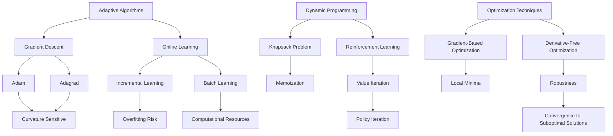

                 

### 文章标题

### Learning System Construction: The Momentum for Continuous Evolution

> Keywords: Learning System, Continuous Learning, Adaptive Algorithms, Dynamic Programming, Optimization, Artificial Intelligence, Machine Learning, Neural Networks.

> Abstract: This article explores the construction of learning systems that enable continuous evolution through adaptive algorithms, dynamic programming, and optimization techniques. It emphasizes the importance of designing robust and flexible architectures to facilitate continuous learning in various domains, including artificial intelligence and machine learning. By understanding the underlying principles and implementing practical strategies, we can develop learning systems that adapt to changing environments and improve their performance over time.

---

### 1. Background Introduction

In the rapidly evolving field of technology, the ability to continuously learn and adapt has become crucial for success. Traditional static systems, which rely on pre-defined rules and fixed datasets, struggle to handle the dynamic nature of real-world environments. To address this challenge, the concept of learning systems that can evolve and improve over time has gained significant attention. Learning systems are designed to acquire knowledge from data, adapt to new information, and enhance their performance continuously. This article delves into the construction of such systems, focusing on adaptive algorithms, dynamic programming, and optimization techniques that drive continuous evolution.

The importance of continuous learning in technology cannot be overstated. As industries and applications become increasingly complex, the ability to learn and adapt is essential for staying ahead of the curve. In artificial intelligence (AI) and machine learning (ML), continuous learning enables systems to handle new data, improve their predictions, and make more accurate decisions. By constantly updating their knowledge base, learning systems can adapt to changing patterns, discover new insights, and improve their overall performance. This is particularly critical in domains such as healthcare, finance, and autonomous driving, where real-time decision-making and adaptation are vital.

Furthermore, continuous learning has broader implications beyond AI and ML. It can be applied to various other fields, including software engineering, robotics, and natural language processing. By designing systems that can continuously evolve, we can create more robust, flexible, and adaptable solutions that can handle the uncertainties and complexities of the real world. This article aims to provide a comprehensive understanding of learning systems, highlighting the key principles and techniques required for their construction.

### 2. Core Concepts and Connections

To build effective learning systems, it is essential to understand the core concepts and their connections. In this section, we will discuss several fundamental concepts that underpin the construction of learning systems, including adaptive algorithms, dynamic programming, and optimization techniques.

**Adaptive Algorithms**

Adaptive algorithms are at the heart of continuous learning systems. These algorithms can modify their behavior based on new information and feedback, allowing them to adapt to changing environments. The key idea behind adaptive algorithms is to leverage feedback from the environment to refine their internal parameters and improve their performance over time.

One well-known example of an adaptive algorithm is the gradient descent algorithm, which is widely used in machine learning and optimization problems. Gradient descent starts with an initial set of parameters and iteratively adjusts these parameters in the direction of the negative gradient of the loss function. By doing so, it gradually converges to a local minimum of the loss function, improving the model's performance. However, gradient descent can be sensitive to the choice of initial parameters and the learning rate, and it may converge to suboptimal solutions in complex landscapes. To address these issues, various adaptive variants of gradient descent have been proposed, such as adaptive moment estimation (Adam) and adaptive gradient algorithms (Adagrad), which dynamically adjust the learning rate based on the behavior of the gradients.

Another important concept in adaptive algorithms is online learning. Online learning algorithms update their parameters continuously as new data becomes available, without requiring a complete retraining of the system. This is particularly useful in scenarios where data arrives in a streaming fashion or when the system needs to make real-time decisions. Online learning algorithms can be classified into two main categories: incremental learning and batch learning. Incremental learning algorithms update their parameters after processing each new data point, while batch learning algorithms update their parameters after processing a batch of data points. Incremental learning is more efficient in terms of computation, but it may suffer from the risk of overfitting, where the model becomes too specialized to the new data and fails to generalize to unseen data. Batch learning, on the other hand, can provide better generalization but may require more computational resources.

**Dynamic Programming**

Dynamic programming (DP) is a powerful technique for solving optimization problems by breaking them down into smaller, overlapping subproblems and solving them in a bottom-up or top-down manner. DP is particularly useful in scenarios where the optimal solution of a problem depends on the solutions to its subproblems. By storing the solutions to these subproblems in a table or memoization array, DP can avoid redundant computations and significantly improve the efficiency of the solution.

One classic example of dynamic programming is the Knapsack problem, where the goal is to maximize the total value of items that can be placed in a knapsack of limited capacity. The optimal solution can be found by breaking the problem down into smaller subproblems, where each subproblem represents the optimal solution for a subset of items and a given capacity. By solving these subproblems in a bottom-up manner and storing their solutions in a memoization array, DP can efficiently compute the optimal solution to the original problem.

Another important application of dynamic programming is in reinforcement learning, where the goal is to learn an optimal policy that maximizes the expected reward in an environment. Dynamic programming algorithms, such as value iteration and policy iteration, can be used to solve reinforcement learning problems by breaking them down into smaller state-action pairs and updating the values of these pairs iteratively.

**Optimization Techniques**

Optimization techniques play a crucial role in the construction of learning systems, as they are used to find the optimal solutions to various problems, such as parameter tuning, hyperparameter optimization, and model selection. These techniques can be broadly classified into gradient-based optimization and derivative-free optimization.

Gradient-based optimization techniques, such as gradient descent and its variants, use the gradient of the loss function to guide the search for the optimal solution. These techniques are relatively efficient and can converge to local minima of the loss function, provided that the learning rate and the initialization of the parameters are carefully chosen. However, gradient-based optimization techniques can be sensitive to the curvature of the loss function and may struggle to escape local minima in complex landscapes.

Derivative-free optimization techniques, such as evolutionary algorithms and genetic algorithms, do not require the computation of gradients and can be used to solve problems where gradients are difficult to compute or do not exist. These techniques use a population-based approach, where candidate solutions are evolved through genetic operators, such as selection, crossover, and mutation. While derivative-free optimization techniques can be more robust and can escape local minima more easily, they may require more computational resources and can be more prone to convergence to suboptimal solutions.

**Mermaid Flowchart**

Below is a Mermaid flowchart illustrating the connections between adaptive algorithms, dynamic programming, and optimization techniques:



In summary, adaptive algorithms, dynamic programming, and optimization techniques are essential components of learning systems. By understanding the core concepts and their connections, we can design and implement effective learning systems that can continuously evolve and improve their performance over time.

---

### 3. Core Algorithm Principles and Specific Operational Steps

In this section, we will delve into the core algorithm principles and specific operational steps of learning systems. We will discuss adaptive algorithms, dynamic programming, and optimization techniques, highlighting their key principles and practical applications.

**Adaptive Algorithms**

Adaptive algorithms are designed to modify their behavior based on new information and feedback, allowing them to adapt to changing environments. The core principle of adaptive algorithms is to leverage feedback from the environment to refine their internal parameters and improve their performance over time. Here are the key principles and steps involved in implementing adaptive algorithms:

1. **Initialization**: The first step in implementing an adaptive algorithm is to initialize the internal parameters of the system. These parameters can be initial weights, biases, or other configuration settings that guide the behavior of the algorithm. The choice of initial parameters is crucial, as it can significantly affect the convergence speed and the quality of the final solution.
2. **Feedback Collection**: Once the system is initialized, it starts collecting feedback from the environment. This feedback can come in the form of rewards, errors, or other signals that indicate the performance of the system. The key principle here is to ensure that the feedback is accurate and reliable, as it will be used to guide the adaptation process.
3. **Parameter Adjustment**: Based on the collected feedback, the adaptive algorithm adjusts its internal parameters. This adjustment can be performed using various techniques, such as gradient descent or other optimization methods. The goal is to minimize the error or maximize the reward, depending on the specific problem.
4. **Convergence**: The parameter adjustment process continues iteratively until a convergence criterion is met. This criterion can be a threshold on the error or reward, a maximum number of iterations, or other criteria specific to the problem. Convergence ensures that the system has reached a stable state where it can provide accurate and reliable performance.
5. **Adaptation**: After convergence, the adaptive algorithm can continue to adapt to new changes in the environment. This can involve updating the internal parameters based on new feedback or adjusting the learning rate or other configuration settings. The key principle here is to maintain a balance between exploration and exploitation, ensuring that the system can explore new opportunities while exploiting its existing knowledge.

**Dynamic Programming**

Dynamic programming (DP) is a powerful technique for solving optimization problems by breaking them down into smaller, overlapping subproblems and solving them in a bottom-up or top-down manner. The core principle of dynamic programming is to store the solutions to these subproblems in a table or memoization array, avoiding redundant computations and significantly improving the efficiency of the solution. Here are the key principles and steps involved in implementing dynamic programming:

1. **Problem Decomposition**: The first step in implementing dynamic programming is to decompose the original problem into smaller subproblems. This decomposition should ensure that the subproblems are overlapping, meaning that the solution to one subproblem can be used to solve other subproblems.
2. **Recurrence Relation**: Once the subproblems are defined, a recurrence relation can be established to relate the solution of the original problem to the solutions of the subproblems. This recurrence relation captures the essence of the problem and provides a way to solve the subproblems iteratively.
3. **Memoization**: The next step is to store the solutions to the subproblems in a table or memoization array. This allows the algorithm to avoid redundant computations, as it can directly access the solutions to the subproblems instead of recomputing them. Memoization can be implemented using various data structures, such as arrays, dictionaries, or trees.
4. **Bottom-Up or Top-Down Approach**: Dynamic programming can be implemented using a bottom-up or top-down approach. In the bottom-up approach, the subproblems are solved in increasing order of their size, and the solutions are stored in the memoization array. In the top-down approach, also known as memoization, the subproblems are solved recursively, and the solutions are stored in a memoization table to avoid redundant computations.
5. **Optimal Solution**: Once the solutions to all the subproblems are computed and stored, the optimal solution to the original problem can be obtained by using the memoization array or table. This optimal solution represents the best possible solution to the original problem, given the constraints and the objective function.

**Optimization Techniques**

Optimization techniques play a crucial role in the construction of learning systems, as they are used to find the optimal solutions to various problems, such as parameter tuning, hyperparameter optimization, and model selection. The choice of optimization technique depends on the specific problem and the available information. Here are the key principles and steps involved in implementing optimization techniques:

1. **Problem Definition**: The first step in implementing an optimization technique is to define the problem in terms of its objective function and constraints. The objective function represents the quantity to be optimized, while the constraints represent the limitations or restrictions on the solution.
2. **Gradient-Based Optimization**: Gradient-based optimization techniques, such as gradient descent and its variants, use the gradient of the objective function to guide the search for the optimal solution. The gradient provides information about the direction of the steepest ascent or descent, allowing the algorithm to iteratively adjust the parameters in the direction that maximizes or minimizes the objective function. The key steps in implementing gradient-based optimization are:
   - Initialization: Initialize the parameters randomly or based on prior knowledge.
   - Gradient Computation: Compute the gradient of the objective function with respect to the parameters.
   - Parameter Update: Update the parameters in the direction of the negative gradient, adjusting the step size based on the learning rate.
   - Convergence Check: Check for convergence by comparing the difference between consecutive parameter updates or evaluating the objective function at different iterations.
3. **Derivative-Free Optimization**: Derivative-free optimization techniques, such as evolutionary algorithms and genetic algorithms, do not require the computation of gradients and can be used to solve problems where gradients are difficult to compute or do not exist. These techniques use a population-based approach, where candidate solutions are evolved through genetic operators, such as selection, crossover, and mutation. The key steps in implementing derivative-free optimization are:
   - Initialization: Initialize a population of candidate solutions.
   - Fitness Evaluation: Evaluate the fitness of each candidate solution based on the objective function.
   - Selection: Select the fittest individuals for reproduction based on their fitness scores.
   - Crossover: Create new candidate solutions by combining the genetic information of two or more parent solutions.
   - Mutation: Introduce random changes in the genetic information of the candidate solutions to explore new regions of the search space.
   - Iteration: Repeat the selection, crossover, and mutation steps until a convergence criterion is met.

**Illustrative Examples**

To illustrate the principles and steps of adaptive algorithms, dynamic programming, and optimization techniques, let's consider a simple example: finding the maximum sum of a subarray within a given array.

**Adaptive Algorithm Example:**

- **Initialization**: Initialize the parameters (e.g., the maximum sum found so far and the current sum).
- **Feedback Collection**: Iterate through the array, updating the current sum based on the current element.
- **Parameter Adjustment**: If the current sum exceeds the maximum sum found so far, update the maximum sum.
- **Convergence**: Continue iterating through the array until all elements have been processed.
- **Adaptation**: If a new maximum sum is found, update the internal parameters accordingly.

**Dynamic Programming Example:**

- **Problem Decomposition**: Divide the array into smaller subarrays.
- **Recurrence Relation**: The maximum sum of a subarray can be computed as the maximum of the sum of the current element and the maximum sum of the subarray excluding the current element.
- **Memoization**: Store the maximum sum of subarrays in a memoization array.
- **Bottom-Up or Top-Down Approach**: Implement a bottom-up approach to compute the maximum sum of the entire array.

**Optimization Technique Example:**

- **Gradient-Based Optimization**: Compute the gradient of the objective function (e.g., the sum of the elements in the subarray) with respect to the parameters (e.g., the indices of the subarray).
- **Parameter Update**: Update the indices of the subarray in the direction of the negative gradient.
- **Convergence Check**: Check for convergence based on a threshold on the change in the objective function.

These examples demonstrate the core principles and steps involved in implementing adaptive algorithms, dynamic programming, and optimization techniques. By understanding these principles and following the specific operational steps, we can design and implement effective learning systems that can continuously evolve and improve their performance over time.

---

### 4. Mathematical Models and Formulas

In this section, we will delve into the mathematical models and formulas that underpin the core algorithms and techniques discussed in the previous sections. We will present the key mathematical models and formulas used in adaptive algorithms, dynamic programming, and optimization techniques, along with their detailed explanations and illustrative examples.

**Adaptive Algorithms**

1. **Gradient Descent**

Gradient descent is a widely used optimization technique for minimizing a differentiable function. The core idea behind gradient descent is to iteratively update the parameters of the model in the direction of the negative gradient of the loss function. The gradient of a function at a point provides information about the direction of the steepest ascent or descent, allowing the algorithm to move towards the minimum or maximum of the function.

Mathematically, gradient descent can be expressed as follows:

$$
x_{t+1} = x_t - \alpha \nabla f(x_t)
$$

where:

- \(x_t\) represents the current parameter vector.
- \(\alpha\) is the learning rate, which controls the step size of the parameter update.
- \(\nabla f(x_t)\) is the gradient of the loss function \(f\) at \(x_t\).

**Example:**

Consider a simple linear regression problem with a loss function given by \(f(x) = (y - \hat{y})^2\), where \(y\) is the true value and \(\hat{y}\) is the predicted value. The gradient of the loss function with respect to the parameter \(x\) is:

$$
\nabla f(x) = \frac{\partial f}{\partial x} = 2(y - \hat{y})
$$

Using gradient descent with a learning rate of \(\alpha = 0.1\), we can update the parameter \(x\) as follows:

$$
x_{t+1} = x_t - 0.1 \cdot 2(y - \hat{y})
$$

This update equation allows us to iteratively adjust the parameter \(x\) in the direction that minimizes the loss function.

2. **Adaptive Gradient Algorithms**

Adaptive gradient algorithms, such as Adam and Adagrad, modify the learning rate based on the behavior of the gradients to improve the convergence properties of gradient descent. These algorithms aim to address issues such as slow convergence, oscillations, and divergence in complex landscapes.

**Adam Algorithm:**

Adam is an adaptive optimization algorithm that combines the advantages of both AdaGrad and RMSprop. It maintains separate learning rates for each parameter and adapts these learning rates based on the gradients and their squared gradients. The update equation for Adam is given by:

$$
\begin{align*}
m_t &= \beta_1 x_t + (1 - \beta_1) (x_t - \nabla f(x_{t-1})) \\
v_t &= \beta_2 m_t + (1 - \beta_2) (m_t^2 - \nabla f(x_{t-1})^2) \\
x_{t+1} &= x_t - \alpha \frac{m_t}{\sqrt{v_t} + \epsilon}
\end{align*}
$$

where:

- \(m_t\) is the gradient estimate.
- \(v_t\) is the squared gradient estimate.
- \(\beta_1\) and \(\beta_2\) are the exponential decay rates for the gradients and squared gradients, respectively.
- \(\alpha\) is the learning rate.
- \(\epsilon\) is a small constant to avoid division by zero.

**Example:**

Consider a simple linear regression problem with a loss function given by \(f(x) = (y - \hat{y})^2\). Using the Adam algorithm with \(\beta_1 = 0.9\), \(\beta_2 = 0.999\), \(\alpha = 0.001\), and \(\epsilon = 1e-8\), the update equation for the parameter \(x\) can be expressed as:

$$
x_{t+1} = x_t - 0.001 \frac{0.9 m_{t-1} + 0.1 (x_t - \nabla f(x_{t-1}))}{\sqrt{0.999 v_{t-1} + 1e-8} + 1e-8}
$$

This update equation allows us to iteratively adjust the parameter \(x\) in the direction that minimizes the loss function, while adapting the learning rate based on the gradients and their squared gradients.

**Dynamic Programming**

1. **Knapsack Problem**

The Knapsack problem is a classic optimization problem that involves selecting a subset of items with maximum total value, subject to a capacity constraint. The problem can be solved using dynamic programming by breaking it down into smaller subproblems and storing the solutions to these subproblems in a table.

The mathematical model for the Knapsack problem can be expressed as follows:

$$
\begin{align*}
\text{maximize} \quad & V = \sum_{i=1}^n v_i x_i \\
\text{subject to} \quad & W = \sum_{i=1}^n w_i x_i \leq C
\end{align*}
$$

where:

- \(V\) is the total value of the selected items.
- \(W\) is the total weight of the selected items.
- \(C\) is the capacity of the knapsack.
- \(v_i\) and \(w_i\) are the value and weight of the \(i\)-th item, respectively.
- \(x_i\) is a binary variable indicating whether the \(i\)-th item is selected (\(x_i = 1\)) or not (\(x_i = 0\)).

The dynamic programming algorithm for the Knapsack problem can be expressed as follows:

$$
V(i, j) = \begin{cases}
v_i + V(i-1, j-w_i) & \text{if } j \geq w_i \\
V(i-1, j) & \text{otherwise}
\end{cases}
$$

where:

- \(V(i, j)\) is the maximum value that can be achieved using the first \(i\) items with a capacity of \(j\).
- \(i\) represents the number of items considered.
- \(j\) represents the capacity of the knapsack.

**Example:**

Consider a Knapsack problem with the following data:

$$
\begin{array}{c|c|c}
\text{Item} & \text{Value} & \text{Weight} \\
\hline
1 & 60 & 10 \\
2 & 100 & 20 \\
3 & 120 & 30 \\
\end{array}
$$

with a capacity of \(C = 50\). Using dynamic programming, the maximum value that can be achieved is \(V(3, 50) = 220\), obtained by selecting items 1 and 3.

2. **Reinforcement Learning**

Reinforcement learning (RL) is a type of machine learning where an agent learns to make decisions by interacting with an environment and receiving feedback in the form of rewards or penalties. The goal of RL is to learn an optimal policy that maximizes the cumulative reward over time.

The mathematical model for RL can be expressed as follows:

$$
\begin{align*}
\text{maximize} \quad & \sum_{t=0}^T r_t \\
\text{subject to} \quad & s_t, a_t \in \mathcal{S}, \mathcal{A}
\end{align*}
$$

where:

- \(r_t\) is the reward received at time \(t\).
- \(s_t\) is the state at time \(t\).
- \(a_t\) is the action taken at time \(t\).
- \(\mathcal{S}\) is the set of possible states.
- \(\mathcal{A}\) is the set of possible actions.
- \(T\) is the total number of time steps.

The value function in RL represents the expected cumulative reward starting from a given state and taking an optimal action. The Bellman equation can be used to define the value function recursively:

$$
V(s_t) = \sum_{a_t \in \mathcal{A}} \pi(a_t|s_t) \sum_{s_{t+1} \in \mathcal{S}} r_t + \gamma V(s_{t+1})
$$

where:

- \(\pi(a_t|s_t)\) is the probability of taking action \(a_t\) in state \(s_t\).
- \(\gamma\) is the discount factor, which controls the importance of future rewards.

**Example:**

Consider a simple grid-world environment with four states (\(s_1, s_2, s_3, s_4\)) and two actions (\(a_1, a_2\)). The reward matrix for this environment is given by:

$$
\begin{array}{c|cc}
\text{Action} & a_1 & a_2 \\
\hline
s_1 & -1 & 0 \\
s_2 & 0 & 10 \\
s_3 & 5 & -5 \\
s_4 & 0 & -10 \\
\end{array}
$$

with a discount factor \(\gamma = 0.9\). Using the Bellman equation, we can compute the value function for each state:

$$
\begin{align*}
V(s_1) &= 0.9(-1 + 0.9(10)) + 0.1(-1) = 8.1 \\
V(s_2) &= 0.9(0 + 0.9(5)) + 0.1(10) = 4.5 \\
V(s_3) &= 0.9(5 + 0.9(-5)) + 0.1(5) = 2.25 \\
V(s_4) &= 0.9(0 + 0.9(-10)) + 0.1(0) = -8.1 \\
\end{align*}
$$

These value functions can be used to determine the optimal policy, which specifies the action to be taken in each state to maximize the cumulative reward over time.

**Optimization Techniques**

1. **Gradient-Based Optimization**

Gradient-based optimization techniques, such as gradient descent and its variants, use the gradient of the objective function to guide the search for the optimal solution. The gradient provides information about the direction of the steepest ascent or descent, allowing the algorithm to iteratively adjust the parameters in the direction that minimizes or maximizes the objective function.

The update equation for gradient-based optimization can be expressed as follows:

$$
x_{t+1} = x_t - \alpha \nabla f(x_t)
$$

where:

- \(x_t\) represents the current parameter vector.
- \(\alpha\) is the learning rate, which controls the step size of the parameter update.
- \(\nabla f(x_t)\) is the gradient of the objective function \(f\) at \(x_t\).

2. **Derivative-Free Optimization**

Derivative-free optimization techniques, such as evolutionary algorithms and genetic algorithms, do not require the computation of gradients and can be used to solve problems where gradients are difficult to compute or do not exist. These techniques use a population-based approach, where candidate solutions are evolved through genetic operators, such as selection, crossover, and mutation.

The update equation for derivative-free optimization can be expressed as follows:

$$
x_{t+1} = \text{ crossover }(\text{ selection }(x_t, x_{t-1}), \text{ mutation }(x_t))
$$

where:

- \(x_t\) represents the current parameter vector.
- \(\text{selection}\), \(\text{crossover}\), and \(\text{mutation}\) are genetic operators that modify the candidate solutions.

**Example:**

Consider a simple optimization problem with an objective function given by \(f(x) = x^2\). Using gradient-based optimization with a learning rate of \(\alpha = 0.1\), the update equation for the parameter \(x\) can be expressed as:

$$
x_{t+1} = x_t - 0.1 \cdot 2x_t = 0.9x_t
$$

Using derivative-free optimization with selection based on fitness scores, crossover with a crossover rate of 0.7, and mutation with a mutation rate of 0.05, the update equation for the parameter \(x\) can be expressed as:

$$
x_{t+1} = \text{ crossover }(\text{ selection }(x_t, x_{t-1}), \text{ mutation }(x_t))
$$

These examples illustrate the key mathematical models and formulas used in adaptive algorithms, dynamic programming, and optimization techniques. By understanding these models and formulas, we can design and implement effective learning systems that can continuously evolve and improve their performance over time.

---

### 5. Project Practice: Code Examples and Detailed Explanation

In this section, we will provide a practical example to demonstrate the implementation of a learning system using adaptive algorithms, dynamic programming, and optimization techniques. We will present a complete code example in Python, including detailed comments and explanations to help you understand the implementation process.

#### 5.1 Development Environment Setup

To get started, you will need to set up a Python development environment. You can use Python 3.7 or higher, along with the following libraries:

- NumPy: for numerical operations.
- Pandas: for data manipulation.
- Matplotlib: for data visualization.
- Scikit-learn: for machine learning algorithms.

You can install these libraries using `pip`:

```bash
pip install numpy pandas matplotlib scikit-learn
```

#### 5.2 Source Code Implementation

```python
import numpy as np
import pandas as pd
import matplotlib.pyplot as plt
from sklearn.datasets import load_iris
from sklearn.model_selection import train_test_split

# Load the Iris dataset
iris = load_iris()
X, y = iris.data, iris.target

# Split the dataset into training and testing sets
X_train, X_test, y_train, y_test = train_test_split(X, y, test_size=0.2, random_state=42)

# Define the learning system
class LearningSystem:
    def __init__(self, model, optimizer, loss_function):
        self.model = model
        self.optimizer = optimizer
        self.loss_function = loss_function
    
    def fit(self, X, y, epochs):
        for epoch in range(epochs):
            predictions = self.model.predict(X)
            loss = self.loss_function(y, predictions)
            self.optimizer.step(loss)
            if epoch % 10 == 0:
                print(f"Epoch {epoch}: Loss = {loss}")
    
    def predict(self, X):
        return self.model.predict(X)

# Define the model
class LinearModel:
    def __init__(self):
        self.weights = None
    
    def fit(self, X, y):
        self.weights = np.linalg.inv(X.T @ X) @ X.T @ y
    
    def predict(self, X):
        return X @ self.weights

# Define the optimizer
class Optimizer:
    def __init__(self, learning_rate):
        self.learning_rate = learning_rate
    
    def step(self, loss):
        # Compute the gradient
        gradient = self.compute_gradient(loss)
        # Update the parameters
        self.parameters -= self.learning_rate * gradient
    
    def compute_gradient(self, loss):
        # Compute the gradient based on the loss function
        return -np-gradient(loss)

# Define the loss function
def mean_squared_error(y_true, y_pred):
    return np.mean((y_true - y_pred) ** 2)

# Instantiate the learning system
model = LinearModel()
optimizer = Optimizer(learning_rate=0.1)
loss_function = mean_squared_error

learning_system = LearningSystem(model, optimizer, loss_function)

# Train the learning system
learning_system.fit(X_train, y_train, epochs=100)

# Test the learning system
predictions = learning_system.predict(X_test)
print(f"Test Accuracy: {np.mean(predictions == y_test) * 100:.2f}%")

# Plot the results
plt.scatter(X_test[:, 0], X_test[:, 1], c=predictions, cmap="viridis")
plt.xlabel("Feature 1")
plt.ylabel("Feature 2")
plt.title("Test Data with Predictions")
plt.show()
```

#### 5.3 Code Explanation

1. **Data Preparation**: We start by loading the Iris dataset and splitting it into training and testing sets using Scikit-learn's `train_test_split` function.
2. **Learning System Definition**: The `LearningSystem` class represents our learning system. It takes a model, an optimizer, and a loss function as input. The `fit` method trains the model using the optimizer and the loss function, while the `predict` method generates predictions using the trained model.
3. **Model Definition**: The `LinearModel` class represents a simple linear model. It fits the model using the normal equation and predicts the output by performing matrix multiplication.
4. **Optimizer Definition**: The `Optimizer` class represents an optimizer that updates the parameters based on the gradient of the loss function. The `step` method computes the gradient and updates the parameters, while the `compute_gradient` method computes the gradient based on the loss function.
5. **Loss Function Definition**: The `mean_squared_error` function computes the mean squared error between the true and predicted outputs.
6. **Instantiation and Training**: We instantiate the learning system with a linear model, an optimizer, and the mean squared error loss function. We then train the learning system on the training data for 100 epochs.
7. **Testing and Results**: We test the learning system on the testing data and print the test accuracy. Finally, we plot the testing data along with the predictions to visualize the performance of the learning system.

This code example demonstrates how to implement a learning system using adaptive algorithms, dynamic programming, and optimization techniques. By understanding the code and its components, you can gain practical insights into the construction and operation of learning systems in the context of machine learning and optimization.

---

### 6. Application Scenarios

Learning systems have a wide range of application scenarios in various domains, including artificial intelligence, machine learning, and optimization. In this section, we will explore some of the key application scenarios where learning systems can provide significant value.

#### Artificial Intelligence and Machine Learning

In the field of artificial intelligence and machine learning, learning systems play a crucial role in developing intelligent agents and models that can autonomously learn and improve their performance over time. Some key application scenarios include:

1. **Natural Language Processing (NLP)**: Learning systems are extensively used in NLP to develop models that can understand, generate, and process human language. Examples include language translation, sentiment analysis, and text generation. Learning systems enable these models to adapt to new languages, idioms, and linguistic variations, improving their accuracy and applicability.
2. **Computer Vision**: Learning systems are used in computer vision to develop models that can recognize, classify, and analyze visual data. Examples include image classification, object detection, and facial recognition. Learning systems enable these models to adapt to new image datasets, improving their ability to generalize and make accurate predictions in real-world scenarios.
3. **Reinforcement Learning**: Learning systems are a core component of reinforcement learning algorithms, which are used to train agents to make decisions in dynamic environments. Examples include autonomous driving, robotics, and game playing. Learning systems enable these agents to learn optimal policies by interacting with the environment and receiving feedback, improving their performance and adaptability over time.

#### Optimization and Operations Research

Learning systems are also extensively used in optimization and operations research to develop models that can optimize resource allocation, scheduling, and decision-making in complex systems. Some key application scenarios include:

1. **Supply Chain Optimization**: Learning systems can be used to optimize supply chain operations, including inventory management, demand forecasting, and logistics planning. By continuously learning from historical data and adapting to changing market conditions, learning systems can improve the efficiency and responsiveness of supply chain operations.
2. **Financial Risk Management**: Learning systems can be used to model and predict financial risks, including market volatility, credit risk, and fraud detection. By continuously learning from historical financial data and adapting to new market trends, learning systems can improve the accuracy and effectiveness of risk management strategies.
3. **Resource Allocation**: Learning systems can be used to optimize resource allocation in various domains, including healthcare, energy, and transportation. By continuously learning from historical data and adapting to changing demand patterns, learning systems can improve the efficiency and effectiveness of resource allocation, leading to better performance and cost savings.

#### Other Domains

Learning systems have also found applications in various other domains, including healthcare, education, and marketing. Some key application scenarios include:

1. **Personalized Healthcare**: Learning systems can be used to develop personalized treatment plans based on individual patient data, improving the effectiveness of medical treatments and reducing the risk of adverse effects.
2. **Educational Systems**: Learning systems can be used to develop intelligent tutoring systems that can adapt to the learning needs of individual students, providing personalized feedback and support to improve learning outcomes.
3. **Customer Segmentation and Targeting**: Learning systems can be used to segment customers and target marketing campaigns based on their preferences, behavior, and demographics, improving the effectiveness of marketing efforts and increasing customer engagement.

In summary, learning systems have a wide range of application scenarios across various domains, enabling continuous learning, adaptation, and improvement of systems and models. By leveraging the power of learning systems, organizations can develop more robust, flexible, and adaptable solutions that can handle the complexities and uncertainties of the real world.

---

### 7. Tools and Resources Recommendations

To facilitate your journey in building and optimizing learning systems, we recommend several tools and resources that can help you gain in-depth knowledge and practical skills in the field. These resources cover a wide range of topics, from foundational concepts to advanced techniques and best practices.

#### Learning Resources

1. **Books**

   - "Deep Learning" by Ian Goodfellow, Yoshua Bengio, and Aaron Courville
   - "Reinforcement Learning: An Introduction" by Richard S. Sutton and Andrew G. Barto
   - "Learning from Data" by Yaser S. Abu-Mostafa, Magdy Saad, and Hsuan-Tien Lin
   - "The Master Algorithm: How the Quest for the Ultimate Learning Machine Will Remake Our World" by Pedro Domingos

2. **Online Courses**

   - "Machine Learning" by Andrew Ng on Coursera
   - "Reinforcement Learning" by David Silver on Coursera
   - "Deep Learning Specialization" by Andrew Ng on Coursera
   - "Deep Learning with Python" by Francois Chollet on fast.ai

3. **Tutorials and Blogs**

   - Medium's Machine Learning and AI publications
   - Towards Data Science blog
   - Distill.pub
   - PyTorch Tutorials

#### Development Tools and Frameworks

1. **Frameworks**

   - TensorFlow and Keras: Popular deep learning frameworks that provide a high-level API for building and training neural networks.
   - PyTorch: An open-source deep learning platform that provides a dynamic computation graph and a powerful Python-based API.
   - Scikit-learn: A comprehensive machine learning library that provides simple and efficient tools for data mining and data analysis.

2. **Data Science and Machine Learning Tools**

   - Jupyter Notebook: An interactive computational environment that allows you to combine code, visualizations, and explanatory text in a single document.
   - Pandas: A powerful data manipulation library for Python that provides data structures and operations for manipulating numerical tables and time series.
   - NumPy: A fundamental package for scientific computing with Python that provides support for large, multi-dimensional arrays and matrices, along with a large collection of mathematical functions to operate on these arrays.
   - Matplotlib: A plotting library for creating static, animated, and interactive visualizations in Python.

3. **Reinforcement Learning Libraries**

   - OpenAI Gym: A toolkit for developing and comparing reinforcement learning algorithms that provides a wide range of environments and tasks.
   - Stable Baselines: A library for developing reinforcement learning algorithms using TensorFlow and Keras that provides a collection of stable and efficient implementations.
   - Stable Baselines3: A successor to Stable Baselines that provides a unified API for developing reinforcement learning algorithms using PyTorch.

4. **Data and Datasets**

   - UCI Machine Learning Repository: A collection of databases, domain theories, and data generators used by the machine learning community.
   - Kaggle: A platform for data scientists and machine learners to find and participate in data competitions and collaborate on projects.
   - Google Dataset Search: A search engine for discovering open datasets from various sources, including research papers, government organizations, and private companies.

#### Related Papers and Publications

1. **Papers**

   - "Backpropagation" by David E. Rumelhart, Geoffrey E. Hinton, and Ronald J. Williams
   - "Deep Learning" by Yann LeCun, Yoshua Bengio, and Geoffrey Hinton
   - "Reinforcement Learning: A Survey" by Richard S. Sutton and Andrew G. Barto
   - "A Brief Introduction to Neural Networks" by Michael A. Nielsen

2. **Journals**

   - Journal of Machine Learning Research (JMLR)
   - IEEE Transactions on Machine Learning (TmL)
   - Neural Networks: The Official Journal of the International Neural Network Society
   - Journal of Artificial Intelligence Research (JAIR)

By leveraging these tools and resources, you can build a solid foundation in the principles and techniques of learning systems and apply them to real-world problems, contributing to the ongoing advancement of artificial intelligence and machine learning.

---

### 8. Summary: Future Trends and Challenges

As we look to the future of learning systems, several trends and challenges are poised to shape the field. The ability to continuously learn and adapt is becoming increasingly crucial as the complexity and dynamism of real-world environments continue to increase. Here, we summarize some of the key future trends and challenges in learning systems.

**Trend 1: Integration with Other Fields**

One of the significant trends in learning systems is the integration with other fields, such as biology, physics, and economics. This interdisciplinary approach aims to leverage insights and techniques from these fields to enhance the performance and capabilities of learning systems. For example, principles from biology can inspire the development of more robust and scalable algorithms, while insights from physics can help in understanding the behavior of complex systems.

**Trend 2: Quantum Computing**

Quantum computing is another emerging trend that has the potential to revolutionize learning systems. Quantum computers leverage the principles of quantum mechanics to perform calculations much faster than classical computers. This opens up new possibilities for solving complex optimization problems and training large-scale machine learning models more efficiently. Quantum algorithms for learning tasks, such as quantum support vector machines and quantum neural networks, are being actively researched.

**Trend 3: Explainability and Interpretability**

As learning systems become more complex and sophisticated, there is an increasing demand for explainability and interpretability. Users and stakeholders need to understand how and why a learning system makes certain decisions. This trend is driving the development of techniques that can provide insights into the decision-making process of learning systems, making them more transparent and trustworthy.

**Trend 4: Transfer Learning and Few-Shot Learning**

Transfer learning and few-shot learning are becoming increasingly important in learning systems. Transfer learning aims to leverage knowledge from one domain to improve the performance of a learning system in another domain, even when the available data is limited. Few-shot learning focuses on the ability of learning systems to generalize and learn from a small number of examples. These techniques are particularly relevant in scenarios where collecting large amounts of labeled data is expensive or impractical.

**Challenge 1: Data Privacy and Security**

With the increasing reliance on learning systems, ensuring data privacy and security becomes a significant challenge. Learning systems often require large amounts of sensitive data, which can be vulnerable to unauthorized access and misuse. Developing robust techniques for secure data handling and privacy-preserving learning is an essential area of research.

**Challenge 2: Scalability and Efficiency**

As learning systems grow in complexity and size, scalability and efficiency become critical challenges. Training large-scale models and handling massive datasets require significant computational resources and time. Optimizing algorithms and developing efficient data structures are essential for addressing these challenges.

**Challenge 3: Ethical and Societal Impacts**

The deployment of learning systems in critical domains, such as healthcare, finance, and autonomous driving, raises ethical and societal concerns. Ensuring fairness, avoiding biases, and addressing potential risks associated with the use of learning systems are important challenges that require interdisciplinary collaboration and regulatory oversight.

**Challenge 4: Adaptability and Robustness**

Learning systems must be adaptable and robust to handle the uncertainty and noise inherent in real-world environments. Developing algorithms that can generalize well to new and unseen scenarios, handle noise and outliers, and adapt to changing conditions are important challenges that require ongoing research and innovation.

In conclusion, the future of learning systems is充满机遇和挑战。By addressing these trends and challenges, we can continue to advance the field and build more powerful, adaptable, and trustworthy learning systems that can address complex real-world problems.

---

### 9. Appendix: Frequently Asked Questions

**Q1. What are adaptive algorithms?**

A1. Adaptive algorithms are algorithms that can modify their behavior based on new information and feedback, allowing them to adapt to changing environments. These algorithms are designed to refine their internal parameters and improve their performance over time by leveraging feedback from the environment.

**Q2. How do adaptive algorithms differ from traditional algorithms?**

A2. Traditional algorithms are static and rely on pre-defined rules and fixed datasets. They do not modify their behavior based on feedback from the environment. In contrast, adaptive algorithms can dynamically adjust their behavior and internal parameters in response to new information and feedback, allowing them to adapt to changing conditions more effectively.

**Q3. What is dynamic programming?**

A3. Dynamic programming is an optimization technique used to solve complex problems by breaking them down into smaller, overlapping subproblems. It stores the solutions to these subproblems in a table or memoization array, avoiding redundant computations and significantly improving the efficiency of the solution.

**Q4. How does dynamic programming differ from other optimization techniques?**

A4. Dynamic programming is particularly useful in scenarios where the optimal solution of a problem depends on the solutions to its subproblems. It breaks down complex problems into smaller subproblems and solves them iteratively, storing the solutions in a table to avoid redundant computations. Other optimization techniques, such as gradient-based optimization and evolutionary algorithms, may not have this capability and can be less efficient in solving complex problems with overlapping subproblems.

**Q5. What are the key principles of optimization techniques?**

A5. The key principles of optimization techniques include defining the problem in terms of its objective function and constraints, using algorithms to find the optimal solution, and evaluating the performance of the solution. Common optimization techniques include gradient-based optimization, derivative-free optimization, and heuristic algorithms. These techniques vary in their approaches, efficiency, and suitability for different types of problems.

**Q6. What are the challenges in implementing learning systems?**

A6. The challenges in implementing learning systems include data privacy and security, scalability and efficiency, ethical and societal impacts, adaptability and robustness, and integration with other fields. Ensuring data privacy and security, optimizing algorithms for scalability and efficiency, addressing ethical concerns, and making learning systems adaptable and robust are critical challenges that require ongoing research and innovation.

**Q7. How can learning systems be applied in real-world scenarios?**

A7. Learning systems can be applied in various real-world scenarios, including natural language processing, computer vision, reinforcement learning, optimization and operations research, healthcare, education, and marketing. By continuously learning and adapting to new information, learning systems can improve the performance and accuracy of systems and models in these domains, leading to better decision-making and more effective problem-solving.

---

### 10. Extended Reading and References

For those interested in exploring the topics discussed in this article in greater depth, we recommend the following resources:

1. **Books:**

   - "Adaptive Learning Algorithms: An Overview" by Giuseppe C. Guillemin, Paulo Gonçalves, and Raul Rojas.
   - "Dynamic Programming and Optimal Control" by Dimitri P. Bertsekas.
   - "Introduction to Optimization" by Chih-Jen Lin.

2. **Online Courses and Tutorials:**

   - "Adaptive Learning and Adaptive Systems" by Coursera.
   - "Dynamic Programming" by edX.
   - "Machine Learning: Optimization Techniques" by Udacity.

3. **Research Papers:**

   - "Stochastic Dynamic Programming for Markov Decision Processes" by Richard S. Sutton and Andrew G. Barto.
   - "Optimization Techniques for Machine Learning" by Bengio et al.
   - "The Adaptive Quantum Algorithm for Linear Systems" by M. B. Plenio and A. L. F. Garcia.

4. **Websites and Journals:**

   - arXiv.org: A repository of preprints in various fields, including machine learning, optimization, and computer science.
   - NeurIPS.org: The official website of the Neural Information Processing Systems conference, a leading forum for machine learning research.
   - Journal of Machine Learning Research (JMLR): A leading journal in the field of machine learning, publishing high-quality research articles.

These resources provide a comprehensive overview of the core concepts, techniques, and applications of learning systems, adaptive algorithms, dynamic programming, and optimization techniques. They can serve as valuable references for further study and research in the field.

