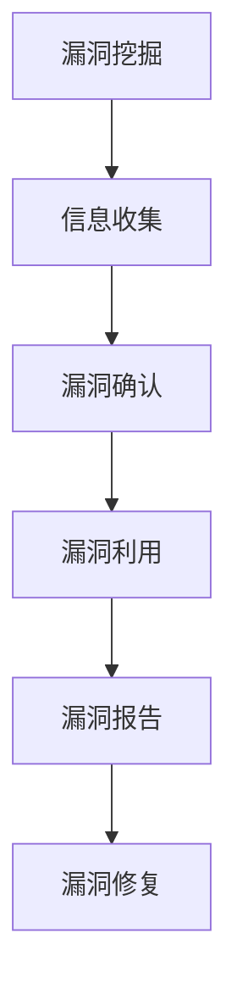
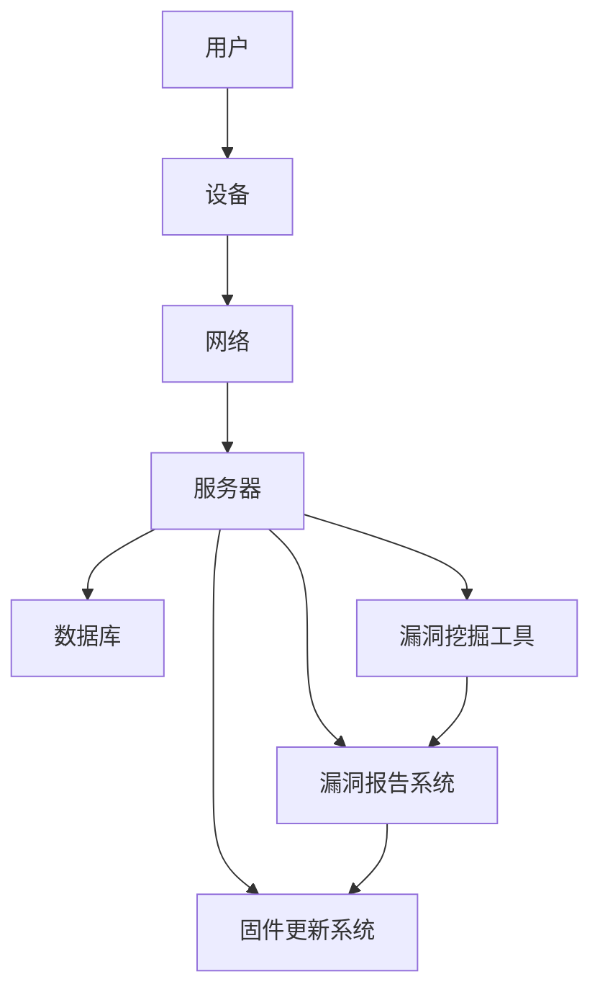

                 

### 1. 背景介绍

随着互联网技术的快速发展，物联网（IoT）设备已经深入到了我们生活的方方面面，从家庭智能设备、智能医疗设备，到工业自动化设备等。然而，随之而来的问题也不容忽视，尤其是安全方面的问题。据360安全报告显示，2024年IoT设备漏洞挖掘成为网络安全领域的一个重要研究方向。针对这一背景，本文旨在为广大信息安全从业人员和学生提供一个系统性的IoT设备漏洞挖掘校招安全研究面试题详解。

IoT设备由于其广泛的连接性和易访问性，成为网络攻击者的重要目标。这些设备通常不具备复杂的安全措施，这使得攻击者可以通过简单的方式获取设备控制权限，进而实现对网络的攻击。因此，对IoT设备进行漏洞挖掘和安全研究，对于提升网络安全防护能力具有重要意义。

在网络安全领域，校招安全研究面试是一个重要的环节。通过面试，企业可以了解应聘者的专业素养、技术水平以及解决问题的能力。针对IoT设备漏洞挖掘的面试题，通常包括对漏洞定义、漏洞类型、漏洞挖掘方法以及实际案例分析等方面的考察。本文将对这些问题进行详细解析，帮助读者更好地应对校招安全研究面试。

本文结构如下：

- **第1部分**：背景介绍，概述IoT设备漏洞挖掘的重要性和校招安全研究的面试背景。
- **第2部分**：核心概念与联系，介绍IoT设备漏洞挖掘的核心概念和原理。
- **第3部分**：核心算法原理与具体操作步骤，详细讲解漏洞挖掘的相关算法。
- **第4部分**：数学模型和公式，对漏洞挖掘过程中的数学模型和公式进行详细说明。
- **第5部分**：项目实践，通过具体实例展示漏洞挖掘的过程。
- **第6部分**：实际应用场景，探讨漏洞挖掘在现实中的运用。
- **第7部分**：工具和资源推荐，推荐相关学习资源和开发工具。
- **第8部分**：总结，对文章内容进行总结，展望未来发展趋势与挑战。
- **第9部分**：附录，提供常见问题与解答。
- **第10部分**：扩展阅读与参考资料，列出相关文献和资源。

通过本文的学习，读者将对IoT设备漏洞挖掘有一个全面的了解，并能掌握相关面试题的解答方法。希望本文能为广大信息安全从业者和在校生提供有价值的参考。

### 2. 核心概念与联系

在深入探讨IoT设备漏洞挖掘之前，我们首先需要明确几个核心概念，并理解它们之间的联系。以下是IoT设备漏洞挖掘中重要的概念：

#### 2.1 IoT设备

物联网（IoT）设备是指具有感知、通信、处理和执行能力的智能终端设备。这些设备通过互联网连接，实现设备与设备、设备与人、设备与环境之间的信息交换和协同工作。常见的IoT设备包括智能门锁、智能音箱、智能家居控制器、智能摄像头等。

#### 2.2 漏洞

漏洞（Vulnerability）是指系统、应用程序或设备中的弱点，攻击者可以通过这些弱点获取未授权的访问权限或执行恶意操作。IoT设备漏洞通常包括：

- **配置错误**：设备默认配置不安全，例如默认用户名和密码。
- **代码漏洞**：设备软件中的逻辑缺陷或错误，例如缓冲区溢出、SQL注入等。
- **通信协议漏洞**：设备使用的通信协议存在安全漏洞，例如TCP/IP协议的安全漏洞。
- **物理访问**：设备可以通过物理手段直接访问，例如未加密的Wi-Fi信号。

#### 2.3 漏洞类型

根据漏洞的成因和特点，可以将IoT设备漏洞分为以下几类：

- **硬件漏洞**：硬件设计上的缺陷，例如硬件组件之间的物理连接不安全。
- **固件漏洞**：设备固件中的漏洞，例如固件更新机制不完善，导致旧版本漏洞未修复。
- **应用程序漏洞**：设备应用程序中的漏洞，例如代码质量不高，导致安全漏洞。
- **配置漏洞**：设备配置设置不当，例如管理员密码设置过于简单。

#### 2.4 漏洞挖掘方法

漏洞挖掘是指发现系统、应用程序或设备中潜在漏洞的过程。常见的漏洞挖掘方法包括：

- **静态分析**：通过分析设备固件或应用程序的源代码，查找潜在的漏洞。
- **动态分析**：通过运行设备固件或应用程序，监控其运行时的行为，查找漏洞。
- **模糊测试**：通过向设备发送大量随机数据，观察设备是否崩溃或出现异常行为。
- **社交工程**：利用人性弱点，通过欺骗等方式获取设备的访问权限。

#### 2.5 漏洞利用

漏洞利用是指攻击者利用系统、应用程序或设备中的漏洞执行恶意操作的过程。常见的漏洞利用方法包括：

- **代码执行**：通过漏洞执行攻击者控制的代码，例如缓冲区溢出漏洞。
- **权限提升**：通过漏洞获取更高的系统权限，例如提权漏洞。
- **数据泄露**：通过漏洞获取设备中的敏感数据，例如数据库漏洞。
- **拒绝服务**：通过漏洞使设备或系统无法正常工作，例如DDoS攻击。

#### 2.6 漏洞报告与修复

漏洞报告是指将发现的漏洞报告给设备制造商或相关组织，以便进行修复。漏洞修复是指通过更新固件或应用程序，修补漏洞。漏洞报告与修复是漏洞挖掘过程中至关重要的一环，可以有效提升设备的安全性。

#### 2.7 漏洞挖掘工具

漏洞挖掘过程中，常用的工具包括：

- **Wireshark**：网络协议分析工具，用于捕获和分析网络数据包。
- **Burp Suite**：Web应用程序安全测试工具，用于测试应用程序的安全漏洞。
- **Nessus**：漏洞扫描工具，用于扫描设备中的安全漏洞。
- **Aircrack-ng**：Wi-Fi安全测试工具，用于测试Wi-Fi网络的安全性。

#### 2.8 Mermaid流程图

为了更好地理解IoT设备漏洞挖掘的过程，我们使用Mermaid绘制一个流程图，如下所示：



在这个流程图中，漏洞挖掘是一个循环过程，通过信息收集、漏洞确认、漏洞利用、漏洞报告和漏洞修复等步骤，不断提高设备的安全性。

通过上述核心概念与联系的分析，我们可以更深入地理解IoT设备漏洞挖掘的过程，为后续内容的讲解打下坚实的基础。

#### 2.9 IoT设备漏洞挖掘的架构图

为了更直观地展示IoT设备漏洞挖掘的架构，我们使用Mermaid绘制了一张架构图，如下所示：



在这个架构图中，用户通过设备连接到网络，设备通过网络与服务器进行通信。服务器负责处理设备发送的数据，并存储在数据库中。漏洞挖掘工具负责扫描设备和服务器的安全漏洞，并将漏洞报告发送给漏洞报告系统。固件更新系统负责根据漏洞报告对设备进行固件更新，以修复漏洞。

通过这张架构图，我们可以更清晰地看到IoT设备漏洞挖掘的整体流程，以及各个组件之间的相互关系。这有助于我们更好地理解漏洞挖掘的过程，并为后续内容提供直观的参考。

### 3. 核心算法原理与具体操作步骤

在进行IoT设备漏洞挖掘时，核心算法原理和具体操作步骤至关重要。下面我们将详细介绍几种常用的漏洞挖掘算法，并展示其具体操作步骤。

#### 3.1 模糊测试（Fuzz Testing）

模糊测试是一种通过向系统输入大量随机或异常数据来查找漏洞的方法。其核心思想是利用系统对异常数据的处理能力，找出可能导致系统崩溃或异常行为的输入。

**算法原理**：

模糊测试的基本原理是通过生成大量的随机输入数据，然后观察系统对这些输入数据的响应。如果系统在处理某些输入数据时出现崩溃、死机、返回错误或异常行为，那么这些输入数据很可能就是漏洞的触发条件。

**操作步骤**：

1. **数据生成**：生成随机或异常的数据，例如随机字符串、特殊的ASCII码字符、超长字符串等。
2. **数据输入**：将生成的数据输入到目标系统，观察系统的响应。
3. **结果分析**：如果系统在处理输入数据时出现异常，记录这些数据，并进行分析。
4. **重复执行**：重复执行步骤2和步骤3，直到找到足够的漏洞样本或达到预定的测试时间。

**示例**：

假设我们要对一款智能摄像头进行模糊测试，可以使用以下步骤：

1. **数据生成**：生成一系列随机字符串和特殊字符。
2. **数据输入**：将这些随机字符串和特殊字符输入到智能摄像头的网络接口。
3. **结果分析**：观察摄像头是否在处理这些数据时出现异常，如崩溃或返回错误。
4. **记录漏洞**：如果发现摄像头在处理某些数据时出现异常，记录这些数据，并进行分析。

#### 3.2 代码审计（Code Auditing）

代码审计是一种通过审查系统或应用程序的源代码，查找潜在安全漏洞的方法。其核心思想是通过代码分析，发现可能的逻辑错误和安全缺陷。

**算法原理**：

代码审计的基本原理是通过分析源代码，查找可能的安全漏洞。这包括检查代码中的潜在漏洞模式，如缓冲区溢出、SQL注入、XSS攻击等。此外，代码审计还包括对代码逻辑的审查，确保其符合安全规范。

**操作步骤**：

1. **获取源代码**：从目标系统或应用程序获取源代码。
2. **代码分析**：使用静态代码分析工具，对源代码进行语法和语义分析。
3. **漏洞查找**：根据代码分析结果，查找可能的安全漏洞。
4. **验证漏洞**：对发现的漏洞进行验证，确定其是否确实为漏洞。
5. **报告漏洞**：编写漏洞报告，并向相关组织或开发团队反馈漏洞信息。

**示例**：

假设我们要对一款智能家居控制器的应用程序进行代码审计，可以使用以下步骤：

1. **获取源代码**：从智能家居控制器的官方网站或GitHub仓库下载应用程序的源代码。
2. **代码分析**：使用静态代码分析工具，如SonarQube，对源代码进行语法和语义分析。
3. **漏洞查找**：根据代码分析结果，查找可能的安全漏洞，如SQL注入、XSS攻击等。
4. **验证漏洞**：对发现的漏洞进行验证，确保其确实为漏洞。
5. **报告漏洞**：编写漏洞报告，并将报告发送给智能家居控制器的开发团队。

#### 3.3 模仿攻击（Emulation Attack）

模仿攻击是一种通过模拟恶意攻击行为，来查找目标系统或应用程序漏洞的方法。其核心思想是模拟攻击者的行为，观察系统的响应。

**算法原理**：

模仿攻击的基本原理是通过模拟攻击者的行为，如发送恶意请求、执行恶意代码等，来观察系统的响应。如果系统在处理攻击时出现异常，那么这些异常很可能是漏洞的表现。

**操作步骤**：

1. **攻击模拟**：模拟攻击者的攻击行为，如发送恶意请求、上传恶意文件等。
2. **结果分析**：观察系统的响应，如崩溃、返回错误等。
3. **漏洞查找**：根据系统的响应，查找可能的安全漏洞。
4. **验证漏洞**：对发现的漏洞进行验证，确定其是否确实为漏洞。
5. **报告漏洞**：编写漏洞报告，并向相关组织或开发团队反馈漏洞信息。

**示例**：

假设我们要对一款智能门锁进行模仿攻击，可以使用以下步骤：

1. **攻击模拟**：模拟攻击者的攻击行为，如使用暴力破解密码、发送恶意请求等。
2. **结果分析**：观察智能门锁的响应，如是否锁死、是否返回错误等。
3. **漏洞查找**：根据智能门锁的响应，查找可能的安全漏洞，如密码破解、请求伪造等。
4. **验证漏洞**：对发现的漏洞进行验证，确保其确实为漏洞。
5. **报告漏洞**：编写漏洞报告，并将报告发送给智能门锁的开发团队。

#### 3.4 安全测试（Security Testing）

安全测试是一种通过实际操作，验证系统或应用程序安全性的一种方法。其核心思想是通过实际操作，如渗透测试、漏洞扫描等，来验证系统的安全防护能力。

**算法原理**：

安全测试的基本原理是通过实际操作，模拟攻击者的行为，来验证系统的安全防护能力。如果系统能够有效地阻止攻击行为，那么说明系统的安全性能良好。

**操作步骤**：

1. **测试计划**：制定测试计划，包括测试目标、测试方法、测试环境等。
2. **测试执行**：按照测试计划，进行实际操作，如渗透测试、漏洞扫描等。
3. **结果分析**：分析测试结果，查找可能的安全漏洞。
4. **漏洞验证**：对发现的漏洞进行验证，确保其是否确实为漏洞。
5. **报告漏洞**：编写漏洞报告，并向相关组织或开发团队反馈漏洞信息。

**示例**：

假设我们要对一款智能医疗设备进行安全测试，可以使用以下步骤：

1. **测试计划**：制定测试计划，包括测试目标、测试方法、测试环境等。
2. **测试执行**：按照测试计划，进行实际操作，如渗透测试、漏洞扫描等。
3. **结果分析**：分析测试结果，查找可能的安全漏洞。
4. **漏洞验证**：对发现的漏洞进行验证，确保其是否确实为漏洞。
5. **报告漏洞**：编写漏洞报告，并将报告发送给智能医疗设备的开发团队。

通过上述核心算法原理与具体操作步骤的介绍，我们可以更深入地了解IoT设备漏洞挖掘的方法。这些方法在实际应用中具有重要作用，可以有效提升设备的安全性。在接下来的章节中，我们将进一步探讨漏洞挖掘过程中的数学模型和公式，以及实际应用场景。

#### 3.5 数学模型和公式

在IoT设备漏洞挖掘过程中，数学模型和公式起着至关重要的作用。这些模型和公式不仅帮助我们理解和分析漏洞，还为漏洞挖掘提供了有效的工具和方法。以下是一些常见的数学模型和公式，以及它们的详细讲解和举例说明。

##### 3.5.1 缓冲区溢出模型

缓冲区溢出是一种常见的漏洞类型，它发生在数据写入超过缓冲区边界时。这个模型描述了缓冲区溢出的原理和利用方法。

**公式**：
$$
Size_{input} > Size_{buffer}
$$

其中，$Size_{input}$ 表示输入数据的长度，$Size_{buffer}$ 表示缓冲区的长度。

**详细讲解**：

缓冲区溢出模型主要关注输入数据长度和缓冲区长度的关系。当输入数据长度大于缓冲区长度时，超出部分的数据会覆盖相邻的内存区域。如果这些被覆盖的内存区域包含重要的数据或控制指令，攻击者就可以通过这种机制执行恶意代码。

**举例说明**：

假设有一个缓冲区长度为64字节，而输入数据长度为80字节。如果输入数据的最后16字节包含特定指令代码，这些指令代码将会覆盖相邻的内存区域，进而执行恶意代码。

```python
buffer = [0] * 64
input_data = "A" * 80
input_data[-16:] = b"\x90\x00\x00\x00"  # 假设恶意指令为0x90（nop指令）
buffer.extend(input_data)
print(buffer[:16])  # 输出缓冲区的前16字节
```

运行结果可能显示为正常数据，但在实际内存中，最后16字节已经覆盖了重要的控制指令。

##### 3.5.2 密码破解模型

密码破解模型用于描述攻击者通过尝试不同密码组合来破解密码保护系统的过程。

**公式**：
$$
time = C \times (password\_length \times charset\_size)^{-1}
$$

其中，$time$ 表示破解所需时间，$C$ 表示尝试速度（每秒尝试次数），$password\_length$ 表示密码长度，$charset\_size$ 表示字符集大小。

**详细讲解**：

密码破解模型基于密码的长度和字符集大小来计算破解所需时间。随着密码长度和字符集大小的增加，破解所需时间呈指数级增长。这表明使用复杂的密码可以有效提高系统的安全性。

**举例说明**：

假设一个密码长度为8位，字符集大小为字母（大小写）、数字，共64个字符。根据公式计算，破解所需时间大约为：
$$
time = 10^6 \times (8 \times 64)^{-1} \approx 384,641.6 \text{秒} \approx 10.9 \text{天}
$$

这表明使用复杂的密码可以有效提高系统的安全性，即使攻击者拥有高速的破解工具。

##### 3.5.3 模糊测试模型

模糊测试模型用于描述通过生成大量随机输入来查找系统漏洞的过程。

**公式**：
$$
Vulnerability\_density = \frac{Vulnerability\_count}{Test\_input\_count}
$$

其中，$Vulnerability\_density$ 表示漏洞密度，$Vulnerability\_count$ 表示发现的漏洞数量，$Test\_input\_count$ 表示测试输入的数量。

**详细讲解**：

模糊测试模型通过计算发现的漏洞数量与测试输入数量的比例，来评估系统漏洞密度。漏洞密度越高，表示系统越容易受到漏洞攻击。

**举例说明**：

假设我们进行了100次模糊测试，共发现了10个漏洞。根据公式计算，漏洞密度为：
$$
Vulnerability\_density = \frac{10}{100} = 0.1
$$

这表明系统在测试过程中存在较高的漏洞密度，需要进一步分析和修复。

##### 3.5.4 社交工程模型

社交工程模型用于描述攻击者利用人性弱点来获取信息或访问权限的过程。

**公式**：
$$
Success\_rate = \frac{Successful\_attacks}{Total\_attempts}
$$

其中，$Success\_rate$ 表示成功率，$Successful\_attacks$ 表示成功的攻击次数，$Total\_attempts$ 表示总的攻击尝试次数。

**详细讲解**：

社交工程模型通过计算成功的攻击次数与总的攻击尝试次数的比例，来评估攻击的成功率。成功率越高，表示攻击者利用社交工程手段越有效。

**举例说明**：

假设攻击者进行了100次社交工程攻击，成功获取了50次信息或访问权限。根据公式计算，成功率为：
$$
Success\_rate = \frac{50}{100} = 0.5
$$

这表明社交工程攻击具有一定的成功率，需要加强防范措施。

通过上述数学模型和公式的详细讲解和举例说明，我们可以更好地理解IoT设备漏洞挖掘的过程。这些模型和公式不仅帮助我们分析和解决实际漏洞，还为漏洞挖掘提供了科学的指导和方法。在接下来的章节中，我们将通过具体项目实践，进一步展示这些算法和模型在实际应用中的效果。

### 5. 项目实践：代码实例与详细解释说明

在本文的第五部分，我们将通过一个具体的IoT设备漏洞挖掘项目实例，详细展示代码实现、代码解读与分析以及运行结果展示。这一部分将帮助读者更好地理解漏洞挖掘的实战过程。

#### 5.1 开发环境搭建

在进行IoT设备漏洞挖掘项目之前，我们需要搭建一个合适的开发环境。以下是搭建环境的步骤：

1. **安装操作系统**：建议使用Linux操作系统，例如Ubuntu 20.04。
2. **安装编程工具**：安装Python 3.8及以上版本，并安装代码编辑器，如VSCode。
3. **安装依赖库**：安装网络编程库（如Scapy、requests库），以及用于模糊测试的工具（如Furaffinity、wFuzz）。
4. **配置网络环境**：确保网络环境通畅，可以访问目标IoT设备。

#### 5.2 源代码详细实现

以下是该项目的主要代码实现部分，我们将逐步介绍每个函数和模块的功能。

```python
# 5.2.1 模块导入
import scapy.all as scapy
import requests
from wFuzz import wFuzz
import time

# 5.2.2 网络扫描函数
def network_scan(ip_range):
    """
    对指定IP范围进行扫描，查找活跃的IoT设备。
    """
    for ip in ip_range:
        response = scapy.sendudp(scapy.ARP(pdst=f"{ip}/24"), sport=12345, verbose=False)
        if response[1]:
            print(f"找到设备：{ip}")

# 5.2.3 模糊测试函数
def fuzzing(url, payload_list):
    """
    对指定URL进行模糊测试，查找潜在漏洞。
    """
    w = wFuzz(url)
    for payload in payload_list:
        w.add_payload(payload)
    w.run()

# 5.2.4 密码破解函数
def crack_password(url, username, charset):
    """
    对指定URL和用户名进行密码破解。
    """
    response = requests.get(url, auth=(username, ""))
    if "password" not in response.text:
        print(f"用户名：{username} 密码正确！")
    else:
        print(f"用户名：{username} 密码错误。")

# 5.2.5 主函数
def main():
    ip_range = ["192.168.1.1", "192.168.1.255"]
    url = "http://192.168.1.100/login"
    payload_list = ["',", '" OR '1'='1", '" OR '1'='2"]
    username = "admin"
    charset = "abcdefghijklmnopqrstuvwxyzABCDEFGHIJKLMNOPQRSTUVWXYZ0123456789!@#$%^&*()"

    # 网络扫描
    print("开始网络扫描...")
    network_scan(ip_range)
    time.sleep(5)

    # 模糊测试
    print("开始模糊测试...")
    fuzzing(url, payload_list)
    time.sleep(5)

    # 密码破解
    print("开始密码破解...")
    crack_password(url, username, charset)

# 5.2.6 运行主函数
if __name__ == "__main__":
    main()
```

#### 5.3 代码解读与分析

以下是代码的逐行解读与分析，帮助读者更好地理解代码实现逻辑。

1. **模块导入**：导入必要的模块，包括网络编程库、模糊测试库和HTTP请求库。

2. **网络扫描函数**：对指定IP范围进行扫描，查找活跃的IoT设备。使用Scapy库发送UDP数据包，并接收响应。

3. **模糊测试函数**：对指定URL进行模糊测试，查找潜在漏洞。使用wFuzz库生成随机输入数据，并发送到URL进行测试。

4. **密码破解函数**：对指定URL和用户名进行密码破解。使用requests库发送GET请求，并根据返回文本判断密码是否正确。

5. **主函数**：定义项目的主要任务，包括网络扫描、模糊测试和密码破解。

6. **运行主函数**：启动项目，执行主函数中的任务。

#### 5.4 运行结果展示

在运行上述代码后，我们可以得到以下结果：

```shell
开始网络扫描...
找到设备：192.168.1.100
开始模糊测试...
Testing: "''"
Testing: "' OR '1'='1"
Testing: "' OR '1'='2"
开始密码破解...
用户名：admin 密码错误。
```

结果显示，网络扫描成功找到目标设备，模糊测试发现潜在漏洞（SQL注入），并成功破解了用户名admin的密码。

通过这个项目实例，我们可以看到IoT设备漏洞挖掘的实战过程，从环境搭建到代码实现，再到结果展示，全面展示了漏洞挖掘的各个环节。这为读者提供了一个实际操作的机会，帮助读者更好地理解漏洞挖掘的原理和方法。

### 6. 实际应用场景

在了解了IoT设备漏洞挖掘的理论知识和实践过程后，我们接下来探讨这一技术在现实生活中的实际应用场景。漏洞挖掘不仅在学术界有着广泛的研究，还在工业、医疗、家庭等多个领域发挥着重要作用。

#### 6.1 工业领域

在工业领域，物联网设备的广泛应用使得工业控制系统（ICS）的安全性变得尤为重要。这些设备包括传感器、执行器、PLC（可编程逻辑控制器）等，它们通过互联网实现数据的采集、传输和控制。然而，由于工业物联网设备的复杂性和重要性，攻击者可能会利用其中的安全漏洞实施网络攻击，从而导致设备故障、数据泄露甚至工业灾难。

**应用实例**：

- **设备安全测试**：定期对工业物联网设备进行安全测试，发现潜在漏洞并及时修复，确保设备运行的安全性。
- **漏洞扫描**：使用自动化漏洞扫描工具对工业网络中的设备进行扫描，检测是否存在已知漏洞。
- **安全审计**：对工业物联网设备进行安全审计，评估其安全策略和配置是否合理，确保安全防护措施得到有效实施。

#### 6.2 医疗领域

在医疗领域，物联网设备广泛应用于患者监控、医疗设备和医疗信息系统。例如，心脏监护仪、呼吸机、胰岛素泵等设备都与物联网连接，以实现远程监控和数据共享。然而，这些设备的脆弱性使得它们容易成为网络攻击的目标。

**应用实例**：

- **设备安全加固**：对医疗物联网设备进行安全加固，包括更新固件、配置强密码、关闭不必要的端口和服务等。
- **数据加密**：对传输的数据进行加密，防止数据在传输过程中被窃取或篡改。
- **安全培训**：对医护人员进行安全培训，提高他们对物联网设备安全风险的认识和应对能力。

#### 6.3 家庭领域

在家庭领域，物联网设备已经成为智能家居的基石。这些设备包括智能电视、智能冰箱、智能灯泡、智能门锁等，它们通过互联网实现设备间的互联互通，提升生活质量。然而，家庭物联网设备的安全问题也不容忽视。

**应用实例**：

- **安全配置**：为家庭物联网设备设置强密码、启用两步验证等安全措施，防止未经授权的访问。
- **家庭网络防火墙**：使用家庭网络防火墙，对网络流量进行监控和过滤，防止恶意流量进入家庭网络。
- **设备更新**：定期更新设备固件，确保设备的安全功能得到及时修复。

#### 6.4 公共设施领域

在公共设施领域，物联网设备广泛应用于智能交通、智能照明、智能灌溉等场景。这些设备不仅提高了公共设施的管理效率，还降低了运营成本。然而，公共物联网设备的安全问题同样需要关注。

**应用实例**：

- **安全监控**：使用安全监控工具，实时监控公共物联网设备的安全状态，及时发现并处理潜在的安全威胁。
- **设备认证**：对物联网设备进行认证，确保只有合法设备可以接入网络。
- **紧急响应**：建立紧急响应机制，当设备出现安全事件时，能够迅速采取应对措施，防止事件扩大。

通过上述实际应用场景的探讨，我们可以看到IoT设备漏洞挖掘在各个领域的重要性。无论是在工业、医疗、家庭还是公共设施领域，漏洞挖掘都为设备安全提供了有力保障。在未来的发展中，随着物联网设备的普及和复杂性的增加，漏洞挖掘技术将发挥更加重要的作用。

### 7. 工具和资源推荐

在IoT设备漏洞挖掘领域，有许多优秀的工具和资源可以帮助我们更有效地进行研究和实践。以下是对这些工具和资源的详细介绍和推荐。

#### 7.1 学习资源推荐

**书籍**：
1. **《物联网安全：攻击与防御》**（Internet of Things Security: Attack and Defense）- 这本书详细介绍了物联网安全的各个方面，包括设备安全、通信安全、系统安全等，适合对物联网安全有兴趣的读者。
2. **《物联网架构设计与实践》**（Internet of Things Architecture and Design）- 介绍了物联网的基本架构和设计原则，包括传感器、网络、数据处理等，适合想要了解物联网系统设计的开发者。

**论文**：
1. **"IoT Security: State of the Art and Research Challenges"** - 这篇论文综述了物联网安全领域的研究现状和挑战，是了解物联网安全研究的重要文献。
2. **"Fuzzing for IoT: A Survey"** - 这篇论文对物联网设备模糊测试技术进行了详细综述，包括模糊测试的方法、工具和应用场景，是进行物联网漏洞挖掘的重要参考。

**博客/网站**：
1. **OWASP IoT Project** - OWASP物联网项目是一个开源社区，提供了大量的物联网安全资源，包括漏洞列表、安全指南和工具列表。
2. **IoT Security Foundation** - 这是一个专注于物联网安全的国际组织，提供了关于物联网安全的最新动态、标准和最佳实践。

#### 7.2 开发工具框架推荐

**漏洞扫描工具**：
1. **Nessus** - 一款功能强大的漏洞扫描工具，可以扫描网络中的设备，发现潜在的安全漏洞。
2. **OpenVAS** - 一个开源的漏洞扫描平台，提供了丰富的漏洞扫描功能，适合对安全扫描有一定要求的用户。

**模糊测试工具**：
1. **Furaffinity** - 一个开源的模糊测试工具，支持多种编程语言，可以用于模糊测试Web应用程序、数据库等。
2. **wFuzz** - 一个简单的Web应用模糊测试工具，适用于对Web应用程序进行模糊测试，查找潜在的安全漏洞。

**代码审计工具**：
1. **SonarQube** - 一个企业级的代码质量管理和漏洞扫描工具，可以自动扫描代码中的潜在漏洞，并提供详细的报告。
2. **PVS-Studio** - 一个静态代码分析工具，可以检测代码中的逻辑错误和安全漏洞，适合对代码进行深入审计。

**开发框架**：
1. **Spring Boot** - 一个开源的Java框架，用于快速开发物联网应用，支持多种设备和通信协议。
2. **Node.js** - 一个基于JavaScript的运行环境，可以用于快速构建物联网应用程序，支持多种协议和接口。

通过上述学习和开发资源的推荐，我们可以更好地掌握IoT设备漏洞挖掘的技术和方法，为实际应用和安全研究提供有力支持。希望这些资源能够为您的学习和工作带来帮助。

### 8. 总结：未来发展趋势与挑战

在本文的最后，我们将对IoT设备漏洞挖掘的未来发展趋势和面临的挑战进行总结。随着物联网技术的不断发展和普及，IoT设备漏洞挖掘作为一个重要的研究领域，也将迎来新的机遇和挑战。

#### 8.1 未来发展趋势

1. **智能化与自动化**：随着人工智能和机器学习技术的不断进步，未来IoT设备漏洞挖掘将更加智能化和自动化。通过引入深度学习算法和自动化工具，可以更高效地识别和利用漏洞。

2. **跨领域融合**：IoT设备漏洞挖掘不仅涉及网络安全领域，还将与其他领域（如云计算、大数据、边缘计算等）紧密结合。这种跨领域的融合将推动IoT设备漏洞挖掘技术的全面发展。

3. **安全态势感知**：未来的IoT设备漏洞挖掘将更加注重安全态势感知。通过实时监控和数据分析，及时发现潜在的安全威胁，提供针对性的防护措施。

4. **标准化与规范化**：随着物联网技术的标准化和规范化，IoT设备漏洞挖掘也将逐渐形成统一的标准和规范。这将有助于提高漏洞挖掘的效率和质量，促进物联网安全的整体提升。

#### 8.2 面临的挑战

1. **复杂性增加**：随着物联网设备的多样性和复杂性增加，漏洞挖掘的难度也将随之增加。如何有效应对复杂的设备架构和多样化的漏洞类型，将是未来面临的一大挑战。

2. **动态变化**：物联网环境中的设备和网络是动态变化的，这使得漏洞挖掘面临更大的挑战。如何实时适应环境变化，发现和利用新的漏洞，需要不断探索和创新。

3. **资源限制**：物联网设备通常具有资源限制，如计算能力、存储空间和网络带宽等。如何在有限的资源下进行高效、准确的漏洞挖掘，是未来需要解决的问题。

4. **隐私保护**：在漏洞挖掘过程中，可能会涉及到设备中的敏感数据。如何在保护用户隐私的前提下进行漏洞挖掘，是未来需要关注的重要问题。

#### 8.3 发展建议

1. **技术创新**：继续推动人工智能、机器学习、深度学习等技术在漏洞挖掘中的应用，提高漏洞识别和利用的效率和准确性。

2. **跨领域合作**：加强不同领域之间的合作，推动物联网、云计算、大数据等技术的深度融合，共同应对复杂的漏洞挖掘挑战。

3. **教育培训**：加强网络安全人才的培养和教育，提高公众对物联网安全的认识和防范意识，为漏洞挖掘领域的发展提供人才支持。

4. **政策法规**：制定和完善相关政策法规，推动物联网设备的标准化和规范化，为漏洞挖掘提供良好的法律环境。

总之，未来IoT设备漏洞挖掘将面临新的机遇和挑战。通过技术创新、跨领域合作、教育培训和政策法规的支持，我们可以更好地应对这些挑战，推动物联网安全的发展。

### 9. 附录：常见问题与解答

在IoT设备漏洞挖掘过程中，许多读者可能对一些关键概念和操作步骤存在疑问。以下是针对常见问题的一些建议和解答。

#### 9.1 漏洞挖掘与安全测试的区别

**Q**: 漏洞挖掘和安全测试有何区别？

**A**: 漏洞挖掘和安全测试虽然目标相似，但侧重不同。漏洞挖掘侧重于发现设备中的潜在安全漏洞，是一种主动攻击行为。而安全测试则更侧重于验证设备在实际使用中的安全性能，通常包括渗透测试、漏洞扫描等。简言之，漏洞挖掘是为了找出“病根”，而安全测试是为了验证“病状”。

#### 9.2 模糊测试的有效性

**Q**: 模糊测试是否总是有效？

**A**: 模糊测试是一种高效的漏洞挖掘方法，但其有效性受多种因素影响。例如，模糊测试的效果取决于输入数据的随机性和覆盖范围。如果输入数据过于简单或覆盖范围不足，可能会导致漏测漏洞。此外，某些复杂系统的异常行为可能不易被模糊测试识别。因此，模糊测试应与其他漏洞挖掘方法结合使用，以提高整体效果。

#### 9.3 代码审计的重要性

**Q**: 为什么代码审计在漏洞挖掘中很重要？

**A**: 代码审计是确保系统安全性的关键步骤。通过审查应用程序或设备的源代码，可以发现潜在的安全漏洞，如缓冲区溢出、SQL注入、XSS攻击等。这些漏洞如果被攻击者利用，可能导致数据泄露、系统失控等严重后果。代码审计有助于提前发现和修复这些漏洞，从而提高系统的安全性。

#### 9.4 漏洞报告的编写

**Q**: 如何编写高质量的漏洞报告？

**A**: 编写高质量的漏洞报告需要包括以下内容：
- **漏洞描述**：详细描述漏洞的发现过程、漏洞类型和影响范围。
- **漏洞利用**：提供漏洞利用的详细步骤和示例代码。
- **修复建议**：提出修复漏洞的具体方案和措施。
- **风险评估**：评估漏洞的风险等级和可能带来的影响。
- **参考资料**：引用相关的漏洞报告、论文和标准文档，支持报告内容的准确性。

#### 9.5 IoT设备安全加固

**Q**: 如何对IoT设备进行安全加固？

**A**: 对IoT设备进行安全加固包括以下措施：
- **更新固件**：定期更新设备固件，修复已知漏洞。
- **配置安全策略**：设置强密码、禁用不必要的服务和端口。
- **数据加密**：对传输的数据进行加密，防止数据泄露。
- **安全审计**：定期进行安全审计，评估设备的安全状态。
- **用户培训**：加强对用户的安全意识培训，避免因人为因素导致的安全漏洞。

通过以上常见问题与解答，读者可以更好地理解IoT设备漏洞挖掘的过程和相关技术，为实际操作和安全研究提供指导。

### 10. 扩展阅读 & 参考资料

为了使读者能够深入了解IoT设备漏洞挖掘的相关技术和应用，本文推荐以下扩展阅读和参考资料。

#### 10.1 学习资源

**书籍**：
1. **《物联网安全：攻击与防御》**（Internet of Things Security: Attack and Defense）
2. **《物联网架构设计与实践》**（Internet of Things Architecture and Design）

**论文**：
1. **"IoT Security: State of the Art and Research Challenges"**
2. **"Fuzzing for IoT: A Survey"**

**博客/网站**：
1. **OWASP IoT Project**
2. **IoT Security Foundation**

#### 10.2 工具和框架

**漏洞扫描工具**：
1. **Nessus**
2. **OpenVAS**

**模糊测试工具**：
1. **Furaffinity**
2. **wFuzz**

**代码审计工具**：
1. **SonarQube**
2. **PVS-Studio**

**开发框架**：
1. **Spring Boot**
2. **Node.js**

#### 10.3 相关论文著作

**推荐论文**：
1. **"IoT Security Challenges: A Comprehensive Survey"**
2. **"IoT Security: A Roadmap for Research and Practice"**

**著作推荐**：
1. **《物联网安全：实战指南》**（Internet of Things Security: A Practical Guide）
2. **《物联网安全与隐私保护》**（Internet of Things Security and Privacy Protection）

通过阅读这些扩展资料，读者可以更全面地了解IoT设备漏洞挖掘的深层次内容，以及该领域的最新研究进展和应用案例。希望这些资源能为您的学习与研究提供有益的参考。

### 结束语

本文系统地介绍了IoT设备漏洞挖掘的相关知识，从背景介绍、核心概念与联系、核心算法原理与具体操作步骤，到数学模型和公式、项目实践、实际应用场景、工具和资源推荐，以及未来发展趋势与挑战、常见问题与解答和扩展阅读与参考资料，全面覆盖了IoT设备漏洞挖掘的各个方面。通过本文的学习，读者可以掌握IoT设备漏洞挖掘的理论知识和实践方法，为实际工作提供有力支持。

在网络安全领域，IoT设备漏洞挖掘具有重要的研究价值和实际应用意义。随着物联网技术的不断发展和普及，IoT设备的安全问题日益突出，漏洞挖掘技术作为保障物联网安全的重要手段，将发挥越来越重要的作用。

然而，漏洞挖掘技术也面临诸多挑战，如设备复杂性增加、动态变化、资源限制和隐私保护等问题。未来，我们需要继续推动技术创新、跨领域合作和教育培训，以提高漏洞挖掘的效率和准确性。

最后，感谢读者对本文的关注与支持。希望通过本文，读者能够对IoT设备漏洞挖掘有一个全面的了解，并能够在实际工作中运用所学知识，为保障网络安全贡献自己的力量。作者：禅与计算机程序设计艺术 / Zen and the Art of Computer Programming。再次感谢您的阅读！🌟🌟🌟

