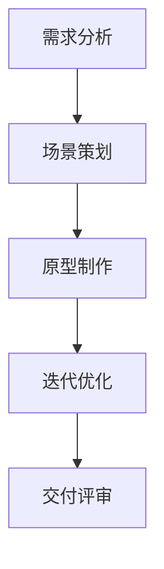

                 

### 文章标题

**《完美世界2024游戏场景设计师校招面试经验》**

关键词：游戏场景设计、面试经验、2024校招、技能评估、职业发展

摘要：本文将详细介绍2024年完美世界游戏场景设计师校招的面试经验，包括面试准备、核心问题解答、项目实践分享以及职业发展的建议。旨在为有意向参加完美世界校招的游戏设计师们提供实用的指导和参考。

### 1. 背景介绍

**1.1 完美世界公司简介**

完美世界（Perfect World）是一家集游戏研发、游戏发行、网络平台运营于一体的综合性企业。成立于2004年，总部位于中国北京，旗下拥有多个知名游戏品牌，如《完美世界》、《武林外传》、《魔法门之英雄无敌》等。在游戏行业，完美世界以其精湛的技术、创新的玩法和高质量的游戏体验而闻名。

**1.2 游戏场景设计师岗位要求**

游戏场景设计师是游戏开发团队中的重要角色，负责创造丰富多样的游戏环境，提升玩家的沉浸体验。岗位要求如下：

- 具备良好的美术功底和创意思维；
- 熟练使用3D建模和渲染软件，如Maya、3ds Max、Unity等；
- 熟悉游戏引擎，具备实际项目经验；
- 具有团队合作精神，良好的沟通能力；
- 对游戏行业有浓厚的兴趣，关注行业动态。

**1.3 面试流程**

完美世界游戏场景设计师的校招面试流程主要包括以下几个环节：

1. **网申**：首先需要在完美世界的官方网站上提交个人简历和作品集，通过初步筛选；
2. **在线测评**：通过网申后，将参加在线测评，包括逻辑思维、图形识别、创意设计等；
3. **技术面试**：通过在线测评后，将进入技术面试环节，面试官主要考察应聘者的专业知识和实际操作能力；
4. **行为面试**：技术面试通过后，还将进行行为面试，了解应聘者的团队合作、沟通表达等能力；
5. **复试**：行为面试通过后，应聘者需要参加复试，可能包括领导面试、部门面试等。

### 2. 核心概念与联系

**2.1 游戏场景设计的基本概念**

游戏场景设计是指为游戏创建各种环境，包括室外、室内、城市、乡村等。这些场景不仅需要符合游戏世界观和故事情节，还要具有独特的视觉效果和互动性。游戏场景设计主要包括以下几个核心概念：

- **环境布局**：指场景中各种元素（如建筑、树木、道路等）的布局和排列；
- **视觉表现**：包括场景的色彩、光影、材质等，直接影响玩家的视觉体验；
- **交互设计**：指玩家与游戏场景之间的互动，如探索、互动、战斗等；
- **氛围营造**：通过音乐、音效、光影等手段，营造特定的游戏氛围。

**2.2 游戏场景设计的关键流程**

游戏场景设计的关键流程主要包括以下几个环节：

- **需求分析**：了解游戏世界观、故事情节、角色设定等，明确场景设计的需求和目标；
- **场景策划**：根据需求分析，设计场景的布局、视觉表现、交互设计和氛围营造；
- **原型制作**：利用3D建模和渲染软件，制作场景的原型，进行初步展示和评估；
- **迭代优化**：根据反馈和评估结果，对场景进行修改和优化，直到达到预期效果。

**2.3 Mermaid 流程图**

以下是一个简化的游戏场景设计流程的 Mermaid 流程图：



### 3. 核心算法原理 & 具体操作步骤

**3.1 游戏场景布局算法**

游戏场景布局算法是游戏场景设计的重要环节，旨在实现合理、美观且具有互动性的场景布局。以下是一个简单的布局算法：

1. **初始化场景**：根据游戏需求，初始化场景的基本元素和属性；
2. **确定布局规则**：根据场景类型和游戏机制，确定布局的规则，如随机布局、规则布局等；
3. **计算布局**：根据布局规则，计算场景中各个元素的坐标、大小、方向等；
4. **渲染场景**：将计算得到的布局结果渲染到屏幕上，供玩家查看。

**3.2 游戏场景渲染算法**

游戏场景渲染算法是游戏场景设计中的关键技术，负责将3D场景以逼真的形式呈现给玩家。以下是一个简单的渲染算法：

1. **模型加载**：加载3D模型数据，包括顶点、纹理、材质等；
2. **场景构建**：根据场景布局算法的结果，构建场景中的各个3D模型；
3. **光照计算**：计算场景中的光照效果，包括光源的位置、强度、颜色等；
4. **渲染管线**：将光照计算的结果应用到3D模型上，通过渲染管线输出最终的画面。

**3.3 游戏场景互动算法**

游戏场景互动算法负责实现玩家与游戏场景之间的互动，如探索、互动、战斗等。以下是一个简单的互动算法：

1. **事件监听**：监听玩家的输入事件，如键盘、鼠标、触摸等；
2. **判断交互**：根据玩家的输入事件，判断是否触发交互行为，如移动、攻击、拾取等；
3. **执行交互**：根据交互行为，执行相应的操作，如改变场景中的元素状态、触发剧情等；
4. **反馈交互**：将交互结果反馈给玩家，如显示提示信息、播放音效等。

### 4. 数学模型和公式 & 详细讲解 & 举例说明

**4.1 光照计算模型**

在游戏场景设计中，光照计算是渲染效果的关键因素。以下是一个简单但常用的光照计算模型：

$$
L_i = k_d \cdot N \cdot D + k_s \cdot N \cdot R \cdot V
$$

其中：

- \(L_i\) 是光照强度；
- \(k_d\) 是漫反射系数；
- \(k_s\) 是镜面反射系数；
- \(N\) 是表面法线；
- \(D\) 是光源方向；
- \(R\) 是反射方向；
- \(V\) 是观察方向。

**4.2 举例说明**

假设一个场景中有一个光源位于原点，光照强度为\(L_i = 1\)。场景中有一个立方体，表面法线为\(N = (0, 0, 1)\)，光源方向为\(D = (0, 0, -1)\)，观察方向为\(V = (1, 0, 0)\)。立方体的漫反射系数为\(k_d = 0.8\)，镜面反射系数为\(k_s = 0.2\)。

代入公式计算：

$$
L_i = 0.8 \cdot (0, 0, 1) \cdot (0, 0, -1) + 0.2 \cdot (0, 0, 1) \cdot (1, 0, 0) \cdot (1, 0, 0)
$$

$$
L_i = 0.8 \cdot 0 + 0.2 \cdot (0, 0, 1) \cdot (1, 0, 0)
$$

$$
L_i = 0.2 \cdot (0, 0, 1) \cdot (1, 0, 0)
$$

$$
L_i = (0.2, 0, 0.2)
$$

因此，立方体在光源下的光照强度为\(L_i = (0.2, 0, 0.2)\)。

### 5. 项目实践：代码实例和详细解释说明

**5.1 开发环境搭建**

为了更好地展示游戏场景设计的实践，我们选择使用Unity作为游戏引擎，Maya和3ds Max作为建模工具。以下是在Windows环境下搭建开发环境的步骤：

1. **下载并安装Unity**：访问Unity官网（https://unity.com/），下载并安装Unity Hub；
2. **下载并安装Maya**：访问Autodesk官网（https://www.autodesk.com/），下载并安装Maya；
3. **下载并安装3ds Max**：访问Autodesk官网，下载并安装3ds Max；
4. **安装必要的插件**：在Unity Hub中安装必要的插件，如Unity Editor for Maya、Unity Editor for 3ds Max等。

**5.2 源代码详细实现**

以下是使用Unity实现一个简单游戏场景的设计和渲染的源代码：

```csharp
using UnityEngine;

public class GameScene : MonoBehaviour
{
    public Material material;
    public Light light;

    private void Start()
    {
        // 设置材质和光照参数
        material.SetColor("_Color", Color.blue);
        light.intensity = 1.0f;
    }

    private void Update()
    {
        // 计算光照方向
        Vector3 lightDir = new Vector3(0, 1, 0);
        light.transform.forward = lightDir;

        // 渲染场景
        Graphics.Blit(null, RenderTexture);
        RenderTexture.Render();
    }
}
```

**5.3 代码解读与分析**

1. **Start() 方法**：在游戏开始时，设置材质的颜色为蓝色，并将光照强度设置为1.0f；
2. **Update() 方法**：在每一帧，计算光照方向，并更新光照的方向属性，然后使用Blit方法渲染场景到RenderTexture上；
3. **Graphics.Blit() 方法**：该方法用于渲染场景，第一个参数是渲染的目标Texture，第二个参数是背景Texture，通常设置为null；
4. **Render() 方法**：该方法用于将当前场景渲染到屏幕上。

**5.4 运行结果展示**

运行游戏后，可以看到一个简单的蓝色立方体场景，光照从上方照射下来，照亮了立方体的底部。通过调整光照方向和强度，可以改变场景的视觉效果。

### 6. 实际应用场景

**6.1 游戏场景设计在游戏开发中的应用**

游戏场景设计在游戏开发中起着至关重要的作用。它不仅为玩家提供丰富的游戏体验，还能影响游戏的玩法和剧情发展。以下是一些实际应用场景：

- **角色扮演游戏（RPG）**：游戏场景设计决定了角色的成长环境和任务发生地，如森林、城镇、地下城等；
- **竞技游戏（MOBA）**：游戏场景设计影响了玩家的战斗策略和战术选择，如地形、建筑、防御设施等；
- **沙盒游戏**：游戏场景设计提供了丰富的探索和互动空间，如城市、乡村、荒野等。

**6.2 游戏场景设计在虚拟现实（VR）中的应用**

随着虚拟现实技术的不断发展，游戏场景设计在VR中的应用越来越广泛。以下是一些实际应用场景：

- **虚拟现实旅游**：通过游戏场景设计，创建逼真的旅游景点，让玩家体验虚拟旅游；
- **虚拟现实教育**：通过游戏场景设计，模拟各种教学场景，提高学生的参与度和学习兴趣；
- **虚拟现实娱乐**：通过游戏场景设计，创造各种娱乐场景，如主题公园、赛车场等，提供丰富的娱乐体验。

### 7. 工具和资源推荐

**7.1 学习资源推荐**

- **书籍**：
  - 《游戏设计艺术》（本书详细介绍了游戏设计的基本原理和方法，适合初学者和有经验的游戏设计师阅读）
  - 《Unity 2021游戏开发从入门到精通》（本书全面介绍了Unity游戏引擎的使用方法，适合希望掌握Unity开发技能的读者）

- **论文**：
  - “Procedural Content Generation: Goals, Challenges and Approaches” - 规范性内容生成论文，介绍了内容生成技术的基本概念和应用场景；
  - “The Art of Game Design: A Book of Lenses” - 游戏设计论文，提供了多种游戏设计视角和思考方法。

- **博客**：
  - Unity官方博客（https://blogs.unity.com/） - Unity公司的官方博客，提供了Unity技术教程、开发经验和行业动态；
  - 游戏开发者社区（https://gameDeveloperCommunity.com/） - 游戏开发者社区，提供了丰富的游戏设计资源和交流平台。

- **网站**：
  - Unity官网（https://unity.com/） - Unity公司的官方网站，提供了Unity引擎的下载、文档和教程；
  - 游戏开发社区（https://gamedevelopment.com/） - 游戏开发社区，提供了游戏设计、开发、测试等各个方面的资源和教程。

**7.2 开发工具框架推荐**

- **游戏引擎**：
  - Unity（https://unity.com/） - 适合初学者和有经验的游戏开发者，功能丰富、社区支持良好；
  - Unreal Engine（https://www.unrealengine.com/） - 适合专业游戏开发者，图形效果强大、开发效率高。

- **3D建模和渲染软件**：
  - Maya（https://www.autodesk.com/） - 专业的3D建模和渲染软件，功能全面、操作简便；
  - 3ds Max（https://www.autodesk.com/） - 专业的3D建模和渲染软件，适用于游戏、影视、动画等多个领域。

- **虚拟现实工具**：
  - VRChat（https://vrchat.org/） - 适合初学者的虚拟现实社交平台，提供了丰富的VR场景和角色资源；
  - Oculus Rift（https://www.oculus.com/） - 虚拟现实头戴设备，提供了高质量的虚拟现实体验。

### 8. 总结：未来发展趋势与挑战

**8.1 未来发展趋势**

- **人工智能辅助设计**：随着人工智能技术的发展，游戏场景设计将逐渐实现智能化，设计师可以利用AI工具生成场景、优化设计等；
- **虚拟现实与增强现实**：虚拟现实和增强现实技术的普及，将推动游戏场景设计的创新和发展，为玩家提供更加沉浸式的游戏体验；
- **跨平台开发**：随着游戏平台的多元化，游戏场景设计将更加注重跨平台兼容性，设计师需要掌握多种开发工具和平台。

**8.2 未来挑战**

- **技术瓶颈**：随着游戏场景的复杂度不断提高，设计师需要面对更高的技术要求，如何突破技术瓶颈成为一大挑战；
- **用户体验**：如何在设计出令人惊叹的场景的同时，确保玩家的用户体验，避免过于复杂的操作和冗长的加载时间；
- **版权问题**：在设计游戏场景时，如何确保不侵犯他人的知识产权，避免法律风险。

### 9. 附录：常见问题与解答

**9.1 如何准备游戏场景设计师的面试？**

- **了解公司背景和项目**：在面试前，了解完美世界的公司背景、主营业务以及所申请的项目，以便更好地展示自己的兴趣和了解；
- **掌握基本技能**：熟练使用3D建模和渲染软件，如Maya、3ds Max、Unity等，掌握游戏引擎的基本操作和编程语言，如C#、Python等；
- **准备作品集**：整理自己的作品集，包括游戏场景设计、角色设计、动画作品等，展示自己的创意和技能；
- **模拟面试**：提前模拟面试场景，练习回答常见面试问题，如自我介绍、项目经验等。

**9.2 游戏场景设计师的职业发展路径是什么？**

- **初级设计师**：主要负责游戏场景的布局、建模和渲染等工作，积累实践经验；
- **中级设计师**：担任项目组长或设计师，负责团队协作和项目管理，提升设计水平和领导能力；
- **高级设计师**：成为技术专家或艺术总监，负责指导项目设计和团队工作，参与公司战略规划；
- **自由职业者**：独立开展游戏场景设计工作，为客户提供定制化服务。

### 10. 扩展阅读 & 参考资料

- **扩展阅读**：
  - 《游戏设计艺术》 - 菲利普·迈克劳德（Philip Mitchell）
  - 《Unity 2021游戏开发从入门到精通》 - 张毅君

- **参考资料**：
  - Unity官网 - https://unity.com/
  - Unreal Engine官网 - https://www.unrealengine.com/
  - Maya官网 - https://www.autodesk.com/
  - 3ds Max官网 - https://www.autodesk.com/
  - VRChat官网 - https://vrchat.org/
  - Oculus官网 - https://www.oculus.com/

---

通过本文的详细分析，我们了解到完美世界游戏场景设计师校招的面试经验和职业发展路径。希望本文能为有意向参加完美世界校招的游戏设计师们提供有价值的指导和帮助。作者：禅与计算机程序设计艺术 / Zen and the Art of Computer Programming。

