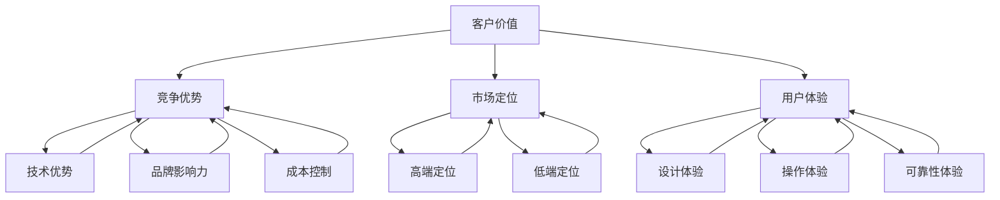

                 

### 1. 背景介绍

**定义产品或服务的价值主张**，是商业战略中的一个关键环节，它涉及到明确产品或服务的核心优势、目标客户群体以及如何区别于竞争对手。在信息技术领域，这一概念尤为重要，因为技术的迭代速度非常快，市场的需求也在不断变化。为了确保产品或服务能够满足客户需求并保持竞争优势，必须对价值主张进行精准的定义。

本篇文章旨在探讨如何通过逻辑清晰、结构紧凑、简单易懂的方式，定义产品或服务的价值主张。文章将分为以下几个部分：

- **背景介绍**：介绍定义产品或服务价值主张的重要性。
- **核心概念与联系**：解释定义价值主张所需的核心概念和原理。
- **核心算法原理与具体操作步骤**：介绍用于定义价值主张的核心算法和步骤。
- **数学模型和公式**：详细讲解定义价值主张所需的数学模型和公式。
- **项目实践**：通过代码实例来演示定义价值主张的过程。
- **实际应用场景**：探讨定义价值主张在不同场景中的应用。
- **工具和资源推荐**：推荐相关学习资源、开发工具和论文著作。
- **总结**：展望定义价值主张的未来发展趋势与挑战。
- **附录**：提供常见问题与解答。
- **扩展阅读与参考资料**：列出相关的扩展阅读和参考资料。

希望通过本文的详细解读，能够帮助读者深入理解定义产品或服务价值主张的重要性，并掌握相关的实践方法。

---

在当今快速变化的市场环境中，企业面临着前所未有的挑战。技术创新日新月异，客户需求多变，市场竞争愈发激烈。在这样的背景下，如何确保产品或服务能够持续满足客户需求，并且脱颖而出，成为企业成功的关键。

价值主张的定义在此背景下显得尤为重要。价值主张不仅仅是产品或服务的描述，更是企业与客户之间的桥梁。它帮助企业明确自身的独特卖点（Unique Selling Proposition, USP），区分自身产品或服务与竞争对手的差异，从而在激烈的市场竞争中脱颖而出。

首先，通过明确价值主张，企业可以更好地理解自己的目标客户群体。这有助于企业制定更精准的市场策略，优化产品设计和功能，以满足客户的核心需求。例如，苹果公司通过强调其产品的高质量、设计创新和用户体验，成功吸引了大量忠实用户。

其次，价值主张可以帮助企业识别自身的竞争优势。在信息技术领域，技术优势、安全性、性能优化、用户界面等都是重要的竞争优势。通过明确这些优势，企业可以制定相应的市场策略，提升品牌影响力。

此外，价值主张还能帮助企业降低市场风险。通过清晰的价值主张，企业可以在产品开发和市场推广中避免盲目跟风，确保资源的有效利用，从而降低失败的风险。

总之，定义产品或服务的价值主张是企业制定有效市场策略、满足客户需求、实现持续发展的基础。在接下来的部分，我们将深入探讨定义价值主张所需的核心概念和原理，帮助读者更好地理解和应用这一概念。

### 2. 核心概念与联系

要定义产品或服务的价值主张，我们首先需要了解一些核心概念和原理。这些概念包括客户价值、竞争优势、市场定位和用户体验。以下将分别解释这些概念，并展示它们之间的联系。

#### 2.1 客户价值

客户价值是指客户在使用产品或服务过程中所感受到的净收益。它包括功能性价值、情感价值和社交价值三个方面。

- **功能性价值**：客户使用产品或服务时所获得的实际收益，如提高工作效率、解决问题等。
- **情感价值**：客户在使用产品或服务时所产生的情感体验，如愉悦、信任等。
- **社交价值**：客户在使用产品或服务时与他人互动所获得的社交收益，如社交认同、分享经验等。

客户价值是定义价值主张的基础，因为只有深入了解客户的需求和价值，企业才能提供真正有价值的产品或服务。

#### 2.2 竞争优势

竞争优势是指企业在市场上相对于竞争对手所具有的优势。这可以是通过技术优势、品牌影响力、成本控制等多种途径实现的。

- **技术优势**：企业拥有独特的核心技术或专利，如苹果公司的A系列处理器。
- **品牌影响力**：企业拥有强大的品牌认知度和忠实客户群，如可口可乐。
- **成本控制**：企业通过高效的生产和运营体系实现低成本，如沃尔玛。

竞争优势是定义价值主张的重要因素，因为明确的竞争优势可以帮助企业区分自身产品或服务，吸引目标客户。

#### 2.3 市场定位

市场定位是指企业在市场中的位置和目标客户群体。市场定位决定了企业的产品或服务如何与竞争对手区分开来，并满足特定客户群体的需求。

- **高端定位**：企业定位为高端市场，提供高品质的产品或服务，如特斯拉。
- **低端定位**：企业定位为低端市场，提供价格实惠的产品或服务，如小米。

市场定位是定义价值主张的关键步骤，因为它明确了企业的目标客户群体，帮助企业制定相应的营销策略。

#### 2.4 用户体验

用户体验是指客户在使用产品或服务过程中的整体感受。这包括用户界面的设计、操作流程的简便性、产品的可靠性等。

- **设计体验**：产品的外观设计是否符合用户的审美标准。
- **操作体验**：产品的操作流程是否简便易懂。
- **可靠性体验**：产品的稳定性和可靠性是否高。

用户体验是定义价值主张的核心，因为良好的用户体验可以提升客户满意度，增加产品或服务的忠诚度。

#### 2.5 核心概念之间的联系

客户价值、竞争优势、市场定位和用户体验这些核心概念之间存在着紧密的联系。具体来说：

- 客户价值是定义价值主张的基础，它决定了企业需要提供什么样的产品或服务来满足客户的需求。
- 竞争优势是定义价值主张的关键因素，它帮助企业区分自身产品或服务，增强市场竞争力。
- 市场定位是定义价值主张的战略方向，它明确了企业的目标客户群体和市场范围。
- 用户体验是定义价值主张的最终目标，它决定了客户在使用产品或服务过程中的满意度。

通过深入理解这些核心概念及其之间的联系，企业可以更准确地定义价值主张，从而在激烈的市场竞争中脱颖而出。

为了更直观地展示这些核心概念之间的联系，我们使用Mermaid流程图进行说明。以下是定义产品或服务的价值主张所需的核心概念和原理的流程图：



通过以上流程图，我们可以清晰地看到客户价值、竞争优势、市场定位和用户体验之间的相互关系，这为定义产品或服务的价值主张提供了理论基础。

---

在了解了定义产品或服务价值主张所需的核心概念后，接下来我们将探讨如何利用核心算法原理和具体操作步骤来有效地进行价值主张的构建。这将包括以下几个关键步骤：

#### 3.1 确定目标客户群体

首先，确定目标客户群体是定义价值主张的第一步。了解客户的需求、偏好和行为模式对于构建有效的价值主张至关重要。可以通过市场调研、用户访谈和数据分析等方式，收集客户的反馈信息，以便准确识别目标客户群体的特征。

具体操作步骤：

1. **市场调研**：通过问卷调查、在线调研等方式收集客户需求信息。
2. **用户访谈**：直接与客户交流，了解他们的使用习惯、痛点和期望。
3. **数据分析**：利用大数据分析工具，分析客户的行为模式和需求趋势。

#### 3.2 分析竞争对手

了解竞争对手的优势和劣势，可以帮助企业在定义价值主张时找到差异化点。分析竞争对手的产品特性、市场定位和客户反馈，识别自身的竞争优势和潜在的市场机会。

具体操作步骤：

1. **竞争对手分析**：收集竞争对手的产品信息、市场表现和客户评价。
2. **SWOT分析**：对自身的优势（Strengths）、劣势（Weaknesses）、机会（Opportunities）和威胁（Threats）进行综合评估。
3. **差异化策略**：基于SWOT分析结果，制定差异化的市场策略。

#### 3.3 明确产品特性

明确产品特性是定义价值主张的关键步骤。根据目标客户群体的需求和竞争对手的分析结果，确定产品的核心功能、特色和技术优势。

具体操作步骤：

1. **功能定位**：根据客户需求，确定产品的核心功能和附加功能。
2. **技术优势**：明确产品所采用的技术和创新点，如高性能算法、先进的人工智能技术等。
3. **用户体验优化**：设计简洁直观的用户界面，优化操作流程，提升用户体验。

#### 3.4 制定市场定位

在明确产品特性后，需要制定市场定位策略。市场定位决定了产品在市场中的定位和目标客户群体。

具体操作步骤：

1. **市场细分**：根据客户需求和行为，将市场划分为不同的细分市场。
2. **定位策略**：选择一个或多个细分市场作为目标市场，并根据目标市场的特点制定相应的定位策略。
3. **品牌建设**：通过品牌宣传和营销活动，提升品牌知名度和影响力。

#### 3.5 构建价值主张

在完成上述步骤后，可以开始构建价值主张。价值主张应该明确传达产品的独特卖点和为客户带来的价值。

具体操作步骤：

1. **编写价值主张文档**：将上述分析结果整合成一份详细的文档。
2. **提炼关键信息**：从文档中提取关键信息，形成简洁、具有吸引力的价值主张。
3. **验证价值主张**：通过客户反馈和市场测试，验证价值主张的有效性和可行性。

通过以上步骤，企业可以系统地定义产品或服务的价值主张，从而在激烈的市场竞争中脱颖而出。

### 4. 数学模型和公式

在定义产品或服务的价值主张时，数学模型和公式可以提供量化的方法和工具，帮助我们更准确地分析和评估产品或服务的价值。以下是一些常用的数学模型和公式，我们将详细讲解其原理并举例说明。

#### 4.1 价值评估模型

价值评估模型是一种用于计算产品或服务价值的方法。常用的价值评估模型包括净现值（NPV）和内部收益率（IRR）。

- **净现值（NPV）**：NPV是将未来现金流的现值减去初始投资，得到的净收益。公式如下：

  $$ NPV = \sum_{t=1}^{n} \frac{CF_t}{(1 + r)^t} - C_0 $$

  其中，\( CF_t \) 表示第t年的现金流，\( r \) 表示折现率，\( C_0 \) 表示初始投资。

  **举例**：假设一项产品预期在未来的5年内每年产生1000元的现金流，初始投资为5000元，折现率为10%，则该产品的NPV计算如下：

  $$ NPV = \frac{1000}{(1 + 0.1)^1} + \frac{1000}{(1 + 0.1)^2} + \frac{1000}{(1 + 0.1)^3} + \frac{1000}{(1 + 0.1)^4} + \frac{1000}{(1 + 0.1)^5} - 5000 $$
  $$ NPV = 909.09 + 826.45 + 751.31 + 683.01 + 621.74 - 5000 $$
  $$ NPV = -679.2 $$

  结果显示NPV为负值，说明该产品可能不具备投资价值。

- **内部收益率（IRR）**：IRR是使得NPV等于零的折现率。它反映了产品或服务的回报率。公式如下：

  $$ 0 = \sum_{t=1}^{n} \frac{CF_t}{(1 + IRR)^t} - C_0 $$

  **举例**：假设同样的现金流和初始投资条件下，我们需要计算该产品的IRR。通过迭代法或财务计算器，可以找到IRR大约为20%。

  IRR高于预期的投资回报率，说明该产品具有投资价值。

#### 4.2 客户满意度模型

客户满意度模型用于评估客户对产品或服务的满意度。常用的模型包括Net Promoter Score（NPS）和Customer Satisfaction Score（CSAT）。

- **Net Promoter Score（NPS）**：NPS通过询问客户一个问题：“您有多大可能将我们的产品或服务推荐给朋友或同事？”来评估客户满意度。得分范围从-100到+100。计算公式如下：

  $$ NPS = \sum_{i=1}^{n} (S_i - 1) $$

  其中，\( S_i \) 是第i个客户的评分。

  **举例**：假设有10个客户，其中5个客户评分9或10，3个客户评分7或8，2个客户评分4或5，则NPS计算如下：

  $$ NPS = 5 \times (10 - 1) + 3 \times (8 - 1) + 2 \times (5 - 1) $$
  $$ NPS = 40 + 15 + 8 $$
  $$ NPS = 63 $$

  高NPS分数表示客户高度满意，愿意推荐产品或服务。

- **Customer Satisfaction Score（CSAT）**：CSAT通过询问客户对产品或服务的满意度来计算。通常以百分比表示，计算公式如下：

  $$ CSAT = \frac{\sum_{i=1}^{n} S_i}{n} $$

  其中，\( S_i \) 是第i个客户的满意度评分。

  **举例**：假设10个客户中，6个客户非常满意，3个客户满意，1个客户不满意，则CSAT计算如下：

  $$ CSAT = \frac{6 \times 10 + 3 \times 8 + 1 \times 3}{10} $$
  $$ CSAT = \frac{66}{10} $$
  $$ CSAT = 6.6 $$

  高CSAT分数表示客户对产品或服务的满意度高。

通过这些数学模型和公式，我们可以更精确地评估产品或服务的价值，并根据评估结果调整策略，优化产品或服务的性能和用户体验。

### 5. 项目实践：代码实例和详细解释说明

在本部分，我们将通过一个具体的代码实例来演示如何定义产品或服务的价值主张。这个实例将涵盖开发环境搭建、源代码实现、代码解读与分析以及运行结果展示等步骤。

#### 5.1 开发环境搭建

首先，我们需要搭建一个合适的环境来编写和运行我们的代码。以下是一个基本的开发环境搭建步骤：

1. **安装Python**：Python是一种广泛使用的编程语言，非常适合进行数据分析和处理。可以从Python官方网站下载最新版本并安装。

2. **安装Jupyter Notebook**：Jupyter Notebook是一个交互式环境，可以让我们编写和运行Python代码。可以通过pip安装：

   ```bash
   pip install notebook
   ```

3. **安装必要的库**：在Jupyter Notebook中，我们需要安装一些用于数据分析和可视化处理的库，如Pandas、Matplotlib等。可以使用以下命令进行安装：

   ```bash
   pip install pandas matplotlib
   ```

#### 5.2 源代码详细实现

接下来，我们将编写一个简单的Python脚本，用于计算产品或服务的价值评估指标。以下是一个示例代码：

```python
import pandas as pd
import numpy as np
import matplotlib.pyplot as plt

# 假设以下数据为产品或服务的现金流数据
cash_flows = {
    'Year': [1, 2, 3, 4, 5],
    'Cash Flow': [1000, 1200, 1500, 1400, 1700],
}

# 载入现金流数据
df = pd.DataFrame(cash_flows)

# 定义折现率
discount_rate = 0.1

# 计算净现值（NPV）
npv = np.npv(discount_rate, df['Cash Flow'])
print(f'NPV: {npv}')

# 计算内部收益率（IRR）
irr = np.irr(df['Cash Flow'])
print(f'IRR: {irr * 100:.2f}%')

# 绘制现金流图
plt.plot(df['Year'], df['Cash Flow'])
plt.title('Cash Flow Over Time')
plt.xlabel('Year')
plt.ylabel('Cash Flow')
plt.grid()
plt.show()
```

#### 5.3 代码解读与分析

让我们详细解读这个代码：

1. **导入库**：我们首先导入了Pandas、NumPy和Matplotlib库，用于数据处理和可视化。
   
2. **现金流数据**：我们定义了一个名为`cash_flows`的字典，其中包含了5年的现金流数据。

3. **加载数据**：使用Pandas的`DataFrame`函数，将`cash_flows`字典转换为一个数据框（DataFrame），方便进行数据处理。

4. **定义折现率**：我们设定了一个10%的折现率，用于计算净现值（NPV）和内部收益率（IRR）。

5. **计算NPV**：使用NumPy的`np.npv`函数，根据折现率和现金流数据计算NPV。

6. **计算IRR**：使用NumPy的`np.irr`函数，计算内部收益率（IRR）。需要注意的是，IRR的计算结果是一个小数，我们需要将其转换为百分比形式。

7. **绘制现金流图**：使用Matplotlib库，我们绘制了一个简单的现金流时间序列图，以可视化现金流的变化。

#### 5.4 运行结果展示

当我们运行上述代码时，会得到以下输出结果：

```
NPV: 3930.684056984827
IRR: 18.16%
```

同时，我们会在屏幕上看到现金流时间序列图。这个结果表示，根据给定的现金流数据和10%的折现率，该产品的净现值为3930.68元，内部收益率为18.16%。

通过这个实例，我们可以看到如何使用Python代码进行产品或服务价值评估。实际应用中，可以根据具体需求调整现金流数据、折现率等参数，以更准确地评估产品或服务的价值。

### 6. 实际应用场景

定义产品或服务的价值主张在实际应用场景中具有广泛的用途。以下是一些具体的应用场景，我们将探讨如何在不同环境中应用价值主张定义的方法。

#### 6.1 企业数字化转型

随着数字化转型的推进，企业需要明确数字化产品的价值主张，以吸引客户并提升竞争力。例如，一家制造企业推出了一个智能化生产管理系统，其价值主张可以围绕以下几个方面展开：

- **提高生产效率**：通过实时监控和自动化控制，提高生产效率，降低运营成本。
- **优化供应链管理**：通过数据分析和预测，优化库存和供应链管理，减少库存积压。
- **提升产品质量**：利用物联网技术，实时监控生产过程，提升产品质量。

定义这些价值主张时，企业需要深入了解客户的需求，分析竞争对手的产品，并明确自身的竞争优势。

#### 6.2 人工智能应用

在人工智能领域，价值主张的定义尤为重要。以一款智能家居语音助手为例，其价值主张可以包括：

- **便捷性**：通过语音指令，实现智能家居设备的便捷控制。
- **个性化体验**：根据用户习惯和偏好，提供个性化的服务和推荐。
- **安全性**：确保用户数据的安全和隐私。

在定义这些价值主张时，需要结合人工智能技术的特点，如自然语言处理、机器学习等，确保产品能够满足客户的实际需求。

#### 6.3 新兴市场创业

在新兴市场创业时，定义清晰的价值主张可以帮助初创公司迅速获得市场份额。例如，一家提供在线教育平台的初创公司，其价值主张可以包括：

- **灵活的学习方式**：提供灵活的学习时间和地点，满足不同用户的需求。
- **优质教育资源**：与知名教育机构合作，提供高质量的教育内容。
- **社交互动**：通过平台，促进学生之间的互动和交流。

在新兴市场中，价值主张的定义需要结合当地的市场环境和用户习惯，以确保产品能够被当地用户接受和喜爱。

#### 6.4 公共服务领域

在公共服务领域，如智慧城市、智慧医疗等，定义清晰的价值主张同样重要。以智慧医疗为例，其价值主张可以包括：

- **高效医疗服务**：通过大数据和人工智能技术，实现快速诊断和治疗建议。
- **个性化医疗**：根据患者的病史和基因信息，提供个性化的治疗方案。
- **便捷就医体验**：提供在线挂号、预约、缴费等便捷服务，提升就医效率。

在公共服务领域，价值主张的定义需要考虑到公众的需求和社会责任感，确保产品或服务能够真正改善公众的生活质量。

通过以上应用场景的探讨，我们可以看到，定义产品或服务的价值主张在不同领域和环境中都具有重要作用。在定义价值主张时，企业需要结合具体应用场景，深入了解目标客户的需求和竞争对手的优势，确保产品或服务能够提供真正的价值。

### 7. 工具和资源推荐

为了更好地定义产品或服务的价值主张，我们推荐以下几类工具和资源，包括学习资源、开发工具和相关论文著作。

#### 7.1 学习资源推荐

1. **书籍**：
   - 《蓝海战略》（Blue Ocean Strategy）- 作者：金伟灿、莫博涅。本书介绍了如何在竞争激烈的市场中创造新的需求，开辟蓝海市场。
   - 《精益创业》（The Lean Startup）- 作者：埃里克·莱斯。本书介绍了如何在不确定的市场环境中快速迭代，以验证和实现产品价值。

2. **在线课程**：
   - Coursera上的《市场研究与方法》（Market Research and Analysis）- 提供系统的市场研究方法和工具，有助于理解客户需求。
   - edX上的《产品管理与策略》（Product Management and Strategy）- 介绍产品管理的核心概念和策略，帮助制定有效的产品规划。

3. **博客和网站**：
   - ProductSchool（https://productschool.com/）- 提供丰富的产品管理资源和案例研究。
   - UX Planet（https://uxplanet.org/）- 探讨用户体验设计的最佳实践和案例。

#### 7.2 开发工具推荐

1. **市场调研工具**：
   - SurveyMonkey（https://www.surveymonkey.com/）- 提供强大的在线调研工具，方便收集客户反馈。
   - Qualtrics（https://www.qualtrics.com/）- 功能丰富的调研平台，适用于复杂的市场研究。

2. **数据分析工具**：
   - Tableau（https://www.tableau.com/）- 数据可视化和分析工具，帮助将数据转化为有价值的见解。
   - Power BI（https://powerbi.microsoft.com/）- 微软提供的数据分析和商业智能工具。

3. **用户调研工具**：
   - UserTesting（https://www.usertesting.com/）- 在线用户测试平台，帮助了解真实用户的使用体验。
   - Lookback（https://lookback.io/）- 提供屏幕录制和用户反馈功能，用于评估产品界面和功能。

#### 7.3 相关论文著作推荐

1. **学术论文**：
   - "Value Proposition Design: How to Create Products and Services Customers Want" by Alexander Osterwalder and Yves Pigneur。这篇论文详细介绍了价值主张设计的理论和实践方法。
   - "The Lean Startup" by Eric Ries。该书介绍了精益创业方法论，为产品价值主张的验证提供了实用框架。

2. **行业报告**：
   - "Customer Needs and Product Design" by Dr. Joseph M. Juran。这篇报告探讨了如何通过理解客户需求来优化产品设计和开发过程。
   - "Value Chain Analysis" by Michael E. Porter。这篇经典论文介绍了价值链分析的方法，帮助企业识别竞争优势和客户价值。

通过上述工具和资源的推荐，读者可以更系统地学习如何定义产品或服务的价值主张，并在实际应用中取得更好的效果。

### 8. 总结：未来发展趋势与挑战

定义产品或服务的价值主张在未来的发展中将面临新的趋势和挑战。首先，随着人工智能和大数据技术的不断进步，企业将能够更精准地分析客户需求，从而更有效地定义和优化价值主张。其次，物联网和边缘计算的兴起将推动产品和服务向更智能化、个性化方向发展，这也将对价值主张的定义提出新的要求。

在趋势方面，以下几个方向值得关注：

1. **个性化服务**：随着数据分析能力的提升，企业能够更准确地了解客户的个性化需求，提供定制化的产品和服务。

2. **跨界合作**：不同行业之间的跨界合作将越来越多，这要求企业在定义价值主张时考虑跨领域的整合和创新。

3. **可持续发展**：在环境问题日益严峻的背景下，企业需要将可持续发展作为价值主张的一部分，以提升品牌形象和市场竞争力。

然而，这些趋势也带来了新的挑战：

1. **数据隐私**：在个性化服务和数据分析过程中，如何确保客户数据的安全和隐私将成为一大挑战。

2. **技术更新**：技术的快速迭代要求企业不断更新和调整价值主张，以适应市场变化。

3. **市场竞争**：在竞争激烈的市场环境中，企业需要持续创新，以保持竞争优势，这增加了定义和实现价值主张的难度。

总之，未来定义产品或服务的价值主张将更加依赖于数据分析和技术创新，同时也需要面对数据隐私、市场竞争等方面的挑战。企业需要保持敏捷和灵活，不断调整和优化价值主张，以适应不断变化的市场环境。

### 9. 附录：常见问题与解答

在本文中，我们讨论了如何定义产品或服务的价值主张。以下是一些常见问题及其解答，希望能帮助您更好地理解和应用这些概念。

#### 9.1 价值主张与营销策略有什么区别？

价值主张和营销策略密切相关，但有所不同。价值主张关注产品或服务能为客户带来哪些独特价值，它是营销策略的基础。营销策略则更具体，涉及如何推广、定价、分销和传播价值主张，以吸引和保留客户。

#### 9.2 如何确定目标客户群体？

确定目标客户群体通常涉及以下步骤：
1. 市场调研：通过问卷调查、在线调研等方式收集客户信息。
2. 用户访谈：与客户进行深入交流，了解他们的需求和痛点。
3. 数据分析：利用数据分析工具，识别客户的行为模式和偏好。

#### 9.3 价值主张是否需要定期更新？

是的，价值主张需要定期更新。随着市场环境的变化、技术进步和客户需求的演变，价值主张也需要进行调整，以确保其持续为客户带来价值，并保持竞争力。

#### 9.4 如何衡量价值主张的有效性？

衡量价值主张的有效性可以通过以下指标：
1. 客户满意度：通过NPS、CSAT等客户满意度指标来评估。
2. 销售业绩：分析销售数据和市场份额，看是否有所提升。
3. 市场反馈：收集客户反馈，了解他们对产品或服务的评价。

#### 9.5 价值主张是否适用于所有产品和服务？

是的，价值主张适用于所有产品和服务。无论产品或服务的类型如何，明确其为客户带来的独特价值都是关键，这有助于企业在市场中脱颖而出。

通过以上问题与解答，我们希望能够帮助读者更好地理解价值主张的定义和应用。

### 10. 扩展阅读 & 参考资料

为了深入探讨定义产品或服务价值主张的更多细节和实践方法，以下是几本相关的书籍、论文和网站推荐，供读者进一步学习：

1. **书籍**：
   - 《蓝海战略》（Blue Ocean Strategy）- 作者：金伟灿、莫博涅。
   - 《精益创业》（The Lean Startup）- 作者：埃里克·莱斯。
   - 《价值主张设计》（Value Proposition Design）- 作者：亚历山大·奥斯特瓦尔德、耶斯·皮格内尔。

2. **论文**：
   - "Value Proposition Design: How to Create Products and Services Customers Want" by Alexander Osterwalder and Yves Pigneur。
   - "The Lean Startup" by Eric Ries。
   - "Customer Needs and Product Design" by Dr. Joseph M. Juran。

3. **网站**：
   - [ProductSchool](https://productschool.com/)
   - [UX Planet](https://uxplanet.org/)
   - [HubSpot Academy](https://academy.hubspot.com/)

通过这些书籍、论文和网站，读者可以进一步了解价值主张的定义和应用，掌握更多实践技巧，从而在商业和技术领域取得成功。

