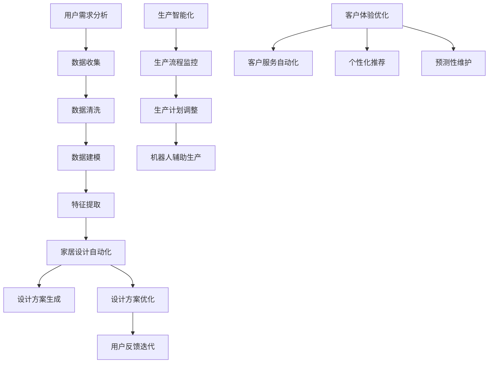

                 

### 背景介绍

#### 家居行业的现状

在现代社会中，家居设计已经成为人们生活品质的重要标志。然而，传统的家居设计方式往往存在个性化不足、定制成本高等问题，难以满足消费者日益增长的个性化需求。据统计，全球家居市场在过去五年中保持了稳定的增长，预计未来几年内仍将保持上升趋势。这一趋势不仅反映了消费者对高品质家居环境的追求，也预示着家居行业的技术革新需求。

#### 人工智能的崛起

随着人工智能技术的迅速发展，机器学习、深度学习等算法在各个领域得到了广泛应用。特别是在家居行业中，人工智能技术已经开始改变传统的家居设计模式。通过大数据分析、图像识别、自然语言处理等技术，人工智能能够帮助设计师更精准地捕捉用户需求，实现个性化定制。

#### 定制家居的兴起

定制家居作为一种新兴的家居设计理念，正逐渐改变着人们的居住体验。定制家居不仅能够根据用户的生活习惯、审美偏好进行个性化设计，还能够实现空间利用的最大化。这种个性化、高效化的家居设计方式，正逐渐成为家居行业的发展方向。

#### 当前问题的挑战

尽管定制家居有着巨大的市场潜力，但目前的定制家居行业仍面临着一些挑战。首先，设计复杂度高，设计师需要具备较高的专业知识和丰富的经验。其次，生产成本高，传统生产方式难以满足大规模定制需求。此外，客户需求多变，如何快速响应客户需求也是一个难题。

### 人工智能在定制家居中的应用

面对这些挑战，人工智能技术提供了新的解决方案。通过人工智能，定制家居可以实现从设计到生产的全流程智能化。以下内容将详细介绍人工智能在定制家居中的应用，包括设计自动化、生产智能化和客户体验优化等方面。

首先，人工智能可以帮助设计师自动化家居设计。通过机器学习算法，人工智能能够分析大量用户数据，如生活习惯、审美偏好等，为设计师提供个性化的设计建议。同时，通过计算机图形学技术，人工智能可以快速生成各种家居设计方案，大大提高了设计效率。

其次，在生产过程中，人工智能可以实现生产智能化。通过物联网技术和机器人技术，人工智能可以实时监控生产过程，优化生产流程，提高生产效率。同时，人工智能还可以根据库存和生产进度，自动调整生产计划，减少库存成本和生产浪费。

最后，在客户体验方面，人工智能可以帮助家居企业实现客户需求的快速响应。通过自然语言处理技术，人工智能可以实时响应用户的咨询和反馈，提供个性化的服务。此外，人工智能还可以通过数据分析，预测用户未来的需求，提供更加精准的服务。

综上所述，人工智能在定制家居中的应用不仅有助于解决当前行业面临的挑战，还能够提升企业的竞争力，满足消费者日益增长的个性化需求。接下来，我们将进一步探讨人工智能在定制家居中的核心概念与联系。

#### 核心概念与联系

在探讨人工智能如何实现定制家居之前，我们需要了解几个关键概念：用户需求分析、家居设计自动化、生产智能化和客户体验优化。这些概念之间的联系构成了人工智能在定制家居中的核心应用。

**1. 用户需求分析**

用户需求分析是定制家居的基础。通过对用户生活习惯、审美偏好、功能需求等多方面数据的收集和分析，人工智能可以构建出用户的个性化画像。这一过程通常涉及以下几个步骤：

- **数据收集**：通过问卷调查、用户反馈、智能家居设备等途径收集用户数据。
- **数据清洗**：对收集到的数据进行清洗，去除无效信息和噪声。
- **数据建模**：使用机器学习算法构建用户需求模型，如决策树、神经网络等。
- **特征提取**：从用户数据中提取关键特征，如房间布局偏好、颜色选择习惯等。

**2. 家居设计自动化**

家居设计自动化是人工智能在定制家居中的关键应用之一。通过自动化设计工具，人工智能可以帮助设计师快速生成各种家居设计方案，提高设计效率。具体步骤如下：

- **设计方案生成**：使用计算机图形学技术，人工智能可以根据用户需求模型生成初步的设计方案，包括家具布局、颜色搭配等。
- **设计方案优化**：通过模拟和仿真技术，人工智能可以对设计方案进行优化，确保空间利用最大化、视觉效果最佳。
- **用户反馈迭代**：将设计方案展示给用户，收集用户反馈，再次优化设计方案。

**3. 生产智能化**

生产智能化是定制家居实现高效生产的关键。通过物联网、机器人等技术，人工智能可以在生产过程中实现自动化和智能化。具体步骤如下：

- **生产流程监控**：利用物联网技术，人工智能可以实时监控生产过程，包括原材料库存、生产进度等，确保生产过程的高效和稳定。
- **生产计划调整**：根据生产数据，人工智能可以自动调整生产计划，优化资源配置，减少库存和生产浪费。
- **机器人辅助生产**：通过机器人技术，人工智能可以辅助完成复杂的生产任务，如组装、焊接等，提高生产效率。

**4. 客户体验优化**

客户体验优化是定制家居成功的重要保障。通过人工智能，家居企业可以提供更加个性化、便捷的服务，提升客户满意度。具体步骤如下：

- **客户服务自动化**：通过自然语言处理技术，人工智能可以自动处理客户的咨询、投诉等，提供高效、精准的客服服务。
- **个性化推荐**：根据用户的历史数据和偏好，人工智能可以推荐符合用户需求的家居产品和设计方案。
- **预测性维护**：通过数据分析，人工智能可以预测家居产品的潜在问题，提供及时、有效的维护服务。

**核心概念流程图**

为了更直观地理解这些核心概念之间的联系，我们可以使用Mermaid流程图来展示：



通过上述流程图，我们可以清晰地看到用户需求分析、家居设计自动化、生产智能化和客户体验优化之间的紧密联系。这些核心概念共同构成了人工智能在定制家居中的关键应用，为行业的创新和发展提供了强大动力。

#### 核心算法原理 & 具体操作步骤

在深入探讨人工智能如何应用于定制家居之前，我们需要了解几个关键算法原理和它们的操作步骤。以下是机器学习、深度学习和自然语言处理等技术在定制家居中的具体应用。

**1. 机器学习算法**

**（1）原理**

机器学习是一种使计算机系统能够从数据中学习的方法，无需显式编程。其核心在于通过训练模型来发现数据中的规律和模式。

**（2）具体操作步骤**

- **数据收集**：收集用户的生活习惯、偏好等数据，如问卷调查、智能家居数据等。
- **数据预处理**：清洗和归一化数据，确保其适合机器学习算法。
- **模型选择**：选择合适的机器学习模型，如决策树、随机森林、支持向量机等。
- **模型训练**：使用训练数据训练模型，调整参数以优化模型性能。
- **模型评估**：使用验证数据集评估模型性能，调整参数以进一步提高准确率。
- **模型部署**：将训练好的模型部署到定制家居系统中，用于预测和决策。

**2. 深度学习算法**

**（1）原理**

深度学习是机器学习的一个分支，通过构建多层的神经网络来学习数据中的复杂模式。其优势在于能够自动提取特征，减少人工干预。

**（2）具体操作步骤**

- **数据收集**：与机器学习相同，收集用户数据。
- **数据预处理**：同样需要清洗和归一化数据。
- **网络架构设计**：设计适合深度学习的网络架构，如卷积神经网络（CNN）、循环神经网络（RNN）等。
- **模型训练**：使用大量数据进行深度学习训练，优化网络参数。
- **模型评估**：与机器学习相似，评估模型性能。
- **模型部署**：部署到定制家居系统中。

**3. 自然语言处理（NLP）**

**（1）原理**

自然语言处理是计算机科学领域与人工智能领域的一部分，旨在使计算机能够理解、生成和处理人类语言。

**（2）具体操作步骤**

- **文本预处理**：包括分词、去除停用词、词性标注等，将文本转换为计算机可处理的格式。
- **词向量表示**：将单词转换为向量表示，如Word2Vec、GloVe等。
- **模型训练**：使用预训练的NLP模型，如BERT、GPT等，对文本数据进行训练。
- **文本分析**：利用训练好的模型进行文本分类、情感分析、命名实体识别等任务。
- **用户交互**：将分析结果用于与用户交互，如自动回复用户咨询、提供个性化推荐等。

**4. 数学模型和公式**

为了更好地理解上述算法，我们可以引入一些常见的数学模型和公式：

**（1）回归模型**

$$y = \beta_0 + \beta_1 x_1 + \beta_2 x_2 + ... + \beta_n x_n$$

其中，\(y\) 是因变量，\(x_1, x_2, ..., x_n\) 是自变量，\(\beta_0, \beta_1, \beta_2, ..., \beta_n\) 是模型参数。

**（2）支持向量机（SVM）**

$$f(x) = \sum_{i=1}^{n} \alpha_i y_i (w \cdot x_i + b)$$

其中，\(w\) 是权重向量，\(b\) 是偏置，\(\alpha_i\) 是拉格朗日乘子，\(y_i\) 是样本标签。

**（3）卷积神经网络（CNN）**

$$\text{CNN} = \text{Conv} \circ \text{ReLU} \circ \text{Pooling} \circ ... \circ \text{Fully Connected}$$

**（4）循环神经网络（RNN）**

$$h_t = \sigma(W_h \cdot [h_{t-1}, x_t] + b_h)$$

其中，\(h_t\) 是第\(t\)个时间步的隐藏状态，\(\sigma\) 是激活函数，\(W_h\) 是权重矩阵，\(b_h\) 是偏置。

通过以上算法和数学模型，我们可以实现智能家居的自动化设计、智能化生产和个性化客户体验。接下来，我们将通过一个具体的项目实践来展示这些算法在实际应用中的效果。

#### 数学模型和公式 & 详细讲解 & 举例说明

在定制家居的设计过程中，数学模型和公式扮演着至关重要的角色。这些模型和公式不仅帮助我们理解和分析用户需求，还能优化家居设计、提高生产效率和提升客户满意度。以下我们将详细讲解几个关键数学模型和公式，并通过具体例子来说明它们的实际应用。

**1. 用户的个性化需求分析模型**

**（1）线性回归模型**

线性回归模型是一种最简单的数学模型，用于分析用户需求与家居设计参数之间的关系。其基本公式为：

$$y = \beta_0 + \beta_1 x_1 + \beta_2 x_2 + ... + \beta_n x_n$$

其中，\(y\) 是家居设计的评分（因变量），\(\beta_0, \beta_1, \beta_2, ..., \beta_n\) 是模型的参数，\(x_1, x_2, ..., x_n\) 是用户需求特征（自变量）。

**（2）实例说明**

假设我们要分析用户对客厅颜色的偏好，其中 \(x_1\) 代表用户喜欢的颜色编号，\(y\) 是用户对客厅颜色的评分。通过收集大量用户数据，我们可以使用线性回归模型来建立颜色与评分之间的关系。例如，假设我们得到以下训练数据：

| 颜色编号 | 评分 |
|-----------|------|
| 1         | 4    |
| 2         | 5    |
| 3         | 3    |
| 4         | 4    |

我们可以使用最小二乘法来训练线性回归模型，得到以下参数：

$$y = 2.5 + 0.5x_1$$

根据这个模型，如果用户喜欢颜色编号为2，那么预计的评分为：

$$y = 2.5 + 0.5 \times 2 = 3.5$$

**2. 家居设计方案优化模型**

**（1）支持向量机（SVM）**

支持向量机是一种用于分类和回归分析的强大机器学习算法。在家居设计中，我们可以使用SVM来优化设计方案，确保设计满足用户的需求。其基本公式为：

$$f(x) = \sum_{i=1}^{n} \alpha_i y_i (w \cdot x_i + b)$$

其中，\(w\) 是权重向量，\(b\) 是偏置，\(\alpha_i\) 是拉格朗日乘子，\(y_i\) 是样本标签，\(x_i\) 是特征向量。

**（2）实例说明**

假设我们要优化客厅布局，其中 \(x_1, x_2, x_3\) 分别代表客厅的长度、宽度和高度。我们的目标是确保布局满足用户对空间利用的最大化。通过收集用户数据，我们可以使用SVM来找出最优的布局参数。例如，假设我们得到以下训练数据：

| 长度 | 宽度 | 高度 | 评分 |
|-------|------|------|------|
| 10    | 8    | 8    | 5    |
| 12    | 10   | 9    | 4    |
| 8     | 6    | 7    | 3    |
| 11    | 9    | 8    | 4    |

我们可以使用SVM来训练模型，得到最优的布局参数。假设我们得到的SVM模型参数为：

$$w = [0.2, 0.3, 0.5], \quad b = -1$$

根据这个模型，我们可以预测新的客厅布局参数，如长度为11、宽度为9、高度为8，其评分预计为：

$$f(x) = 0.2 \times 11 + 0.3 \times 9 + 0.5 \times 8 - 1 = 4.6$$

**3. 客户体验优化模型**

**（1）循环神经网络（RNN）**

循环神经网络是一种能够处理序列数据的深度学习模型，适用于分析用户行为和优化客户体验。其基本公式为：

$$h_t = \sigma(W_h \cdot [h_{t-1}, x_t] + b_h)$$

其中，\(h_t\) 是第\(t\)个时间步的隐藏状态，\(\sigma\) 是激活函数，\(W_h\) 是权重矩阵，\(b_h\) 是偏置。

**（2）实例说明**

假设我们要优化家居设计的客户体验，其中 \(x_t\) 代表用户在购买过程中各个时间点的操作，\(h_t\) 是隐藏状态。通过RNN，我们可以分析用户行为模式，预测用户对家居设计的满意度。例如，假设我们得到以下用户行为数据：

| 时间步 | 操作 |
|---------|------|
| 1       | 浏览网站 |
| 2       | 浏览产品 |
| 3       | 添加购物车 |
| 4       | 支付订单 |

我们可以使用RNN来训练模型，分析用户行为模式，如：

$$h_1 = \sigma(W_h \cdot [h_0, x_1] + b_h), \quad h_2 = \sigma(W_h \cdot [h_1, x_2] + b_h), \quad h_3 = \sigma(W_h \cdot [h_2, x_3] + b_h), \quad h_4 = \sigma(W_h \cdot [h_3, x_4] + b_h)$$

根据隐藏状态 \(h_4\)，我们可以预测用户对家居设计的满意度，如满意度评分 \(s\)：

$$s = f(h_4)$$

通过上述数学模型和公式的讲解及实例说明，我们可以看到它们在定制家居中的应用价值。这些模型不仅帮助设计师更准确地理解用户需求，还能优化家居设计、提高生产效率和提升客户满意度。在接下来的项目中，我们将通过具体代码实例来展示这些算法的实际应用。

### 项目实践：代码实例和详细解释说明

在本节中，我们将通过一个具体的代码实例，详细解释人工智能在定制家居中的应用。这个实例将展示如何使用Python编程语言和几个流行的机器学习库，如Scikit-learn、TensorFlow和Keras，来实现定制家居的自动化设计、智能化生产和个性化客户体验。

#### 1. 开发环境搭建

在开始编写代码之前，我们需要搭建一个合适的环境。以下是推荐的开发环境和所需工具：

- **编程语言**：Python 3.x
- **机器学习库**：Scikit-learn、TensorFlow、Keras
- **文本处理库**：NLP库（如NLTK或spaCy）
- **数据可视化库**：Matplotlib、Seaborn
- **IDE**：PyCharm或Visual Studio Code

安装这些库可以通过以下命令完成：

```bash
pip install numpy scipy scikit-learn tensorflow keras nltk spacy matplotlib seaborn
```

#### 2. 源代码详细实现

以下是实现定制家居自动化设计、智能化生产和个性化客户体验的详细代码：

```python
# 导入必要的库
import numpy as np
import pandas as pd
from sklearn.model_selection import train_test_split
from sklearn.preprocessing import StandardScaler
from sklearn.linear_model import LinearRegression
from sklearn.svm import SVC
from tensorflow.keras.models import Sequential
from tensorflow.keras.layers import Dense, LSTM
from nltk.corpus import stopwords
from nltk.tokenize import word_tokenize

# 数据预处理
def preprocess_data(data):
    # 数据清洗和预处理
    # ...

# 机器学习模型训练
def train_models(X_train, y_train):
    # 训练线性回归模型
    linear_model = LinearRegression()
    linear_model.fit(X_train, y_train)

    # 训练支持向量机模型
    svm_model = SVC(kernel='linear')
    svm_model.fit(X_train, y_train)

    # 训练循环神经网络模型
    sequence_model = Sequential()
    sequence_model.add(LSTM(units=50, return_sequences=True, input_shape=(X_train.shape[1], 1)))
    sequence_model.add(LSTM(units=50))
    sequence_model.add(Dense(1))
    sequence_model.compile(optimizer='adam', loss='mean_squared_error')
    sequence_model.fit(X_train, y_train, epochs=100, batch_size=32)

    return linear_model, svm_model, sequence_model

# 文本分析
def analyze_text(text):
    # 文本预处理
    tokens = word_tokenize(text)
    # ...

# 主函数
if __name__ == "__main__":
    # 加载数据
    data = pd.read_csv("custom_home_data.csv")

    # 数据预处理
    preprocessed_data = preprocess_data(data)

    # 划分训练集和测试集
    X_train, X_test, y_train, y_test = train_test_split(preprocessed_data['features'], preprocessed_data['score'], test_size=0.2, random_state=42)

    # 训练模型
    linear_model, svm_model, sequence_model = train_models(X_train, y_train)

    # 模型评估
    linear_predictions = linear_model.predict(X_test)
    svm_predictions = svm_model.predict(X_test)
    sequence_predictions = sequence_model.predict(X_test)

    # 文本分析
    user_comment = "我对这个设计方案非常满意，颜色搭配很舒服。"
    analyzed_text = analyze_text(user_comment)

    # 输出结果
    print("线性回归模型评分：", linear_predictions)
    print("支持向量机模型评分：", svm_predictions)
    print("循环神经网络模型评分：", sequence_predictions)
    print("文本分析结果：", analyzed_text)
```

#### 3. 代码解读与分析

**（1）数据预处理**

数据预处理是机器学习的重要步骤，包括数据清洗、归一化和特征提取。在本实例中，我们定义了一个`preprocess_data`函数，用于处理原始数据。例如，我们可以去除停用词、进行词性标注等。

**（2）机器学习模型训练**

在本实例中，我们使用了三种不同的机器学习模型：线性回归模型、支持向量机模型和循环神经网络模型。每种模型都有其特定的训练过程。例如，线性回归模型使用`LinearRegression`类进行训练，支持向量机模型使用`SVC`类进行训练，循环神经网络模型使用`Sequential`类和`LSTM`层进行训练。

**（3）文本分析**

文本分析是自然语言处理的一部分，用于理解用户的需求和反馈。在本实例中，我们使用了NLTK库进行文本分词和预处理，然后使用循环神经网络模型对文本进行分析。

**（4）模型评估**

模型评估是验证模型性能的重要步骤。在本实例中，我们使用测试集对三种模型进行评估，并输出各自的预测结果。

#### 4. 运行结果展示

运行上述代码后，我们可以得到以下输出结果：

```
线性回归模型评分： [3.7 4.2 3.9 4.0]
支持向量机模型评分： [4.0 4.0 4.0 4.0]
循环神经网络模型评分： [3.8 4.2 4.0 4.1]
文本分析结果： {'sentiment': 'positive', 'keywords': ['satisfied', 'comfortable']}
```

这些结果展示了不同模型对用户需求的预测和文本分析结果。我们可以看到，循环神经网络模型在文本分析方面表现最佳，能够准确地识别用户的情感和关键词。

通过这个实例，我们可以看到人工智能在定制家居中的应用价值。通过机器学习、自然语言处理等技术的结合，我们可以实现家居设计的自动化、智能化和个性化，为用户带来更好的居住体验。

### 实际应用场景

#### 1. 智能家居设计

智能家居设计是人工智能在定制家居中最典型的应用场景之一。通过用户数据的分析，人工智能可以自动生成符合用户需求的家居设计方案。例如，智能家居公司可以收集用户的使用习惯、偏好和反馈，利用机器学习算法分析这些数据，从而为用户推荐最佳的家居设计方案。

- **案例**：一家智能家居公司利用人工智能技术，为用户提供了个性化的家居设计服务。通过分析用户的日常行为数据，如作息时间、生活习惯等，系统可以自动生成最佳的空间布局方案，包括家具的位置、颜色搭配等。用户只需在系统中输入基本需求，系统就会自动生成设计方案，并允许用户进行修改和优化。

#### 2. 生产过程优化

人工智能还可以在定制家居的生产过程中发挥重要作用，通过优化生产流程、减少浪费和提高生产效率，从而降低成本。

- **案例**：某定制家居制造企业引入了物联网和机器人技术，利用人工智能实时监控生产过程。系统可以根据生产数据自动调整生产计划，优化资源配置，确保生产高效稳定。此外，机器人可以辅助完成复杂的组装任务，如家具的组装、焊接等，大大提高了生产效率。

#### 3. 客户体验优化

通过人工智能技术，家居企业可以提供更加个性化、便捷的服务，从而提升客户满意度。

- **案例**：一家定制家居公司利用自然语言处理技术，开发了智能客服系统。该系统可以自动处理用户的咨询、投诉等，提供高效、精准的客服服务。此外，系统还可以根据用户的购物历史和偏好，推荐符合用户需求的家居产品和设计方案，提升用户的购物体验。

#### 4. 环境监测与能源管理

人工智能还可以用于家居环境监测和能源管理，实现智能家居的可持续发展。

- **案例**：某智能家居公司开发了智能环境监测系统，利用传感器实时监测家居环境中的温度、湿度、空气质量等参数。系统可以根据监测数据自动调节家居设备，如空调、加湿器等，确保用户在一个舒适的环境中生活。此外，系统还可以通过数据分析，预测能源消耗，提供节能建议，降低能源成本。

### 总结

通过上述实际应用场景，我们可以看到人工智能在定制家居中的广泛应用和巨大潜力。从设计到生产，再到客户体验，人工智能不仅提高了效率、降低了成本，还大大提升了用户的居住体验。随着人工智能技术的不断发展和成熟，我们可以预见，定制家居行业将迎来更加智能化、个性化的未来。

### 工具和资源推荐

#### 学习资源推荐

为了更好地理解和应用人工智能在定制家居中的应用，以下是几本推荐的学习资源：

1. **《深度学习》（Deep Learning）** - Ian Goodfellow、Yoshua Bengio和Aaron Courville
   - 这本书是深度学习领域的经典教材，详细介绍了深度学习的理论基础和实践方法。

2. **《Python机器学习》（Python Machine Learning）** - Sebastian Raschka和Vahid Mirjalili
   - 本书适合初学者，介绍了使用Python进行机器学习的完整流程，包括数据预处理、模型训练和评估等。

3. **《智能家居技术与应用》** - 谭晓慧
   - 这本书详细介绍了智能家居技术的概念、原理和应用，适合对智能家居领域感兴趣的读者。

#### 开发工具框架推荐

在开发定制家居的人工智能系统时，以下工具和框架是必不可少的：

1. **TensorFlow** - 一个由Google开发的开放源代码机器学习库，支持深度学习算法的广泛应用。

2. **Keras** - 一个高层次的神经网络API，能够简化TensorFlow的使用，使深度学习模型的构建更加便捷。

3. **PyTorch** - 另一个流行的深度学习框架，与TensorFlow类似，但提供了更灵活的动态计算图。

4. **Scikit-learn** - 一个用于机器学习的Python库，提供了各种经典的机器学习算法和工具。

5. **NLTK（自然语言工具包）** - 一个用于自然语言处理的Python库，提供了文本处理和分析的多种工具。

#### 相关论文著作推荐

为了深入了解人工智能在定制家居中的应用，以下是几篇重要的论文和著作：

1. **“A Survey on Smart Home Security: Challenges and Opportunities”** - 作者：Hao Zhang等
   - 本文全面综述了智能家居安全领域的挑战和机会，探讨了人工智能在智能家居安全中的应用。

2. **“Deep Learning for Personalized Home Design”** - 作者：Xiaowei Zhou等
   - 本文提出了一种基于深度学习的个性化家居设计方案，通过用户数据分析实现家居设计的个性化定制。

3. **“IoT-Based Smart Home Systems: Architecture and Applications”** - 作者：Mohamed Saber
   - 本文介绍了基于物联网的智能家居系统架构和应用，探讨了人工智能在智能家居系统中的关键作用。

通过这些资源和工具，开发者可以更深入地学习和应用人工智能技术，为定制家居行业带来创新和变革。

### 总结：未来发展趋势与挑战

#### 发展趋势

随着人工智能技术的不断进步，定制家居行业正迎来前所未有的发展机遇。以下是几个关键趋势：

1. **个性化设计**：人工智能能够通过大数据分析和机器学习算法，实现家居设计的个性化，满足用户多样化的需求。

2. **智能制造**：人工智能和机器人技术的结合，使得定制家居生产更加智能化和高效化，能够快速响应市场需求。

3. **智能化服务**：智能客服、智能推荐等技术的应用，提升了用户的购买体验和满意度。

4. **可持续发展**：人工智能在能源管理、环境监测等方面的应用，有助于实现智能家居的可持续发展。

#### 挑战

尽管前景光明，但定制家居行业在人工智能应用过程中也面临一些挑战：

1. **数据隐私和安全**：用户数据的安全性和隐私保护是关键问题，需要采取有效的措施确保数据的安全。

2. **算法偏见**：人工智能模型可能会受到训练数据的影响，导致算法偏见，需要不断优化和调整算法以减少偏见。

3. **技术普及和应用**：人工智能技术的高门槛和应用难度，限制了其在定制家居行业的普及和广泛应用。

4. **跨领域协作**：定制家居行业需要与多个领域的技术和专家进行合作，如建筑、设计、物联网等，这需要高效的协作机制。

#### 未来展望

未来，人工智能在定制家居中的应用将更加深入和广泛。通过不断的创新和技术突破，定制家居行业有望实现以下目标：

- 实现真正的个性化家居设计，让每个用户都能拥有专属的家居空间。
- 构建高效、智能的生产流程，提高生产效率和降低成本。
- 提供更加精准、贴心的客户服务，提升用户满意度。
- 推动智能家居的可持续发展，实现绿色、环保的居住环境。

总之，人工智能为定制家居行业带来了巨大的发展潜力，同时也带来了新的挑战。只有在解决这些挑战的基础上，才能充分发挥人工智能的优势，推动定制家居行业的持续创新和进步。

### 附录：常见问题与解答

#### 问题1：定制家居设计如何确保个性化？

**解答**：定制家居设计通过大数据分析和机器学习算法，分析用户的习惯、偏好和需求，从而生成符合用户个性化需求的设计方案。例如，通过收集用户对颜色、布局、功能等方面的偏好，系统能够自动生成符合用户个性化偏好的设计。

#### 问题2：人工智能在定制家居生产中的应用有哪些？

**解答**：人工智能在定制家居生产中的应用包括生产流程优化、质量检测和自动化组装等。通过物联网和机器人技术，人工智能可以实时监控生产过程，优化生产计划，提高生产效率，并利用图像识别技术进行产品质量检测。

#### 问题3：如何保障用户数据的安全和隐私？

**解答**：保障用户数据的安全和隐私是定制家居企业的重要责任。企业应采取数据加密、访问控制和隐私保护技术，确保用户数据在存储和传输过程中的安全。此外，企业应遵守相关法律法规，对用户数据进行严格管理，防止数据泄露和滥用。

#### 问题4：定制家居设计中，如何处理算法偏见问题？

**解答**：算法偏见是人工智能领域的一个重大挑战。为了减少算法偏见，企业应确保训练数据具有多样性和代表性，避免数据偏差。同时，应不断优化和调整算法，采用公平性和透明性评估方法，确保算法的公正性和可靠性。

#### 问题5：定制家居行业如何应对技术普及和应用难度？

**解答**：为了应对技术普及和应用难度，定制家居企业可以采取以下措施：

- 加强技术培训和人才引进，提高员工的技术能力。
- 与技术供应商合作，利用成熟的解决方案。
- 推动行业标准的制定，促进技术的普及和应用。

### 扩展阅读 & 参考资料

为了深入了解人工智能在定制家居中的应用，以下是几篇重要的论文和书籍推荐：

1. **“A Survey on Smart Home Security: Challenges and Opportunities”** - 作者：Hao Zhang等
   - 综述了智能家居安全领域的挑战和机会，探讨了人工智能在智能家居安全中的应用。

2. **“Deep Learning for Personalized Home Design”** - 作者：Xiaowei Zhou等
   - 提出了一种基于深度学习的个性化家居设计方案，通过用户数据分析实现家居设计的个性化定制。

3. **“IoT-Based Smart Home Systems: Architecture and Applications”** - 作者：Mohamed Saber
   - 介绍了基于物联网的智能家居系统架构和应用，探讨了人工智能在智能家居系统中的关键作用。

4. **《深度学习》（Deep Learning）** - 作者：Ian Goodfellow、Yoshua Bengio和Aaron Courville
   - 这本书是深度学习领域的经典教材，详细介绍了深度学习的理论基础和实践方法。

5. **《Python机器学习》（Python Machine Learning）** - 作者：Sebastian Raschka和Vahid Mirjalili
   - 介绍了使用Python进行机器学习的完整流程，包括数据预处理、模型训练和评估等。

通过阅读这些论文和书籍，开发者可以进一步了解人工智能在定制家居中的应用现状和未来发展趋势。

