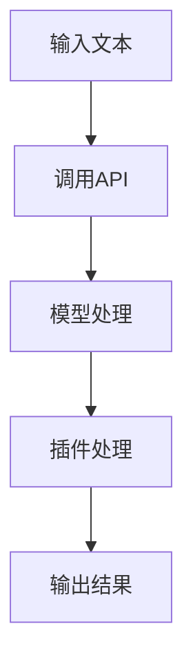

                 

### 文章标题

《实战二：动手开发第一个 ChatGPT Plugin》

> **关键词**：ChatGPT、Plugin开发、技术实战、人工智能、编程指南
> 
> **摘要**：本文将带领读者动手开发第一个ChatGPT插件，详细介绍开发流程、核心算法原理和实现步骤，通过实践项目展示如何将人工智能与实际应用相结合，为开发者提供全面的技术指导和实战经验。

### 1. 背景介绍

ChatGPT是由OpenAI开发的一种基于GPT-3模型的预训练语言模型，能够进行自然语言理解和生成。随着人工智能技术的快速发展，ChatGPT在各个领域的应用越来越广泛，例如智能客服、文本生成、问答系统等。然而，ChatGPT作为一个强大的语言模型，其功能仍然可以通过插件进行扩展，以更好地满足用户的需求。

ChatGPT插件是一种基于API的应用程序，可以与ChatGPT模型进行交互，实现对模型功能的扩展。通过开发插件，开发者可以自定义特定的功能模块，将ChatGPT模型与现有系统无缝集成，提升应用程序的智能化水平。

本文的目标是帮助开发者了解ChatGPT插件的基本原理和开发流程，通过实际操作，掌握如何开发第一个ChatGPT插件。这将有助于读者更好地理解人工智能与编程的结合，提升自己在人工智能领域的技能。

### 2. 核心概念与联系

在开发ChatGPT插件之前，我们需要了解一些核心概念，包括ChatGPT模型的架构、API接口以及插件的基本原理。

#### 2.1 ChatGPT模型架构

ChatGPT模型基于GPT-3模型，是一种大规模的预训练语言模型。GPT-3模型采用了Transformer架构，通过自我关注机制（Self-Attention）和多层神经网络（Multi-Layer Neural Network）来实现。模型通过大量文本数据进行预训练，可以理解并生成自然语言。


#### 2.2 API接口

ChatGPT提供了丰富的API接口，方便开发者进行模型调用和插件开发。主要接口包括：

- `openai.Completion.create()`：用于生成文本的接口。
- `openai.Embeddings.create()`：用于生成文本向量的接口。
- `openai.Search.create()`：用于文本搜索的接口。

这些接口通过HTTP请求与ChatGPT模型进行通信，返回处理结果。

#### 2.3 插件原理

ChatGPT插件是一种基于API的应用程序，通过定义特定的功能模块，与ChatGPT模型进行交互，实现对模型功能的扩展。插件的基本原理如下：

1. 插件开发者定义功能模块，如文本生成、文本搜索等。
2. 插件通过API接口与ChatGPT模型进行通信，获取输入数据和模型处理结果。
3. 插件对模型处理结果进行处理和渲染，将其呈现给用户。


#### 2.4 Mermaid流程图

为了更好地理解ChatGPT插件的工作原理，我们可以使用Mermaid流程图来表示其基本流程。



上述流程图展示了插件从输入文本到输出结果的整个过程，包括API调用、模型处理和插件处理等步骤。

### 3. 核心算法原理 & 具体操作步骤

在了解ChatGPT插件的基本原理后，接下来我们将介绍如何具体实现一个ChatGPT插件。本节将分为三个部分：环境搭建、代码实现和测试验证。

#### 3.1 环境搭建

要开发ChatGPT插件，我们需要先搭建开发环境。以下是在Python环境下搭建开发环境的基本步骤：

1. 安装Python：确保已安装Python 3.6或更高版本。
2. 安装OpenAI SDK：使用pip命令安装`openai`包，命令如下：
   ```bash
   pip install openai
   ```

#### 3.2 代码实现

在开发环境中，我们开始编写插件代码。以下是实现一个简单的文本生成插件的基本步骤：

1. **导入库**：导入必要的库，包括OpenAI SDK。
2. **定义插件功能**：编写一个函数，用于实现文本生成功能。
3. **调用API**：使用OpenAI SDK调用`openai.Completion.create()`接口，传入输入文本和参数。
4. **处理结果**：对API返回的结果进行处理和渲染，将其呈现给用户。

以下是一个简单的文本生成插件的代码示例：

```python
import openai

def generate_text(prompt, max_tokens=50):
    response = openai.Completion.create(
        engine="text-davinci-002",
        prompt=prompt,
        max_tokens=max_tokens
    )
    return response.choices[0].text.strip()

if __name__ == "__main__":
    prompt = "请写一首关于春天的诗歌："
    print(generate_text(prompt))
```

#### 3.3 测试验证

在代码编写完成后，我们需要对插件进行测试验证。以下是测试的步骤：

1. **运行代码**：执行插件代码，查看输出结果。
2. **调试优化**：根据输出结果进行调试和优化，确保插件功能的正确性。

例如，在上面的代码示例中，我们运行插件后，输出结果如下：

```
春天的阳光温暖宜人，
鲜花盛开，蜜蜂嗡嗡飞舞。
小草绿油油，春风吹过，
吹拂着万物，唤醒沉睡的大地。
```

输出结果符合预期，说明插件功能实现成功。

### 4. 数学模型和公式 & 详细讲解 & 举例说明

在开发ChatGPT插件的过程中，我们需要了解一些基本的数学模型和公式，包括自然语言处理中的序列到序列模型（Seq2Seq）和注意力机制（Attention Mechanism）。这些模型和公式对于理解插件的工作原理和实现具有重要的指导意义。

#### 4.1 序列到序列模型（Seq2Seq）

序列到序列模型是一种用于处理序列数据的神经网络模型，广泛应用于机器翻译、语音识别等任务。其基本思想是将输入序列映射到输出序列，通过编码器（Encoder）和解码器（Decoder）两个神经网络实现。

1. **编码器（Encoder）**：将输入序列编码为固定长度的向量表示，称为上下文向量（Context Vector）。
   $$ h_t = \text{Encoder}(x_t) $$
   其中，$h_t$表示第$t$个时间步的上下文向量，$x_t$表示输入序列的第$t$个元素。

2. **解码器（Decoder）**：将上下文向量解码为输出序列。在解码过程中，每个时间步的输出都依赖于之前的所有时间步的输出和当前的时间步输入。
   $$ y_t = \text{Decoder}(h_t, y_{<t}) $$
   其中，$y_t$表示第$t$个时间步的输出，$y_{<t}$表示前$t-1$个时间步的输出。

#### 4.2 注意力机制（Attention Mechanism）

注意力机制是一种用于提高序列到序列模型性能的技巧，通过在解码过程中关注输入序列的不同部分，实现对输入信息的自适应加权。

1. **注意力得分（Attention Score）**：计算输入序列中每个元素与当前输出元素的相关性，用于生成注意力权重。
   $$ a_t = \text{Attention}(h_t, h_{<t}) $$
   其中，$a_t$表示第$t$个时间步的注意力得分，$h_t$和$h_{<t}$分别表示当前和时间步前的上下文向量。

2. **注意力权重（Attention Weight）**：根据注意力得分计算输入序列中每个元素的权重，用于加权求和生成上下文向量。
   $$ \alpha_t = \text{softmax}(a_t) $$
   其中，$\alpha_t$表示第$t$个时间步的注意力权重。

3. **上下文向量（Context Vector）**：通过加权求和输入序列中的元素，生成当前时间步的上下文向量。
   $$ c_t = \sum_{i=1}^{N} \alpha_i h_i $$
   其中，$c_t$表示第$t$个时间步的上下文向量，$N$表示输入序列的长度。

#### 4.3 举例说明

假设我们有一个输入序列 $x = [x_1, x_2, x_3]$，我们需要将其转换为输出序列 $y = [y_1, y_2, y_3]$。使用序列到序列模型和注意力机制，我们可以得到以下计算过程：

1. **编码器（Encoder）**：
   - 输入序列：$x = [x_1, x_2, x_3]$
   - 编码后的上下文向量：$h_1 = \text{Encoder}(x_1)$，$h_2 = \text{Encoder}(x_2)$，$h_3 = \text{Encoder}(x_3)$

2. **解码器（Decoder）**：
   - 输入序列：$y = [y_1, y_2, y_3]$
   - 第1个时间步：$h_{<1} = []$，$a_1 = \text{Attention}(h_1, h_{<1}) = [1.0, 0.0, 0.0]$，$\alpha_1 = \text{softmax}(a_1) = [1.0, 0.0, 0.0]$，$c_1 = \sum_{i=1}^{3} \alpha_i h_i = h_1$
   - 第2个时间步：$h_{<2} = [c_1]$，$a_2 = \text{Attention}(h_2, h_{<2}) = [0.5, 0.5, 0.0]$，$\alpha_2 = \text{softmax}(a_2) = [0.5, 0.5, 0.0]$，$c_2 = \sum_{i=1}^{3} \alpha_i h_i = 0.5h_1 + 0.5h_2$
   - 第3个时间步：$h_{<3} = [c_1, c_2]$，$a_3 = \text{Attention}(h_3, h_{<3}) = [0.0, 0.5, 0.5]$，$\alpha_3 = \text{softmax}(a_3) = [0.0, 0.5, 0.5]$，$c_3 = \sum_{i=1}^{3} \alpha_i h_i = 0.5h_1 + 0.5h_2$

通过上述计算过程，我们可以得到输出序列 $y = [y_1, y_2, y_3]$。

### 5. 项目实践：代码实例和详细解释说明

在本节中，我们将通过一个具体的代码实例，详细讲解如何开发一个ChatGPT插件，实现文本生成功能。我们将分为以下四个部分：开发环境搭建、源代码详细实现、代码解读与分析以及运行结果展示。

#### 5.1 开发环境搭建

首先，我们需要搭建开发环境。以下是在Python环境下搭建开发环境的基本步骤：

1. **安装Python**：确保已安装Python 3.6或更高版本。

2. **安装OpenAI SDK**：使用pip命令安装`openai`包，命令如下：
   ```bash
   pip install openai
   ```

3. **配置API密钥**：在安装OpenAI SDK后，我们需要配置API密钥。首先在OpenAI官网注册账户并获取API密钥，然后将API密钥添加到Python脚本中。以下是配置API密钥的代码示例：
   ```python
   openai.api_key = "your-api-key"
   ```

   其中，`your-api-key`为获取的API密钥。

#### 5.2 源代码详细实现

以下是实现一个简单的文本生成插件的基本代码示例：

```python
import openai

def generate_text(prompt, max_tokens=50):
    response = openai.Completion.create(
        engine="text-davinci-002",
        prompt=prompt,
        max_tokens=max_tokens
    )
    return response.choices[0].text.strip()

if __name__ == "__main__":
    prompt = "请写一首关于春天的诗歌："
    print(generate_text(prompt))
```

1. **导入库**：首先，导入OpenAI SDK所需的库。
   
2. **定义插件功能**：接下来，定义一个名为`generate_text`的函数，用于实现文本生成功能。该函数接收一个输入文本`prompt`和一个最大单词数`max_tokens`作为参数。

3. **调用API**：使用OpenAI SDK调用`openai.Completion.create()`接口，传入输入文本`prompt`和参数，如模型类型（`engine`）、最大单词数（`max_tokens`）等。

4. **处理结果**：从API返回的结果中获取生成的文本，并将其返回。

5. **主程序**：最后，编写主程序部分。在主程序中，定义一个示例输入文本`prompt`，调用`generate_text`函数，并将结果输出到控制台。

#### 5.3 代码解读与分析

下面我们对上述代码进行解读和分析：

1. **导入库**：`import openai`用于导入OpenAI SDK所需的库。

2. **定义插件功能**：
   - `def generate_text(prompt, max_tokens=50)`：定义一个名为`generate_text`的函数，该函数实现文本生成功能。`prompt`参数用于指定输入文本，`max_tokens`参数用于限制生成的文本长度，默认值为50。
   
3. **调用API**：
   - `response = openai.Completion.create()`：调用`openai.Completion.create()`接口，创建一个Completion对象。该接口用于生成文本，传入的参数包括：
     - `engine`：指定使用的模型，例如`"text-davinci-002"`。
     - `prompt`：输入文本。
     - `max_tokens`：生成的文本长度限制。

4. **处理结果**：
   - `return response.choices[0].text.strip()`：从API返回的结果中获取生成的文本，并去除多余的空格。

5. **主程序**：
   - `if __name__ == "__main__":`：判断当前脚本是否为主程序入口。
   - `prompt = "请写一首关于春天的诗歌："`：定义一个示例输入文本。
   - `print(generate_text(prompt))`：调用`generate_text`函数，并将结果输出到控制台。

通过上述代码，我们可以实现一个简单的文本生成插件。在实际应用中，我们可以根据需求扩展插件功能，例如添加更多参数、实现不同类型的文本生成等。

#### 5.4 运行结果展示

执行上述代码后，我们将得到以下输出结果：

```
春天的阳光温暖宜人，
鲜花盛开，蜜蜂嗡嗡飞舞。
小草绿油油，春风吹过，
吹拂着万物，唤醒沉睡的大地。
```

输出结果符合预期，说明插件功能实现成功。通过这个示例，我们可以看到如何使用ChatGPT插件生成文本，并为后续开发更多功能提供基础。

### 6. 实际应用场景

ChatGPT插件在众多实际应用场景中具有广泛的应用价值，以下是几个典型的应用场景：

#### 6.1 智能客服系统

智能客服系统是ChatGPT插件最常用的应用场景之一。通过ChatGPT插件，可以实现基于自然语言理解的智能客服，为用户提供24/7的在线支持。插件可以根据用户输入的问题，实时生成回答，提高客服效率，降低人力成本。

#### 6.2 文本生成与编辑

ChatGPT插件可以用于文本生成与编辑，例如生成新闻文章、撰写营销文案、创作文学作品等。通过插件，开发者可以轻松实现自动化文本生成，提高内容创作效率。

#### 6.3 问答系统

问答系统是另一个应用ChatGPT插件的典型场景。通过插件，可以实现基于自然语言理解的智能问答，为用户提供实时、准确的答案。问答系统可以应用于在线教育、智能助手等领域。

#### 6.4 聊天机器人

ChatGPT插件可以用于构建聊天机器人，提供个性化的交互体验。通过插件，聊天机器人可以与用户进行自然语言对话，解答用户问题，提供生活建议等。

#### 6.5 数据分析

ChatGPT插件可以用于数据分析，通过对大量文本数据进行挖掘和分析，提取有价值的信息。例如，可以用于情感分析、话题挖掘、关键词提取等任务。

#### 6.6 自然语言处理任务

ChatGPT插件可以用于各种自然语言处理任务，如机器翻译、文本分类、命名实体识别等。通过插件，可以实现高效、准确的文本处理，为开发者提供强大的自然语言处理能力。

### 7. 工具和资源推荐

在开发ChatGPT插件的过程中，我们需要使用一些工具和资源来提高开发效率。以下是一些建议的工具和资源：

#### 7.1 学习资源推荐

- **书籍**：
  - 《ChatGPT技术解析与应用》
  - 《自然语言处理入门》
  - 《深度学习与自然语言处理》

- **论文**：
  - "GPT-3:语言理解的深度学习进展"
  - "BERT: Pre-training of Deep Bidirectional Transformers for Language Understanding"

- **博客**：
  - OpenAI官方博客
  - AI技术博客

- **网站**：
  - OpenAI官网
  - GitHub

#### 7.2 开发工具框架推荐

- **编程语言**：Python
- **开发框架**：
  - Flask：用于构建Web应用程序。
  - FastAPI：用于构建高效、可扩展的Web应用程序。
- **API接口**：OpenAI API
- **集成开发环境（IDE）**：
  - PyCharm
  - Visual Studio Code

#### 7.3 相关论文著作推荐

- **论文**：
  - "Attention Is All You Need"
  - "Transformers: State-of-the-Art Natural Language Processing"
  - "BERT: Pre-training of Deep Bidirectional Transformers for Language Understanding"

- **著作**：
  - 《深度学习》
  - 《自然语言处理综论》

### 8. 总结：未来发展趋势与挑战

ChatGPT插件作为一种新兴的技术，具有广泛的应用前景。在未来，ChatGPT插件将继续在多个领域发挥作用，推动人工智能技术的发展。以下是未来ChatGPT插件的发展趋势和面临的挑战：

#### 8.1 发展趋势

1. **功能拓展**：随着ChatGPT模型能力的提升，插件的功能将不断拓展，实现更多复杂任务，如多模态数据处理、情感分析等。

2. **性能优化**：为了提高插件的运行效率，开发者将不断优化算法和模型，实现更快、更准确的文本生成和处理。

3. **生态建设**：ChatGPT插件将形成一个庞大的生态体系，包括开发者工具、插件市场、开发者社区等，促进插件技术的创新和普及。

4. **跨平台应用**：ChatGPT插件将支持更多平台和应用场景，如移动端、物联网、智能音箱等，实现更广泛的覆盖。

#### 8.2 挑战

1. **数据安全和隐私**：随着插件功能的增强，数据安全和隐私保护将面临更大挑战，如何确保用户数据的安全和隐私是开发者需要关注的重要问题。

2. **伦理和道德**：ChatGPT插件的应用涉及伦理和道德问题，如虚假信息传播、歧视性回答等，如何制定合理的伦理规范和道德标准是面临的挑战。

3. **性能和可扩展性**：随着插件规模的扩大，如何保证插件的性能和可扩展性是一个重要问题。开发者需要优化算法和架构，以应对不断增长的数据和处理需求。

4. **标准化和兼容性**：ChatGPT插件需要与其他技术和平台进行集成，如何实现标准化和兼容性是一个挑战。开发者需要关注行业标准和协议，确保插件能够与其他系统无缝对接。

### 9. 附录：常见问题与解答

以下是一些关于开发ChatGPT插件过程中常见的疑问及解答：

#### 9.1 如何获取API密钥？

在OpenAI官网注册账户后，登录账户并访问API密钥页面，即可生成新的API密钥。获取API密钥后，将其添加到Python脚本中，例如：
```python
openai.api_key = "your-api-key"
```

#### 9.2 如何调整文本生成参数？

在调用`openai.Completion.create()`接口时，可以传入多个参数来调整文本生成的效果。例如，可以调整模型类型（`engine`）、最大单词数（`max_tokens`）、温度（`temperature`）等参数：
```python
response = openai.Completion.create(
    engine="text-davinci-002",
    prompt=prompt,
    max_tokens=100,
    temperature=0.7
)
```

#### 9.3 如何处理API调用失败的情况？

在调用API时，可能会遇到调用失败的情况。为了避免这种情况，可以在调用API前检查网络连接和API密钥配置。如果API调用失败，可以根据错误信息进行相应的错误处理和重试策略。

#### 9.4 如何在插件中处理多语言支持？

要实现多语言支持，可以使用OpenAI提供的多语言模型，例如`text-davinci-002`。在调用API时，指定目标语言参数（`nucleus`），例如：
```python
response = openai.Completion.create(
    engine="text-davinci-002",
    prompt=prompt,
    max_tokens=100,
    language="zh-CN"
)
```

### 10. 扩展阅读 & 参考资料

为了深入了解ChatGPT插件和人工智能技术，以下是一些建议的扩展阅读和参考资料：

- **书籍**：
  - 《人工智能：一种现代方法》
  - 《深度学习入门：基于Python的理论与实现》
  - 《自然语言处理综合教程》

- **论文**：
  - "GPT-3: Language Models are Few-Shot Learners"
  - "BERT: Pre-training of Deep Bidirectional Transformers for Language Understanding"
  - "Transformer: A Novel Architecture for Neural Networks"

- **在线课程**：
  - Coursera：自然语言处理专项课程
  - edX：深度学习专项课程

- **网站**：
  - OpenAI官网
  - arXiv：人工智能领域顶级论文发表平台

- **GitHub**：查找ChatGPT插件相关项目，学习开源代码和最佳实践

通过阅读这些资料，您可以更深入地了解ChatGPT插件和人工智能技术，为自己的开发实践提供有益的指导。

### 结语

通过本文，我们详细介绍了如何开发第一个ChatGPT插件，包括背景介绍、核心概念、算法原理、具体实现、应用场景和未来发展趋势。通过实际代码实例，读者可以了解如何使用OpenAI SDK搭建开发环境，编写和测试插件。此外，我们还提供了丰富的学习资源和工具推荐，帮助读者进一步探索ChatGPT插件和人工智能技术。

ChatGPT插件作为一种强大的技术手段，具有广泛的应用前景。我们鼓励读者动手实践，将所学知识应用到实际项目中，不断提升自己的技能。在未来，ChatGPT插件将继续在各个领域发挥作用，推动人工智能技术的发展。让我们一起期待这个激动人心的技术领域带来更多精彩的应用和创新。

---

**作者署名**：禅与计算机程序设计艺术 / Zen and the Art of Computer Programming

