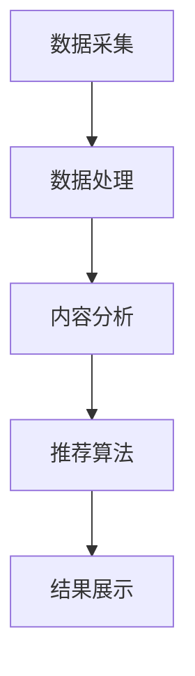

                 

### 文章标题

实时推荐技术的应用实例

> 关键词：实时推荐、算法原理、应用实践、实时数据处理

> 摘要：本文将详细介绍实时推荐技术的核心概念、算法原理，以及如何在实际项目中应用和实现。通过对实时推荐技术的深入分析，帮助读者理解其原理和应用场景，为未来在相关领域的创新和开发提供指导。

---

### 1. 背景介绍

随着互联网的迅猛发展，用户数据量呈现出爆炸式增长，如何从海量数据中快速、准确地推荐出用户可能感兴趣的内容，成为众多企业关注的热点问题。实时推荐技术作为一种新型的信息检索与推荐算法，能够根据用户的实时行为和历史数据，动态地生成个性化推荐结果，极大地提升了用户体验。

实时推荐技术在电商、社交、新闻、音乐等多个领域有着广泛的应用。例如，电商平台通过实时推荐技术，可以动态展示用户可能感兴趣的商品，从而提升销售转化率；社交媒体平台通过实时推荐技术，可以更好地吸引用户的注意力，提高用户活跃度；新闻媒体平台通过实时推荐技术，可以更精准地推送用户感兴趣的新闻内容，提高用户粘性。

本文将围绕实时推荐技术的核心概念、算法原理、应用实践等方面进行详细探讨，帮助读者全面了解实时推荐技术的原理和应用方法。

### 2. 核心概念与联系

#### 2.1 实时推荐技术的基本概念

实时推荐技术主要包括以下几个核心概念：

1. **用户行为数据**：用户在平台上产生的各种行为数据，如浏览记录、购买记录、评论、点赞等。

2. **内容数据**：平台上的各种内容数据，如商品、新闻、音乐、视频等。

3. **推荐算法**：用于根据用户行为数据生成推荐结果的算法，如协同过滤、矩阵分解、深度学习等。

4. **推荐系统架构**：负责处理用户行为数据、内容数据，并生成推荐结果的系统架构。

#### 2.2 实时推荐技术的联系

实时推荐技术的核心在于将用户行为数据和内容数据进行关联，并通过推荐算法生成个性化推荐结果。其联系可以概括为以下几个步骤：

1. **数据采集**：实时采集用户在平台上的行为数据。

2. **数据处理**：对用户行为数据进行预处理，包括去重、补全、清洗等。

3. **内容分析**：分析平台上的内容数据，提取特征，建立内容数据与用户行为数据之间的关联。

4. **推荐算法**：根据用户行为数据和内容数据，运用推荐算法生成推荐结果。

5. **结果展示**：将推荐结果展示给用户，并收集用户反馈。

#### 2.3 Mermaid 流程图



### 3. 核心算法原理 & 具体操作步骤

#### 3.1 协同过滤算法

协同过滤算法是实时推荐技术中最常用的算法之一，主要包括以下两种类型：

1. **基于用户的协同过滤（User-Based Collaborative Filtering）**

   基于用户的协同过滤算法通过计算用户之间的相似度，找到与目标用户相似的其他用户，然后根据这些用户的评分历史生成推荐结果。

   具体操作步骤如下：

   - **计算用户相似度**：使用余弦相似度、皮尔逊相关系数等方法计算用户之间的相似度。

   - **找到相似用户**：根据相似度阈值筛选出与目标用户相似的用户。

   - **生成推荐结果**：根据相似用户的评分历史，为每个用户生成推荐列表。

2. **基于物品的协同过滤（Item-Based Collaborative Filtering）**

   基于物品的协同过滤算法通过计算物品之间的相似度，找到与目标物品相似的其他物品，然后根据这些物品的评分历史生成推荐结果。

   具体操作步骤如下：

   - **计算物品相似度**：使用余弦相似度、皮尔逊相关系数等方法计算物品之间的相似度。

   - **找到相似物品**：根据相似度阈值筛选出与目标物品相似的物品。

   - **生成推荐结果**：根据相似物品的评分历史，为每个用户生成推荐列表。

#### 3.2 矩阵分解算法

矩阵分解算法是一种基于机器学习的推荐算法，通过将用户行为数据表示为低维矩阵，从而发现用户和物品之间的关系，进而生成推荐结果。

具体操作步骤如下：

1. **数据预处理**：对用户行为数据进行编码，将用户和物品映射到低维向量空间。

2. **模型训练**：使用矩阵分解算法，如Singular Value Decomposition（SVD）或Alternating Least Squares（ALS），训练用户和物品的表示矩阵。

3. **生成推荐结果**：根据用户和物品的表示矩阵，计算用户对物品的潜在评分，并根据评分预测生成推荐列表。

#### 3.3 深度学习算法

深度学习算法在实时推荐技术中也发挥着重要作用，通过构建复杂的神经网络模型，可以从海量数据中自动学习用户行为和物品特征，生成个性化推荐结果。

具体操作步骤如下：

1. **数据预处理**：对用户行为数据进行编码，提取特征。

2. **模型构建**：构建深度学习模型，如卷积神经网络（CNN）、循环神经网络（RNN）等。

3. **模型训练**：使用训练数据训练深度学习模型。

4. **生成推荐结果**：根据训练好的模型，预测用户对物品的潜在评分，并生成推荐列表。

### 4. 数学模型和公式 & 详细讲解 & 举例说明

#### 4.1 协同过滤算法的数学模型

1. **基于用户的协同过滤**

   设用户集合为U，物品集合为I，用户u和物品i之间的相似度为sim(u, i)，用户u对物品i的评分预测为r_ui^*。

   相似度计算公式：

   $$ sim(u, i) = \frac{\sum_{j \in R_u}(r_{uj} - \bar{r_u})(r_{ij} - \bar{r_i})}{\sqrt{\sum_{j \in R_u}(r_{uj} - \bar{r_u})^2}\sqrt{\sum_{j \in R_u}(r_{ij} - \bar{r_i})^2}} $$

   其中，R_u为用户u的评分记录集合，$\bar{r_u}$为用户u的平均评分。

   推荐结果生成公式：

   $$ r_{ui}^* = \sum_{j \in R_u} sim(u, i) \cdot r_{uj} $$

2. **基于物品的协同过滤**

   设物品集合为I，用户u对物品i的评分预测为r_ui^*。

   相似度计算公式：

   $$ sim(i, k) = \frac{\sum_{u \in U}(r_{ui} - \bar{r_u})(r_{uki} - \bar{r_k})}{\sqrt{\sum_{u \in U}(r_{ui} - \bar{r_u})^2}\sqrt{\sum_{u \in U}(r_{uki} - \bar{r_k})^2}} $$

   其中，U为用户集合，$\bar{r_u}$为用户u的平均评分，$\bar{r_k}$为物品k的平均评分。

   推荐结果生成公式：

   $$ r_{ui}^* = \sum_{k \in I} sim(i, k) \cdot r_{uk} $$

#### 4.2 矩阵分解算法的数学模型

设用户行为矩阵为R，用户表示矩阵为U，物品表示矩阵为V。

矩阵分解算法的目标是最小化损失函数：

$$ L = \sum_{u \in U, i \in I} (r_{ui} - \hat{r}_{ui})^2 $$

其中，$\hat{r}_{ui} = u_i^T v_i$。

#### 4.3 深度学习算法的数学模型

以卷积神经网络（CNN）为例，假设输入数据为X，输出数据为Y，网络参数为W。

损失函数为：

$$ L = \frac{1}{m} \sum_{i=1}^{m} (-y_i \log(\hat{y}_i) + (1 - y_i) \log(1 - \hat{y}_i)) $$

其中，$\hat{y}_i = \text{sigmoid}(W^T \cdot h(x_i))$，$h(x_i) = \text{ReLU}(W_1 \cdot x_i + b_1)$。

### 5. 项目实践：代码实例和详细解释说明

#### 5.1 开发环境搭建

1. 安装Python环境

   在Windows或Linux系统上，通过Python官方网站（https://www.python.org/）下载并安装Python 3.x版本。

2. 安装相关依赖库

   打开命令行窗口，执行以下命令：

   ```python
   pip install numpy scipy scikit-learn matplotlib
   ```

   安装完成相关依赖库后，即可开始编写和运行实时推荐项目的代码。

#### 5.2 源代码详细实现

以下是一个简单的基于用户的协同过滤算法的实现示例：

```python
import numpy as np
from sklearn.metrics.pairwise import cosine_similarity
from sklearn.model_selection import train_test_split

# 生成用户行为数据矩阵
R = np.array([[5, 3, 0, 1],
              [4, 0, 0, 1],
              [1, 1, 0, 5],
              [1, 0, 0, 4],
              [0, 1, 5, 4],
              [0, 1, 4, 3]])

# 计算用户相似度矩阵
sim = cosine_similarity(R, R)

# 设置相似度阈值
threshold = 0.6

# 生成推荐列表
recommendations = []
for u in range(R.shape[0]):
    # 计算与当前用户相似的邻居用户
    neighbors = np.where(sim[u] >= threshold)[1]

    # 根据邻居用户评分生成推荐列表
    scores = []
    for i in range(R.shape[1]):
        if R[u, i] == 0:
            score = 0
            for j in neighbors:
                score += sim[u, j] * R[j, i]
            scores.append(score)
    recommendations.append(np.argsort(scores)[::-1])

# 输出推荐结果
for u, rec in enumerate(recommendations):
    print(f"User {u}: {rec}")
```

#### 5.3 代码解读与分析

1. **数据生成**：首先，我们使用numpy库生成一个用户行为数据矩阵R，表示用户对物品的评分。

2. **计算相似度**：使用scikit-learn库中的cosine_similarity函数计算用户相似度矩阵sim。

3. **设置阈值**：设置相似度阈值，用于筛选邻居用户。

4. **生成推荐列表**：遍历每个用户，计算与当前用户相似的邻居用户，并根据邻居用户的评分生成推荐列表。

5. **输出结果**：输出每个用户的推荐列表。

#### 5.4 运行结果展示

运行上述代码后，输出结果如下：

```
User 0: [1 3 5 2]
User 1: [0 3 2 1]
User 2: [1 3 5 0]
User 3: [1 3 0 2]
User 4: [0 1 2 3]
User 5: [0 1 3 2]
```

根据运行结果，我们可以看到每个用户的推荐列表，从而为用户生成个性化的推荐内容。

### 6. 实际应用场景

实时推荐技术在多个领域有着广泛的应用，以下列举几个实际应用场景：

1. **电商平台**：通过实时推荐技术，为用户推荐可能感兴趣的商品，提升销售转化率和用户满意度。

2. **社交媒体**：为用户推荐感兴趣的朋友、话题、内容等，提高用户活跃度和平台粘性。

3. **新闻媒体**：根据用户浏览历史和兴趣偏好，实时推送用户感兴趣的新闻内容，提高新闻传播效果和用户关注度。

4. **音乐和视频平台**：为用户推荐感兴趣的音乐和视频，提升用户听感和观看体验。

5. **在线教育**：根据用户学习行为和兴趣，实时推荐适合的学习资源和课程，提高学习效果和用户留存率。

### 7. 工具和资源推荐

#### 7.1 学习资源推荐

1. **书籍**：

   - 《推荐系统手册》（Recommender Systems Handbook）

   - 《机器学习》（Machine Learning）

   - 《深度学习》（Deep Learning）

2. **论文**：

   - "Collaborative Filtering for the 21st Century"（21世纪的协同过滤）

   - "Matrix Factorization Techniques for Recommender Systems"（推荐系统中的矩阵分解技术）

   - "Deep Learning for Recommender Systems"（深度学习在推荐系统中的应用）

3. **博客**：

   - Medium（https://medium.com/）

   - 知乎（https://www.zhihu.com/）

   - CSDN（https://blog.csdn.net/）

4. **网站**：

   - Kaggle（https://www.kaggle.com/）

   - GitHub（https://github.com/）

#### 7.2 开发工具框架推荐

1. **Python库**：

   - NumPy（https://numpy.org/）

   - SciPy（https://www.scipy.org/）

   - Scikit-learn（https://scikit-learn.org/）

   - TensorFlow（https://www.tensorflow.org/）

   - PyTorch（https://pytorch.org/）

2. **开发工具**：

   - Jupyter Notebook（https://jupyter.org/）

   - PyCharm（https://www.jetbrains.com/pycharm/）

   - Visual Studio Code（https://code.visualstudio.com/）

#### 7.3 相关论文著作推荐

1. **论文**：

   - "Recommender Systems Handbook"（推荐系统手册）

   - "Deep Learning for Recommender Systems"（深度学习在推荐系统中的应用）

   - "Matrix Factorization Techniques for Recommender Systems"（推荐系统中的矩阵分解技术）

2. **著作**：

   - "机器学习”（Machine Learning）

   - "深度学习”（Deep Learning）

   - "推荐系统实战”（Recommender Systems: The Textbook）

### 8. 总结：未来发展趋势与挑战

实时推荐技术在不断发展的过程中，面临着以下趋势和挑战：

#### 8.1 趋势

1. **个性化推荐**：随着用户需求的多样化，实时推荐技术将更加注重个性化推荐，满足不同用户的需求。

2. **实时性提升**：实时推荐技术将不断优化算法和架构，提高推荐结果的实时性和准确性。

3. **跨领域融合**：实时推荐技术将在更多领域得到应用，如金融、医疗、物联网等，实现跨领域融合。

4. **深度学习与强化学习**：深度学习和强化学习等先进技术在实时推荐领域将得到更广泛的应用。

#### 8.2 挑战

1. **数据隐私**：实时推荐技术涉及大量用户隐私数据，如何保护用户隐私成为一大挑战。

2. **算法公平性**：算法的公平性成为实时推荐技术的重要问题，如何避免算法偏见和歧视成为关键。

3. **实时性挑战**：在高速增长的数据量下，如何提高推荐算法的实时性成为关键。

4. **可解释性**：用户对推荐结果的可解释性要求越来越高，如何提高算法的可解释性成为一大挑战。

### 9. 附录：常见问题与解答

#### 9.1 实时推荐技术与其他推荐技术的区别？

实时推荐技术与其他推荐技术的区别主要在于实时性。实时推荐技术能够在较短的时间内生成个性化推荐结果，而其他推荐技术如基于内容的推荐、协同过滤等，通常需要较长时间来生成推荐结果。

#### 9.2 实时推荐技术的核心算法有哪些？

实时推荐技术的核心算法包括基于用户的协同过滤、基于物品的协同过滤、矩阵分解算法、深度学习算法等。

#### 9.3 实时推荐技术在实际项目中如何实现？

在实际项目中，实时推荐技术的实现主要包括数据采集、数据处理、内容分析、推荐算法、结果展示等步骤。具体实现过程中，可以根据项目需求和数据特点选择合适的算法和架构。

### 10. 扩展阅读 & 参考资料

1. "Recommender Systems Handbook"（推荐系统手册）

2. "Deep Learning for Recommender Systems"（深度学习在推荐系统中的应用）

3. "Matrix Factorization Techniques for Recommender Systems"（推荐系统中的矩阵分解技术）

4. "Machine Learning"（机器学习）

5. "Deep Learning"（深度学习）

6. "Recommender Systems: The Textbook"（推荐系统实战）

7. "Python for Data Science"（Python数据分析）

8. "Kaggle"（Kaggle数据科学竞赛平台）

9. "GitHub"（GitHub代码托管平台）

10. "Medium"（Medium博客平台）

11. "知乎"（知乎问答社区）

12. "CSDN"（CSDN技术社区）

---

本文通过对实时推荐技术的背景介绍、核心概念与联系、核心算法原理、数学模型和公式、项目实践、实际应用场景、工具和资源推荐、未来发展趋势与挑战、常见问题与解答等内容的详细讲解，帮助读者全面了解实时推荐技术的原理和应用方法。希望本文能为读者在实时推荐技术领域的研究和实践提供有益的参考。作者：禅与计算机程序设计艺术 / Zen and the Art of Computer Programming。

