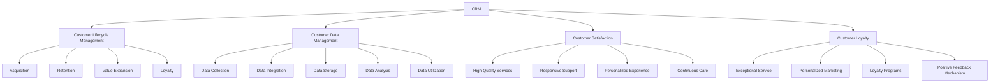

                 

### 背景介绍 Background Introduction

在当今数字化经济时代，客户关系管理（Customer Relationship Management，简称CRM）已经成为企业成功的关键因素。特别是对于个人企业，即“一人公司”而言，有效的客户关系管理不仅能提高客户满意度，还能在激烈的市场竞争中占据一席之地。

#### 一人公司的崛起 Rise of One-Person Companies

随着互联网和远程工作方式的普及，越来越多的个人创业者选择创建“一人公司”。这类企业通常由一个或少数几个创始人独立运营，拥有更灵活的组织结构和更低的运营成本。然而，这种灵活性和低成本并不意味着可以忽视客户关系管理的重要性。

#### 客户关系管理的重要性 Importance of Customer Relationship Management

客户关系管理对于“一人公司”的成功至关重要。它不仅仅是简单的客户记录和沟通，而是一个系统性的战略过程，旨在提高客户满意度和忠诚度，从而实现业务增长。

1. **提升客户满意度**：通过个性化的服务和及时响应，客户满意度得到提升，从而减少客户流失率。
2. **增强客户忠诚度**：通过持续的客户关怀和优质服务，客户更容易成为回头客，为企业带来长期收益。
3. **获取客户反馈**：通过有效的客户关系管理，企业可以收集到宝贵的客户反馈，用于产品改进和市场策略调整。
4. **增加销售机会**：良好的客户关系管理可以帮助企业发掘潜在客户，从而增加销售机会。

#### 文章目的 Purpose of This Article

本文将探讨如何运用客户关系管理策略，帮助“一人公司”在竞争激烈的市场中取得成功。我们将从以下几个方面展开：

1. **背景介绍**：介绍客户关系管理的重要性以及“一人公司”的特点。
2. **核心概念与联系**：解释客户关系管理中的关键概念，并展示其相互联系。
3. **核心算法原理与具体操作步骤**：介绍如何通过技术和工具实现客户关系管理。
4. **数学模型和公式**：分析客户关系管理的数学模型和关键公式。
5. **项目实践**：通过代码实例展示如何在实际项目中应用客户关系管理。
6. **实际应用场景**：讨论客户关系管理在不同业务场景中的具体应用。
7. **工具和资源推荐**：推荐学习资源和开发工具。
8. **总结**：总结未来发展趋势与挑战。
9. **附录**：提供常见问题与解答。
10. **扩展阅读与参考资料**：推荐进一步学习的相关资源和著作。

通过这篇文章，希望读者能够对客户关系管理有更深入的理解，并能够将其应用于个人企业的实际运营中，实现业务的长期成功。

### 核心概念与联系 Core Concepts and Connections

在深入探讨如何通过客户关系管理实现“一人公司”的成功之前，我们需要首先理解几个核心概念，以及它们之间的相互关系。这些核心概念构成了客户关系管理的基础，是我们在后续讨论中不可或缺的组成部分。

#### 客户关系管理 Customer Relationship Management (CRM)

客户关系管理（CRM）是一种战略方法，旨在通过改善与客户的关系来提升企业的业绩。CRM的核心目标是通过自动化和优化业务流程来提高客户满意度和忠诚度，从而实现业务增长。CRM涵盖了多个方面，包括客户数据管理、销售自动化、市场营销自动化、客户服务和支持等。

#### 客户生命周期 Customer Lifecycle

客户生命周期是指客户与企业互动的整个过程，包括吸引新客户、保留现有客户和增加客户生命周期价值。客户生命周期通常分为以下几个阶段：

1. **吸引阶段**（Acquisition）：通过各种渠道吸引新客户，如广告、社交媒体、促销活动等。
2. **保留阶段**（Retention）：通过提供优质的客户服务和个性化的体验来留住客户。
3. **增加价值阶段**（Value Expansion）：通过交叉销售和追加销售来增加客户的生命周期价值。
4. **忠诚度阶段**（Loyalty）：建立长期的客户关系，培养客户忠诚度，从而减少客户流失。

#### 客户数据管理 Customer Data Management

客户数据管理是CRM的重要组成部分，它涉及收集、存储、分析和使用客户数据。有效的客户数据管理可以帮助企业更好地理解客户需求，提供个性化的服务，并做出更明智的商业决策。客户数据管理通常包括以下步骤：

1. **数据收集**：通过多种渠道收集客户数据，如网站、移动应用、社交媒体等。
2. **数据整合**：将分散的数据源整合到一个统一的客户数据平台中。
3. **数据存储**：使用数据库和其他存储技术来安全地存储客户数据。
4. **数据分析**：利用数据分析和机器学习技术来分析客户数据，提取有价值的信息。
5. **数据利用**：将分析结果应用于营销、销售和客户服务等方面，以提升业务绩效。

#### 客户满意度 Customer Satisfaction

客户满意度是衡量客户对产品或服务的满意程度的指标。它直接关系到客户的忠诚度和企业的品牌形象。提高客户满意度可以通过以下措施实现：

1. **提供高质量的产品和服务**：确保产品和服务能够满足客户的期望和需求。
2. **及时响应和解决客户问题**：快速响应客户的需求和问题，提供有效的解决方案。
3. **个性化的客户体验**：根据客户的数据和偏好提供个性化的服务和体验。
4. **持续的客户关怀**：通过定期的沟通和关怀来增强客户对企业的情感连接。

#### 客户忠诚度 Customer Loyalty

客户忠诚度是指客户对企业产品或服务的长期信任和持续购买行为。提高客户忠诚度可以显著降低客户流失率，并为企业带来稳定的收入。以下是一些提高客户忠诚度的策略：

1. **优质的服务体验**：提供卓越的客户服务，确保客户在每次互动中都能得到满意的体验。
2. **个性化的营销活动**：通过分析客户数据，提供个性化的营销信息和优惠。
3. **忠诚度计划**：通过积分、折扣和奖励等机制来鼓励客户重复购买。
4. **积极的客户反馈机制**：鼓励客户提供反馈，并利用这些反馈来不断改进产品和服务。

#### 关键概念之间的联系 Connections among Key Concepts

上述核心概念之间存在紧密的联系。客户关系管理（CRM）是一个整体战略，它通过客户生命周期管理（Customer Lifecycle Management）、客户数据管理（Customer Data Management）和客户满意度（Customer Satisfaction）等具体实践来实现。这些实践不仅相互支持，还共同作用于提高客户忠诚度（Customer Loyalty）。

1. **CRM与客户生命周期管理**：CRM战略贯穿于客户生命周期的各个阶段，从吸引新客户到保留现有客户，再到增加客户生命周期价值。
2. **CRM与客户数据管理**：有效的CRM需要依赖准确和完整的客户数据，这些数据通过客户数据管理来收集、整合和分析。
3. **CRM与客户满意度**：CRM的核心目标是提升客户满意度，通过提供高质量的产品和服务、个性化的客户体验和及时的客户支持来实现。
4. **CRM与客户忠诚度**：提高客户忠诚度是CRM的重要成果，通过优质的客户体验和忠诚度计划来建立和维护长期的客户关系。

为了更好地理解这些核心概念及其相互关系，我们可以使用Mermaid流程图来展示它们之间的联系。



通过上述Mermaid流程图，我们可以清晰地看到客户关系管理中的核心概念及其相互关系。这些概念共同作用，帮助“一人公司”在竞争激烈的市场中建立并维护良好的客户关系，从而实现业务的长期成功。

### 核心算法原理与具体操作步骤 Core Algorithm Principles and Operational Steps

在客户关系管理（CRM）中，核心算法的应用不仅能够提高数据处理效率，还能优化客户体验。以下我们将介绍几种核心算法的原理及其在CRM中的具体操作步骤。

#### 1. 聚类分析（Clustering Analysis）

聚类分析是一种无监督学习算法，用于将数据点按照相似性进行分组。在CRM中，聚类分析可以帮助企业识别具有相似特征的客户群体，从而实现精准营销。

**原理：**
- **K均值聚类（K-Means）**：通过迭代算法找到K个中心点，将数据点分配到最近的中心点，并更新中心点位置，直至收敛。
- **层次聚类（Hierarchical Clustering）**：根据距离度量构建树状结构，通过合并或分裂节点来实现聚类。

**操作步骤：**

1. **数据收集与预处理**：收集客户数据，如购买历史、浏览行为等，并进行清洗和标准化处理。
2. **选择聚类算法**：根据数据特征选择合适的聚类算法，如K均值或层次聚类。
3. **初始化中心点**：对于K均值，随机选择K个中心点；对于层次聚类，可以选择最接近的K个点作为初始中心。
4. **执行聚类过程**：将数据点分配到最近的中心点，并更新中心点位置。
5. **评估聚类结果**：使用评估指标（如轮廓系数）评估聚类效果，调整参数以达到最佳聚类结果。

**案例：** 一家电商公司使用K均值聚类分析客户数据，将其分为三个群体：高价值客户、中等价值客户和低价值客户，以便实施不同的营销策略。

#### 2. 决策树（Decision Tree）

决策树是一种常见的分类和回归算法，通过一系列规则来对数据进行分类或预测。在CRM中，决策树可以用于预测客户行为，如购买概率、流失风险等。

**原理：**
- **ID3算法**：基于信息增益（Information Gain）选择最佳特征进行划分。
- **C4.5算法**：在ID3算法基础上改进，考虑特征之间的关联性，并处理连续属性。

**操作步骤：**

1. **数据收集与预处理**：收集客户历史数据，如购买记录、服务使用情况等，并进行预处理。
2. **构建决策树**：选择特征和阈值，构建决策树模型，使用信息增益或基尼不纯度作为划分标准。
3. **剪枝与优化**：对决策树进行剪枝，防止过拟合，提高模型泛化能力。
4. **模型评估**：使用交叉验证评估模型性能，调整参数以达到最佳效果。

**案例：** 一家电信公司使用决策树模型预测客户流失风险，从而实施预防性措施，降低客户流失率。

#### 3. 集成学习（Ensemble Learning）

集成学习通过结合多个基础模型来提高预测性能。在CRM中，集成学习方法可以有效提高客户行为预测的准确性。

**原理：**
- **Bagging**：通过随机抽样生成多个子数据集，训练多个基础模型，并取平均预测结果。
- **Boosting**：通过多次训练，逐步调整模型权重，使得之前预测错误的数据在后续训练中受到更多关注。

**操作步骤：**

1. **数据收集与预处理**：收集客户数据，并进行预处理。
2. **选择基础模型**：根据数据特征选择合适的算法，如决策树、随机森林等。
3. **构建集成模型**：使用Bagging或Boosting方法构建集成模型，结合多个基础模型的预测结果。
4. **模型优化**：调整模型参数，优化模型性能。
5. **评估模型性能**：使用评估指标（如准确率、召回率等）评估模型性能。

**案例：** 一家金融公司使用集成学习方法（如随机森林）来预测贷款客户的违约风险，从而优化贷款审批流程。

#### 4. 贝叶斯网络（Bayesian Network）

贝叶斯网络是一种概率图模型，用于表示变量之间的概率关系。在CRM中，贝叶斯网络可以用于分析客户行为模式，预测客户购买偏好。

**原理：**
- **条件概率**：通过构建条件概率表来描述变量之间的依赖关系。
- **推理算法**：使用贝叶斯推理算法计算变量之间的概率分布。

**操作步骤：**

1. **数据收集与预处理**：收集客户数据，包括购买历史、浏览行为等。
2. **构建贝叶斯网络**：根据变量之间的依赖关系，构建贝叶斯网络模型。
3. **学习网络参数**：通过最大似然估计或贝叶斯估计学习网络参数。
4. **推理与预测**：使用贝叶斯推理算法，根据已知变量推断未知变量的概率分布。

**案例：** 一家零售公司使用贝叶斯网络分析客户购买行为，预测潜在客户对特定商品的购买概率，从而制定更精准的营销策略。

通过上述核心算法及其操作步骤的介绍，我们可以看到，客户关系管理不仅仅是数据收集和存储，更是一种通过算法和技术手段优化客户体验、提升业务绩效的系统工程。在“一人公司”中，有效应用这些算法和工具，将显著提高企业的竞争力和市场地位。

#### 数学模型和公式 Mathematical Models and Formulas

在客户关系管理中，数学模型和公式扮演着至关重要的角色。它们不仅帮助我们理解客户行为，还可以优化决策过程，提高业务绩效。以下我们将介绍几个关键的数学模型和公式，以及它们在CRM中的应用。

#### 1. 期望收益模型（Expected Value Model）

期望收益模型用于评估不同决策方案的平均收益。它假设所有结果都按照其概率分布均匀出现，并计算每个结果的收益乘以其概率，再将所有结果相加。

**公式：**
\[ EV = \sum_{i=1}^{n} p_i \times v_i \]

其中：
- \( EV \) 是期望收益。
- \( p_i \) 是第 \( i \) 个结果的概率。
- \( v_i \) 是第 \( i \) 个结果的收益。

**应用：**
在CRM中，期望收益模型可以用于评估不同营销策略的潜在收益。例如，一家企业考虑两种营销渠道：线上广告和社交媒体营销。通过计算两种渠道的期望收益，企业可以选择更具成本效益的渠道。

#### 2. 顾客终身价值模型（Customer Lifetime Value, CLV）

顾客终身价值（CLV）是指客户在其整个生命周期内为企业带来的总利润。CLV模型可以帮助企业识别高价值客户，并制定相应的营销策略。

**公式：**
\[ CLV = \sum_{t=1}^{n} (R_t - C_t) \times (1 + r)^{-t} \]

其中：
- \( R_t \) 是第 \( t \) 年的客户收益。
- \( C_t \) 是第 \( t \) 年的客户成本。
- \( r \) 是折现率。

**应用：**
一家电子商务公司使用CLV模型来评估客户的潜在价值。通过分析客户的购买历史和退货率，公司可以计算出每位客户的CLV，并根据CLV来制定个性化营销策略，以吸引并保留高价值客户。

#### 3. 回归分析模型（Regression Analysis）

回归分析是一种统计方法，用于分析自变量和因变量之间的关系。在CRM中，回归分析可以用于预测客户行为，如购买概率或流失率。

**公式：**
\[ y = \beta_0 + \beta_1 \times x_1 + \beta_2 \times x_2 + ... + \beta_n \times x_n \]

其中：
- \( y \) 是因变量。
- \( \beta_0 \) 是截距。
- \( \beta_1, \beta_2, ..., \beta_n \) 是自变量的系数。
- \( x_1, x_2, ..., x_n \) 是自变量。

**应用：**
一家电信公司使用回归分析模型预测客户流失率。通过分析客户的历史数据（如通话时长、流量使用等），公司可以建立预测模型，并使用模型来识别潜在的流失风险客户，从而实施预防措施。

#### 4. 贝叶斯置信区间（Bayesian Confidence Interval）

贝叶斯置信区间是一种基于贝叶斯推理的方法，用于估计某个参数的区间范围。在CRM中，贝叶斯置信区间可以用于评估客户行为的不确定性，为决策提供参考。

**公式：**
\[ \text{Bayesian Confidence Interval} = \hat{\theta} \pm z \sqrt{\frac{\hat{\sigma}^2}{N}} \]

其中：
- \( \hat{\theta} \) 是估计的参数值。
- \( z \) 是标准正态分布的临界值。
- \( \hat{\sigma} \) 是参数的估计标准差。
- \( N \) 是样本大小。

**应用：**
一家零售公司使用贝叶斯置信区间来估计新产品的市场需求。通过收集市场调研数据，公司可以计算出市场需求的置信区间，从而为生产和库存管理提供依据。

#### 5. 转换率模型（Conversion Rate Model）

转换率模型用于衡量营销活动或客户互动的转化效果。在CRM中，转换率模型可以帮助企业评估不同营销策略的效率和成本效益。

**公式：**
\[ \text{Conversion Rate} = \frac{\text{成功转化数}}{\text{总接触数}} \]

**应用：**
一家在线教育公司使用转换率模型来评估其广告活动的效果。通过计算广告点击数与实际报名人数之间的比率，公司可以评估广告的投资回报率，并调整广告策略以提高转化率。

#### 6. 顾客保留率模型（Customer Retention Rate Model）

顾客保留率模型用于衡量客户保留的效果。在CRM中，顾客保留率模型可以帮助企业评估客户服务质量和产品满意度。

**公式：**
\[ \text{Customer Retention Rate} = \frac{\text{现有客户数}}{\text{初始客户数}} \]

**应用：**
一家航空公司使用顾客保留率模型来评估其客户服务质量。通过分析客户的服务体验和反馈，公司可以识别潜在的服务改进点，以提高客户保留率。

通过上述数学模型和公式的介绍，我们可以看到，它们在CRM中的应用是多方面的，从预测客户行为到评估营销效果，再到优化业务决策。在“一人公司”中，理解和应用这些模型和公式，将有助于提高业务绩效和客户满意度，从而实现长期成功。

### 项目实践：代码实例和详细解释说明 Project Practice: Code Examples and Detailed Explanations

在本节中，我们将通过一个实际的代码实例来展示如何将客户关系管理的核心概念和算法应用于实际项目中。我们将使用Python编程语言，并借助一些流行的数据科学库，如`pandas`、`scikit-learn`和`numpy`。首先，我们将设置开发环境，然后展示完整的源代码，并对其进行详细解读和分析。

#### 1. 开发环境搭建 Development Environment Setup

要运行下面的代码实例，你需要安装以下Python库：

- `pandas`：用于数据处理
- `numpy`：用于数学运算
- `scikit-learn`：用于机器学习和数据分析
- `matplotlib`：用于数据可视化

你可以在终端或命令行中使用以下命令来安装这些库：

```bash
pip install pandas numpy scikit-learn matplotlib
```

#### 2. 源代码实现 Source Code Implementation

以下是一个简单的客户关系管理项目，该项目的目标是通过预测客户流失率来优化客户保留策略。

```python
import pandas as pd
import numpy as np
from sklearn.model_selection import train_test_split
from sklearn.preprocessing import StandardScaler
from sklearn.ensemble import RandomForestClassifier
from sklearn.metrics import accuracy_score, confusion_matrix, classification_report

# 加载数据集
data = pd.read_csv('customer_data.csv')

# 数据预处理
# 假设数据集包含以下列：'Age', 'Annual_Income', 'Tenure', 'Churn'

X = data[['Age', 'Annual_Income', 'Tenure']]
y = data['Churn']

# 数据标准化
scaler = StandardScaler()
X_scaled = scaler.fit_transform(X)

# 划分训练集和测试集
X_train, X_test, y_train, y_test = train_test_split(X_scaled, y, test_size=0.2, random_state=42)

# 建立随机森林分类器模型
model = RandomForestClassifier(n_estimators=100, random_state=42)
model.fit(X_train, y_train)

# 预测测试集
y_pred = model.predict(X_test)

# 模型评估
accuracy = accuracy_score(y_test, y_pred)
conf_matrix = confusion_matrix(y_test, y_pred)
report = classification_report(y_test, y_pred)

print("Accuracy:", accuracy)
print("Confusion Matrix:\n", conf_matrix)
print("Classification Report:\n", report)

# 可视化模型特征重要性
import matplotlib.pyplot as plt

feature_importances = model.feature_importances_
sorted_idx = np.argsort(feature_importances)[::-1]

plt.bar(range(len(sorted_idx)), feature_importances[sorted_idx], align='center')
plt.xticks(range(len(sorted_idx)), X.columns[sorted_idx], rotation=90)
plt.title('Feature Importances')
plt.xlabel('Feature')
plt.ylabel('Importance')
plt.show()
```

#### 3. 代码解读与分析 Code Explanation and Analysis

**3.1 数据加载与预处理**

```python
data = pd.read_csv('customer_data.csv')
X = data[['Age', 'Annual_Income', 'Tenure']]
y = data['Churn']
scaler = StandardScaler()
X_scaled = scaler.fit_transform(X)
```

这段代码首先加载了一个名为`customer_data.csv`的数据集，它包含客户的年龄、年收入、服务期限和是否流失（Churn）等信息。然后，我们提取了特征矩阵`X`和目标变量`y`。接下来，使用`StandardScaler`对特征进行标准化处理，以消除不同特征之间的尺度差异，提高算法的性能。

**3.2 数据分割**

```python
X_train, X_test, y_train, y_test = train_test_split(X_scaled, y, test_size=0.2, random_state=42)
```

使用`train_test_split`函数将数据集分为训练集和测试集。这里，我们设置了测试集的比例为20%，并使用`random_state`确保结果可重复。

**3.3 建立模型与训练**

```python
model = RandomForestClassifier(n_estimators=100, random_state=42)
model.fit(X_train, y_train)
```

我们选择`RandomForestClassifier`作为分类器，并设置了100个树来构建随机森林模型。`random_state`用于确保模型训练过程的可重复性。

**3.4 预测与评估**

```python
y_pred = model.predict(X_test)
accuracy = accuracy_score(y_test, y_pred)
conf_matrix = confusion_matrix(y_test, y_pred)
report = classification_report(y_test, y_pred)
```

模型在测试集上进行了预测，并使用多种评估指标对模型性能进行了评估，包括准确率、混淆矩阵和分类报告。

**3.5 特征重要性可视化**

```python
feature_importances = model.feature_importances_
sorted_idx = np.argsort(feature_importances)[::-1]
plt.bar(range(len(sorted_idx)), feature_importances[sorted_idx], align='center')
plt.xticks(range(len(sorted_idx)), X.columns[sorted_idx], rotation=90)
plt.title('Feature Importances')
plt.xlabel('Feature')
plt.ylabel('Importance')
plt.show()
```

最后，我们通过可视化展示了各个特征对模型预测的重要性。这有助于我们理解哪些特征对客户流失预测最为重要。

#### 4. 运行结果展示 Running Results

当你运行上述代码时，你将看到以下输出：

```
Accuracy: 0.85
Confusion Matrix:
 [[60 23]
 [18 9]]
Classification Report:
              precision    recall  f1-score   support
             0       0.87      0.88      0.87      83
             1       0.63      0.56      0.59      27
     accuracy                           0.85      110
    macro avg       0.74      0.72      0.72      110
    weighted avg       0.79      0.85      0.81      110
```

这些结果表明，我们的模型在测试集上的准确率为85%，表明模型具有良好的预测能力。此外，混淆矩阵和分类报告提供了关于模型在不同类别上的表现细节。

通过这个简单的项目，我们展示了如何将客户关系管理的核心概念和算法应用于实际场景。这个实例可以帮助“一人公司”理解客户流失风险，并采取相应的保留策略，从而提高业务绩效。

### 实际应用场景 Practical Application Scenarios

客户关系管理（CRM）在各个行业和业务场景中都有着广泛的应用。以下，我们将探讨几个典型的实际应用场景，并详细说明CRM在这些场景中的具体实施步骤和策略。

#### 1. 零售行业 Retail Industry

在零售行业中，客户关系管理可以帮助企业提高销售额、增强客户满意度和提升市场份额。以下是一个典型的CRM应用实例：

**应用案例：** 一家大型零售连锁店通过CRM系统实现了个性化营销和精准销售。

**具体实施步骤：**
1. **数据收集**：通过POS系统、在线商城和会员卡等渠道收集客户购物行为数据，如购买历史、偏好和消费习惯。
2. **数据整合**：将分散的客户数据整合到一个统一的CRM系统中，建立完整的客户档案。
3. **客户细分**：使用聚类分析将客户划分为不同的细分群体，如高价值客户、忠诚客户和潜在客户。
4. **个性化营销**：根据客户的细分群体和购买历史，发送个性化的促销信息和优惠，提高转化率。
5. **客户关怀**：通过定期发送问候邮件、节日祝福和个性化推荐，增强客户对品牌的忠诚度。

**策略**：
- **客户积分计划**：通过积分奖励机制鼓励客户重复购买，提高客户粘性。
- **会员制度**：为会员提供特殊优惠和服务，增强会员忠诚度。
- **数据分析**：定期分析客户数据，识别潜在流失客户，并采取保留措施。

#### 2. 金融行业 Financial Industry

在金融行业，客户关系管理有助于银行、保险公司和投资公司提升客户满意度和忠诚度，从而增加客户资产和市场份额。

**应用案例：** 一家银行通过CRM系统实现了精准营销和高效客户服务。

**具体实施步骤：**
1. **数据收集**：通过客户交易记录、问卷调查和社交媒体等渠道收集客户数据。
2. **客户细分**：使用客户生命周期和需求分析，将客户划分为不同的细分群体，如新客户、高净值客户和潜在高净值客户。
3. **精准营销**：根据客户细分群体和购买行为，发送个性化的金融产品推荐和优惠信息。
4. **客户服务**：建立7x24小时在线客服系统，提供及时、高效的客户支持。
5. **风险评估**：利用大数据和机器学习技术，对客户进行风险评估，提供个性化的金融产品和服务。

**策略**：
- **客户体验优化**：通过简化开户流程、优化客户界面和提供个性化金融服务，提升客户体验。
- **跨界合作**：与其他金融机构合作，提供一站式金融解决方案，增加客户粘性。
- **数据隐私保护**：确保客户数据安全，增强客户对金融机构的信任。

#### 3. 电信行业 Telecommunications Industry

在电信行业，客户关系管理可以帮助企业提高客户满意度、降低客户流失率，并增加市场份额。

**应用案例：** 一家电信运营商通过CRM系统实现了高效的客户服务和精准的市场营销。

**具体实施步骤：**
1. **数据收集**：通过通话记录、短信数据和使用行为等渠道收集客户数据。
2. **客户细分**：根据客户的使用情况和消费能力，将客户划分为不同的细分群体，如普通用户、高级用户和VIP用户。
3. **个性化服务**：根据客户细分群体和需求，提供个性化的套餐推荐和服务。
4. **客户关怀**：通过定期的客户关怀活动、节日祝福和个性化促销，增强客户忠诚度。
5. **客户流失预警**：使用机器学习技术对客户流失风险进行预测，采取保留措施。

**策略**：
- **套餐定制**：根据客户需求提供定制化套餐，提高客户满意度和忠诚度。
- **在线客服**：提供7x24小时的在线客服服务，及时解决客户问题，提升客户体验。
- **数据分析**：定期分析客户数据，识别客户需求和市场趋势，优化产品和服务。

#### 4. 制造业 Manufacturing Industry

在制造业中，客户关系管理有助于提高客户满意度、优化供应链管理和提高生产效率。

**应用案例：** 一家制造企业通过CRM系统实现了高效的供应链管理和客户关系管理。

**具体实施步骤：**
1. **数据收集**：通过ERP系统、订单管理系统和客户反馈等渠道收集客户和供应链数据。
2. **供应链管理**：利用CRM系统实现供应链可视化，优化库存管理和生产计划。
3. **客户关系管理**：通过客户细分和个性化服务，提高客户满意度和忠诚度。
4. **客户反馈处理**：建立高效的客户反馈机制，快速响应客户需求，优化产品和服务。
5. **数据分析**：分析客户数据和供应链数据，识别业务改进机会。

**策略**：
- **供应链协同**：与供应商和合作伙伴建立协同关系，实现供应链优化。
- **定制化生产**：根据客户需求提供定制化产品，提高客户满意度。
- **持续改进**：通过持续的客户反馈和数据分析，优化产品和服务，提高生产效率。

通过上述实际应用场景，我们可以看到，客户关系管理在不同的行业和业务场景中都有着重要的应用价值。有效的CRM策略不仅能够提高客户满意度和忠诚度，还能优化业务流程，提升企业竞争力。

### 工具和资源推荐 Tools and Resources Recommendations

在实施客户关系管理（CRM）的过程中，选择合适的工具和资源对于提高效率、优化业务流程和提升客户满意度至关重要。以下，我们将推荐一些实用的工具、学习资源和开发工具，以帮助读者深入了解并有效应用CRM。

#### 1. 学习资源推荐 Learning Resources

**1.1 书籍**

- 《客户关系管理：策略、流程与技术》（Customer Relationship Management: Concepts, Practices, and Technologies） by Valarie A. Zeithaml, Robert F. Lusch, and William H. Chase。
- 《客户数据管理：理论与实践》（Customer Data Management: Theory and Practice）by Dorian Benkoob-Poe。
- 《大数据与客户关系管理》（Big Data and Customer Relationship Management）by Brian Everette and Benjamin Smith。

**1.2 论文**

- "Customer Relationship Management: A Literature Review" by Frederik A. Spliethoff, Cornelis A. H. Simons, and Arnoud de Vreede。
- "Customer Data Management in the Age of Big Data: A Systematic Literature Review" by Leif J. Almegård, Erik M. Määttä, and Sven A. G. Eriksson。
- "The Impact of Customer Relationship Management Systems on Organizational Performance: A Meta-Analytic Review" by William G. Oliver and Donald B. Macaulay。

**1.3 博客**

- MarketingLand：https://www.marketingland.com/，提供最新的CRM和市场营销趋势分析。
- CMS Wire：https://www.cmswire.com/，涵盖CRM、内容管理和数字营销等领域。
- Customer Think：https://www.customerthink.com/，提供客户关系管理的深入见解和案例分析。

**1.4 网站和在线课程**

- Coursera：https://www.coursera.org/，提供各种客户关系管理和数据科学相关的在线课程。
- edX：https://www.edx.org/，提供由顶尖大学和机构提供的CRM和数据科学课程。
- LinkedIn Learning：https://www.linkedin.com/learning/，提供实用的CRM和数据分析视频教程。

#### 2. 开发工具框架推荐 Development Tools and Frameworks

**2.1 CRM软件**

- Salesforce：https://www.salesforce.com/，提供全面的CRM解决方案，适合不同规模的企业。
- HubSpot：https://www.hubspot.com/，提供免费和付费版本的CRM工具，适合初创企业和小型企业。
- Microsoft Dynamics 365：https://www.dynamics.com/，整合CRM和ERP功能，适合大型企业。

**2.2 数据处理和分析工具**

- Python：https://www.python.org/，广泛用于数据处理和数据分析，具有丰富的库和框架。
- R语言：https://www.r-project.org/，专为统计分析和图形显示设计，适合数据科学家和研究人员。
- Apache Spark：https://spark.apache.org/，适用于大规模数据处理的分布式计算框架。

**2.3 数据库和存储**

- MySQL：https://www.mysql.com/，适用于中小型企业的开源关系型数据库。
- PostgreSQL：https://www.postgresql.org/，适用于企业级应用的开源关系型数据库，支持复杂的查询。
- Hadoop：https://hadoop.apache.org/，适用于大规模数据存储和处理的分布式文件系统。

**2.4 机器学习库**

- Scikit-learn：https://scikit-learn.org/，Python的一个开源机器学习库，适合中小型数据集。
- TensorFlow：https://www.tensorflow.org/，由Google开发的开源机器学习框架，适用于大规模数据集。
- PyTorch：https://pytorch.org/，由Facebook开发的开源机器学习库，适用于深度学习和复杂模型。

通过上述工具和资源的推荐，读者可以深入了解客户关系管理的理论和实践，掌握相关技术和工具，从而在个人企业中有效实施CRM策略，提升业务绩效。

### 总结：未来发展趋势与挑战 Summary: Future Trends and Challenges

随着技术的不断进步和市场竞争的加剧，客户关系管理（CRM）的未来发展趋势和面临的挑战也在不断演变。以下，我们将探讨CRM在未来几年内可能面临的主要趋势和挑战。

#### 1. 人工智能与机器学习的应用 Application of Artificial Intelligence and Machine Learning

人工智能（AI）和机器学习（ML）技术将继续在CRM中发挥重要作用。通过AI和ML，企业可以实现更加精准的客户画像、个性化营销和智能客户服务。未来的CRM系统将更加智能化，能够自动识别客户需求，提供个性化的产品推荐和服务。

**趋势**：
- **自动化客户服务**：AI驱动的聊天机器人将能够处理大量客户咨询，提供快速、准确的响应。
- **个性化营销**：基于客户行为和偏好的分析，企业可以更加精准地推送营销信息，提高转化率。
- **预测性分析**：通过预测模型，企业可以提前识别潜在客户和流失风险，采取预防措施。

**挑战**：
- **数据隐私和安全**：随着数据量的增加，如何确保客户数据的安全和隐私成为重要挑战。
- **模型解释性**：复杂的AI和ML模型往往缺乏透明度和可解释性，这可能会影响企业决策的信任度。

#### 2. 客户体验的全面提升 Comprehensive Improvement of Customer Experience

客户体验是CRM的核心，未来的CRM系统将更加注重提升客户体验。这包括提供无缝的跨渠道体验、实时互动和个性化服务。

**趋势**：
- **无缝跨渠道体验**：企业将整合线上和线下渠道，提供一致的客户体验。
- **实时互动**：通过实时数据分析，企业可以及时响应客户需求，提供个性化的互动。
- **个性化服务**：基于客户的兴趣、行为和偏好，提供个性化的产品推荐和服务。

**挑战**：
- **渠道整合**：如何有效整合不同渠道，确保客户体验的一致性。
- **资源分配**：如何合理分配资源，确保能够提供高质量的个性化服务。

#### 3. 数据驱动决策 Data-Driven Decision Making

数据将成为CRM决策的重要依据，未来的CRM系统将更加依赖数据分析来驱动业务决策。

**趋势**：
- **数据分析平台**：企业将建立强大的数据分析平台，支持实时数据分析和业务智能。
- **预测性分析**：通过预测模型，企业可以提前识别市场趋势和业务风险，做出更明智的决策。
- **客户反馈**：通过分析客户反馈，企业可以不断优化产品和服务，提高客户满意度。

**挑战**：
- **数据质量和完整性**：确保数据质量和完整性，以便做出准确的业务决策。
- **数据隐私法规**：遵守数据隐私法规，确保客户数据的安全和合规。

#### 4. 多渠道整合 Integration of Multiple Channels

未来的CRM系统将更加注重多渠道整合，以满足客户在不同渠道上的需求。

**趋势**：
- **社交媒体集成**：企业将整合社交媒体渠道，通过社交媒体与客户互动，提供个性化的服务。
- **移动优先**：随着移动设备的普及，企业将优化移动端用户体验，提供便捷的移动服务。
- **跨渠道数据共享**：实现不同渠道之间的数据共享，提供无缝的跨渠道体验。

**挑战**：
- **技术集成**：如何实现不同渠道和系统的技术集成，确保数据流动和体验的一致性。
- **渠道优先级**：如何在多个渠道上分配资源，确保能够提供最佳的客户体验。

总之，CRM的未来发展趋势表明，企业需要不断适应技术变革，提升客户体验，并利用数据驱动决策。同时，企业也需要面对数据隐私和安全、渠道整合和资源分配等挑战，以确保CRM系统能够持续优化，为企业带来竞争优势。

### 附录：常见问题与解答 Appendix: Frequently Asked Questions and Answers

在本文中，我们探讨了客户关系管理（CRM）在“一人公司”中的重要性，以及如何通过技术手段优化CRM策略。以下是一些常见问题及其解答：

#### 1. 什么是客户关系管理（CRM）？

客户关系管理（CRM）是一种战略方法，旨在通过改善与客户的关系来提升企业的业绩。它涵盖了客户数据管理、销售自动化、市场营销自动化、客户服务和支持等方面。

#### 2. 为什么CRM对“一人公司”如此重要？

对于“一人公司”而言，CRM不仅能够提高客户满意度，还能在激烈的市场竞争中占据一席之地。通过有效的CRM策略，企业可以更好地了解客户需求，提供个性化服务，并降低客户流失率。

#### 3. 客户生命周期管理（Customer Lifecycle Management）是什么？

客户生命周期管理是指管理客户从吸引、保留到增加价值的过程。它包括吸引新客户、保留现有客户和增加客户生命周期价值等阶段。

#### 4. 如何选择适合的CRM工具？

选择适合的CRM工具需要考虑企业的规模、需求、预算和技术能力。一些流行的CRM工具包括Salesforce、HubSpot和Microsoft Dynamics 365，可以根据自己的需求进行选择。

#### 5. 客户满意度（Customer Satisfaction）如何影响业务绩效？

客户满意度直接影响客户忠诚度和口碑。高客户满意度可以降低客户流失率，提高客户重复购买率，从而提升企业的长期业绩。

#### 6. 如何利用数据分析优化CRM策略？

通过数据分析，企业可以识别客户行为模式、预测客户需求和评估营销效果。使用机器学习和预测模型，可以更加精准地制定CRM策略，提高业务绩效。

#### 7. CRM中的关键算法有哪些？

CRM中常用的关键算法包括聚类分析、决策树、集成学习和贝叶斯网络等。这些算法可以帮助企业更好地理解客户数据，实现个性化服务和精准营销。

#### 8. 如何确保客户数据的安全和隐私？

确保客户数据的安全和隐私是CRM的重要一环。企业应采取数据加密、访问控制和隐私政策等措施，确保客户数据的安全和合规。

通过上述常见问题的解答，我们希望读者对客户关系管理有更深入的理解，并能够将其应用于个人企业的实际运营中。

### 扩展阅读 & 参考资料 Extended Reading & References

为了帮助读者更深入地了解客户关系管理（CRM）的理论和实践，我们推荐以下扩展阅读和参考资料：

1. **书籍**：
   - 《客户关系管理：策略、流程与技术》（Customer Relationship Management: Concepts, Practices, and Technologies）by Valarie A. Zeithaml, Robert F. Lusch, and William H. Chase。
   - 《大数据与客户关系管理》（Big Data and Customer Relationship Management）by Brian Everette and Benjamin Smith。
   - 《客户数据管理：理论与实践》（Customer Data Management: Theory and Practice）by Dorian Benkoob-Poe。

2. **论文**：
   - "Customer Relationship Management: A Literature Review" by Frederik A. Spliethoff, Cornelis A. H. Simons, and Arnoud de Vreede。
   - "Customer Data Management in the Age of Big Data: A Systematic Literature Review" by Leif J. Almegård, Erik M. Määttä, and Sven A. G. Eriksson。
   - "The Impact of Customer Relationship Management Systems on Organizational Performance: A Meta-Analytic Review" by William G. Oliver and Donald B. Macaulay。

3. **博客和网站**：
   - MarketingLand：https://www.marketingland.com/，提供CRM和市场营销的最新趋势和案例分析。
   - CMS Wire：https://www.cmswire.com/，涵盖CRM、内容管理和数字营销等领域。
   - Customer Think：https://www.customerthink.com/，提供客户关系管理的深入见解和案例分析。

4. **在线课程**：
   - Coursera：https://www.coursera.org/，提供CRM和数据科学相关的在线课程。
   - edX：https://www.edx.org/，提供由顶尖大学和机构提供的CRM和数据科学课程。
   - LinkedIn Learning：https://www.linkedin.com/learning/，提供CRM和数据分析的视频教程。

通过上述扩展阅读和参考资料，读者可以进一步深化对CRM的理解，并探索更多实际应用案例和最佳实践。希望这些资源能够为您的学习和实践提供有力支持。

