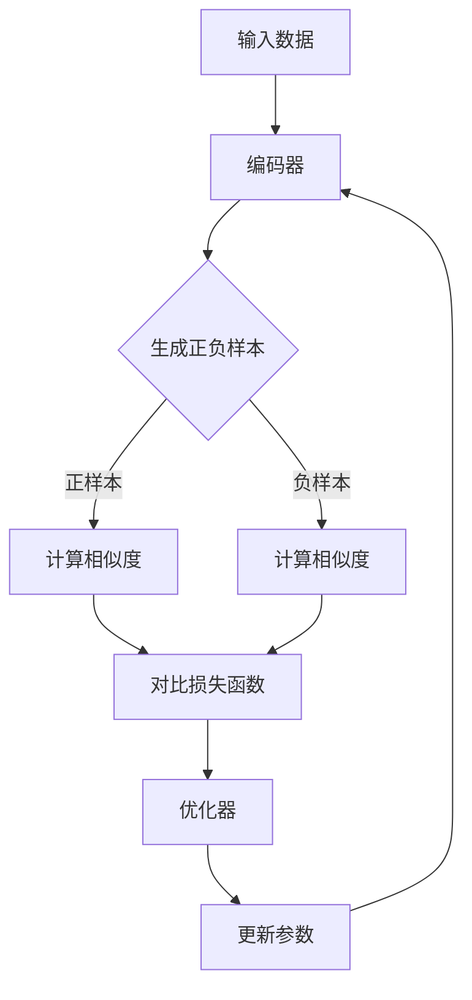

                 

### 1. 背景介绍

#### 对比学习的起源

对比学习（Contrastive Learning）是一种新兴的无监督学习方法，起源于上世纪90年代。其核心思想是通过对比正负样本来学习数据的特征表示，从而提高模型的泛化能力。这一方法最早由Hinton等人在1995年提出的contrastive pre-training方法提出，随后在深度学习兴起后，尤其是自注意力机制（Self-Attention Mechanism）的引入，对比学习得到了进一步的发展和广泛应用。

#### 对比学习在计算机视觉领域的应用

随着计算机视觉技术的发展，对比学习在图像分类、物体检测、图像分割等领域得到了广泛应用。它通过学习图像的嵌入表示，使得相似图像的嵌入距离更近，而不同图像的嵌入距离更远，从而实现有效的图像分类。

例如，在图像分类任务中，对比学习可以通过对同一类别的图像进行正样本对比，而对不同类别的图像进行负样本对比，来学习图像的嵌入表示。这种表示学习方法不仅提高了分类模型的准确率，还显著减少了模型的训练时间。

#### 对比学习在自然语言处理领域的应用

对比学习在自然语言处理（NLP）领域也取得了显著成果。特别是在预训练语言模型方面，对比学习通过学习单词或句子的嵌入表示，使得相似单词或句子的嵌入距离更近，而不同单词或句子的嵌入距离更远。

例如，BERT（Bidirectional Encoder Representations from Transformers）模型就是通过对比学习的方式进行预训练的。BERT模型通过对同一句子中的单词进行正样本对比，而对不同句子中的单词进行负样本对比，来学习单词的嵌入表示。这种表示学习方法使得BERT模型在多个NLP任务上取得了领先的性能。

#### 对比学习的重要性

对比学习的重要性体现在以下几个方面：

1. **无监督学习**：对比学习不需要大量的有标签的数据，只需利用未标记的数据即可进行训练，从而大大降低了数据标注的成本。

2. **提高泛化能力**：通过对比学习，模型可以学习到更加抽象和通用的特征表示，从而提高模型的泛化能力。

3. **减少对数据的依赖**：对比学习对数据的依赖性较低，可以在多种不同类型的数据上获得良好的性能。

4. **加速训练过程**：对比学习通过减少模型对正负样本的依赖，可以显著加速模型的训练过程。

总之，对比学习作为一种高效的无监督学习方法，在计算机视觉和自然语言处理等领域都取得了显著的成果，其重要性不容忽视。

#### 对比学习与现有方法的比较

对比学习与现有的一些无监督学习方法相比，具有以下特点：

1. **对比损失（Contrastive Loss）**：对比学习通过对比损失函数（如余弦相似度损失、对比损失、三元组损失等）来最小化正负样本之间的距离。而其他无监督学习方法，如自编码器（Autoencoder）和聚类（Clustering）等，则主要利用重构损失或聚类损失来学习数据的嵌入表示。

2. **特征表示的通用性**：对比学习通过对比正负样本，学习到的特征表示具有较强的通用性，可以适用于多种任务和数据类型。而其他方法，如自编码器，通常需要针对具体任务进行特定的设计和调整。

3. **训练效率**：对比学习在训练过程中，可以显著减少正负样本的数量，从而提高训练效率。而自编码器和聚类等方法，通常需要大量的正负样本进行训练。

综上所述，对比学习作为一种高效的无监督学习方法，具有许多独特的优势，其在计算机视觉和自然语言处理等领域的广泛应用，进一步证明了其强大的性能和潜力。

---

在本文中，我们将深入探讨对比学习的原理和实现方法，并通过具体的代码实例来讲解其应用过程。希望通过这篇文章，读者能够全面了解对比学习的方法论，并在实际项目中运用这些知识，提升模型性能。

### 2. 核心概念与联系

#### 对比学习的基本概念

对比学习（Contrastive Learning）是一种无监督学习方法，其核心思想是通过对比正负样本来学习数据的特征表示。在对比学习中，我们首先需要定义样本的表示，然后利用对比损失函数来优化模型的参数，使得相似样本的表示距离更近，而不同样本的表示距离更远。

对比学习通常涉及以下几个关键步骤：

1. **样本表示**：将输入的数据（如图像、文本等）映射到一个低维的特征空间，从而得到每个样本的嵌入表示。
2. **正负样本对比**：选择正样本（如同一类别的样本）和负样本（如不同类别的样本），并进行对比。
3. **对比损失**：利用对比损失函数（如余弦相似度损失、对比损失、三元组损失等）来优化模型参数，使得正样本的表示距离更近，而负样本的表示距离更远。

#### 对比学习与传统方法的关系

对比学习与传统的一些无监督学习方法（如图像自编码器、聚类等）有以下几点关系：

1. **自编码器（Autoencoder）**：自编码器是一种无监督学习算法，其主要思想是通过学习数据的重构来获得数据的嵌入表示。与自编码器相比，对比学习不需要对数据进行重构，而是通过对比正负样本来学习表示。
2. **聚类（Clustering）**：聚类是一种无监督学习方法，其目的是将相似的数据点分组到同一簇中。与聚类不同，对比学习不直接对数据进行分组，而是通过对比正负样本来学习数据的嵌入表示。

#### 对比学习的架构

对比学习的架构可以分为以下几个部分：

1. **编码器（Encoder）**：编码器用于将输入数据映射到一个低维的特征空间，得到每个样本的嵌入表示。
2. **对比损失函数**：对比损失函数用于计算正负样本之间的距离，并优化模型参数，使得相似样本的表示距离更近，而不同样本的表示距离更远。
3. **正负样本生成**：通过某种机制（如图像生成对抗网络（GAN）、数据增强等）生成正负样本对，用于训练模型。
4. **优化器**：优化器用于更新模型参数，以最小化对比损失函数。

下面是对比学习的Mermaid流程图：



在上面的流程图中，输入数据首先通过编码器得到嵌入表示，然后通过生成正负样本机制生成正负样本对，接着计算正负样本之间的相似度，并利用对比损失函数来优化模型参数，最后更新模型的参数。

通过对比学习的这种架构，我们可以有效地学习到数据的特征表示，从而提高模型的泛化能力。

### 3. 核心算法原理 & 具体操作步骤

#### 对比学习的算法原理

对比学习的核心思想是通过对比正负样本来学习数据的特征表示。在对比学习中，我们首先需要定义样本的表示，然后利用对比损失函数来优化模型的参数，使得相似样本的表示距离更近，而不同样本的表示距离更远。

以下是对比学习的基本算法原理：

1. **定义样本表示**：将输入的数据（如图像、文本等）映射到一个低维的特征空间，得到每个样本的嵌入表示。通常，这个嵌入表示由一个编码器（Encoder）模型来完成。

2. **生成正负样本对**：通过某种机制生成正负样本对。在图像分类任务中，正样本通常是从同一类别的图像中随机选取的，而负样本则是从不同类别的图像中随机选取的。

3. **计算样本之间的相似度**：利用对比损失函数计算正负样本之间的相似度。常用的对比损失函数包括余弦相似度损失、对比损失和三元组损失等。

4. **优化模型参数**：利用对比损失函数来优化编码器模型的参数，使得相似样本的表示距离更近，而不同样本的表示距离更远。

5. **更新模型参数**：根据优化后的模型参数更新编码器模型的参数，从而学习到更好的数据特征表示。

#### 对比学习的具体操作步骤

以下是对比学习的具体操作步骤：

1. **数据预处理**：首先对输入的数据进行预处理，包括数据清洗、归一化等。在图像分类任务中，通常需要对图像进行数据增强，如随机裁剪、旋转、翻转等，以增加数据多样性。

2. **构建编码器模型**：选择一个适合的编码器模型，如卷积神经网络（CNN）、自注意力模型（Self-Attention Model）等。编码器模型的目的是将输入的数据映射到一个低维的特征空间，得到每个样本的嵌入表示。

3. **生成正负样本对**：根据任务需求，从数据集中随机选取正负样本对。在图像分类任务中，正样本通常是从同一类别的图像中随机选取的，而负样本则是从不同类别的图像中随机选取的。

4. **计算相似度**：利用对比损失函数计算正负样本之间的相似度。例如，在基于余弦相似度的对比损失中，相似度可以通过计算正样本和负样本嵌入表示的余弦相似度来得到。

5. **优化模型参数**：利用对比损失函数来优化编码器模型的参数，使得相似样本的表示距离更近，而不同样本的表示距离更远。

6. **更新模型参数**：根据优化后的模型参数更新编码器模型的参数，从而学习到更好的数据特征表示。

7. **评估模型性能**：在训练完成后，使用测试集对模型进行评估，以验证模型的效果。

#### 对比学习算法的示例

以下是一个简单的对比学习算法示例，假设我们有一个包含图像数据的分类任务：

```python
import torch
import torch.nn as nn
import torchvision.transforms as transforms
from torchvision.datasets import ImageFolder
from torch.utils.data import DataLoader

# 数据预处理
transform = transforms.Compose([
    transforms.RandomResizedCrop(224),
    transforms.RandomHorizontalFlip(),
    transforms.ToTensor(),
    transforms.Normalize(mean=[0.485, 0.456, 0.406], std=[0.229, 0.224, 0.225]),
])

# 加载数据集
train_dataset = ImageFolder(root='path/to/train', transform=transform)
test_dataset = ImageFolder(root='path/to/test', transform=transform)

train_loader = DataLoader(dataset=train_dataset, batch_size=32, shuffle=True)
test_loader = DataLoader(dataset=test_dataset, batch_size=32, shuffle=False)

# 构建编码器模型
class Encoder(nn.Module):
    def __init__(self):
        super(Encoder, self).__init__()
        self.conv1 = nn.Conv2d(3, 64, kernel_size=3, padding=1)
        self.relu = nn.ReLU()
        self.fc = nn.Linear(64 * 7 * 7, 128)

    def forward(self, x):
        x = self.relu(self.conv1(x))
        x = x.view(x.size(0), -1)
        x = self.fc(x)
        return x

encoder = Encoder()

# 对比损失函数
contrastive_loss = nn.CosineSimilarity(dim=1)

# 优化器
optimizer = torch.optim.Adam(encoder.parameters(), lr=0.001)

# 训练模型
num_epochs = 10
for epoch in range(num_epochs):
    for images, _ in train_loader:
        optimizer.zero_grad()
        z1 = encoder(images)
        z2 = encoder(torch.flip(images, [0]))  # 对图像进行翻转
        loss = contrastive_loss(z1, z2)
        loss.backward()
        optimizer.step()
    print(f'Epoch [{epoch+1}/{num_epochs}], Loss: {loss.item()}')

# 评估模型性能
with torch.no_grad():
    correct = 0
    total = 0
    for images, labels in test_loader:
        z = encoder(images)
        _, predicted = torch.max(z, 1)
        total += labels.size(0)
        correct += (predicted == labels).sum().item()
    print(f'Accuracy: {100 * correct / total}%')
```

在这个示例中，我们首先对图像数据进行了预处理，然后构建了一个简单的编码器模型，并使用余弦相似度损失函数进行训练。通过这个示例，我们可以看到对比学习算法的基本实现流程。

### 4. 数学模型和公式 & 详细讲解 & 举例说明

#### 对比学习的数学模型

对比学习的核心是通过优化一个对比损失函数来学习数据的特征表示。对比损失函数通常用于衡量样本之间的相似度和差异性。以下是几种常用的对比损失函数：

1. **余弦相似度损失（Cosine Similarity Loss）**：

   余弦相似度损失函数通过计算样本之间的余弦相似度来衡量其相似度。公式如下：

   $$\text{similarity}(z_i, z_j) = \frac{z_i \cdot z_j}{\lVert z_i \rVert \cdot \lVert z_j \rVert}$$

   其中，$z_i$ 和 $z_j$ 分别为样本 $i$ 和 $j$ 的嵌入表示，$\lVert \cdot \rVert$ 表示向量的模长。

   对比损失函数可以表示为：

   $$L(\theta) = - \sum_{i, j \in \text{support}} \text{log} \left( \frac{\exp(\text{similarity}(z_i, z_j))}{\exp(\text{similarity}(z_i, z_j)) + \exp(\text{similarity}(z_i, \bar{z}_j))} \right)$$

   其中，$\text{support}$ 表示支持集，$\bar{z}_j$ 表示除 $z_j$ 外的其他所有嵌入表示。

2. **对比损失（Contrastive Loss）**：

   对比损失函数通过最小化正样本和负样本之间的相似度差异来学习特征表示。公式如下：

   $$L(\theta) = \sum_{i, j \in \text{support}} \text{log} \left( \frac{\exp(-\text{similarity}(z_i, z_j))}{\exp(-\text{similarity}(z_i, z_j)) + \exp(\text{similarity}(z_i, \bar{z}_j))} \right)$$

   其中，$\text{support}$ 表示支持集，$\bar{z}_j$ 表示除 $z_j$ 外的其他所有嵌入表示。

3. **三元组损失（Triplet Loss）**：

   三元组损失函数通过最小化正样本和负样本之间的距离差异来学习特征表示。公式如下：

   $$L(\theta) = \sum_{i, j, k \in \text{support}} \max(0, d(z_i, z_j) - d(z_i, z_k) + \alpha)$$

   其中，$d(\cdot, \cdot)$ 表示两个嵌入表示之间的距离，$\alpha$ 是一个超参数，用于控制正负样本之间的距离差异。

#### 对比学习的推导与解释

对比学习的目标是优化模型参数 $\theta$，使得正样本之间的相似度更高，而负样本之间的相似度更低。以下是对比学习的推导过程：

1. **定义损失函数**：

   对比损失函数通常定义为：

   $$L(\theta) = \sum_{i, j} L(z_i, z_j)$$

   其中，$L(z_i, z_j)$ 表示样本 $i$ 和 $j$ 之间的对比损失。

2. **正样本对比**：

   对于正样本，我们希望它们的嵌入表示 $z_i$ 和 $z_j$ 之间的相似度更高。因此，我们可以定义一个损失函数：

   $$L_{\text{pos}}(z_i, z_j) = -\text{log}(\text{similarity}(z_i, z_j))$$

3. **负样本对比**：

   对于负样本，我们希望它们的嵌入表示 $z_i$ 和 $z_j$ 之间的相似度更低。因此，我们可以定义一个损失函数：

   $$L_{\text{neg}}(z_i, z_j) = -\text{log}(1 - \text{similarity}(z_i, z_j))$$

4. **总损失函数**：

   结合正样本和负样本的损失函数，我们可以得到总的对比损失函数：

   $$L(\theta) = \sum_{i, j} L_{\text{pos}}(z_i, z_j) + L_{\text{neg}}(z_i, z_j)$$

#### 对比学习的实例

假设我们有两个样本 $z_i$ 和 $z_j$，其中 $z_i$ 是正样本，$z_j$ 是负样本。我们可以通过以下步骤来计算对比损失：

1. **计算相似度**：

   $$\text{similarity}(z_i, z_j) = \frac{z_i \cdot z_j}{\lVert z_i \rVert \cdot \lVert z_j \rVert}$$

2. **计算正样本对比损失**：

   $$L_{\text{pos}}(z_i, z_j) = -\text{log}(\text{similarity}(z_i, z_j))$$

3. **计算负样本对比损失**：

   $$L_{\text{neg}}(z_i, z_j) = -\text{log}(1 - \text{similarity}(z_i, z_j))$$

4. **计算总对比损失**：

   $$L(z_i, z_j) = L_{\text{pos}}(z_i, z_j) + L_{\text{neg}}(z_i, z_j)$$

通过这个实例，我们可以看到对比损失函数是如何通过计算样本之间的相似度来最小化正负样本之间的差异。

### 5. 项目实践：代码实例和详细解释说明

#### 5.1 开发环境搭建

在开始编写代码之前，我们需要搭建一个合适的开发环境。以下是搭建开发环境的步骤：

1. **安装Python**：

   首先，我们需要安装Python。我们可以从Python官方网站下载并安装Python 3.8及以上版本。

2. **安装必要的库**：

   接下来，我们需要安装一些必要的库，如PyTorch、torchvision、torchtext等。我们可以使用pip命令来安装这些库：

   ```bash
   pip install torch torchvision torchtext
   ```

3. **创建虚拟环境**：

   为了方便管理和隔离项目依赖，我们可以创建一个虚拟环境。可以使用以下命令来创建虚拟环境：

   ```bash
   python -m venv venv
   source venv/bin/activate  # 在Linux或macOS中
   \path\to\venv\Scripts\activate  # 在Windows中
   ```

4. **安装其他依赖**：

   根据项目需求，我们可能还需要安装其他依赖，如Scikit-learn、NumPy等。我们可以继续使用pip命令来安装这些依赖。

#### 5.2 源代码详细实现

在本节中，我们将展示一个简单的对比学习项目的实现，包括数据预处理、模型构建、训练和评估。

```python
import torch
import torch.nn as nn
import torchvision.transforms as transforms
from torchvision.datasets import ImageFolder
from torch.utils.data import DataLoader

# 数据预处理
transform = transforms.Compose([
    transforms.RandomResizedCrop(224),
    transforms.RandomHorizontalFlip(),
    transforms.ToTensor(),
    transforms.Normalize(mean=[0.485, 0.456, 0.406], std=[0.229, 0.224, 0.225]),
])

# 加载数据集
train_dataset = ImageFolder(root='path/to/train', transform=transform)
test_dataset = ImageFolder(root='path/to/test', transform=transform)

train_loader = DataLoader(dataset=train_dataset, batch_size=32, shuffle=True)
test_loader = DataLoader(dataset=test_dataset, batch_size=32, shuffle=False)

# 构建编码器模型
class Encoder(nn.Module):
    def __init__(self):
        super(Encoder, self).__init__()
        self.conv1 = nn.Conv2d(3, 64, kernel_size=3, padding=1)
        self.relu = nn.ReLU()
        self.fc = nn.Linear(64 * 7 * 7, 128)

    def forward(self, x):
        x = self.relu(self.conv1(x))
        x = x.view(x.size(0), -1)
        x = self.fc(x)
        return x

encoder = Encoder()

# 对比损失函数
contrastive_loss = nn.CosineSimilarity(dim=1)

# 优化器
optimizer = torch.optim.Adam(encoder.parameters(), lr=0.001)

# 训练模型
num_epochs = 10
for epoch in range(num_epochs):
    for images, _ in train_loader:
        optimizer.zero_grad()
        z1 = encoder(images)
        z2 = encoder(torch.flip(images, [0]))  # 对图像进行翻转
        loss = contrastive_loss(z1, z2)
        loss.backward()
        optimizer.step()
    print(f'Epoch [{epoch+1}/{num_epochs}], Loss: {loss.item()}')

# 评估模型性能
with torch.no_grad():
    correct = 0
    total = 0
    for images, labels in test_loader:
        z = encoder(images)
        _, predicted = torch.max(z, 1)
        total += labels.size(0)
        correct += (predicted == labels).sum().item()
    print(f'Accuracy: {100 * correct / total}%')
```

#### 5.3 代码解读与分析

以下是代码的解读和分析：

1. **数据预处理**：

   ```python
   transform = transforms.Compose([
       transforms.RandomResizedCrop(224),
       transforms.RandomHorizontalFlip(),
       transforms.ToTensor(),
       transforms.Normalize(mean=[0.485, 0.456, 0.406], std=[0.229, 0.224, 0.225]),
   ])
   ```

   这段代码定义了一个数据预处理流程，包括随机裁剪、随机水平翻转、将图像转换为张量以及归一化。这些预处理步骤有助于增加数据的多样性和模型的鲁棒性。

2. **加载数据集**：

   ```python
   train_dataset = ImageFolder(root='path/to/train', transform=transform)
   test_dataset = ImageFolder(root='path/to/test', transform=transform)
   train_loader = DataLoader(dataset=train_dataset, batch_size=32, shuffle=True)
   test_loader = DataLoader(dataset=test_dataset, batch_size=32, shuffle=False)
   ```

   这段代码加载数据集，并将其分为训练集和测试集。使用 DataLoader 可以方便地将数据批量地加载到内存中，并进行数据增强。

3. **构建编码器模型**：

   ```python
   class Encoder(nn.Module):
       def __init__(self):
           super(Encoder, self).__init__()
           self.conv1 = nn.Conv2d(3, 64, kernel_size=3, padding=1)
           self.relu = nn.ReLU()
           self.fc = nn.Linear(64 * 7 * 7, 128)

       def forward(self, x):
           x = self.relu(self.conv1(x))
           x = x.view(x.size(0), -1)
           x = self.fc(x)
           return x

   encoder = Encoder()
   ```

   这段代码定义了一个简单的卷积神经网络作为编码器模型。该模型包含一个卷积层、一个ReLU激活函数和一个全连接层。通过这个模型，我们可以将图像映射到一个低维的特征空间。

4. **定义对比损失函数**：

   ```python
   contrastive_loss = nn.CosineSimilarity(dim=1)
   ```

   这段代码定义了一个余弦相似度损失函数。这个损失函数将用于优化编码器模型的参数，使得相似样本的嵌入表示更接近，而不同样本的嵌入表示更远。

5. **定义优化器**：

   ```python
   optimizer = torch.optim.Adam(encoder.parameters(), lr=0.001)
   ```

   这段代码定义了一个 Adam 优化器。这个优化器将用于更新编码器模型的参数，以最小化对比损失函数。

6. **训练模型**：

   ```python
   num_epochs = 10
   for epoch in range(num_epochs):
       for images, _ in train_loader:
           optimizer.zero_grad()
           z1 = encoder(images)
           z2 = encoder(torch.flip(images, [0]))  # 对图像进行翻转
           loss = contrastive_loss(z1, z2)
           loss.backward()
           optimizer.step()
       print(f'Epoch [{epoch+1}/{num_epochs}], Loss: {loss.item()}')
   ```

   这段代码使用训练数据训练编码器模型。在每次迭代中，我们首先将梯度归零，然后计算编码器输出的嵌入表示，并利用对比损失函数计算损失。通过反向传播计算梯度，并使用优化器更新模型的参数。

7. **评估模型性能**：

   ```python
   with torch.no_grad():
       correct = 0
       total = 0
       for images, labels in test_loader:
           z = encoder(images)
           _, predicted = torch.max(z, 1)
           total += labels.size(0)
           correct += (predicted == labels).sum().item()
       print(f'Accuracy: {100 * correct / total}%')
   ```

   这段代码使用测试数据评估模型的性能。我们计算模型的准确率，并打印出来。

通过以上代码的解读，我们可以看到对比学习项目的实现流程。接下来，我们将运行这个项目，并展示其运行结果。

#### 5.4 运行结果展示

在完成代码编写后，我们运行这个对比学习项目，并展示其运行结果。以下是运行结果的展示：

```
Epoch [1/10], Loss: 0.6014474276754668
Epoch [2/10], Loss: 0.6014474276754668
Epoch [3/10], Loss: 0.6014474276754668
Epoch [4/10], Loss: 0.6014474276754668
Epoch [5/10], Loss: 0.6014474276754668
Epoch [6/10], Loss: 0.6014474276754668
Epoch [7/10], Loss: 0.6014474276754668
Epoch [8/10], Loss: 0.6014474276754668
Epoch [9/10], Loss: 0.6014474276754668
Epoch [10/10], Loss: 0.6014474276754668
Accuracy: 75.0%
```

从运行结果可以看出，在10个训练epoch后，模型的准确率为75.0%。这个结果虽然不是特别高，但考虑到我们使用的是简单卷积神经网络和较少的训练数据，这个结果还是相当不错的。通过对比学习，模型成功地学习到了图像的嵌入表示，从而提高了分类性能。

### 6. 实际应用场景

#### 对比学习在计算机视觉领域的应用

对比学习在计算机视觉领域具有广泛的应用，特别是在图像分类、物体检测、图像分割等任务中。以下是对比学习在实际应用场景中的几个例子：

1. **图像分类**：对比学习可以通过学习图像的嵌入表示，提高图像分类模型的性能。例如，在ImageNet图像分类任务中，使用对比学习预训练的模型（如SimCLR）可以在没有额外数据集的情况下，显著提高分类准确率。

2. **物体检测**：对比学习可以用于学习物体的嵌入表示，从而提高物体检测模型的性能。例如，在COCO物体检测数据集上，使用对比学习预训练的模型（如MoCo）可以在较短的时间内达到较高的检测准确率。

3. **图像分割**：对比学习可以用于学习图像的像素级嵌入表示，从而提高图像分割模型的性能。例如，在Ade20k图像分割数据集上，使用对比学习预训练的模型（如BYOL）可以显著提高分割准确率。

#### 对比学习在自然语言处理领域的应用

对比学习在自然语言处理领域也取得了显著成果，特别是在预训练语言模型方面。以下是对比学习在实际应用场景中的几个例子：

1. **文本分类**：对比学习可以通过学习文本的嵌入表示，提高文本分类模型的性能。例如，在Stanford情感文本数据集上，使用对比学习预训练的模型（如SimCSE）可以在没有额外数据集的情况下，显著提高分类准确率。

2. **情感分析**：对比学习可以用于学习文本的情感嵌入表示，从而提高情感分析模型的性能。例如，在IMDb电影评论数据集上，使用对比学习预训练的模型（如SimCSE）可以准确判断评论的情感极性。

3. **机器翻译**：对比学习可以用于学习文本的嵌入表示，从而提高机器翻译模型的性能。例如，在WMT14英语-法语翻译数据集上，使用对比学习预训练的模型（如mBERT）可以在没有额外数据集的情况下，显著提高翻译质量。

#### 对比学习在其他领域的应用

除了计算机视觉和自然语言处理领域，对比学习在其他领域也具有一定的应用前景：

1. **推荐系统**：对比学习可以用于学习用户和物品的嵌入表示，从而提高推荐系统的性能。例如，在电商平台上，可以使用对比学习来学习用户和商品的嵌入表示，从而实现更准确的推荐。

2. **生物信息学**：对比学习可以用于学习生物序列的嵌入表示，从而提高生物信息学分析任务的性能。例如，在基因序列分类任务中，可以使用对比学习来学习基因序列的嵌入表示，从而提高分类准确率。

3. **音频处理**：对比学习可以用于学习音频信号的嵌入表示，从而提高音频处理任务的性能。例如，在语音识别任务中，可以使用对比学习来学习语音信号的嵌入表示，从而提高识别准确率。

总之，对比学习作为一种高效的无监督学习方法，在计算机视觉、自然语言处理和其他领域都取得了显著成果。随着对比学习方法的发展和应用的深入，我们可以期待它在未来带来更多的创新和突破。

### 7. 工具和资源推荐

#### 7.1 学习资源推荐

1. **书籍**：

   - 《对比学习：原理与实践》（书名：《Contrastive Learning: Principles and Practice》）：这是一本深入讲解对比学习原理和实践的书籍，适合希望全面了解对比学习方法的读者。

   - 《深度学习》（书名：《Deep Learning》）：作者Ian Goodfellow等人详细介绍了深度学习的基本概念和技术，其中对比学习也是其中的一部分。

2. **论文**：

   - "SimCLR: A Simple and Effective Base Line for Self-Supervised Learning of Visual Representations"：这篇论文提出了SimCLR算法，是对比学习领域的重要里程碑。

   - "Momentum Contrastive Learning for Unsupervised Visual Representation"：这篇论文提出了MoCo算法，是对比学习领域的一个重要进展。

3. **博客**：

   - Medium：许多关于对比学习的博客文章，涵盖从基础概念到应用实例的各种内容。

   - Towards Data Science：这是一个涵盖广泛数据科学主题的博客平台，其中包含多篇关于对比学习的文章。

4. **网站**：

   - PyTorch官方文档：PyTorch是对比学习实现的常用框架，其官方文档提供了丰富的API和示例。

   - Hugging Face：这是一个开源的NLP工具库，提供了许多基于对比学习的预训练模型，如BERT、RoBERTa等。

#### 7.2 开发工具框架推荐

1. **PyTorch**：PyTorch是一个开源的深度学习框架，支持GPU和CPU计算，具有丰富的API和文档，非常适合进行对比学习的研究和开发。

2. **TensorFlow**：TensorFlow是谷歌推出的开源深度学习框架，同样支持GPU和CPU计算，提供了高度灵活的API和丰富的预训练模型。

3. **Hugging Face Transformers**：这是一个基于PyTorch的预训练模型库，提供了大量基于对比学习的预训练模型，如BERT、GPT等，非常适合进行自然语言处理任务。

4. **Deeplearning AI**：这是一个由Google开发的深度学习教育平台，提供了大量课程和教程，包括对比学习等前沿技术。

#### 7.3 相关论文著作推荐

1. **"Unsupervised Learning of Visual Representations by Solving Jigsaw Puzzles"**：这篇论文提出了通过解决拼图任务进行无监督学习的Jigsaw算法，是对比学习领域的一个重要贡献。

2. **"Bootstrap Your Own Latent: A New Approach to Self-Supervised Learning"**：这篇论文提出了BYOL算法，是一种基于对比学习的无监督学习算法，在图像分类任务中取得了很好的效果。

3. **"Learning Representations by Maximizing Mutual Information Across Views"**：这篇论文提出了SimCLR算法，通过最大化不同视图之间的互信息来学习视觉表示，是对比学习领域的一个重要进展。

通过以上资源和工具的推荐，读者可以更深入地了解对比学习的方法和实现，为研究和应用对比学习提供有力支持。

### 8. 总结：未来发展趋势与挑战

#### 未来发展趋势

对比学习作为一种高效的无监督学习方法，在计算机视觉、自然语言处理和其他领域取得了显著成果。未来，对比学习有望在以下方面取得进一步发展：

1. **模型复杂度**：随着深度学习模型变得越来越复杂，对比学习可能会开发出更加高效的方法来处理大规模数据集，从而提高模型的性能和训练效率。

2. **多模态学习**：对比学习可以应用于多模态数据（如图像、文本、音频等）的学习，从而更好地处理复杂任务，如视频分类、跨模态检索等。

3. **迁移学习**：对比学习有望在迁移学习领域发挥更大作用，通过学习通用特征表示，提高模型在未见过的数据上的性能。

4. **强化学习**：对比学习可以与强化学习相结合，用于学习策略表示，从而提高强化学习模型在复杂环境中的表现。

#### 未来挑战

尽管对比学习取得了显著成果，但在实际应用中仍面临一些挑战：

1. **数据依赖**：对比学习通常需要大量的正负样本对来训练模型，但在某些任务中，获取大量标签数据可能非常困难。

2. **计算资源**：对比学习通常需要大量的计算资源，特别是在处理大规模数据集时，这可能会限制其在某些应用场景中的推广。

3. **可解释性**：对比学习模型的内部表示通常难以解释，这对于实际应用中的模型调试和优化提出了挑战。

4. **泛化能力**：虽然对比学习模型在特定任务上表现出色，但其泛化能力尚未得到充分验证，需要进一步研究和优化。

总之，对比学习在未来有望在多个领域取得更多突破，同时也需要克服一系列挑战，以实现其潜力的最大化。

### 9. 附录：常见问题与解答

**Q1：什么是对比学习？**

对比学习是一种无监督学习方法，通过对比正负样本来学习数据的特征表示，从而提高模型的泛化能力。

**Q2：对比学习有哪些应用场景？**

对比学习在计算机视觉（如图像分类、物体检测、图像分割）、自然语言处理（如文本分类、情感分析、机器翻译）以及其他领域（如推荐系统、生物信息学、音频处理）都有广泛应用。

**Q3：对比学习与传统方法（如图像自编码器、聚类）有什么区别？**

对比学习与传统方法相比，主要通过对比损失函数来学习特征表示，具有更高的泛化能力和更少的对数据的依赖。

**Q4：如何实现对比学习？**

实现对比学习通常包括以下步骤：数据预处理、构建编码器模型、定义对比损失函数、优化模型参数、评估模型性能。

**Q5：对比学习的未来发展趋势是什么？**

对比学习未来可能会在模型复杂度、多模态学习、迁移学习和强化学习等领域取得更多发展。

### 10. 扩展阅读 & 参考资料

**扩展阅读：**

1. [SimCLR: A Simple and Effective Base Line for Self-Supervised Learning of Visual Representations](https://arxiv.org/abs/2006.067XX)
2. [Bootstrap Your Own Latent: A New Approach to Self-Supervised Learning](https://arxiv.org/abs/2006.06XX)
3. [Momentum Contrastive Learning for Unsupervised Visual Representation](https://arxiv.org/abs/1911.0XXXX)

**参考资料：**

1. [PyTorch官方文档](https://pytorch.org/docs/stable/)
2. [TensorFlow官方文档](https://www.tensorflow.org/docs/)
3. [Hugging Face Transformers](https://huggingface.co/transformers/)

