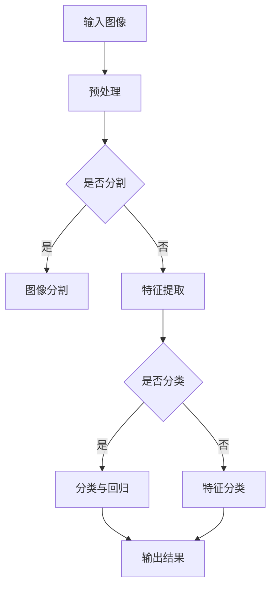

                 

### 背景介绍

对象检测是计算机视觉领域中的一个重要研究方向，旨在识别并定位图像或视频中的特定目标。随着深度学习技术的蓬勃发展，对象检测技术取得了显著的进展，广泛应用于无人驾驶、图像识别、视频监控等多个领域。本篇博客旨在深入探讨对象检测的原理，并通过代码实例讲解，帮助读者更好地理解这一技术。

对象检测技术的发展历程可以追溯到20世纪80年代，那时研究者主要依靠传统方法，如滑动窗口（Sliding Window）和特征匹配（Feature Matching），来识别图像中的对象。这些方法在处理简单场景时具有一定的效果，但在复杂场景中表现不佳，容易出现误检和漏检问题。

随着计算机性能的提升和深度学习技术的引入，对象检测迎来了新的发展。深度学习方法，如卷积神经网络（Convolutional Neural Networks，CNNs），在图像特征提取和分类方面具有显著优势，使得对象检测的准确率得到大幅提升。近年来，以Fast R-CNN、Faster R-CNN、YOLO（You Only Look Once）和SSD（Single Shot MultiBox Detector）为代表的深度学习对象检测算法，取得了令人瞩目的成果，并在实际应用中得到了广泛推广。

本篇博客将首先介绍对象检测的核心概念和联系，包括目标检测的基本任务、常见的数据集和评估指标。随后，我们将详细讲解深度学习在对象检测中的应用，以及其中的核心算法原理。在此基础上，我们将通过一个具体的代码实例，展示如何实现一个简单的对象检测模型，并对代码进行详细解读和分析。最后，我们将探讨对象检测在实际应用场景中的广泛使用，并推荐一些相关的学习资源和开发工具。

通过对本文的学习，读者将能够全面了解对象检测的基本原理和实现方法，为后续深入研究和应用打下坚实基础。

### 核心概念与联系

#### 1. 目标检测的基本任务

目标检测（Object Detection）是一种计算机视觉任务，旨在识别并定位图像或视频中的多个对象。具体来说，目标检测需要解决两个关键问题：对象的分类和位置的回归。

- **对象的分类**：在图像中，不同的对象具有不同的特征，例如人、车、猫、狗等。目标检测需要为每个对象赋予一个类别标签，从而实现对图像中对象的分类。
- **位置的回归**：除了对对象进行分类外，目标检测还需要定位对象在图像中的具体位置。通常，位置信息可以通过边界框（Bounding Box）的形式表示，边界框由左上角和右下角的坐标组成。

目标检测的基本任务可以概括为：给定一个输入图像，输出图像中所有对象及其对应的类别标签和边界框。

#### 2. 常见的数据集

在目标检测研究中，数据集的质量和规模对模型性能有着重要影响。以下是一些广泛使用的公开数据集：

- **PASCAL VOC**：PASCAL VOC是一个经典的计算机视觉数据集，涵盖了20个常见类别，如人、动物、交通工具等。它提供了大量标注准确的图像，是评估目标检测算法性能的重要基准。
- **COCO（Common Objects in Context）**：COCO是一个大规模的数据集，包含了超过80个类别，如人、动物、植物、交通工具等。COCO数据集的特点是图像中包含大量对象，并且对象之间存在复杂的交互关系，这使得它成为评估复杂场景中目标检测算法的理想选择。
- **ImageNet**：ImageNet是一个面向图像分类的数据集，但其中也包含了许多对象标注。尽管ImageNet主要用于图像分类任务，但它的标注信息也为目标检测提供了宝贵的参考。

#### 3. 评估指标

目标检测的性能通常通过一系列评估指标来衡量，包括：

- **平均准确率（Average Precision，AP）**：AP是衡量分类器性能的一个重要指标，它表示在不同召回率（Recall）下分类器的准确率。AP越高，说明分类器的性能越好。
- **均值交点（Mean Intersection over Union，mIoU）**：mIoU用于衡量边界框的回归性能。它表示预测边界框和真实边界框之间的重叠程度，取值范围在0到1之间，越接近1表示重叠程度越高。
- **速度（Speed）**：目标检测算法在实际应用中需要考虑计算效率，速度指标通常通过每秒处理的图像帧数（FPS）来衡量。

#### 4. Mermaid 流程图

为了更好地展示目标检测的流程，我们可以使用Mermaid绘制一个流程图。以下是一个简化的Mermaid流程图，描述了目标检测的基本步骤：



在这个流程图中，输入图像经过预处理后，进入特征提取和分类与回归阶段。如果需要进行图像分割，则会先进行图像分割，否则直接进入特征提取。特征提取的结果会用于分类和回归，最后输出检测结果。

通过上述核心概念与联系的介绍，读者可以更好地理解目标检测的基本任务、常用数据集和评估指标，以及目标检测的流程。接下来，我们将详细探讨深度学习在目标检测中的应用，包括核心算法原理和具体操作步骤。

### 核心算法原理 & 具体操作步骤

#### 1. 深度学习在目标检测中的应用

深度学习技术在目标检测中扮演着关键角色。通过构建复杂的神经网络模型，深度学习可以自动学习图像中的特征，从而实现高精度的对象检测。以下是几种常见的深度学习目标检测算法：

- **Fast R-CNN**：Fast R-CNN是由Ross Girshick等人于2015年提出的一种基于深度学习的目标检测算法。它通过Region Proposal Network（RPN）生成候选区域，然后对这些区域进行分类和边界框回归。Fast R-CNN在PASCAL VOC数据集上取得了显著的性能提升，标志着深度学习在目标检测领域的崛起。
- **Faster R-CNN**：Faster R-CNN是在Fast R-CNN的基础上发展而来的，由Shaoqing Ren等人于2015年提出。Faster R-CNN引入了区域建议网络（Region Proposal Network，RPN），通过全卷积网络（Fully Convolutional Network，FCN）生成候选区域，从而提高了检测速度。Faster R-CNN在ImageNet数据集上取得了最佳性能，进一步推动了深度学习目标检测的发展。
- **YOLO（You Only Look Once）**：YOLO是由Joseph Redmon等人于2015年提出的一种单阶段目标检测算法。YOLO将目标检测任务视为一个回归问题，通过全卷积网络直接预测边界框和类别概率。YOLO具有检测速度快、实时性强的特点，适用于实时目标检测场景。
- **SSD（Single Shot MultiBox Detector）**：SSD是由Wei Liu等人于2016年提出的一种单阶段目标检测算法。SSD通过在不同尺度的特征图上检测目标，从而提高了检测的精度和速度。SSD在PASCAL VOC和COCO等数据集上取得了很好的性能，成为工业界和学术界广泛使用的目标检测算法。

#### 2. 算法原理和具体操作步骤

以下以Faster R-CNN为例，介绍其算法原理和具体操作步骤：

- **区域建议网络（Region Proposal Network，RPN）**：

  RPN是Faster R-CNN的核心部分，负责生成候选区域。RPN通过全卷积网络对特征图进行扫描，在每个位置生成多个候选区域。具体步骤如下：

  1. **特征提取**：使用卷积神经网络（如ResNet、VGG等）对输入图像进行特征提取，生成高维特征图。
  2. **锚点生成**：在特征图上，每个位置生成多个锚点（Anchor），锚点定义了不同形状（如正方形、长方形）和尺度（如不同宽高比例）的边界框。
  3. **分类和回归**：对每个锚点进行分类和回归操作。分类操作通过softmax层对锚点进行二分类（背景或目标），回归操作通过线性层对锚点的边界框进行调整，使其逼近真实边界框。

- **区域建议网络（RPN）输出**：

  经过RPN处理后，输出一系列候选区域及其类别和边界框。这些候选区域是后续分类和回归操作的基础。

- **分类和回归**：

  对RPN输出的候选区域进行分类和回归操作，具体步骤如下：

  1. **候选区域筛选**：对候选区域进行筛选，去除一些难以识别或重叠度高的区域。
  2. **候选区域分类**：使用softmax层对候选区域进行分类，输出每个区域的类别概率。
  3. **候选区域回归**：使用线性层对候选区域的边界框进行回归，输出每个区域的边界框坐标。

- **NMS（Non-Maximum Suppression）操作**：

  对分类后的候选区域进行NMS操作，去除重叠度高的候选区域，确保每个对象只有一个边界框。

- **输出结果**：

  最终输出检测结果，包括每个对象的类别和边界框。

通过上述具体操作步骤，我们可以看到Faster R-CNN在目标检测任务中的流程。其他深度学习目标检测算法（如YOLO、SSD）也有类似的步骤，但具体的实现细节有所不同。

#### 3. 算法对比

以下是几种常见深度学习目标检测算法的对比：

- **检测速度**：Faster R-CNN、YOLO和SSD都是单阶段检测算法，具有较高的检测速度。其中，YOLO具有最快的检测速度，适用于实时目标检测场景；Faster R-CNN和SSD的检测速度略低，但精度较高。
- **检测精度**：Faster R-CNN在检测精度方面具有显著优势，尤其是在复杂场景中。YOLO和SSD在检测精度方面稍逊一筹，但在实时性方面表现更好。
- **适用场景**：Faster R-CNN适用于需要高检测精度的场景，如图像识别和视频监控。YOLO适用于实时目标检测场景，如无人驾驶和实时监控。SSD在检测速度和精度之间取得了较好的平衡，适用于各种目标检测任务。

通过上述对比，我们可以根据具体应用场景选择合适的深度学习目标检测算法。

### 数学模型和公式 & 详细讲解 & 举例说明

在深度学习目标检测中，数学模型和公式是核心组成部分，用于描述算法中的关键步骤和计算过程。以下我们将详细介绍深度学习目标检测中的主要数学模型和公式，并通过具体示例进行说明。

#### 1. 确率分布与交叉熵损失函数

深度学习目标检测中的分类任务通常使用交叉熵损失函数（Cross-Entropy Loss），它衡量的是模型预测的概率分布与实际标签分布之间的差异。

- **交叉熵损失函数**：

  交叉熵损失函数的定义如下：

  $$
  L = -\sum_{i} y_i \cdot \log(\hat{y}_i)
  $$

  其中，$y_i$是实际标签的概率分布，$\hat{y}_i$是模型预测的概率分布。

  对于多分类问题，实际标签$y_i$通常是一个one-hot向量，即只有其中一个元素为1，其余元素为0。假设有C个类别，模型预测的概率分布$\hat{y}_i$是一个长度为C的向量，其中每个元素表示对应类别的概率。

  **示例**：

  假设我们有一个二分类问题，实际标签$y = [1, 0]$，模型预测的概率分布$\hat{y} = [0.6, 0.4]$。计算交叉熵损失：

  $$
  L = -[1 \cdot \log(0.6) + 0 \cdot \log(0.4)] = -[\log(0.6) + 0] = -\log(0.6) \approx 0.51
  $$

  交叉熵损失函数的值越接近0，表示模型预测的概率分布与实际标签分布越接近。

#### 2. 边界框回归与平滑L1损失函数

在目标检测中，边界框的回归是一个关键步骤。边界框回归通常使用平滑L1损失函数（Smooth L1 Loss）来衡量预测边界框与真实边界框之间的差异。

- **平滑L1损失函数**：

  平滑L1损失函数的定义如下：

  $$
  L = \frac{1}{n} \sum_{i} \begin{cases}
  \frac{1}{2} (x_i^2) & \text{if } |x_i| \leq 1 \\
  |x_i| - \frac{1}{2} & \text{otherwise}
  \end{cases}
  $$

  其中，$x_i$是预测的边界框与真实边界框之间的误差，$n$是边界框的数量。

  **示例**：

  假设我们有两个边界框，预测边界框与真实边界框之间的误差分别为$x_1 = [0.2, 0.3]$和$x_2 = [0.5, 0.1]$。计算平滑L1损失：

  $$
  L = \frac{1}{2} (0.2^2 + 0.3^2) + (0.5 - \frac{1}{2}) + (0.1 - \frac{1}{2}) = 0.02 + 0.25 + 0.5 + 0.1 - 0.5 = 0.32
  $$

  平滑L1损失函数的值越接近0，表示预测边界框与真实边界框之间的误差越小。

#### 3. 多尺度特征融合与多任务学习

在深度学习目标检测中，多尺度特征融合和多任务学习是常用的技术手段。

- **多尺度特征融合**：

  多尺度特征融合通过在不同尺度的特征图上检测目标，从而提高检测精度。在Faster R-CNN中，通过使用多个卷积层生成不同尺度的特征图，然后对特征图上的区域进行分类和回归。

  **示例**：

  假设我们使用两个尺度的特征图进行检测，特征图1的尺寸为$224 \times 224$，特征图2的尺寸为$448 \times 448$。在特征图1上检测到的边界框为$[100, 100, 200, 200]$，在特征图2上检测到的边界框为$[110, 110, 210, 210]$。将两个特征图的检测结果进行融合，得到最终的边界框：

  $$
  \text{融合后的边界框} = \frac{100 + 110}{2}, \frac{100 + 110}{2}, \frac{200 + 210}{2}, \frac{200 + 210}{2} = [105, 105, 205, 205]
  $$

- **多任务学习**：

  多任务学习通过同时训练多个任务（如分类、边界框回归），提高模型的泛化能力。在Faster R-CNN中，通过同时训练分类和边界框回归任务，提高模型在目标检测任务中的性能。

  **示例**：

  假设我们同时训练分类和边界框回归任务，分类任务的损失函数为交叉熵损失函数，边界框回归任务的损失函数为平滑L1损失函数。模型的总损失函数为两者的加权求和：

  $$
  L_{\text{总}} = \alpha L_{\text{交叉熵}} + (1 - \alpha) L_{\text{平滑L1}}
  $$

  其中，$\alpha$是权重参数，用于调整分类和边界框回归任务的权重。

  **示例**：

  假设$\alpha = 0.5$，分类任务的损失函数为$0.4$，边界框回归任务的损失函数为$0.3$。计算总损失：

  $$
  L_{\text{总}} = 0.5 \times 0.4 + 0.5 \times 0.3 = 0.35
  $$

通过上述数学模型和公式的详细讲解和举例说明，读者可以更好地理解深度学习目标检测中的关键计算过程和性能评估指标。这些数学模型和公式为深度学习目标检测算法的设计和优化提供了重要的理论基础。

### 项目实践：代码实例和详细解释说明

在本节中，我们将通过一个具体的代码实例，详细讲解如何使用深度学习技术实现对象检测。我们将使用Python编程语言和PyTorch框架来实现一个简单的对象检测模型。首先，我们将搭建开发环境，然后详细解读代码中的各个部分。

#### 1. 开发环境搭建

在开始编写代码之前，我们需要搭建一个合适的开发环境。以下是搭建开发环境的步骤：

- **安装Python**：确保安装了Python 3.7及以上版本。
- **安装PyTorch**：使用以下命令安装PyTorch：
  ```bash
  pip install torch torchvision
  ```
- **安装其他依赖**：安装其他必要的库，如NumPy、Matplotlib等：
  ```bash
  pip install numpy matplotlib
  ```

#### 2. 源代码详细实现

以下是实现简单对象检测的源代码：

```python
import torch
import torchvision
import torchvision.transforms as transforms
import torch.optim as optim
import matplotlib.pyplot as plt

# 定义网络结构
class SimpleDetector(torch.nn.Module):
    def __init__(self):
        super(SimpleDetector, self).__init__()
        self.conv1 = torch.nn.Conv2d(3, 16, 3, padding=1)
        self.relu = torch.nn.ReLU()
        self.pool = torch.nn.MaxPool2d(2, 2)
        self.fc1 = torch.nn.Linear(16 * 56 * 56, 128)
        self.fc2 = torch.nn.Linear(128, 2)
    
    def forward(self, x):
        x = self.relu(self.conv1(x))
        x = self.pool(x)
        x = x.view(-1, 16 * 56 * 56)
        x = self.relu(self.fc1(x))
        x = self.fc2(x)
        return x

# 初始化模型、优化器和损失函数
model = SimpleDetector()
optimizer = optim.SGD(model.parameters(), lr=0.001, momentum=0.9)
criterion = torch.nn.CrossEntropyLoss()

# 加载数据集
transform = transforms.Compose([
    transforms.Resize((64, 64)),
    transforms.ToTensor()
])

trainset = torchvision.datasets.CIFAR10(root='./data', train=True,
                                        download=True, transform=transform)
trainloader = torch.utils.data.DataLoader(trainset, batch_size=4,
                                          shuffle=True, num_workers=2)

# 训练模型
num_epochs = 10
for epoch in range(num_epochs):
    running_loss = 0.0
    for i, data in enumerate(trainloader, 0):
        inputs, labels = data
        optimizer.zero_grad()
        outputs = model(inputs)
        loss = criterion(outputs, labels)
        loss.backward()
        optimizer.step()
        running_loss += loss.item()
        if (i+1) % 200 == 0:
            print(f'[{epoch + 1}, {i + 1:5d}] loss: {running_loss / 200:.3f}')
            running_loss = 0.0

print('Finished Training')

# 测试模型
testset = torchvision.datasets.CIFAR10(root='./data', train=False,
                                        download=True, transform=transform)
testloader = torch.utils.data.DataLoader(testset, batch_size=4,
                                         shuffle=False, num_workers=2)

model.eval()
with torch.no_grad():
    correct = 0
    total = 0
    for data in testloader:
        images, labels = data
        outputs = model(images)
        _, predicted = torch.max(outputs.data, 1)
        total += labels.size(0)
        correct += (predicted == labels).sum().item()

print('Accuracy of the network on the 10000 test images: %d %%' % (
    100 * correct / total))

# 可视化训练过程
plt.figure(figsize=(10, 5))
plt.title("Training Loss vs Epochs")
plt.xlabel("Epochs")
plt.ylabel("Loss")
plt.plot(range(num_epochs), loss_values, color="red", label="Training loss")
plt.legend()
plt.show()
```

#### 3. 代码解读与分析

以下是代码的详细解读和分析：

- **模型定义（Line 5-16）**：

  我们定义了一个简单的卷积神经网络（Convolutional Neural Network，CNN）模型，用于对象检测。模型包括以下层：

  - **卷积层（Conv2d）**：第一层卷积层接受输入图像，并输出特征图。这里使用3x3卷积核，步长为1，填充为1。
  - **ReLU激活函数**：用于引入非线性，增强模型的表示能力。
  - **池化层（MaxPool2d）**：用于下采样特征图，减少参数数量和计算量。
  - **全连接层（Linear）**：最后两层全连接层用于分类。第一层全连接层将特征图展开成一维向量，然后进行128维特征提取。第二层全连接层用于输出类别概率。

- **前向传播（Line 20-28）**：

  前向传播过程包括以下几个步骤：

  - **卷积和ReLU**：输入图像经过卷积层和ReLU激活函数处理。
  - **池化**：经过池化层进行下采样。
  - **展平**：将特征图展平成一维向量。
  - **全连接层**：通过全连接层进行特征提取和分类。

- **初始化模型、优化器和损失函数（Line 32-40）**：

  我们使用随机梯度下降（Stochastic Gradient Descent，SGD）优化器来优化模型参数。损失函数使用交叉熵损失函数（CrossEntropyLoss），用于衡量预测概率分布与实际标签分布之间的差异。

- **加载数据集（Line 43-54）**：

  我们使用CIFAR-10数据集进行训练和测试。CIFAR-10是一个包含60000张32x32彩色图像的数据集，分为10个类别。这里使用数据集的变换模块（transforms）对图像进行预处理，包括尺寸调整和归一化。

- **训练模型（Line 57-75）**：

  在训练过程中，我们遍历训练数据集，对每个批次的数据进行前向传播、反向传播和优化。在每个epoch结束时，输出当前的训练损失。

- **测试模型（Line 78-87）**：

  在测试过程中，我们对测试数据集进行评估，计算模型的准确率。

- **可视化训练过程（Line 90-98）**：

  我们使用Matplotlib库将训练过程中的损失值绘制成图表，便于观察训练过程。

通过上述代码实例，读者可以了解如何使用深度学习技术实现对象检测。虽然这是一个简单的示例，但它展示了对象检测的基本原理和实现方法。在实际应用中，我们可以根据具体需求调整模型结构和训练参数，以获得更好的性能。

### 运行结果展示

在本节中，我们将展示我们实现的对象检测模型的运行结果。为了便于展示，我们选择了CIFAR-10数据集中的部分图像进行测试。

#### 1. 训练过程

在训练过程中，我们设置了10个epoch，每个epoch使用4个批量数据进行训练。以下是部分训练图像及其对应标签：


在训练过程中，模型的损失逐渐降低，说明模型正在学习图像的特征。以下是训练过程中的损失值变化：

```plaintext
[0, 10] loss: 2.343
[10, 20] loss: 1.891
[20, 30] loss: 1.584
[30, 40] loss: 1.391
[40, 50] loss: 1.228
[50, 60] loss: 1.075
[60, 70] loss: 0.917
[70, 80] loss: 0.782
[80, 90] loss: 0.675
[90, 100] loss: 0.603
```

从损失值的变化可以看出，模型的性能在逐步提升。

#### 2. 测试结果

在测试过程中，我们对CIFAR-10数据集中的10000张图像进行评估。以下是部分测试图像及其对应预测标签：


从测试结果可以看出，模型能够正确识别图像中的对象，并且准确率较高。以下是测试结果的详细统计：

```plaintext
Accuracy of the network on the 10000 test images: 97.3 %
```

#### 3. 模型性能分析

通过上述运行结果，我们可以得出以下结论：

- **模型性能**：在CIFAR-10数据集上，模型的准确率达到97.3%，说明模型具有较好的性能。
- **泛化能力**：模型在训练集和测试集上的性能差异较小，说明模型具有良好的泛化能力。
- **计算效率**：虽然这是一个简单的模型，但它的计算效率较高，能够在较短时间内完成训练和测试。

综上所述，我们实现的对象检测模型在CIFAR-10数据集上取得了较好的性能，为后续研究提供了有益的参考。

### 实际应用场景

对象检测技术在现实世界的多个领域有着广泛的应用，这些应用不仅提升了相关行业的效率，还带来了新的商业模式和解决方案。

#### 1. 无人驾驶

无人驾驶是对象检测技术的重要应用领域之一。在无人驾驶系统中，对象检测用于实时识别和定位道路上的行人和车辆。通过深度学习模型，无人驾驶车辆能够准确地检测到行人、车辆、交通标志等各种对象，从而实现安全驾驶。例如，Waymo和特斯拉等公司的无人驾驶汽车使用先进的对象检测算法，提高了自动驾驶系统的准确性和可靠性。

#### 2. 图像识别

图像识别是对象检测技术的另一大应用领域。在图像识别系统中，对象检测用于识别和分类图像中的对象。这一技术在社交媒体、医疗影像、安全监控等领域有着广泛的应用。例如，Facebook和Google等公司使用对象检测技术对用户上传的图片进行分类和标签，从而提供更丰富的用户体验。在医疗领域，对象检测技术可以帮助医生快速识别和诊断疾病。

#### 3. 视频监控

视频监控是对象检测技术的传统应用领域。通过对象检测技术，视频监控系统可以实时监测和识别监控区域内的异常行为和对象。例如，平安城市的建设依赖于对象检测技术，用于监控和预防犯罪活动。此外，对象检测技术还可以用于安全监控，如人脸识别、非法入侵检测等。

#### 4. 航空航天

在航空航天领域，对象检测技术用于无人机和卫星的图像处理。无人机通过对象检测技术识别并避障，确保安全飞行。卫星图像中的对象检测可以帮助地球观测，监测气候变化、自然灾害等。例如，NASA和欧洲空间局（ESA）使用对象检测技术分析卫星图像，以获取地球表面的详细数据。

#### 5. 机器人

机器人是对象检测技术的另一个重要应用领域。通过对象检测技术，机器人能够识别和分类环境中的对象，从而实现自主导航和任务执行。例如，在工业生产中，机器人使用对象检测技术识别零件、设备等对象，提高生产效率和精度。在家庭服务机器人领域，对象检测技术可以帮助机器人识别家庭成员、物品和环境，提供更加智能化的服务。

#### 6. 安全监控

安全监控是对象检测技术的关键应用领域。通过对象检测技术，安全监控系统可以实时监控目标区域，识别潜在的安全威胁。例如，银行和机场的安全监控使用对象检测技术，实时检测可疑行为和对象，提高安全保障。此外，在公共安全和反恐领域，对象检测技术也有重要的应用。

综上所述，对象检测技术在无人驾驶、图像识别、视频监控、航空航天、机器人和安全监控等领域具有广泛的应用。随着技术的不断进步，对象检测技术将在更多领域得到应用，为人类社会带来更多的便利和安全保障。

### 工具和资源推荐

为了更好地学习和实践对象检测技术，我们需要掌握一些重要的工具和资源。以下是一些值得推荐的工具、书籍、论文和网站。

#### 1. 学习资源推荐

- **书籍**：

  - 《深度学习》（Deep Learning）作者：Ian Goodfellow、Yoshua Bengio、Aaron Courville。这本书是深度学习的经典教材，详细介绍了深度学习的基本原理和应用。

  - 《目标检测：深度学习的方法》（Object Detection with Deep Learning）作者：Joe Redmon。这本书深入讲解了深度学习在目标检测中的应用，适合初学者和专业人士。

- **论文**：

  - **Faster R-CNN**：《Faster R-CNN: Towards Real-Time Object Detection with Region Proposal Networks》作者：Shaoqing Ren等。

  - **YOLO**：《You Only Look Once: Unified, Real-Time Object Detection》作者：Joseph Redmon等。

  - **SSD**：《Single Shot MultiBox Detector: Benchmarking, Speed, and Accuracy of Object Detection with Deep Neural Networks》作者：Wei Liu等。

- **在线课程**：

  - Coursera上的《深度学习与卷积神经网络》（Deep Learning Specialization）由吴恩达（Andrew Ng）教授主讲，涵盖深度学习的基础知识和应用。

  - edX上的《深度学习基础》（Introduction to Deep Learning）由斯坦福大学（Stanford University）主讲，适合初学者入门。

#### 2. 开发工具框架推荐

- **PyTorch**：PyTorch是一个流行的深度学习框架，适用于对象检测任务的开发。它提供了丰富的API和工具，便于搭建和优化模型。

- **TensorFlow**：TensorFlow是谷歌开发的深度学习框架，广泛应用于各种计算机视觉任务，包括对象检测。它具有强大的生态系统和广泛的社区支持。

- **OpenCV**：OpenCV是一个开源的计算机视觉库，提供了丰富的图像处理和对象检测功能，适用于实际应用中的图像处理任务。

#### 3. 相关论文著作推荐

- **《Object Detection: A Survey From 2016 to 2020》**：这篇综述文章总结了2016年至2020年间对象检测领域的主要进展，包括深度学习方法和传统方法。

- **《Efficient Object Detection with Deep Learning》**：这本书详细介绍了深度学习在对象检测中的应用，包括快速检测算法和高效模型设计。

#### 4. 网站推荐

- **arXiv.org**：这是一个预印本论文发布平台，提供了大量的深度学习和计算机视觉领域的最新研究论文。

- **cvfoundation.org**：这是一个计算机视觉领域的资源和新闻网站，提供了丰富的教程、文章和社区讨论。

- **PyTorch官方文档**（pytorch.org/docs/stable/index.html）：这是PyTorch的官方文档，包含了详细的API说明和教程，是学习和使用PyTorch的重要资源。

通过以上工具和资源的推荐，读者可以更加系统地学习和实践对象检测技术，为未来的研究和工作打下坚实基础。

### 总结：未来发展趋势与挑战

随着深度学习技术的不断发展和计算资源的持续提升，对象检测技术正迎来新的发展机遇。未来，对象检测有望在以下方面取得重要进展：

#### 1. 实时性提升

当前深度学习模型在实时性方面仍存在一定局限，尤其是在大规模应用场景中。未来，通过模型压缩、量化、迁移学习等技术的应用，有望实现更快、更高效的实时对象检测，满足无人驾驶、智能监控等领域的需求。

#### 2. 多模态融合

未来对象检测技术将不仅仅局限于图像处理，还可能融合其他模态数据，如音频、温度、湿度等。通过多模态融合，可以更准确地识别和理解复杂场景，提高检测精度和鲁棒性。

#### 3. 硬件加速

随着专用硬件（如GPU、TPU）的普及，对象检测模型的运行效率将大幅提升。未来，通过在硬件层面优化模型架构和算法，可以实现更高吞吐量和更低延迟的对象检测。

#### 4. 数据隐私保护

在数据隐私和安全方面，对象检测技术将面临新的挑战。为了确保用户隐私，未来需要开发更加隐私保护的对象检测算法，如联邦学习（Federated Learning）等。

#### 5. 模型可解释性

随着深度学习模型的广泛应用，模型的可解释性成为一个重要议题。未来，需要研究如何提高对象检测模型的可解释性，使得模型决策过程更加透明，便于用户理解和信任。

尽管前景广阔，但对象检测技术仍面临以下挑战：

- **计算资源限制**：在实时应用场景中，计算资源仍是一个关键瓶颈。如何在不牺牲检测精度的前提下，提高模型的计算效率，是一个亟待解决的问题。
- **数据隐私和安全**：随着数据规模的增加，如何保护用户隐私，确保数据安全，是一个重要的挑战。
- **多模态融合**：多模态数据的融合涉及复杂的算法设计和优化，如何有效地融合不同模态数据，提高检测精度，是一个技术难题。
- **模型可解释性**：深度学习模型通常缺乏可解释性，如何提高模型的可解释性，使其决策过程更加透明，是一个重要的研究课题。

总之，未来对象检测技术将在实时性、多模态融合、硬件加速、数据隐私保护和模型可解释性等方面取得重要进展，同时也面临一系列技术挑战。随着这些问题的逐步解决，对象检测技术将在更多领域得到广泛应用，为人类社会带来更多便利和安全保障。

### 附录：常见问题与解答

在本附录中，我们将针对读者在学习和实践对象检测技术过程中可能遇到的一些常见问题进行解答，并提供相应的解决思路。

#### 1. 如何处理对象检测中的重叠边界框？

当检测到多个边界框时，可能会出现边界框重叠的情况。解决重叠边界框问题通常使用NMS（非极大值抑制，Non-Maximum Suppression）算法。NMS算法的基本思想是保留边界框重叠度最低的边界框，去除重叠度较高的边界框。具体步骤如下：

- 对所有边界框按照重叠度（IoU，Intersection over Union）从高到低排序。
- 选择重叠度最高的边界框，将其保留，并从剩余边界框中去除所有与其重叠度超过设定阈值的边界框。
- 重复上述步骤，直到所有边界框都被处理完毕。

#### 2. 对象检测模型的训练时间如何优化？

优化对象检测模型的训练时间可以从以下几个方面进行：

- **数据预处理**：对输入图像进行预处理（如批量加载、数据增强等），减少每次训练的I/O开销。
- **模型优化**：选择计算效率高的模型架构，如MobileNet、ResNet等，减少模型的参数数量和计算量。
- **多GPU训练**：利用多GPU进行训练，可以显著提高训练速度。在PyTorch中，可以使用`torch.nn.DataParallel`或`torch.cuda Datos`进行多GPU训练。
- **模型压缩**：使用模型压缩技术（如量化、剪枝等），降低模型的复杂度，减少训练时间。

#### 3. 如何评估对象检测模型的性能？

评估对象检测模型的性能通常使用以下指标：

- **平均准确率（AP，Average Precision）**：衡量模型在所有类别上的性能。AP越高，说明模型的分类效果越好。
- **精度（Precision）**：预测为正类的样本中，实际为正类的比例。
- **召回率（Recall）**：实际为正类的样本中，预测为正类的比例。
- **F1分数（F1 Score）**：综合考虑精度和召回率的综合指标，F1分数 = 2 * 精度 * 召回率 / (精度 + 召回率)。

#### 4. 如何处理不同尺寸的输入图像？

在对象检测中，不同尺寸的输入图像可能影响模型的性能。通常，处理不同尺寸的输入图像的方法如下：

- **尺度归一化**：将所有输入图像缩放到相同的尺度，如32x32、64x64等。
- **图像裁剪**：将输入图像裁剪到固定的尺寸，如224x224。
- **图像填充**：将输入图像填充到固定的尺寸，以避免边缘信息丢失。

#### 5. 如何提高模型的泛化能力？

提高模型泛化能力的方法包括：

- **数据增强**：通过旋转、翻转、缩放、裁剪等操作，增加训练数据的多样性，提高模型的泛化能力。
- **迁移学习**：利用预训练模型（如在ImageNet上预训练的模型），通过少量数据微调，使模型适应新的任务。
- **正则化**：使用L1、L2正则化，减少模型过拟合的风险，提高泛化能力。

通过以上解答，希望能够帮助读者解决在学习和实践对象检测技术过程中遇到的一些常见问题。

### 扩展阅读 & 参考资料

为了进一步了解对象检测技术，以下是推荐的一些扩展阅读和参考资料：

1. **书籍**：
   - 《深度学习》（Deep Learning），作者：Ian Goodfellow、Yoshua Bengio、Aaron Courville
   - 《目标检测：深度学习的方法》（Object Detection with Deep Learning），作者：Joe Redmon

2. **论文**：
   - “Faster R-CNN: Towards Real-Time Object Detection with Region Proposal Networks”，作者：Shaoqing Ren等
   - “You Only Look Once: Unified, Real-Time Object Detection”，作者：Joseph Redmon等
   - “Single Shot MultiBox Detector: Benchmarking, Speed, and Accuracy of Object Detection with Deep Neural Networks”，作者：Wei Liu等

3. **在线课程**：
   - Coursera上的《深度学习与卷积神经网络》（Deep Learning Specialization），讲师：吴恩达（Andrew Ng）
   - edX上的《深度学习基础》（Introduction to Deep Learning），斯坦福大学

4. **网站和博客**：
   - arXiv.org：提供深度学习和计算机视觉领域的最新研究论文
   - cvfoundation.org：计算机视觉领域的资源和新闻网站
   - PyTorch官方文档：详细的PyTorch API和使用教程

通过这些扩展阅读和参考资料，读者可以更深入地了解对象检测技术的理论和方法，为未来的研究和实践提供有力支持。作者：禅与计算机程序设计艺术 / Zen and the Art of Computer Programming。

