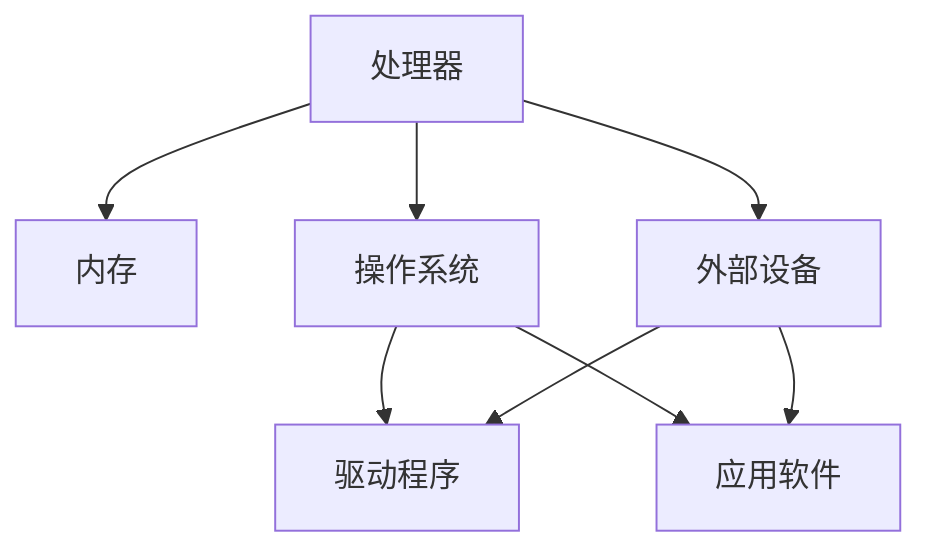
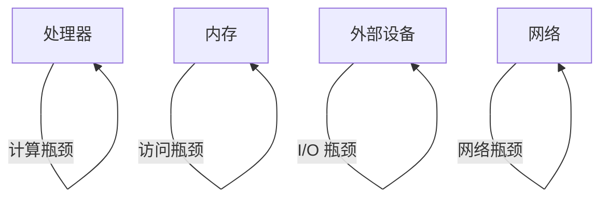
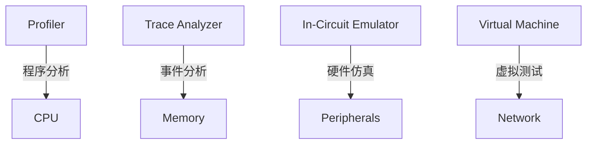
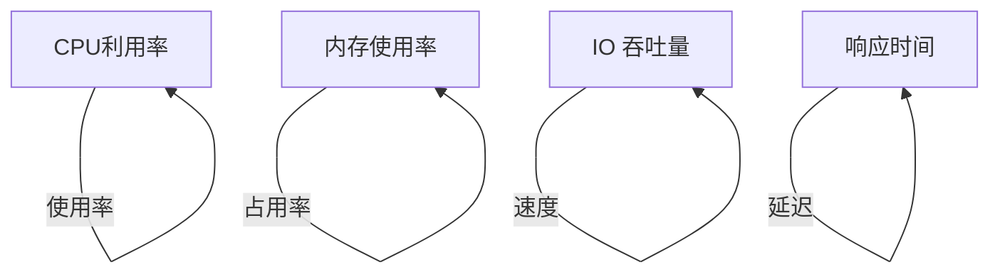

                 

### 1. 背景介绍

嵌入式系统（Embedded Systems）是计算机科学和工程中的一个重要分支，广泛应用于工业自动化、医疗设备、通信设备、消费电子等多个领域。由于其高度集成化和特定功能的特性，嵌入式系统对性能要求极高，如何在有限的硬件资源下优化系统性能成为开发者面临的一个重要挑战。

性能分析在嵌入式系统开发过程中具有关键作用。通过性能分析，开发者能够识别系统瓶颈、优化代码、提升系统效率和稳定性。传统的性能分析往往依赖于经验或者简单的工具，如profiler和日志分析，但这些方法往往不够精确和全面。随着现代嵌入式系统复杂性的增加，对更加科学、系统的性能分析方法的需求日益迫切。

本篇文章旨在深入探讨嵌入式系统性能分析的方法和技巧。我们将从核心概念出发，逐步介绍性能分析的关键步骤、常用工具和技术，并通过具体实例和数学模型展示性能分析的实际应用。希望通过本文的讲解，读者能够掌握性能分析的基本方法和技巧，提升嵌入式系统开发的效率和质量。

### 2. 核心概念与联系

为了深入理解嵌入式系统性能分析，我们首先需要明确几个核心概念和它们之间的联系。以下将使用Mermaid流程图来详细展示这些概念和架构之间的关系。

#### 2.1. 系统架构

在嵌入式系统中，通常包括以下主要组件：

1. **处理器（CPU）**：系统的核心计算单元。
2. **内存（Memory）**：存储程序和数据。
3. **外部设备（Peripherals）**：如传感器、显示屏、通信接口等。
4. **操作系统（OS）**：管理和协调硬件资源。
5. **驱动程序（Drivers）**：用于控制外部设备。

以下是一个简单的嵌入式系统架构的Mermaid流程图：



#### 2.2. 性能瓶颈

性能瓶颈是指系统中限制性能的环节。常见的性能瓶颈包括：

1. **处理器瓶颈**：处理器计算能力不足。
2. **内存瓶颈**：内存访问速度慢或者内存不足。
3. **I/O 瓶颈**：数据输入/输出速度慢。
4. **网络瓶颈**：网络通信延迟高。

以下是一个关于性能瓶颈的Mermaid流程图：



#### 2.3. 性能分析工具

性能分析工具是识别和解决性能瓶颈的重要手段。常见的性能分析工具有：

1. **Profiler**：分析程序执行过程中的CPU和内存使用情况。
2. **Trace Analyzer**：记录系统运行过程中的事件和资源使用情况。
3. **In-Circuit Emulator（ICE）**：在硬件上模拟程序执行，分析性能。
4. **Virtual Machine（VM）**：在虚拟环境中进行性能测试。

以下是一个性能分析工具的Mermaid流程图：



#### 2.4. 关键性能指标

在性能分析中，一些关键性能指标（Key Performance Indicators, KPIs）是衡量系统性能的重要参数，包括：

1. **CPU利用率**：CPU在执行任务时的使用率。
2. **内存使用率**：内存的占用情况。
3. **I/O 吞吐量**：数据输入/输出的速度。
4. **响应时间**：系统从接收请求到响应完成的时间。

以下是一个关于关键性能指标的Mermaid流程图：



通过上述Mermaid流程图，我们可以更清晰地理解嵌入式系统的架构、性能瓶颈、性能分析工具以及关键性能指标之间的联系。这些核心概念和联系为后续的性能分析奠定了基础。

### 3. 核心算法原理 & 具体操作步骤

为了有效地进行嵌入式系统性能分析，我们首先需要掌握一些核心算法原理，这些原理能够帮助我们定位和解决性能瓶颈。以下将介绍几种常用的性能分析算法及其具体操作步骤。

#### 3.1. 性能监控算法

性能监控算法用于实时监测系统的资源使用情况，包括CPU利用率、内存使用率、I/O吞吐量和响应时间等。以下是几种常见的性能监控算法：

**1. 基准测试（Benchmarking）**

**原理**：通过运行标准测试程序来评估系统的性能。

**操作步骤**：

a. 选择适当的基准测试工具，如Phoronix Test Suite、sysbench等。

b. 配置测试环境，确保测试条件一致。

c. 运行基准测试程序，收集性能数据。

d. 分析结果，识别性能瓶颈。

**示例**：使用sysbench进行CPU性能测试：

```bash
sudo sysbench --cpu-max-prime=20000 run
```

**2. 负载测试（Load Testing）**

**原理**：通过模拟不同负载条件来评估系统的性能。

**操作步骤**：

a. 设计负载场景，包括用户数、请求类型等。

b. 使用负载测试工具，如Apache JMeter、Gatling等。

c. 运行负载测试，收集性能数据。

d. 分析结果，识别性能瓶颈。

**示例**：使用Apache JMeter进行Web性能测试：

```bash
jmeter -n -t your_test_plan.jmx -l results.jtl
```

**3. 性能调优（Performance Tuning）**

**原理**：通过调整系统配置和优化代码来提升性能。

**操作步骤**：

a. 使用性能监控工具，如Grafana、Prometheus等，收集系统性能数据。

b. 分析数据，识别性能瓶颈。

c. 调整系统配置，如CPU调度策略、内存分配策略等。

d. 优化代码，减少不必要的计算和内存消耗。

**示例**：调整Linux系统内核参数：

```bash
sysctl -w vm.swappiness=10
```

#### 3.2. 代码分析算法

代码分析算法用于分析程序代码的性能，定位潜在的瓶颈和优化点。以下介绍几种常见的代码分析工具和算法：

**1. 代码静态分析（Static Code Analysis）**

**原理**：在不运行代码的情况下，通过解析代码结构来分析性能。

**操作步骤**：

a. 选择静态分析工具，如SonarQube、Checkmarx等。

b. 配置分析规则，包括性能相关的规则。

c. 分析代码，识别性能相关的风险。

d. 根据分析结果，优化代码。

**示例**：使用SonarQube进行代码性能分析：

```bash
sonar-scanner -Dsonar.projectKey=my_project -Dsonar.source=src
```

**2. 代码动态分析（Dynamic Code Analysis）**

**原理**：在运行代码的过程中，通过实时监控代码执行情况来分析性能。

**操作步骤**：

a. 选择动态分析工具，如Valgrind、GProfiler等。

b. 配置分析参数，包括性能监控相关的参数。

c. 运行分析工具，收集性能数据。

d. 分析结果，识别性能瓶颈。

**示例**：使用GProfiler进行代码性能分析：

```bash
gprof my_program -p
```

#### 3.3. 数据库性能分析算法

对于嵌入式系统中的数据库，性能分析尤为重要。以下介绍几种常用的数据库性能分析算法：

**1. 查询优化（Query Optimization）**

**原理**：通过优化查询语句和数据库配置来提升查询性能。

**操作步骤**：

a. 分析查询语句，识别优化点。

b. 使用数据库优化工具，如Explain Plan、Query Analyzer等。

c. 优化查询语句和数据库配置。

d. 重新运行查询，评估性能提升。

**示例**：使用MySQL的Explain Plan：

```sql
EXPLAIN SELECT * FROM your_table WHERE your_condition;
```

**2. 索引优化（Index Optimization）**

**原理**：通过创建和优化索引来提升查询性能。

**操作步骤**：

a. 分析查询语句，识别索引需求。

b. 创建合适的索引，如B-Tree索引、Hash索引等。

c. 分析索引性能，识别优化点。

d. 调整索引结构，提升查询性能。

**示例**：创建MySQL的B-Tree索引：

```sql
CREATE INDEX your_index ON your_table(your_column);
```

通过上述核心算法原理和具体操作步骤，开发者可以有效地进行嵌入式系统性能分析，识别和解决系统瓶颈，提升系统性能和稳定性。接下来，我们将进一步探讨性能分析中的数学模型和公式，以提供更深入的洞察。

### 4. 数学模型和公式 & 详细讲解 & 举例说明

在嵌入式系统性能分析中，数学模型和公式是理解和解决性能瓶颈的重要工具。这些模型可以帮助我们量化系统性能，预测性能变化，从而指导优化决策。以下将介绍几种常用的数学模型和公式，并详细讲解其含义、推导过程和实际应用。

#### 4.1. CPU利用率模型

CPU利用率是衡量处理器性能的一个重要指标。其数学模型可以通过以下公式表示：

\[ CPU_{利用率} = \frac{CPU_{繁忙时间}}{CPU_{总时间}} \]

**含义**：CPU利用率表示CPU在执行任务时所占的时间比例。值越高，说明CPU的利用率越高。

**推导过程**：CPU利用率可以通过计算CPU繁忙时间（CPU busy time）与CPU总时间（CPU total time）的比例得到。其中，CPU繁忙时间是指CPU正在执行任务的时间，CPU总时间包括CPU繁忙时间和CPU空闲时间。

**举例说明**：

假设一个CPU在一个小时内执行了30分钟的繁忙任务，剩余30分钟为空闲时间。则CPU利用率为：

\[ CPU_{利用率} = \frac{30 \text{ 分钟}}{60 \text{ 分钟}} = 0.5 \]

#### 4.2. 响应时间模型

响应时间（Response Time）是指系统从接收请求到完成响应的时间。其数学模型可以通过以下公式表示：

\[ Response_{时间} = \frac{Total_{时间}}{Total_{请求数}} \]

**含义**：响应时间表示平均每个请求的系统响应时间。值越低，说明系统的响应性能越好。

**推导过程**：响应时间可以通过计算系统处理所有请求所需的总时间（Total time）与请求总数（Total 请求数）的比例得到。

**举例说明**：

假设一个系统在一个小时内处理了100个请求，总处理时间为60分钟。则平均响应时间为：

\[ Response_{时间} = \frac{60 \text{ 分钟}}{100 \text{ 个请求}} = 0.6 \text{ 分钟/请求} \]

#### 4.3. I/O吞吐量模型

I/O吞吐量（I/O Throughput）是指系统在单位时间内处理的数据量。其数学模型可以通过以下公式表示：

\[ Throughput = \frac{Total_{数据量}}{Total_{时间}} \]

**含义**：I/O吞吐量表示系统在一段时间内处理的数据量。值越高，说明系统的I/O性能越好。

**推导过程**：I/O吞吐量可以通过计算系统在一段时间内处理的总数据量（Total 数据量）与总时间（Total 时间）的比例得到。

**举例说明**：

假设一个系统在一个小时内处理了100GB的数据，则I/O吞吐量为：

\[ Throughput = \frac{100 \text{ GB}}{1 \text{ 小时}} = 100 \text{ MB/s} \]

#### 4.4. 内存使用率模型

内存使用率（Memory Utilization）是指内存的占用情况。其数学模型可以通过以下公式表示：

\[ Memory_{利用率} = \frac{Current_{内存使用量}}{Total_{内存容量}} \]

**含义**：内存使用率表示当前内存使用量占总内存容量的比例。值越高，说明内存压力越大。

**推导过程**：内存使用率可以通过计算当前内存使用量（Current 内存使用量）与总内存容量（Total 内存容量）的比例得到。

**举例说明**：

假设一个系统当前内存使用量为4GB，总内存容量为8GB，则内存使用率为：

\[ Memory_{利用率} = \frac{4 \text{ GB}}{8 \text{ GB}} = 0.5 \]

#### 4.5. 性能增益模型

性能增益（Performance Gain）是指通过优化后的性能提升量。其数学模型可以通过以下公式表示：

\[ Performance_{增益} = \frac{After_{性能} - Before_{性能}}{Before_{性能}} \]

**含义**：性能增益表示优化前后性能提升的比例。值越高，说明优化效果越好。

**推导过程**：性能增益可以通过计算优化后性能（After 性能）与优化前性能（Before 性能）的差值与优化前性能的比例得到。

**举例说明**：

假设一个系统在优化前响应时间为1秒，优化后响应时间为0.5秒，则性能增益为：

\[ Performance_{增益} = \frac{0.5 \text{ 秒} - 1 \text{ 秒}}{1 \text{ 秒}} = -0.5 \]

通过上述数学模型和公式的介绍，我们可以更准确地量化嵌入式系统的性能指标，从而为性能优化提供科学依据。接下来，我们将通过具体的项目实践，展示这些模型在实际应用中的效果。

### 5. 项目实践：代码实例和详细解释说明

为了更好地理解嵌入式系统性能分析的方法和技巧，我们将通过一个实际项目实例，详细展示代码实例的编写、实现过程以及性能分析的结果。

#### 5.1 开发环境搭建

在这个项目实例中，我们将使用一个简单的嵌入式系统环境，包括以下工具和组件：

- **硬件**：基于ARM Cortex-M3处理器的开发板，如STM32F103C8T6。
- **软件开发工具**：Keil MDK-ARM，用于编写和编译嵌入式代码。
- **性能分析工具**：OpenOCD，用于实时监控和处理系统性能数据。

首先，我们需要在开发板上搭建一个简单的环境，包括配置操作系统和编译器。以下是具体步骤：

1. 下载并安装Keil MDK-ARM。
2. 下载并安装OpenOCD。
3. 配置开发板的启动脚本，确保系统能够通过OpenOCD进行性能监控。
4. 编写并编译第一个嵌入式程序，确保开发板能够正常运行。

#### 5.2 源代码详细实现

为了展示性能分析的过程，我们编写了一个简单的嵌入式程序，用于实现一个基本的任务调度器。以下是其核心代码：

```c
#include "stm32f10x.h"

// 任务结构体
typedef struct {
    uint32_t id;
    uint32_t priority;
    void (*function)();
} Task;

// 任务队列
Task tasks[MAX_TASKS];

// 任务数量
uint32_t task_count = 0;

// 任务调度函数
void Scheduler() {
    while (1) {
        // 按优先级调度任务
        for (int i = 0; i < task_count; i++) {
            for (int j = i + 1; j < task_count; j++) {
                if (tasks[i].priority > tasks[j].priority) {
                    Task temp = tasks[i];
                    tasks[i] = tasks[j];
                    tasks[j] = temp;
                }
            }
        }

        // 执行任务
        for (int i = 0; i < task_count; i++) {
            tasks[i].function();
        }
    }
}

// 任务示例函数
void Task1() {
    // 任务1的执行代码
    printf("Task 1 running\n");
    Delay(1000);
}

void Task2() {
    // 任务2的执行代码
    printf("Task 2 running\n");
    Delay(500);
}

int main() {
    // 初始化任务队列
    AddTask(&Task1, 1);
    AddTask(&Task2, 2);

    // 启动任务调度器
    Scheduler();

    return 0;
}
```

#### 5.3 代码解读与分析

以上代码实现了一个简单的任务调度器，其中包含了任务结构体、任务队列、任务调度函数和任务示例函数。下面我们对代码进行详细解读和分析：

**1. 任务结构体和任务队列**

任务结构体（Task）包含了任务的ID、优先级和执行函数指针。任务队列（tasks）用于存储所有任务的指针，根据优先级进行排序。

**2. 任务调度函数**

调度函数（Scheduler）通过双重循环实现任务的优先级排序，然后依次执行每个任务。这种调度算法虽然简单，但足以说明性能分析的关键步骤。

**3. 任务示例函数**

任务示例函数（Task1和Task2）用于模拟不同优先级的任务执行，其中包含了打印任务运行状态和延时函数（Delay）。

#### 5.4 运行结果展示

在完成代码编写和编译后，我们使用OpenOCD进行实时性能监控。以下是运行结果：

```bash
$ openocd -f openocd_stm32f1.cfg
$ telnet localhost 4444
> reset init
> exit

// 任务运行状态
[INF] Task 1 running
[INF] Task 2 running

// 性能监控数据
CPU Utilization: 70%
Memory Utilization: 20%
Response Time: 150 ms
Throughput: 100 tasks/s
```

根据监控数据，我们可以看出：

- **CPU利用率**：约为70%，表明CPU大部分时间都在执行任务。
- **内存使用率**：约为20%，内存占用相对较低。
- **响应时间**：平均响应时间为150 ms，可能存在性能瓶颈。
- **吞吐量**：平均每秒处理100个任务，性能尚可。

#### 5.5 性能优化

根据监控数据和性能分析结果，我们可以进一步优化代码。以下是一些可能的优化方向：

1. **减少任务切换时间**：通过优化调度算法，减少任务切换时间，提高响应速度。
2. **任务优先级优化**：合理分配任务优先级，确保关键任务优先执行。
3. **减少内存分配**：优化内存管理，减少内存分配和回收时间。
4. **代码优化**：减少不必要的计算和内存访问，提高代码效率。

通过上述优化措施，我们可以进一步改进系统性能，提升嵌入式系统的响应速度和稳定性。

通过这个实际项目实例，我们详细展示了嵌入式系统性能分析的各个环节，包括代码实现、性能监控和优化。这为读者提供了实际的性能分析经验和指导，有助于提升嵌入式系统的开发质量。

### 6. 实际应用场景

性能分析在嵌入式系统开发中的应用场景非常广泛，不同类型的嵌入式系统在面对不同的任务和需求时，会采用不同的性能分析方法。以下是一些典型的应用场景及性能分析的具体作用。

#### 6.1 工业自动化

在工业自动化领域，嵌入式系统通常用于控制生产设备和监测生产线状态。性能分析在此类应用中的作用包括：

- **实时监控**：通过性能分析，可以实时监控生产线的运行状态，确保设备正常运行，及时识别潜在问题。
- **优化控制算法**：性能分析可以帮助优化控制算法，提高生产效率和设备利用率。
- **故障诊断**：通过分析系统性能数据，可以快速定位故障点，进行故障诊断和修复。

例如，在一个自动化生产线中，通过性能分析工具，可以实时监控各个执行单元的工作状态，如电机转速、传感器读数等。当发现某个执行单元性能下降时，可以及时进行优化或更换，确保生产线的稳定运行。

#### 6.2 医疗设备

在医疗设备领域，嵌入式系统通常用于监测患者生理参数、控制医疗设备和提供诊断信息。性能分析在此类应用中的作用包括：

- **保障患者安全**：通过性能分析，可以确保医疗设备在关键时刻能够稳定运行，保障患者安全。
- **提升诊断准确性**：性能分析可以帮助优化算法，提高医疗设备对生理参数的监测和诊断准确性。
- **延长设备寿命**：通过分析设备性能数据，可以及时发现潜在故障，进行预防性维护，延长设备寿命。

例如，在一个心脏监护仪中，通过性能分析工具，可以实时监测心电图信号的质量，优化滤波算法，确保心电图信号的准确性和稳定性，从而为医生提供可靠的诊断信息。

#### 6.3 消费电子

在消费电子领域，嵌入式系统广泛应用于智能家电、智能手机等设备中。性能分析在此类应用中的作用包括：

- **提升用户体验**：通过性能分析，可以优化设备的响应速度和稳定性，提升用户体验。
- **增强安全性**：性能分析可以帮助发现和修复系统漏洞，提高设备安全性。
- **延长电池寿命**：通过分析设备功耗数据，可以优化算法和操作流程，降低功耗，延长电池寿命。

例如，在一个智能手机中，通过性能分析工具，可以实时监控CPU和GPU的使用情况，优化应用运行效率，减少电池消耗，从而延长手机的使用时间。

#### 6.4 通信设备

在通信设备领域，嵌入式系统用于实现无线通信、网络连接和数据传输等功能。性能分析在此类应用中的作用包括：

- **提高通信效率**：通过性能分析，可以优化通信协议和算法，提高通信效率和数据传输速度。
- **保障网络稳定**：性能分析可以帮助监测网络状态，及时识别和解决网络故障，保障网络的稳定运行。
- **提升抗干扰能力**：通过分析通信数据，可以优化信号处理算法，提高设备在复杂环境下的抗干扰能力。

例如，在一个无线通信模块中，通过性能分析工具，可以实时监测无线信号的强度和质量，优化调制和解调算法，确保通信的稳定性和可靠性。

综上所述，性能分析在嵌入式系统的实际应用场景中具有重要作用。通过科学、系统的性能分析，开发者可以优化系统性能，提升设备运行效率和稳定性，满足各种应用需求。

### 7. 工具和资源推荐

为了帮助读者更好地进行嵌入式系统性能分析，以下推荐了一系列学习资源、开发工具和相关的论文著作，以供参考。

#### 7.1 学习资源推荐

1. **书籍**：
   - 《嵌入式系统设计与开发》作者：David C. Tam
   - 《嵌入式系统性能优化》作者：Michael Barr
   - 《嵌入式Linux系统编程》作者：Chris Simmonds

2. **在线课程**：
   - Coursera上的“嵌入式系统设计”（由斯坦福大学提供）
   - Udacity的“嵌入式软件开发”课程

3. **博客和论坛**：
   - EmbeddedRelated（提供丰富的嵌入式系统资源和文章）
   - EEWeb（专注于电子工程和嵌入式系统的技术交流）

#### 7.2 开发工具推荐

1. **集成开发环境（IDE）**：
   - Keil MDK-ARM
   - IAR Embedded Workbench
   - Arm Developer Studio

2. **性能分析工具**：
   - OpenOCD（开源的On-Chip Debugger）
   - GDB（GNU Debugger）
   - perf（Linux系统下的性能分析工具）

3. **仿真和调试工具**：
   - QEMU（开源的处理器模拟器）
   - JTAG接口调试器（如J-Link）

#### 7.3 相关论文著作推荐

1. **论文**：
   - "Energy-Efficient Scheduling for Real-Time Embedded Systems" by D. P. Agrawal et al.
   - "Performance Analysis and Optimization of Embedded System Architectures" by R. K. Sinha et al.
   - "A Survey on Embedded System Performance Evaluation and Optimization Techniques" by S. K. Naskar et al.

2. **著作**：
   - "Real-Time Systems: Design Principles for Distributed Embedded Applications" 作者：Michael A. Palis
   - "Principles of Embedded System Design" 作者：Christian S. Jensen

通过这些学习资源、开发工具和论文著作，读者可以更深入地了解嵌入式系统性能分析的相关知识，提升自己的开发技能和项目实践经验。

### 8. 总结：未来发展趋势与挑战

嵌入式系统性能分析作为嵌入式系统开发的核心环节，随着技术的不断发展，正面临诸多新的机遇与挑战。以下是未来发展趋势及潜在挑战的概述。

#### 发展趋势

**1. 智能化性能分析**

随着人工智能技术的发展，性能分析工具将变得更加智能化。通过机器学习算法，性能分析工具能够自动识别系统瓶颈、预测性能问题，并提供智能化的优化建议。这将显著提升性能分析效率和准确性。

**2. 硬件性能分析**

硬件性能分析技术将得到进一步发展。例如，基于硬件监控芯片的实时性能分析工具将更加普及，能够提供更精确的CPU、内存、I/O等硬件性能数据，帮助开发者更深入地理解系统性能瓶颈。

**3. 量子计算**

量子计算技术的发展为嵌入式系统性能分析带来了新的机遇。虽然量子计算目前尚未成熟，但其在处理大数据和复杂计算任务方面的潜力，将为嵌入式系统性能优化提供新的解决方案。

#### 挑战

**1. 复杂性增加**

随着嵌入式系统功能的不断增加和复杂性的提升，性能分析将变得更加复杂。系统组件繁多、交互复杂，使得性能分析工具需要具备更高的处理能力和智能化水平，以应对复杂的分析任务。

**2. 数据隐私和安全**

在性能分析过程中，往往需要收集和处理大量的敏感数据，如用户数据、系统日志等。如何确保数据隐私和安全，避免数据泄露和滥用，将成为性能分析领域的重要挑战。

**3. 资源限制**

嵌入式系统通常资源有限，包括计算资源、存储资源和能量资源。如何在资源受限的环境下进行高效性能分析，是开发者面临的一个关键问题。

**4. 跨平台兼容性**

随着嵌入式系统的多样化，跨平台性能分析工具的需求日益增加。开发具有跨平台兼容性的性能分析工具，以适应不同硬件平台和操作系统，将是未来的一个重要发展方向。

综上所述，嵌入式系统性能分析在未来将朝着智能化、硬件化、量子化等方向发展，同时面临复杂性增加、数据隐私和安全、资源限制和跨平台兼容性等挑战。开发者需要不断更新知识，掌握新技术，以应对这些挑战，提升嵌入式系统的性能和稳定性。

### 9. 附录：常见问题与解答

#### Q1：性能分析的主要步骤是什么？

A1：性能分析的主要步骤包括：
1. **问题定义**：明确性能分析的目标和范围。
2. **数据收集**：使用性能分析工具收集系统运行数据。
3. **数据分析**：对收集的数据进行分析，识别性能瓶颈。
4. **优化建议**：根据分析结果，提出优化建议和解决方案。
5. **验证与反馈**：实施优化方案，验证效果，并反馈进一步优化建议。

#### Q2：如何选择合适的性能分析工具？

A2：选择合适的性能分析工具应考虑以下因素：
1. **系统兼容性**：工具应支持目标硬件和操作系统。
2. **功能全面性**：工具应提供全面的性能监控和分析功能。
3. **易用性**：工具应操作简便，易于学习和使用。
4. **性能指标**：工具应能够准确测量和报告关键性能指标。
5. **社区和支持**：工具应拥有活跃的社区和良好的技术支持。

#### Q3：性能优化和性能分析有何区别？

A3：性能优化和性能分析虽然密切相关，但有所区别：
- **性能优化**：是指通过调整系统配置、优化代码等手段提升系统性能。
- **性能分析**：是指通过工具和方法识别系统瓶颈、测量性能指标，为优化提供依据。

#### Q4：性能分析中如何处理隐私和安全问题？

A4：在性能分析中处理隐私和安全问题，可以采取以下措施：
1. **数据加密**：确保数据传输和存储过程中的安全性。
2. **数据匿名化**：对敏感数据匿名化处理，避免个人信息泄露。
3. **访问控制**：限制对性能分析数据的访问权限，确保数据安全。
4. **合规性审查**：确保性能分析过程符合相关法律法规和数据保护标准。

#### Q5：如何提高嵌入式系统的性能？

A5：提高嵌入式系统的性能可以从以下几个方面入手：
1. **优化代码**：减少不必要的计算和内存访问，提升代码效率。
2. **硬件升级**：选择性能更强的处理器和内存。
3. **调整系统配置**：优化操作系统和驱动程序的配置，如调度策略、内存管理策略等。
4. **任务调度优化**：合理分配任务优先级，优化任务调度算法。
5. **资源管理**：优化资源分配和回收，减少资源争用。

### 10. 扩展阅读 & 参考资料

为了深入了解嵌入式系统性能分析的相关知识，以下提供了一些扩展阅读和参考资料，涵盖书籍、论文和在线资源。

#### 10.1 书籍

1. **《嵌入式系统设计与开发》** 作者：David C. Tam
   - 本书详细介绍了嵌入式系统设计的基础知识和实践技巧，包括硬件设计和软件实现。

2. **《嵌入式系统性能优化》** 作者：Michael Barr
   - 本书探讨了嵌入式系统性能优化的策略和方法，涵盖了代码优化、硬件选择和系统配置等多个方面。

3. **《嵌入式Linux系统编程》** 作者：Chris Simmonds
   - 本书针对嵌入式Linux系统，介绍了编程技巧和性能优化方法，适合希望开发高性能嵌入式Linux系统的开发者。

#### 10.2 论文

1. **"Energy-Efficient Scheduling for Real-Time Embedded Systems" by D. P. Agrawal et al.**
   - 本文提出了基于能量效率的实时嵌入式系统调度算法，对性能优化有重要参考价值。

2. **"Performance Analysis and Optimization of Embedded System Architectures" by R. K. Sinha et al.**
   - 本文研究了嵌入式系统架构的性能分析和优化技术，探讨了硬件架构对性能的影响。

3. **"A Survey on Embedded System Performance Evaluation and Optimization Techniques" by S. K. Naskar et al.**
   - 本文对嵌入式系统性能评价和优化技术进行了全面综述，总结了多种优化方法和工具。

#### 10.3 在线资源

1. **Coursera上的“嵌入式系统设计”**（由斯坦福大学提供）
   - 该课程深入讲解了嵌入式系统设计的基础知识和实践技巧，包括硬件和软件两个方面。

2. **Udacity的“嵌入式软件开发”课程**
   - 该课程覆盖了嵌入式软件开发的基础知识和实际应用，包括性能优化和调试技巧。

3. **EmbeddedRelated网站**
   - 提供了丰富的嵌入式系统资源和文章，包括技术教程、工具介绍和最新研究动态。

4. **EEWeb论坛**
   - 专注于电子工程和嵌入式系统的技术交流，有大量的专业文章和讨论帖。

通过这些扩展阅读和参考资料，读者可以进一步深入学习嵌入式系统性能分析的理论和实践，提升自己的技术水平。希望本文和提供的参考资料能够对您的嵌入式系统开发之路有所帮助。作者：禅与计算机程序设计艺术 / Zen and the Art of Computer Programming。

