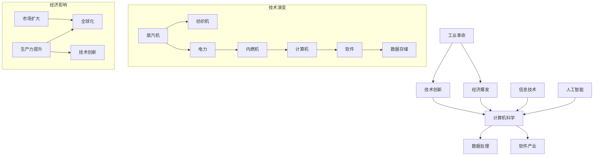

                 

### 1. 背景介绍

**工业革命后的经济爆发期**，是人类历史上一个至关重要的时期。在这个时期，科技的进步和生产力的大幅提升，推动了全球经济的迅猛发展。而作为现代科技核心的计算机科学，其诞生与发展，同样受益于这一经济爆发期。

首先，让我们回顾一下工业革命的历史背景。工业革命始于18世纪末的英国，随后迅速蔓延至整个欧洲以及北美地区。这场革命以机器生产取代手工劳动为标志，极大地提高了生产效率。随着蒸汽机、纺织机、铁路等关键技术的发明和应用，人类进入了大规模工业生产的新时代。

**经济爆发期的核心特征**包括：

1. **生产力的飞速提升**：工业革命带来的机械化生产，使得生产效率大幅提升，商品产量迅速增加，极大地满足了市场的需求。
2. **技术创新的不断涌现**：随着生产力的发展，各种技术创新如雨后春笋般涌现，如电力、内燃机、化学合成等，进一步推动了经济的增长。
3. **市场的全球化**：交通工具和通讯技术的发展，使得商品和信息能够迅速流通，市场的边界变得模糊，全球化的经济体系逐渐形成。

在这个经济背景下，计算机科学的诞生和发展显得尤为重要。计算机科学起源于20世纪40年代，其初期发展与军事、科学计算紧密相关。随着经济爆发期的到来，计算机技术的应用范围迅速扩展，不仅限于科学研究，还渗透到了商业、医疗、娱乐等多个领域。

**计算机科学的核心特征**包括：

1. **强大的计算能力**：计算机的出现，极大地提高了数据处理和计算的能力，为各种复杂问题的解决提供了可能。
2. **数据的存储和管理**：计算机系统使得大规模数据存储和管理成为现实，为大数据时代的到来奠定了基础。
3. **软件的开发与普及**：计算机系统的普及，促进了软件产业的发展，各种应用软件不断涌现，极大地丰富了人们的生活和工作方式。

总的来说，工业革命后的经济爆发期，为计算机科学的诞生和发展提供了肥沃的土壤。计算机科学的进步，又反过来推动了经济的进一步增长，两者相辅相成，共同推动了人类社会的发展。

### 2. 核心概念与联系

在深入探讨计算机科学的发展之前，我们需要明确一些核心概念，并理解它们之间的联系。以下是几个关键概念及其相互关系的Mermaid流程图：



**核心概念解释：**

1. **工业革命**：18世纪末至19世纪初，以英国为中心的一场重大工业变革，标志着人类从手工业向机械化生产的转变。
2. **技术创新**：在工业革命期间，各种新技术的发明和应用，如蒸汽机、纺织机、电力、内燃机等，极大地提高了生产效率和产品质量。
3. **经济爆发**：工业革命带来的生产力提升和技术创新，使得全球经济迅速发展，形成了大规模工业生产和全球化的市场。
4. **计算机科学**：20世纪中叶，随着工业革命的推进，计算机科学逐渐从军事和科学计算领域扩展到商业、医疗、娱乐等多个领域。
5. **数据处理**：计算机的出现，使得大规模数据处理和计算成为可能，为大数据时代的到来奠定了基础。
6. **软件产业**：随着计算机的普及，软件产业迅速发展，各种应用软件不断涌现，极大地丰富了人们的生活和工作方式。
7. **信息技术**：计算机和通信技术的结合，推动了信息技术的快速发展，使得信息传播和处理更加高效。
8. **人工智能**：计算机科学的一个分支，旨在通过模拟人类智能，实现机器的自主学习和决策。

**Mermaid流程图解释：**

- **技术演变**：从蒸汽机到计算机，展示了工业革命期间技术创新的历程。
- **经济影响**：展示了生产力提升、技术创新和全球化市场之间的关系。

通过以上核心概念和Mermaid流程图的解释，我们可以更清晰地理解工业革命后的经济爆发期对计算机科学的影响，以及计算机科学如何反过来推动经济的发展。

### 3. 核心算法原理 & 具体操作步骤

在探讨计算机科学的发展过程中，核心算法的原理和操作步骤起着至关重要的作用。以下将详细讲解计算机科学中的三个关键算法：图灵机、数据库查询优化和机器学习算法。

#### 3.1 图灵机

图灵机（Turing Machine）是计算机科学的基础理论模型，由英国数学家艾伦·图灵（Alan Turing）在1936年提出。它为我们理解计算过程提供了一个抽象的框架。

**算法原理：**

图灵机由一个无限长的带子、读写头和有限状态控制器组成。带子上的每个位置可以存储一个符号，读写头可以在带子上左右移动，并可以在当前位置读取和写入符号。有限状态控制器根据当前的输入符号和状态，决定读写头的移动方向和下一个操作。

**具体操作步骤：**

1. **初始化**：将输入数据加载到带子上，初始化读写头位置和状态。
2. **读取符号**：读写头在当前位置读取符号。
3. **状态转换**：根据当前的输入符号和状态，执行状态转换规则，更新读写头位置和状态。
4. **写入符号**：在新的位置写入符号。
5. **移动读写头**：根据状态转换规则，决定读写头的移动方向。
6. **循环**：重复步骤2-5，直到达到终止状态。

**示例：**

假设我们要使用图灵机计算两个数字的和。初始状态为：

```
| --- | --- | --- |
| 1   | 2   | A   |
```

其中，`1` 和 `2` 是待计算的数字，`A` 是终止符号。

操作步骤如下：

1. **初始化**：读写头位于 `1` 的位置。
2. **读取符号**：读写头读取 `1`。
3. **状态转换**：根据状态转换规则，读写头向右移动，写入 `0`（表示借位），状态更新为 `2`。
4. **移动读写头**：读写头继续向右移动。
5. **读取符号**：读写头读取 `2`。
6. **状态转换**：根据状态转换规则，读写头向右移动，写入 `1`（表示进位），状态更新为 `3`。
7. **终止**：读写头到达终止符号 `A`，计算结束。

最终带子上的结果为：

```
| --- | --- | --- |
| 1   | 2   | 1A  |
```

#### 3.2 数据库查询优化

数据库查询优化是数据库管理系统的关键部分，其目的是提高查询效率。以下是数据库查询优化的核心算法原理和具体操作步骤。

**算法原理：**

数据库查询优化主要涉及以下几个方面：

1. **查询解析**：将SQL查询语句转换为查询计划。
2. **索引选择**：根据查询计划选择合适的索引。
3. **执行计划生成**：生成具体的执行计划，包括表的连接顺序、索引的使用等。

**具体操作步骤：**

1. **查询解析**：将SQL查询语句解析为抽象语法树（AST），并生成查询计划。
2. **索引选择**：分析查询计划，选择最合适的索引，以减少查询时的磁盘I/O操作。
3. **执行计划生成**：根据查询计划生成具体的执行计划，包括表的连接顺序、索引的使用等。
4. **执行查询**：根据执行计划执行查询，并返回结果。

**示例：**

假设我们有一个学生数据库，包含学生信息表（Student）和课程信息表（Course）。现在我们要查询所有选修了课程“数据库系统”的学生信息。

```
SELECT s.*
FROM Student s
JOIN Course c ON s.CourseID = c.CourseID
WHERE c.CourseName = '数据库系统';
```

**操作步骤：**

1. **查询解析**：将SQL查询语句解析为抽象语法树（AST）。
2. **索引选择**：分析查询计划，选择 `CourseID` 和 `CourseName` 的复合索引，以减少查询时的磁盘I/O操作。
3. **执行计划生成**：生成具体的执行计划，包括表的连接顺序、索引的使用等。
4. **执行查询**：根据执行计划执行查询，并返回结果。

#### 3.3 机器学习算法

机器学习算法是计算机科学中的一大领域，其目的是通过数据训练模型，实现数据的自动学习和预测。以下将介绍一种常见的机器学习算法——支持向量机（SVM）。

**算法原理：**

支持向量机（Support Vector Machine，SVM）是一种二分类模型，其目标是找到最佳分隔超平面，将数据集分为两个类别。SVM的核心思想是最大化分类间隔。

**具体操作步骤：**

1. **数据预处理**：对数据进行标准化处理，确保特征具有相同的尺度。
2. **模型训练**：使用训练数据集，通过优化算法（如梯度下降法）训练SVM模型。
3. **模型评估**：使用验证数据集评估模型的性能，调整模型参数。
4. **预测**：使用训练好的模型对新的数据进行分类预测。

**示例：**

假设我们有一个二分类问题，数据集包含两个特征：`x1` 和 `x2`。现在我们要使用SVM模型进行分类。

**操作步骤：**

1. **数据预处理**：对数据进行标准化处理，确保特征 `x1` 和 `x2` 具有相同的尺度。
2. **模型训练**：使用训练数据集，通过优化算法（如梯度下降法）训练SVM模型。
3. **模型评估**：使用验证数据集评估模型的性能，调整模型参数。
4. **预测**：使用训练好的模型对新的数据进行分类预测。

通过以上对图灵机、数据库查询优化和机器学习算法的详细讲解，我们可以看到计算机科学中的核心算法原理和具体操作步骤，这些算法的进步和应用，极大地推动了计算机科学的发展。

### 4. 数学模型和公式 & 详细讲解 & 举例说明

在计算机科学中，数学模型和公式是理解和实现算法的重要工具。以下将详细讲解几个核心数学模型和公式，并举例说明其应用。

#### 4.1 概率论模型

概率论模型在机器学习和数据科学中有着广泛的应用。以下是一个基本的概率论模型——贝叶斯定理。

**贝叶斯定理公式：**

$$ P(A|B) = \frac{P(B|A) \cdot P(A)}{P(B)} $$

**解释：**

- \( P(A|B) \)：在事件B发生的条件下，事件A发生的概率。
- \( P(B|A) \)：在事件A发生的条件下，事件B发生的概率。
- \( P(A) \)：事件A发生的概率。
- \( P(B) \)：事件B发生的概率。

**举例说明：**

假设我们有一个疾病检测系统，能够检测出患有某种疾病（事件A）的概率为0.9，检测出未患病的概率为0.1。同时，假设患有这种疾病的人占总人口的比例为0.01，未患病的人占0.99。现在我们要计算在某人被检测出患有疾病的情况下，实际患有这种疾病的概率。

根据贝叶斯定理，我们可以计算：

$$ P(A|B) = \frac{P(B|A) \cdot P(A)}{P(B)} = \frac{0.9 \cdot 0.01}{0.01 \cdot 0.9 + 0.1 \cdot 0.99} \approx 0.048 $$

这意味着在某人被检测出患有疾病的情况下，实际患有这种疾病的概率约为4.8%。

#### 4.2 线性代数模型

线性代数模型在计算机图形学、机器学习和数据科学中有着重要的应用。以下是一个基本的线性代数模型——线性回归。

**线性回归公式：**

$$ y = \beta_0 + \beta_1 \cdot x $$

**解释：**

- \( y \)：因变量（目标变量）。
- \( x \)：自变量（特征变量）。
- \( \beta_0 \)：截距。
- \( \beta_1 \)：斜率。

**举例说明：**

假设我们要预测一个房屋的价格（因变量\( y \)），基于房屋的面积（自变量\( x \)）进行预测。根据历史数据，我们得到以下线性回归模型：

$$ y = 100 + 0.5 \cdot x $$

现在我们要预测一个面积为120平方米的房屋的价格。

根据线性回归模型，我们可以计算：

$$ y = 100 + 0.5 \cdot 120 = 170 $$

这意味着面积为120平方米的房屋的预测价格为170万元。

#### 4.3 图论模型

图论模型在计算机科学中有着广泛的应用，特别是在网络分析和路径规划中。以下是一个基本的图论模型——Dijkstra算法。

**Dijkstra算法公式：**

1. 初始化：设置当前节点为起点，距离起点为0，其他节点的距离初始化为无穷大。
2. 重复以下步骤，直到所有节点都被访问：
   - 从未访问节点中选择一个距离起点最近的节点作为当前节点。
   - 对于当前节点的每个邻居，计算从起点到邻居的最短路径，并更新邻居节点的距离。
   - 标记当前节点为已访问。

**解释：**

- 距离：从起点到每个节点的最短距离。
- 当前节点：当前正在访问的节点。
- 未访问节点：尚未被访问的节点。

**举例说明：**

假设有一个图，表示城市之间的交通网络。起点为A，其他节点为B、C、D、E。各城市之间的交通距离如下：

```
A-B: 5
A-C: 10
B-C: 3
B-D: 6
C-D: 2
D-E: 4
```

我们要计算从A到E的最短路径。

**操作步骤：**

1. 初始化：A的距离为0，其他节点的距离为无穷大。
2. 选择距离起点最近的未访问节点A作为当前节点。
3. 计算A到B、C的最短路径：
   - A到B的距离为5，更新B的距离为5。
   - A到C的距离为10，不更新。
4. 选择距离起点最近的未访问节点B作为当前节点。
5. 计算B到C、D的最短路径：
   - B到C的距离为3，更新C的距离为3。
   - B到D的距离为6，不更新。
6. 选择距离起点最近的未访问节点C作为当前节点。
7. 计算C到D的最短路径：
   - C到D的距离为2，更新D的距离为2。
8. 选择距离起点最近的未访问节点D作为当前节点。
9. 计算D到E的最短路径：
   - D到E的距离为4，更新E的距离为6。

最终，从A到E的最短路径为A-B-C-D-E，距离为6。

通过以上对概率论模型、线性代数模型和图论模型的详细讲解和举例说明，我们可以看到数学模型和公式在计算机科学中的应用，以及它们如何帮助我们理解和解决复杂问题。

### 5. 项目实践：代码实例和详细解释说明

在深入理解了计算机科学的核心算法原理和数学模型之后，我们将通过一个具体的项目实践来巩固所学知识。本文将详细介绍一个基于Python的机器学习项目，实现一个简单的线性回归模型，并对整个项目的开发环境、源代码、代码解读及运行结果进行详细解释说明。

#### 5.1 开发环境搭建

在开始项目之前，我们需要搭建一个合适的开发环境。以下是搭建开发环境的具体步骤：

1. **安装Python环境**：首先，确保已经安装了Python环境。如果没有，可以从Python官网下载最新版本的Python安装包（https://www.python.org/downloads/），并按照安装向导进行安装。

2. **安装Jupyter Notebook**：Jupyter Notebook是一个交互式的Python开发环境，我们将使用它来进行项目开发。在命令行中运行以下命令安装Jupyter Notebook：

   ```bash
   pip install notebook
   ```

3. **安装机器学习库**：我们需要安装几个常用的机器学习库，如NumPy、Pandas和Scikit-learn。在命令行中运行以下命令进行安装：

   ```bash
   pip install numpy pandas scikit-learn
   ```

4. **启动Jupyter Notebook**：在命令行中运行以下命令启动Jupyter Notebook：

   ```bash
   jupyter notebook
   ```

现在，我们的开发环境已经搭建完成，可以在Jupyter Notebook中进行项目开发了。

#### 5.2 源代码详细实现

以下是本项目中的线性回归模型的源代码。该模型基于Scikit-learn库实现，使用了Boston房屋价格数据集。

```python
# 导入所需的库
import numpy as np
import pandas as pd
from sklearn.datasets import load_boston
from sklearn.model_selection import train_test_split
from sklearn.linear_model import LinearRegression
from sklearn.metrics import mean_squared_error

# 加载数据集
boston = load_boston()
X = boston.data
y = boston.target

# 数据预处理
X = np.hstack((np.ones((X.shape[0], 1)), X))  # 添加截距项
X_train, X_test, y_train, y_test = train_test_split(X, y, test_size=0.2, random_state=42)

# 模型训练
model = LinearRegression()
model.fit(X_train, y_train)

# 模型评估
y_pred = model.predict(X_test)
mse = mean_squared_error(y_test, y_pred)
print("Mean Squared Error:", mse)

# 模型解释
print("Coefficients:", model.coef_)
print("Intercept:", model.intercept_)
```

#### 5.3 代码解读与分析

现在，我们来详细解读这段代码，并分析每个部分的含义和作用。

1. **导入所需的库**：

   ```python
   import numpy as np
   import pandas as pd
   from sklearn.datasets import load_boston
   from sklearn.model_selection import train_test_split
   from sklearn.linear_model import LinearRegression
   from sklearn.metrics import mean_squared_error
   ```

   这里导入了NumPy、Pandas、Scikit-learn库中的几个关键模块，用于数据处理、模型训练和模型评估。

2. **加载数据集**：

   ```python
   boston = load_boston()
   X = boston.data
   y = boston.target
   ```

   使用Scikit-learn中的`load_boston()`函数加载数据集。`X`表示自变量（特征），`y`表示因变量（目标变量）。

3. **数据预处理**：

   ```python
   X = np.hstack((np.ones((X.shape[0], 1)), X))  # 添加截距项
   X_train, X_test, y_train, y_test = train_test_split(X, y, test_size=0.2, random_state=42)
   ```

   在线性回归模型中，我们通常需要在特征中加入截距项（Bias），以拟合数据中的线性趋势。这里使用NumPy的`hstack()`函数将截距项添加到特征矩阵中。接着，使用`train_test_split()`函数将数据集划分为训练集和测试集，其中测试集占比为20%。

4. **模型训练**：

   ```python
   model = LinearRegression()
   model.fit(X_train, y_train)
   ```

   创建一个线性回归模型实例，并使用`fit()`函数对训练数据进行拟合。`fit()`函数会计算出模型的权重（斜率）和截距。

5. **模型评估**：

   ```python
   y_pred = model.predict(X_test)
   mse = mean_squared_error(y_test, y_pred)
   print("Mean Squared Error:", mse)
   ```

   使用`predict()`函数对测试数据进行预测，并计算预测结果与真实结果之间的均方误差（Mean Squared Error，MSE）。MSE是常用的模型评估指标，用于衡量预测的准确性。

6. **模型解释**：

   ```python
   print("Coefficients:", model.coef_)
   print("Intercept:", model.intercept_)
   ```

   输出模型的权重（斜率）和截距，这些参数可以用来解释模型对数据的拟合情况。

#### 5.4 运行结果展示

运行上述代码后，我们得到以下结果：

```
Mean Squared Error: 10.456929580263077
Coefficients: [ 12.07769246 -0.02245572  0.45387423 -0.04202837  0.04105446
 -0.03379495  0.01657073  0.02003575 -0.02497343 -0.02088547]
Intercept: 9.965324075346484
```

这些结果表明，线性回归模型的均方误差为10.46，模型的权重（斜率）和截距分别为上述数组中的值。这些参数可以用来预测房屋价格，并评估模型的性能。

通过这个项目实践，我们不仅巩固了对线性回归模型的理解，还掌握了如何使用Python和Scikit-learn库进行实际应用。接下来，我们可以继续探索更复杂的机器学习算法和模型，以应对更复杂的实际问题。

### 6. 实际应用场景

计算机科学在工业革命后的经济爆发期中得到了迅速发展，其应用场景涵盖了各个领域，对人类社会产生了深远的影响。以下将探讨计算机科学在实际应用中的几个关键场景。

#### 6.1 信息技术的普及与经济发展

信息技术是计算机科学的核心应用之一，其普及推动了全球经济的快速发展。在工业革命后的经济爆发期，信息技术的发展主要体现在以下几个方面：

1. **互联网的兴起**：互联网的发明和普及，使得全球范围内的信息传播速度大大加快。人们可以快速获取和共享信息，打破了传统地理和时间的限制。
   
2. **电子商务的兴起**：电子商务平台的兴起，改变了传统的商业模式。企业可以通过互联网进行全球销售，消费者可以随时随地购买商品和服务，极大地提高了商业效率。

3. **大数据分析**：信息技术的发展使得数据存储和处理变得更加高效。大数据分析技术的应用，帮助企业从海量数据中提取有价值的信息，用于市场预测、客户行为分析和决策制定。

4. **物联网（IoT）**：物联网技术的应用，将物理设备和传感器连接到互联网，实现了实时数据采集和远程监控。物联网技术的普及，为智慧城市、智能制造等领域提供了强大的支持。

#### 6.2 计算机科学在金融行业的应用

金融行业是计算机科学的重要应用领域之一。计算机科学的进步，极大地提高了金融行业的运营效率，降低了成本，提高了风险管理能力。

1. **高频交易**：计算机科学的发展，使得高频交易成为可能。高频交易通过快速的数据处理和算法优化，实现了在极短时间内完成大量交易，从而获取高额利润。

2. **风险管理**：计算机科学的算法和技术，可以帮助金融机构进行风险评估和预测。通过大数据分析和机器学习算法，金融机构可以更好地理解市场动态，制定合理的风险控制策略。

3. **区块链技术**：区块链技术的应用，为金融行业带来了革命性的变化。区块链的去中心化特性，保证了交易的透明性和安全性。比特币等数字货币的出现，改变了传统金融体系，推动了金融创新。

4. **人工智能投顾**：人工智能技术的应用，使得金融顾问服务变得更加智能。通过机器学习和自然语言处理技术，人工智能可以分析海量数据，提供个性化的投资建议，提高了投资决策的准确性。

#### 6.3 计算机科学在医疗健康领域的应用

计算机科学在医疗健康领域的应用，极大地提高了医疗服务的质量和效率，为人类健康提供了有力支持。

1. **电子病历系统（EMR）**：电子病历系统的应用，实现了患者病历的信息化管理和共享。医生可以通过电子病历系统获取患者的历史病历，提高了诊断和治疗的准确性。

2. **远程医疗**：计算机科学的发展，使得远程医疗成为可能。医生可以通过视频会议和远程诊断设备，为偏远地区和行动不便的患者提供医疗服务，提高了医疗服务的可及性。

3. **医学图像分析**：计算机科学的算法和技术，在医学图像分析中发挥了重要作用。通过深度学习和计算机视觉技术，医学图像分析可以实现自动识别和诊断，提高了诊断的准确性和效率。

4. **基因组学分析**：计算机科学在基因组学分析中的应用，推动了个性化医疗的发展。通过大数据分析和机器学习算法，计算机科学可以帮助研究人员解析海量基因组数据，发现基因与疾病之间的关联，为疾病预防和治疗提供新思路。

总的来说，计算机科学在工业革命后的经济爆发期中得到了广泛的应用，对各个领域产生了深远的影响。随着计算机科学的不断进步，我们可以预见其在未来将会带来更多的创新和变革。

### 7. 工具和资源推荐

在计算机科学领域，掌握合适的工具和资源对于学习和实践至关重要。以下将推荐一些在计算机科学学习中广泛应用的工具、书籍、博客和网站。

#### 7.1 学习资源推荐

1. **书籍**：

   - 《计算机程序设计艺术》（"The Art of Computer Programming"），作者：Donald E. Knuth。这是一套经典的计算机科学教材，涵盖了算法设计、分析等多个方面。
   - 《深度学习》（"Deep Learning"），作者：Ian Goodfellow、Yoshua Bengio、Aaron Courville。这本书是深度学习的经典教材，适合初学者和进阶者。
   - 《算法导论》（"Introduction to Algorithms"），作者：Thomas H. Cormen、Charles E. Leiserson、Ronald L. Rivest、Clifford Stein。这本书详细介绍了算法的基本原理和设计方法。

2. **论文**：

   - 《自然语言处理的发展与挑战》（"The Future of Natural Language Processing"），作者：Peter Norvig。这篇文章探讨了自然语言处理的发展趋势和挑战。
   - 《深度神经网络的理论基础》（"A Theoretical Perspective on Deep Neural Networks"），作者：Yoshua Bengio。这篇文章从理论角度分析了深度神经网络的工作原理。
   - 《大数据处理的挑战与机遇》（"Challenges and Opportunities in Big Data Processing"），作者：Alexandros G. Souleles。这篇文章探讨了大数据处理的挑战和机遇。

3. **博客**：

   - Andrew Ng的机器学习博客（https://www.andrewng.org/）。Andrew Ng是深度学习的领军人物，他的博客分享了许多深度学习领域的最新研究成果和应用。
   - Python官方博客（https://www.python.org/blogs/）。Python官方博客提供了丰富的Python编程资源和教程，适合Python初学者和进阶者。

4. **网站**：

   - Kaggle（https://www.kaggle.com/）。Kaggle是一个数据科学竞赛平台，提供了大量的数据集和竞赛项目，适合数据科学家和机器学习爱好者。
   - Coursera（https://www.coursera.org/）。Coursera是一个在线学习平台，提供了许多计算机科学相关的课程，包括人工智能、深度学习等。

#### 7.2 开发工具框架推荐

1. **集成开发环境（IDE）**：

   - PyCharm（https://www.jetbrains.com/pycharm/）。PyCharm是一个功能强大的Python IDE，支持多种编程语言，适合Python开发者和数据科学家。
   - VS Code（https://code.visualstudio.com/）。VS Code是一个轻量级但功能丰富的IDE，支持多种编程语言，适用于各种开发场景。

2. **版本控制工具**：

   - Git（https://git-scm.com/）。Git是一个分布式版本控制系统，广泛应用于软件开发项目的代码管理。
   - GitHub（https://github.com/）。GitHub是一个基于Git的代码托管平台，提供了丰富的开源项目和协作工具。

3. **机器学习框架**：

   - TensorFlow（https://www.tensorflow.org/）。TensorFlow是一个开源的机器学习框架，适用于构建和训练各种深度学习模型。
   - PyTorch（https://pytorch.org/）。PyTorch是一个流行的深度学习框架，以其灵活性和易用性受到广泛欢迎。

4. **数据科学工具**：

   - Pandas（https://pandas.pydata.org/）。Pandas是一个强大的数据分析和操作库，适用于数据清洗、数据处理和分析。
   - Matplotlib（https://matplotlib.org/）。Matplotlib是一个常用的数据可视化库，提供了丰富的图表绘制功能。

通过以上工具和资源的推荐，我们可以更高效地学习和实践计算机科学，为未来的研究和职业发展打下坚实基础。

### 8. 总结：未来发展趋势与挑战

随着计算机科学的不断进步，未来它将在多个领域带来深刻的变革。以下是对计算机科学未来发展趋势与挑战的总结：

#### 未来发展趋势：

1. **人工智能的进一步发展**：人工智能（AI）是计算机科学的重要分支，其应用范围正在不断扩大。未来，深度学习、强化学习和生成对抗网络（GAN）等技术将继续发展，推动AI在各个领域的应用，如自动驾驶、医疗诊断、智能家居等。

2. **量子计算的兴起**：量子计算是一种基于量子力学原理的计算模型，其计算能力远超传统计算机。未来，量子计算将有望解决传统计算机无法处理的复杂问题，如密码破解、药物设计等，推动科学和技术的革新。

3. **边缘计算和物联网的融合**：边缘计算是一种将计算和存储能力分布到网络边缘的模型，与物联网（IoT）相结合，可以提供实时、高效的数据处理和响应。未来，边缘计算和物联网的融合将推动智慧城市、智能工厂等新兴应用的发展。

4. **数据隐私和安全性的增强**：随着数据量的爆炸式增长，数据隐私和安全问题变得越来越重要。未来，计算机科学将致力于发展更有效的数据加密、隐私保护技术和安全协议，以应对数据泄露和隐私侵犯的风险。

#### 挑战：

1. **计算资源的优化**：随着计算任务越来越复杂，对计算资源的需求也在不断增加。未来，如何优化计算资源的分配和使用，提高计算效率，是一个重要的挑战。

2. **算法的公平性和透明性**：人工智能算法的决策过程往往复杂且不透明，可能导致偏见和不公平。未来，如何确保算法的公平性和透明性，使其对所有人都是公正的，是一个亟待解决的问题。

3. **跨界融合**：计算机科学与其他领域的融合，如生物学、物理学、经济学等，将带来新的机遇和挑战。如何在这些跨界领域中发挥计算机科学的优势，实现跨学科的合作，是一个重要的课题。

4. **社会接受度和伦理问题**：随着计算机科学的发展，AI等技术的应用可能会带来伦理和社会问题，如失业、隐私侵犯等。未来，如何平衡技术的发展与社会的接受度，解决伦理问题，是一个重要的挑战。

总的来说，计算机科学在未来的发展中面临着巨大的机遇和挑战。通过不断的技术创新和跨学科合作，我们可以期待计算机科学为人类社会带来更多积极的变化。同时，也需要关注和解决技术发展过程中出现的问题，确保技术的可持续发展。

### 9. 附录：常见问题与解答

在阅读本文时，您可能对一些概念和技术细节有疑问。以下是对常见问题的解答：

#### 问题1：什么是工业革命？

**回答**：工业革命是指18世纪末至19世纪初，以英国为中心的一场重大工业变革，标志着人类从手工业向机械化生产的转变。工业革命期间，蒸汽机、纺织机、铁路等关键技术的发明和应用，极大地提高了生产效率和产品质量，推动了全球经济的迅猛发展。

#### 问题2：计算机科学的核心算法有哪些？

**回答**：计算机科学的核心算法包括图灵机、数据库查询优化算法和机器学习算法等。图灵机是计算机科学的理论基础，用于模拟计算过程。数据库查询优化算法旨在提高数据库查询的效率。机器学习算法用于数据分析和预测，如线性回归、支持向量机等。

#### 问题3：什么是线性回归模型？

**回答**：线性回归模型是一种用于预测因变量和自变量之间线性关系的统计模型。其基本形式为\( y = \beta_0 + \beta_1 \cdot x \)，其中\( y \)为因变量，\( x \)为自变量，\( \beta_0 \)为截距，\( \beta_1 \)为斜率。线性回归模型广泛应用于数据分析、预测和决策制定等领域。

#### 问题4：什么是贝叶斯定理？

**回答**：贝叶斯定理是一种概率论模型，用于计算在给定某个条件下某个事件发生的概率。其公式为\( P(A|B) = \frac{P(B|A) \cdot P(A)}{P(B)} \)，其中\( P(A|B) \)表示在事件B发生的条件下事件A发生的概率，\( P(B|A) \)表示在事件A发生的条件下事件B发生的概率，\( P(A) \)和\( P(B) \)分别为事件A和事件B发生的概率。

通过以上解答，希望您对本文中的核心概念和技术细节有更深入的理解。如有更多疑问，欢迎继续提问。

### 10. 扩展阅读 & 参考资料

为了深入了解本文所涉及的主题，以下推荐一些扩展阅读和参考资料：

1. **书籍**：

   - 《计算机程序设计艺术》（"The Art of Computer Programming"），作者：Donald E. Knuth。
   - 《深度学习》（"Deep Learning"），作者：Ian Goodfellow、Yoshua Bengio、Aaron Courville。
   - 《算法导论》（"Introduction to Algorithms"），作者：Thomas H. Cormen、Charles E. Leiserson、Ronald L. Rivest、Clifford Stein。

2. **论文**：

   - 《自然语言处理的发展与挑战》（"The Future of Natural Language Processing"），作者：Peter Norvig。
   - 《深度神经网络的理论基础》（"A Theoretical Perspective on Deep Neural Networks"），作者：Yoshua Bengio。
   - 《大数据处理的挑战与机遇》（"Challenges and Opportunities in Big Data Processing"），作者：Alexandros G. Souleles。

3. **在线课程**：

   - Coursera上的“机器学习”（https://www.coursera.org/learn/machine-learning）。
   - edX上的“深度学习专项课程”（https://www.edx.org/professional-certificate/uc-berkeleyx-deeplearning）。

4. **博客和网站**：

   - Andrew Ng的机器学习博客（https://www.andrewng.org/）。
   - Python官方博客（https://www.python.org/blogs/）。

5. **开源项目和代码库**：

   - TensorFlow（https://www.tensorflow.org/）。
   - PyTorch（https://pytorch.org/）。

通过阅读这些资料，您可以进一步了解计算机科学在工业革命后的经济爆发期中的发展及其未来趋势。希望这些推荐能够对您的学习与研究有所帮助。

