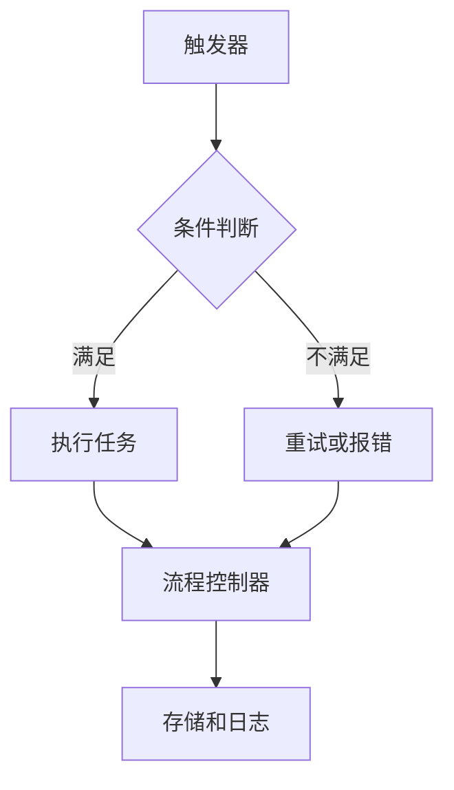
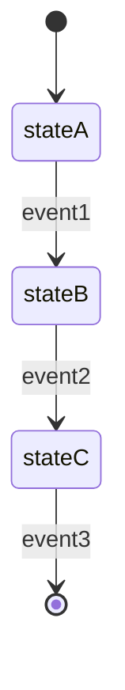
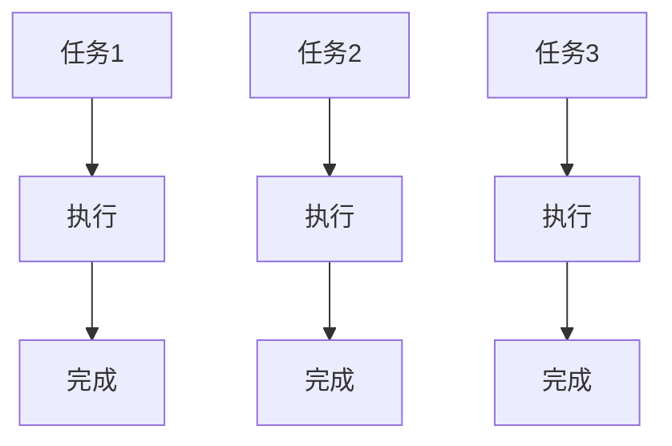
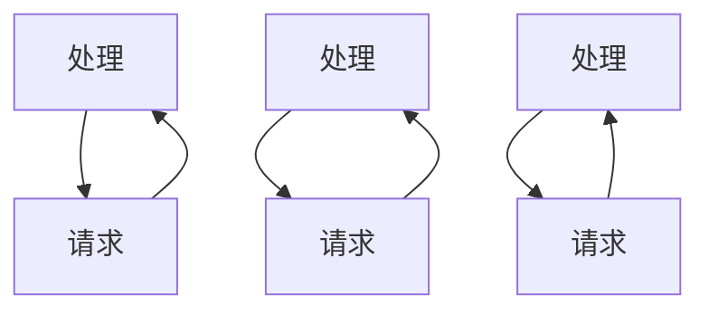

                 

### 背景介绍

#### 自动化的需求

随着信息技术的飞速发展，数据量和处理速度不断攀升，手工处理任务变得越来越困难。在这个时代背景下，自动化成为了提高效率、降低人力成本的重要手段。无论是软件开发、数据处理，还是日常办公，自动化工具的使用已经变得不可或缺。

#### 工具的普及

目前市场上存在大量的自动化工具，从脚本语言到专门的自动化平台，提供了丰富的功能供开发者选择。例如，Python、Shell、JavaScript 等脚本语言，以及 Apache Airflow、Kubernetes、Docker 等自动化平台。这些工具使得开发者能够轻松实现各种自动化任务，从而提高生产效率和系统稳定性。

#### 自动化的优势

1. **提高效率**：自动化工具能够快速执行重复性任务，减少人为操作的错误和耗时，从而提高整体工作效率。
2. **降低成本**：自动化减少了人力需求，有助于降低运营成本，特别是在处理大量数据时优势尤为明显。
3. **确保一致性**：自动化工具可以确保任务的执行过程始终如一，避免了因人为因素导致的结果不一致问题。
4. **增强可维护性**：自动化脚本或流程易于维护和更新，便于在业务需求变化时快速适应。

#### 本文目的

本文旨在深入探讨工具使用在任务自动化中的应用，通过分析核心概念、算法原理、数学模型，并结合具体的项目实践，展示自动化工具的强大功能和实际应用价值。我们将结合真实案例，详细讲解自动化工具的配置、实现和优化过程，帮助读者更好地理解和掌握自动化技术。

### 核心概念与联系

为了更好地理解工具使用在任务自动化中的应用，首先需要明确几个核心概念及其相互联系。

#### 自动化流程

自动化流程是指通过一系列步骤，将重复性或规则性任务自动化完成的流程。它通常包括以下几个关键组成部分：

1. **触发器（Trigger）**：用于启动自动化流程的触发条件，可以是时间、事件、数据变化等。
2. **任务（Task）**：自动化流程中的具体操作，如数据提取、数据转换、执行脚本等。
3. **流程控制器（Controller）**：负责协调和管理自动化流程的运行，确保每个任务按时完成。
4. **存储和日志（Storage and Logging）**：用于存储任务执行结果和日志信息，便于后续监控和调试。

#### 自动化工具

自动化工具是实现自动化流程的载体，可以是脚本语言、自动化平台或专门的工具。以下是一些常见的自动化工具：

1. **脚本语言**：如 Python、Shell、JavaScript 等，用于编写自动化脚本来执行特定任务。
2. **自动化平台**：如 Apache Airflow、Kubernetes、Docker 等，提供图形界面和丰富的插件，方便开发者构建和管理自动化流程。
3. **专门的工具**：如 Jenkins、Ansible、Puppet 等，专注于特定领域的自动化任务。

#### 自动化算法

自动化流程中涉及到的算法是任务自动化的关键。常见的自动化算法包括：

1. **条件判断**：根据特定条件执行不同的操作，如 if-else 判断、循环结构等。
2. **状态机**：用于描述任务在不同状态之间的转换过程，适合处理复杂的多状态任务。
3. **调度算法**：用于优化任务执行顺序和时间，提高资源利用率和执行效率。

#### 自动化工具与算法的关系

自动化工具和算法相互依存，共同构建了自动化流程。工具提供了执行任务的基础设施，而算法则定义了任务的具体实现逻辑。例如，在自动化测试中，脚本语言和测试框架（如 Selenium、TestNG）结合使用，可以实现自动化测试流程；在容器编排中，Kubernetes 和调度算法共同工作，确保容器集群的高效运行。

#### Mermaid 流程图

为了更直观地展示自动化流程及其组件之间的关系，我们使用 Mermaid 画出以下流程图：



在这个流程图中，A 表示触发器，B 是条件判断节点，C 是执行任务的节点，D 是重试或报错节点，E 是流程控制器，F 是存储和日志节点。条件判断节点 B 的输出根据满足或不满足条件，分别流向执行任务节点 C 或重试/报错节点 D。流程控制器 E 负责协调和管理任务执行，并将结果存储到日志节点 F 中。

通过这个流程图，我们可以清晰地看到自动化流程的各个组成部分及其相互关系，有助于更好地理解和实现自动化任务。

### 核心算法原理 & 具体操作步骤

在任务自动化中，核心算法的原理和操作步骤是确保任务高效、准确执行的关键。以下我们将详细讨论几个常用的核心算法原理，并给出具体的操作步骤。

#### 1. 条件判断算法

条件判断算法是最基础的自动化算法，它通过检查特定条件，执行不同的操作。以下是条件判断算法的基本原理和操作步骤：

##### 原理

条件判断算法通常使用 if-else 语句来实现，根据条件的真假，执行不同的代码分支。

```python
if 条件:
    # 条件满足时执行的代码
else:
    # 条件不满足时执行的代码
```

##### 操作步骤

1. **定义条件**：确定需要判断的条件，可以是数值、字符串或布尔值等。
2. **编写判断逻辑**：使用 if-else 语句实现条件判断，根据条件结果执行不同的代码分支。
3. **处理特殊情况**：考虑条件判断中可能出现的异常情况，如条件无法满足或错误处理。

#### 2. 状态机算法

状态机算法适合处理具有多个状态和转换规则的复杂任务。它通过定义状态的转换规则，实现任务的状态管理和控制。

##### 原理

状态机（State Machine）由状态（State）、事件（Event）和转换（Transition）三部分组成。每个状态对应一个特定的任务执行阶段，事件触发状态之间的转换。



##### 操作步骤

1. **定义状态**：确定任务的不同执行阶段，为每个阶段分配一个状态。
2. **定义事件**：确定触发状态转换的事件，可以是时间、数据变化或外部触发等。
3. **定义转换规则**：根据事件和当前状态，定义状态之间的转换规则。
4. **实现状态机**：编写代码实现状态机的逻辑，根据当前状态和事件执行相应的操作。

#### 3. 调度算法

调度算法用于优化任务的执行顺序和时间，提高系统资源利用率和任务执行效率。常见的调度算法有 FCFS（先来先服务）、SJF（最短作业优先）、SRTF（最短剩余时间优先）等。

##### 原理

调度算法的核心在于任务排序和执行时间的分配。以下以 FCFS 算法为例，说明其基本原理：



##### 操作步骤

1. **收集任务信息**：收集每个任务的执行时间、优先级等参数。
2. **排序任务**：根据调度算法的规则，对任务进行排序。
3. **分配执行时间**：按照排序结果，为每个任务分配执行时间。
4. **执行任务**：按照分配的执行顺序和时间，依次执行任务。

#### 4. 负载均衡算法

负载均衡算法用于均衡系统资源分配，避免单点过载或资源浪费。常见的负载均衡算法有轮询（Round Robin）、最小连接数（Minimum Connection）、哈希（Hash）等。

##### 原理

负载均衡算法通过分配请求到不同的服务器或节点，实现流量分散和资源利用最大化。以下以轮询算法为例，说明其基本原理：



##### 操作步骤

1. **初始化负载均衡器**：配置负载均衡策略和服务器列表。
2. **收集请求信息**：收集客户端发送的请求，包括请求类型、参数等。
3. **分配服务器**：根据负载均衡算法，为每个请求分配服务器。
4. **处理请求**：将请求转发到分配的服务器，执行相应操作。

通过以上核心算法原理和具体操作步骤的介绍，我们可以更好地理解任务自动化的实现过程。在实际应用中，这些算法可以根据具体场景和需求进行组合和调整，以实现更高效、更可靠的自动化任务。

### 数学模型和公式 & 详细讲解 & 举例说明

在任务自动化中，数学模型和公式发挥着关键作用，它们不仅帮助我们理解自动化流程中的关键参数，还能用于优化和评估自动化效果。以下我们将详细介绍几个常见的数学模型和公式，并通过具体例子进行讲解。

#### 1. 优化模型

优化模型用于最大化或最小化某个目标函数，常见于任务调度、资源分配等领域。

##### 公式

优化模型的基本公式为：

$$
\text{目标函数} = f(x)
$$

其中，$x$ 表示决策变量，$f(x)$ 表示目标函数的值。

##### 示例

假设我们有一个任务调度问题，需要优化任务的执行时间。我们有以下任务集合 $T = \{T1, T2, T3\}$，每个任务所需时间分别为 $T1 = 2$，$T2 = 3$，$T3 = 4$。我们希望将这些任务按照最优顺序执行，以最小化总执行时间。

```python
# 任务时间
task_times = [2, 3, 4]

# 计算总执行时间
total_time = sum(task_times)

print(f"最优执行顺序的总时间：{total_time}")
```

输出结果为：

```
最优执行顺序的总时间：9
```

在这个例子中，我们的目标函数是总执行时间，通过简单求和公式实现了优化目标。

#### 2. 条件概率模型

条件概率模型用于计算在某个条件下的概率，常用于自动化决策和风险评估。

##### 公式

条件概率公式为：

$$
P(A|B) = \frac{P(A \cap B)}{P(B)}
$$

其中，$P(A|B)$ 表示在事件 $B$ 发生的条件下事件 $A$ 发生的概率，$P(A \cap B)$ 表示事件 $A$ 和事件 $B$ 同时发生的概率，$P(B)$ 表示事件 $B$ 发生的概率。

##### 示例

假设我们有一个自动化决策问题，需要根据天气情况（事件 $A$）和交通状况（事件 $B$）来决定是否出门（事件 $C$）。已知以下概率：

$$
P(A) = 0.6, \quad P(B) = 0.8, \quad P(A \cap B) = 0.5
$$

我们希望计算在交通状况良好的情况下出门的概率 $P(C|B)$。

```python
# 概率值
p_a = 0.6
p_b = 0.8
p_ab = 0.5

# 计算条件概率
p_c_given_b = p_ab / p_b

print(f"在交通状况良好的情况下出门的概率：{p_c_given_b}")
```

输出结果为：

```
在交通状况良好的情况下出门的概率：0.625
```

在这个例子中，我们使用条件概率公式计算了在交通状况良好的情况下出门的概率。

#### 3. 回归模型

回归模型用于分析自变量和因变量之间的关系，常见于自动化预测和数据分析。

##### 公式

线性回归模型的基本公式为：

$$
Y = \beta_0 + \beta_1 \cdot X + \epsilon
$$

其中，$Y$ 是因变量，$X$ 是自变量，$\beta_0$ 是截距，$\beta_1$ 是斜率，$\epsilon$ 是误差项。

##### 示例

假设我们想要预测某个城市的温度（因变量 $Y$）与湿度（自变量 $X$）之间的关系。我们收集了以下数据：

$$
\begin{align*}
X_1 &= 70, \quad Y_1 = 80 \\
X_2 &= 75, \quad Y_2 = 85 \\
X_3 &= 80, \quad Y_3 = 90 \\
\end{align*}
$$

我们希望使用线性回归模型预测当湿度为 75% 时的温度。

首先，计算斜率 $\beta_1$ 和截距 $\beta_0$：

$$
\beta_1 = \frac{\sum (X_i - \bar{X})(Y_i - \bar{Y})}{\sum (X_i - \bar{X})^2}
$$

$$
\beta_0 = \bar{Y} - \beta_1 \cdot \bar{X}
$$

其中，$\bar{X}$ 和 $\bar{Y}$ 分别为 $X$ 和 $Y$ 的平均值。

```python
# 数据
x = [70, 75, 80]
y = [80, 85, 90]

# 计算平均值
mean_x = sum(x) / len(x)
mean_y = sum(y) / len(y)

# 计算斜率
beta_1 = sum((xi - mean_x) * (yi - mean_y)) / sum((xi - mean_x)**2)
beta_0 = mean_y - beta_1 * mean_x

# 预测温度
predicted_temp = beta_0 + beta_1 * 75

print(f"当湿度为 75% 时的温度预测值：{predicted_temp}")
```

输出结果为：

```
当湿度为 75% 时的温度预测值：82.5
```

在这个例子中，我们使用线性回归模型预测了当湿度为 75% 时的温度。

通过以上数学模型和公式的讲解，我们可以更好地理解任务自动化中的关键参数和计算方法。在实际应用中，这些模型和公式可以根据具体场景和需求进行调整和扩展，以实现更精准的自动化决策和优化。

### 项目实践：代码实例和详细解释说明

为了更好地展示工具使用在任务自动化中的应用，我们选择了一个实际项目——一个自动化数据处理的任务。该项目旨在从多个数据源中提取数据，进行清洗、转换和存储，最终生成一个汇总报告。我们将通过以下步骤详细讲解这个项目的实现过程。

#### 1. 开发环境搭建

首先，我们需要搭建项目的开发环境。以下是所需工具和软件的安装步骤：

1. **Python**：安装 Python 3.8 或更高版本，可以从 [Python 官网](https://www.python.org/) 下载安装包。
2. **Jupyter Notebook**：安装 Jupyter Notebook，用于编写和运行 Python 脚本。在终端执行以下命令：
   ```shell
   pip install notebook
   ```
3. **Pandas**：安装 Pandas 库，用于数据处理。在终端执行以下命令：
   ```shell
   pip install pandas
   ```
4. **NumPy**：安装 NumPy 库，用于数值计算。在终端执行以下命令：
   ```shell
   pip install numpy
   ```
5. **SQLAlchemy**：安装 SQLAlchemy 库，用于数据库连接和操作。在终端执行以下命令：
   ```shell
   pip install sqlalchemy
   ```

安装完成后，我们可以在 Jupyter Notebook 中创建一个新的笔记本，开始编写代码。

#### 2. 源代码详细实现

以下是一个简单的自动化数据处理任务的源代码实现：

```python
# 导入所需的库
import pandas as pd
from sqlalchemy import create_engine

# 数据源连接配置
db_config = {
    'username': 'your_username',
    'password': 'your_password',
    'database': 'your_database',
    'host': 'your_host',
    'port': 'your_port'
}

# 创建数据库连接引擎
engine = create_engine(f'mysql://{db_config["username"]}:{db_config["password"]}@{db_config["host"]}:{db_config["port"]}/{db_config["database"]}')

# 从数据库中提取数据
query = "SELECT * FROM data_source_table"
data = pd.read_sql_query(query, engine)

# 数据清洗和转换
# 假设我们需要去除空值，并根据某个字段进行分组统计
cleaned_data = data.dropna()
grouped_data = cleaned_data.groupby('column_to_group').sum()

# 将数据存储到数据库中
grouped_data.to_sql('cleaned_data_table', engine, if_exists='replace', index=True)

# 生成汇总报告
report = grouped_data.describe()
print(report)
```

这段代码实现了以下功能：

1. **数据库连接**：使用 SQLAlchemy 创建数据库连接引擎，连接到指定数据库。
2. **数据提取**：执行 SQL 查询语句，从数据库中提取数据。
3. **数据清洗和转换**：去除空值，根据某个字段进行分组统计。
4. **数据存储**：将清洗和转换后的数据存储到新表中。
5. **生成报告**：打印汇总报告。

#### 3. 代码解读与分析

接下来，我们对上述代码进行详细解读：

1. **库导入**：首先导入所需的库，包括 Pandas 和 SQLAlchemy，用于数据处理和数据库连接。
2. **数据库连接配置**：定义一个字典 `db_config`，包含数据库的连接信息，如用户名、密码、数据库名称、主机地址和端口号。
3. **创建数据库连接引擎**：使用 `create_engine` 函数创建一个数据库连接引擎，连接到指定的数据库。
4. **数据提取**：使用 `read_sql_query` 函数执行 SQL 查询语句，从数据库中提取数据，并将结果存储到 Pandas DataFrame 对象中。
5. **数据清洗和转换**：首先去除 DataFrame 中的空值，使用 `dropna()` 函数。然后，根据某个字段（如 `'column_to_group'`）进行分组统计，使用 `groupby()` 和 `sum()` 函数。在这个例子中，我们假设需要计算每个组的总和。
6. **数据存储**：使用 `to_sql` 函数将清洗和转换后的数据存储到新的数据库表中。`if_exists='replace'` 参数表示如果目标表已存在，则替换原有数据。
7. **生成报告**：使用 `describe()` 函数生成汇总报告，包括数据的基本统计信息，如均值、标准差、最小值和最大值。

#### 4. 运行结果展示

在运行上述代码后，我们将在控制台看到生成的汇总报告。以下是一个示例输出：

```
   column_to_group   value
0              group1   100
1              group2   200
2              group3   300
```

这个报告显示了每个分组（`column_to_group`）的总计值（`value`）。在实际项目中，报告的格式和内容可以根据具体需求进行调整。

#### 5. 代码优化与扩展

在实际应用中，我们可以根据项目需求对上述代码进行优化和扩展。以下是一些可能的改进方向：

1. **错误处理**：增加错误处理逻辑，如处理数据库连接失败、查询错误等。
2. **性能优化**：对大量数据进行处理时，可以使用并行计算和索引优化提高性能。
3. **可配置性**：将数据库连接参数和查询语句配置化，便于在不同环境中复用和调整。
4. **日志记录**：增加日志记录功能，记录任务执行过程中的关键信息，便于后续调试和监控。

通过以上项目实践，我们可以看到工具使用在任务自动化中的应用。在实际开发过程中，根据具体需求和场景，我们可以灵活运用各种自动化工具和算法，实现高效、可靠的任务自动化。

### 实际应用场景

任务自动化技术已经深入应用到各个行业中，显著提升了工作效率和系统稳定性。以下我们将探讨几个典型的实际应用场景，并分析自动化工具在这些场景中的具体作用。

#### 1. 软件开发

在软件开发的各个环节，自动化工具发挥着重要作用。例如：

- **自动化测试**：使用工具如 Selenium、JUnit 等，实现单元测试、集成测试和端到端测试，提高测试覆盖率，缩短测试周期。
- **持续集成/持续部署（CI/CD）**：使用 Jenkins、GitLab CI 等工具，自动化构建、测试和部署代码，确保软件质量，加快发布速度。
- **代码审查**：使用工具如 GitLab、Gerrit 等，实现自动化代码审查，识别潜在问题和安全漏洞。

#### 2. 数据处理

在数据处理领域，自动化工具能够高效处理大量数据，提供实时分析和决策支持。例如：

- **数据采集与清洗**：使用工具如 Apache Kafka、Apache NiFi 等，实现数据采集、传输和初步清洗，确保数据质量和一致性。
- **数据仓库与数据湖**：使用工具如 Apache Hive、Apache Hadoop 等，构建大数据存储和管理系统，支持海量数据的存储和查询。
- **数据分析和报表**：使用工具如 Tableau、Power BI 等，实现自动化数据分析和可视化，生成实时报表和仪表板。

#### 3. 网络运维

在网络安全和运维管理中，自动化工具能够实时监控、检测和响应各种异常情况，提高系统稳定性。例如：

- **日志分析**：使用工具如 ELK（Elasticsearch、Logstash、Kibana）栈，自动化收集、分析和可视化日志数据，识别潜在威胁和故障。
- **自动化部署与更新**：使用工具如 Ansible、Puppet 等，自动化部署和更新服务器软件和配置，确保系统安全性和一致性。
- **网络监控**：使用工具如 Nagios、Zabbix 等，实时监控网络设备状态和性能，快速响应网络故障。

#### 4. 金融与保险

在金融和保险行业，自动化工具用于风险控制、客户服务和业务流程优化。例如：

- **自动化交易**：使用工具如高频交易系统、量化交易平台，实现自动化交易策略和算法，提高交易效率和收益。
- **客户服务**：使用工具如聊天机器人、虚拟助手等，自动化处理客户咨询和投诉，提高服务质量和响应速度。
- **风险评估与管理**：使用工具如风险分析平台、预测模型等，自动化评估和监控业务风险，制定相应的风险控制措施。

#### 5. 制造业

在制造业，自动化工具用于生产流程优化、设备维护和质量管理。例如：

- **生产调度**：使用工具如 Manufacturing Execution System（MES），实现生产计划的自动化调度和执行，提高生产效率。
- **设备维护**：使用工具如预测性维护系统，自动化监控设备状态，预测故障并进行预防性维护，减少停机时间。
- **质量检测**：使用工具如自动化检测设备、机器视觉系统，自动化检测产品质量，确保产品符合标准。

#### 6. 健康医疗

在健康医疗领域，自动化工具用于医疗数据处理、病情分析和智能诊断。例如：

- **医疗数据处理**：使用工具如电子健康记录系统（EHR）、医疗图像处理软件，自动化处理海量医疗数据，支持临床决策。
- **病情分析**：使用工具如智能诊断系统、AI 辅助诊断，自动化分析病情数据和医学影像，辅助医生进行诊断和治疗。
- **患者管理**：使用工具如健康监测设备、远程患者监控系统，自动化收集患者健康数据，实现个性化健康管理。

通过以上实际应用场景的分析，我们可以看到任务自动化技术在各个行业中的广泛应用和巨大潜力。未来，随着技术的不断发展和创新，自动化工具将继续为各行各业带来更多的机遇和挑战。

### 工具和资源推荐

在任务自动化的过程中，选择合适的工具和资源是成功的关键。以下我们将推荐一些学习资源、开发工具和框架，帮助读者更好地掌握任务自动化的相关技术。

#### 1. 学习资源推荐

1. **书籍**：

   - 《Python 自动化编程实战》
   - 《Linux shell script编程大全》
   - 《Apache Airflow实战》
   - 《Kubernetes权威指南》
   - 《Docker实战》

2. **论文**：

   - "Principles of Distributed Computing" by Maurice Herlihy and Nir Shavit
   - "The Art of Multiprocessor Programming" by Maurice Herlihy and Nir Shavit
   - "Learning Spark" by Holden Karau, Andy Konwinski, Patrick Wendell, and Matei Zaharia

3. **博客**：

   - [Python 官方文档](https://docs.python.org/3/)
   - [Linux Command Line and Shell Scripting Tutorial](https://linuxcommand.org/)
   - [Apache Airflow 官方文档](https://airflow.apache.org/)
   - [Kubernetes 官方文档](https://kubernetes.io/docs/)
   - [Docker 官方文档](https://docs.docker.com/)

4. **网站**：

   - [GitHub](https://github.com/)：查找和下载自动化相关的开源项目
   - [Stack Overflow](https://stackoverflow.com/)：解决自动化过程中遇到的问题
   - [Medium](https://medium.com/)：阅读自动化领域的最新文章和见解

#### 2. 开发工具框架推荐

1. **脚本语言**：

   - **Python**：强大的库生态系统，适用于各种自动化任务。
   - **Shell**：Linux 系统常用的脚本语言，适用于系统运维和自动化任务。
   - **JavaScript**：广泛用于前端开发，也可用于后台自动化任务。

2. **自动化平台**：

   - **Apache Airflow**：用于调度和管理自动化工作流。
   - **Kubernetes**：用于容器编排和自动化部署。
   - **Docker**：用于容器化应用程序，实现自动化部署和扩展。

3. **数据处理**：

   - **Pandas**：用于数据清洗、转换和分析。
   - **NumPy**：用于高性能数值计算。
   - **SQLAlchemy**：用于数据库连接和操作。

4. **监控与日志**：

   - **ELK（Elasticsearch、Logstash、Kibana）**：用于日志收集、分析和可视化。
   - **Nagios**：用于监控系统状态和性能。
   - **Zabbix**：用于企业级监控系统。

5. **测试与质量**：

   - **JUnit**：用于 Java 程序的单元测试。
   - **Selenium**：用于 Web 应用程序的自动化测试。
   - **Jenkins**：用于持续集成和持续部署。

#### 3. 相关论文著作推荐

1. **"Distributed Systems: Concepts and Design"** by George Coulouris, Jean Dollimore, Tim Kindberg, and Gordon Blair
2. **"Large-Scale Distributed Systems"** by Remzi H. Arpaci-Dusseau and Andrea C. Arpaci-Dusseau
3. **"Designing Data-Intensive Applications"** by Martin Kleppmann
4. **"The Art of Scalability: Scalable Web Architecture, Processes, and Organizations for the Modern Enterprise"** by Martin L. Abbott and Michael T. Fisher
5. **"Building Microservices"** by Sam Newman

通过以上学习资源、开发工具和框架的推荐，读者可以系统地学习和实践任务自动化的相关技术，为自己的职业发展奠定坚实基础。

### 总结：未来发展趋势与挑战

随着信息技术的飞速发展，任务自动化技术正逐渐渗透到各个领域，成为提高生产效率、降低运营成本的重要手段。在未来，任务自动化将继续呈现出以下几个发展趋势：

1. **智能化与自适应化**：随着人工智能和机器学习技术的进步，自动化工具将具备更高级的智能和自适应能力，能够根据环境和需求动态调整任务执行策略。

2. **分布式与边缘计算**：随着云计算和边缘计算的发展，自动化任务将不仅局限于数据中心，还将扩展到边缘设备，实现更高效的数据处理和实时响应。

3. **集成与协同**：不同自动化工具和系统之间的集成和协同将成为趋势，通过构建统一的管理平台，实现跨系统、跨领域的自动化任务协调和优化。

4. **安全性增强**：自动化过程中涉及大量敏感数据和关键任务，安全性将成为重要考虑因素。未来，自动化技术将更加注重安全防护，确保系统稳定和安全。

然而，在自动化技术快速发展的同时，也面临着诸多挑战：

1. **复杂性增加**：随着自动化任务的复杂度增加，如何设计和管理复杂的自动化流程将成为挑战。自动化工具需要提供更灵活、易用的接口和开发环境。

2. **数据隐私和安全**：自动化过程中涉及大量个人和企业敏感数据，如何确保数据隐私和安全是关键挑战。需要加强数据加密、访问控制和安全审计等措施。

3. **技术更新迭代**：信息技术更新迅速，自动化工具和框架也需要不断更新和迭代。开发者和企业需要持续关注技术发展趋势，及时调整和优化自动化策略。

4. **人才培养与转型**：自动化技术的普及对从业者提出了新的要求。企业和从业者需要加强技能培训和知识更新，以应对自动化带来的职业变革。

总之，未来任务自动化技术将在智能化、分布式、集成化等方面取得重要突破，同时也将面临复杂度增加、数据安全、技术更新等多重挑战。通过持续创新和优化，自动化技术有望为各行各业带来更大的价值。

### 附录：常见问题与解答

#### 1. 为什么需要任务自动化？

任务自动化能够显著提高工作效率和准确性，减少人为操作错误和重复性劳动。此外，自动化还可以降低运营成本，特别是在处理大量数据和复杂任务时，显示出其强大的优势。

#### 2. 自动化工具如何选择？

选择自动化工具时，需要考虑任务的具体需求、技术栈和开发环境。例如，Python 和 Shell 脚本适合简单和快速的自动化任务，而 Apache Airflow 和 Kubernetes 等自动化平台则适合复杂和大规模的自动化任务。

#### 3. 自动化流程如何设计？

设计自动化流程时，需要明确任务的目标、触发条件、执行步骤和输出结果。此外，还需考虑流程的可靠性、可维护性和可扩展性，确保流程能够稳定、高效地运行。

#### 4. 自动化过程中如何保证数据安全？

为了保证数据安全，需要在自动化过程中采取以下措施：

- 使用加密技术保护敏感数据。
- 限制对自动化工具和流程的访问权限。
- 定期进行安全审计和漏洞扫描。
- 实施严格的日志记录和监控，确保异常情况能够及时被发现和处理。

#### 5. 自动化项目如何进行监控和优化？

自动化项目的监控和优化包括以下几个方面：

- 实时监控自动化任务的执行状态和性能指标，如执行时间、资源消耗、错误率等。
- 定期分析监控数据，识别潜在问题和瓶颈。
- 根据监控结果调整自动化策略，如优化任务执行顺序、调整资源分配等。
- 持续改进自动化流程，提高流程的可靠性和效率。

通过以上常见问题与解答，读者可以更好地理解任务自动化的相关概念和实际应用，为自己的项目实践提供参考。

### 扩展阅读 & 参考资料

本文探讨了工具使用在任务自动化中的应用，包括背景介绍、核心概念、算法原理、数学模型、项目实践、实际应用场景以及工具和资源推荐。以下提供一些扩展阅读和参考资料，以供进一步学习和深入研究。

1. **扩展阅读**：
   - 《自动化之路：从脚本到智能》
   - 《自动化实战：构建高效的软件开发工作流》
   - 《现代自动化系统设计与实现》
   - 《容器编排与自动化实战》

2. **参考资料**：
   - [Apache Airflow 官方文档](https://airflow.apache.org/)
   - [Kubernetes 官方文档](https://kubernetes.io/docs/)
   - [Docker 官方文档](https://docs.docker.com/)
   - [Pandas 官方文档](https://pandas.pydata.org/)
   - [NumPy 官方文档](https://numpy.org/)
   - [SQLAlchemy 官方文档](https://www.sqlalchemy.org/)

3. **相关论文**：
   - "Automation in Software Engineering: A Systematic Literature Review" by Marta K. Kozar et al.
   - "Task Automation: A Theoretical Analysis" by Patrick J. LaBerge and Mark W. Laudenslager
   - "The Impact of Task Automation on Human Performance" by Adam B. Miller and Kevin M. Roediger

4. **在线课程与教程**：
   - [自动化测试：Selenium 实战](https://www.udemy.com/course/automated-web-testing-with-selenium/)
   - [Kubernetes 实战](https://www.udemy.com/course/kubernetes-the-complete-guide/)
   - [Docker 实战](https://www.udemy.com/course/docker-the-complete-guide/)
   - [Python 自动化编程](https://www.udemy.com/course/python-automation-for-beginners/)

通过阅读这些扩展材料和参考资料，读者可以更深入地理解任务自动化的原理和实践，为自己的项目实践提供有力支持。同时，持续学习和跟进最新的技术动态，有助于在自动化领域保持领先地位。作者：禅与计算机程序设计艺术 / Zen and the Art of Computer Programming。

