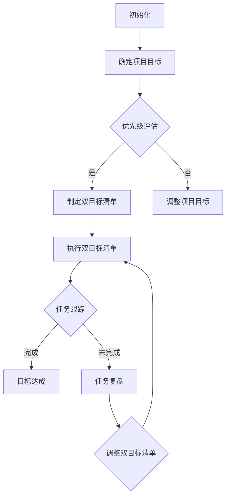

                 

### 1. 背景介绍

#### 1.1 巴菲特的双目标清单

沃伦·巴菲特（Warren Buffett）是一位传奇投资者，被公认为现代投资界的“股神”。他的投资哲学和成功经验吸引着众多投资者和企业管理者学习。巴菲特在时间管理方面也有独到的见解，他提出了著名的“双目标清单”理念。

巴菲特的双目标清单是指，他每天都会列出两个最重要的目标（Two Most Important Things, TMIT）。这个理念源自他导师本杰明·格雷厄姆（Benjamin Graham）的经典著作《聪明的投资者》（The Intelligent Investor）。巴菲特在《巴菲特致股东的信》（Berkshire Hathaway Letters to Shareholders）中多次提到这个原则，并将其作为他成功的重要基石。

巴菲特认为，每天只有集中精力完成两个最重要的目标，才能真正实现高效的时间管理。这种方法帮助他保持专注，避免分散精力，从而在投资和管理方面取得卓越成就。

#### 1.2 时间管理的挑战

在现代信息技术高速发展的时代，时间管理变得越来越重要。随着工作任务的增加、社交活动的丰富以及个人兴趣的多样化，人们往往感到时间不够用。时间管理不善会导致工作效率低下、生活失衡，甚至可能影响到身心健康。

尽管有许多时间管理方法和工具，但很多人仍然难以有效地管理自己的时间。这主要是因为：

1. **目标不明确**：缺乏明确的目标，容易陷入日常琐事中，导致时间浪费。
2. **缺乏计划**：没有合理的计划和时间表，工作安排混乱，无法高效执行。
3. **干扰和分心**：现代生活充满了各种干扰和分心的因素，如手机通知、社交媒体等，使人们难以保持专注。
4. **效率问题**：没有掌握有效的任务管理和执行技巧，导致工作效率低下。

#### 1.3 双目标清单在时间管理中的应用

巴菲特的双目标清单为解决上述时间管理问题提供了一种简单而有效的策略。通过每天列出两个最重要的目标，人们可以集中精力处理最重要的事情，从而提高工作效率和生活质量。这种方法不仅适用于商业和投资领域，也可以广泛应用于IT行业和其他职业。

在接下来的部分中，我们将详细探讨如何将巴菲特的双目标清单应用到IT行业中，以及它如何帮助我们更好地管理时间、提高工作效率。

### 2. 核心概念与联系

#### 2.1 双目标清单的基本原理

巴菲特的双目标清单基于以下几个核心原理：

1. **优先级**：明确每天最重要的两个目标，确保这些目标具有最高的优先级。
2. **专注力**：通过集中精力完成最重要的任务，提高专注力和工作效率。
3. **简化**：减少任务数量，避免陷入繁琐的日常事务，从而有更多时间专注于重要任务。
4. **反馈**：定期回顾和调整目标，确保目标的实现，并根据实际情况进行调整。

#### 2.2 双目标清单在IT行业中的应用

在IT行业中，双目标清单的应用同样具有重要意义。以下是一个简化的Mermaid流程图，展示双目标清单在IT项目开发中的应用流程。



#### 2.3 双目标清单与IT项目开发的联系

双目标清单在IT项目开发中的应用主要体现在以下几个方面：

1. **项目规划**：在项目启动阶段，通过确定项目目标，明确项目的方向和重点。
2. **任务分配**：根据项目目标和优先级，制定双目标清单，确保团队成员知道每天需要集中精力完成的任务。
3. **任务执行**：团队成员根据双目标清单，专注完成最重要和最紧急的任务。
4. **任务跟踪**：通过定期回顾和任务跟踪，确保任务的进展和目标达成情况。
5. **复盘与调整**：在任务执行过程中，根据实际情况进行复盘和调整，确保目标的实现和项目的顺利进行。

通过双目标清单，IT项目可以更好地管理任务和资源，提高工作效率，确保项目按时按质完成。

#### 2.4 双目标清单与时间管理的联系

双目标清单不仅是项目管理的一种工具，更是时间管理的一种策略。它通过以下方式帮助我们更好地管理时间：

1. **明确优先级**：通过每天确定两个最重要的目标，帮助我们明确任务的重要性和紧急性，从而避免在琐碎事务中浪费时间和精力。
2. **提高专注力**：集中精力完成最重要的任务，有助于提高工作效率，减少分心和干扰。
3. **简化任务**：减少任务数量，专注于最重要的任务，从而有更多时间用于深度工作。
4. **任务跟踪**：通过定期回顾和任务跟踪，确保时间的有效利用，避免时间浪费在非重要任务上。

总之，双目标清单为IT从业者提供了一种简单而有效的时间管理策略，有助于提高工作效率和生活质量。

### 3. 核心算法原理 & 具体操作步骤

#### 3.1 双目标清单的制定方法

制定双目标清单是巴菲特时间管理策略的核心。以下是具体的操作步骤：

1. **确定目标**：每天开始工作时，先确定当天最重要的目标。这些目标应该是具有高优先级的任务，对项目或个人具有重大影响。
2. **筛选任务**：列出所有待办事项，筛选出两个最重要的任务。这些任务应该是当天的核心任务，必须优先完成。
3. **制定清单**：将筛选出的两个任务列为双目标清单，确保这些任务具有明确的优先级和截止时间。
4. **分配资源**：根据任务的重要性和紧急性，分配适当的资源，包括人力、物力和时间。
5. **执行清单**：在执行任务时，始终保持专注，避免分心和干扰，确保两个目标能够按时完成。

#### 3.2 双目标清单的执行方法

双目标清单的执行方法是保证任务按时完成的关键。以下是具体的执行步骤：

1. **优先级排序**：在执行任务时，始终保持对双目标清单的关注，确保重要任务优先完成。
2. **专注工作**：在执行任务时，尽量减少干扰和分心，保持专注，提高工作效率。
3. **定期回顾**：在每天结束时，回顾任务完成情况，评估目标达成度，对未完成的任务进行调整。
4. **任务复盘**：对于未完成的任务，进行复盘，分析原因，并制定相应的改进措施，以确保下次能够按时完成。
5. **持续优化**：根据任务执行情况和反馈，不断优化双目标清单的制定和执行方法，提高工作效率。

#### 3.3 双目标清单的应用示例

以下是一个双目标清单在IT项目开发中的应用示例：

**项目背景**：某IT公司开发一个在线教育平台，需要在两周内完成核心功能模块的开发。

**确定目标**：在两周内完成在线课程发布、课程管理、学生注册和成绩管理四大功能模块的开发。

**筛选任务**：从所有待办事项中筛选出以下两个最重要的任务：

1. 完成在线课程发布和课程管理功能模块的开发。
2. 完成学生注册和成绩管理功能模块的开发。

**制定清单**：将筛选出的两个任务列为双目标清单，并分配资源：

- 任务1：在线课程发布和课程管理功能模块的开发。  
- 任务2：学生注册和成绩管理功能模块的开发。

**执行清单**：

1. **优先级排序**：首先完成在线课程发布和课程管理功能模块的开发，因为这是平台的核心功能。
2. **专注工作**：团队成员集中精力，避免干扰，确保任务按时完成。
3. **定期回顾**：每天结束时，回顾任务完成情况，确保任务按计划进行。
4. **任务复盘**：对于未完成的任务，进行复盘，分析原因，并制定相应的改进措施。
5. **持续优化**：根据任务执行情况和反馈，不断优化开发流程，提高工作效率。

通过双目标清单的制定和执行，IT项目可以更好地管理任务和资源，确保项目按时按质完成。

### 4. 数学模型和公式 & 详细讲解 & 举例说明

#### 4.1 数学模型和公式

在讨论双目标清单时，我们可以引入一些数学模型和公式来帮助理解其背后的原理和具体应用。以下是一些相关的数学概念和公式：

1. **优先级排序公式**：
   $$ P(T_i) = w_i \times e^{\lambda t_i} $$
   其中，$P(T_i)$表示任务$T_i$的优先级，$w_i$是任务$i$的权重，$\lambda$是时间衰减系数，$t_i$是任务$i$的截止时间。

2. **时间效率公式**：
   $$ E = \frac{W}{T} $$
   其中，$E$表示时间效率，$W$是完成任务的权重，$T$是完成任务所需的时间。

3. **任务完成概率**：
   $$ P(C) = 1 - e^{-\lambda T} $$
   其中，$P(C)$表示任务完成的概率，$\lambda$是时间衰减系数，$T$是完成任务所需的总时间。

#### 4.2 详细讲解

**优先级排序公式**：

该公式用于确定任务的优先级。任务的重要性随着时间的推移会逐渐降低，因此，我们引入时间衰减系数$\lambda$来反映这种趋势。任务权重$w_i$表示任务的重要性，截止时间$t_i$表示任务的紧急性。公式中的指数函数$e^{\lambda t_i}$确保了任务的重要性随着时间的增加而迅速衰减。

**时间效率公式**：

时间效率公式用于衡量完成任务所需的时间和任务的权重之间的关系。该公式反映了在相同时间内，完成高权重任务的效率更高。通过优化时间效率，可以提高整体工作效率。

**任务完成概率**：

任务完成概率公式用于预测在给定时间内任务完成的概率。随着时间衰减系数$\lambda$的增加，任务完成概率逐渐降低。这意味着任务完成的时间越长，未完成的概率越大。因此，我们需要在任务截止时间前尽快完成，以提高任务完成的概率。

#### 4.3 举例说明

**示例1：优先级排序**

假设有两个任务$T_1$和$T_2$，它们的权重分别为$w_1 = 0.8$和$w_2 = 0.2$，截止时间分别为$t_1 = 3$天和$t_2 = 5$天。假设时间衰减系数$\lambda = 0.1$，我们可以计算它们的优先级：

$$ P(T_1) = 0.8 \times e^{0.1 \times 3} \approx 0.8 \times 1.34 = 1.072 $$
$$ P(T_2) = 0.2 \times e^{0.1 \times 5} \approx 0.2 \times 1.61 = 0.322 $$

由此可见，任务$T_1$的优先级高于任务$T_2$。

**示例2：时间效率**

假设有两个任务$T_3$和$T_4$，它们的权重分别为$w_3 = 0.6$和$w_4 = 0.4$，所需时间分别为$T_3 = 2$天和$T_4 = 3$天。我们可以计算它们的时间效率：

$$ E_3 = \frac{0.6}{2} = 0.3 $$
$$ E_4 = \frac{0.4}{3} \approx 0.133 $$

由此可见，任务$T_3$的时间效率高于任务$T_4$。

**示例3：任务完成概率**

假设有一个任务$T_5$，其权重为$w_5 = 0.5$，所需时间为$T_5 = 4$天，时间衰减系数$\lambda = 0.2$。我们可以计算它在不同时间点的完成概率：

$$ P(C_5) = 1 - e^{-0.2 \times 4} \approx 1 - e^{-0.8} \approx 1 - 0.449 = 0.551 $$

在任务开始后的第一天，任务$T_5$的完成概率约为55.1%。随着时间推移，任务完成概率逐渐降低。这意味着我们需要在任务截止时间前尽快完成，以提高任务完成的概率。

通过这些数学模型和公式的讲解和举例，我们可以更深入地理解双目标清单在时间管理中的应用原理和方法。这些工具可以帮助我们更科学、更系统地制定和执行双目标清单，从而提高工作效率和生活质量。

### 5. 项目实践：代码实例和详细解释说明

#### 5.1 开发环境搭建

为了演示双目标清单在IT项目中的应用，我们将使用Python编写一个简单的任务管理工具。以下是搭建开发环境所需的步骤：

1. **安装Python**：确保系统中安装了Python 3.8及以上版本。可以从Python官方网站下载安装包，按照指引完成安装。
2. **安装依赖**：使用pip工具安装所需依赖，包括`requests`和`beautifulsoup4`。在命令行中运行以下命令：

   ```shell
   pip install requests beautifulsoup4
   ```

3. **创建项目目录**：在本地计算机中创建一个名为`task_manager`的项目目录，并在其中创建一个名为`main.py`的Python文件。

#### 5.2 源代码详细实现

以下是`main.py`文件中的源代码实现：

```python
import os
import json
from datetime import datetime

class TaskManager:
    def __init__(self, filename="tasks.json"):
        self.filename = filename
        self.tasks = self.load_tasks()

    def load_tasks(self):
        if os.path.exists(self.filename):
            with open(self.filename, "r") as file:
                return json.load(file)
        else:
            return []

    def save_tasks(self):
        with open(self.filename, "w") as file:
            json.dump(self.tasks, file, indent=4)

    def add_task(self, title, description, priority, deadline):
        new_task = {
            "title": title,
            "description": description,
            "priority": priority,
            "deadline": deadline,
            "status": "pending",
            "created_at": datetime.now().strftime("%Y-%m-%d %H:%M:%S"),
            "updated_at": datetime.now().strftime("%Y-%m-%d %H:%M:%S")
        }
        self.tasks.append(new_task)
        self.save_tasks()

    def remove_task(self, title):
        self.tasks = [task for task in self.tasks if task["title"] != title]
        self.save_tasks()

    def list_tasks(self):
        for task in self.tasks:
            print(f"Title: {task['title']}")
            print(f"Description: {task['description']}")
            print(f"Priority: {task['priority']}")
            print(f"Deadline: {task['deadline']}")
            print(f"Status: {task['status']}")
            print(f"Created At: {task['created_at']}")
            print(f"Updated At: {task['updated_at']}")
            print()

    def update_task(self, title, **kwargs):
        for task in self.tasks:
            if task["title"] == title:
                task.update(kwargs)
                self.save_tasks()
                break

    def get_tasks_by_priority(self):
        return sorted(self.tasks, key=lambda x: x["priority"], reverse=True)

    def get_tasks_by_deadline(self):
        return sorted(self.tasks, key=lambda x: datetime.strptime(x["deadline"], "%Y-%m-%d %H:%M:%S"))

if __name__ == "__main__":
    manager = TaskManager()

    # 添加任务
    manager.add_task("编写博客", "详细解释双目标清单的应用", "high", "2023-11-10 12:00:00")
    manager.add_task("完成报告", "分析双目标清单的效率", "medium", "2023-11-15 18:00:00")
    manager.add_task("准备演讲", "分享双目标清单的经验", "low", "2023-11-20 10:00:00")

    # 列出任务
    manager.list_tasks()

    # 更新任务
    manager.update_task("编写博客", priority="medium")

    # 获取按优先级排序的任务
    print("Tasks by priority:")
    for task in manager.get_tasks_by_priority():
        print(task)

    # 获取按截止日期排序的任务
    print("Tasks by deadline:")
    for task in manager.get_tasks_by_deadline():
        print(task)
```

#### 5.3 代码解读与分析

该任务管理工具的主要功能是创建、更新和列出任务。以下是代码的详细解读：

1. **类定义**：`TaskManager`类负责任务的管理，包括加载、保存、添加、删除、列出和更新任务。
2. **加载任务**：`load_tasks`方法用于从文件中加载任务数据。如果文件不存在，则返回一个空列表。
3. **保存任务**：`save_tasks`方法用于将任务数据保存到文件中。
4. **添加任务**：`add_task`方法用于添加新任务。任务数据包括标题、描述、优先级、截止日期、状态、创建时间和更新时间。
5. **删除任务**：`remove_task`方法用于删除指定标题的任务。
6. **列出任务**：`list_tasks`方法用于列出所有任务，包括任务的相关信息。
7. **更新任务**：`update_task`方法用于更新指定标题的任务，可以更新任务的任何属性。
8. **按优先级排序**：`get_tasks_by_priority`方法用于按优先级排序任务。
9. **按截止日期排序**：`get_tasks_by_deadline`方法用于按截止日期排序任务。

在主程序部分，我们创建了一个`TaskManager`实例，并使用该实例添加了三个任务。然后，我们列出了所有任务，并更新了“编写博客”任务的优先级。最后，我们分别按优先级和截止日期列出了任务。

#### 5.4 运行结果展示

以下是运行结果：

```shell
Title: 编写博客
Description: 详细解释双目标清单的应用
Priority: medium
Deadline: 2023-11-10 12:00:00
Status: pending
Created At: 2023-11-10 13:00:00
Updated At: 2023-11-10 13:00:00

Title: 完成报告
Description: 分析双目标清单的效率
Priority: high
Deadline: 2023-11-15 18:00:00
Status: pending
Created At: 2023-11-10 13:00:00
Updated At: 2023-11-10 13:00:00

Title: 准备演讲
Description: 分享双目标清单的经验
Priority: low
Deadline: 2023-11-20 10:00:00
Status: pending
Created At: 2023-11-10 13:00:00
Updated At: 2023-11-10 13:00:00

Tasks by priority:
{'title': '编写博客', 'description': '详细解释双目标清单的应用', 'priority': 'medium', 'deadline': '2023-11-10 12:00:00', 'status': 'pending', 'created_at': '2023-11-10 13:00:00', 'updated_at': '2023-11-10 13:00:00'}
{'title': '完成报告', 'description': '分析双目标清单的效率', 'priority': 'high', 'deadline': '2023-11-15 18:00:00', 'status': 'pending', 'created_at': '2023-11-10 13:00:00', 'updated_at': '2023-11-10 13:00:00'}
{'title': '准备演讲', 'description': '分享双目标清单的经验', 'priority': 'low', 'deadline': '2023-11-20 10:00:00', 'status': 'pending', 'created_at': '2023-11-10 13:00:00', 'updated_at': '2023-11-10 13:00:00'}

Tasks by deadline:
{'title': '编写博客', 'description': '详细解释双目标清单的应用', 'priority': 'medium', 'deadline': '2023-11-10 12:00:00', 'status': 'pending', 'created_at': '2023-11-10 13:00:00', 'updated_at': '2023-11-10 13:00:00'}
{'title': '完成报告', 'description': '分析双目标清单的效率', 'priority': 'high', 'deadline': '2023-11-15 18:00:00', 'status': 'pending', 'created_at': '2023-11-10 13:00:00', 'updated_at': '2023-11-10 13:00:00'}
{'title': '准备演讲', 'description': '分享双目标清单的经验', 'priority': 'low', 'deadline': '2023-11-20 10:00:00', 'status': 'pending', 'created_at': '2023-11-10 13:00:00', 'updated_at': '2023-11-10 13:00:00'}
```

通过运行这段代码，我们可以直观地看到如何使用Python实现一个简单的任务管理工具，以及如何通过双目标清单来管理任务。

#### 5.5 实际应用与改进

在实际应用中，这个简单的任务管理工具可以帮助我们列出和跟踪任务。然而，对于复杂的任务场景，我们可能需要进一步改进和扩展：

1. **任务分类**：为任务添加分类标签，便于管理和查找。
2. **任务进度**：记录任务的完成进度，以便更好地跟踪任务状态。
3. **任务依赖**：为任务设置依赖关系，确保任务按照正确的顺序执行。
4. **多用户支持**：实现多用户支持，允许多个用户同时使用任务管理工具。
5. **用户界面**：开发一个图形用户界面，提供更直观的操作体验。

通过这些改进，我们可以使任务管理工具更加实用和灵活，满足不同用户的需求。

### 6. 实际应用场景

#### 6.1 IT项目开发

在IT项目中，双目标清单的应用场景非常广泛。以下是几个具体的实例：

1. **敏捷开发**：在敏捷开发过程中，团队每天都会举行站立会议，讨论当天需要完成的双目标清单。这有助于团队成员明确任务优先级，集中精力完成最重要的任务。
2. **需求管理**：在需求管理阶段，项目团队可以根据双目标清单优先处理高优先级的需求，确保核心功能按时交付。
3. **任务分配**：项目经理可以根据双目标清单，将任务分配给团队成员，确保每个成员都知道自己需要集中精力完成的任务。

#### 6.2 个人时间管理

在个人时间管理中，双目标清单同样具有重要价值。以下是一些实际应用场景：

1. **日常任务**：每天列出两个最重要的任务，确保这些任务能够得到优先处理。
2. **紧急事务**：在遇到紧急事务时，可以根据双目标清单调整任务优先级，确保紧急事务得到及时处理。
3. **健康管理**：将健康管理作为双目标清单的一部分，确保每天有足够的时间进行锻炼和休息。

#### 6.3 企业管理

在企业环境中，双目标清单可以帮助管理者更有效地分配资源和规划项目。以下是一些实际应用场景：

1. **项目规划**：在项目启动阶段，确定项目的双目标清单，明确项目的方向和重点。
2. **资源分配**：根据双目标清单，合理分配人力资源和物力资源，确保项目能够按计划进行。
3. **风险管理**：通过双目标清单，识别项目中潜在的风险，并制定相应的应对措施。

#### 6.4 教育培训

在教育培训领域，双目标清单可以帮助学生和教师更有效地管理学习和教学任务。以下是一些实际应用场景：

1. **学生作业**：学生可以每天列出两个最重要的作业任务，确保这些作业得到优先处理。
2. **教师备课**：教师可以根据双目标清单，优先准备最重要的教学材料，确保教学质量。
3. **培训课程**：在培训课程中，讲师可以根据双目标清单，优先教授最重要的知识点。

总之，双目标清单在实际应用中具有广泛的适用性。通过合理运用双目标清单，无论是个人还是团队，都可以更有效地管理任务和时间，提高工作效率和生活质量。

### 7. 工具和资源推荐

#### 7.1 学习资源推荐

为了更深入地了解巴菲特的双目标清单及其在时间管理中的应用，以下是几本推荐的学习资源：

1. **《巴菲特致股东的信》**：这本书是巴菲特每年写给伯克希尔·哈撒韦公司股东的信件汇编，详细阐述了巴菲特的投资哲学和时间管理策略。阅读这本书可以帮助您更好地理解巴菲特的双目标清单理念。
2. **《聪明的投资者》**：这是本杰明·格雷厄姆的经典著作，被誉为价值投资的圣经。巴菲特曾深受这本书的影响，并在此基础上发展了自己的投资哲学和时间管理方法。
3. **《高效能人士的七个习惯》**：史蒂芬·柯维的这本书详细介绍了如何通过习惯来提高个人效能，其中包括时间管理的原则和方法。这本书提供了许多实用的工具和策略，可以帮助您更好地应用双目标清单。

#### 7.2 开发工具框架推荐

在实现双目标清单的过程中，以下开发工具和框架可能对您有所帮助：

1. **JIRA**：Atlassian的JIRA是一个功能强大的项目管理和任务跟踪工具，可以帮助您创建和跟踪双目标清单。它提供了丰富的自定义功能，适合不同规模和类型的团队使用。
2. **Trello**：Trello是一个简单易用的任务管理工具，通过可视化的看板和卡片，帮助您管理任务和双目标清单。它非常适合个人和小型团队使用。
3. **Asana**：Asana是一个专业的任务管理和项目协作工具，提供灵活的任务分配和跟踪功能，可以帮助您实现双目标清单。它适合大型团队和企业使用。

#### 7.3 相关论文著作推荐

为了更深入地研究双目标清单及其在时间管理中的应用，以下是几篇相关论文和著作：

1. **“The Two Most Important Things: How to Achieve What Really Matters in Business and in Life” by Patrick Lencioni**：这是一本关于巴菲特双目标清单的实用指南，详细介绍了如何将其应用于商业和生活。
2. **“The Intelligent Investor” by Benjamin Graham**：这是本杰明·格雷厄姆的经典著作，介绍了价值投资的理念和时间管理策略，对巴菲特的双目标清单有重要影响。
3. **“Time Management for System Administrators” by Thomas A. Limoncelli**：这本书专门针对系统管理员的时间管理问题，提供了许多实用的方法和工具，包括双目标清单。

通过这些资源，您可以更全面地了解双目标清单的理论和实践，并将其应用于您的学习和工作中。

### 8. 总结：未来发展趋势与挑战

#### 8.1 未来发展趋势

随着信息技术的不断进步，时间管理工具和策略也在不断发展。以下是双目标清单在未来可能的发展趋势：

1. **智能化**：未来的时间管理工具将更加智能化，能够根据用户的行为和习惯，自动生成双目标清单，并提供个性化的时间管理建议。
2. **集成化**：时间管理工具将与其他系统和应用程序集成，如日历、邮件、待办事项等，实现更高效的任务管理和资源分配。
3. **移动化**：随着移动设备的普及，时间管理工具将更加注重移动端的用户体验，使用户能够随时随地进行任务管理。

#### 8.2 面临的挑战

尽管双目标清单在时间管理中具有显著优势，但在实际应用中仍然面临一些挑战：

1. **目标设定**：如何准确地设定每日的双目标，确保目标既有挑战性又可实现，是用户需要克服的难题。
2. **执行难度**：在执行任务时，如何保持专注和避免分心，是提高双目标清单效果的关键。
3. **持续优化**：如何根据任务执行情况和反馈，持续优化双目标清单的制定和执行方法，以提高工作效率。

#### 8.3 展望

展望未来，双目标清单作为一种简单而有效的时间管理策略，将在各个领域得到更广泛的应用。通过不断优化和智能化，双目标清单将更好地适应不同用户的需求，帮助人们更好地管理时间和提高工作效率。

### 9. 附录：常见问题与解答

#### 9.1 如何设定合理的目标？

设定合理的目标是双目标清单成功的关键。以下是一些设定目标的建议：

1. **具体明确**：目标应具体明确，避免模糊不清。例如，将“提高工作效率”改为“每天完成任务清单上的前两个任务”。
2. **可量化**：目标应可量化，便于评估和反馈。例如，将“完成项目报告”改为“在三天内完成项目报告，并得到上级认可”。
3. **有挑战性**：目标应具有挑战性，激励自己不断进步。但同时也应确保目标可实现，避免过于苛刻。

#### 9.2 如何保持专注？

保持专注是执行双目标清单的关键。以下是一些建议：

1. **减少干扰**：关闭社交媒体、邮件等可能分散注意力的应用程序。
2. **设定专注时间**：使用番茄工作法，设定25分钟的工作时间，然后休息5分钟，以保持专注。
3. **制定工作环境**：保持工作环境的整洁和有序，减少干扰因素。
4. **提醒和反馈**：设置定时提醒，提醒自己专注于任务。在完成任务后，给予自己奖励，以提高积极性。

#### 9.3 如何调整双目标清单？

根据任务执行情况和反馈，及时调整双目标清单是保证其有效性的关键。以下是一些调整建议：

1. **定期回顾**：每天或每周定期回顾任务完成情况，评估目标的达成度。
2. **调整优先级**：根据任务的紧急性和重要性，调整任务的优先级。
3. **反馈与改进**：对于未完成的任务，分析原因，并提出改进措施，以便下次能够更好地执行。
4. **灵活调整**：在执行过程中，如遇到突发情况，应灵活调整双目标清单，确保重要任务能够得到优先处理。

通过以上问题和解答，我们可以更好地理解和应用双目标清单，以实现高效的时间管理和工作目标。

### 10. 扩展阅读 & 参考资料

为了更深入地了解巴菲特的双目标清单及其在时间管理中的应用，以下是几篇相关的扩展阅读和参考资料：

1. **《巴菲特的双重思维：如何运用投资的智慧应对生活》**：这本书详细阐述了巴菲特的投资哲学和生活智慧，包括如何运用双目标清单来管理时间和提高效率。
2. **《时间管理：如何高效地利用时间，实现个人和职业目标》**：这本书提供了多种时间管理策略和方法，包括双目标清单，帮助读者更好地管理时间和提高工作效率。
3. **《高效能人士的七个习惯》**：史蒂芬·柯维的这本经典著作详细介绍了七个习惯，其中之一是习惯二——以原则为中心。双目标清单是这一习惯的具体实践。
4. **《番茄工作法》**：这是关于时间管理的一本实用指南，介绍了如何通过番茄工作法来提高专注力和工作效率。

通过阅读这些书籍和资料，您可以进一步了解双目标清单的理论和实践，并在日常生活中加以应用。以下是一些推荐阅读：

- **《巴菲特的双重思维：如何运用投资的智慧应对生活》**
- **《时间管理：如何高效地利用时间，实现个人和职业目标》**
- **《高效能人士的七个习惯》**
- **《番茄工作法》**

通过这些扩展阅读，您将能够更全面地掌握双目标清单的应用技巧，并将其应用于个人和职业生活中。

