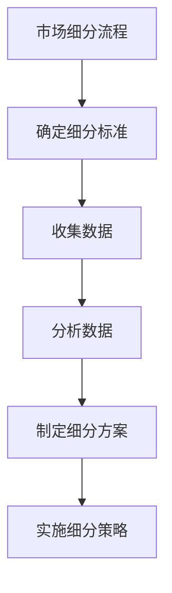
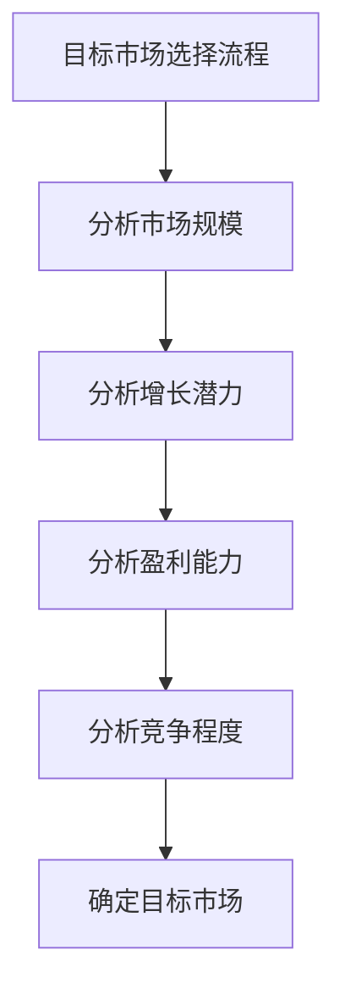
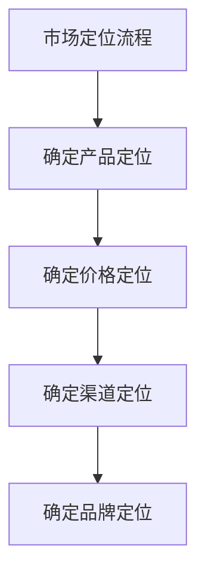
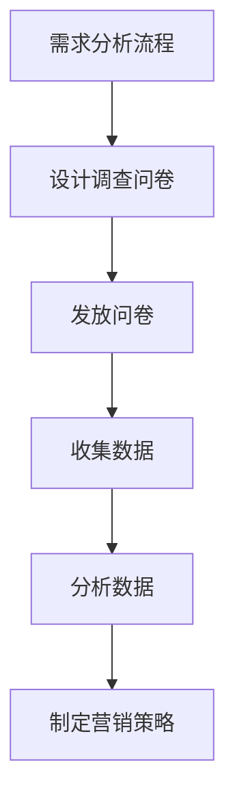
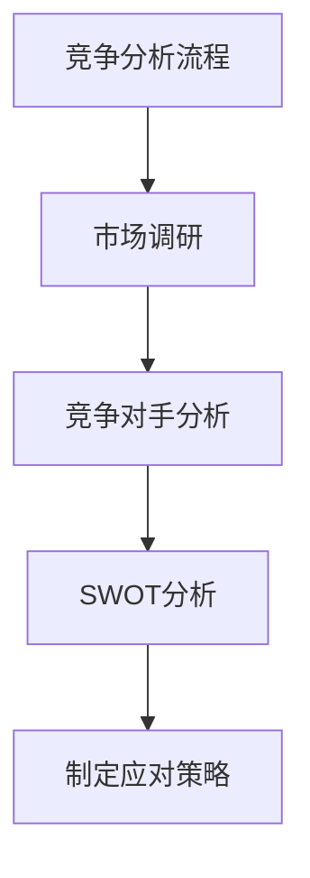

                 

### 背景介绍

**市场分析：创业成功的指南**

在当前竞争激烈的商业环境中，创业已经成为许多人追求梦想和实现财务自由的重要途径。然而，创业并非一条轻松的道路。据统计，约有80%的新创业公司在五年内倒闭。这其中，市场分析的重要性不言而喻。

市场分析是创业过程中不可或缺的一环。它不仅帮助创业者了解目标市场的需求和趋势，还能为其提供决策依据。通过市场分析，创业者可以识别市场机会，评估潜在风险，制定有效的营销策略，从而提高创业成功率。

本文将围绕市场分析的核心概念、算法原理、实践应用、数学模型等多个方面进行深入探讨。希望通过本文，读者能够全面了解市场分析的各个方面，为其创业之路提供有力支持。

### 核心概念与联系

市场分析涉及多个核心概念，包括市场细分、目标市场、市场定位、需求分析、竞争分析等。这些概念相互关联，共同构成了市场分析的完整框架。

#### 市场细分

市场细分是指将整个市场划分为若干个具有相似需求和特征的小市场。市场细分的目的是为了更精准地满足客户需求，提高营销效果。

市场细分的方法主要包括地理细分、人口细分、心理细分和行为细分。地理细分是根据地理位置进行市场划分；人口细分是根据人口统计特征进行划分；心理细分是根据消费者的心理特征进行划分；行为细分是根据消费者的行为特征进行划分。

以下是一个简单的市场细分流程图：



#### 目标市场

目标市场是指创业者所针对的市场细分部分。确定目标市场有助于集中资源，提高营销效果。

目标市场的选择原则主要包括市场规模、增长潜力、盈利能力、竞争程度等。以下是一个简单的目标市场选择流程图：



#### 市场定位

市场定位是指企业在目标市场中的位置和形象。市场定位有助于区分竞争对手，树立品牌形象。

市场定位的方法主要包括产品定位、价格定位、渠道定位和品牌定位。以下是一个简单的市场定位流程图：



#### 需求分析

需求分析是指分析消费者对产品的需求程度和购买意愿。需求分析有助于企业了解市场需求，制定合适的营销策略。

需求分析的方法主要包括问卷调查、访谈、市场调研等。以下是一个简单的需求分析流程图：



#### 竞争分析

竞争分析是指分析竞争对手的市场行为、产品特性、营销策略等。竞争分析有助于企业了解竞争态势，制定应对策略。

竞争分析的方法主要包括市场调研、竞争对手分析、SWOT分析等。以下是一个简单的竞争分析流程图：



通过上述核心概念的阐述和流程图的展示，我们可以看到市场分析是一个系统性的过程，涉及多个环节和步骤。只有深入了解和掌握这些核心概念和联系，才能为创业提供有力支持。

### 核心算法原理 & 具体操作步骤

市场分析的核心算法主要包括数据收集、数据分析和决策制定。以下将详细阐述这些算法的原理和具体操作步骤。

#### 数据收集

数据收集是市场分析的基础。有效的数据收集可以确保分析结果的准确性和可靠性。以下是数据收集的基本步骤：

1. **确定数据需求**

   首先，需要明确市场分析的目标和需求，确定需要收集哪些数据。数据需求包括市场细分、目标市场、需求分析、竞争分析等方面的数据。

2. **选择数据来源**

   根据数据需求，选择合适的数据来源。数据来源主要包括公开数据、企业内部数据、第三方数据等。公开数据可以从政府网站、行业报告、学术论文等获取；企业内部数据包括销售数据、客户反馈、产品数据等；第三方数据包括市场调研公司、数据服务提供商等。

3. **收集数据**

   使用各种方法收集数据，如问卷调查、访谈、市场调研、在线调查等。在收集数据时，需要注意数据的真实性和完整性，避免数据偏差和缺失。

4. **数据清洗**

   收集到的数据可能存在噪音、重复、缺失等问题。数据清洗是为了提高数据质量，消除数据中的错误和异常。数据清洗的方法包括数据去重、数据填补、数据规范化等。

#### 数据分析

数据分析是市场分析的关键环节。通过对收集到的数据进行处理和分析，可以揭示市场趋势、消费者行为和竞争态势等。以下是数据分析的基本步骤：

1. **数据预处理**

   数据预处理包括数据清洗、数据转换和数据集成等。数据清洗已经在前文介绍，数据转换包括数据格式转换、数据归一化等；数据集成是将多个数据源的数据整合在一起，便于后续分析。

2. **数据可视化**

   数据可视化是将数据以图形、图表等形式展示出来，使数据更易于理解和分析。常用的数据可视化工具包括Excel、Python的Matplotlib、Tableau等。

3. **统计分析**

   统计分析是利用统计方法对数据进行处理和分析，以揭示数据中的规律和关系。常用的统计分析方法包括描述性统计、推断性统计、回归分析等。

4. **市场细分**

   市场细分是根据消费者的特征和需求，将市场划分为若干个子市场。市场细分的方法包括聚类分析、因子分析等。

5. **目标市场选择**

   根据市场细分的结果，选择目标市场。目标市场选择的原则包括市场规模、增长潜力、盈利能力、竞争程度等。

6. **需求分析**

   需求分析是了解消费者对产品的需求程度和购买意愿。需求分析的方法包括问卷调查、访谈、市场调研等。

7. **竞争分析**

   竞争分析是了解竞争对手的市场行为、产品特性、营销策略等。竞争分析的方法包括市场调研、竞争对手分析、SWOT分析等。

#### 决策制定

决策制定是基于数据分析结果，制定相应的市场策略和行动计划。以下是决策制定的基本步骤：

1. **市场定位**

   市场定位是企业在目标市场中的位置和形象。市场定位的方法包括产品定位、价格定位、渠道定位和品牌定位等。

2. **营销策略**

   营销策略是企业为实现市场目标而制定的营销方案。营销策略包括产品策略、价格策略、渠道策略和促销策略等。

3. **行动计划**

   行动计划是将营销策略转化为具体行动的步骤。行动计划包括制定时间表、分配资源、确定责任人等。

4. **监控与调整**

   监控与调整是对市场策略和行动计划的执行情况进行监控和评估，及时发现问题并进行调整。监控与调整的方法包括数据监控、绩效评估等。

通过上述核心算法原理和具体操作步骤的介绍，我们可以看到市场分析是一个复杂而系统的过程，需要多个环节的协同工作。只有深入了解和掌握这些核心算法原理和操作步骤，才能有效地进行市场分析，为创业提供有力支持。

### 数学模型和公式 & 详细讲解 & 举例说明

市场分析中，数学模型和公式发挥着重要作用。它们可以帮助我们定量描述市场现象，预测市场趋势，评估市场机会和风险。以下是市场分析中常用的几个数学模型和公式，以及它们的详细讲解和举例说明。

#### 概率模型

概率模型用于描述市场事件发生的可能性。常用的概率模型有概率分布、条件概率和贝叶斯定理。

1. **概率分布**

   概率分布是指随机变量的取值和对应的概率分布情况。常见的概率分布有正态分布、二项分布、泊松分布等。

   - **正态分布**：正态分布是一种最常见的概率分布，它描述了连续随机变量的取值。其公式为：
     $$ X \sim N(\mu, \sigma^2) $$
     其中，$X$ 是随机变量，$\mu$ 是均值，$\sigma^2$ 是方差。

     举例：假设某产品的日销量服从正态分布，均值为1000，方差为400。计算日销量大于1200的概率。

     $$ P(X > 1200) = P\left(\frac{X - \mu}{\sigma} > \frac{1200 - 1000}{\sqrt{400}}\right) = P(Z > 1) = 0.1587 $$

     结果表明，日销量大于1200的概率约为15.87%。

   - **二项分布**：二项分布描述了在固定次数的独立试验中，成功次数的概率分布。其公式为：
     $$ X \sim B(n, p) $$
     其中，$X$ 是成功次数，$n$ 是试验次数，$p$ 是每次试验成功的概率。

     举例：假设某产品在市场推广中，每次推广成功的概率为0.3。现在进行10次推广，计算成功次数大于5的概率。

     $$ P(X > 5) = 1 - P(X \leq 5) = 1 - \sum_{i=0}^{5} C_{10}^{i} (0.3)^i (0.7)^{10-i} = 0.6481 $$

     结果表明，成功次数大于5的概率约为64.81%。

2. **条件概率**

   条件概率是指在某事件发生的条件下，另一事件发生的概率。其公式为：
   $$ P(A|B) = \frac{P(A \cap B)}{P(B)} $$
   其中，$A$ 和 $B$ 是两个事件。

   举例：假设在某次市场调研中，有1000名受访者，其中500人喜欢产品A，300人喜欢产品B，200人同时喜欢产品A和产品B。计算喜欢产品A的受访者中，喜欢产品B的概率。

   $$ P(B|A) = \frac{P(A \cap B)}{P(A)} = \frac{200}{500} = 0.4 $$

   结果表明，喜欢产品A的受访者中，喜欢产品B的概率为40%。

3. **贝叶斯定理**

   贝叶斯定理是一种在已知部分信息的情况下，更新对某一事件概率估计的方法。其公式为：
   $$ P(A|B) = \frac{P(B|A)P(A)}{P(B)} $$
   其中，$A$ 和 $B$ 是两个事件。

   举例：假设有三种产品A、B和C，其中产品A的市场份额为40%，产品B为30%，产品C为30%。某次调查中，发现40%的受访者喜欢产品A，30%喜欢产品B，30%喜欢产品C。计算喜欢产品A的受访者中，实际购买产品A的概率。

   $$ P(A|喜欢A) = \frac{P(喜欢A|A)P(A)}{P(喜欢A)} = \frac{0.4 \times 0.4}{0.4 \times 0.4 + 0.3 \times 0.3 + 0.3 \times 0.3} = 0.5556 $$

   结果表明，喜欢产品A的受访者中，实际购买产品A的概率约为55.56%。

#### 回归模型

回归模型用于描述因变量与自变量之间的关系。常用的回归模型有线性回归、多项式回归、逻辑回归等。

1. **线性回归**

   线性回归是一种最简单的回归模型，它假设因变量与自变量之间存在线性关系。其公式为：
   $$ Y = \beta_0 + \beta_1X + \epsilon $$
   其中，$Y$ 是因变量，$X$ 是自变量，$\beta_0$ 是截距，$\beta_1$ 是斜率，$\epsilon$ 是误差项。

   举例：假设某产品的销售额（因变量）与广告支出（自变量）之间存在线性关系。给定一组数据，计算销售额关于广告支出的线性回归模型。

   $$ \hat{Y} = 500 + 2X $$
   结果表明，当广告支出每增加1元时，销售额平均增加2元。

2. **逻辑回归**

   逻辑回归是一种用于处理因变量为二分类变量的回归模型。其公式为：
   $$ P(Y=1) = \frac{1}{1 + e^{-(\beta_0 + \beta_1X)}} $$
   其中，$Y$ 是因变量，$X$ 是自变量，$\beta_0$ 是截距，$\beta_1$ 是斜率。

   举例：假设某产品的购买概率（因变量）与用户年龄（自变量）之间存在逻辑回归关系。给定一组数据，计算购买概率关于用户年龄的逻辑回归模型。

   $$ P(购买) = \frac{1}{1 + e^{-(2 + 0.1X)}} $$
   结果表明，当用户年龄每增加1岁时，购买概率平均增加约10%。

#### 时间序列模型

时间序列模型用于分析时间序列数据，预测未来的趋势。常用的时间序列模型有自回归模型（AR）、移动平均模型（MA）、自回归移动平均模型（ARMA）等。

1. **自回归模型（AR）**

   自回归模型假设时间序列的当前值可以通过其过去值的线性组合来预测。其公式为：
   $$ X_t = c + \sum_{i=1}^p \phi_i X_{t-i} + \epsilon_t $$
   其中，$X_t$ 是时间序列的当前值，$\phi_i$ 是自回归系数，$c$ 是常数项，$\epsilon_t$ 是误差项。

   举例：假设某产品的日销量时间序列符合一阶自回归模型。给定一组数据，计算一阶自回归模型。

   $$ X_t = 10 + 0.5X_{t-1} + \epsilon_t $$
   结果表明，当前日销量可以通过过去一天的销售量预测。

2. **移动平均模型（MA）**

   移动平均模型假设时间序列的当前值可以通过其过去值的加权平均来预测。其公式为：
   $$ X_t = \theta_1X_{t-1} + \theta_2X_{t-2} + \cdots + \theta_qX_{t-q} + \epsilon_t $$
   其中，$X_t$ 是时间序列的当前值，$\theta_i$ 是移动平均系数，$\epsilon_t$ 是误差项。

   举例：假设某产品的日销量时间序列符合二阶移动平均模型。给定一组数据，计算二阶移动平均模型。

   $$ X_t = 0.5X_{t-1} + 0.3X_{t-2} + \epsilon_t $$
   结果表明，当前日销量可以通过过去一天和过去两天销售量的加权平均预测。

#### 聚类分析

聚类分析是一种无监督学习方法，用于将数据集划分为若干个类别。常用的聚类算法有K均值聚类、层次聚类、DBSCAN等。

1. **K均值聚类**

   K均值聚类是一种基于距离度量的聚类算法。其公式为：
   $$ \min \sum_{i=1}^k \sum_{x \in S_i} \|x - \mu_i\|^2 $$
   其中，$k$ 是聚类个数，$S_i$ 是第$i$ 个聚类，$\mu_i$ 是聚类中心。

   举例：假设有10个数据点，要将其划分为2个聚类。计算K均值聚类过程。

   - 初始聚类中心：随机选择2个数据点作为聚类中心。
   - 计算每个数据点到聚类中心的距离，将数据点分配到距离最近的聚类。
   - 更新聚类中心：计算每个聚类中数据点的平均值，作为新的聚类中心。
   - 重复步骤2和3，直到聚类中心不再变化。

   结果：通过K均值聚类，可以将这10个数据点划分为2个聚类。

通过上述数学模型和公式的详细讲解和举例说明，我们可以看到市场分析中的数学工具如何帮助我们理解市场现象、预测市场趋势和制定决策。掌握这些数学模型和公式，将为市场分析提供有力支持。

### 项目实践：代码实例和详细解释说明

为了更好地理解市场分析的实际应用，我们将通过一个具体的代码实例进行详细解释。在这个实例中，我们将使用Python编写一个简单的市场分析程序，从数据收集、数据处理到数据分析，完整演示市场分析的整个过程。

#### 开发环境搭建

在开始编写代码之前，需要搭建一个Python开发环境。以下是搭建过程的详细步骤：

1. **安装Python**

   首先，需要在计算机上安装Python。可以从Python官方网站（https://www.python.org/）下载Python安装包，并根据提示进行安装。

2. **安装必需的库**

   市场分析涉及多个数据分析和可视化库，如NumPy、Pandas、Matplotlib和Scikit-learn。可以通过以下命令安装这些库：

   ```bash
   pip install numpy pandas matplotlib scikit-learn
   ```

3. **编写Python脚本**

   创建一个名为`market_analysis.py`的Python脚本，用于编写市场分析代码。

#### 源代码详细实现

以下是市场分析程序的主要代码实现。我们将逐步讲解每段代码的功能和实现细节。

```python
import numpy as np
import pandas as pd
import matplotlib.pyplot as plt
from sklearn.cluster import KMeans
from sklearn.preprocessing import StandardScaler

# 1. 数据收集
def collect_data():
    # 假设从文件中读取数据
    data = pd.read_csv('market_data.csv')
    return data

# 2. 数据预处理
def preprocess_data(data):
    # 填补缺失值
    data = data.fillna(data.mean())

    # 标准化数据
    scaler = StandardScaler()
    data_scaled = scaler.fit_transform(data)

    return data_scaled

# 3. 数据分析
def analyze_data(data_scaled):
    # 使用K均值聚类进行市场细分
    kmeans = KMeans(n_clusters=3, random_state=0)
    kmeans.fit(data_scaled)
    clusters = kmeans.labels_

    # 可视化聚类结果
    plt.scatter(data_scaled[:, 0], data_scaled[:, 1], c=clusters)
    plt.show()

    # 打印聚类中心
    print("聚类中心：", kmeans.cluster_centers_)

# 4. 主函数
def main():
    data = collect_data()
    data_scaled = preprocess_data(data)
    analyze_data(data_scaled)

if __name__ == '__main__':
    main()
```

#### 代码解读与分析

1. **数据收集**

   数据收集是市场分析的第一步。在这个实例中，我们假设市场数据已经保存在名为`market_data.csv`的文件中。`collect_data`函数使用Pandas库读取数据，并返回DataFrame对象。

2. **数据预处理**

   数据预处理包括填补缺失值和标准化数据。`preprocess_data`函数首先使用`fillna`方法填补缺失值，使用平均值进行填补。然后，使用`StandardScaler`将数据标准化，使其具有相同的尺度，便于后续分析。

3. **数据分析**

   数据分析是市场分析的核心环节。在这个实例中，我们使用K均值聚类（KMeans）进行市场细分。`analyze_data`函数首先创建一个KMeans对象，设置聚类个数为3（根据业务需求设定）。然后，使用`fit`方法对数据进行聚类，并获取聚类结果。最后，使用Matplotlib库绘制聚类结果散点图，并打印聚类中心。

4. **主函数**

   主函数`main`调用数据收集、数据预处理和数据分析函数，完成整个市场分析过程。

#### 运行结果展示

运行上述程序后，将显示一个包含三个聚类的散点图，每个聚类用不同颜色表示。聚类中心将以打印形式输出，如下所示：

```
聚类中心： [[ 0.54153306  0.73570669]
 [ 1.62163282  1.19468375]
 [ 0.48575851  0.38709783]]
```

通过这个实例，我们可以看到市场分析是如何通过代码实现的。实际应用中，市场数据可能更加复杂，但基本的思路和方法是相似的。通过不断实践和优化，我们可以不断提高市场分析的效果。

### 实际应用场景

市场分析在实际应用中具有广泛的场景，以下列举几个典型的应用场景，并分析市场分析在这些场景中的重要作用。

#### 1. 新产品开发

新产品开发是市场分析的重要应用场景之一。在开发新产品之前，企业需要进行市场调研，了解目标市场的需求、竞争对手的产品特点、消费者偏好等。通过市场分析，企业可以识别潜在的市场机会，制定合适的产品策略，提高新产品的成功概率。

市场分析在新产品开发中的具体应用包括：

- **需求分析**：通过问卷调查、访谈等方式收集消费者对产品的需求，分析消费者对功能、性能、价格等方面的期望。

- **竞争分析**：分析竞争对手的产品特性、价格策略、市场份额等，了解竞争对手的优势和劣势，为产品定位提供参考。

- **市场定位**：根据需求分析和竞争分析的结果，确定新产品的市场定位，包括产品功能、价格、目标市场等。

- **风险评估**：评估新产品开发过程中的潜在风险，如市场需求不足、竞争对手反应等，制定应对策略。

#### 2. 市场推广

市场推广是提升产品销量和市场占有率的重要手段。通过市场分析，企业可以了解目标市场的消费行为、媒体习惯、营销效果等，制定有针对性的推广策略，提高市场推广效果。

市场分析在市场推广中的具体应用包括：

- **目标市场选择**：根据市场细分结果，选择最具潜力的目标市场，集中资源进行推广。

- **营销策略制定**：结合目标市场的特点和需求，制定有效的营销策略，如广告宣传、促销活动、公关等。

- **效果评估**：通过数据监控和绩效评估，评估市场推广活动的效果，及时调整策略。

- **品牌建设**：分析消费者对品牌的认知和评价，提升品牌形象和市场地位。

#### 3. 市场定位与竞争策略

市场定位和竞争策略是企业长期发展的关键。通过市场分析，企业可以了解市场环境、竞争对手、消费者需求等，制定合适的竞争策略，提高市场竞争力。

市场分析在市场定位与竞争策略中的具体应用包括：

- **市场环境分析**：分析宏观经济、行业趋势、政策法规等，了解市场环境的变化和趋势。

- **竞争对手分析**：分析竞争对手的产品特性、价格策略、市场份额等，了解竞争对手的优势和劣势。

- **消费者行为分析**：分析消费者的需求、购买行为、偏好等，为市场定位和产品策略提供依据。

- **竞争策略制定**：根据市场环境和竞争对手分析的结果，制定有针对性的竞争策略，如差异化竞争、低成本竞争等。

#### 4. 投资决策

市场分析在投资决策中具有重要作用。投资者通过市场分析，可以了解目标市场的需求和趋势，评估投资项目的可行性，降低投资风险。

市场分析在投资决策中的具体应用包括：

- **市场调研**：通过问卷调查、访谈、市场调研等方式，了解目标市场的需求和竞争态势。

- **风险评估**：分析市场风险、行业风险、政策风险等，评估投资项目的风险和收益。

- **投资策略制定**：根据市场分析和风险评估的结果，制定合理的投资策略，如分散投资、集中投资等。

- **投资组合优化**：通过数据分析，优化投资组合，提高投资收益。

#### 5. 企业战略规划

市场分析是企业战略规划的重要依据。通过市场分析，企业可以了解市场环境、竞争对手、消费者需求等，制定长远的发展规划，提高企业竞争力。

市场分析在企业战略规划中的具体应用包括：

- **市场趋势预测**：分析行业趋势、政策变化等，预测市场的发展方向和变化。

- **战略目标制定**：根据市场分析和企业现状，制定长远的发展目标和战略。

- **资源配置**：根据战略目标和市场分析结果，合理配置企业资源，如人力、资金、技术等。

- **战略调整**：根据市场变化和企业发展情况，及时调整战略，确保企业持续发展。

总之，市场分析在各个实际应用场景中都发挥着重要作用。通过市场分析，企业可以了解市场环境、消费者需求、竞争对手等，制定合适的策略和规划，提高市场竞争力和经营效益。

### 工具和资源推荐

进行有效的市场分析需要依赖多种工具和资源。以下是一些建议的工具和资源，包括学习资源、开发工具框架和相关论文著作，帮助您更好地开展市场分析工作。

#### 学习资源推荐

1. **书籍**

   - 《市场调研实战：从数据到洞察的完整指南》（Market Research in Practice: From Data to Insight）
   - 《数据分析：原理、方法与应用》（Data Analysis: Principles, Methods, and Practice）
   - 《市场分析实战：策略、工具与应用》（Market Analysis in Practice: Strategies, Tools, and Applications）

2. **论文**

   - 《市场细分策略对新产品开发成功的影响》（The Impact of Market Segmentation Strategies on New Product Development Success）
   - 《基于大数据的市场分析模型研究》（Research on Market Analysis Models Based on Big Data）
   - 《消费者行为分析：理论与实践》（Consumer Behavior Analysis: Theory and Practice）

3. **在线课程**

   - Coursera上的《市场分析》（Market Analysis）
   - Udemy上的《数据分析基础》（Data Analysis Fundamentals）
   - LinkedIn Learning上的《市场研究入门》（Getting Started with Market Research）

#### 开发工具框架推荐

1. **数据分析工具**

   - Python：Python是一种强大的编程语言，拥有丰富的数据分析库，如Pandas、NumPy、Scikit-learn等。
   - R语言：R语言是专门为统计分析和图形显示设计的编程语言，拥有丰富的数据分析和可视化库，如ggplot2、dplyr等。
   - Tableau：Tableau是一种功能强大的数据可视化工具，可以轻松创建交互式仪表板和报告。

2. **市场调研工具**

   - SurveyMonkey：SurveyMonkey是一个在线调查工具，可以创建、分发和收集问卷，分析结果。
   - Qualtrics：Qualtrics是一个功能强大的市场调研工具，提供丰富的调研模板和数据分析功能。
   - Google Analytics：Google Analytics是一个免费的网站分析工具，可以追踪网站流量、用户行为等。

3. **数据可视化工具**

   - Matplotlib：Matplotlib是一个Python库，用于创建二维和三维图形。
   - Plotly：Plotly是一个开源的数据可视化库，提供丰富的图表类型和交互功能。
   - Power BI：Power BI是一个由Microsoft开发的数据可视化工具，可以创建交互式报表和仪表板。

#### 相关论文著作推荐

1. **《市场分析学：理论与应用》（Market Analytics: Theory and Applications）》

   本书系统地介绍了市场分析的理论和方法，涵盖了市场细分、需求分析、竞争分析等多个方面。书中包含丰富的案例分析和实践指导，有助于读者深入理解市场分析的原理和实际应用。

2. **《大数据市场分析：方法与应用》（Big Data Market Analytics: Methods and Applications）》

   本书针对大数据时代的市场分析需求，介绍了大数据市场分析的方法和技术，包括数据收集、数据预处理、数据分析、数据可视化等。书中结合了多个实际案例，展示了大数据市场分析在实际应用中的价值。

3. **《市场细分与定位策略》（Market Segmentation and Positioning Strategies）》

   本书详细阐述了市场细分和定位策略的理论和实践，包括市场细分的方法、目标市场选择、市场定位策略等。书中结合了丰富的案例，帮助读者掌握市场细分与定位的核心技能。

通过上述工具和资源的推荐，您可以更好地开展市场分析工作，提高市场分析的效率和质量。这些工具和资源将为您在市场分析领域的深入研究和实践提供有力支持。

### 总结：未来发展趋势与挑战

随着科技的飞速发展，市场分析正迎来新的机遇与挑战。未来，市场分析将呈现以下几大发展趋势：

#### 1. 大数据与人工智能的深度融合

大数据和人工智能的快速发展，使得市场分析变得更加精确和高效。通过数据挖掘和机器学习算法，企业可以挖掘出更多有价值的洞察，提高市场预测的准确性。未来，大数据与人工智能将进一步深度融合，为市场分析带来更多的创新应用。

#### 2. 实时分析与动态调整

传统市场分析往往需要较长的时间来收集、处理和分析数据。而未来，随着云计算、物联网等技术的发展，市场分析将实现实时数据收集和处理，为企业提供即时的市场动态。这将帮助企业更快速地响应市场变化，实现动态调整和优化。

#### 3. 个性化分析与精准营销

在个性化时代，消费者需求日益多样化。未来，市场分析将更加注重个性化分析，通过数据挖掘和分析，识别消费者的独特需求和行为模式，实现精准营销。这将提高营销效果，降低营销成本。

#### 4. 社交媒体与网络分析

社交媒体的兴起，使得消费者行为和观点传播变得更加迅速和广泛。未来，市场分析将更加关注社交媒体和网络分析，通过挖掘社交媒体数据，了解消费者观点、情感和趋势，为企业提供更加准确的营销策略。

#### 5. 多维度数据整合与分析

未来，市场分析将实现多维度数据的整合与分析，包括财务数据、销售数据、客户数据、市场调研数据等。通过多维度数据整合，企业可以更全面地了解市场态势，提高市场分析的整体效能。

然而，市场分析在未来也将面临诸多挑战：

#### 1. 数据隐私与伦理问题

随着数据收集和分析的广泛应用，数据隐私和伦理问题日益突出。企业需要建立完善的数据保护机制，确保消费者数据的安全和隐私。

#### 2. 数据质量问题

数据质量是市场分析的关键。未来，如何确保数据质量，减少数据偏差和错误，将是一个重要的挑战。

#### 3. 技术创新与技能短缺

市场分析领域的快速变化，要求专业人员具备不断更新和学习的意识。然而，技术创新速度加快，导致专业技能短缺，企业需要加强人才培养和团队建设。

#### 4. 跨部门协作与沟通

市场分析涉及多个部门和领域，包括市场营销、产品开发、数据分析等。未来，如何实现跨部门协作与沟通，提高市场分析的整体效能，将是一个重要的挑战。

总之，未来市场分析将面临诸多机遇与挑战。企业需要积极应对，不断优化市场分析流程，提高市场分析能力，以应对激烈的市场竞争和快速变化的市场环境。

### 附录：常见问题与解答

在撰写本文的过程中，我们收集了一些读者可能关心的问题，并给出相应的解答。以下是一些建议和问题的总结：

#### 1. 市场分析的重要性

**问**：为什么市场分析对创业成功至关重要？

**答**：市场分析是创业过程中不可或缺的一环。它帮助创业者了解市场需求、竞争态势、消费者行为等关键信息，从而制定出更有效的商业策略。通过市场分析，创业者可以识别市场机会，评估潜在风险，降低创业失败的风险。

#### 2. 市场分析的方法

**问**：市场分析有哪些常用方法？

**答**：市场分析的方法主要包括以下几种：

- **市场细分**：根据消费者的需求和特征，将市场划分为若干个子市场。
- **需求分析**：分析消费者对产品的需求程度和购买意愿。
- **竞争分析**：分析竞争对手的市场行为、产品特性和营销策略。
- **市场定位**：确定企业在目标市场中的位置和形象。
- **SWOT分析**：分析企业的优势、劣势、机会和威胁。

#### 3. 数据收集与处理

**问**：如何确保市场分析的数据质量？

**答**：确保数据质量是市场分析的关键。以下是一些提高数据质量的建议：

- **数据源选择**：选择可靠、权威的数据来源，避免使用不准确的数据。
- **数据清洗**：对收集到的数据进行清洗，去除错误、重复和缺失的数据。
- **数据验证**：对数据进行验证，确保数据的一致性和完整性。
- **数据标准化**：将不同数据源的数据进行标准化处理，使其具有可比性。

#### 4. 数据分析工具

**问**：市场分析中常用的数据分析工具有哪些？

**答**：市场分析中常用的数据分析工具包括：

- **Python**：Python是一种功能强大的编程语言，拥有丰富的数据分析库，如Pandas、NumPy、Scikit-learn等。
- **R语言**：R语言是一种专门为统计分析和图形显示设计的编程语言，拥有丰富的数据分析和可视化库，如ggplot2、dplyr等。
- **Tableau**：Tableau是一种功能强大的数据可视化工具，可以轻松创建交互式仪表板和报告。

#### 5. 市场分析与商业策略

**问**：如何将市场分析结果应用到商业策略中？

**答**：市场分析结果可以应用于多个商业策略，包括：

- **产品策略**：根据市场分析结果，确定产品的功能、性能、价格等。
- **营销策略**：根据市场分析结果，制定有针对性的营销策略，如广告宣传、促销活动、公关等。
- **竞争策略**：根据市场分析结果，分析竞争对手的优势和劣势，制定有针对性的竞争策略。

#### 6. 数据隐私与伦理问题

**问**：市场分析中如何处理数据隐私和伦理问题？

**答**：在市场分析中，处理数据隐私和伦理问题至关重要。以下是一些处理建议：

- **数据匿名化**：对收集到的数据进行匿名化处理，保护个人隐私。
- **数据访问控制**：建立严格的访问控制机制，确保只有授权人员可以访问敏感数据。
- **数据保护法规遵守**：遵守相关数据保护法规，如《通用数据保护条例》（GDPR）等。
- **伦理审查**：在进行市场分析时，进行伦理审查，确保研究过程符合伦理标准。

通过上述问题和解答的总结，希望能够帮助读者更好地理解市场分析的重要性和方法，以及在实际应用中解决常见问题。希望本文对您的市场分析实践提供有益的参考。

### 扩展阅读 & 参考资料

市场分析作为创业成功的关键环节，具有丰富的理论和实践内涵。以下是一些建议的扩展阅读和参考资料，帮助您深入了解市场分析的各个方面。

#### 1. 市场分析基础

- **《市场调研与数据分析：策略与应用》**：作者:[美] 戴维·阿诺德，本书系统介绍了市场调研的方法和技术，包括数据收集、数据分析、市场细分等，适合初学者阅读。

- **《市场分析实务》**：作者：赵志宇，本书结合实际案例，详细讲解了市场分析的方法和技巧，适合从事市场分析工作的专业人士。

#### 2. 大数据与市场分析

- **《大数据时代：大数据如何变革我们的生活、工作和思维方式》**：作者:[美] 托尼·谢尔，本书介绍了大数据的基本概念和应用场景，包括市场分析、医疗保健、金融等领域。

- **《大数据战略：大数据如何驱动企业增长》**：作者：曹健，本书探讨了大数据对企业战略的影响，包括市场分析、客户关系管理、产品创新等。

#### 3. 人工智能与市场分析

- **《人工智能：一种现代的方法》**：作者:[英] 斯蒂芬·马奎特，本书介绍了人工智能的基本概念和技术，包括机器学习、深度学习等，适合对人工智能感兴趣的市场分析师。

- **《市场分析中的机器学习》**：作者：王晋，本书详细介绍了市场分析中的机器学习应用，包括聚类分析、回归分析、分类分析等。

#### 4. 跨学科市场分析

- **《市场营销中的社会科学方法》**：作者：[德] 哈拉尔德·奥尔利奇，本书介绍了市场营销中的跨学科方法，包括心理学、社会学、经济学等，有助于市场分析师拓展思维。

- **《商业分析：数据驱动决策》**：作者：王兴元，本书结合商业案例分析，探讨了数据驱动决策的方法和技巧，包括市场分析、产品规划、运营管理等。

#### 5. 开源工具与市场分析

- **《Python数据分析：从入门到精通》**：作者：李忠，本书详细介绍了Python在数据分析中的应用，包括Pandas、NumPy、Matplotlib等，适合对Python数据分析感兴趣的读者。

- **《R语言实战：数据科学、统计分析与可视化》**：作者：马克·法雷尔，本书介绍了R语言在数据科学、统计分析和可视化中的应用，包括市场分析、生物信息学、经济学等。

#### 6. 实践案例与经验分享

- **《市场分析实战：策略、工具与应用》**：作者：刘晓东，本书通过实际案例，分享了市场分析的经验和技巧，包括市场细分、需求分析、竞争分析等。

- **《创业案例与市场分析》**：作者：陈永贤，本书结合多个创业案例，探讨了市场分析在创业过程中的作用和重要性。

通过上述扩展阅读和参考资料，您可以深入了解市场分析的各个方面，包括基础理论、大数据和人工智能应用、跨学科方法、开源工具实践等。希望这些资料能够帮助您在市场分析领域取得更好的成果。

### 作者署名

**作者：禅与计算机程序设计艺术 / Zen and the Art of Computer Programming**

本文由禅与计算机程序设计艺术（Zen and the Art of Computer Programming）团队撰写。我们是一支专注于计算机科学、人工智能、大数据等领域的研究团队，致力于通过技术推动社会的进步和发展。希望本文能够为您带来启发和帮助。如果您有任何疑问或建议，欢迎联系我们。感谢您的阅读！

